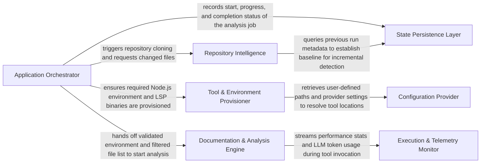
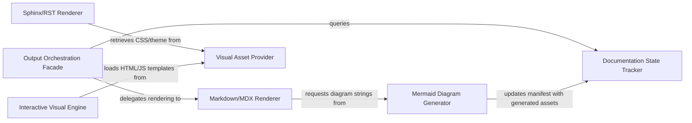
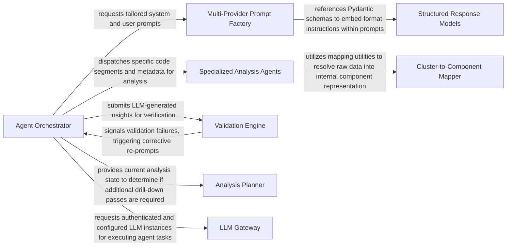
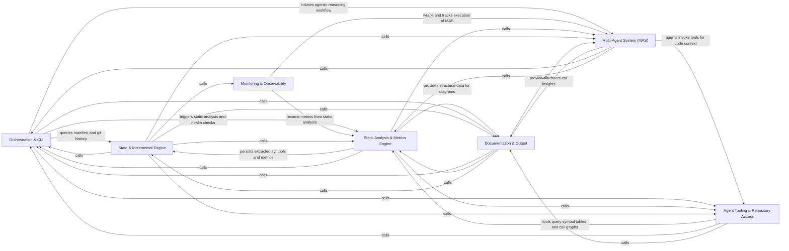

```mermaid
graph LR
    Project_Environment_Scanner["Project Environment Scanner"]
    LSP_Client_Provider["LSP Client Provider"]
    Call_Graph_Builder["Call Graph Builder"]
    Graph_Clustering_Engine["Graph Clustering Engine"]
    Code_Quality_Analyzer["Code Quality Analyzer"]
    Analysis_Result_Manager["Analysis Result Manager"]
    Project_Environment_Scanner -- "identifies technology stack, triggering initialization" --> LSP_Client_Provider
    LSP_Client_Provider -- "feeds semantic symbols and references" --> Call_Graph_Builder
    Call_Graph_Builder -- "provides raw graph topology" --> Graph_Clustering_Engine
    Graph_Clustering_Engine -- "provides clustered boundaries" --> Code_Quality_Analyzer
    Call_Graph_Builder -- "provides reachability data" --> Code_Quality_Analyzer
    Code_Quality_Analyzer -- "outputs health reports and diagnostics" --> Analysis_Result_Manager
    LSP_Client_Provider -- "sends direct file‑level diagnostics and symbol metadata" --> Analysis_Result_Manager
```

[](https://github.com/CodeBoarding/CodeBoarding)[](https://www.codeboarding.org/diagrams)[](mailto:contact@codeboarding.org)

## Details

Manages the overall application lifecycle, including project initialization, repository operations (cloning, updating), change detection, and orchestrating the analysis workflow. It also handles the initial setup and environment configuration for the analysis tools.

### Application Orchestrator
The central controller that parses CLI arguments, manages the high‑level execution pipeline, and sequences environment checks, repository updates, and analysis tasks.


**Related Classes/Methods**:

- `repos.codeboarding.main.main`
- `repos.codeboarding.orchestrator.Orchestrator`


### Repository Intelligence
Handles Git operations and incremental change detection. It normalizes file paths and applies exclusion patterns (.gitignore) to provide a filtered set of files for analysis.


**Related Classes/Methods**:

- `repos.codeboarding.repository.RepositoryManager`
- `repos.codeboarding.repository.ChangeDetector`
- `repos.codeboarding.repository.WorkspaceFilter`


### Tool & Environment Provisioner
Bootstraps the execution environment by managing nodeenv, downloading LSP binaries, and resolving cross‑platform executable paths for the analysis tools.


**Related Classes/Methods**:

- `repos.codeboarding.tools.ToolRegistry`
- `repos.codeboarding.environment.NodeEnvManager`
- `repos.codeboarding.tools.LSPResolver`


### Documentation & Analysis Engine
The core processing unit that transforms raw static analysis data into hierarchical component maps, renders Mermaid.js diagrams, and generates final Markdown documentation.


**Related Classes/Methods**:

- `repos.codeboarding.engine.AnalysisEngine`
- `repos.codeboarding.renderer.MarkdownRenderer`
- `repos.codeboarding.renderer.MermaidGenerator`


### Execution & Telemetry Monitor
Intercepts tool and LLM calls to track performance metrics, token usage, and execution logs, providing real‑time observability into the agentic workflow.


**Related Classes/Methods**:

- `repos.codeboarding.telemetry.TelemetryMonitor`
- `repos.codeboarding.telemetry.TokenTracker`
- `repos.codeboarding.logging.ExecutionLogger`


### State Persistence Layer
Manages the DuckDB database to store job statuses, analysis metadata, and historical run data, enabling resumability and incremental processing.


**Related Classes/Methods**:

- `repos.codeboarding.database.DuckDBManager`
- `repos.codeboarding.state.JobStateManager`


### Configuration Provider
Loads and validates user configurations (TOML), managing provider‑specific settings for LLMs and local tool paths.


**Related Classes/Methods**:

- `repos.codeboarding.config.UserConfig`
- `repos.codeboarding.config.ConfigLoader`


### [FAQ](https://github.com/CodeBoarding/GeneratedOnBoardings/tree/main?tab=readme-ov-file#faq)



[](https://github.com/CodeBoarding/CodeBoarding)[](https://www.codeboarding.org/diagrams)[](mailto:contact@codeboarding.org)

## Details

Transforms the processed analysis data and insights into user-friendly documentation formats (e.g., Markdown, HTML) and generates visual representations like architectural diagrams.

### Output Orchestration Facade
The central coordinator that selects and invokes specific renderers based on user configuration (Markdown, HTML, etc.) and queries the Documentation State Tracker for stale components.


**Related Classes/Methods**:

- `output_generators.sphinx.OutputOrchestrationFacade`


### Markdown/MDX Renderer
Transforms analysis insights into GitHub‑flavored Markdown and MDX for documentation portals, embedding diagram strings from the Mermaid Diagram Generator.


**Related Classes/Methods**:

- `output_generators.sphinx.MarkdownRenderer`


### Sphinx/RST Renderer
Generates reStructuredText files and integrates with the Sphinx documentation framework, pulling styling assets from the Visual Asset Provider.


**Related Classes/Methods**:

- `output_generators.sphinx.SphinxRenderer`


### Mermaid Diagram Generator
Translates graph‑based metadata into Mermaid.js syntax for architectural and flow diagrams, updating the manifest with generated assets.


**Related Classes/Methods**:

- `output_generators.sphinx.MermaidGenerator`


### Interactive Visual Engine
Populates HTML templates with scripts and raw graph data for interactive visualizations (e.g., Cytoscape).


**Related Classes/Methods**:

- `output_generators.sphinx.InteractiveEngine`


### Visual Asset Provider
Manages CSS, styling assets, and static templates required for consistent visual output across renderers.


**Related Classes/Methods**:

- `output_generators.sphinx.VisualAssetProvider`


### Documentation State Tracker
Interfaces with the Analysis Manifest to ensure incremental documentation updates and tracks file coverage, preventing redundant processing.


**Related Classes/Methods**:

- `output_generators.sphinx.DocumentationStateTracker`


### [FAQ](https://github.com/CodeBoarding/GeneratedOnBoardings/tree/main?tab=readme-ov-file#faq)

```mermaid
graph LR
    IncrementalUpdater["IncrementalUpdater"]
    AnalysisCache["AnalysisCache"]
    StateValidator["StateValidator"]
    ClusterChangeAnalyzer["ClusterChangeAnalyzer"]
    DependencyImpactMapper["DependencyImpactMapper"]
    DeltaTaskGenerator["DeltaTaskGenerator"]
    IncrementalUpdater -- "invokes to determine which files have physically changed since the last run" --> StateValidator
    StateValidator -- "retrieves historical hashes and metadata to perform delta detection" --> AnalysisCache
    IncrementalUpdater -- "passes the detected file deltas to assess high-level architectural impact" --> ClusterChangeAnalyzer
    ClusterChangeAnalyzer -- "traces how low-level code changes propagate through the dependency graph" --> DependencyImpactMapper
    DependencyImpactMapper -- "queries the existing relationship graph to reconstruct the "blast zone" of a change" --> AnalysisCache
    IncrementalUpdater -- "provides the final list of affected entities to create a minimized analysis queue for the AI agents" --> DeltaTaskGenerator
```

[](https://github.com/CodeBoarding/CodeBoarding)[](https://www.codeboarding.org/diagrams)[](mailto:contact@codeboarding.org)

## Details

Optimizes analysis performance by managing the caching of static analysis results and orchestrating re-analysis only for changed parts of the codebase, ensuring efficiency and speed.

### IncrementalUpdater
The central orchestrator that manages the lifecycle of an incremental update. It coordinates between state validation, impact analysis, and task generation.


**Related Classes/Methods**:

- `repos.codeboarding.incremental.IncrementalUpdater`
- `repos.codeboarding.incremental.IncrementalUpdater.run_update`
- `repos.codeboarding.incremental.IncrementalUpdater._identify_changes`


### AnalysisCache
Manages the persistence and retrieval of previous analysis results, including file hashes, metadata, and the existing architectural graph stored in DuckDB.


**Related Classes/Methods**:

- `repos.codeboarding.incremental.AnalysisCache`
- `repos.codeboarding.incremental.AnalysisCache.get_metadata`
- `repos.codeboarding.incremental.AnalysisCache.save_state`
- `repos.codeboarding.incremental.AnalysisCache.query_hashes`


### StateValidator
Performs granular comparison of current file system states against the AnalysisCache to identify added, modified, or deleted files.


**Related Classes/Methods**:

- `repos.codeboarding.incremental.StateValidator`
- `repos.codeboarding.incremental.StateValidator.validate_hashes`
- `repos.codeboarding.incremental.StateValidator.detect_deltas`


### ClusterChangeAnalyzer
Evaluates logical groupings (clusters) of code to determine if a change in one module necessitates the re-analysis of its parent or sibling clusters.


**Related Classes/Methods**:

- `repos.codeboarding.incremental.ClusterChangeAnalyzer`
- `repos.codeboarding.incremental.ClusterChangeAnalyzer.analyze_impact`
- `repos.codeboarding.incremental.ClusterChangeAnalyzer.get_affected_clusters`


### DependencyImpactMapper
Maps code-level changes to the high-level architectural graph to identify "blast zones"—unchanged areas that require documentation updates due to dependency shifts.


**Related Classes/Methods**:

- `repos.codeboarding.incremental.DependencyImpactMapper`
- `repos.codeboarding.incremental.DependencyImpactMapper.map_dependencies`
- `repos.codeboarding.incremental.DependencyImpactMapper.calculate_blast_zone`


### DeltaTaskGenerator
Translates the identified impact areas into a prioritized execution plan for the Static Analysis Engine and AI Agents.


**Related Classes/Methods**:

- `repos.codeboarding.incremental.DeltaTaskGenerator`
- `repos.codeboarding.incremental.DeltaTaskGenerator.generate_tasks`
- `repos.codeboarding.incremental.DeltaTaskGenerator.prioritize_queue`


### [FAQ](https://github.com/CodeBoarding/GeneratedOnBoardings/tree/main?tab=readme-ov-file#faq)



[](https://github.com/CodeBoarding/CodeBoarding)[](https://www.codeboarding.org/diagrams)[](mailto:contact@codeboarding.org)

## Details

The intelligent core responsible for driving the code analysis and documentation generation using large language models. It orchestrates agent workflows, manages interactions with various tools, and structures the analysis insights.

### Agent Orchestrator
The central coordinator (CodeBoardingAgent) that manages the analysis lifecycle, initializes LLM providers, and dispatches tasks to specialized agents.


**Related Classes/Methods**:

- `agents.codeboarding_agent.CodeBoardingAgent`


### Specialized Analysis Agents
A suite of domain‑specific agents (AbstractionAgent, DetailsAgent, MetaAgent) that analyze code for architectural patterns, low‑level logic, and project‑wide context.


**Related Classes/Methods**:

- `agents.specialized_agents.AbstractionAgent`
- `agents.specialized_agents.DetailsAgent`
- `agents.specialized_agents.MetaAgent`


### Multi-Provider Prompt Factory
Generates provider‑specific instructions (Claude, Gemini, GPT) to ensure consistent agent behavior across different LLM backends.


**Related Classes/Methods**:

- `agents.prompts.factory.PromptFactory`
- `agents.prompts.gemini_flash_prompts`


### Validation Engine
A quality‑gate component that verifies LLM outputs against static analysis data to ensure every code cluster is correctly mapped and relationships are consistent.


**Related Classes/Methods**:

- `agents.validation.ValidationEngine`


### Analysis Planner
Strategic component that determines the depth of analysis, identifying which components require further "drill‑down" or expansion based on initial findings.


**Related Classes/Methods**:

- `agents.planner_agent.PlannerAgent`


### LLM Gateway
Manages API configurations, model selection, and the initialization of LangChain‑compatible clients for various providers.


**Related Classes/Methods**:

- `agents.llm_config.LLMGateway`


### Structured Response Models
Pydantic‑based schemas (e.g., AnalysisInsights) that define the strict data contract for all LLM communications.


**Related Classes/Methods**:

- `agents.models.AnalysisInsights`


### Cluster-to-Component Mapper
Provides the logic (ClusterMethodsMixin) to translate raw CFG clusters and file paths into logical architectural components.


**Related Classes/Methods**:

- `agents.mixins.cluster_methods.ClusterMethodsMixin`


### [FAQ](https://github.com/CodeBoarding/GeneratedOnBoardings/tree/main?tab=readme-ov-file#faq)



[](https://github.com/CodeBoarding/CodeBoarding)[](https://www.codeboarding.org/diagrams)[](mailto:contact@codeboarding.org)

## Details

Performs deep structural and behavioral analysis of the codebase across multiple programming languages. It extracts information like call graphs, code structure, and identifies code quality issues, including unused code.

### Project Environment Scanner
Detects project structures (Maven, Gradle, TSConfig) and identifies programming languages to configure the analysis environment.


**Related Classes/Methods**:

- `java_config_scanner.ProjectEnvironmentScanner`


### LSP Client Provider
Orchestrates communication with language‑specific servers to extract semantic symbols, diagnostics, and file‑level metadata.


**Related Classes/Methods**:

- `LSPClient`:65-1750
- `JavaClient`:26-517
- `TypeScriptClient`:10-235


### Call Graph Builder
Constructs a global structural topology by linking symbols across files, identifying behavioral dependencies.


**Related Classes/Methods**:

- `static_analyzer.java_config_scanner.CallGraphBuilder`


### Graph Clustering Engine
Applies adaptive clustering algorithms to the call graph to group code into logical, high‑level functional modules.


**Related Classes/Methods**:

- `adaptive_clustering`:240-303
- `ClusterResult`:13-32


### Code Quality Analyzer
Performs deep behavioral analysis to identify dead (unused) code and structural smells such as God Classes or high coupling.


**Related Classes/Methods**:

- `UnusedCodeAnalyzer`
- `HealthCheckRunner`


### Analysis Result Manager
Serializes findings into a unified model and manages the AnalysisCache to enable incremental re‑analysis.


**Related Classes/Methods**:

- `StaticAnalysisResults`:53-269
- `ResultPersistenceManager`


### [FAQ](https://github.com/CodeBoarding/GeneratedOnBoardings/tree/main?tab=readme-ov-file#faq)



[](https://github.com/CodeBoarding/CodeBoarding)[](https://www.codeboarding.org/diagrams)[](mailto:contact@codeboarding.org)

## Details

The CodeBoarding system is an AI-powered documentation generator that orchestrates a hybrid analysis pipeline, combining deterministic data from Language Server Protocol (LSP) engines with probabilistic reasoning from a Multi-Agent System (MAS). The workflow begins with the Orchestration & CLI layer, which manages environment setup and triggers the Static Analysis & Metrics Engine to extract symbols and health metrics. These insights are persisted by the State & Incremental Engine to support efficient re-analysis. The Multi-Agent System (MAS) then uses a plan-execute pattern, leveraging Agent Tooling & Repository Access to gather code context and synthesize high-level architectural descriptions. Finally, the Documentation & Output component aggregates all findings into interactive diagrams and Markdown documentation, while Monitoring & Observability tracks the entire execution for performance and cost auditing.

### Orchestration & CLI
Central entrypoint that manages lifecycle, CLI parsing, environment setup, and coordinates workflow across static analysis, MAS, and documentation generation.


**Related Classes/Methods**:

- `main.generate_analysis`:48-67
- `diagram_analysis.diagram_generator.DiagramGenerator`:45-512
- `core.plugin_loader.load_plugins`:16-45


**Source Files:**

- [`constants.py`](https://github.com/CodeBoarding/CodeBoarding/blob/main/.codeboardingconstants.py)
  - `constants.AppConfig` ([L3-L7](https://github.com/CodeBoarding/CodeBoarding/blob/main/.codeboardingconstants.py#L3-L7)) - Class
- [`core/__init__.py`](https://github.com/CodeBoarding/CodeBoarding/blob/main/.codeboardingcore/__init__.py)
  - `core.__init__.Registries` ([L28-L36](https://github.com/CodeBoarding/CodeBoarding/blob/main/.codeboardingcore/__init__.py#L28-L36)) - Class
  - `core.__init__.Registries.__init__` ([L34-L36](https://github.com/CodeBoarding/CodeBoarding/blob/main/.codeboardingcore/__init__.py#L34-L36)) - Method
  - `core.__init__.__init__` ([L34-L36](https://github.com/CodeBoarding/CodeBoarding/blob/main/.codeboardingcore/__init__.py#L34-L36)) - Method
  - `core.__init__.get_registries` ([L42-L47](https://github.com/CodeBoarding/CodeBoarding/blob/main/.codeboardingcore/__init__.py#L42-L47)) - Function
  - `core.__init__.reset_registries` ([L50-L53](https://github.com/CodeBoarding/CodeBoarding/blob/main/.codeboardingcore/__init__.py#L50-L53)) - Function
  - `core.__init__.run_plugin_health_checks` ([L56-L72](https://github.com/CodeBoarding/CodeBoarding/blob/main/.codeboardingcore/__init__.py#L56-L72)) - Function
  - `core.__init__.load_plugin_tools` ([L75-L87](https://github.com/CodeBoarding/CodeBoarding/blob/main/.codeboardingcore/__init__.py#L75-L87)) - Function
- [`core/plugin_loader.py`](https://github.com/CodeBoarding/CodeBoarding/blob/main/.codeboardingcore/plugin_loader.py)
  - `core.plugin_loader.load_plugins` ([L16-L45](https://github.com/CodeBoarding/CodeBoarding/blob/main/.codeboardingcore/plugin_loader.py#L16-L45)) - Function
- [`core/registry.py`](https://github.com/CodeBoarding/CodeBoarding/blob/main/.codeboardingcore/registry.py)
  - `core.registry.DuplicateRegistrationError` ([L7-L8](https://github.com/CodeBoarding/CodeBoarding/blob/main/.codeboardingcore/registry.py#L7-L8)) - Class
  - `core.registry.Registry` ([L11-L45](https://github.com/CodeBoarding/CodeBoarding/blob/main/.codeboardingcore/registry.py#L11-L45)) - Class
  - `core.registry.Registry.__init__` ([L19-L21](https://github.com/CodeBoarding/CodeBoarding/blob/main/.codeboardingcore/registry.py#L19-L21)) - Method
  - `core.registry.__init__` ([L19-L21](https://github.com/CodeBoarding/CodeBoarding/blob/main/.codeboardingcore/registry.py#L19-L21)) - Method
  - `core.registry.Registry.register` ([L23-L28](https://github.com/CodeBoarding/CodeBoarding/blob/main/.codeboardingcore/registry.py#L23-L28)) - Method
  - `core.registry.register` ([L23-L28](https://github.com/CodeBoarding/CodeBoarding/blob/main/.codeboardingcore/registry.py#L23-L28)) - Method
  - `core.registry.Registry.get` ([L30-L32](https://github.com/CodeBoarding/CodeBoarding/blob/main/.codeboardingcore/registry.py#L30-L32)) - Method
  - `core.registry.get` ([L30-L32](https://github.com/CodeBoarding/CodeBoarding/blob/main/.codeboardingcore/registry.py#L30-L32)) - Method
  - `core.registry.Registry.all` ([L34-L36](https://github.com/CodeBoarding/CodeBoarding/blob/main/.codeboardingcore/registry.py#L34-L36)) - Method
  - `core.registry.all` ([L34-L36](https://github.com/CodeBoarding/CodeBoarding/blob/main/.codeboardingcore/registry.py#L34-L36)) - Method
  - `core.registry.Registry.__len__` ([L38-L39](https://github.com/CodeBoarding/CodeBoarding/blob/main/.codeboardingcore/registry.py#L38-L39)) - Method
  - `core.registry.__len__` ([L38-L39](https://github.com/CodeBoarding/CodeBoarding/blob/main/.codeboardingcore/registry.py#L38-L39)) - Method
  - `core.registry.Registry.__contains__` ([L41-L42](https://github.com/CodeBoarding/CodeBoarding/blob/main/.codeboardingcore/registry.py#L41-L42)) - Method
  - `core.registry.__contains__` ([L41-L42](https://github.com/CodeBoarding/CodeBoarding/blob/main/.codeboardingcore/registry.py#L41-L42)) - Method
  - `core.registry.Registry.__repr__` ([L44-L45](https://github.com/CodeBoarding/CodeBoarding/blob/main/.codeboardingcore/registry.py#L44-L45)) - Method
  - `core.registry.__repr__` ([L44-L45](https://github.com/CodeBoarding/CodeBoarding/blob/main/.codeboardingcore/registry.py#L44-L45)) - Method
- [`diagram_analysis/diagram_generator.py`](https://github.com/CodeBoarding/CodeBoarding/blob/main/.codeboardingdiagram_analysis/diagram_generator.py)
  - `diagram_analysis.diagram_generator.DiagramGenerator.pre_analysis.get_static_with_injected_analyzer` ([L172-L174](https://github.com/CodeBoarding/CodeBoarding/blob/main/.codeboardingdiagram_analysis/diagram_generator.py#L172-L174)) - Function
  - `diagram_analysis.diagram_generator.DiagramGenerator.pre_analysis.get_static_with_new_analyzer` ([L176-L180](https://github.com/CodeBoarding/CodeBoarding/blob/main/.codeboardingdiagram_analysis/diagram_generator.py#L176-L180)) - Function
- [`github_action.py`](https://github.com/CodeBoarding/CodeBoarding/blob/main/.codeboardinggithub_action.py)
  - `github_action._load_all_analyses` ([L19-L43](https://github.com/CodeBoarding/CodeBoarding/blob/main/.codeboardinggithub_action.py#L19-L43)) - Function
  - `github_action.generate_markdown` ([L46-L59](https://github.com/CodeBoarding/CodeBoarding/blob/main/.codeboardinggithub_action.py#L46-L59)) - Function
  - `github_action.generate_html` ([L62-L73](https://github.com/CodeBoarding/CodeBoarding/blob/main/.codeboardinggithub_action.py#L62-L73)) - Function
  - `github_action.generate_mdx` ([L76-L89](https://github.com/CodeBoarding/CodeBoarding/blob/main/.codeboardinggithub_action.py#L76-L89)) - Function
  - `github_action.generate_rst` ([L92-L105](https://github.com/CodeBoarding/CodeBoarding/blob/main/.codeboardinggithub_action.py#L92-L105)) - Function
  - `github_action._seed_existing_analysis` ([L108-L114](https://github.com/CodeBoarding/CodeBoarding/blob/main/.codeboardinggithub_action.py#L108-L114)) - Function
  - `github_action.generate_analysis` ([L117-L168](https://github.com/CodeBoarding/CodeBoarding/blob/main/.codeboardinggithub_action.py#L117-L168)) - Function
- [`health/config.py`](https://github.com/CodeBoarding/CodeBoarding/blob/main/.codeboardinghealth/config.py)
  - `health.config._initialize_template` ([L75-L82](https://github.com/CodeBoarding/CodeBoarding/blob/main/.codeboardinghealth/config.py#L75-L82)) - Function
  - `health.config.initialize_health_dir` ([L85-L96](https://github.com/CodeBoarding/CodeBoarding/blob/main/.codeboardinghealth/config.py#L85-L96)) - Function
  - `health.config._load_health_exclude_patterns` ([L99-L124](https://github.com/CodeBoarding/CodeBoarding/blob/main/.codeboardinghealth/config.py#L99-L124)) - Function
  - `health.config.load_health_config` ([L127-L171](https://github.com/CodeBoarding/CodeBoarding/blob/main/.codeboardinghealth/config.py#L127-L171)) - Function
- [`health/constants.py`](https://github.com/CodeBoarding/CodeBoarding/blob/main/.codeboardinghealth/constants.py)
  - `health.constants.HealthConfig` ([L3-L18](https://github.com/CodeBoarding/CodeBoarding/blob/main/.codeboardinghealth/constants.py#L3-L18)) - Class
- [`health_main.py`](https://github.com/CodeBoarding/CodeBoarding/blob/main/.codeboardinghealth_main.py)
  - `health_main.run_health_check_local` ([L27-L47](https://github.com/CodeBoarding/CodeBoarding/blob/main/.codeboardinghealth_main.py#L27-L47)) - Function
  - `health_main.run_health_check_remote` ([L50-L69](https://github.com/CodeBoarding/CodeBoarding/blob/main/.codeboardinghealth_main.py#L50-L69)) - Function
  - `health_main._run_health_checks` ([L72-L92](https://github.com/CodeBoarding/CodeBoarding/blob/main/.codeboardinghealth_main.py#L72-L92)) - Function
  - `health_main.main` ([L95-L146](https://github.com/CodeBoarding/CodeBoarding/blob/main/.codeboardinghealth_main.py#L95-L146)) - Function
- [`install.py`](https://github.com/CodeBoarding/CodeBoarding/blob/main/.codeboardinginstall.py)
  - `install.LanguageSupportCheck` ([L30-L46](https://github.com/CodeBoarding/CodeBoarding/blob/main/.codeboardinginstall.py#L30-L46)) - Class
  - `install.LanguageSupportCheck.evaluate` ([L38-L46](https://github.com/CodeBoarding/CodeBoarding/blob/main/.codeboardinginstall.py#L38-L46)) - Method
  - `install.evaluate` ([L38-L46](https://github.com/CodeBoarding/CodeBoarding/blob/main/.codeboardinginstall.py#L38-L46)) - Method
  - `install.check_npm` ([L49-L69](https://github.com/CodeBoarding/CodeBoarding/blob/main/.codeboardinginstall.py#L49-L69)) - Function
  - `install.bootstrapped_npm_cli_path` ([L72-L74](https://github.com/CodeBoarding/CodeBoarding/blob/main/.codeboardinginstall.py#L72-L74)) - Function
  - `install.extract_tarball_safely` ([L77-L85](https://github.com/CodeBoarding/CodeBoarding/blob/main/.codeboardinginstall.py#L77-L85)) - Function
  - `install.bootstrap_npm` ([L88-L137](https://github.com/CodeBoarding/CodeBoarding/blob/main/.codeboardinginstall.py#L88-L137)) - Function
  - `install.is_non_interactive_mode` ([L140-L142](https://github.com/CodeBoarding/CodeBoarding/blob/main/.codeboardinginstall.py#L140-L142)) - Function
  - `install.resolve_missing_npm` ([L145-L170](https://github.com/CodeBoarding/CodeBoarding/blob/main/.codeboardinginstall.py#L145-L170)) - Function
  - `install.resolve_npm_availability` ([L173-L180](https://github.com/CodeBoarding/CodeBoarding/blob/main/.codeboardinginstall.py#L173-L180)) - Function
  - `install.parse_args` ([L183-L196](https://github.com/CodeBoarding/CodeBoarding/blob/main/.codeboardinginstall.py#L183-L196)) - Function
  - `install.get_platform_bin_dir` ([L199-L201](https://github.com/CodeBoarding/CodeBoarding/blob/main/.codeboardinginstall.py#L199-L201)) - Function
  - `install.install_node_servers` ([L204-L229](https://github.com/CodeBoarding/CodeBoarding/blob/main/.codeboardinginstall.py#L204-L229)) - Function
  - `install.verify_binary` ([L236-L261](https://github.com/CodeBoarding/CodeBoarding/blob/main/.codeboardinginstall.py#L236-L261)) - Function
  - `install.install_vcpp_redistributable` ([L264-L331](https://github.com/CodeBoarding/CodeBoarding/blob/main/.codeboardinginstall.py#L264-L331)) - Function
  - `install.resolve_missing_vcpp` ([L334-L357](https://github.com/CodeBoarding/CodeBoarding/blob/main/.codeboardinginstall.py#L334-L357)) - Function
  - `install.download_binaries` ([L360-L389](https://github.com/CodeBoarding/CodeBoarding/blob/main/.codeboardinginstall.py#L360-L389)) - Function
  - `install.download_jdtls` ([L392-L400](https://github.com/CodeBoarding/CodeBoarding/blob/main/.codeboardinginstall.py#L392-L400)) - Function
  - `install.install_pre_commit_hooks` ([L403-L438](https://github.com/CodeBoarding/CodeBoarding/blob/main/.codeboardinginstall.py#L403-L438)) - Function
  - `install.print_language_support_summary` ([L441-L508](https://github.com/CodeBoarding/CodeBoarding/blob/main/.codeboardinginstall.py#L441-L508)) - Function
  - `install.run_install` ([L511-L533](https://github.com/CodeBoarding/CodeBoarding/blob/main/.codeboardinginstall.py#L511-L533)) - Function
  - `install.main` ([L536-L554](https://github.com/CodeBoarding/CodeBoarding/blob/main/.codeboardinginstall.py#L536-L554)) - Function
- [`logging_config.py`](https://github.com/CodeBoarding/CodeBoarding/blob/main/.codeboardinglogging_config.py)
  - `logging_config.setup_logging` ([L7-L98](https://github.com/CodeBoarding/CodeBoarding/blob/main/.codeboardinglogging_config.py#L7-L98)) - Function
- [`main.py`](https://github.com/CodeBoarding/CodeBoarding/blob/main/.codeboardingmain.py)
  - `main.onboarding_materials_exist` ([L39-L45](https://github.com/CodeBoarding/CodeBoarding/blob/main/.codeboardingmain.py#L39-L45)) - Function
  - `main.generate_analysis` ([L48-L67](https://github.com/CodeBoarding/CodeBoarding/blob/main/.codeboardingmain.py#L48-L67)) - Function
  - `main.generate_markdown_docs` ([L70-L115](https://github.com/CodeBoarding/CodeBoarding/blob/main/.codeboardingmain.py#L70-L115)) - Function
  - `main.partial_update` ([L118-L172](https://github.com/CodeBoarding/CodeBoarding/blob/main/.codeboardingmain.py#L118-L172)) - Function
  - `main.generate_docs_remote` ([L175-L193](https://github.com/CodeBoarding/CodeBoarding/blob/main/.codeboardingmain.py#L175-L193)) - Function
  - `main.process_remote_repository` ([L196-L251](https://github.com/CodeBoarding/CodeBoarding/blob/main/.codeboardingmain.py#L196-L251)) - Function
  - `main.process_local_repository` ([L254-L300](https://github.com/CodeBoarding/CodeBoarding/blob/main/.codeboardingmain.py#L254-L300)) - Function
  - `main.copy_files` ([L303-L319](https://github.com/CodeBoarding/CodeBoarding/blob/main/.codeboardingmain.py#L303-L319)) - Function
  - `main.validate_arguments` ([L322-L332](https://github.com/CodeBoarding/CodeBoarding/blob/main/.codeboardingmain.py#L322-L332)) - Function
  - `main.define_cli_arguments` ([L335-L384](https://github.com/CodeBoarding/CodeBoarding/blob/main/.codeboardingmain.py#L335-L384)) - Function
  - `main.main` ([L387-L521](https://github.com/CodeBoarding/CodeBoarding/blob/main/.codeboardingmain.py#L387-L521)) - Function
- [`monitoring/paths.py`](https://github.com/CodeBoarding/CodeBoarding/blob/main/.codeboardingmonitoring/paths.py)
  - `monitoring.paths.get_monitoring_base_dir` ([L7-L8](https://github.com/CodeBoarding/CodeBoarding/blob/main/.codeboardingmonitoring/paths.py#L7-L8)) - Function
  - `monitoring.paths.get_monitoring_run_dir` ([L11-L18](https://github.com/CodeBoarding/CodeBoarding/blob/main/.codeboardingmonitoring/paths.py#L11-L18)) - Function
  - `monitoring.paths.generate_run_id` ([L21-L23](https://github.com/CodeBoarding/CodeBoarding/blob/main/.codeboardingmonitoring/paths.py#L21-L23)) - Function
  - `monitoring.paths.get_latest_run_dir` ([L26-L46](https://github.com/CodeBoarding/CodeBoarding/blob/main/.codeboardingmonitoring/paths.py#L26-L46)) - Function
- [`repo_utils/__init__.py`](https://github.com/CodeBoarding/CodeBoarding/blob/main/.codeboardingrepo_utils/__init__.py)
  - `repo_utils.__init__.require_git_import` ([L29-L56](https://github.com/CodeBoarding/CodeBoarding/blob/main/.codeboardingrepo_utils/__init__.py#L29-L56)) - Function
  - `repo_utils.__init__.decorator` ([L36-L54](https://github.com/CodeBoarding/CodeBoarding/blob/main/.codeboardingrepo_utils/__init__.py#L36-L54)) - Function
  - `repo_utils.__init__.wrapper` ([L38-L52](https://github.com/CodeBoarding/CodeBoarding/blob/main/.codeboardingrepo_utils/__init__.py#L38-L52)) - Function
  - `repo_utils.__init__.require_git_import.decorator.wrapper` ([L38-L52](https://github.com/CodeBoarding/CodeBoarding/blob/main/.codeboardingrepo_utils/__init__.py#L38-L52)) - Function
  - `repo_utils.__init__.sanitize_repo_url` ([L59-L73](https://github.com/CodeBoarding/CodeBoarding/blob/main/.codeboardingrepo_utils/__init__.py#L59-L73)) - Function
  - `repo_utils.__init__.remote_repo_exists` ([L77-L88](https://github.com/CodeBoarding/CodeBoarding/blob/main/.codeboardingrepo_utils/__init__.py#L77-L88)) - Function
  - `repo_utils.__init__.get_repo_name` ([L91-L95](https://github.com/CodeBoarding/CodeBoarding/blob/main/.codeboardingrepo_utils/__init__.py#L91-L95)) - Function
  - `repo_utils.__init__.clone_repository` ([L99-L121](https://github.com/CodeBoarding/CodeBoarding/blob/main/.codeboardingrepo_utils/__init__.py#L99-L121)) - Function
  - `repo_utils.__init__.checkout_repo` ([L125-L132](https://github.com/CodeBoarding/CodeBoarding/blob/main/.codeboardingrepo_utils/__init__.py#L125-L132)) - Function
  - `repo_utils.__init__.store_token` ([L135-L142](https://github.com/CodeBoarding/CodeBoarding/blob/main/.codeboardingrepo_utils/__init__.py#L135-L142)) - Function
  - `repo_utils.__init__.upload_onboarding_materials` ([L146-L175](https://github.com/CodeBoarding/CodeBoarding/blob/main/.codeboardingrepo_utils/__init__.py#L146-L175)) - Function
  - `repo_utils.__init__.get_git_commit_hash` ([L179-L184](https://github.com/CodeBoarding/CodeBoarding/blob/main/.codeboardingrepo_utils/__init__.py#L179-L184)) - Function
  - `repo_utils.__init__.is_repo_dirty` ([L188-L191](https://github.com/CodeBoarding/CodeBoarding/blob/main/.codeboardingrepo_utils/__init__.py#L188-L191)) - Function
  - `repo_utils.__init__.get_repo_state_hash` ([L195-L225](https://github.com/CodeBoarding/CodeBoarding/blob/main/.codeboardingrepo_utils/__init__.py#L195-L225)) - Function
  - `repo_utils.__init__.get_branch` ([L229-L234](https://github.com/CodeBoarding/CodeBoarding/blob/main/.codeboardingrepo_utils/__init__.py#L229-L234)) - Function
  - `repo_utils.__init__.normalize_path` ([L237-L263](https://github.com/CodeBoarding/CodeBoarding/blob/main/.codeboardingrepo_utils/__init__.py#L237-L263)) - Function
  - `repo_utils.__init__.normalize_paths` ([L266-L276](https://github.com/CodeBoarding/CodeBoarding/blob/main/.codeboardingrepo_utils/__init__.py#L266-L276)) - Function
- [`repo_utils/errors.py`](https://github.com/CodeBoarding/CodeBoarding/blob/main/.codeboardingrepo_utils/errors.py)
  - `repo_utils.errors.NoGithubTokenFoundError` ([L0-L1](https://github.com/CodeBoarding/CodeBoarding/blob/main/.codeboardingrepo_utils/errors.py#L0-L1)) - Class
  - `repo_utils.errors.RepoDontExistError` ([L4-L5](https://github.com/CodeBoarding/CodeBoarding/blob/main/.codeboardingrepo_utils/errors.py#L4-L5)) - Class
- [`static_analyzer/__init__.py`](https://github.com/CodeBoarding/CodeBoarding/blob/main/.codeboardingstatic_analyzer/__init__.py)
  - `static_analyzer.__init__._create_engine_configs` ([L28-L95](https://github.com/CodeBoarding/CodeBoarding/blob/main/.codeboardingstatic_analyzer/__init__.py#L28-L95)) - Function
  - `static_analyzer.__init__._lang_to_adapter_name` ([L98-L110](https://github.com/CodeBoarding/CodeBoarding/blob/main/.codeboardingstatic_analyzer/__init__.py#L98-L110)) - Function
  - `static_analyzer.__init__.StaticAnalyzer` ([L113-L431](https://github.com/CodeBoarding/CodeBoarding/blob/main/.codeboardingstatic_analyzer/__init__.py#L113-L431)) - Class
  - `static_analyzer.__init__.__init__` ([L116-L123](https://github.com/CodeBoarding/CodeBoarding/blob/main/.codeboardingstatic_analyzer/__init__.py#L116-L123)) - Method
  - `static_analyzer.__init__.__enter__` ([L125-L127](https://github.com/CodeBoarding/CodeBoarding/blob/main/.codeboardingstatic_analyzer/__init__.py#L125-L127)) - Method
  - `static_analyzer.__init__.__exit__` ([L129-L130](https://github.com/CodeBoarding/CodeBoarding/blob/main/.codeboardingstatic_analyzer/__init__.py#L129-L130)) - Method
  - `static_analyzer.__init__.start_clients` ([L132-L178](https://github.com/CodeBoarding/CodeBoarding/blob/main/.codeboardingstatic_analyzer/__init__.py#L132-L178)) - Method
  - `static_analyzer.__init__.stop_clients` ([L180-L190](https://github.com/CodeBoarding/CodeBoarding/blob/main/.codeboardingstatic_analyzer/__init__.py#L180-L190)) - Method
  - `static_analyzer.__init__.notify_file_changed` ([L192-L208](https://github.com/CodeBoarding/CodeBoarding/blob/main/.codeboardingstatic_analyzer/__init__.py#L192-L208)) - Method
  - `static_analyzer.__init__.analyze` ([L210-L297](https://github.com/CodeBoarding/CodeBoarding/blob/main/.codeboardingstatic_analyzer/__init__.py#L210-L297)) - Method
  - `static_analyzer.__init__._run_full_analysis` ([L299-L333](https://github.com/CodeBoarding/CodeBoarding/blob/main/.codeboardingstatic_analyzer/__init__.py#L299-L333)) - Method
  - `static_analyzer.__init__._save_initial_cache` ([L335-L351](https://github.com/CodeBoarding/CodeBoarding/blob/main/.codeboardingstatic_analyzer/__init__.py#L335-L351)) - Method
  - `static_analyzer.__init__.analyze_with_cluster_changes` ([L353-L417](https://github.com/CodeBoarding/CodeBoarding/blob/main/.codeboardingstatic_analyzer/__init__.py#L353-L417)) - Method
  - `static_analyzer.__init__._dict_to_static_results` ([L419-L431](https://github.com/CodeBoarding/CodeBoarding/blob/main/.codeboardingstatic_analyzer/__init__.py#L419-L431)) - Method
  - `static_analyzer.__init__.get_static_analysis` ([L434-L454](https://github.com/CodeBoarding/CodeBoarding/blob/main/.codeboardingstatic_analyzer/__init__.py#L434-L454)) - Function
- [`static_analyzer/engine/adapters/__init__.py`](https://github.com/CodeBoarding/CodeBoarding/blob/main/.codeboardingstatic_analyzer/engine/adapters/__init__.py)
  - `static_analyzer.engine.adapters.__init__.get_adapter` ([L21-L26](https://github.com/CodeBoarding/CodeBoarding/blob/main/.codeboardingstatic_analyzer/engine/adapters/__init__.py#L21-L26)) - Function
  - `static_analyzer.engine.adapters.__init__.get_all_adapters` ([L29-L31](https://github.com/CodeBoarding/CodeBoarding/blob/main/.codeboardingstatic_analyzer/engine/adapters/__init__.py#L29-L31)) - Function
- [`static_analyzer/engine/lsp_constants.py`](https://github.com/CodeBoarding/CodeBoarding/blob/main/.codeboardingstatic_analyzer/engine/lsp_constants.py)
  - `static_analyzer.engine.lsp_constants.EdgeStrategy` ([L28-L32](https://github.com/CodeBoarding/CodeBoarding/blob/main/.codeboardingstatic_analyzer/engine/lsp_constants.py#L28-L32)) - Class
- [`static_analyzer/programming_language.py`](https://github.com/CodeBoarding/CodeBoarding/blob/main/.codeboardingstatic_analyzer/programming_language.py)
  - `static_analyzer.programming_language.LanguageConfig` ([L10-L13](https://github.com/CodeBoarding/CodeBoarding/blob/main/.codeboardingstatic_analyzer/programming_language.py#L10-L13)) - Class
  - `static_analyzer.programming_language.JavaConfig` ([L16-L19](https://github.com/CodeBoarding/CodeBoarding/blob/main/.codeboardingstatic_analyzer/programming_language.py#L16-L19)) - Class
  - `static_analyzer.programming_language.ProgrammingLanguage` ([L22-L74](https://github.com/CodeBoarding/CodeBoarding/blob/main/.codeboardingstatic_analyzer/programming_language.py#L22-L74)) - Class
  - `static_analyzer.programming_language.ProgrammingLanguage.__init__` ([L23-L41](https://github.com/CodeBoarding/CodeBoarding/blob/main/.codeboardingstatic_analyzer/programming_language.py#L23-L41)) - Method
  - `static_analyzer.programming_language.__init__` ([L23-L41](https://github.com/CodeBoarding/CodeBoarding/blob/main/.codeboardingstatic_analyzer/programming_language.py#L23-L41)) - Method
  - `static_analyzer.programming_language.ProgrammingLanguage.get_suffix_pattern` ([L43-L48](https://github.com/CodeBoarding/CodeBoarding/blob/main/.codeboardingstatic_analyzer/programming_language.py#L43-L48)) - Method
  - `static_analyzer.programming_language.get_suffix_pattern` ([L43-L48](https://github.com/CodeBoarding/CodeBoarding/blob/main/.codeboardingstatic_analyzer/programming_language.py#L43-L48)) - Method
  - `static_analyzer.programming_language.ProgrammingLanguage.get_language_id` ([L50-L52](https://github.com/CodeBoarding/CodeBoarding/blob/main/.codeboardingstatic_analyzer/programming_language.py#L50-L52)) - Method
  - `static_analyzer.programming_language.get_language_id` ([L50-L52](https://github.com/CodeBoarding/CodeBoarding/blob/main/.codeboardingstatic_analyzer/programming_language.py#L50-L52)) - Method
  - `static_analyzer.programming_language.ProgrammingLanguage.get_server_parameters` ([L54-L60](https://github.com/CodeBoarding/CodeBoarding/blob/main/.codeboardingstatic_analyzer/programming_language.py#L54-L60)) - Method
  - `static_analyzer.programming_language.get_server_parameters` ([L54-L60](https://github.com/CodeBoarding/CodeBoarding/blob/main/.codeboardingstatic_analyzer/programming_language.py#L54-L60)) - Method
  - `static_analyzer.programming_language.ProgrammingLanguage.is_supported_lang` ([L62-L63](https://github.com/CodeBoarding/CodeBoarding/blob/main/.codeboardingstatic_analyzer/programming_language.py#L62-L63)) - Method
  - `static_analyzer.programming_language.is_supported_lang` ([L62-L63](https://github.com/CodeBoarding/CodeBoarding/blob/main/.codeboardingstatic_analyzer/programming_language.py#L62-L63)) - Method
  - `static_analyzer.programming_language.ProgrammingLanguage.__hash__` ([L65-L66](https://github.com/CodeBoarding/CodeBoarding/blob/main/.codeboardingstatic_analyzer/programming_language.py#L65-L66)) - Method
  - `static_analyzer.programming_language.__hash__` ([L65-L66](https://github.com/CodeBoarding/CodeBoarding/blob/main/.codeboardingstatic_analyzer/programming_language.py#L65-L66)) - Method
  - `static_analyzer.programming_language.ProgrammingLanguage.__eq__` ([L68-L71](https://github.com/CodeBoarding/CodeBoarding/blob/main/.codeboardingstatic_analyzer/programming_language.py#L68-L71)) - Method
  - `static_analyzer.programming_language.__eq__` ([L68-L71](https://github.com/CodeBoarding/CodeBoarding/blob/main/.codeboardingstatic_analyzer/programming_language.py#L68-L71)) - Method
  - `static_analyzer.programming_language.ProgrammingLanguage.__str__` ([L73-L74](https://github.com/CodeBoarding/CodeBoarding/blob/main/.codeboardingstatic_analyzer/programming_language.py#L73-L74)) - Method
  - `static_analyzer.programming_language.__str__` ([L73-L74](https://github.com/CodeBoarding/CodeBoarding/blob/main/.codeboardingstatic_analyzer/programming_language.py#L73-L74)) - Method
  - `static_analyzer.programming_language.ProgrammingLanguageBuilder` ([L77-L151](https://github.com/CodeBoarding/CodeBoarding/blob/main/.codeboardingstatic_analyzer/programming_language.py#L77-L151)) - Class
  - `static_analyzer.programming_language.ProgrammingLanguageBuilder.__init__` ([L80-L88](https://github.com/CodeBoarding/CodeBoarding/blob/main/.codeboardingstatic_analyzer/programming_language.py#L80-L88)) - Method
  - `static_analyzer.programming_language.ProgrammingLanguageBuilder._find_lsp_server_key` ([L90-L113](https://github.com/CodeBoarding/CodeBoarding/blob/main/.codeboardingstatic_analyzer/programming_language.py#L90-L113)) - Method
  - `static_analyzer.programming_language._find_lsp_server_key` ([L90-L113](https://github.com/CodeBoarding/CodeBoarding/blob/main/.codeboardingstatic_analyzer/programming_language.py#L90-L113)) - Method
  - `static_analyzer.programming_language.ProgrammingLanguageBuilder.build` ([L115-L148](https://github.com/CodeBoarding/CodeBoarding/blob/main/.codeboardingstatic_analyzer/programming_language.py#L115-L148)) - Method
  - `static_analyzer.programming_language.build` ([L115-L148](https://github.com/CodeBoarding/CodeBoarding/blob/main/.codeboardingstatic_analyzer/programming_language.py#L115-L148)) - Method
  - `static_analyzer.programming_language.ProgrammingLanguageBuilder.get_supported_extensions` ([L150-L151](https://github.com/CodeBoarding/CodeBoarding/blob/main/.codeboardingstatic_analyzer/programming_language.py#L150-L151)) - Method
  - `static_analyzer.programming_language.get_supported_extensions` ([L150-L151](https://github.com/CodeBoarding/CodeBoarding/blob/main/.codeboardingstatic_analyzer/programming_language.py#L150-L151)) - Method
- [`static_analyzer/scanner.py`](https://github.com/CodeBoarding/CodeBoarding/blob/main/.codeboardingstatic_analyzer/scanner.py)
  - `static_analyzer.scanner.ProjectScanner.__init__` ([L13-L15](https://github.com/CodeBoarding/CodeBoarding/blob/main/.codeboardingstatic_analyzer/scanner.py#L13-L15)) - Method
  - `static_analyzer.scanner.ProjectScanner.scan` ([L17-L76](https://github.com/CodeBoarding/CodeBoarding/blob/main/.codeboardingstatic_analyzer/scanner.py#L17-L76)) - Method
  - `static_analyzer.scanner.ProjectScanner._extract_suffixes` ([L79-L94](https://github.com/CodeBoarding/CodeBoarding/blob/main/.codeboardingstatic_analyzer/scanner.py#L79-L94)) - Method
- [`static_analyzer/typescript_config_scanner.py`](https://github.com/CodeBoarding/CodeBoarding/blob/main/.codeboardingstatic_analyzer/typescript_config_scanner.py)
  - `static_analyzer.typescript_config_scanner.TypeScriptConfigScanner` ([L9-L53](https://github.com/CodeBoarding/CodeBoarding/blob/main/.codeboardingstatic_analyzer/typescript_config_scanner.py#L9-L53)) - Class
  - `static_analyzer.typescript_config_scanner.TypeScriptConfigScanner.__init__` ([L17-L19](https://github.com/CodeBoarding/CodeBoarding/blob/main/.codeboardingstatic_analyzer/typescript_config_scanner.py#L17-L19)) - Method
  - `static_analyzer.typescript_config_scanner.__init__` ([L17-L19](https://github.com/CodeBoarding/CodeBoarding/blob/main/.codeboardingstatic_analyzer/typescript_config_scanner.py#L17-L19)) - Method
  - `static_analyzer.typescript_config_scanner.TypeScriptConfigScanner.find_typescript_projects` ([L21-L53](https://github.com/CodeBoarding/CodeBoarding/blob/main/.codeboardingstatic_analyzer/typescript_config_scanner.py#L21-L53)) - Method
  - `static_analyzer.typescript_config_scanner.find_typescript_projects` ([L21-L53](https://github.com/CodeBoarding/CodeBoarding/blob/main/.codeboardingstatic_analyzer/typescript_config_scanner.py#L21-L53)) - Method
- [`tests/agents/tools/test_external_deps.py`](https://github.com/CodeBoarding/CodeBoarding/blob/main/.codeboardingtests/agents/tools/test_external_deps.py)
  - `tests.agents.tools.test_external_deps.TestExternalDepsTool` ([L10-L134](https://github.com/CodeBoarding/CodeBoarding/blob/main/.codeboardingtests/agents/tools/test_external_deps.py#L10-L134)) - Class
  - `tests.agents.tools.test_external_deps.setUp` ([L12-L16](https://github.com/CodeBoarding/CodeBoarding/blob/main/.codeboardingtests/agents/tools/test_external_deps.py#L12-L16)) - Method
  - `tests.agents.tools.test_external_deps.tearDown` ([L18-L20](https://github.com/CodeBoarding/CodeBoarding/blob/main/.codeboardingtests/agents/tools/test_external_deps.py#L18-L20)) - Method
  - `tests.agents.tools.test_external_deps.test_find_python_deps` ([L22-L32](https://github.com/CodeBoarding/CodeBoarding/blob/main/.codeboardingtests/agents/tools/test_external_deps.py#L22-L32)) - Method
  - `tests.agents.tools.test_external_deps.test_find_nodejs_deps` ([L34-L44](https://github.com/CodeBoarding/CodeBoarding/blob/main/.codeboardingtests/agents/tools/test_external_deps.py#L34-L44)) - Method
  - `tests.agents.tools.test_external_deps.test_find_in_subdirectories` ([L46-L57](https://github.com/CodeBoarding/CodeBoarding/blob/main/.codeboardingtests/agents/tools/test_external_deps.py#L46-L57)) - Method
  - `tests.agents.tools.test_external_deps.test_no_deps_found` ([L59-L66](https://github.com/CodeBoarding/CodeBoarding/blob/main/.codeboardingtests/agents/tools/test_external_deps.py#L59-L66)) - Method
  - `tests.agents.tools.test_external_deps.test_find_go_deps` ([L68-L77](https://github.com/CodeBoarding/CodeBoarding/blob/main/.codeboardingtests/agents/tools/test_external_deps.py#L68-L77)) - Method
  - `tests.agents.tools.test_external_deps.test_find_java_deps` ([L79-L88](https://github.com/CodeBoarding/CodeBoarding/blob/main/.codeboardingtests/agents/tools/test_external_deps.py#L79-L88)) - Method
  - `tests.agents.tools.test_external_deps.test_find_php_deps` ([L90-L99](https://github.com/CodeBoarding/CodeBoarding/blob/main/.codeboardingtests/agents/tools/test_external_deps.py#L90-L99)) - Method
  - `tests.agents.tools.test_external_deps.test_ignore_unsupported_rust_deps` ([L101-L108](https://github.com/CodeBoarding/CodeBoarding/blob/main/.codeboardingtests/agents/tools/test_external_deps.py#L101-L108)) - Method
  - `tests.agents.tools.test_external_deps.test_mixed_dependency_files` ([L110-L124](https://github.com/CodeBoarding/CodeBoarding/blob/main/.codeboardingtests/agents/tools/test_external_deps.py#L110-L124)) - Method
  - `tests.agents.tools.test_external_deps.test_readfile_suggestion` ([L126-L134](https://github.com/CodeBoarding/CodeBoarding/blob/main/.codeboardingtests/agents/tools/test_external_deps.py#L126-L134)) - Method
- [`tests/core/test_plugin_loader.py`](https://github.com/CodeBoarding/CodeBoarding/blob/main/.codeboardingtests/core/test_plugin_loader.py)
  - `tests.core.test_plugin_loader.test_load_plugins_no_plugins` ([L6-L11](https://github.com/CodeBoarding/CodeBoarding/blob/main/.codeboardingtests/core/test_plugin_loader.py#L6-L11)) - Function
  - `tests.core.test_plugin_loader.test_load_plugins_calls_init` ([L14-L28](https://github.com/CodeBoarding/CodeBoarding/blob/main/.codeboardingtests/core/test_plugin_loader.py#L14-L28)) - Function
  - `tests.core.test_plugin_loader.test_load_plugins_handles_import_failure` ([L31-L43](https://github.com/CodeBoarding/CodeBoarding/blob/main/.codeboardingtests/core/test_plugin_loader.py#L31-L43)) - Function
  - `tests.core.test_plugin_loader.test_load_plugins_handles_init_failure` ([L46-L59](https://github.com/CodeBoarding/CodeBoarding/blob/main/.codeboardingtests/core/test_plugin_loader.py#L46-L59)) - Function
  - `tests.core.test_plugin_loader.test_load_plugins_multiple_plugins` ([L62-L79](https://github.com/CodeBoarding/CodeBoarding/blob/main/.codeboardingtests/core/test_plugin_loader.py#L62-L79)) - Function
  - `tests.core.test_plugin_loader.test_entry_point_group_constant` ([L82-L84](https://github.com/CodeBoarding/CodeBoarding/blob/main/.codeboardingtests/core/test_plugin_loader.py#L82-L84)) - Function
- [`tests/core/test_registries.py`](https://github.com/CodeBoarding/CodeBoarding/blob/main/.codeboardingtests/core/test_registries.py)
  - `tests.core.test_registries.test_get_registries_returns_singleton` ([L4-L8](https://github.com/CodeBoarding/CodeBoarding/blob/main/.codeboardingtests/core/test_registries.py#L4-L8)) - Function
  - `tests.core.test_registries.test_reset_registries` ([L11-L16](https://github.com/CodeBoarding/CodeBoarding/blob/main/.codeboardingtests/core/test_registries.py#L11-L16)) - Function
  - `tests.core.test_registries.test_registries_has_expected_attributes` ([L19-L22](https://github.com/CodeBoarding/CodeBoarding/blob/main/.codeboardingtests/core/test_registries.py#L19-L22)) - Function
  - `tests.core.test_registries.test_registries_names` ([L25-L28](https://github.com/CodeBoarding/CodeBoarding/blob/main/.codeboardingtests/core/test_registries.py#L25-L28)) - Function
  - `tests.core.test_registries.test_registries_start_empty` ([L31-L34](https://github.com/CodeBoarding/CodeBoarding/blob/main/.codeboardingtests/core/test_registries.py#L31-L34)) - Function
- [`tests/core/test_registry.py`](https://github.com/CodeBoarding/CodeBoarding/blob/main/.codeboardingtests/core/test_registry.py)
  - `tests.core.test_registry.test_register_and_get` ([L5-L8](https://github.com/CodeBoarding/CodeBoarding/blob/main/.codeboardingtests/core/test_registry.py#L5-L8)) - Function
  - `tests.core.test_registry.test_get_missing_returns_none` ([L11-L13](https://github.com/CodeBoarding/CodeBoarding/blob/main/.codeboardingtests/core/test_registry.py#L11-L13)) - Function
  - `tests.core.test_registry.test_duplicate_raises` ([L16-L20](https://github.com/CodeBoarding/CodeBoarding/blob/main/.codeboardingtests/core/test_registry.py#L16-L20)) - Function
  - `tests.core.test_registry.test_all_returns_copy` ([L23-L31](https://github.com/CodeBoarding/CodeBoarding/blob/main/.codeboardingtests/core/test_registry.py#L23-L31)) - Function
  - `tests.core.test_registry.test_len` ([L34-L38](https://github.com/CodeBoarding/CodeBoarding/blob/main/.codeboardingtests/core/test_registry.py#L34-L38)) - Function
  - `tests.core.test_registry.test_contains` ([L41-L45](https://github.com/CodeBoarding/CodeBoarding/blob/main/.codeboardingtests/core/test_registry.py#L41-L45)) - Function
  - `tests.core.test_registry.test_repr` ([L48-L52](https://github.com/CodeBoarding/CodeBoarding/blob/main/.codeboardingtests/core/test_registry.py#L48-L52)) - Function
- [`tests/health/test_config.py`](https://github.com/CodeBoarding/CodeBoarding/blob/main/.codeboardingtests/health/test_config.py)
  - `tests.health.test_config.TestInitializeHealthDir.test_creates_both_files` ([L9-L25](https://github.com/CodeBoarding/CodeBoarding/blob/main/.codeboardingtests/health/test_config.py#L9-L25)) - Method
  - `tests.health.test_config.TestInitializeHealthDir.test_idempotent` ([L27-L49](https://github.com/CodeBoarding/CodeBoarding/blob/main/.codeboardingtests/health/test_config.py#L27-L49)) - Method
  - `tests.health.test_config.TestLoadHealthConfig.test_defaults_when_no_file` ([L53-L62](https://github.com/CodeBoarding/CodeBoarding/blob/main/.codeboardingtests/health/test_config.py#L53-L62)) - Method
  - `tests.health.test_config.TestLoadHealthConfig.test_partial_overrides` ([L64-L85](https://github.com/CodeBoarding/CodeBoarding/blob/main/.codeboardingtests/health/test_config.py#L64-L85)) - Method
  - `tests.health.test_config.TestLoadHealthConfig.test_falls_back_on_invalid_json` ([L87-L97](https://github.com/CodeBoarding/CodeBoarding/blob/main/.codeboardingtests/health/test_config.py#L87-L97)) - Method
  - `tests.health.test_config.TestLoadHealthConfig.test_falls_back_on_invalid_values` ([L99-L115](https://github.com/CodeBoarding/CodeBoarding/blob/main/.codeboardingtests/health/test_config.py#L99-L115)) - Method
  - `tests.health.test_config.TestLoadHealthConfig.test_merges_healthignore_patterns` ([L117-L136](https://github.com/CodeBoarding/CodeBoarding/blob/main/.codeboardingtests/health/test_config.py#L117-L136)) - Method
  - `tests.health.test_config.TestLoadHealthConfig.test_healthignore_patterns_without_config_json` ([L138-L148](https://github.com/CodeBoarding/CodeBoarding/blob/main/.codeboardingtests/health/test_config.py#L138-L148)) - Method
  - `tests.health.test_config.TestLoadHealthConfig.test_with_template_file` ([L150-L166](https://github.com/CodeBoarding/CodeBoarding/blob/main/.codeboardingtests/health/test_config.py#L150-L166)) - Method
- [`tests/integration/benchmark_static_analysis.py`](https://github.com/CodeBoarding/CodeBoarding/blob/main/.codeboardingtests/integration/benchmark_static_analysis.py)
  - `tests.integration.benchmark_static_analysis.do_worker.mock_scan` ([L265-L275](https://github.com/CodeBoarding/CodeBoarding/blob/main/.codeboardingtests/integration/benchmark_static_analysis.py#L265-L275)) - Function
- [`tests/integration/conftest.py`](https://github.com/CodeBoarding/CodeBoarding/blob/main/.codeboardingtests/integration/conftest.py)
  - `tests.integration.conftest.RepositoryTestConfig` ([L24-L32](https://github.com/CodeBoarding/CodeBoarding/blob/main/.codeboardingtests/integration/conftest.py#L24-L32)) - Class
  - `tests.integration.conftest.create_mock_scanner` ([L131-L170](https://github.com/CodeBoarding/CodeBoarding/blob/main/.codeboardingtests/integration/conftest.py#L131-L170)) - Function
  - `tests.integration.conftest.create_mock_scanner._mock_scan` ([L141-L168](https://github.com/CodeBoarding/CodeBoarding/blob/main/.codeboardingtests/integration/conftest.py#L141-L168)) - Function
  - `tests.integration.conftest._mock_scan` ([L141-L168](https://github.com/CodeBoarding/CodeBoarding/blob/main/.codeboardingtests/integration/conftest.py#L141-L168)) - Function
  - `tests.integration.conftest.load_fixture` ([L173-L184](https://github.com/CodeBoarding/CodeBoarding/blob/main/.codeboardingtests/integration/conftest.py#L173-L184)) - Function
  - `tests.integration.conftest.extract_metrics` ([L187-L229](https://github.com/CodeBoarding/CodeBoarding/blob/main/.codeboardingtests/integration/conftest.py#L187-L229)) - Function
  - `tests.integration.conftest.pytest_addoption` ([L232-L238](https://github.com/CodeBoarding/CodeBoarding/blob/main/.codeboardingtests/integration/conftest.py#L232-L238)) - Function
  - `tests.integration.conftest.temp_workspace` ([L242-L245](https://github.com/CodeBoarding/CodeBoarding/blob/main/.codeboardingtests/integration/conftest.py#L242-L245)) - Function
- [`tests/integration/generate_integration_fixtures.py`](https://github.com/CodeBoarding/CodeBoarding/blob/main/.codeboardingtests/integration/generate_integration_fixtures.py)
  - `tests.integration.generate_integration_fixtures.generate_fixture` ([L45-L114](https://github.com/CodeBoarding/CodeBoarding/blob/main/.codeboardingtests/integration/generate_integration_fixtures.py#L45-L114)) - Function
  - `tests.integration.generate_integration_fixtures.save_fixture` ([L117-L134](https://github.com/CodeBoarding/CodeBoarding/blob/main/.codeboardingtests/integration/generate_integration_fixtures.py#L117-L134)) - Function
  - `tests.integration.generate_integration_fixtures.main` ([L137-L231](https://github.com/CodeBoarding/CodeBoarding/blob/main/.codeboardingtests/integration/generate_integration_fixtures.py#L137-L231)) - Function
- [`tests/integration/health/test_health_integration.py`](https://github.com/CodeBoarding/CodeBoarding/blob/main/.codeboardingtests/integration/health/test_health_integration.py)
  - `tests.integration.health.test_health_integration._mock_project_scanner_scan` ([L44-L63](https://github.com/CodeBoarding/CodeBoarding/blob/main/.codeboardingtests/integration/health/test_health_integration.py#L44-L63)) - Function
  - `tests.integration.health.test_health_integration._normalize_cycle` ([L66-L89](https://github.com/CodeBoarding/CodeBoarding/blob/main/.codeboardingtests/integration/health/test_health_integration.py#L66-L89)) - Function
  - `tests.integration.health.test_health_integration._normalize_report` ([L92-L130](https://github.com/CodeBoarding/CodeBoarding/blob/main/.codeboardingtests/integration/health/test_health_integration.py#L92-L130)) - Function
  - `tests.integration.health.test_health_integration.TestHealthCheckIntegration` ([L136-L272](https://github.com/CodeBoarding/CodeBoarding/blob/main/.codeboardingtests/integration/health/test_health_integration.py#L136-L272)) - Class
  - `tests.integration.health.test_health_integration.TestHealthCheckIntegration.test_health_report_matches_fixture` ([L139-L272](https://github.com/CodeBoarding/CodeBoarding/blob/main/.codeboardingtests/integration/health/test_health_integration.py#L139-L272)) - Method
  - `tests.integration.health.test_health_integration.test_health_report_matches_fixture` ([L139-L272](https://github.com/CodeBoarding/CodeBoarding/blob/main/.codeboardingtests/integration/health/test_health_integration.py#L139-L272)) - Method
- [`tests/integration/test_lsp_analysis_for_edge_cases.py`](https://github.com/CodeBoarding/CodeBoarding/blob/main/.codeboardingtests/integration/test_lsp_analysis_for_edge_cases.py)
  - `tests.integration.test_lsp_analysis_for_edge_cases.EdgeCaseProject` ([L41-L48](https://github.com/CodeBoarding/CodeBoarding/blob/main/.codeboardingtests/integration/test_lsp_analysis_for_edge_cases.py#L41-L48)) - Class
  - `tests.integration.test_lsp_analysis_for_edge_cases.AnalysisRunData` ([L52-L58](https://github.com/CodeBoarding/CodeBoarding/blob/main/.codeboardingtests/integration/test_lsp_analysis_for_edge_cases.py#L52-L58)) - Class
  - `tests.integration.test_lsp_analysis_for_edge_cases._load_fixture` ([L101-L103](https://github.com/CodeBoarding/CodeBoarding/blob/main/.codeboardingtests/integration/test_lsp_analysis_for_edge_cases.py#L101-L103)) - Function
  - `tests.integration.test_lsp_analysis_for_edge_cases._generate_fixture_params` ([L116-L124](https://github.com/CodeBoarding/CodeBoarding/blob/main/.codeboardingtests/integration/test_lsp_analysis_for_edge_cases.py#L116-L124)) - Function
  - `tests.integration.test_lsp_analysis_for_edge_cases.analysis` ([L128-L153](https://github.com/CodeBoarding/CodeBoarding/blob/main/.codeboardingtests/integration/test_lsp_analysis_for_edge_cases.py#L128-L153)) - Function
  - `tests.integration.test_lsp_analysis_for_edge_cases.TestEdgeCases` ([L157-L332](https://github.com/CodeBoarding/CodeBoarding/blob/main/.codeboardingtests/integration/test_lsp_analysis_for_edge_cases.py#L157-L332)) - Class
  - `tests.integration.test_lsp_analysis_for_edge_cases.test_language_detected` ([L165-L168](https://github.com/CodeBoarding/CodeBoarding/blob/main/.codeboardingtests/integration/test_lsp_analysis_for_edge_cases.py#L165-L168)) - Method
  - `tests.integration.test_lsp_analysis_for_edge_cases.test_expected_references` ([L170-L184](https://github.com/CodeBoarding/CodeBoarding/blob/main/.codeboardingtests/integration/test_lsp_analysis_for_edge_cases.py#L170-L184)) - Method
  - `tests.integration.test_lsp_analysis_for_edge_cases.test_expected_classes_in_hierarchy` ([L187-L199](https://github.com/CodeBoarding/CodeBoarding/blob/main/.codeboardingtests/integration/test_lsp_analysis_for_edge_cases.py#L187-L199)) - Method
  - `tests.integration.test_lsp_analysis_for_edge_cases.test_inheritance_relationships` ([L202-L230](https://github.com/CodeBoarding/CodeBoarding/blob/main/.codeboardingtests/integration/test_lsp_analysis_for_edge_cases.py#L202-L230)) - Method
  - `tests.integration.test_lsp_analysis_for_edge_cases.test_call_graph_edges` ([L232-L244](https://github.com/CodeBoarding/CodeBoarding/blob/main/.codeboardingtests/integration/test_lsp_analysis_for_edge_cases.py#L232-L244)) - Method
  - `tests.integration.test_lsp_analysis_for_edge_cases.test_package_dependencies` ([L246-L282](https://github.com/CodeBoarding/CodeBoarding/blob/main/.codeboardingtests/integration/test_lsp_analysis_for_edge_cases.py#L246-L282)) - Method
  - `tests.integration.test_lsp_analysis_for_edge_cases.test_source_files` ([L284-L298](https://github.com/CodeBoarding/CodeBoarding/blob/main/.codeboardingtests/integration/test_lsp_analysis_for_edge_cases.py#L284-L298)) - Method
  - `tests.integration.test_lsp_analysis_for_edge_cases.test_stability_across_runs` ([L300-L332](https://github.com/CodeBoarding/CodeBoarding/blob/main/.codeboardingtests/integration/test_lsp_analysis_for_edge_cases.py#L300-L332)) - Method
  - `tests.integration.test_lsp_analysis_for_edge_cases._compute_metrics` ([L303-L317](https://github.com/CodeBoarding/CodeBoarding/blob/main/.codeboardingtests/integration/test_lsp_analysis_for_edge_cases.py#L303-L317)) - Function
  - `tests.integration.test_lsp_analysis_for_edge_cases.TestEdgeCases.test_stability_across_runs._compute_metrics` ([L303-L317](https://github.com/CodeBoarding/CodeBoarding/blob/main/.codeboardingtests/integration/test_lsp_analysis_for_edge_cases.py#L303-L317)) - Function
- [`tests/integration/test_static_analysis_consistency.py`](https://github.com/CodeBoarding/CodeBoarding/blob/main/.codeboardingtests/integration/test_static_analysis_consistency.py)
  - `tests.integration.test_static_analysis_consistency.TestStaticAnalysisConsistency.test_static_analysis_matches_fixture` ([L181-L288](https://github.com/CodeBoarding/CodeBoarding/blob/main/.codeboardingtests/integration/test_static_analysis_consistency.py#L181-L288)) - Method
  - `tests.integration.test_static_analysis_consistency.TestStaticAnalysisConsistency._check_metric_within_tolerance` ([L290-L323](https://github.com/CodeBoarding/CodeBoarding/blob/main/.codeboardingtests/integration/test_static_analysis_consistency.py#L290-L323)) - Method
  - `tests.integration.test_static_analysis_consistency.TestStaticAnalysisConsistency._display_metric_comparison` ([L325-L337](https://github.com/CodeBoarding/CodeBoarding/blob/main/.codeboardingtests/integration/test_static_analysis_consistency.py#L325-L337)) - Method
  - `tests.integration.test_static_analysis_consistency.TestStaticAnalysisConsistency._verify_sample_entities_present` ([L339-L359](https://github.com/CodeBoarding/CodeBoarding/blob/main/.codeboardingtests/integration/test_static_analysis_consistency.py#L339-L359)) - Method
  - `tests.integration.test_static_analysis_consistency.TestStaticAnalysisConsistency._verify_sample_classes_present` ([L361-L375](https://github.com/CodeBoarding/CodeBoarding/blob/main/.codeboardingtests/integration/test_static_analysis_consistency.py#L361-L375)) - Method
- [`tests/output_generators/test_output_generators.py`](https://github.com/CodeBoarding/CodeBoarding/blob/main/.codeboardingtests/output_generators/test_output_generators.py)
  - `tests.output_generators.test_output_generators.TestOutputGeneratorsSanitize.test_sanitize_alphanumeric` ([L28-L31](https://github.com/CodeBoarding/CodeBoarding/blob/main/.codeboardingtests/output_generators/test_output_generators.py#L28-L31)) - Method
  - `tests.output_generators.test_output_generators.TestOutputGeneratorsSanitize.test_sanitize_with_spaces` ([L33-L36](https://github.com/CodeBoarding/CodeBoarding/blob/main/.codeboardingtests/output_generators/test_output_generators.py#L33-L36)) - Method
  - `tests.output_generators.test_output_generators.TestOutputGeneratorsSanitize.test_sanitize_with_special_chars` ([L38-L41](https://github.com/CodeBoarding/CodeBoarding/blob/main/.codeboardingtests/output_generators/test_output_generators.py#L38-L41)) - Method
  - `tests.output_generators.test_output_generators.TestOutputGeneratorsSanitize.test_sanitize_multiple_special_chars` ([L43-L46](https://github.com/CodeBoarding/CodeBoarding/blob/main/.codeboardingtests/output_generators/test_output_generators.py#L43-L46)) - Method
- [`tests/repo_utils/test_cache_invalidation.py`](https://github.com/CodeBoarding/CodeBoarding/blob/main/.codeboardingtests/repo_utils/test_cache_invalidation.py)
  - `tests.repo_utils.test_cache_invalidation.TestCacheInvalidationWithIgnorePatterns.test_state_hash_ignores_test_directory_untracked` ([L13-L39](https://github.com/CodeBoarding/CodeBoarding/blob/main/.codeboardingtests/repo_utils/test_cache_invalidation.py#L13-L39)) - Method
  - `tests.repo_utils.test_cache_invalidation.TestCacheInvalidationWithIgnorePatterns.test_state_hash_changes_with_source_untracked` ([L42-L60](https://github.com/CodeBoarding/CodeBoarding/blob/main/.codeboardingtests/repo_utils/test_cache_invalidation.py#L42-L60)) - Method
- [`tests/repo_utils/test_repo_utils.py`](https://github.com/CodeBoarding/CodeBoarding/blob/main/.codeboardingtests/repo_utils/test_repo_utils.py)
  - `tests.repo_utils.test_repo_utils.TestRepoUtils` ([L5-L78](https://github.com/CodeBoarding/CodeBoarding/blob/main/.codeboardingtests/repo_utils/test_repo_utils.py#L5-L78)) - Class
  - `tests.repo_utils.test_repo_utils.TestRepoUtils.test_sanitize_https_url_with_git` ([L7-L11](https://github.com/CodeBoarding/CodeBoarding/blob/main/.codeboardingtests/repo_utils/test_repo_utils.py#L7-L11)) - Method
  - `tests.repo_utils.test_repo_utils.test_sanitize_https_url_with_git` ([L7-L11](https://github.com/CodeBoarding/CodeBoarding/blob/main/.codeboardingtests/repo_utils/test_repo_utils.py#L7-L11)) - Method
  - `tests.repo_utils.test_repo_utils.TestRepoUtils.test_sanitize_https_url_without_git` ([L13-L17](https://github.com/CodeBoarding/CodeBoarding/blob/main/.codeboardingtests/repo_utils/test_repo_utils.py#L13-L17)) - Method
  - `tests.repo_utils.test_repo_utils.test_sanitize_https_url_without_git` ([L13-L17](https://github.com/CodeBoarding/CodeBoarding/blob/main/.codeboardingtests/repo_utils/test_repo_utils.py#L13-L17)) - Method
  - `tests.repo_utils.test_repo_utils.TestRepoUtils.test_sanitize_http_url` ([L19-L23](https://github.com/CodeBoarding/CodeBoarding/blob/main/.codeboardingtests/repo_utils/test_repo_utils.py#L19-L23)) - Method
  - `tests.repo_utils.test_repo_utils.test_sanitize_http_url` ([L19-L23](https://github.com/CodeBoarding/CodeBoarding/blob/main/.codeboardingtests/repo_utils/test_repo_utils.py#L19-L23)) - Method
  - `tests.repo_utils.test_repo_utils.TestRepoUtils.test_sanitize_ssh_url_git_format` ([L25-L29](https://github.com/CodeBoarding/CodeBoarding/blob/main/.codeboardingtests/repo_utils/test_repo_utils.py#L25-L29)) - Method
  - `tests.repo_utils.test_repo_utils.test_sanitize_ssh_url_git_format` ([L25-L29](https://github.com/CodeBoarding/CodeBoarding/blob/main/.codeboardingtests/repo_utils/test_repo_utils.py#L25-L29)) - Method
  - `tests.repo_utils.test_repo_utils.TestRepoUtils.test_sanitize_ssh_url_protocol` ([L31-L35](https://github.com/CodeBoarding/CodeBoarding/blob/main/.codeboardingtests/repo_utils/test_repo_utils.py#L31-L35)) - Method
  - `tests.repo_utils.test_repo_utils.test_sanitize_ssh_url_protocol` ([L31-L35](https://github.com/CodeBoarding/CodeBoarding/blob/main/.codeboardingtests/repo_utils/test_repo_utils.py#L31-L35)) - Method
  - `tests.repo_utils.test_repo_utils.TestRepoUtils.test_sanitize_invalid_url` ([L37-L42](https://github.com/CodeBoarding/CodeBoarding/blob/main/.codeboardingtests/repo_utils/test_repo_utils.py#L37-L42)) - Method
  - `tests.repo_utils.test_repo_utils.test_sanitize_invalid_url` ([L37-L42](https://github.com/CodeBoarding/CodeBoarding/blob/main/.codeboardingtests/repo_utils/test_repo_utils.py#L37-L42)) - Method
  - `tests.repo_utils.test_repo_utils.TestRepoUtils.test_sanitize_plain_text` ([L44-L48](https://github.com/CodeBoarding/CodeBoarding/blob/main/.codeboardingtests/repo_utils/test_repo_utils.py#L44-L48)) - Method
  - `tests.repo_utils.test_repo_utils.test_sanitize_plain_text` ([L44-L48](https://github.com/CodeBoarding/CodeBoarding/blob/main/.codeboardingtests/repo_utils/test_repo_utils.py#L44-L48)) - Method
  - `tests.repo_utils.test_repo_utils.TestRepoUtils.test_get_repo_name_https` ([L50-L54](https://github.com/CodeBoarding/CodeBoarding/blob/main/.codeboardingtests/repo_utils/test_repo_utils.py#L50-L54)) - Method
  - `tests.repo_utils.test_repo_utils.test_get_repo_name_https` ([L50-L54](https://github.com/CodeBoarding/CodeBoarding/blob/main/.codeboardingtests/repo_utils/test_repo_utils.py#L50-L54)) - Method
  - `tests.repo_utils.test_repo_utils.TestRepoUtils.test_get_repo_name_with_git_suffix` ([L56-L60](https://github.com/CodeBoarding/CodeBoarding/blob/main/.codeboardingtests/repo_utils/test_repo_utils.py#L56-L60)) - Method
  - `tests.repo_utils.test_repo_utils.test_get_repo_name_with_git_suffix` ([L56-L60](https://github.com/CodeBoarding/CodeBoarding/blob/main/.codeboardingtests/repo_utils/test_repo_utils.py#L56-L60)) - Method
  - `tests.repo_utils.test_repo_utils.TestRepoUtils.test_get_repo_name_ssh` ([L62-L66](https://github.com/CodeBoarding/CodeBoarding/blob/main/.codeboardingtests/repo_utils/test_repo_utils.py#L62-L66)) - Method
  - `tests.repo_utils.test_repo_utils.test_get_repo_name_ssh` ([L62-L66](https://github.com/CodeBoarding/CodeBoarding/blob/main/.codeboardingtests/repo_utils/test_repo_utils.py#L62-L66)) - Method
  - `tests.repo_utils.test_repo_utils.TestRepoUtils.test_get_repo_name_trailing_slash` ([L68-L72](https://github.com/CodeBoarding/CodeBoarding/blob/main/.codeboardingtests/repo_utils/test_repo_utils.py#L68-L72)) - Method
  - `tests.repo_utils.test_repo_utils.test_get_repo_name_trailing_slash` ([L68-L72](https://github.com/CodeBoarding/CodeBoarding/blob/main/.codeboardingtests/repo_utils/test_repo_utils.py#L68-L72)) - Method
  - `tests.repo_utils.test_repo_utils.TestRepoUtils.test_get_repo_name_complex` ([L74-L78](https://github.com/CodeBoarding/CodeBoarding/blob/main/.codeboardingtests/repo_utils/test_repo_utils.py#L74-L78)) - Method
  - `tests.repo_utils.test_repo_utils.test_get_repo_name_complex` ([L74-L78](https://github.com/CodeBoarding/CodeBoarding/blob/main/.codeboardingtests/repo_utils/test_repo_utils.py#L74-L78)) - Method
- [`tests/static_analyzer/test_utils.py`](https://github.com/CodeBoarding/CodeBoarding/blob/main/.codeboardingtests/static_analyzer/test_utils.py)
  - `tests.static_analyzer.test_utils.TestUtils.test_cfg_generation_error` ([L13-L15](https://github.com/CodeBoarding/CodeBoarding/blob/main/.codeboardingtests/static_analyzer/test_utils.py#L13-L15)) - Method
  - `tests.static_analyzer.test_utils.TestUtils.test_create_temp_repo_folder` ([L17-L25](https://github.com/CodeBoarding/CodeBoarding/blob/main/.codeboardingtests/static_analyzer/test_utils.py#L17-L25)) - Method
  - `tests.static_analyzer.test_utils.TestUtils.test_remove_temp_repo_folder_success` ([L27-L31](https://github.com/CodeBoarding/CodeBoarding/blob/main/.codeboardingtests/static_analyzer/test_utils.py#L27-L31)) - Method
  - `tests.static_analyzer.test_utils.TestUtils.test_remove_temp_repo_folder_outside_temp_raises_error` ([L33-L36](https://github.com/CodeBoarding/CodeBoarding/blob/main/.codeboardingtests/static_analyzer/test_utils.py#L33-L36)) - Method
  - `tests.static_analyzer.test_utils.TestUtils.test_remove_temp_repo_folder_relative_path_outside_temp` ([L38-L40](https://github.com/CodeBoarding/CodeBoarding/blob/main/.codeboardingtests/static_analyzer/test_utils.py#L38-L40)) - Method
  - `tests.static_analyzer.test_utils.TestUtils.test_get_config_returns_lsp_servers` ([L42-L49](https://github.com/CodeBoarding/CodeBoarding/blob/main/.codeboardingtests/static_analyzer/test_utils.py#L42-L49)) - Method
  - `tests.static_analyzer.test_utils.TestUtils.test_get_config_missing_key_raises` ([L51-L56](https://github.com/CodeBoarding/CodeBoarding/blob/main/.codeboardingtests/static_analyzer/test_utils.py#L51-L56)) - Method
- [`tests/test_github_action.py`](https://github.com/CodeBoarding/CodeBoarding/blob/main/.codeboardingtests/test_github_action.py)
  - `tests.test_github_action._write_analysis_file` ([L24-L28](https://github.com/CodeBoarding/CodeBoarding/blob/main/.codeboardingtests/test_github_action.py#L24-L28)) - Function
  - `tests.test_github_action.TestGenerateMarkdown` ([L31-L107](https://github.com/CodeBoarding/CodeBoarding/blob/main/.codeboardingtests/test_github_action.py#L31-L107)) - Class
  - `tests.test_github_action.TestGenerateMarkdown.test_generate_markdown_with_analysis_file` ([L33-L54](https://github.com/CodeBoarding/CodeBoarding/blob/main/.codeboardingtests/test_github_action.py#L33-L54)) - Method
  - `tests.test_github_action.test_generate_markdown_with_analysis_file` ([L33-L54](https://github.com/CodeBoarding/CodeBoarding/blob/main/.codeboardingtests/test_github_action.py#L33-L54)) - Method
  - `tests.test_github_action.TestGenerateMarkdown.test_generate_markdown_with_components` ([L57-L107](https://github.com/CodeBoarding/CodeBoarding/blob/main/.codeboardingtests/test_github_action.py#L57-L107)) - Method
  - `tests.test_github_action.test_generate_markdown_with_components` ([L57-L107](https://github.com/CodeBoarding/CodeBoarding/blob/main/.codeboardingtests/test_github_action.py#L57-L107)) - Method
  - `tests.test_github_action.TestGenerateHtml` ([L110-L130](https://github.com/CodeBoarding/CodeBoarding/blob/main/.codeboardingtests/test_github_action.py#L110-L130)) - Class
  - `tests.test_github_action.TestGenerateHtml.test_generate_html_with_analysis_file` ([L112-L130](https://github.com/CodeBoarding/CodeBoarding/blob/main/.codeboardingtests/test_github_action.py#L112-L130)) - Method
  - `tests.test_github_action.test_generate_html_with_analysis_file` ([L112-L130](https://github.com/CodeBoarding/CodeBoarding/blob/main/.codeboardingtests/test_github_action.py#L112-L130)) - Method
  - `tests.test_github_action.TestGenerateMdx` ([L133-L154](https://github.com/CodeBoarding/CodeBoarding/blob/main/.codeboardingtests/test_github_action.py#L133-L154)) - Class
  - `tests.test_github_action.TestGenerateMdx.test_generate_mdx_with_analysis_file` ([L135-L154](https://github.com/CodeBoarding/CodeBoarding/blob/main/.codeboardingtests/test_github_action.py#L135-L154)) - Method
  - `tests.test_github_action.test_generate_mdx_with_analysis_file` ([L135-L154](https://github.com/CodeBoarding/CodeBoarding/blob/main/.codeboardingtests/test_github_action.py#L135-L154)) - Method
  - `tests.test_github_action.TestGenerateRst` ([L157-L178](https://github.com/CodeBoarding/CodeBoarding/blob/main/.codeboardingtests/test_github_action.py#L157-L178)) - Class
  - `tests.test_github_action.TestGenerateRst.test_generate_rst_with_analysis_file` ([L159-L178](https://github.com/CodeBoarding/CodeBoarding/blob/main/.codeboardingtests/test_github_action.py#L159-L178)) - Method
  - `tests.test_github_action.test_generate_rst_with_analysis_file` ([L159-L178](https://github.com/CodeBoarding/CodeBoarding/blob/main/.codeboardingtests/test_github_action.py#L159-L178)) - Method
  - `tests.test_github_action.TestGenerateAnalysis` ([L181-L412](https://github.com/CodeBoarding/CodeBoarding/blob/main/.codeboardingtests/test_github_action.py#L181-L412)) - Class
  - `tests.test_github_action.TestGenerateAnalysis.test_generate_analysis_markdown` ([L188-L236](https://github.com/CodeBoarding/CodeBoarding/blob/main/.codeboardingtests/test_github_action.py#L188-L236)) - Method
  - `tests.test_github_action.test_generate_analysis_markdown` ([L188-L236](https://github.com/CodeBoarding/CodeBoarding/blob/main/.codeboardingtests/test_github_action.py#L188-L236)) - Method
  - `tests.test_github_action.TestGenerateAnalysis.test_generate_analysis_html` ([L244-L271](https://github.com/CodeBoarding/CodeBoarding/blob/main/.codeboardingtests/test_github_action.py#L244-L271)) - Method
  - `tests.test_github_action.test_generate_analysis_html` ([L244-L271](https://github.com/CodeBoarding/CodeBoarding/blob/main/.codeboardingtests/test_github_action.py#L244-L271)) - Method
  - `tests.test_github_action.TestGenerateAnalysis.test_generate_analysis_mdx` ([L279-L306](https://github.com/CodeBoarding/CodeBoarding/blob/main/.codeboardingtests/test_github_action.py#L279-L306)) - Method
  - `tests.test_github_action.test_generate_analysis_mdx` ([L279-L306](https://github.com/CodeBoarding/CodeBoarding/blob/main/.codeboardingtests/test_github_action.py#L279-L306)) - Method
  - `tests.test_github_action.TestGenerateAnalysis.test_generate_analysis_rst` ([L314-L341](https://github.com/CodeBoarding/CodeBoarding/blob/main/.codeboardingtests/test_github_action.py#L314-L341)) - Method
  - `tests.test_github_action.test_generate_analysis_rst` ([L314-L341](https://github.com/CodeBoarding/CodeBoarding/blob/main/.codeboardingtests/test_github_action.py#L314-L341)) - Method
  - `tests.test_github_action.TestGenerateAnalysis.test_generate_analysis_unsupported_extension` ([L348-L374](https://github.com/CodeBoarding/CodeBoarding/blob/main/.codeboardingtests/test_github_action.py#L348-L374)) - Method
  - `tests.test_github_action.test_generate_analysis_unsupported_extension` ([L348-L374](https://github.com/CodeBoarding/CodeBoarding/blob/main/.codeboardingtests/test_github_action.py#L348-L374)) - Method
  - `tests.test_github_action.TestGenerateAnalysis.test_generate_analysis_branch_checkout` ([L382-L412](https://github.com/CodeBoarding/CodeBoarding/blob/main/.codeboardingtests/test_github_action.py#L382-L412)) - Method
  - `tests.test_github_action.test_generate_analysis_branch_checkout` ([L382-L412](https://github.com/CodeBoarding/CodeBoarding/blob/main/.codeboardingtests/test_github_action.py#L382-L412)) - Method
- [`tests/test_install.py`](https://github.com/CodeBoarding/CodeBoarding/blob/main/.codeboardingtests/test_install.py)
  - `tests.test_install.TestParseArgs` ([L10-L19](https://github.com/CodeBoarding/CodeBoarding/blob/main/.codeboardingtests/test_install.py#L10-L19)) - Class
  - `tests.test_install.TestParseArgs.test_parse_args_defaults` ([L11-L14](https://github.com/CodeBoarding/CodeBoarding/blob/main/.codeboardingtests/test_install.py#L11-L14)) - Method
  - `tests.test_install.test_parse_args_defaults` ([L11-L14](https://github.com/CodeBoarding/CodeBoarding/blob/main/.codeboardingtests/test_install.py#L11-L14)) - Method
  - `tests.test_install.TestParseArgs.test_parse_args_auto_install_npm` ([L16-L19](https://github.com/CodeBoarding/CodeBoarding/blob/main/.codeboardingtests/test_install.py#L16-L19)) - Method
  - `tests.test_install.test_parse_args_auto_install_npm` ([L16-L19](https://github.com/CodeBoarding/CodeBoarding/blob/main/.codeboardingtests/test_install.py#L16-L19)) - Method
  - `tests.test_install.TestResolveMissingNpm` ([L22-L42](https://github.com/CodeBoarding/CodeBoarding/blob/main/.codeboardingtests/test_install.py#L22-L42)) - Class
  - `tests.test_install.TestResolveMissingNpm.test_auto_install_mode_bootstraps_npm` ([L24-L28](https://github.com/CodeBoarding/CodeBoarding/blob/main/.codeboardingtests/test_install.py#L24-L28)) - Method
  - `tests.test_install.test_auto_install_mode_bootstraps_npm` ([L24-L28](https://github.com/CodeBoarding/CodeBoarding/blob/main/.codeboardingtests/test_install.py#L24-L28)) - Method
  - `tests.test_install.TestResolveMissingNpm.test_non_interactive_falls_back_gracefully` ([L32-L36](https://github.com/CodeBoarding/CodeBoarding/blob/main/.codeboardingtests/test_install.py#L32-L36)) - Method
  - `tests.test_install.test_non_interactive_falls_back_gracefully` ([L32-L36](https://github.com/CodeBoarding/CodeBoarding/blob/main/.codeboardingtests/test_install.py#L32-L36)) - Method
  - `tests.test_install.TestResolveMissingNpm.test_auto_install_failure_degrades_gracefully` ([L39-L42](https://github.com/CodeBoarding/CodeBoarding/blob/main/.codeboardingtests/test_install.py#L39-L42)) - Method
  - `tests.test_install.test_auto_install_failure_degrades_gracefully` ([L39-L42](https://github.com/CodeBoarding/CodeBoarding/blob/main/.codeboardingtests/test_install.py#L39-L42)) - Method
  - `tests.test_install.TestResolveNpmAvailability` ([L45-L62](https://github.com/CodeBoarding/CodeBoarding/blob/main/.codeboardingtests/test_install.py#L45-L62)) - Class
  - `tests.test_install.TestResolveNpmAvailability.test_npm_present_does_not_attempt_remediation` ([L48-L53](https://github.com/CodeBoarding/CodeBoarding/blob/main/.codeboardingtests/test_install.py#L48-L53)) - Method
  - `tests.test_install.test_npm_present_does_not_attempt_remediation` ([L48-L53](https://github.com/CodeBoarding/CodeBoarding/blob/main/.codeboardingtests/test_install.py#L48-L53)) - Method
  - `tests.test_install.TestResolveNpmAvailability.test_missing_npm_attempts_remediation` ([L57-L62](https://github.com/CodeBoarding/CodeBoarding/blob/main/.codeboardingtests/test_install.py#L57-L62)) - Method
  - `tests.test_install.test_missing_npm_attempts_remediation` ([L57-L62](https://github.com/CodeBoarding/CodeBoarding/blob/main/.codeboardingtests/test_install.py#L57-L62)) - Method
  - `tests.test_install.TestBootstrapNpm` ([L65-L119](https://github.com/CodeBoarding/CodeBoarding/blob/main/.codeboardingtests/test_install.py#L65-L119)) - Class
  - `tests.test_install.TestBootstrapNpm.test_bootstraps_npm_cli_when_missing` ([L69-L93](https://github.com/CodeBoarding/CodeBoarding/blob/main/.codeboardingtests/test_install.py#L69-L93)) - Method
  - `tests.test_install.test_bootstraps_npm_cli_when_missing` ([L69-L93](https://github.com/CodeBoarding/CodeBoarding/blob/main/.codeboardingtests/test_install.py#L69-L93)) - Method
  - `tests.test_install.TestBootstrapNpm.test_uses_existing_bootstrapped_npm_cli` ([L98-L110](https://github.com/CodeBoarding/CodeBoarding/blob/main/.codeboardingtests/test_install.py#L98-L110)) - Method
  - `tests.test_install.test_uses_existing_bootstrapped_npm_cli` ([L98-L110](https://github.com/CodeBoarding/CodeBoarding/blob/main/.codeboardingtests/test_install.py#L98-L110)) - Method
  - `tests.test_install.TestBootstrapNpm.test_returns_false_when_no_node_runtime_is_available` ([L113-L119](https://github.com/CodeBoarding/CodeBoarding/blob/main/.codeboardingtests/test_install.py#L113-L119)) - Method
  - `tests.test_install.test_returns_false_when_no_node_runtime_is_available` ([L113-L119](https://github.com/CodeBoarding/CodeBoarding/blob/main/.codeboardingtests/test_install.py#L113-L119)) - Method
- [`tests/test_logging_config.py`](https://github.com/CodeBoarding/CodeBoarding/blob/main/.codeboardingtests/test_logging_config.py)
  - `tests.test_logging_config.TestLoggingConfig._clean_logging_handlers` ([L14-L20](https://github.com/CodeBoarding/CodeBoarding/blob/main/.codeboardingtests/test_logging_config.py#L14-L20)) - Method
  - `tests.test_logging_config.TestLoggingConfig.setUp` ([L22-L26](https://github.com/CodeBoarding/CodeBoarding/blob/main/.codeboardingtests/test_logging_config.py#L22-L26)) - Method
  - `tests.test_logging_config.TestLoggingConfig.tearDown` ([L28-L31](https://github.com/CodeBoarding/CodeBoarding/blob/main/.codeboardingtests/test_logging_config.py#L28-L31)) - Method
  - `tests.test_logging_config.TestLoggingConfig.test_setup_logging_default` ([L33-L44](https://github.com/CodeBoarding/CodeBoarding/blob/main/.codeboardingtests/test_logging_config.py#L33-L44)) - Method
  - `tests.test_logging_config.TestLoggingConfig.test_setup_logging_custom_filename` ([L46-L55](https://github.com/CodeBoarding/CodeBoarding/blob/main/.codeboardingtests/test_logging_config.py#L46-L55)) - Method
  - `tests.test_logging_config.TestLoggingConfig.test_setup_logging_custom_level` ([L57-L65](https://github.com/CodeBoarding/CodeBoarding/blob/main/.codeboardingtests/test_logging_config.py#L57-L65)) - Method
  - `tests.test_logging_config.TestLoggingConfig.test_setup_logging_creates_logs_directory` ([L67-L76](https://github.com/CodeBoarding/CodeBoarding/blob/main/.codeboardingtests/test_logging_config.py#L67-L76)) - Method
  - `tests.test_logging_config.TestLoggingConfig.test_setup_logging_handlers_configured` ([L78-L86](https://github.com/CodeBoarding/CodeBoarding/blob/main/.codeboardingtests/test_logging_config.py#L78-L86)) - Method
  - `tests.test_logging_config.TestLoggingConfig.test_setup_logging_specific_loggers` ([L88-L99](https://github.com/CodeBoarding/CodeBoarding/blob/main/.codeboardingtests/test_logging_config.py#L88-L99)) - Method
  - `tests.test_logging_config.TestLoggingConfig.test_setup_logging_timestamped_filename` ([L101-L114](https://github.com/CodeBoarding/CodeBoarding/blob/main/.codeboardingtests/test_logging_config.py#L101-L114)) - Method
  - `tests.test_logging_config.TestLoggingConfig.test_setup_logging_default_filename_is_timestamp` ([L116-L127](https://github.com/CodeBoarding/CodeBoarding/blob/main/.codeboardingtests/test_logging_config.py#L116-L127)) - Method
  - `tests.test_logging_config.TestLoggingConfig.test_setup_logging_no_nested_logs_dir` ([L129-L144](https://github.com/CodeBoarding/CodeBoarding/blob/main/.codeboardingtests/test_logging_config.py#L129-L144)) - Method
  - `tests.test_logging_config.TestLoggingConfig.test_setup_logging_none_log_dir` ([L146-L163](https://github.com/CodeBoarding/CodeBoarding/blob/main/.codeboardingtests/test_logging_config.py#L146-L163)) - Method
  - `tests.test_logging_config.TestLoggingConfig.test_console_handler_survives_unencodable_unicode` ([L165-L233](https://github.com/CodeBoarding/CodeBoarding/blob/main/.codeboardingtests/test_logging_config.py#L165-L233)) - Method
  - `tests.test_logging_config.test_console_handler_survives_unencodable_unicode.recording_handle_error` ([L216-L218](https://github.com/CodeBoarding/CodeBoarding/blob/main/.codeboardingtests/test_logging_config.py#L216-L218)) - Function
  - `tests.test_logging_config.TestLoggingConfig.test_console_handler_survives_unencodable_unicode.recording_handle_error` ([L216-L218](https://github.com/CodeBoarding/CodeBoarding/blob/main/.codeboardingtests/test_logging_config.py#L216-L218)) - Function
- [`tests/test_main.py`](https://github.com/CodeBoarding/CodeBoarding/blob/main/.codeboardingtests/test_main.py)
  - `tests.test_main.TestOnboardingMaterialsExist` ([L18-L42](https://github.com/CodeBoarding/CodeBoarding/blob/main/.codeboardingtests/test_main.py#L18-L42)) - Class
  - `tests.test_main.TestOnboardingMaterialsExist.test_onboarding_materials_exist_true` ([L20-L31](https://github.com/CodeBoarding/CodeBoarding/blob/main/.codeboardingtests/test_main.py#L20-L31)) - Method
  - `tests.test_main.test_onboarding_materials_exist_true` ([L20-L31](https://github.com/CodeBoarding/CodeBoarding/blob/main/.codeboardingtests/test_main.py#L20-L31)) - Method
  - `tests.test_main.TestOnboardingMaterialsExist.test_onboarding_materials_exist_false` ([L34-L42](https://github.com/CodeBoarding/CodeBoarding/blob/main/.codeboardingtests/test_main.py#L34-L42)) - Method
  - `tests.test_main.test_onboarding_materials_exist_false` ([L34-L42](https://github.com/CodeBoarding/CodeBoarding/blob/main/.codeboardingtests/test_main.py#L34-L42)) - Method
  - `tests.test_main.TestGenerateAnalysis` ([L45-L76](https://github.com/CodeBoarding/CodeBoarding/blob/main/.codeboardingtests/test_main.py#L45-L76)) - Class
  - `tests.test_main.TestGenerateAnalysis.test_generate_analysis` ([L47-L76](https://github.com/CodeBoarding/CodeBoarding/blob/main/.codeboardingtests/test_main.py#L47-L76)) - Method
  - `tests.test_main.test_generate_analysis` ([L47-L76](https://github.com/CodeBoarding/CodeBoarding/blob/main/.codeboardingtests/test_main.py#L47-L76)) - Method
  - `tests.test_main.TestGenerateMarkdownDocs` ([L79-L113](https://github.com/CodeBoarding/CodeBoarding/blob/main/.codeboardingtests/test_main.py#L79-L113)) - Class
  - `tests.test_main.TestGenerateMarkdownDocs.test_generate_markdown_docs` ([L83-L113](https://github.com/CodeBoarding/CodeBoarding/blob/main/.codeboardingtests/test_main.py#L83-L113)) - Method
  - `tests.test_main.test_generate_markdown_docs` ([L83-L113](https://github.com/CodeBoarding/CodeBoarding/blob/main/.codeboardingtests/test_main.py#L83-L113)) - Method
  - `tests.test_main.TestPartialUpdate` ([L116-L263](https://github.com/CodeBoarding/CodeBoarding/blob/main/.codeboardingtests/test_main.py#L116-L263)) - Class
  - `tests.test_main.test_partial_update_success` ([L120-L173](https://github.com/CodeBoarding/CodeBoarding/blob/main/.codeboardingtests/test_main.py#L120-L173)) - Method
  - `tests.test_main.test_partial_update_nested_component_success` ([L178-L238](https://github.com/CodeBoarding/CodeBoarding/blob/main/.codeboardingtests/test_main.py#L178-L238)) - Method
  - `tests.test_main.test_partial_update_file_not_found` ([L241-L263](https://github.com/CodeBoarding/CodeBoarding/blob/main/.codeboardingtests/test_main.py#L241-L263)) - Method
  - `tests.test_main.TestProcessRemoteRepository` ([L266-L342](https://github.com/CodeBoarding/CodeBoarding/blob/main/.codeboardingtests/test_main.py#L266-L342)) - Class
  - `tests.test_main.TestProcessRemoteRepository.test_process_remote_repository_with_cache_hit` ([L276-L299](https://github.com/CodeBoarding/CodeBoarding/blob/main/.codeboardingtests/test_main.py#L276-L299)) - Method
  - `tests.test_main.test_process_remote_repository_with_cache_hit` ([L276-L299](https://github.com/CodeBoarding/CodeBoarding/blob/main/.codeboardingtests/test_main.py#L276-L299)) - Method
  - `tests.test_main.TestProcessRemoteRepository.test_process_remote_repository_success` ([L309-L342](https://github.com/CodeBoarding/CodeBoarding/blob/main/.codeboardingtests/test_main.py#L309-L342)) - Method
  - `tests.test_main.test_process_remote_repository_success` ([L309-L342](https://github.com/CodeBoarding/CodeBoarding/blob/main/.codeboardingtests/test_main.py#L309-L342)) - Method
  - `tests.test_main.TestProcessLocalRepository` ([L345-L394](https://github.com/CodeBoarding/CodeBoarding/blob/main/.codeboardingtests/test_main.py#L345-L394)) - Class
  - `tests.test_main.TestProcessLocalRepository.test_process_local_repository_full_analysis` ([L347-L370](https://github.com/CodeBoarding/CodeBoarding/blob/main/.codeboardingtests/test_main.py#L347-L370)) - Method
  - `tests.test_main.test_process_local_repository_full_analysis` ([L347-L370](https://github.com/CodeBoarding/CodeBoarding/blob/main/.codeboardingtests/test_main.py#L347-L370)) - Method
  - `tests.test_main.TestProcessLocalRepository.test_process_local_repository_partial_update` ([L373-L394](https://github.com/CodeBoarding/CodeBoarding/blob/main/.codeboardingtests/test_main.py#L373-L394)) - Method
  - `tests.test_main.test_process_local_repository_partial_update` ([L373-L394](https://github.com/CodeBoarding/CodeBoarding/blob/main/.codeboardingtests/test_main.py#L373-L394)) - Method
  - `tests.test_main.TestCopyFiles` ([L397-L416](https://github.com/CodeBoarding/CodeBoarding/blob/main/.codeboardingtests/test_main.py#L397-L416)) - Class
  - `tests.test_main.TestCopyFiles.test_copy_files_success` ([L398-L416](https://github.com/CodeBoarding/CodeBoarding/blob/main/.codeboardingtests/test_main.py#L398-L416)) - Method
  - `tests.test_main.test_copy_files_success` ([L398-L416](https://github.com/CodeBoarding/CodeBoarding/blob/main/.codeboardingtests/test_main.py#L398-L416)) - Method
  - `tests.test_main.TestValidateArguments` ([L419-L462](https://github.com/CodeBoarding/CodeBoarding/blob/main/.codeboardingtests/test_main.py#L419-L462)) - Class
  - `tests.test_main.TestValidateArguments.test_validate_arguments_partial_without_local` ([L420-L429](https://github.com/CodeBoarding/CodeBoarding/blob/main/.codeboardingtests/test_main.py#L420-L429)) - Method
  - `tests.test_main.test_validate_arguments_partial_without_local` ([L420-L429](https://github.com/CodeBoarding/CodeBoarding/blob/main/.codeboardingtests/test_main.py#L420-L429)) - Method
  - `tests.test_main.TestValidateArguments.test_validate_arguments_valid_local` ([L431-L440](https://github.com/CodeBoarding/CodeBoarding/blob/main/.codeboardingtests/test_main.py#L431-L440)) - Method
  - `tests.test_main.test_validate_arguments_valid_local` ([L431-L440](https://github.com/CodeBoarding/CodeBoarding/blob/main/.codeboardingtests/test_main.py#L431-L440)) - Method
  - `tests.test_main.TestValidateArguments.test_validate_arguments_valid_remote` ([L442-L451](https://github.com/CodeBoarding/CodeBoarding/blob/main/.codeboardingtests/test_main.py#L442-L451)) - Method
  - `tests.test_main.test_validate_arguments_valid_remote` ([L442-L451](https://github.com/CodeBoarding/CodeBoarding/blob/main/.codeboardingtests/test_main.py#L442-L451)) - Method
  - `tests.test_main.TestValidateArguments.test_validate_arguments_both_local_and_remote` ([L453-L462](https://github.com/CodeBoarding/CodeBoarding/blob/main/.codeboardingtests/test_main.py#L453-L462)) - Method
  - `tests.test_main.test_validate_arguments_both_local_and_remote` ([L453-L462](https://github.com/CodeBoarding/CodeBoarding/blob/main/.codeboardingtests/test_main.py#L453-L462)) - Method
- [`tests/test_tool_registry.py`](https://github.com/CodeBoarding/CodeBoarding/blob/main/.codeboardingtests/test_tool_registry.py)
  - `tests.test_tool_registry.TestToolRegistry.test_resolve_config_uses_explicit_node_path_for_node_servers` ([L12-L26](https://github.com/CodeBoarding/CodeBoarding/blob/main/.codeboardingtests/test_tool_registry.py#L12-L26)) - Method
  - `tests.test_tool_registry.TestToolRegistry.test_resolve_config_falls_back_to_embedded_nodeenv_node` ([L29-L48](https://github.com/CodeBoarding/CodeBoarding/blob/main/.codeboardingtests/test_tool_registry.py#L29-L48)) - Method
  - `tests.test_tool_registry.TestToolRegistry.test_install_node_tools_prefers_embedded_npm` ([L52-L70](https://github.com/CodeBoarding/CodeBoarding/blob/main/.codeboardingtests/test_tool_registry.py#L52-L70)) - Method
  - `tests.test_tool_registry.TestToolRegistry.test_install_node_tools_uses_bootstrapped_npm_cli` ([L75-L89](https://github.com/CodeBoarding/CodeBoarding/blob/main/.codeboardingtests/test_tool_registry.py#L75-L89)) - Method
- [`tests/test_user_config.py`](https://github.com/CodeBoarding/CodeBoarding/blob/main/.codeboardingtests/test_user_config.py)
  - `tests.test_user_config.TestUserConfigApplyToEnv.test_injects_provider_key_when_no_provider_env_is_set` ([L6-L18](https://github.com/CodeBoarding/CodeBoarding/blob/main/.codeboardingtests/test_user_config.py#L6-L18)) - Method
  - `tests.test_user_config.TestUserConfigApplyToEnv.test_does_not_override_matching_provider_env_var` ([L20-L32](https://github.com/CodeBoarding/CodeBoarding/blob/main/.codeboardingtests/test_user_config.py#L20-L32)) - Method
  - `tests.test_user_config.TestUserConfigApplyToEnv.test_injects_when_unrelated_provider_env_var_is_set` ([L34-L48](https://github.com/CodeBoarding/CodeBoarding/blob/main/.codeboardingtests/test_user_config.py#L34-L48)) - Method
  - `tests.test_user_config.TestUserConfigApplyToEnv.test_injects_when_alt_provider_env_var_is_set` ([L50-L64](https://github.com/CodeBoarding/CodeBoarding/blob/main/.codeboardingtests/test_user_config.py#L50-L64)) - Method
- [`tests/test_vscode_constants.py`](https://github.com/CodeBoarding/CodeBoarding/blob/main/.codeboardingtests/test_vscode_constants.py)
  - `tests.test_vscode_constants.TestVSCodeConstants` ([L16-L234](https://github.com/CodeBoarding/CodeBoarding/blob/main/.codeboardingtests/test_vscode_constants.py#L16-L234)) - Class
  - `tests.test_vscode_constants.TestVSCodeConstants.test_get_bin_path_windows` ([L18-L26](https://github.com/CodeBoarding/CodeBoarding/blob/main/.codeboardingtests/test_vscode_constants.py#L18-L26)) - Method
  - `tests.test_vscode_constants.test_get_bin_path_windows` ([L18-L26](https://github.com/CodeBoarding/CodeBoarding/blob/main/.codeboardingtests/test_vscode_constants.py#L18-L26)) - Method
  - `tests.test_vscode_constants.TestVSCodeConstants.test_get_bin_path_macos` ([L29-L37](https://github.com/CodeBoarding/CodeBoarding/blob/main/.codeboardingtests/test_vscode_constants.py#L29-L37)) - Method
  - `tests.test_vscode_constants.test_get_bin_path_macos` ([L29-L37](https://github.com/CodeBoarding/CodeBoarding/blob/main/.codeboardingtests/test_vscode_constants.py#L29-L37)) - Method
  - `tests.test_vscode_constants.TestVSCodeConstants.test_get_bin_path_linux` ([L40-L48](https://github.com/CodeBoarding/CodeBoarding/blob/main/.codeboardingtests/test_vscode_constants.py#L40-L48)) - Method
  - `tests.test_vscode_constants.test_get_bin_path_linux` ([L40-L48](https://github.com/CodeBoarding/CodeBoarding/blob/main/.codeboardingtests/test_vscode_constants.py#L40-L48)) - Method
  - `tests.test_vscode_constants.TestVSCodeConstants.test_get_bin_path_unsupported` ([L51-L59](https://github.com/CodeBoarding/CodeBoarding/blob/main/.codeboardingtests/test_vscode_constants.py#L51-L59)) - Method
  - `tests.test_vscode_constants.test_get_bin_path_unsupported` ([L51-L59](https://github.com/CodeBoarding/CodeBoarding/blob/main/.codeboardingtests/test_vscode_constants.py#L51-L59)) - Method
  - `tests.test_vscode_constants.TestVSCodeConstants.test_find_runnable_found` ([L61-L75](https://github.com/CodeBoarding/CodeBoarding/blob/main/.codeboardingtests/test_vscode_constants.py#L61-L75)) - Method
  - `tests.test_vscode_constants.test_find_runnable_found` ([L61-L75](https://github.com/CodeBoarding/CodeBoarding/blob/main/.codeboardingtests/test_vscode_constants.py#L61-L75)) - Method
  - `tests.test_vscode_constants.TestVSCodeConstants.test_find_runnable_not_found` ([L77-L82](https://github.com/CodeBoarding/CodeBoarding/blob/main/.codeboardingtests/test_vscode_constants.py#L77-L82)) - Method
  - `tests.test_vscode_constants.test_find_runnable_not_found` ([L77-L82](https://github.com/CodeBoarding/CodeBoarding/blob/main/.codeboardingtests/test_vscode_constants.py#L77-L82)) - Method
  - `tests.test_vscode_constants.TestVSCodeConstants.test_find_runnable_wrong_directory` ([L84-L95](https://github.com/CodeBoarding/CodeBoarding/blob/main/.codeboardingtests/test_vscode_constants.py#L84-L95)) - Method
  - `tests.test_vscode_constants.test_find_runnable_wrong_directory` ([L84-L95](https://github.com/CodeBoarding/CodeBoarding/blob/main/.codeboardingtests/test_vscode_constants.py#L84-L95)) - Method
  - `tests.test_vscode_constants.TestVSCodeConstants.test_update_command_paths_typescript` ([L98-L119](https://github.com/CodeBoarding/CodeBoarding/blob/main/.codeboardingtests/test_vscode_constants.py#L98-L119)) - Method
  - `tests.test_vscode_constants.test_update_command_paths_typescript` ([L98-L119](https://github.com/CodeBoarding/CodeBoarding/blob/main/.codeboardingtests/test_vscode_constants.py#L98-L119)) - Method
  - `tests.test_vscode_constants.TestVSCodeConstants.test_update_command_paths_windows_node_prefix` ([L122-L140](https://github.com/CodeBoarding/CodeBoarding/blob/main/.codeboardingtests/test_vscode_constants.py#L122-L140)) - Method
  - `tests.test_vscode_constants.test_update_command_paths_windows_node_prefix` ([L122-L140](https://github.com/CodeBoarding/CodeBoarding/blob/main/.codeboardingtests/test_vscode_constants.py#L122-L140)) - Method
  - `tests.test_vscode_constants.TestVSCodeConstants.test_update_command_paths_non_windows` ([L143-L164](https://github.com/CodeBoarding/CodeBoarding/blob/main/.codeboardingtests/test_vscode_constants.py#L143-L164)) - Method
  - `tests.test_vscode_constants.test_update_command_paths_non_windows` ([L143-L164](https://github.com/CodeBoarding/CodeBoarding/blob/main/.codeboardingtests/test_vscode_constants.py#L143-L164)) - Method
  - `tests.test_vscode_constants.TestVSCodeConstants.test_update_config_with_bin_dir` ([L166-L170](https://github.com/CodeBoarding/CodeBoarding/blob/main/.codeboardingtests/test_vscode_constants.py#L166-L170)) - Method
  - `tests.test_vscode_constants.test_update_config_with_bin_dir` ([L166-L170](https://github.com/CodeBoarding/CodeBoarding/blob/main/.codeboardingtests/test_vscode_constants.py#L166-L170)) - Method
  - `tests.test_vscode_constants.TestVSCodeConstants.test_update_config_without_bin_dir` ([L172-L174](https://github.com/CodeBoarding/CodeBoarding/blob/main/.codeboardingtests/test_vscode_constants.py#L172-L174)) - Method
  - `tests.test_vscode_constants.test_update_config_without_bin_dir` ([L172-L174](https://github.com/CodeBoarding/CodeBoarding/blob/main/.codeboardingtests/test_vscode_constants.py#L172-L174)) - Method
  - `tests.test_vscode_constants.TestVSCodeConstants.test_vscode_config_structure` ([L177-L189](https://github.com/CodeBoarding/CodeBoarding/blob/main/.codeboardingtests/test_vscode_constants.py#L177-L189)) - Method
  - `tests.test_vscode_constants.test_vscode_config_structure` ([L177-L189](https://github.com/CodeBoarding/CodeBoarding/blob/main/.codeboardingtests/test_vscode_constants.py#L177-L189)) - Method
  - `tests.test_vscode_constants.TestVSCodeConstants.test_vscode_config_python_structure` ([L191-L202](https://github.com/CodeBoarding/CodeBoarding/blob/main/.codeboardingtests/test_vscode_constants.py#L191-L202)) - Method
  - `tests.test_vscode_constants.test_vscode_config_python_structure` ([L191-L202](https://github.com/CodeBoarding/CodeBoarding/blob/main/.codeboardingtests/test_vscode_constants.py#L191-L202)) - Method
  - `tests.test_vscode_constants.TestVSCodeConstants.test_vscode_config_typescript_structure` ([L204-L216](https://github.com/CodeBoarding/CodeBoarding/blob/main/.codeboardingtests/test_vscode_constants.py#L204-L216)) - Method
  - `tests.test_vscode_constants.test_vscode_config_typescript_structure` ([L204-L216](https://github.com/CodeBoarding/CodeBoarding/blob/main/.codeboardingtests/test_vscode_constants.py#L204-L216)) - Method
  - `tests.test_vscode_constants.TestVSCodeConstants.test_vscode_config_go_structure` ([L218-L225](https://github.com/CodeBoarding/CodeBoarding/blob/main/.codeboardingtests/test_vscode_constants.py#L218-L225)) - Method
  - `tests.test_vscode_constants.test_vscode_config_go_structure` ([L218-L225](https://github.com/CodeBoarding/CodeBoarding/blob/main/.codeboardingtests/test_vscode_constants.py#L218-L225)) - Method
  - `tests.test_vscode_constants.TestVSCodeConstants.test_vscode_config_php_structure` ([L227-L234](https://github.com/CodeBoarding/CodeBoarding/blob/main/.codeboardingtests/test_vscode_constants.py#L227-L234)) - Method
  - `tests.test_vscode_constants.test_vscode_config_php_structure` ([L227-L234](https://github.com/CodeBoarding/CodeBoarding/blob/main/.codeboardingtests/test_vscode_constants.py#L227-L234)) - Method
- [`tool_registry.py`](https://github.com/CodeBoarding/CodeBoarding/blob/main/.codeboardingtool_registry.py)
  - `tool_registry.ToolKind` ([L51-L56](https://github.com/CodeBoarding/CodeBoarding/blob/main/.codeboardingtool_registry.py#L51-L56)) - Class
  - `tool_registry.ConfigSection` ([L59-L63](https://github.com/CodeBoarding/CodeBoarding/blob/main/.codeboardingtool_registry.py#L59-L63)) - Class
  - `tool_registry.ToolDependency` ([L67-L92](https://github.com/CodeBoarding/CodeBoarding/blob/main/.codeboardingtool_registry.py#L67-L92)) - Class
  - `tool_registry.user_data_dir` ([L151-L153](https://github.com/CodeBoarding/CodeBoarding/blob/main/.codeboardingtool_registry.py#L151-L153)) - Function
  - `tool_registry.get_servers_dir` ([L156-L158](https://github.com/CodeBoarding/CodeBoarding/blob/main/.codeboardingtool_registry.py#L156-L158)) - Function
  - `tool_registry.nodeenv_root_dir` ([L161-L163](https://github.com/CodeBoarding/CodeBoarding/blob/main/.codeboardingtool_registry.py#L161-L163)) - Function
  - `tool_registry.nodeenv_bin_dir` ([L166-L169](https://github.com/CodeBoarding/CodeBoarding/blob/main/.codeboardingtool_registry.py#L166-L169)) - Function
  - `tool_registry.embedded_node_path` ([L172-L176](https://github.com/CodeBoarding/CodeBoarding/blob/main/.codeboardingtool_registry.py#L172-L176)) - Function
  - `tool_registry.embedded_npm_path` ([L179-L183](https://github.com/CodeBoarding/CodeBoarding/blob/main/.codeboardingtool_registry.py#L179-L183)) - Function
  - `tool_registry.embedded_npm_cli_path` ([L186-L189](https://github.com/CodeBoarding/CodeBoarding/blob/main/.codeboardingtool_registry.py#L186-L189)) - Function
  - `tool_registry.preferred_node_path` ([L192-L194](https://github.com/CodeBoarding/CodeBoarding/blob/main/.codeboardingtool_registry.py#L192-L194)) - Function
  - `tool_registry.sibling_npm_path` ([L197-L208](https://github.com/CodeBoarding/CodeBoarding/blob/main/.codeboardingtool_registry.py#L197-L208)) - Function
  - `tool_registry.preferred_npm_command` ([L211-L222](https://github.com/CodeBoarding/CodeBoarding/blob/main/.codeboardingtool_registry.py#L211-L222)) - Function
  - `tool_registry.npm_subprocess_env` ([L225-L239](https://github.com/CodeBoarding/CodeBoarding/blob/main/.codeboardingtool_registry.py#L225-L239)) - Function
  - `tool_registry._installed_version` ([L242-L246](https://github.com/CodeBoarding/CodeBoarding/blob/main/.codeboardingtool_registry.py#L242-L246)) - Function
  - `tool_registry._manifest_path` ([L249-L250](https://github.com/CodeBoarding/CodeBoarding/blob/main/.codeboardingtool_registry.py#L249-L250)) - Function
  - `tool_registry._read_manifest` ([L253-L257](https://github.com/CodeBoarding/CodeBoarding/blob/main/.codeboardingtool_registry.py#L253-L257)) - Function
  - `tool_registry._write_manifest` ([L260-L263](https://github.com/CodeBoarding/CodeBoarding/blob/main/.codeboardingtool_registry.py#L260-L263)) - Function
  - `tool_registry.needs_install` ([L266-L271](https://github.com/CodeBoarding/CodeBoarding/blob/main/.codeboardingtool_registry.py#L266-L271)) - Function
  - `tool_registry.ensure_tools` ([L274-L285](https://github.com/CodeBoarding/CodeBoarding/blob/main/.codeboardingtool_registry.py#L274-L285)) - Function
  - `tool_registry.build_config` ([L288-L310](https://github.com/CodeBoarding/CodeBoarding/blob/main/.codeboardingtool_registry.py#L288-L310)) - Function
  - `tool_registry.install_tools` ([L316-L335](https://github.com/CodeBoarding/CodeBoarding/blob/main/.codeboardingtool_registry.py#L316-L335)) - Function
  - `tool_registry.resolve_config` ([L338-L378](https://github.com/CodeBoarding/CodeBoarding/blob/main/.codeboardingtool_registry.py#L338-L378)) - Function
  - `tool_registry.resolve_config_from_path` ([L381-L406](https://github.com/CodeBoarding/CodeBoarding/blob/main/.codeboardingtool_registry.py#L381-L406)) - Function
  - `tool_registry.has_required_tools` ([L409-L415](https://github.com/CodeBoarding/CodeBoarding/blob/main/.codeboardingtool_registry.py#L409-L415)) - Function
  - `tool_registry.exe_suffix` ([L421-L423](https://github.com/CodeBoarding/CodeBoarding/blob/main/.codeboardingtool_registry.py#L421-L423)) - Function
  - `tool_registry.platform_bin_dir` ([L426-L432](https://github.com/CodeBoarding/CodeBoarding/blob/main/.codeboardingtool_registry.py#L426-L432)) - Function
  - `tool_registry.get_latest_release_tag` ([L435-L439](https://github.com/CodeBoarding/CodeBoarding/blob/main/.codeboardingtool_registry.py#L435-L439)) - Function
  - `tool_registry.download_asset` ([L442-L452](https://github.com/CodeBoarding/CodeBoarding/blob/main/.codeboardingtool_registry.py#L442-L452)) - Function
  - `tool_registry.install_native_tools` ([L455-L490](https://github.com/CodeBoarding/CodeBoarding/blob/main/.codeboardingtool_registry.py#L455-L490)) - Function
  - `tool_registry.install_node_tools` ([L493-L527](https://github.com/CodeBoarding/CodeBoarding/blob/main/.codeboardingtool_registry.py#L493-L527)) - Function
  - `tool_registry.install_archive_tool` ([L530-L556](https://github.com/CodeBoarding/CodeBoarding/blob/main/.codeboardingtool_registry.py#L530-L556)) - Function
- [`user_config.py`](https://github.com/CodeBoarding/CodeBoarding/blob/main/.codeboardinguser_config.py)
  - `user_config.ProviderUserConfig` ([L65-L78](https://github.com/CodeBoarding/CodeBoarding/blob/main/.codeboardinguser_config.py#L65-L78)) - Class
  - `user_config.LLMUserConfig` ([L82-L84](https://github.com/CodeBoarding/CodeBoarding/blob/main/.codeboardinguser_config.py#L82-L84)) - Class
  - `user_config.UserConfig` ([L88-L97](https://github.com/CodeBoarding/CodeBoarding/blob/main/.codeboardinguser_config.py#L88-L97)) - Class
  - `user_config.UserConfig.apply_to_env` ([L92-L97](https://github.com/CodeBoarding/CodeBoarding/blob/main/.codeboardinguser_config.py#L92-L97)) - Method
  - `user_config.apply_to_env` ([L92-L97](https://github.com/CodeBoarding/CodeBoarding/blob/main/.codeboardinguser_config.py#L92-L97)) - Method
  - `user_config.load_user_config` ([L100-L129](https://github.com/CodeBoarding/CodeBoarding/blob/main/.codeboardinguser_config.py#L100-L129)) - Function
  - `user_config.ensure_config_template` ([L132-L137](https://github.com/CodeBoarding/CodeBoarding/blob/main/.codeboardinguser_config.py#L132-L137)) - Function
- [`utils.py`](https://github.com/CodeBoarding/CodeBoarding/blob/main/.codeboardingutils.py)
  - `utils.CFGGenerationError` ([L10-L11](https://github.com/CodeBoarding/CodeBoarding/blob/main/.codeboardingutils.py#L10-L11)) - Class
  - `utils.create_temp_repo_folder` ([L14-L18](https://github.com/CodeBoarding/CodeBoarding/blob/main/.codeboardingutils.py#L14-L18)) - Function
  - `utils.remove_temp_repo_folder` ([L21-L25](https://github.com/CodeBoarding/CodeBoarding/blob/main/.codeboardingutils.py#L21-L25)) - Function
  - `utils.get_cache_dir` ([L28-L29](https://github.com/CodeBoarding/CodeBoarding/blob/main/.codeboardingutils.py#L28-L29)) - Function
  - `utils.get_project_root` ([L32-L37](https://github.com/CodeBoarding/CodeBoarding/blob/main/.codeboardingutils.py#L32-L37)) - Function
  - `utils.monitoring_enabled` ([L40-L42](https://github.com/CodeBoarding/CodeBoarding/blob/main/.codeboardingutils.py#L40-L42)) - Function
  - `utils.get_config` ([L45-L51](https://github.com/CodeBoarding/CodeBoarding/blob/main/.codeboardingutils.py#L45-L51)) - Function
  - `utils.sanitize` ([L54-L56](https://github.com/CodeBoarding/CodeBoarding/blob/main/.codeboardingutils.py#L54-L56)) - Function
- [`vscode_constants.py`](https://github.com/CodeBoarding/CodeBoarding/blob/main/.codeboardingvscode_constants.py)
  - `vscode_constants.get_bin_path` ([L4-L11](https://github.com/CodeBoarding/CodeBoarding/blob/main/.codeboardingvscode_constants.py#L4-L11)) - Function
  - `vscode_constants.update_command_paths` ([L14-L61](https://github.com/CodeBoarding/CodeBoarding/blob/main/.codeboardingvscode_constants.py#L14-L61)) - Function
  - `vscode_constants.find_runnable` ([L64-L68](https://github.com/CodeBoarding/CodeBoarding/blob/main/.codeboardingvscode_constants.py#L64-L68)) - Function
  - `vscode_constants.update_config` ([L71-L73](https://github.com/CodeBoarding/CodeBoarding/blob/main/.codeboardingvscode_constants.py#L71-L73)) - Function


### Static Analysis & Metrics Engine
Deterministic engine communicating with LSPs to build symbol tables, call graphs, class hierarchies and compute software health metrics used for architectural analysis.


**Related Classes/Methods**:

- `static_analyzer.scanner.ProjectScanner`:12-94
- `static_analyzer.engine.lsp_client.LSPClient`:30-639
- `health.runner.run_health_checks`:186-235


**Source Files:**

- [`agents/cluster_methods_mixin.py`](https://github.com/CodeBoarding/CodeBoarding/blob/main/.codeboardingagents/cluster_methods_mixin.py)
  - `agents.cluster_methods_mixin.ClusterMethodsMixin` ([L31-L466](https://github.com/CodeBoarding/CodeBoarding/blob/main/.codeboardingagents/cluster_methods_mixin.py#L31-L466)) - Class
  - `agents.cluster_methods_mixin.ClusterMethodsMixin._build_cluster_string` ([L53-L84](https://github.com/CodeBoarding/CodeBoarding/blob/main/.codeboardingagents/cluster_methods_mixin.py#L53-L84)) - Method
  - `agents.cluster_methods_mixin._build_cluster_string` ([L53-L84](https://github.com/CodeBoarding/CodeBoarding/blob/main/.codeboardingagents/cluster_methods_mixin.py#L53-L84)) - Method
  - `agents.cluster_methods_mixin.ClusterMethodsMixin._ensure_unique_key_entities` ([L86-L133](https://github.com/CodeBoarding/CodeBoarding/blob/main/.codeboardingagents/cluster_methods_mixin.py#L86-L133)) - Method
  - `agents.cluster_methods_mixin._ensure_unique_key_entities` ([L86-L133](https://github.com/CodeBoarding/CodeBoarding/blob/main/.codeboardingagents/cluster_methods_mixin.py#L86-L133)) - Method
  - `agents.cluster_methods_mixin.ClusterMethodsMixin._resolve_cluster_ids_from_groups` ([L135-L150](https://github.com/CodeBoarding/CodeBoarding/blob/main/.codeboardingagents/cluster_methods_mixin.py#L135-L150)) - Method
  - `agents.cluster_methods_mixin._resolve_cluster_ids_from_groups` ([L135-L150](https://github.com/CodeBoarding/CodeBoarding/blob/main/.codeboardingagents/cluster_methods_mixin.py#L135-L150)) - Method
  - `agents.cluster_methods_mixin.ClusterMethodsMixin._create_strict_component_subgraph` ([L152-L201](https://github.com/CodeBoarding/CodeBoarding/blob/main/.codeboardingagents/cluster_methods_mixin.py#L152-L201)) - Method
  - `agents.cluster_methods_mixin._create_strict_component_subgraph` ([L152-L201](https://github.com/CodeBoarding/CodeBoarding/blob/main/.codeboardingagents/cluster_methods_mixin.py#L152-L201)) - Method
  - `agents.cluster_methods_mixin.ClusterMethodsMixin._collect_all_cfg_nodes` ([L203-L215](https://github.com/CodeBoarding/CodeBoarding/blob/main/.codeboardingagents/cluster_methods_mixin.py#L203-L215)) - Method
  - `agents.cluster_methods_mixin._collect_all_cfg_nodes` ([L203-L215](https://github.com/CodeBoarding/CodeBoarding/blob/main/.codeboardingagents/cluster_methods_mixin.py#L203-L215)) - Method
  - `agents.cluster_methods_mixin.ClusterMethodsMixin._build_undirected_graphs` ([L217-L227](https://github.com/CodeBoarding/CodeBoarding/blob/main/.codeboardingagents/cluster_methods_mixin.py#L217-L227)) - Method
  - `agents.cluster_methods_mixin._build_undirected_graphs` ([L217-L227](https://github.com/CodeBoarding/CodeBoarding/blob/main/.codeboardingagents/cluster_methods_mixin.py#L217-L227)) - Method
  - `agents.cluster_methods_mixin.ClusterMethodsMixin._find_nearest_cluster` ([L229-L266](https://github.com/CodeBoarding/CodeBoarding/blob/main/.codeboardingagents/cluster_methods_mixin.py#L229-L266)) - Method
  - `agents.cluster_methods_mixin._find_nearest_cluster` ([L229-L266](https://github.com/CodeBoarding/CodeBoarding/blob/main/.codeboardingagents/cluster_methods_mixin.py#L229-L266)) - Method
  - `agents.cluster_methods_mixin.ClusterMethodsMixin._build_file_methods_from_nodes` ([L268-L299](https://github.com/CodeBoarding/CodeBoarding/blob/main/.codeboardingagents/cluster_methods_mixin.py#L268-L299)) - Method
  - `agents.cluster_methods_mixin._build_file_methods_from_nodes` ([L268-L299](https://github.com/CodeBoarding/CodeBoarding/blob/main/.codeboardingagents/cluster_methods_mixin.py#L268-L299)) - Method
  - `agents.cluster_methods_mixin.ClusterMethodsMixin._build_cluster_to_component_map` ([L301-L307](https://github.com/CodeBoarding/CodeBoarding/blob/main/.codeboardingagents/cluster_methods_mixin.py#L301-L307)) - Method
  - `agents.cluster_methods_mixin._build_cluster_to_component_map` ([L301-L307](https://github.com/CodeBoarding/CodeBoarding/blob/main/.codeboardingagents/cluster_methods_mixin.py#L301-L307)) - Method
  - `agents.cluster_methods_mixin.ClusterMethodsMixin._build_node_to_cluster_map` ([L309-L318](https://github.com/CodeBoarding/CodeBoarding/blob/main/.codeboardingagents/cluster_methods_mixin.py#L309-L318)) - Method
  - `agents.cluster_methods_mixin._build_node_to_cluster_map` ([L309-L318](https://github.com/CodeBoarding/CodeBoarding/blob/main/.codeboardingagents/cluster_methods_mixin.py#L309-L318)) - Method
  - `agents.cluster_methods_mixin.ClusterMethodsMixin._validate_cluster_coverage` ([L320-L328](https://github.com/CodeBoarding/CodeBoarding/blob/main/.codeboardingagents/cluster_methods_mixin.py#L320-L328)) - Method
  - `agents.cluster_methods_mixin._validate_cluster_coverage` ([L320-L328](https://github.com/CodeBoarding/CodeBoarding/blob/main/.codeboardingagents/cluster_methods_mixin.py#L320-L328)) - Method
  - `agents.cluster_methods_mixin.ClusterMethodsMixin._find_component_by_file` ([L330-L346](https://github.com/CodeBoarding/CodeBoarding/blob/main/.codeboardingagents/cluster_methods_mixin.py#L330-L346)) - Method
  - `agents.cluster_methods_mixin._find_component_by_file` ([L330-L346](https://github.com/CodeBoarding/CodeBoarding/blob/main/.codeboardingagents/cluster_methods_mixin.py#L330-L346)) - Method
  - `agents.cluster_methods_mixin.ClusterMethodsMixin._assign_nodes_to_components` ([L348-L412](https://github.com/CodeBoarding/CodeBoarding/blob/main/.codeboardingagents/cluster_methods_mixin.py#L348-L412)) - Method
  - `agents.cluster_methods_mixin._assign_nodes_to_components` ([L348-L412](https://github.com/CodeBoarding/CodeBoarding/blob/main/.codeboardingagents/cluster_methods_mixin.py#L348-L412)) - Method
  - `agents.cluster_methods_mixin.ClusterMethodsMixin._log_node_coverage` ([L414-L418](https://github.com/CodeBoarding/CodeBoarding/blob/main/.codeboardingagents/cluster_methods_mixin.py#L414-L418)) - Method
  - `agents.cluster_methods_mixin._log_node_coverage` ([L414-L418](https://github.com/CodeBoarding/CodeBoarding/blob/main/.codeboardingagents/cluster_methods_mixin.py#L414-L418)) - Method
  - `agents.cluster_methods_mixin.ClusterMethodsMixin.populate_file_methods` ([L420-L446](https://github.com/CodeBoarding/CodeBoarding/blob/main/.codeboardingagents/cluster_methods_mixin.py#L420-L446)) - Method
  - `agents.cluster_methods_mixin.populate_file_methods` ([L420-L446](https://github.com/CodeBoarding/CodeBoarding/blob/main/.codeboardingagents/cluster_methods_mixin.py#L420-L446)) - Method
  - `agents.cluster_methods_mixin.ClusterMethodsMixin.build_static_relations` ([L448-L466](https://github.com/CodeBoarding/CodeBoarding/blob/main/.codeboardingagents/cluster_methods_mixin.py#L448-L466)) - Method
  - `agents.cluster_methods_mixin.build_static_relations` ([L448-L466](https://github.com/CodeBoarding/CodeBoarding/blob/main/.codeboardingagents/cluster_methods_mixin.py#L448-L466)) - Method
- [`caching/cache.py`](https://github.com/CodeBoarding/CodeBoarding/blob/main/.codeboardingcaching/cache.py)
  - `caching.cache.BaseCache` ([L7-L28](https://github.com/CodeBoarding/CodeBoarding/blob/main/.codeboardingcaching/cache.py#L7-L28)) - Class
  - `caching.cache.__init__` ([L9-L12](https://github.com/CodeBoarding/CodeBoarding/blob/main/.codeboardingcaching/cache.py#L9-L12)) - Method
  - `caching.cache.load` ([L15-L16](https://github.com/CodeBoarding/CodeBoarding/blob/main/.codeboardingcaching/cache.py#L15-L16)) - Method
  - `caching.cache.store` ([L19-L20](https://github.com/CodeBoarding/CodeBoarding/blob/main/.codeboardingcaching/cache.py#L19-L20)) - Method
  - `caching.cache.signature` ([L23-L24](https://github.com/CodeBoarding/CodeBoarding/blob/main/.codeboardingcaching/cache.py#L23-L24)) - Method
  - `caching.cache.is_stale` ([L27-L28](https://github.com/CodeBoarding/CodeBoarding/blob/main/.codeboardingcaching/cache.py#L27-L28)) - Method
- [`health/checks/circular_deps.py`](https://github.com/CodeBoarding/CodeBoarding/blob/main/.codeboardinghealth/checks/circular_deps.py)
  - `health.checks.circular_deps.check_circular_dependencies` ([L9-L47](https://github.com/CodeBoarding/CodeBoarding/blob/main/.codeboardinghealth/checks/circular_deps.py#L9-L47)) - Function
- [`health/checks/cohesion.py`](https://github.com/CodeBoarding/CodeBoarding/blob/main/.codeboardinghealth/checks/cohesion.py)
  - `health.checks.cohesion.check_component_cohesion` ([L8-L92](https://github.com/CodeBoarding/CodeBoarding/blob/main/.codeboardinghealth/checks/cohesion.py#L8-L92)) - Function
- [`health/checks/coupling.py`](https://github.com/CodeBoarding/CodeBoarding/blob/main/.codeboardinghealth/checks/coupling.py)
  - `health.checks.coupling.collect_coupling_values` ([L14-L31](https://github.com/CodeBoarding/CodeBoarding/blob/main/.codeboardinghealth/checks/coupling.py#L14-L31)) - Function
  - `health.checks.coupling.check_fan_out` ([L34-L84](https://github.com/CodeBoarding/CodeBoarding/blob/main/.codeboardinghealth/checks/coupling.py#L34-L84)) - Function
  - `health.checks.coupling.check_fan_in` ([L87-L139](https://github.com/CodeBoarding/CodeBoarding/blob/main/.codeboardinghealth/checks/coupling.py#L87-L139)) - Function
- [`health/checks/function_size.py`](https://github.com/CodeBoarding/CodeBoarding/blob/main/.codeboardinghealth/checks/function_size.py)
  - `health.checks.function_size.collect_function_sizes` ([L15-L24](https://github.com/CodeBoarding/CodeBoarding/blob/main/.codeboardinghealth/checks/function_size.py#L15-L24)) - Function
  - `health.checks.function_size.check_function_size` ([L27-L84](https://github.com/CodeBoarding/CodeBoarding/blob/main/.codeboardinghealth/checks/function_size.py#L27-L84)) - Function
- [`health/checks/god_class.py`](https://github.com/CodeBoarding/CodeBoarding/blob/main/.codeboardinghealth/checks/god_class.py)
  - `health.checks.god_class._group_methods_by_class` ([L15-L26](https://github.com/CodeBoarding/CodeBoarding/blob/main/.codeboardinghealth/checks/god_class.py#L15-L26)) - Function
  - `health.checks.god_class.collect_god_class_values` ([L29-L63](https://github.com/CodeBoarding/CodeBoarding/blob/main/.codeboardinghealth/checks/god_class.py#L29-L63)) - Function
  - `health.checks.god_class.check_god_classes` ([L66-L166](https://github.com/CodeBoarding/CodeBoarding/blob/main/.codeboardinghealth/checks/god_class.py#L66-L166)) - Function
- [`health/checks/inheritance.py`](https://github.com/CodeBoarding/CodeBoarding/blob/main/.codeboardinghealth/checks/inheritance.py)
  - `health.checks.inheritance._compute_inheritance_depths` ([L14-L49](https://github.com/CodeBoarding/CodeBoarding/blob/main/.codeboardinghealth/checks/inheritance.py#L14-L49)) - Function
  - `health.checks.inheritance.check_inheritance_depth` ([L52-L103](https://github.com/CodeBoarding/CodeBoarding/blob/main/.codeboardinghealth/checks/inheritance.py#L52-L103)) - Function
- [`health/checks/instability.py`](https://github.com/CodeBoarding/CodeBoarding/blob/main/.codeboardinghealth/checks/instability.py)
  - `health.checks.instability.check_package_instability` ([L7-L76](https://github.com/CodeBoarding/CodeBoarding/blob/main/.codeboardinghealth/checks/instability.py#L7-L76)) - Function
- [`health/checks/unused_code_diagnostics.py`](https://github.com/CodeBoarding/CodeBoarding/blob/main/.codeboardinghealth/checks/unused_code_diagnostics.py)
  - `health.checks.unused_code_diagnostics.DeadCodeCategory` ([L30-L40](https://github.com/CodeBoarding/CodeBoarding/blob/main/.codeboardinghealth/checks/unused_code_diagnostics.py#L30-L40)) - Class
  - `health.checks.unused_code_diagnostics.DiagnosticIssue` ([L44-L53](https://github.com/CodeBoarding/CodeBoarding/blob/main/.codeboardinghealth/checks/unused_code_diagnostics.py#L44-L53)) - Class
  - `health.checks.unused_code_diagnostics.FileDiagnostic` ([L117-L121](https://github.com/CodeBoarding/CodeBoarding/blob/main/.codeboardinghealth/checks/unused_code_diagnostics.py#L117-L121)) - Class
  - `health.checks.unused_code_diagnostics.LSPDiagnosticsCollector` ([L124-L248](https://github.com/CodeBoarding/CodeBoarding/blob/main/.codeboardinghealth/checks/unused_code_diagnostics.py#L124-L248)) - Class
  - `health.checks.unused_code_diagnostics.LSPDiagnosticsCollector.__init__` ([L127-L129](https://github.com/CodeBoarding/CodeBoarding/blob/main/.codeboardinghealth/checks/unused_code_diagnostics.py#L127-L129)) - Method
  - `health.checks.unused_code_diagnostics.__init__` ([L127-L129](https://github.com/CodeBoarding/CodeBoarding/blob/main/.codeboardinghealth/checks/unused_code_diagnostics.py#L127-L129)) - Method
  - `health.checks.unused_code_diagnostics.LSPDiagnosticsCollector.add_diagnostic` ([L131-L132](https://github.com/CodeBoarding/CodeBoarding/blob/main/.codeboardinghealth/checks/unused_code_diagnostics.py#L131-L132)) - Method
  - `health.checks.unused_code_diagnostics.add_diagnostic` ([L131-L132](https://github.com/CodeBoarding/CodeBoarding/blob/main/.codeboardinghealth/checks/unused_code_diagnostics.py#L131-L132)) - Method
  - `health.checks.unused_code_diagnostics.LSPDiagnosticsCollector.process_diagnostics` ([L134-L169](https://github.com/CodeBoarding/CodeBoarding/blob/main/.codeboardinghealth/checks/unused_code_diagnostics.py#L134-L169)) - Method
  - `health.checks.unused_code_diagnostics.process_diagnostics` ([L134-L169](https://github.com/CodeBoarding/CodeBoarding/blob/main/.codeboardinghealth/checks/unused_code_diagnostics.py#L134-L169)) - Method
  - `health.checks.unused_code_diagnostics.LSPDiagnosticsCollector._convert_to_issue` ([L171-L199](https://github.com/CodeBoarding/CodeBoarding/blob/main/.codeboardinghealth/checks/unused_code_diagnostics.py#L171-L199)) - Method
  - `health.checks.unused_code_diagnostics._convert_to_issue` ([L171-L199](https://github.com/CodeBoarding/CodeBoarding/blob/main/.codeboardinghealth/checks/unused_code_diagnostics.py#L171-L199)) - Method
  - `health.checks.unused_code_diagnostics.LSPDiagnosticsCollector._categorize_diagnostic` ([L201-L221](https://github.com/CodeBoarding/CodeBoarding/blob/main/.codeboardinghealth/checks/unused_code_diagnostics.py#L201-L221)) - Method
  - `health.checks.unused_code_diagnostics._categorize_diagnostic` ([L201-L221](https://github.com/CodeBoarding/CodeBoarding/blob/main/.codeboardinghealth/checks/unused_code_diagnostics.py#L201-L221)) - Method
  - `health.checks.unused_code_diagnostics.LSPDiagnosticsCollector._categorize_by_message` ([L223-L229](https://github.com/CodeBoarding/CodeBoarding/blob/main/.codeboardinghealth/checks/unused_code_diagnostics.py#L223-L229)) - Method
  - `health.checks.unused_code_diagnostics._categorize_by_message` ([L223-L229](https://github.com/CodeBoarding/CodeBoarding/blob/main/.codeboardinghealth/checks/unused_code_diagnostics.py#L223-L229)) - Method
  - `health.checks.unused_code_diagnostics.LSPDiagnosticsCollector._map_severity` ([L231-L239](https://github.com/CodeBoarding/CodeBoarding/blob/main/.codeboardinghealth/checks/unused_code_diagnostics.py#L231-L239)) - Method
  - `health.checks.unused_code_diagnostics._map_severity` ([L231-L239](https://github.com/CodeBoarding/CodeBoarding/blob/main/.codeboardinghealth/checks/unused_code_diagnostics.py#L231-L239)) - Method
  - `health.checks.unused_code_diagnostics.LSPDiagnosticsCollector.get_issues_by_category` ([L241-L248](https://github.com/CodeBoarding/CodeBoarding/blob/main/.codeboardinghealth/checks/unused_code_diagnostics.py#L241-L248)) - Method
  - `health.checks.unused_code_diagnostics.get_issues_by_category` ([L241-L248](https://github.com/CodeBoarding/CodeBoarding/blob/main/.codeboardinghealth/checks/unused_code_diagnostics.py#L241-L248)) - Method
  - `health.checks.unused_code_diagnostics.check_unused_code_diagnostics` ([L251-L326](https://github.com/CodeBoarding/CodeBoarding/blob/main/.codeboardinghealth/checks/unused_code_diagnostics.py#L251-L326)) - Function
  - `health.checks.unused_code_diagnostics.get_category_description` ([L329-L341](https://github.com/CodeBoarding/CodeBoarding/blob/main/.codeboardinghealth/checks/unused_code_diagnostics.py#L329-L341)) - Function
- [`health/models.py`](https://github.com/CodeBoarding/CodeBoarding/blob/main/.codeboardinghealth/models.py)
  - `health.models.Severity` ([L9-L14](https://github.com/CodeBoarding/CodeBoarding/blob/main/.codeboardinghealth/models.py#L9-L14)) - Class
  - `health.models.FindingEntity` ([L17-L38](https://github.com/CodeBoarding/CodeBoarding/blob/main/.codeboardinghealth/models.py#L17-L38)) - Class
  - `health.models.FindingGroup` ([L41-L47](https://github.com/CodeBoarding/CodeBoarding/blob/main/.codeboardinghealth/models.py#L41-L47)) - Class
  - `health.models.BaseCheckSummary` ([L50-L59](https://github.com/CodeBoarding/CodeBoarding/blob/main/.codeboardinghealth/models.py#L50-L59)) - Class
  - `health.models.StandardCheckSummary` ([L62-L84](https://github.com/CodeBoarding/CodeBoarding/blob/main/.codeboardinghealth/models.py#L62-L84)) - Class
  - `health.models.StandardCheckSummary.findings` ([L75-L84](https://github.com/CodeBoarding/CodeBoarding/blob/main/.codeboardinghealth/models.py#L75-L84)) - Method
  - `health.models.findings` ([L75-L84](https://github.com/CodeBoarding/CodeBoarding/blob/main/.codeboardinghealth/models.py#L75-L84)) - Method
  - `health.models.CircularDependencyCheck` ([L87-L102](https://github.com/CodeBoarding/CodeBoarding/blob/main/.codeboardinghealth/models.py#L87-L102)) - Class
  - `health.models.CircularDependencyCheck.score` ([L96-L102](https://github.com/CodeBoarding/CodeBoarding/blob/main/.codeboardinghealth/models.py#L96-L102)) - Method
  - `health.models.FileHealthSummary` ([L109-L118](https://github.com/CodeBoarding/CodeBoarding/blob/main/.codeboardinghealth/models.py#L109-L118)) - Class
  - `health.models.HealthReport` ([L121-L134](https://github.com/CodeBoarding/CodeBoarding/blob/main/.codeboardinghealth/models.py#L121-L134)) - Class
  - `health.models.HealthCheckConfig` ([L137-L185](https://github.com/CodeBoarding/CodeBoarding/blob/main/.codeboardinghealth/models.py#L137-L185)) - Class
- [`health/runner.py`](https://github.com/CodeBoarding/CodeBoarding/blob/main/.codeboardinghealth/runner.py)
  - `health.runner._matches_exclude_pattern` ([L33-L40](https://github.com/CodeBoarding/CodeBoarding/blob/main/.codeboardinghealth/runner.py#L33-L40)) - Function
  - `health.runner._apply_exclude_patterns` ([L43-L62](https://github.com/CodeBoarding/CodeBoarding/blob/main/.codeboardinghealth/runner.py#L43-L62)) - Function
  - `health.runner._relativize_path` ([L65-L67](https://github.com/CodeBoarding/CodeBoarding/blob/main/.codeboardinghealth/runner.py#L65-L67)) - Function
  - `health.runner._collect_checks_for_language` ([L70-L124](https://github.com/CodeBoarding/CodeBoarding/blob/main/.codeboardinghealth/runner.py#L70-L124)) - Function
  - `health.runner._compute_overall_score` ([L127-L135](https://github.com/CodeBoarding/CodeBoarding/blob/main/.codeboardinghealth/runner.py#L127-L135)) - Function
  - `health.runner._aggregate_file_summaries` ([L138-L164](https://github.com/CodeBoarding/CodeBoarding/blob/main/.codeboardinghealth/runner.py#L138-L164)) - Function
  - `health.runner._relativize_report_paths` ([L167-L183](https://github.com/CodeBoarding/CodeBoarding/blob/main/.codeboardinghealth/runner.py#L167-L183)) - Function
  - `health.runner.run_health_checks` ([L186-L235](https://github.com/CodeBoarding/CodeBoarding/blob/main/.codeboardinghealth/runner.py#L186-L235)) - Function
- [`monitoring/context.py`](https://github.com/CodeBoarding/CodeBoarding/blob/main/.codeboardingmonitoring/context.py)
  - `monitoring.context.trace._create_wrapper` ([L138-L160](https://github.com/CodeBoarding/CodeBoarding/blob/main/.codeboardingmonitoring/context.py#L138-L160)) - Function
  - `monitoring.context._create_wrapper.wrapper` ([L140-L158](https://github.com/CodeBoarding/CodeBoarding/blob/main/.codeboardingmonitoring/context.py#L140-L158)) - Function
  - `monitoring.context.trace._create_wrapper.wrapper` ([L140-L158](https://github.com/CodeBoarding/CodeBoarding/blob/main/.codeboardingmonitoring/context.py#L140-L158)) - Function
  - `monitoring.context.trace.decorator` ([L168-L170](https://github.com/CodeBoarding/CodeBoarding/blob/main/.codeboardingmonitoring/context.py#L168-L170)) - Function
- [`monitoring/mixin.py`](https://github.com/CodeBoarding/CodeBoarding/blob/main/.codeboardingmonitoring/mixin.py)
  - `monitoring.mixin.MonitoringMixin` ([L4-L15](https://github.com/CodeBoarding/CodeBoarding/blob/main/.codeboardingmonitoring/mixin.py#L4-L15)) - Class
  - `monitoring.mixin.__init__` ([L5-L11](https://github.com/CodeBoarding/CodeBoarding/blob/main/.codeboardingmonitoring/mixin.py#L5-L11)) - Method
  - `monitoring.mixin.get_monitoring_results` ([L13-L15](https://github.com/CodeBoarding/CodeBoarding/blob/main/.codeboardingmonitoring/mixin.py#L13-L15)) - Method
- [`static_analyzer/__init__.py`](https://github.com/CodeBoarding/CodeBoarding/blob/main/.codeboardingstatic_analyzer/__init__.py)
  - `static_analyzer.__init__.StaticAnalyzer.__init__` ([L116-L123](https://github.com/CodeBoarding/CodeBoarding/blob/main/.codeboardingstatic_analyzer/__init__.py#L116-L123)) - Method
  - `static_analyzer.__init__.StaticAnalyzer.__enter__` ([L125-L127](https://github.com/CodeBoarding/CodeBoarding/blob/main/.codeboardingstatic_analyzer/__init__.py#L125-L127)) - Method
  - `static_analyzer.__init__.StaticAnalyzer.__exit__` ([L129-L130](https://github.com/CodeBoarding/CodeBoarding/blob/main/.codeboardingstatic_analyzer/__init__.py#L129-L130)) - Method
  - `static_analyzer.__init__.StaticAnalyzer.start_clients` ([L132-L178](https://github.com/CodeBoarding/CodeBoarding/blob/main/.codeboardingstatic_analyzer/__init__.py#L132-L178)) - Method
  - `static_analyzer.__init__.StaticAnalyzer.stop_clients` ([L180-L190](https://github.com/CodeBoarding/CodeBoarding/blob/main/.codeboardingstatic_analyzer/__init__.py#L180-L190)) - Method
  - `static_analyzer.__init__.StaticAnalyzer.notify_file_changed` ([L192-L208](https://github.com/CodeBoarding/CodeBoarding/blob/main/.codeboardingstatic_analyzer/__init__.py#L192-L208)) - Method
  - `static_analyzer.__init__.StaticAnalyzer.analyze` ([L210-L297](https://github.com/CodeBoarding/CodeBoarding/blob/main/.codeboardingstatic_analyzer/__init__.py#L210-L297)) - Method
  - `static_analyzer.__init__.StaticAnalyzer._run_full_analysis` ([L299-L333](https://github.com/CodeBoarding/CodeBoarding/blob/main/.codeboardingstatic_analyzer/__init__.py#L299-L333)) - Method
  - `static_analyzer.__init__.StaticAnalyzer._save_initial_cache` ([L335-L351](https://github.com/CodeBoarding/CodeBoarding/blob/main/.codeboardingstatic_analyzer/__init__.py#L335-L351)) - Method
  - `static_analyzer.__init__.StaticAnalyzer.analyze_with_cluster_changes` ([L353-L417](https://github.com/CodeBoarding/CodeBoarding/blob/main/.codeboardingstatic_analyzer/__init__.py#L353-L417)) - Method
  - `static_analyzer.__init__.StaticAnalyzer._dict_to_static_results` ([L419-L431](https://github.com/CodeBoarding/CodeBoarding/blob/main/.codeboardingstatic_analyzer/__init__.py#L419-L431)) - Method
- [`static_analyzer/analysis_cache.py`](https://github.com/CodeBoarding/CodeBoarding/blob/main/.codeboardingstatic_analyzer/analysis_cache.py)
  - `static_analyzer.analysis_cache.AnalysisCacheMetadata` ([L23-L28](https://github.com/CodeBoarding/CodeBoarding/blob/main/.codeboardingstatic_analyzer/analysis_cache.py#L23-L28)) - Class
  - `static_analyzer.analysis_cache.AnalysisCacheManager` ([L31-L699](https://github.com/CodeBoarding/CodeBoarding/blob/main/.codeboardingstatic_analyzer/analysis_cache.py#L31-L699)) - Class
  - `static_analyzer.analysis_cache.AnalysisCacheManager.__init__` ([L39-L41](https://github.com/CodeBoarding/CodeBoarding/blob/main/.codeboardingstatic_analyzer/analysis_cache.py#L39-L41)) - Method
  - `static_analyzer.analysis_cache.__init__` ([L39-L41](https://github.com/CodeBoarding/CodeBoarding/blob/main/.codeboardingstatic_analyzer/analysis_cache.py#L39-L41)) - Method
  - `static_analyzer.analysis_cache.AnalysisCacheManager.save_cache` ([L43-L112](https://github.com/CodeBoarding/CodeBoarding/blob/main/.codeboardingstatic_analyzer/analysis_cache.py#L43-L112)) - Method
  - `static_analyzer.analysis_cache.save_cache` ([L43-L112](https://github.com/CodeBoarding/CodeBoarding/blob/main/.codeboardingstatic_analyzer/analysis_cache.py#L43-L112)) - Method
  - `static_analyzer.analysis_cache.AnalysisCacheManager.load_cache` ([L114-L168](https://github.com/CodeBoarding/CodeBoarding/blob/main/.codeboardingstatic_analyzer/analysis_cache.py#L114-L168)) - Method
  - `static_analyzer.analysis_cache.load_cache` ([L114-L168](https://github.com/CodeBoarding/CodeBoarding/blob/main/.codeboardingstatic_analyzer/analysis_cache.py#L114-L168)) - Method
  - `static_analyzer.analysis_cache.AnalysisCacheManager.invalidate_files` ([L170-L321](https://github.com/CodeBoarding/CodeBoarding/blob/main/.codeboardingstatic_analyzer/analysis_cache.py#L170-L321)) - Method
  - `static_analyzer.analysis_cache.invalidate_files` ([L170-L321](https://github.com/CodeBoarding/CodeBoarding/blob/main/.codeboardingstatic_analyzer/analysis_cache.py#L170-L321)) - Method
  - `static_analyzer.analysis_cache.AnalysisCacheManager._validate_no_dangling_references` ([L323-L385](https://github.com/CodeBoarding/CodeBoarding/blob/main/.codeboardingstatic_analyzer/analysis_cache.py#L323-L385)) - Method
  - `static_analyzer.analysis_cache._validate_no_dangling_references` ([L323-L385](https://github.com/CodeBoarding/CodeBoarding/blob/main/.codeboardingstatic_analyzer/analysis_cache.py#L323-L385)) - Method
  - `static_analyzer.analysis_cache.AnalysisCacheManager.merge_results` ([L387-L472](https://github.com/CodeBoarding/CodeBoarding/blob/main/.codeboardingstatic_analyzer/analysis_cache.py#L387-L472)) - Method
  - `static_analyzer.analysis_cache.merge_results` ([L387-L472](https://github.com/CodeBoarding/CodeBoarding/blob/main/.codeboardingstatic_analyzer/analysis_cache.py#L387-L472)) - Method
  - `static_analyzer.analysis_cache.AnalysisCacheManager._serialize_call_graph` ([L474-L490](https://github.com/CodeBoarding/CodeBoarding/blob/main/.codeboardingstatic_analyzer/analysis_cache.py#L474-L490)) - Method
  - `static_analyzer.analysis_cache._serialize_call_graph` ([L474-L490](https://github.com/CodeBoarding/CodeBoarding/blob/main/.codeboardingstatic_analyzer/analysis_cache.py#L474-L490)) - Method
  - `static_analyzer.analysis_cache.AnalysisCacheManager._deserialize_call_graph` ([L492-L515](https://github.com/CodeBoarding/CodeBoarding/blob/main/.codeboardingstatic_analyzer/analysis_cache.py#L492-L515)) - Method
  - `static_analyzer.analysis_cache._deserialize_call_graph` ([L492-L515](https://github.com/CodeBoarding/CodeBoarding/blob/main/.codeboardingstatic_analyzer/analysis_cache.py#L492-L515)) - Method
  - `static_analyzer.analysis_cache.AnalysisCacheManager._serialize_references` ([L517-L528](https://github.com/CodeBoarding/CodeBoarding/blob/main/.codeboardingstatic_analyzer/analysis_cache.py#L517-L528)) - Method
  - `static_analyzer.analysis_cache._serialize_references` ([L517-L528](https://github.com/CodeBoarding/CodeBoarding/blob/main/.codeboardingstatic_analyzer/analysis_cache.py#L517-L528)) - Method
  - `static_analyzer.analysis_cache.AnalysisCacheManager._deserialize_references` ([L530-L541](https://github.com/CodeBoarding/CodeBoarding/blob/main/.codeboardingstatic_analyzer/analysis_cache.py#L530-L541)) - Method
  - `static_analyzer.analysis_cache._deserialize_references` ([L530-L541](https://github.com/CodeBoarding/CodeBoarding/blob/main/.codeboardingstatic_analyzer/analysis_cache.py#L530-L541)) - Method
  - `static_analyzer.analysis_cache.AnalysisCacheManager._serialize_diagnostics` ([L543-L560](https://github.com/CodeBoarding/CodeBoarding/blob/main/.codeboardingstatic_analyzer/analysis_cache.py#L543-L560)) - Method
  - `static_analyzer.analysis_cache._serialize_diagnostics` ([L543-L560](https://github.com/CodeBoarding/CodeBoarding/blob/main/.codeboardingstatic_analyzer/analysis_cache.py#L543-L560)) - Method
  - `static_analyzer.analysis_cache.AnalysisCacheManager._deserialize_diagnostics` ([L562-L567](https://github.com/CodeBoarding/CodeBoarding/blob/main/.codeboardingstatic_analyzer/analysis_cache.py#L562-L567)) - Method
  - `static_analyzer.analysis_cache._deserialize_diagnostics` ([L562-L567](https://github.com/CodeBoarding/CodeBoarding/blob/main/.codeboardingstatic_analyzer/analysis_cache.py#L562-L567)) - Method
  - `static_analyzer.analysis_cache.AnalysisCacheManager._validate_cache_structure` ([L569-L593](https://github.com/CodeBoarding/CodeBoarding/blob/main/.codeboardingstatic_analyzer/analysis_cache.py#L569-L593)) - Method
  - `static_analyzer.analysis_cache._validate_cache_structure` ([L569-L593](https://github.com/CodeBoarding/CodeBoarding/blob/main/.codeboardingstatic_analyzer/analysis_cache.py#L569-L593)) - Method
  - `static_analyzer.analysis_cache.AnalysisCacheManager._serialize_cluster_results` ([L595-L607](https://github.com/CodeBoarding/CodeBoarding/blob/main/.codeboardingstatic_analyzer/analysis_cache.py#L595-L607)) - Method
  - `static_analyzer.analysis_cache._serialize_cluster_results` ([L595-L607](https://github.com/CodeBoarding/CodeBoarding/blob/main/.codeboardingstatic_analyzer/analysis_cache.py#L595-L607)) - Method
  - `static_analyzer.analysis_cache.AnalysisCacheManager._deserialize_cluster_results` ([L609-L625](https://github.com/CodeBoarding/CodeBoarding/blob/main/.codeboardingstatic_analyzer/analysis_cache.py#L609-L625)) - Method
  - `static_analyzer.analysis_cache._deserialize_cluster_results` ([L609-L625](https://github.com/CodeBoarding/CodeBoarding/blob/main/.codeboardingstatic_analyzer/analysis_cache.py#L609-L625)) - Method
  - `static_analyzer.analysis_cache.AnalysisCacheManager.save_cache_with_clusters` ([L627-L665](https://github.com/CodeBoarding/CodeBoarding/blob/main/.codeboardingstatic_analyzer/analysis_cache.py#L627-L665)) - Method
  - `static_analyzer.analysis_cache.save_cache_with_clusters` ([L627-L665](https://github.com/CodeBoarding/CodeBoarding/blob/main/.codeboardingstatic_analyzer/analysis_cache.py#L627-L665)) - Method
  - `static_analyzer.analysis_cache.AnalysisCacheManager.load_cache_with_clusters` ([L667-L699](https://github.com/CodeBoarding/CodeBoarding/blob/main/.codeboardingstatic_analyzer/analysis_cache.py#L667-L699)) - Method
  - `static_analyzer.analysis_cache.load_cache_with_clusters` ([L667-L699](https://github.com/CodeBoarding/CodeBoarding/blob/main/.codeboardingstatic_analyzer/analysis_cache.py#L667-L699)) - Method
- [`static_analyzer/analysis_result.py`](https://github.com/CodeBoarding/CodeBoarding/blob/main/.codeboardingstatic_analyzer/analysis_result.py)
  - `static_analyzer.analysis_result._strip_java_generics` ([L35-L86](https://github.com/CodeBoarding/CodeBoarding/blob/main/.codeboardingstatic_analyzer/analysis_result.py#L35-L86)) - Function
  - `static_analyzer.analysis_result._replace_in_parens` ([L69-L75](https://github.com/CodeBoarding/CodeBoarding/blob/main/.codeboardingstatic_analyzer/analysis_result.py#L69-L75)) - Function
  - `static_analyzer.analysis_result._subst` ([L72-L73](https://github.com/CodeBoarding/CodeBoarding/blob/main/.codeboardingstatic_analyzer/analysis_result.py#L72-L73)) - Function
  - `static_analyzer.analysis_result._strip_java_generics._replace_in_parens._subst` ([L72-L73](https://github.com/CodeBoarding/CodeBoarding/blob/main/.codeboardingstatic_analyzer/analysis_result.py#L72-L73)) - Function
  - `static_analyzer.analysis_result._reference_key` ([L89-L117](https://github.com/CodeBoarding/CodeBoarding/blob/main/.codeboardingstatic_analyzer/analysis_result.py#L89-L117)) - Function
  - `static_analyzer.analysis_result.AnalysisCache` ([L120-L156](https://github.com/CodeBoarding/CodeBoarding/blob/main/.codeboardingstatic_analyzer/analysis_result.py#L120-L156)) - Class
  - `static_analyzer.analysis_result.AnalysisCache.__init__` ([L121-L122](https://github.com/CodeBoarding/CodeBoarding/blob/main/.codeboardingstatic_analyzer/analysis_result.py#L121-L122)) - Method
  - `static_analyzer.analysis_result.__init__` ([L121-L122](https://github.com/CodeBoarding/CodeBoarding/blob/main/.codeboardingstatic_analyzer/analysis_result.py#L121-L122)) - Method
  - `static_analyzer.analysis_result.AnalysisCache.get` ([L124-L137](https://github.com/CodeBoarding/CodeBoarding/blob/main/.codeboardingstatic_analyzer/analysis_result.py#L124-L137)) - Method
  - `static_analyzer.analysis_result.get` ([L124-L137](https://github.com/CodeBoarding/CodeBoarding/blob/main/.codeboardingstatic_analyzer/analysis_result.py#L124-L137)) - Method
  - `static_analyzer.analysis_result.AnalysisCache.save` ([L139-L156](https://github.com/CodeBoarding/CodeBoarding/blob/main/.codeboardingstatic_analyzer/analysis_result.py#L139-L156)) - Method
  - `static_analyzer.analysis_result.save` ([L139-L156](https://github.com/CodeBoarding/CodeBoarding/blob/main/.codeboardingstatic_analyzer/analysis_result.py#L139-L156)) - Method
  - `static_analyzer.analysis_result.StaticAnalysisResults` ([L159-L383](https://github.com/CodeBoarding/CodeBoarding/blob/main/.codeboardingstatic_analyzer/analysis_result.py#L159-L383)) - Class
  - `static_analyzer.analysis_result.StaticAnalysisResults.__init__` ([L160-L162](https://github.com/CodeBoarding/CodeBoarding/blob/main/.codeboardingstatic_analyzer/analysis_result.py#L160-L162)) - Method
  - `static_analyzer.analysis_result.StaticAnalysisResults.add_class_hierarchy` ([L164-L185](https://github.com/CodeBoarding/CodeBoarding/blob/main/.codeboardingstatic_analyzer/analysis_result.py#L164-L185)) - Method
  - `static_analyzer.analysis_result.add_class_hierarchy` ([L164-L185](https://github.com/CodeBoarding/CodeBoarding/blob/main/.codeboardingstatic_analyzer/analysis_result.py#L164-L185)) - Method
  - `static_analyzer.analysis_result.StaticAnalysisResults.add_cfg` ([L187-L210](https://github.com/CodeBoarding/CodeBoarding/blob/main/.codeboardingstatic_analyzer/analysis_result.py#L187-L210)) - Method
  - `static_analyzer.analysis_result.add_cfg` ([L187-L210](https://github.com/CodeBoarding/CodeBoarding/blob/main/.codeboardingstatic_analyzer/analysis_result.py#L187-L210)) - Method
  - `static_analyzer.analysis_result.StaticAnalysisResults.add_package_dependencies` ([L212-L228](https://github.com/CodeBoarding/CodeBoarding/blob/main/.codeboardingstatic_analyzer/analysis_result.py#L212-L228)) - Method
  - `static_analyzer.analysis_result.add_package_dependencies` ([L212-L228](https://github.com/CodeBoarding/CodeBoarding/blob/main/.codeboardingstatic_analyzer/analysis_result.py#L212-L228)) - Method
  - `static_analyzer.analysis_result.StaticAnalysisResults.add_references` ([L230-L247](https://github.com/CodeBoarding/CodeBoarding/blob/main/.codeboardingstatic_analyzer/analysis_result.py#L230-L247)) - Method
  - `static_analyzer.analysis_result.add_references` ([L230-L247](https://github.com/CodeBoarding/CodeBoarding/blob/main/.codeboardingstatic_analyzer/analysis_result.py#L230-L247)) - Method
  - `static_analyzer.analysis_result.StaticAnalysisResults.get_cfg` ([L249-L258](https://github.com/CodeBoarding/CodeBoarding/blob/main/.codeboardingstatic_analyzer/analysis_result.py#L249-L258)) - Method
  - `static_analyzer.analysis_result.get_cfg` ([L249-L258](https://github.com/CodeBoarding/CodeBoarding/blob/main/.codeboardingstatic_analyzer/analysis_result.py#L249-L258)) - Method
  - `static_analyzer.analysis_result.StaticAnalysisResults.get_hierarchy` ([L260-L276](https://github.com/CodeBoarding/CodeBoarding/blob/main/.codeboardingstatic_analyzer/analysis_result.py#L260-L276)) - Method
  - `static_analyzer.analysis_result.get_hierarchy` ([L260-L276](https://github.com/CodeBoarding/CodeBoarding/blob/main/.codeboardingstatic_analyzer/analysis_result.py#L260-L276)) - Method
  - `static_analyzer.analysis_result.StaticAnalysisResults.get_package_dependencies` ([L278-L287](https://github.com/CodeBoarding/CodeBoarding/blob/main/.codeboardingstatic_analyzer/analysis_result.py#L278-L287)) - Method
  - `static_analyzer.analysis_result.get_package_dependencies` ([L278-L287](https://github.com/CodeBoarding/CodeBoarding/blob/main/.codeboardingstatic_analyzer/analysis_result.py#L278-L287)) - Method
  - `static_analyzer.analysis_result.StaticAnalysisResults.get_reference` ([L289-L318](https://github.com/CodeBoarding/CodeBoarding/blob/main/.codeboardingstatic_analyzer/analysis_result.py#L289-L318)) - Method
  - `static_analyzer.analysis_result.get_reference` ([L289-L318](https://github.com/CodeBoarding/CodeBoarding/blob/main/.codeboardingstatic_analyzer/analysis_result.py#L289-L318)) - Method
  - `static_analyzer.analysis_result.StaticAnalysisResults.get_loose_reference` ([L320-L336](https://github.com/CodeBoarding/CodeBoarding/blob/main/.codeboardingstatic_analyzer/analysis_result.py#L320-L336)) - Method
  - `static_analyzer.analysis_result.get_loose_reference` ([L320-L336](https://github.com/CodeBoarding/CodeBoarding/blob/main/.codeboardingstatic_analyzer/analysis_result.py#L320-L336)) - Method
  - `static_analyzer.analysis_result.StaticAnalysisResults.get_languages` ([L338-L344](https://github.com/CodeBoarding/CodeBoarding/blob/main/.codeboardingstatic_analyzer/analysis_result.py#L338-L344)) - Method
  - `static_analyzer.analysis_result.get_languages` ([L338-L344](https://github.com/CodeBoarding/CodeBoarding/blob/main/.codeboardingstatic_analyzer/analysis_result.py#L338-L344)) - Method
  - `static_analyzer.analysis_result.StaticAnalysisResults.add_source_files` ([L346-L361](https://github.com/CodeBoarding/CodeBoarding/blob/main/.codeboardingstatic_analyzer/analysis_result.py#L346-L361)) - Method
  - `static_analyzer.analysis_result.add_source_files` ([L346-L361](https://github.com/CodeBoarding/CodeBoarding/blob/main/.codeboardingstatic_analyzer/analysis_result.py#L346-L361)) - Method
  - `static_analyzer.analysis_result.StaticAnalysisResults.get_source_files` ([L363-L372](https://github.com/CodeBoarding/CodeBoarding/blob/main/.codeboardingstatic_analyzer/analysis_result.py#L363-L372)) - Method
  - `static_analyzer.analysis_result.get_source_files` ([L363-L372](https://github.com/CodeBoarding/CodeBoarding/blob/main/.codeboardingstatic_analyzer/analysis_result.py#L363-L372)) - Method
  - `static_analyzer.analysis_result.StaticAnalysisResults.get_all_source_files` ([L374-L383](https://github.com/CodeBoarding/CodeBoarding/blob/main/.codeboardingstatic_analyzer/analysis_result.py#L374-L383)) - Method
  - `static_analyzer.analysis_result.get_all_source_files` ([L374-L383](https://github.com/CodeBoarding/CodeBoarding/blob/main/.codeboardingstatic_analyzer/analysis_result.py#L374-L383)) - Method
- [`static_analyzer/cluster_change_analyzer.py`](https://github.com/CodeBoarding/CodeBoarding/blob/main/.codeboardingstatic_analyzer/cluster_change_analyzer.py)
  - `static_analyzer.cluster_change_analyzer.ChangeClassification` ([L17-L22](https://github.com/CodeBoarding/CodeBoarding/blob/main/.codeboardingstatic_analyzer/cluster_change_analyzer.py#L17-L22)) - Class
  - `static_analyzer.cluster_change_analyzer.ClusterMatch` ([L26-L34](https://github.com/CodeBoarding/CodeBoarding/blob/main/.codeboardingstatic_analyzer/cluster_change_analyzer.py#L26-L34)) - Class
  - `static_analyzer.cluster_change_analyzer.ChangeMetrics` ([L38-L57](https://github.com/CodeBoarding/CodeBoarding/blob/main/.codeboardingstatic_analyzer/cluster_change_analyzer.py#L38-L57)) - Class
  - `static_analyzer.cluster_change_analyzer.node_movement_ratio` ([L54-L57](https://github.com/CodeBoarding/CodeBoarding/blob/main/.codeboardingstatic_analyzer/cluster_change_analyzer.py#L54-L57)) - Method
  - `static_analyzer.cluster_change_analyzer.ClusterChangeResult` ([L61-L76](https://github.com/CodeBoarding/CodeBoarding/blob/main/.codeboardingstatic_analyzer/cluster_change_analyzer.py#L61-L76)) - Class
  - `static_analyzer.cluster_change_analyzer.__str__` ([L71-L76](https://github.com/CodeBoarding/CodeBoarding/blob/main/.codeboardingstatic_analyzer/cluster_change_analyzer.py#L71-L76)) - Method
  - `static_analyzer.cluster_change_analyzer.ClusterChangeAnalyzer` ([L79-L328](https://github.com/CodeBoarding/CodeBoarding/blob/main/.codeboardingstatic_analyzer/cluster_change_analyzer.py#L79-L328)) - Class
  - `static_analyzer.cluster_change_analyzer.ClusterChangeAnalyzer.__init__` ([L99-L107](https://github.com/CodeBoarding/CodeBoarding/blob/main/.codeboardingstatic_analyzer/cluster_change_analyzer.py#L99-L107)) - Method
  - `static_analyzer.cluster_change_analyzer.__init__` ([L99-L107](https://github.com/CodeBoarding/CodeBoarding/blob/main/.codeboardingstatic_analyzer/cluster_change_analyzer.py#L99-L107)) - Method
  - `static_analyzer.cluster_change_analyzer.ClusterChangeAnalyzer.analyze_changes` ([L109-L144](https://github.com/CodeBoarding/CodeBoarding/blob/main/.codeboardingstatic_analyzer/cluster_change_analyzer.py#L109-L144)) - Method
  - `static_analyzer.cluster_change_analyzer.analyze_changes` ([L109-L144](https://github.com/CodeBoarding/CodeBoarding/blob/main/.codeboardingstatic_analyzer/cluster_change_analyzer.py#L109-L144)) - Method
  - `static_analyzer.cluster_change_analyzer.ClusterChangeAnalyzer._match_clusters` ([L146-L213](https://github.com/CodeBoarding/CodeBoarding/blob/main/.codeboardingstatic_analyzer/cluster_change_analyzer.py#L146-L213)) - Method
  - `static_analyzer.cluster_change_analyzer._match_clusters` ([L146-L213](https://github.com/CodeBoarding/CodeBoarding/blob/main/.codeboardingstatic_analyzer/cluster_change_analyzer.py#L146-L213)) - Method
  - `static_analyzer.cluster_change_analyzer.ClusterChangeAnalyzer._calculate_metrics` ([L215-L281](https://github.com/CodeBoarding/CodeBoarding/blob/main/.codeboardingstatic_analyzer/cluster_change_analyzer.py#L215-L281)) - Method
  - `static_analyzer.cluster_change_analyzer._calculate_metrics` ([L215-L281](https://github.com/CodeBoarding/CodeBoarding/blob/main/.codeboardingstatic_analyzer/cluster_change_analyzer.py#L215-L281)) - Method
  - `static_analyzer.cluster_change_analyzer.ClusterChangeAnalyzer._classify_change` ([L283-L328](https://github.com/CodeBoarding/CodeBoarding/blob/main/.codeboardingstatic_analyzer/cluster_change_analyzer.py#L283-L328)) - Method
  - `static_analyzer.cluster_change_analyzer._classify_change` ([L283-L328](https://github.com/CodeBoarding/CodeBoarding/blob/main/.codeboardingstatic_analyzer/cluster_change_analyzer.py#L283-L328)) - Method
  - `static_analyzer.cluster_change_analyzer.analyze_cluster_changes_for_languages` ([L331-L369](https://github.com/CodeBoarding/CodeBoarding/blob/main/.codeboardingstatic_analyzer/cluster_change_analyzer.py#L331-L369)) - Function
  - `static_analyzer.cluster_change_analyzer.get_overall_classification` ([L372-L390](https://github.com/CodeBoarding/CodeBoarding/blob/main/.codeboardingstatic_analyzer/cluster_change_analyzer.py#L372-L390)) - Function
- [`static_analyzer/constants.py`](https://github.com/CodeBoarding/CodeBoarding/blob/main/.codeboardingstatic_analyzer/constants.py)
  - `static_analyzer.constants.Language` ([L9-L23](https://github.com/CodeBoarding/CodeBoarding/blob/main/.codeboardingstatic_analyzer/constants.py#L9-L23)) - Class
  - `static_analyzer.constants.ClusteringConfig` ([L26-L55](https://github.com/CodeBoarding/CodeBoarding/blob/main/.codeboardingstatic_analyzer/constants.py#L26-L55)) - Class
  - `static_analyzer.constants.NodeType` ([L58-L109](https://github.com/CodeBoarding/CodeBoarding/blob/main/.codeboardingstatic_analyzer/constants.py#L58-L109)) - Class
  - `static_analyzer.constants.label` ([L95-L97](https://github.com/CodeBoarding/CodeBoarding/blob/main/.codeboardingstatic_analyzer/constants.py#L95-L97)) - Method
  - `static_analyzer.constants.from_name` ([L100-L109](https://github.com/CodeBoarding/CodeBoarding/blob/main/.codeboardingstatic_analyzer/constants.py#L100-L109)) - Method
- [`static_analyzer/engine/adapters/java_adapter.py`](https://github.com/CodeBoarding/CodeBoarding/blob/main/.codeboardingstatic_analyzer/engine/adapters/java_adapter.py)
  - `static_analyzer.engine.adapters.java_adapter.JavaAdapter` ([L23-L280](https://github.com/CodeBoarding/CodeBoarding/blob/main/.codeboardingstatic_analyzer/engine/adapters/java_adapter.py#L23-L280)) - Class
  - `static_analyzer.engine.adapters.java_adapter.JavaAdapter.language` ([L26-L27](https://github.com/CodeBoarding/CodeBoarding/blob/main/.codeboardingstatic_analyzer/engine/adapters/java_adapter.py#L26-L27)) - Method
  - `static_analyzer.engine.adapters.java_adapter.language` ([L26-L27](https://github.com/CodeBoarding/CodeBoarding/blob/main/.codeboardingstatic_analyzer/engine/adapters/java_adapter.py#L26-L27)) - Method
  - `static_analyzer.engine.adapters.java_adapter.JavaAdapter.file_extensions` ([L30-L31](https://github.com/CodeBoarding/CodeBoarding/blob/main/.codeboardingstatic_analyzer/engine/adapters/java_adapter.py#L30-L31)) - Method
  - `static_analyzer.engine.adapters.java_adapter.file_extensions` ([L30-L31](https://github.com/CodeBoarding/CodeBoarding/blob/main/.codeboardingstatic_analyzer/engine/adapters/java_adapter.py#L30-L31)) - Method
  - `static_analyzer.engine.adapters.java_adapter.JavaAdapter.lsp_command` ([L34-L35](https://github.com/CodeBoarding/CodeBoarding/blob/main/.codeboardingstatic_analyzer/engine/adapters/java_adapter.py#L34-L35)) - Method
  - `static_analyzer.engine.adapters.java_adapter.lsp_command` ([L34-L35](https://github.com/CodeBoarding/CodeBoarding/blob/main/.codeboardingstatic_analyzer/engine/adapters/java_adapter.py#L34-L35)) - Method
  - `static_analyzer.engine.adapters.java_adapter.JavaAdapter.language_id` ([L38-L39](https://github.com/CodeBoarding/CodeBoarding/blob/main/.codeboardingstatic_analyzer/engine/adapters/java_adapter.py#L38-L39)) - Method
  - `static_analyzer.engine.adapters.java_adapter.language_id` ([L38-L39](https://github.com/CodeBoarding/CodeBoarding/blob/main/.codeboardingstatic_analyzer/engine/adapters/java_adapter.py#L38-L39)) - Method
  - `static_analyzer.engine.adapters.java_adapter.JavaAdapter.get_lsp_command` ([L41-L61](https://github.com/CodeBoarding/CodeBoarding/blob/main/.codeboardingstatic_analyzer/engine/adapters/java_adapter.py#L41-L61)) - Method
  - `static_analyzer.engine.adapters.java_adapter.get_lsp_command` ([L41-L61](https://github.com/CodeBoarding/CodeBoarding/blob/main/.codeboardingstatic_analyzer/engine/adapters/java_adapter.py#L41-L61)) - Method
  - `static_analyzer.engine.adapters.java_adapter.JavaAdapter._find_jdtls_root` ([L64-L93](https://github.com/CodeBoarding/CodeBoarding/blob/main/.codeboardingstatic_analyzer/engine/adapters/java_adapter.py#L64-L93)) - Method
  - `static_analyzer.engine.adapters.java_adapter._find_jdtls_root` ([L64-L93](https://github.com/CodeBoarding/CodeBoarding/blob/main/.codeboardingstatic_analyzer/engine/adapters/java_adapter.py#L64-L93)) - Method
  - `static_analyzer.engine.adapters.java_adapter.JavaAdapter._calculate_heap_size` ([L96-L125](https://github.com/CodeBoarding/CodeBoarding/blob/main/.codeboardingstatic_analyzer/engine/adapters/java_adapter.py#L96-L125)) - Method
  - `static_analyzer.engine.adapters.java_adapter._calculate_heap_size` ([L96-L125](https://github.com/CodeBoarding/CodeBoarding/blob/main/.codeboardingstatic_analyzer/engine/adapters/java_adapter.py#L96-L125)) - Method
  - `static_analyzer.engine.adapters.java_adapter.JavaAdapter.build_qualified_name` ([L127-L152](https://github.com/CodeBoarding/CodeBoarding/blob/main/.codeboardingstatic_analyzer/engine/adapters/java_adapter.py#L127-L152)) - Method
  - `static_analyzer.engine.adapters.java_adapter.build_qualified_name` ([L127-L152](https://github.com/CodeBoarding/CodeBoarding/blob/main/.codeboardingstatic_analyzer/engine/adapters/java_adapter.py#L127-L152)) - Method
  - `static_analyzer.engine.adapters.java_adapter.JavaAdapter._clean_symbol_name` ([L155-L193](https://github.com/CodeBoarding/CodeBoarding/blob/main/.codeboardingstatic_analyzer/engine/adapters/java_adapter.py#L155-L193)) - Method
  - `static_analyzer.engine.adapters.java_adapter._clean_symbol_name` ([L155-L193](https://github.com/CodeBoarding/CodeBoarding/blob/main/.codeboardingstatic_analyzer/engine/adapters/java_adapter.py#L155-L193)) - Method
  - `static_analyzer.engine.adapters.java_adapter.JavaAdapter._strip_generics` ([L196-L207](https://github.com/CodeBoarding/CodeBoarding/blob/main/.codeboardingstatic_analyzer/engine/adapters/java_adapter.py#L196-L207)) - Method
  - `static_analyzer.engine.adapters.java_adapter._strip_generics` ([L196-L207](https://github.com/CodeBoarding/CodeBoarding/blob/main/.codeboardingstatic_analyzer/engine/adapters/java_adapter.py#L196-L207)) - Method
  - `static_analyzer.engine.adapters.java_adapter.JavaAdapter._split_params` ([L210-L229](https://github.com/CodeBoarding/CodeBoarding/blob/main/.codeboardingstatic_analyzer/engine/adapters/java_adapter.py#L210-L229)) - Method
  - `static_analyzer.engine.adapters.java_adapter._split_params` ([L210-L229](https://github.com/CodeBoarding/CodeBoarding/blob/main/.codeboardingstatic_analyzer/engine/adapters/java_adapter.py#L210-L229)) - Method
  - `static_analyzer.engine.adapters.java_adapter.JavaAdapter.extract_package` ([L231-L261](https://github.com/CodeBoarding/CodeBoarding/blob/main/.codeboardingstatic_analyzer/engine/adapters/java_adapter.py#L231-L261)) - Method
  - `static_analyzer.engine.adapters.java_adapter.extract_package` ([L231-L261](https://github.com/CodeBoarding/CodeBoarding/blob/main/.codeboardingstatic_analyzer/engine/adapters/java_adapter.py#L231-L261)) - Method
  - `static_analyzer.engine.adapters.java_adapter.JavaAdapter.edge_strategy` ([L264-L266](https://github.com/CodeBoarding/CodeBoarding/blob/main/.codeboardingstatic_analyzer/engine/adapters/java_adapter.py#L264-L266)) - Method
  - `static_analyzer.engine.adapters.java_adapter.edge_strategy` ([L264-L266](https://github.com/CodeBoarding/CodeBoarding/blob/main/.codeboardingstatic_analyzer/engine/adapters/java_adapter.py#L264-L266)) - Method
  - `static_analyzer.engine.adapters.java_adapter.JavaAdapter.should_track_for_edges` ([L268-L269](https://github.com/CodeBoarding/CodeBoarding/blob/main/.codeboardingstatic_analyzer/engine/adapters/java_adapter.py#L268-L269)) - Method
  - `static_analyzer.engine.adapters.java_adapter.should_track_for_edges` ([L268-L269](https://github.com/CodeBoarding/CodeBoarding/blob/main/.codeboardingstatic_analyzer/engine/adapters/java_adapter.py#L268-L269)) - Method
  - `static_analyzer.engine.adapters.java_adapter.JavaAdapter.get_package_for_file` ([L271-L274](https://github.com/CodeBoarding/CodeBoarding/blob/main/.codeboardingstatic_analyzer/engine/adapters/java_adapter.py#L271-L274)) - Method
  - `static_analyzer.engine.adapters.java_adapter.get_package_for_file` ([L271-L274](https://github.com/CodeBoarding/CodeBoarding/blob/main/.codeboardingstatic_analyzer/engine/adapters/java_adapter.py#L271-L274)) - Method
  - `static_analyzer.engine.adapters.java_adapter.JavaAdapter.get_all_packages` ([L276-L280](https://github.com/CodeBoarding/CodeBoarding/blob/main/.codeboardingstatic_analyzer/engine/adapters/java_adapter.py#L276-L280)) - Method
  - `static_analyzer.engine.adapters.java_adapter.get_all_packages` ([L276-L280](https://github.com/CodeBoarding/CodeBoarding/blob/main/.codeboardingstatic_analyzer/engine/adapters/java_adapter.py#L276-L280)) - Method
- [`static_analyzer/engine/adapters/php_adapter.py`](https://github.com/CodeBoarding/CodeBoarding/blob/main/.codeboardingstatic_analyzer/engine/adapters/php_adapter.py)
  - `static_analyzer.engine.adapters.php_adapter.PHPAdapter.language` ([L14-L15](https://github.com/CodeBoarding/CodeBoarding/blob/main/.codeboardingstatic_analyzer/engine/adapters/php_adapter.py#L14-L15)) - Method
  - `static_analyzer.engine.adapters.php_adapter.PHPAdapter.file_extensions` ([L18-L19](https://github.com/CodeBoarding/CodeBoarding/blob/main/.codeboardingstatic_analyzer/engine/adapters/php_adapter.py#L18-L19)) - Method
  - `static_analyzer.engine.adapters.php_adapter.PHPAdapter.lsp_command` ([L22-L23](https://github.com/CodeBoarding/CodeBoarding/blob/main/.codeboardingstatic_analyzer/engine/adapters/php_adapter.py#L22-L23)) - Method
  - `static_analyzer.engine.adapters.php_adapter.PHPAdapter.language_id` ([L26-L27](https://github.com/CodeBoarding/CodeBoarding/blob/main/.codeboardingstatic_analyzer/engine/adapters/php_adapter.py#L26-L27)) - Method
  - `static_analyzer.engine.adapters.php_adapter.PHPAdapter.extract_package` ([L29-L30](https://github.com/CodeBoarding/CodeBoarding/blob/main/.codeboardingstatic_analyzer/engine/adapters/php_adapter.py#L29-L30)) - Method
  - `static_analyzer.engine.adapters.php_adapter.PHPAdapter.get_lsp_init_options` ([L32-L33](https://github.com/CodeBoarding/CodeBoarding/blob/main/.codeboardingstatic_analyzer/engine/adapters/php_adapter.py#L32-L33)) - Method
  - `static_analyzer.engine.adapters.php_adapter.PHPAdapter.is_reference_worthy` ([L35-L36](https://github.com/CodeBoarding/CodeBoarding/blob/main/.codeboardingstatic_analyzer/engine/adapters/php_adapter.py#L35-L36)) - Method
  - `static_analyzer.engine.adapters.php_adapter.PHPAdapter.get_all_packages` ([L38-L39](https://github.com/CodeBoarding/CodeBoarding/blob/main/.codeboardingstatic_analyzer/engine/adapters/php_adapter.py#L38-L39)) - Method
- [`static_analyzer/engine/adapters/python_adapter.py`](https://github.com/CodeBoarding/CodeBoarding/blob/main/.codeboardingstatic_analyzer/engine/adapters/python_adapter.py)
  - `static_analyzer.engine.adapters.python_adapter.PythonAdapter` ([L8-L35](https://github.com/CodeBoarding/CodeBoarding/blob/main/.codeboardingstatic_analyzer/engine/adapters/python_adapter.py#L8-L35)) - Class
  - `static_analyzer.engine.adapters.python_adapter.PythonAdapter.language` ([L11-L12](https://github.com/CodeBoarding/CodeBoarding/blob/main/.codeboardingstatic_analyzer/engine/adapters/python_adapter.py#L11-L12)) - Method
  - `static_analyzer.engine.adapters.python_adapter.language` ([L11-L12](https://github.com/CodeBoarding/CodeBoarding/blob/main/.codeboardingstatic_analyzer/engine/adapters/python_adapter.py#L11-L12)) - Method
  - `static_analyzer.engine.adapters.python_adapter.PythonAdapter.file_extensions` ([L15-L16](https://github.com/CodeBoarding/CodeBoarding/blob/main/.codeboardingstatic_analyzer/engine/adapters/python_adapter.py#L15-L16)) - Method
  - `static_analyzer.engine.adapters.python_adapter.file_extensions` ([L15-L16](https://github.com/CodeBoarding/CodeBoarding/blob/main/.codeboardingstatic_analyzer/engine/adapters/python_adapter.py#L15-L16)) - Method
  - `static_analyzer.engine.adapters.python_adapter.PythonAdapter.lsp_command` ([L19-L20](https://github.com/CodeBoarding/CodeBoarding/blob/main/.codeboardingstatic_analyzer/engine/adapters/python_adapter.py#L19-L20)) - Method
  - `static_analyzer.engine.adapters.python_adapter.lsp_command` ([L19-L20](https://github.com/CodeBoarding/CodeBoarding/blob/main/.codeboardingstatic_analyzer/engine/adapters/python_adapter.py#L19-L20)) - Method
  - `static_analyzer.engine.adapters.python_adapter.PythonAdapter.language_id` ([L23-L24](https://github.com/CodeBoarding/CodeBoarding/blob/main/.codeboardingstatic_analyzer/engine/adapters/python_adapter.py#L23-L24)) - Method
  - `static_analyzer.engine.adapters.python_adapter.language_id` ([L23-L24](https://github.com/CodeBoarding/CodeBoarding/blob/main/.codeboardingstatic_analyzer/engine/adapters/python_adapter.py#L23-L24)) - Method
  - `static_analyzer.engine.adapters.python_adapter.PythonAdapter.get_lsp_init_options` ([L26-L35](https://github.com/CodeBoarding/CodeBoarding/blob/main/.codeboardingstatic_analyzer/engine/adapters/python_adapter.py#L26-L35)) - Method
  - `static_analyzer.engine.adapters.python_adapter.get_lsp_init_options` ([L26-L35](https://github.com/CodeBoarding/CodeBoarding/blob/main/.codeboardingstatic_analyzer/engine/adapters/python_adapter.py#L26-L35)) - Method
- [`static_analyzer/engine/adapters/typescript_adapter.py`](https://github.com/CodeBoarding/CodeBoarding/blob/main/.codeboardingstatic_analyzer/engine/adapters/typescript_adapter.py)
  - `static_analyzer.engine.adapters.typescript_adapter.TypeScriptAdapter.language` ([L12-L13](https://github.com/CodeBoarding/CodeBoarding/blob/main/.codeboardingstatic_analyzer/engine/adapters/typescript_adapter.py#L12-L13)) - Method
  - `static_analyzer.engine.adapters.typescript_adapter.TypeScriptAdapter.file_extensions` ([L16-L17](https://github.com/CodeBoarding/CodeBoarding/blob/main/.codeboardingstatic_analyzer/engine/adapters/typescript_adapter.py#L16-L17)) - Method
  - `static_analyzer.engine.adapters.typescript_adapter.TypeScriptAdapter.lsp_command` ([L20-L21](https://github.com/CodeBoarding/CodeBoarding/blob/main/.codeboardingstatic_analyzer/engine/adapters/typescript_adapter.py#L20-L21)) - Method
  - `static_analyzer.engine.adapters.typescript_adapter.TypeScriptAdapter.language_id` ([L24-L25](https://github.com/CodeBoarding/CodeBoarding/blob/main/.codeboardingstatic_analyzer/engine/adapters/typescript_adapter.py#L24-L25)) - Method
  - `static_analyzer.engine.adapters.typescript_adapter.TypeScriptAdapter.extract_package` ([L27-L28](https://github.com/CodeBoarding/CodeBoarding/blob/main/.codeboardingstatic_analyzer/engine/adapters/typescript_adapter.py#L27-L28)) - Method
  - `static_analyzer.engine.adapters.typescript_adapter.TypeScriptAdapter.get_all_packages` ([L30-L31](https://github.com/CodeBoarding/CodeBoarding/blob/main/.codeboardingstatic_analyzer/engine/adapters/typescript_adapter.py#L30-L31)) - Method
  - `static_analyzer.engine.adapters.typescript_adapter.JavaScriptAdapter.language` ([L37-L38](https://github.com/CodeBoarding/CodeBoarding/blob/main/.codeboardingstatic_analyzer/engine/adapters/typescript_adapter.py#L37-L38)) - Method
  - `static_analyzer.engine.adapters.typescript_adapter.JavaScriptAdapter.file_extensions` ([L41-L42](https://github.com/CodeBoarding/CodeBoarding/blob/main/.codeboardingstatic_analyzer/engine/adapters/typescript_adapter.py#L41-L42)) - Method
  - `static_analyzer.engine.adapters.typescript_adapter.JavaScriptAdapter.language_id` ([L45-L46](https://github.com/CodeBoarding/CodeBoarding/blob/main/.codeboardingstatic_analyzer/engine/adapters/typescript_adapter.py#L45-L46)) - Method
  - `static_analyzer.engine.adapters.typescript_adapter.JavaScriptAdapter.config_key` ([L49-L50](https://github.com/CodeBoarding/CodeBoarding/blob/main/.codeboardingstatic_analyzer/engine/adapters/typescript_adapter.py#L49-L50)) - Method
- [`static_analyzer/engine/call_graph_builder.py`](https://github.com/CodeBoarding/CodeBoarding/blob/main/.codeboardingstatic_analyzer/engine/call_graph_builder.py)
  - `static_analyzer.engine.call_graph_builder.CallGraphBuilder` ([L24-L291](https://github.com/CodeBoarding/CodeBoarding/blob/main/.codeboardingstatic_analyzer/engine/call_graph_builder.py#L24-L291)) - Class
  - `static_analyzer.engine.call_graph_builder.CallGraphBuilder.__init__` ([L27-L38](https://github.com/CodeBoarding/CodeBoarding/blob/main/.codeboardingstatic_analyzer/engine/call_graph_builder.py#L27-L38)) - Method
  - `static_analyzer.engine.call_graph_builder.__init__` ([L27-L38](https://github.com/CodeBoarding/CodeBoarding/blob/main/.codeboardingstatic_analyzer/engine/call_graph_builder.py#L27-L38)) - Method
  - `static_analyzer.engine.call_graph_builder.CallGraphBuilder.symbol_table` ([L41-L43](https://github.com/CodeBoarding/CodeBoarding/blob/main/.codeboardingstatic_analyzer/engine/call_graph_builder.py#L41-L43)) - Method
  - `static_analyzer.engine.call_graph_builder.symbol_table` ([L41-L43](https://github.com/CodeBoarding/CodeBoarding/blob/main/.codeboardingstatic_analyzer/engine/call_graph_builder.py#L41-L43)) - Method
  - `static_analyzer.engine.call_graph_builder.CallGraphBuilder.build` ([L45-L119](https://github.com/CodeBoarding/CodeBoarding/blob/main/.codeboardingstatic_analyzer/engine/call_graph_builder.py#L45-L119)) - Method
  - `static_analyzer.engine.call_graph_builder.build` ([L45-L119](https://github.com/CodeBoarding/CodeBoarding/blob/main/.codeboardingstatic_analyzer/engine/call_graph_builder.py#L45-L119)) - Method
  - `static_analyzer.engine.call_graph_builder.CallGraphBuilder._build_edges` ([L121-L125](https://github.com/CodeBoarding/CodeBoarding/blob/main/.codeboardingstatic_analyzer/engine/call_graph_builder.py#L121-L125)) - Method
  - `static_analyzer.engine.call_graph_builder._build_edges` ([L121-L125](https://github.com/CodeBoarding/CodeBoarding/blob/main/.codeboardingstatic_analyzer/engine/call_graph_builder.py#L121-L125)) - Method
  - `static_analyzer.engine.call_graph_builder.CallGraphBuilder._discover_symbols` ([L127-L188](https://github.com/CodeBoarding/CodeBoarding/blob/main/.codeboardingstatic_analyzer/engine/call_graph_builder.py#L127-L188)) - Method
  - `static_analyzer.engine.call_graph_builder._discover_symbols` ([L127-L188](https://github.com/CodeBoarding/CodeBoarding/blob/main/.codeboardingstatic_analyzer/engine/call_graph_builder.py#L127-L188)) - Method
  - `static_analyzer.engine.call_graph_builder.CallGraphBuilder._warmup_references` ([L190-L205](https://github.com/CodeBoarding/CodeBoarding/blob/main/.codeboardingstatic_analyzer/engine/call_graph_builder.py#L190-L205)) - Method
  - `static_analyzer.engine.call_graph_builder._warmup_references` ([L190-L205](https://github.com/CodeBoarding/CodeBoarding/blob/main/.codeboardingstatic_analyzer/engine/call_graph_builder.py#L190-L205)) - Method
  - `static_analyzer.engine.call_graph_builder.CallGraphBuilder._postprocess_edges` ([L207-L263](https://github.com/CodeBoarding/CodeBoarding/blob/main/.codeboardingstatic_analyzer/engine/call_graph_builder.py#L207-L263)) - Method
  - `static_analyzer.engine.call_graph_builder._postprocess_edges` ([L207-L263](https://github.com/CodeBoarding/CodeBoarding/blob/main/.codeboardingstatic_analyzer/engine/call_graph_builder.py#L207-L263)) - Method
  - `static_analyzer.engine.call_graph_builder.CallGraphBuilder._build_package_deps` ([L265-L291](https://github.com/CodeBoarding/CodeBoarding/blob/main/.codeboardingstatic_analyzer/engine/call_graph_builder.py#L265-L291)) - Method
  - `static_analyzer.engine.call_graph_builder._build_package_deps` ([L265-L291](https://github.com/CodeBoarding/CodeBoarding/blob/main/.codeboardingstatic_analyzer/engine/call_graph_builder.py#L265-L291)) - Method
- [`static_analyzer/engine/edge_build_context.py`](https://github.com/CodeBoarding/CodeBoarding/blob/main/.codeboardingstatic_analyzer/engine/edge_build_context.py)
  - `static_analyzer.engine.edge_build_context.EdgeBuildContext` ([L12-L17](https://github.com/CodeBoarding/CodeBoarding/blob/main/.codeboardingstatic_analyzer/engine/edge_build_context.py#L12-L17)) - Class
- [`static_analyzer/engine/edge_builder.py`](https://github.com/CodeBoarding/CodeBoarding/blob/main/.codeboardingstatic_analyzer/engine/edge_builder.py)
  - `static_analyzer.engine.edge_builder.build_edges_via_references` ([L34-L126](https://github.com/CodeBoarding/CodeBoarding/blob/main/.codeboardingstatic_analyzer/engine/edge_builder.py#L34-L126)) - Function
  - `static_analyzer.engine.edge_builder._prepare_trackable_symbols` ([L129-L160](https://github.com/CodeBoarding/CodeBoarding/blob/main/.codeboardingstatic_analyzer/engine/edge_builder.py#L129-L160)) - Function
  - `static_analyzer.engine.edge_builder._process_references_for_position` ([L163-L222](https://github.com/CodeBoarding/CodeBoarding/blob/main/.codeboardingstatic_analyzer/engine/edge_builder.py#L163-L222)) - Function
  - `static_analyzer.engine.edge_builder.build_edges_via_definitions` ([L230-L259](https://github.com/CodeBoarding/CodeBoarding/blob/main/.codeboardingstatic_analyzer/engine/edge_builder.py#L230-L259)) - Function
  - `static_analyzer.engine.edge_builder._build_definition_lookups` ([L262-L280](https://github.com/CodeBoarding/CodeBoarding/blob/main/.codeboardingstatic_analyzer/engine/edge_builder.py#L262-L280)) - Function
  - `static_analyzer.engine.edge_builder._resolve_definitions` ([L283-L371](https://github.com/CodeBoarding/CodeBoarding/blob/main/.codeboardingstatic_analyzer/engine/edge_builder.py#L283-L371)) - Function
  - `static_analyzer.engine.edge_builder._resolve_implementations` ([L374-L433](https://github.com/CodeBoarding/CodeBoarding/blob/main/.codeboardingstatic_analyzer/engine/edge_builder.py#L374-L433)) - Function
  - `static_analyzer.engine.edge_builder._is_valid_edge` ([L441-L453](https://github.com/CodeBoarding/CodeBoarding/blob/main/.codeboardingstatic_analyzer/engine/edge_builder.py#L441-L453)) - Function
  - `static_analyzer.engine.edge_builder._resolve_definition_to_symbol` ([L456-L497](https://github.com/CodeBoarding/CodeBoarding/blob/main/.codeboardingstatic_analyzer/engine/edge_builder.py#L456-L497)) - Function
  - `static_analyzer.engine.edge_builder._best_candidate` ([L500-L508](https://github.com/CodeBoarding/CodeBoarding/blob/main/.codeboardingstatic_analyzer/engine/edge_builder.py#L500-L508)) - Function
- [`static_analyzer/engine/hierarchy_builder.py`](https://github.com/CodeBoarding/CodeBoarding/blob/main/.codeboardingstatic_analyzer/engine/hierarchy_builder.py)
  - `static_analyzer.engine.hierarchy_builder.HierarchyBuilder` ([L18-L199](https://github.com/CodeBoarding/CodeBoarding/blob/main/.codeboardingstatic_analyzer/engine/hierarchy_builder.py#L18-L199)) - Class
  - `static_analyzer.engine.hierarchy_builder.HierarchyBuilder.__init__` ([L21-L31](https://github.com/CodeBoarding/CodeBoarding/blob/main/.codeboardingstatic_analyzer/engine/hierarchy_builder.py#L21-L31)) - Method
  - `static_analyzer.engine.hierarchy_builder.__init__` ([L21-L31](https://github.com/CodeBoarding/CodeBoarding/blob/main/.codeboardingstatic_analyzer/engine/hierarchy_builder.py#L21-L31)) - Method
  - `static_analyzer.engine.hierarchy_builder.HierarchyBuilder.build` ([L33-L110](https://github.com/CodeBoarding/CodeBoarding/blob/main/.codeboardingstatic_analyzer/engine/hierarchy_builder.py#L33-L110)) - Method
  - `static_analyzer.engine.hierarchy_builder.build` ([L33-L110](https://github.com/CodeBoarding/CodeBoarding/blob/main/.codeboardingstatic_analyzer/engine/hierarchy_builder.py#L33-L110)) - Method
  - `static_analyzer.engine.hierarchy_builder.HierarchyBuilder._resolve_type_hierarchy_item` ([L112-L134](https://github.com/CodeBoarding/CodeBoarding/blob/main/.codeboardingstatic_analyzer/engine/hierarchy_builder.py#L112-L134)) - Method
  - `static_analyzer.engine.hierarchy_builder._resolve_type_hierarchy_item` ([L112-L134](https://github.com/CodeBoarding/CodeBoarding/blob/main/.codeboardingstatic_analyzer/engine/hierarchy_builder.py#L112-L134)) - Method
  - `static_analyzer.engine.hierarchy_builder.HierarchyBuilder._infer_hierarchy_from_source` ([L136-L181](https://github.com/CodeBoarding/CodeBoarding/blob/main/.codeboardingstatic_analyzer/engine/hierarchy_builder.py#L136-L181)) - Method
  - `static_analyzer.engine.hierarchy_builder._infer_hierarchy_from_source` ([L136-L181](https://github.com/CodeBoarding/CodeBoarding/blob/main/.codeboardingstatic_analyzer/engine/hierarchy_builder.py#L136-L181)) - Method
  - `static_analyzer.engine.hierarchy_builder.HierarchyBuilder._link_hierarchy` ([L183-L199](https://github.com/CodeBoarding/CodeBoarding/blob/main/.codeboardingstatic_analyzer/engine/hierarchy_builder.py#L183-L199)) - Method
  - `static_analyzer.engine.hierarchy_builder._link_hierarchy` ([L183-L199](https://github.com/CodeBoarding/CodeBoarding/blob/main/.codeboardingstatic_analyzer/engine/hierarchy_builder.py#L183-L199)) - Method
- [`static_analyzer/engine/language_adapter.py`](https://github.com/CodeBoarding/CodeBoarding/blob/main/.codeboardingstatic_analyzer/engine/language_adapter.py)
  - `static_analyzer.engine.language_adapter.LanguageAdapter` ([L20-L258](https://github.com/CodeBoarding/CodeBoarding/blob/main/.codeboardingstatic_analyzer/engine/language_adapter.py#L20-L258)) - Class
  - `static_analyzer.engine.language_adapter.LanguageAdapter.language` ([L25-L26](https://github.com/CodeBoarding/CodeBoarding/blob/main/.codeboardingstatic_analyzer/engine/language_adapter.py#L25-L26)) - Method
  - `static_analyzer.engine.language_adapter.language` ([L25-L26](https://github.com/CodeBoarding/CodeBoarding/blob/main/.codeboardingstatic_analyzer/engine/language_adapter.py#L25-L26)) - Method
  - `static_analyzer.engine.language_adapter.LanguageAdapter.file_extensions` ([L30-L31](https://github.com/CodeBoarding/CodeBoarding/blob/main/.codeboardingstatic_analyzer/engine/language_adapter.py#L30-L31)) - Method
  - `static_analyzer.engine.language_adapter.file_extensions` ([L30-L31](https://github.com/CodeBoarding/CodeBoarding/blob/main/.codeboardingstatic_analyzer/engine/language_adapter.py#L30-L31)) - Method
  - `static_analyzer.engine.language_adapter.LanguageAdapter.lsp_command` ([L35-L36](https://github.com/CodeBoarding/CodeBoarding/blob/main/.codeboardingstatic_analyzer/engine/language_adapter.py#L35-L36)) - Method
  - `static_analyzer.engine.language_adapter.lsp_command` ([L35-L36](https://github.com/CodeBoarding/CodeBoarding/blob/main/.codeboardingstatic_analyzer/engine/language_adapter.py#L35-L36)) - Method
  - `static_analyzer.engine.language_adapter.LanguageAdapter.config_key` ([L39-L45](https://github.com/CodeBoarding/CodeBoarding/blob/main/.codeboardingstatic_analyzer/engine/language_adapter.py#L39-L45)) - Method
  - `static_analyzer.engine.language_adapter.config_key` ([L39-L45](https://github.com/CodeBoarding/CodeBoarding/blob/main/.codeboardingstatic_analyzer/engine/language_adapter.py#L39-L45)) - Method
  - `static_analyzer.engine.language_adapter.LanguageAdapter.get_lsp_command` ([L47-L59](https://github.com/CodeBoarding/CodeBoarding/blob/main/.codeboardingstatic_analyzer/engine/language_adapter.py#L47-L59)) - Method
  - `static_analyzer.engine.language_adapter.get_lsp_command` ([L47-L59](https://github.com/CodeBoarding/CodeBoarding/blob/main/.codeboardingstatic_analyzer/engine/language_adapter.py#L47-L59)) - Method
  - `static_analyzer.engine.language_adapter.LanguageAdapter.language_id` ([L62-L64](https://github.com/CodeBoarding/CodeBoarding/blob/main/.codeboardingstatic_analyzer/engine/language_adapter.py#L62-L64)) - Method
  - `static_analyzer.engine.language_adapter.language_id` ([L62-L64](https://github.com/CodeBoarding/CodeBoarding/blob/main/.codeboardingstatic_analyzer/engine/language_adapter.py#L62-L64)) - Method
  - `static_analyzer.engine.language_adapter.LanguageAdapter.build_qualified_name` ([L66-L86](https://github.com/CodeBoarding/CodeBoarding/blob/main/.codeboardingstatic_analyzer/engine/language_adapter.py#L66-L86)) - Method
  - `static_analyzer.engine.language_adapter.build_qualified_name` ([L66-L86](https://github.com/CodeBoarding/CodeBoarding/blob/main/.codeboardingstatic_analyzer/engine/language_adapter.py#L66-L86)) - Method
  - `static_analyzer.engine.language_adapter.LanguageAdapter.build_reference_key` ([L88-L94](https://github.com/CodeBoarding/CodeBoarding/blob/main/.codeboardingstatic_analyzer/engine/language_adapter.py#L88-L94)) - Method
  - `static_analyzer.engine.language_adapter.build_reference_key` ([L88-L94](https://github.com/CodeBoarding/CodeBoarding/blob/main/.codeboardingstatic_analyzer/engine/language_adapter.py#L88-L94)) - Method
  - `static_analyzer.engine.language_adapter.LanguageAdapter.extract_package` ([L96-L102](https://github.com/CodeBoarding/CodeBoarding/blob/main/.codeboardingstatic_analyzer/engine/language_adapter.py#L96-L102)) - Method
  - `static_analyzer.engine.language_adapter.extract_package` ([L96-L102](https://github.com/CodeBoarding/CodeBoarding/blob/main/.codeboardingstatic_analyzer/engine/language_adapter.py#L96-L102)) - Method
  - `static_analyzer.engine.language_adapter.LanguageAdapter.get_package_for_file` ([L104-L118](https://github.com/CodeBoarding/CodeBoarding/blob/main/.codeboardingstatic_analyzer/engine/language_adapter.py#L104-L118)) - Method
  - `static_analyzer.engine.language_adapter.get_package_for_file` ([L104-L118](https://github.com/CodeBoarding/CodeBoarding/blob/main/.codeboardingstatic_analyzer/engine/language_adapter.py#L104-L118)) - Method
  - `static_analyzer.engine.language_adapter.LanguageAdapter.get_lsp_init_options` ([L120-L122](https://github.com/CodeBoarding/CodeBoarding/blob/main/.codeboardingstatic_analyzer/engine/language_adapter.py#L120-L122)) - Method
  - `static_analyzer.engine.language_adapter.get_lsp_init_options` ([L120-L122](https://github.com/CodeBoarding/CodeBoarding/blob/main/.codeboardingstatic_analyzer/engine/language_adapter.py#L120-L122)) - Method
  - `static_analyzer.engine.language_adapter.LanguageAdapter.get_lsp_env` ([L124-L126](https://github.com/CodeBoarding/CodeBoarding/blob/main/.codeboardingstatic_analyzer/engine/language_adapter.py#L124-L126)) - Method
  - `static_analyzer.engine.language_adapter.get_lsp_env` ([L124-L126](https://github.com/CodeBoarding/CodeBoarding/blob/main/.codeboardingstatic_analyzer/engine/language_adapter.py#L124-L126)) - Method
  - `static_analyzer.engine.language_adapter.LanguageAdapter.discover_source_files` ([L128-L148](https://github.com/CodeBoarding/CodeBoarding/blob/main/.codeboardingstatic_analyzer/engine/language_adapter.py#L128-L148)) - Method
  - `static_analyzer.engine.language_adapter.discover_source_files` ([L128-L148](https://github.com/CodeBoarding/CodeBoarding/blob/main/.codeboardingstatic_analyzer/engine/language_adapter.py#L128-L148)) - Method
  - `static_analyzer.engine.language_adapter.LanguageAdapter._walk` ([L150-L163](https://github.com/CodeBoarding/CodeBoarding/blob/main/.codeboardingstatic_analyzer/engine/language_adapter.py#L150-L163)) - Method
  - `static_analyzer.engine.language_adapter._walk` ([L150-L163](https://github.com/CodeBoarding/CodeBoarding/blob/main/.codeboardingstatic_analyzer/engine/language_adapter.py#L150-L163)) - Method
  - `static_analyzer.engine.language_adapter.LanguageAdapter.is_class_like` ([L165-L166](https://github.com/CodeBoarding/CodeBoarding/blob/main/.codeboardingstatic_analyzer/engine/language_adapter.py#L165-L166)) - Method
  - `static_analyzer.engine.language_adapter.is_class_like` ([L165-L166](https://github.com/CodeBoarding/CodeBoarding/blob/main/.codeboardingstatic_analyzer/engine/language_adapter.py#L165-L166)) - Method
  - `static_analyzer.engine.language_adapter.LanguageAdapter.is_callable` ([L168-L169](https://github.com/CodeBoarding/CodeBoarding/blob/main/.codeboardingstatic_analyzer/engine/language_adapter.py#L168-L169)) - Method
  - `static_analyzer.engine.language_adapter.is_callable` ([L168-L169](https://github.com/CodeBoarding/CodeBoarding/blob/main/.codeboardingstatic_analyzer/engine/language_adapter.py#L168-L169)) - Method
  - `static_analyzer.engine.language_adapter.LanguageAdapter.is_reference_worthy` ([L171-L182](https://github.com/CodeBoarding/CodeBoarding/blob/main/.codeboardingstatic_analyzer/engine/language_adapter.py#L171-L182)) - Method
  - `static_analyzer.engine.language_adapter.is_reference_worthy` ([L171-L182](https://github.com/CodeBoarding/CodeBoarding/blob/main/.codeboardingstatic_analyzer/engine/language_adapter.py#L171-L182)) - Method
  - `static_analyzer.engine.language_adapter.LanguageAdapter.should_track_for_edges` ([L184-L185](https://github.com/CodeBoarding/CodeBoarding/blob/main/.codeboardingstatic_analyzer/engine/language_adapter.py#L184-L185)) - Method
  - `static_analyzer.engine.language_adapter.should_track_for_edges` ([L184-L185](https://github.com/CodeBoarding/CodeBoarding/blob/main/.codeboardingstatic_analyzer/engine/language_adapter.py#L184-L185)) - Method
  - `static_analyzer.engine.language_adapter.LanguageAdapter.edge_strategy` ([L188-L194](https://github.com/CodeBoarding/CodeBoarding/blob/main/.codeboardingstatic_analyzer/engine/language_adapter.py#L188-L194)) - Method
  - `static_analyzer.engine.language_adapter.edge_strategy` ([L188-L194](https://github.com/CodeBoarding/CodeBoarding/blob/main/.codeboardingstatic_analyzer/engine/language_adapter.py#L188-L194)) - Method
  - `static_analyzer.engine.language_adapter.LanguageAdapter.references_batch_size` ([L197-L199](https://github.com/CodeBoarding/CodeBoarding/blob/main/.codeboardingstatic_analyzer/engine/language_adapter.py#L197-L199)) - Method
  - `static_analyzer.engine.language_adapter.references_batch_size` ([L197-L199](https://github.com/CodeBoarding/CodeBoarding/blob/main/.codeboardingstatic_analyzer/engine/language_adapter.py#L197-L199)) - Method
  - `static_analyzer.engine.language_adapter.LanguageAdapter.references_per_query_timeout` ([L202-L204](https://github.com/CodeBoarding/CodeBoarding/blob/main/.codeboardingstatic_analyzer/engine/language_adapter.py#L202-L204)) - Method
  - `static_analyzer.engine.language_adapter.references_per_query_timeout` ([L202-L204](https://github.com/CodeBoarding/CodeBoarding/blob/main/.codeboardingstatic_analyzer/engine/language_adapter.py#L202-L204)) - Method
  - `static_analyzer.engine.language_adapter.LanguageAdapter.build_edge_name` ([L206-L216](https://github.com/CodeBoarding/CodeBoarding/blob/main/.codeboardingstatic_analyzer/engine/language_adapter.py#L206-L216)) - Method
  - `static_analyzer.engine.language_adapter.build_edge_name` ([L206-L216](https://github.com/CodeBoarding/CodeBoarding/blob/main/.codeboardingstatic_analyzer/engine/language_adapter.py#L206-L216)) - Method
  - `static_analyzer.engine.language_adapter.LanguageAdapter.get_all_packages` ([L218-L233](https://github.com/CodeBoarding/CodeBoarding/blob/main/.codeboardingstatic_analyzer/engine/language_adapter.py#L218-L233)) - Method
  - `static_analyzer.engine.language_adapter.get_all_packages` ([L218-L233](https://github.com/CodeBoarding/CodeBoarding/blob/main/.codeboardingstatic_analyzer/engine/language_adapter.py#L218-L233)) - Method
  - `static_analyzer.engine.language_adapter.LanguageAdapter._extract_deep_package` ([L236-L248](https://github.com/CodeBoarding/CodeBoarding/blob/main/.codeboardingstatic_analyzer/engine/language_adapter.py#L236-L248)) - Method
  - `static_analyzer.engine.language_adapter._extract_deep_package` ([L236-L248](https://github.com/CodeBoarding/CodeBoarding/blob/main/.codeboardingstatic_analyzer/engine/language_adapter.py#L236-L248)) - Method
  - `static_analyzer.engine.language_adapter.LanguageAdapter._get_hierarchical_packages` ([L250-L258](https://github.com/CodeBoarding/CodeBoarding/blob/main/.codeboardingstatic_analyzer/engine/language_adapter.py#L250-L258)) - Method
  - `static_analyzer.engine.language_adapter._get_hierarchical_packages` ([L250-L258](https://github.com/CodeBoarding/CodeBoarding/blob/main/.codeboardingstatic_analyzer/engine/language_adapter.py#L250-L258)) - Method
- [`static_analyzer/engine/lsp_client.py`](https://github.com/CodeBoarding/CodeBoarding/blob/main/.codeboardingstatic_analyzer/engine/lsp_client.py)
  - `static_analyzer.engine.lsp_client.MethodNotFoundError` ([L26-L27](https://github.com/CodeBoarding/CodeBoarding/blob/main/.codeboardingstatic_analyzer/engine/lsp_client.py#L26-L27)) - Class
  - `static_analyzer.engine.lsp_client.LSPClient` ([L30-L639](https://github.com/CodeBoarding/CodeBoarding/blob/main/.codeboardingstatic_analyzer/engine/lsp_client.py#L30-L639)) - Class
  - `static_analyzer.engine.lsp_client.LSPClient.__init__` ([L41-L68](https://github.com/CodeBoarding/CodeBoarding/blob/main/.codeboardingstatic_analyzer/engine/lsp_client.py#L41-L68)) - Method
  - `static_analyzer.engine.lsp_client.__init__` ([L41-L68](https://github.com/CodeBoarding/CodeBoarding/blob/main/.codeboardingstatic_analyzer/engine/lsp_client.py#L41-L68)) - Method
  - `static_analyzer.engine.lsp_client.LSPClient.__enter__` ([L70-L72](https://github.com/CodeBoarding/CodeBoarding/blob/main/.codeboardingstatic_analyzer/engine/lsp_client.py#L70-L72)) - Method
  - `static_analyzer.engine.lsp_client.__enter__` ([L70-L72](https://github.com/CodeBoarding/CodeBoarding/blob/main/.codeboardingstatic_analyzer/engine/lsp_client.py#L70-L72)) - Method
  - `static_analyzer.engine.lsp_client.LSPClient.__exit__` ([L74-L75](https://github.com/CodeBoarding/CodeBoarding/blob/main/.codeboardingstatic_analyzer/engine/lsp_client.py#L74-L75)) - Method
  - `static_analyzer.engine.lsp_client.__exit__` ([L74-L75](https://github.com/CodeBoarding/CodeBoarding/blob/main/.codeboardingstatic_analyzer/engine/lsp_client.py#L74-L75)) - Method
  - `static_analyzer.engine.lsp_client.LSPClient.start` ([L77-L135](https://github.com/CodeBoarding/CodeBoarding/blob/main/.codeboardingstatic_analyzer/engine/lsp_client.py#L77-L135)) - Method
  - `static_analyzer.engine.lsp_client.start` ([L77-L135](https://github.com/CodeBoarding/CodeBoarding/blob/main/.codeboardingstatic_analyzer/engine/lsp_client.py#L77-L135)) - Method
  - `static_analyzer.engine.lsp_client.LSPClient.shutdown` ([L137-L162](https://github.com/CodeBoarding/CodeBoarding/blob/main/.codeboardingstatic_analyzer/engine/lsp_client.py#L137-L162)) - Method
  - `static_analyzer.engine.lsp_client.shutdown` ([L137-L162](https://github.com/CodeBoarding/CodeBoarding/blob/main/.codeboardingstatic_analyzer/engine/lsp_client.py#L137-L162)) - Method
  - `static_analyzer.engine.lsp_client.LSPClient.did_open` ([L166-L183](https://github.com/CodeBoarding/CodeBoarding/blob/main/.codeboardingstatic_analyzer/engine/lsp_client.py#L166-L183)) - Method
  - `static_analyzer.engine.lsp_client.did_open` ([L166-L183](https://github.com/CodeBoarding/CodeBoarding/blob/main/.codeboardingstatic_analyzer/engine/lsp_client.py#L166-L183)) - Method
  - `static_analyzer.engine.lsp_client.LSPClient.did_change` ([L185-L193](https://github.com/CodeBoarding/CodeBoarding/blob/main/.codeboardingstatic_analyzer/engine/lsp_client.py#L185-L193)) - Method
  - `static_analyzer.engine.lsp_client.did_change` ([L185-L193](https://github.com/CodeBoarding/CodeBoarding/blob/main/.codeboardingstatic_analyzer/engine/lsp_client.py#L185-L193)) - Method
  - `static_analyzer.engine.lsp_client.LSPClient.did_close` ([L195-L200](https://github.com/CodeBoarding/CodeBoarding/blob/main/.codeboardingstatic_analyzer/engine/lsp_client.py#L195-L200)) - Method
  - `static_analyzer.engine.lsp_client.did_close` ([L195-L200](https://github.com/CodeBoarding/CodeBoarding/blob/main/.codeboardingstatic_analyzer/engine/lsp_client.py#L195-L200)) - Method
  - `static_analyzer.engine.lsp_client.LSPClient.document_symbol` ([L204-L213](https://github.com/CodeBoarding/CodeBoarding/blob/main/.codeboardingstatic_analyzer/engine/lsp_client.py#L204-L213)) - Method
  - `static_analyzer.engine.lsp_client.document_symbol` ([L204-L213](https://github.com/CodeBoarding/CodeBoarding/blob/main/.codeboardingstatic_analyzer/engine/lsp_client.py#L204-L213)) - Method
  - `static_analyzer.engine.lsp_client.LSPClient.references` ([L215-L227](https://github.com/CodeBoarding/CodeBoarding/blob/main/.codeboardingstatic_analyzer/engine/lsp_client.py#L215-L227)) - Method
  - `static_analyzer.engine.lsp_client.references` ([L215-L227](https://github.com/CodeBoarding/CodeBoarding/blob/main/.codeboardingstatic_analyzer/engine/lsp_client.py#L215-L227)) - Method
  - `static_analyzer.engine.lsp_client.LSPClient.send_references_batch` ([L229-L254](https://github.com/CodeBoarding/CodeBoarding/blob/main/.codeboardingstatic_analyzer/engine/lsp_client.py#L229-L254)) - Method
  - `static_analyzer.engine.lsp_client.send_references_batch` ([L229-L254](https://github.com/CodeBoarding/CodeBoarding/blob/main/.codeboardingstatic_analyzer/engine/lsp_client.py#L229-L254)) - Method
  - `static_analyzer.engine.lsp_client.build_params` ([L247-L252](https://github.com/CodeBoarding/CodeBoarding/blob/main/.codeboardingstatic_analyzer/engine/lsp_client.py#L247-L252)) - Function
  - `static_analyzer.engine.lsp_client.send_references_batch.build_params` ([L247-L252](https://github.com/CodeBoarding/CodeBoarding/blob/main/.codeboardingstatic_analyzer/engine/lsp_client.py#L247-L252)) - Function
  - `static_analyzer.engine.lsp_client.LSPClient.send_references_batch.build_params` ([L247-L252](https://github.com/CodeBoarding/CodeBoarding/blob/main/.codeboardingstatic_analyzer/engine/lsp_client.py#L247-L252)) - Function
  - `static_analyzer.engine.lsp_client.LSPClient.definition` ([L256-L270](https://github.com/CodeBoarding/CodeBoarding/blob/main/.codeboardingstatic_analyzer/engine/lsp_client.py#L256-L270)) - Method
  - `static_analyzer.engine.lsp_client.definition` ([L256-L270](https://github.com/CodeBoarding/CodeBoarding/blob/main/.codeboardingstatic_analyzer/engine/lsp_client.py#L256-L270)) - Method
  - `static_analyzer.engine.lsp_client.LSPClient.send_definition_batch` ([L272-L279](https://github.com/CodeBoarding/CodeBoarding/blob/main/.codeboardingstatic_analyzer/engine/lsp_client.py#L272-L279)) - Method
  - `static_analyzer.engine.lsp_client.send_definition_batch` ([L272-L279](https://github.com/CodeBoarding/CodeBoarding/blob/main/.codeboardingstatic_analyzer/engine/lsp_client.py#L272-L279)) - Method
  - `static_analyzer.engine.lsp_client.LSPClient.implementation` ([L281-L295](https://github.com/CodeBoarding/CodeBoarding/blob/main/.codeboardingstatic_analyzer/engine/lsp_client.py#L281-L295)) - Method
  - `static_analyzer.engine.lsp_client.implementation` ([L281-L295](https://github.com/CodeBoarding/CodeBoarding/blob/main/.codeboardingstatic_analyzer/engine/lsp_client.py#L281-L295)) - Method
  - `static_analyzer.engine.lsp_client.LSPClient.send_implementation_batch` ([L297-L304](https://github.com/CodeBoarding/CodeBoarding/blob/main/.codeboardingstatic_analyzer/engine/lsp_client.py#L297-L304)) - Method
  - `static_analyzer.engine.lsp_client.send_implementation_batch` ([L297-L304](https://github.com/CodeBoarding/CodeBoarding/blob/main/.codeboardingstatic_analyzer/engine/lsp_client.py#L297-L304)) - Method
  - `static_analyzer.engine.lsp_client.LSPClient.type_hierarchy_prepare` ([L306-L317](https://github.com/CodeBoarding/CodeBoarding/blob/main/.codeboardingstatic_analyzer/engine/lsp_client.py#L306-L317)) - Method
  - `static_analyzer.engine.lsp_client.type_hierarchy_prepare` ([L306-L317](https://github.com/CodeBoarding/CodeBoarding/blob/main/.codeboardingstatic_analyzer/engine/lsp_client.py#L306-L317)) - Method
  - `static_analyzer.engine.lsp_client.LSPClient.type_hierarchy_supertypes` ([L319-L324](https://github.com/CodeBoarding/CodeBoarding/blob/main/.codeboardingstatic_analyzer/engine/lsp_client.py#L319-L324)) - Method
  - `static_analyzer.engine.lsp_client.type_hierarchy_supertypes` ([L319-L324](https://github.com/CodeBoarding/CodeBoarding/blob/main/.codeboardingstatic_analyzer/engine/lsp_client.py#L319-L324)) - Method
  - `static_analyzer.engine.lsp_client.LSPClient.type_hierarchy_subtypes` ([L326-L331](https://github.com/CodeBoarding/CodeBoarding/blob/main/.codeboardingstatic_analyzer/engine/lsp_client.py#L326-L331)) - Method
  - `static_analyzer.engine.lsp_client.type_hierarchy_subtypes` ([L326-L331](https://github.com/CodeBoarding/CodeBoarding/blob/main/.codeboardingstatic_analyzer/engine/lsp_client.py#L326-L331)) - Method
  - `static_analyzer.engine.lsp_client.LSPClient.get_collected_diagnostics` ([L335-L338](https://github.com/CodeBoarding/CodeBoarding/blob/main/.codeboardingstatic_analyzer/engine/lsp_client.py#L335-L338)) - Method
  - `static_analyzer.engine.lsp_client.get_collected_diagnostics` ([L335-L338](https://github.com/CodeBoarding/CodeBoarding/blob/main/.codeboardingstatic_analyzer/engine/lsp_client.py#L335-L338)) - Method
  - `static_analyzer.engine.lsp_client.LSPClient.wait_for_server_ready` ([L342-L355](https://github.com/CodeBoarding/CodeBoarding/blob/main/.codeboardingstatic_analyzer/engine/lsp_client.py#L342-L355)) - Method
  - `static_analyzer.engine.lsp_client.wait_for_server_ready` ([L342-L355](https://github.com/CodeBoarding/CodeBoarding/blob/main/.codeboardingstatic_analyzer/engine/lsp_client.py#L342-L355)) - Method
  - `static_analyzer.engine.lsp_client.LSPClient._position_params` ([L359-L364](https://github.com/CodeBoarding/CodeBoarding/blob/main/.codeboardingstatic_analyzer/engine/lsp_client.py#L359-L364)) - Method
  - `static_analyzer.engine.lsp_client._position_params` ([L359-L364](https://github.com/CodeBoarding/CodeBoarding/blob/main/.codeboardingstatic_analyzer/engine/lsp_client.py#L359-L364)) - Method
  - `static_analyzer.engine.lsp_client.LSPClient._send_batch` ([L366-L410](https://github.com/CodeBoarding/CodeBoarding/blob/main/.codeboardingstatic_analyzer/engine/lsp_client.py#L366-L410)) - Method
  - `static_analyzer.engine.lsp_client._send_batch` ([L366-L410](https://github.com/CodeBoarding/CodeBoarding/blob/main/.codeboardingstatic_analyzer/engine/lsp_client.py#L366-L410)) - Method
  - `static_analyzer.engine.lsp_client.LSPClient._send_request` ([L412-L443](https://github.com/CodeBoarding/CodeBoarding/blob/main/.codeboardingstatic_analyzer/engine/lsp_client.py#L412-L443)) - Method
  - `static_analyzer.engine.lsp_client._send_request` ([L412-L443](https://github.com/CodeBoarding/CodeBoarding/blob/main/.codeboardingstatic_analyzer/engine/lsp_client.py#L412-L443)) - Method
  - `static_analyzer.engine.lsp_client.LSPClient._send_notification` ([L445-L452](https://github.com/CodeBoarding/CodeBoarding/blob/main/.codeboardingstatic_analyzer/engine/lsp_client.py#L445-L452)) - Method
  - `static_analyzer.engine.lsp_client._send_notification` ([L445-L452](https://github.com/CodeBoarding/CodeBoarding/blob/main/.codeboardingstatic_analyzer/engine/lsp_client.py#L445-L452)) - Method
  - `static_analyzer.engine.lsp_client.LSPClient._write_message` ([L454-L462](https://github.com/CodeBoarding/CodeBoarding/blob/main/.codeboardingstatic_analyzer/engine/lsp_client.py#L454-L462)) - Method
  - `static_analyzer.engine.lsp_client._write_message` ([L454-L462](https://github.com/CodeBoarding/CodeBoarding/blob/main/.codeboardingstatic_analyzer/engine/lsp_client.py#L454-L462)) - Method
  - `static_analyzer.engine.lsp_client.LSPClient._next_response` ([L464-L490](https://github.com/CodeBoarding/CodeBoarding/blob/main/.codeboardingstatic_analyzer/engine/lsp_client.py#L464-L490)) - Method
  - `static_analyzer.engine.lsp_client._next_response` ([L464-L490](https://github.com/CodeBoarding/CodeBoarding/blob/main/.codeboardingstatic_analyzer/engine/lsp_client.py#L464-L490)) - Method
  - `static_analyzer.engine.lsp_client.LSPClient._collect_batch_responses` ([L492-L542](https://github.com/CodeBoarding/CodeBoarding/blob/main/.codeboardingstatic_analyzer/engine/lsp_client.py#L492-L542)) - Method
  - `static_analyzer.engine.lsp_client._collect_batch_responses` ([L492-L542](https://github.com/CodeBoarding/CodeBoarding/blob/main/.codeboardingstatic_analyzer/engine/lsp_client.py#L492-L542)) - Method
  - `static_analyzer.engine.lsp_client.LSPClient._reader_loop` ([L546-L572](https://github.com/CodeBoarding/CodeBoarding/blob/main/.codeboardingstatic_analyzer/engine/lsp_client.py#L546-L572)) - Method
  - `static_analyzer.engine.lsp_client._reader_loop` ([L546-L572](https://github.com/CodeBoarding/CodeBoarding/blob/main/.codeboardingstatic_analyzer/engine/lsp_client.py#L546-L572)) - Method
  - `static_analyzer.engine.lsp_client.LSPClient._handle_notification` ([L574-L597](https://github.com/CodeBoarding/CodeBoarding/blob/main/.codeboardingstatic_analyzer/engine/lsp_client.py#L574-L597)) - Method
  - `static_analyzer.engine.lsp_client._handle_notification` ([L574-L597](https://github.com/CodeBoarding/CodeBoarding/blob/main/.codeboardingstatic_analyzer/engine/lsp_client.py#L574-L597)) - Method
  - `static_analyzer.engine.lsp_client.LSPClient._read_single_message` ([L599-L639](https://github.com/CodeBoarding/CodeBoarding/blob/main/.codeboardingstatic_analyzer/engine/lsp_client.py#L599-L639)) - Method
  - `static_analyzer.engine.lsp_client._read_single_message` ([L599-L639](https://github.com/CodeBoarding/CodeBoarding/blob/main/.codeboardingstatic_analyzer/engine/lsp_client.py#L599-L639)) - Method
- [`static_analyzer/engine/models.py`](https://github.com/CodeBoarding/CodeBoarding/blob/main/.codeboardingstatic_analyzer/engine/models.py)
  - `static_analyzer.engine.models.SymbolInfo` ([L13-L29](https://github.com/CodeBoarding/CodeBoarding/blob/main/.codeboardingstatic_analyzer/engine/models.py#L13-L29)) - Class
  - `static_analyzer.engine.models.SymbolInfo.definition_location` ([L27-L29](https://github.com/CodeBoarding/CodeBoarding/blob/main/.codeboardingstatic_analyzer/engine/models.py#L27-L29)) - Method
  - `static_analyzer.engine.models.definition_location` ([L27-L29](https://github.com/CodeBoarding/CodeBoarding/blob/main/.codeboardingstatic_analyzer/engine/models.py#L27-L29)) - Method
  - `static_analyzer.engine.models.Edge` ([L33-L37](https://github.com/CodeBoarding/CodeBoarding/blob/main/.codeboardingstatic_analyzer/engine/models.py#L33-L37)) - Class
  - `static_analyzer.engine.models.CallFlowGraph` ([L41-L56](https://github.com/CodeBoarding/CodeBoarding/blob/main/.codeboardingstatic_analyzer/engine/models.py#L41-L56)) - Class
  - `static_analyzer.engine.models.CallFlowGraph.from_edge_set` ([L48-L56](https://github.com/CodeBoarding/CodeBoarding/blob/main/.codeboardingstatic_analyzer/engine/models.py#L48-L56)) - Method
  - `static_analyzer.engine.models.from_edge_set` ([L48-L56](https://github.com/CodeBoarding/CodeBoarding/blob/main/.codeboardingstatic_analyzer/engine/models.py#L48-L56)) - Method
  - `static_analyzer.engine.models.LanguageAnalysisResult` ([L60-L67](https://github.com/CodeBoarding/CodeBoarding/blob/main/.codeboardingstatic_analyzer/engine/models.py#L60-L67)) - Class
  - `static_analyzer.engine.models.AnalysisResults` ([L70-L100](https://github.com/CodeBoarding/CodeBoarding/blob/main/.codeboardingstatic_analyzer/engine/models.py#L70-L100)) - Class
  - `static_analyzer.engine.models.AnalysisResults.__init__` ([L73-L74](https://github.com/CodeBoarding/CodeBoarding/blob/main/.codeboardingstatic_analyzer/engine/models.py#L73-L74)) - Method
  - `static_analyzer.engine.models.__init__` ([L73-L74](https://github.com/CodeBoarding/CodeBoarding/blob/main/.codeboardingstatic_analyzer/engine/models.py#L73-L74)) - Method
  - `static_analyzer.engine.models.AnalysisResults.add_language_result` ([L76-L77](https://github.com/CodeBoarding/CodeBoarding/blob/main/.codeboardingstatic_analyzer/engine/models.py#L76-L77)) - Method
  - `static_analyzer.engine.models.add_language_result` ([L76-L77](https://github.com/CodeBoarding/CodeBoarding/blob/main/.codeboardingstatic_analyzer/engine/models.py#L76-L77)) - Method
  - `static_analyzer.engine.models.AnalysisResults.get_languages` ([L79-L80](https://github.com/CodeBoarding/CodeBoarding/blob/main/.codeboardingstatic_analyzer/engine/models.py#L79-L80)) - Method
  - `static_analyzer.engine.models.get_languages` ([L79-L80](https://github.com/CodeBoarding/CodeBoarding/blob/main/.codeboardingstatic_analyzer/engine/models.py#L79-L80)) - Method
  - `static_analyzer.engine.models.AnalysisResults.get_hierarchy` ([L82-L85](https://github.com/CodeBoarding/CodeBoarding/blob/main/.codeboardingstatic_analyzer/engine/models.py#L82-L85)) - Method
  - `static_analyzer.engine.models.get_hierarchy` ([L82-L85](https://github.com/CodeBoarding/CodeBoarding/blob/main/.codeboardingstatic_analyzer/engine/models.py#L82-L85)) - Method
  - `static_analyzer.engine.models.AnalysisResults.get_cfg` ([L87-L90](https://github.com/CodeBoarding/CodeBoarding/blob/main/.codeboardingstatic_analyzer/engine/models.py#L87-L90)) - Method
  - `static_analyzer.engine.models.get_cfg` ([L87-L90](https://github.com/CodeBoarding/CodeBoarding/blob/main/.codeboardingstatic_analyzer/engine/models.py#L87-L90)) - Method
  - `static_analyzer.engine.models.AnalysisResults.get_package_dependencies` ([L92-L95](https://github.com/CodeBoarding/CodeBoarding/blob/main/.codeboardingstatic_analyzer/engine/models.py#L92-L95)) - Method
  - `static_analyzer.engine.models.get_package_dependencies` ([L92-L95](https://github.com/CodeBoarding/CodeBoarding/blob/main/.codeboardingstatic_analyzer/engine/models.py#L92-L95)) - Method
  - `static_analyzer.engine.models.AnalysisResults.get_source_files` ([L97-L100](https://github.com/CodeBoarding/CodeBoarding/blob/main/.codeboardingstatic_analyzer/engine/models.py#L97-L100)) - Method
  - `static_analyzer.engine.models.get_source_files` ([L97-L100](https://github.com/CodeBoarding/CodeBoarding/blob/main/.codeboardingstatic_analyzer/engine/models.py#L97-L100)) - Method
- [`static_analyzer/engine/protocols.py`](https://github.com/CodeBoarding/CodeBoarding/blob/main/.codeboardingstatic_analyzer/engine/protocols.py)
  - `static_analyzer.engine.protocols.SymbolNaming.build_qualified_name` ([L17-L25](https://github.com/CodeBoarding/CodeBoarding/blob/main/.codeboardingstatic_analyzer/engine/protocols.py#L17-L25)) - Method
  - `static_analyzer.engine.protocols.SymbolNaming.build_reference_key` ([L27-L27](https://github.com/CodeBoarding/CodeBoarding/blob/main/.codeboardingstatic_analyzer/engine/protocols.py#L27-L27)) - Method
  - `static_analyzer.engine.protocols.SymbolNaming.is_class_like` ([L29-L29](https://github.com/CodeBoarding/CodeBoarding/blob/main/.codeboardingstatic_analyzer/engine/protocols.py#L29-L29)) - Method
  - `static_analyzer.engine.protocols.SymbolNaming.is_callable` ([L31-L31](https://github.com/CodeBoarding/CodeBoarding/blob/main/.codeboardingstatic_analyzer/engine/protocols.py#L31-L31)) - Method
  - `static_analyzer.engine.protocols.EdgeBuildAdapter.references_batch_size` ([L38-L38](https://github.com/CodeBoarding/CodeBoarding/blob/main/.codeboardingstatic_analyzer/engine/protocols.py#L38-L38)) - Method
  - `static_analyzer.engine.protocols.EdgeBuildAdapter.references_per_query_timeout` ([L41-L41](https://github.com/CodeBoarding/CodeBoarding/blob/main/.codeboardingstatic_analyzer/engine/protocols.py#L41-L41)) - Method
  - `static_analyzer.engine.protocols.EdgeBuildAdapter.should_track_for_edges` ([L43-L43](https://github.com/CodeBoarding/CodeBoarding/blob/main/.codeboardingstatic_analyzer/engine/protocols.py#L43-L43)) - Method
  - `static_analyzer.engine.protocols.EdgeBuildAdapter.is_class_like` ([L45-L45](https://github.com/CodeBoarding/CodeBoarding/blob/main/.codeboardingstatic_analyzer/engine/protocols.py#L45-L45)) - Method
  - `static_analyzer.engine.protocols.EdgeBuildAdapter.is_callable` ([L47-L47](https://github.com/CodeBoarding/CodeBoarding/blob/main/.codeboardingstatic_analyzer/engine/protocols.py#L47-L47)) - Method
- [`static_analyzer/engine/result_converter.py`](https://github.com/CodeBoarding/CodeBoarding/blob/main/.codeboardingstatic_analyzer/engine/result_converter.py)
  - `static_analyzer.engine.result_converter.convert_to_codeboarding_format` ([L16-L120](https://github.com/CodeBoarding/CodeBoarding/blob/main/.codeboardingstatic_analyzer/engine/result_converter.py#L16-L120)) - Function
  - `static_analyzer.engine.result_converter._map_symbol_kind` ([L123-L132](https://github.com/CodeBoarding/CodeBoarding/blob/main/.codeboardingstatic_analyzer/engine/result_converter.py#L123-L132)) - Function
- [`static_analyzer/engine/source_inspector.py`](https://github.com/CodeBoarding/CodeBoarding/blob/main/.codeboardingstatic_analyzer/engine/source_inspector.py)
  - `static_analyzer.engine.source_inspector.SourceInspector` ([L8-L202](https://github.com/CodeBoarding/CodeBoarding/blob/main/.codeboardingstatic_analyzer/engine/source_inspector.py#L8-L202)) - Class
  - `static_analyzer.engine.source_inspector.SourceInspector.__init__` ([L14-L15](https://github.com/CodeBoarding/CodeBoarding/blob/main/.codeboardingstatic_analyzer/engine/source_inspector.py#L14-L15)) - Method
  - `static_analyzer.engine.source_inspector.__init__` ([L14-L15](https://github.com/CodeBoarding/CodeBoarding/blob/main/.codeboardingstatic_analyzer/engine/source_inspector.py#L14-L15)) - Method
  - `static_analyzer.engine.source_inspector.SourceInspector.get_source_line` ([L17-L22](https://github.com/CodeBoarding/CodeBoarding/blob/main/.codeboardingstatic_analyzer/engine/source_inspector.py#L17-L22)) - Method
  - `static_analyzer.engine.source_inspector.get_source_line` ([L17-L22](https://github.com/CodeBoarding/CodeBoarding/blob/main/.codeboardingstatic_analyzer/engine/source_inspector.py#L17-L22)) - Method
  - `static_analyzer.engine.source_inspector.SourceInspector.get_file_lines` ([L24-L32](https://github.com/CodeBoarding/CodeBoarding/blob/main/.codeboardingstatic_analyzer/engine/source_inspector.py#L24-L32)) - Method
  - `static_analyzer.engine.source_inspector.get_file_lines` ([L24-L32](https://github.com/CodeBoarding/CodeBoarding/blob/main/.codeboardingstatic_analyzer/engine/source_inspector.py#L24-L32)) - Method
  - `static_analyzer.engine.source_inspector.SourceInspector.is_invocation` ([L34-L65](https://github.com/CodeBoarding/CodeBoarding/blob/main/.codeboardingstatic_analyzer/engine/source_inspector.py#L34-L65)) - Method
  - `static_analyzer.engine.source_inspector.is_invocation` ([L34-L65](https://github.com/CodeBoarding/CodeBoarding/blob/main/.codeboardingstatic_analyzer/engine/source_inspector.py#L34-L65)) - Method
  - `static_analyzer.engine.source_inspector.SourceInspector.is_callable_usage` ([L67-L98](https://github.com/CodeBoarding/CodeBoarding/blob/main/.codeboardingstatic_analyzer/engine/source_inspector.py#L67-L98)) - Method
  - `static_analyzer.engine.source_inspector.is_callable_usage` ([L67-L98](https://github.com/CodeBoarding/CodeBoarding/blob/main/.codeboardingstatic_analyzer/engine/source_inspector.py#L67-L98)) - Method
  - `static_analyzer.engine.source_inspector.SourceInspector._is_inside_call_arguments` ([L101-L116](https://github.com/CodeBoarding/CodeBoarding/blob/main/.codeboardingstatic_analyzer/engine/source_inspector.py#L101-L116)) - Method
  - `static_analyzer.engine.source_inspector._is_inside_call_arguments` ([L101-L116](https://github.com/CodeBoarding/CodeBoarding/blob/main/.codeboardingstatic_analyzer/engine/source_inspector.py#L101-L116)) - Method
  - `static_analyzer.engine.source_inspector.SourceInspector.find_call_sites` ([L118-L202](https://github.com/CodeBoarding/CodeBoarding/blob/main/.codeboardingstatic_analyzer/engine/source_inspector.py#L118-L202)) - Method
  - `static_analyzer.engine.source_inspector.find_call_sites` ([L118-L202](https://github.com/CodeBoarding/CodeBoarding/blob/main/.codeboardingstatic_analyzer/engine/source_inspector.py#L118-L202)) - Method
- [`static_analyzer/engine/symbol_table.py`](https://github.com/CodeBoarding/CodeBoarding/blob/main/.codeboardingstatic_analyzer/engine/symbol_table.py)
  - `static_analyzer.engine.symbol_table.SymbolTable` ([L15-L327](https://github.com/CodeBoarding/CodeBoarding/blob/main/.codeboardingstatic_analyzer/engine/symbol_table.py#L15-L327)) - Class
  - `static_analyzer.engine.symbol_table.SymbolTable.__init__` ([L22-L38](https://github.com/CodeBoarding/CodeBoarding/blob/main/.codeboardingstatic_analyzer/engine/symbol_table.py#L22-L38)) - Method
  - `static_analyzer.engine.symbol_table.__init__` ([L22-L38](https://github.com/CodeBoarding/CodeBoarding/blob/main/.codeboardingstatic_analyzer/engine/symbol_table.py#L22-L38)) - Method
  - `static_analyzer.engine.symbol_table.SymbolTable.symbols` ([L41-L43](https://github.com/CodeBoarding/CodeBoarding/blob/main/.codeboardingstatic_analyzer/engine/symbol_table.py#L41-L43)) - Method
  - `static_analyzer.engine.symbol_table.symbols` ([L41-L43](https://github.com/CodeBoarding/CodeBoarding/blob/main/.codeboardingstatic_analyzer/engine/symbol_table.py#L41-L43)) - Method
  - `static_analyzer.engine.symbol_table.SymbolTable.primary_file_symbols` ([L46-L48](https://github.com/CodeBoarding/CodeBoarding/blob/main/.codeboardingstatic_analyzer/engine/symbol_table.py#L46-L48)) - Method
  - `static_analyzer.engine.symbol_table.primary_file_symbols` ([L46-L48](https://github.com/CodeBoarding/CodeBoarding/blob/main/.codeboardingstatic_analyzer/engine/symbol_table.py#L46-L48)) - Method
  - `static_analyzer.engine.symbol_table.SymbolTable.file_symbols` ([L51-L53](https://github.com/CodeBoarding/CodeBoarding/blob/main/.codeboardingstatic_analyzer/engine/symbol_table.py#L51-L53)) - Method
  - `static_analyzer.engine.symbol_table.file_symbols` ([L51-L53](https://github.com/CodeBoarding/CodeBoarding/blob/main/.codeboardingstatic_analyzer/engine/symbol_table.py#L51-L53)) - Method
  - `static_analyzer.engine.symbol_table.SymbolTable.class_to_ctors` ([L56-L58](https://github.com/CodeBoarding/CodeBoarding/blob/main/.codeboardingstatic_analyzer/engine/symbol_table.py#L56-L58)) - Method
  - `static_analyzer.engine.symbol_table.class_to_ctors` ([L56-L58](https://github.com/CodeBoarding/CodeBoarding/blob/main/.codeboardingstatic_analyzer/engine/symbol_table.py#L56-L58)) - Method
  - `static_analyzer.engine.symbol_table.SymbolTable.register_symbols` ([L60-L166](https://github.com/CodeBoarding/CodeBoarding/blob/main/.codeboardingstatic_analyzer/engine/symbol_table.py#L60-L166)) - Method
  - `static_analyzer.engine.symbol_table.register_symbols` ([L60-L166](https://github.com/CodeBoarding/CodeBoarding/blob/main/.codeboardingstatic_analyzer/engine/symbol_table.py#L60-L166)) - Method
  - `static_analyzer.engine.symbol_table.SymbolTable.build_indices` ([L168-L187](https://github.com/CodeBoarding/CodeBoarding/blob/main/.codeboardingstatic_analyzer/engine/symbol_table.py#L168-L187)) - Method
  - `static_analyzer.engine.symbol_table.build_indices` ([L168-L187](https://github.com/CodeBoarding/CodeBoarding/blob/main/.codeboardingstatic_analyzer/engine/symbol_table.py#L168-L187)) - Method
  - `static_analyzer.engine.symbol_table.SymbolTable.find_containing_symbol` ([L189-L240](https://github.com/CodeBoarding/CodeBoarding/blob/main/.codeboardingstatic_analyzer/engine/symbol_table.py#L189-L240)) - Method
  - `static_analyzer.engine.symbol_table.find_containing_symbol` ([L189-L240](https://github.com/CodeBoarding/CodeBoarding/blob/main/.codeboardingstatic_analyzer/engine/symbol_table.py#L189-L240)) - Method
  - `static_analyzer.engine.symbol_table.SymbolTable.lift_to_callable` ([L242-L264](https://github.com/CodeBoarding/CodeBoarding/blob/main/.codeboardingstatic_analyzer/engine/symbol_table.py#L242-L264)) - Method
  - `static_analyzer.engine.symbol_table.lift_to_callable` ([L242-L264](https://github.com/CodeBoarding/CodeBoarding/blob/main/.codeboardingstatic_analyzer/engine/symbol_table.py#L242-L264)) - Method
  - `static_analyzer.engine.symbol_table.SymbolTable.get_equivalent_names` ([L266-L276](https://github.com/CodeBoarding/CodeBoarding/blob/main/.codeboardingstatic_analyzer/engine/symbol_table.py#L266-L276)) - Method
  - `static_analyzer.engine.symbol_table.get_equivalent_names` ([L266-L276](https://github.com/CodeBoarding/CodeBoarding/blob/main/.codeboardingstatic_analyzer/engine/symbol_table.py#L266-L276)) - Method
  - `static_analyzer.engine.symbol_table.SymbolTable.get_canonical_name` ([L278-L293](https://github.com/CodeBoarding/CodeBoarding/blob/main/.codeboardingstatic_analyzer/engine/symbol_table.py#L278-L293)) - Method
  - `static_analyzer.engine.symbol_table.get_canonical_name` ([L278-L293](https://github.com/CodeBoarding/CodeBoarding/blob/main/.codeboardingstatic_analyzer/engine/symbol_table.py#L278-L293)) - Method
  - `static_analyzer.engine.symbol_table.SymbolTable.is_local_variable` ([L295-L327](https://github.com/CodeBoarding/CodeBoarding/blob/main/.codeboardingstatic_analyzer/engine/symbol_table.py#L295-L327)) - Method
  - `static_analyzer.engine.symbol_table.is_local_variable` ([L295-L327](https://github.com/CodeBoarding/CodeBoarding/blob/main/.codeboardingstatic_analyzer/engine/symbol_table.py#L295-L327)) - Method
- [`static_analyzer/engine/utils.py`](https://github.com/CodeBoarding/CodeBoarding/blob/main/.codeboardingstatic_analyzer/engine/utils.py)
  - `static_analyzer.engine.utils.uri_to_path` ([L8-L21](https://github.com/CodeBoarding/CodeBoarding/blob/main/.codeboardingstatic_analyzer/engine/utils.py#L8-L21)) - Function
- [`static_analyzer/git_diff_analyzer.py`](https://github.com/CodeBoarding/CodeBoarding/blob/main/.codeboardingstatic_analyzer/git_diff_analyzer.py)
  - `static_analyzer.git_diff_analyzer.GitDiffAnalyzer` ([L15-L223](https://github.com/CodeBoarding/CodeBoarding/blob/main/.codeboardingstatic_analyzer/git_diff_analyzer.py#L15-L223)) - Class
  - `static_analyzer.git_diff_analyzer.GitDiffAnalyzer.__init__` ([L23-L36](https://github.com/CodeBoarding/CodeBoarding/blob/main/.codeboardingstatic_analyzer/git_diff_analyzer.py#L23-L36)) - Method
  - `static_analyzer.git_diff_analyzer.__init__` ([L23-L36](https://github.com/CodeBoarding/CodeBoarding/blob/main/.codeboardingstatic_analyzer/git_diff_analyzer.py#L23-L36)) - Method
  - `static_analyzer.git_diff_analyzer.GitDiffAnalyzer.get_changed_files` ([L38-L83](https://github.com/CodeBoarding/CodeBoarding/blob/main/.codeboardingstatic_analyzer/git_diff_analyzer.py#L38-L83)) - Method
  - `static_analyzer.git_diff_analyzer.get_changed_files` ([L38-L83](https://github.com/CodeBoarding/CodeBoarding/blob/main/.codeboardingstatic_analyzer/git_diff_analyzer.py#L38-L83)) - Method
  - `static_analyzer.git_diff_analyzer.GitDiffAnalyzer.get_current_commit` ([L85-L106](https://github.com/CodeBoarding/CodeBoarding/blob/main/.codeboardingstatic_analyzer/git_diff_analyzer.py#L85-L106)) - Method
  - `static_analyzer.git_diff_analyzer.get_current_commit` ([L85-L106](https://github.com/CodeBoarding/CodeBoarding/blob/main/.codeboardingstatic_analyzer/git_diff_analyzer.py#L85-L106)) - Method
  - `static_analyzer.git_diff_analyzer.GitDiffAnalyzer.has_uncommitted_changes` ([L108-L152](https://github.com/CodeBoarding/CodeBoarding/blob/main/.codeboardingstatic_analyzer/git_diff_analyzer.py#L108-L152)) - Method
  - `static_analyzer.git_diff_analyzer.has_uncommitted_changes` ([L108-L152](https://github.com/CodeBoarding/CodeBoarding/blob/main/.codeboardingstatic_analyzer/git_diff_analyzer.py#L108-L152)) - Method
  - `static_analyzer.git_diff_analyzer.GitDiffAnalyzer._get_uncommitted_changes` ([L154-L208](https://github.com/CodeBoarding/CodeBoarding/blob/main/.codeboardingstatic_analyzer/git_diff_analyzer.py#L154-L208)) - Method
  - `static_analyzer.git_diff_analyzer._get_uncommitted_changes` ([L154-L208](https://github.com/CodeBoarding/CodeBoarding/blob/main/.codeboardingstatic_analyzer/git_diff_analyzer.py#L154-L208)) - Method
  - `static_analyzer.git_diff_analyzer.GitDiffAnalyzer._is_git_repository` ([L210-L223](https://github.com/CodeBoarding/CodeBoarding/blob/main/.codeboardingstatic_analyzer/git_diff_analyzer.py#L210-L223)) - Method
  - `static_analyzer.git_diff_analyzer._is_git_repository` ([L210-L223](https://github.com/CodeBoarding/CodeBoarding/blob/main/.codeboardingstatic_analyzer/git_diff_analyzer.py#L210-L223)) - Method
- [`static_analyzer/graph.py`](https://github.com/CodeBoarding/CodeBoarding/blob/main/.codeboardingstatic_analyzer/graph.py)
  - `static_analyzer.graph.ClusterResult` ([L20-L38](https://github.com/CodeBoarding/CodeBoarding/blob/main/.codeboardingstatic_analyzer/graph.py#L20-L38)) - Class
  - `static_analyzer.graph.ClusterResult.get_cluster_ids` ([L28-L29](https://github.com/CodeBoarding/CodeBoarding/blob/main/.codeboardingstatic_analyzer/graph.py#L28-L29)) - Method
  - `static_analyzer.graph.get_cluster_ids` ([L28-L29](https://github.com/CodeBoarding/CodeBoarding/blob/main/.codeboardingstatic_analyzer/graph.py#L28-L29)) - Method
  - `static_analyzer.graph.ClusterResult.get_files_for_cluster` ([L31-L32](https://github.com/CodeBoarding/CodeBoarding/blob/main/.codeboardingstatic_analyzer/graph.py#L31-L32)) - Method
  - `static_analyzer.graph.get_files_for_cluster` ([L31-L32](https://github.com/CodeBoarding/CodeBoarding/blob/main/.codeboardingstatic_analyzer/graph.py#L31-L32)) - Method
  - `static_analyzer.graph.ClusterResult.get_clusters_for_file` ([L34-L35](https://github.com/CodeBoarding/CodeBoarding/blob/main/.codeboardingstatic_analyzer/graph.py#L34-L35)) - Method
  - `static_analyzer.graph.get_clusters_for_file` ([L34-L35](https://github.com/CodeBoarding/CodeBoarding/blob/main/.codeboardingstatic_analyzer/graph.py#L34-L35)) - Method
  - `static_analyzer.graph.ClusterResult.get_nodes_for_cluster` ([L37-L38](https://github.com/CodeBoarding/CodeBoarding/blob/main/.codeboardingstatic_analyzer/graph.py#L37-L38)) - Method
  - `static_analyzer.graph.get_nodes_for_cluster` ([L37-L38](https://github.com/CodeBoarding/CodeBoarding/blob/main/.codeboardingstatic_analyzer/graph.py#L37-L38)) - Method
  - `static_analyzer.graph.Edge` ([L41-L53](https://github.com/CodeBoarding/CodeBoarding/blob/main/.codeboardingstatic_analyzer/graph.py#L41-L53)) - Class
  - `static_analyzer.graph.Edge.__init__` ([L42-L44](https://github.com/CodeBoarding/CodeBoarding/blob/main/.codeboardingstatic_analyzer/graph.py#L42-L44)) - Method
  - `static_analyzer.graph.__init__` ([L42-L44](https://github.com/CodeBoarding/CodeBoarding/blob/main/.codeboardingstatic_analyzer/graph.py#L42-L44)) - Method
  - `static_analyzer.graph.Edge.get_source` ([L46-L47](https://github.com/CodeBoarding/CodeBoarding/blob/main/.codeboardingstatic_analyzer/graph.py#L46-L47)) - Method
  - `static_analyzer.graph.get_source` ([L46-L47](https://github.com/CodeBoarding/CodeBoarding/blob/main/.codeboardingstatic_analyzer/graph.py#L46-L47)) - Method
  - `static_analyzer.graph.Edge.get_destination` ([L49-L50](https://github.com/CodeBoarding/CodeBoarding/blob/main/.codeboardingstatic_analyzer/graph.py#L49-L50)) - Method
  - `static_analyzer.graph.get_destination` ([L49-L50](https://github.com/CodeBoarding/CodeBoarding/blob/main/.codeboardingstatic_analyzer/graph.py#L49-L50)) - Method
  - `static_analyzer.graph.Edge.__repr__` ([L52-L53](https://github.com/CodeBoarding/CodeBoarding/blob/main/.codeboardingstatic_analyzer/graph.py#L52-L53)) - Method
  - `static_analyzer.graph.__repr__` ([L52-L53](https://github.com/CodeBoarding/CodeBoarding/blob/main/.codeboardingstatic_analyzer/graph.py#L52-L53)) - Method
  - `static_analyzer.graph.CallGraph` ([L56-L618](https://github.com/CodeBoarding/CodeBoarding/blob/main/.codeboardingstatic_analyzer/graph.py#L56-L618)) - Class
  - `static_analyzer.graph.CallGraph.__init__` ([L57-L75](https://github.com/CodeBoarding/CodeBoarding/blob/main/.codeboardingstatic_analyzer/graph.py#L57-L75)) - Method
  - `static_analyzer.graph.CallGraph.add_node` ([L77-L79](https://github.com/CodeBoarding/CodeBoarding/blob/main/.codeboardingstatic_analyzer/graph.py#L77-L79)) - Method
  - `static_analyzer.graph.add_node` ([L77-L79](https://github.com/CodeBoarding/CodeBoarding/blob/main/.codeboardingstatic_analyzer/graph.py#L77-L79)) - Method
  - `static_analyzer.graph.CallGraph.add_edge` ([L81-L93](https://github.com/CodeBoarding/CodeBoarding/blob/main/.codeboardingstatic_analyzer/graph.py#L81-L93)) - Method
  - `static_analyzer.graph.add_edge` ([L81-L93](https://github.com/CodeBoarding/CodeBoarding/blob/main/.codeboardingstatic_analyzer/graph.py#L81-L93)) - Method
  - `static_analyzer.graph.CallGraph.to_networkx` ([L95-L107](https://github.com/CodeBoarding/CodeBoarding/blob/main/.codeboardingstatic_analyzer/graph.py#L95-L107)) - Method
  - `static_analyzer.graph.to_networkx` ([L95-L107](https://github.com/CodeBoarding/CodeBoarding/blob/main/.codeboardingstatic_analyzer/graph.py#L95-L107)) - Method
  - `static_analyzer.graph.CallGraph.cluster` ([L109-L171](https://github.com/CodeBoarding/CodeBoarding/blob/main/.codeboardingstatic_analyzer/graph.py#L109-L171)) - Method
  - `static_analyzer.graph.cluster` ([L109-L171](https://github.com/CodeBoarding/CodeBoarding/blob/main/.codeboardingstatic_analyzer/graph.py#L109-L171)) - Method
  - `static_analyzer.graph.CallGraph.filter_by_files` ([L173-L198](https://github.com/CodeBoarding/CodeBoarding/blob/main/.codeboardingstatic_analyzer/graph.py#L173-L198)) - Method
  - `static_analyzer.graph.filter_by_files` ([L173-L198](https://github.com/CodeBoarding/CodeBoarding/blob/main/.codeboardingstatic_analyzer/graph.py#L173-L198)) - Method
  - `static_analyzer.graph.CallGraph.to_cluster_string` ([L200-L241](https://github.com/CodeBoarding/CodeBoarding/blob/main/.codeboardingstatic_analyzer/graph.py#L200-L241)) - Method
  - `static_analyzer.graph.to_cluster_string` ([L200-L241](https://github.com/CodeBoarding/CodeBoarding/blob/main/.codeboardingstatic_analyzer/graph.py#L200-L241)) - Method
  - `static_analyzer.graph.CallGraph._get_abstract_node_name` ([L243-L253](https://github.com/CodeBoarding/CodeBoarding/blob/main/.codeboardingstatic_analyzer/graph.py#L243-L253)) - Method
  - `static_analyzer.graph._get_abstract_node_name` ([L243-L253](https://github.com/CodeBoarding/CodeBoarding/blob/main/.codeboardingstatic_analyzer/graph.py#L243-L253)) - Method
  - `static_analyzer.graph.CallGraph._cluster_with_algorithm` ([L255-L271](https://github.com/CodeBoarding/CodeBoarding/blob/main/.codeboardingstatic_analyzer/graph.py#L255-L271)) - Method
  - `static_analyzer.graph._cluster_with_algorithm` ([L255-L271](https://github.com/CodeBoarding/CodeBoarding/blob/main/.codeboardingstatic_analyzer/graph.py#L255-L271)) - Method
  - `static_analyzer.graph.CallGraph._score_clustering` ([L273-L304](https://github.com/CodeBoarding/CodeBoarding/blob/main/.codeboardingstatic_analyzer/graph.py#L273-L304)) - Method
  - `static_analyzer.graph._score_clustering` ([L273-L304](https://github.com/CodeBoarding/CodeBoarding/blob/main/.codeboardingstatic_analyzer/graph.py#L273-L304)) - Method
  - `static_analyzer.graph.CallGraph._cluster_at_level` ([L306-L326](https://github.com/CodeBoarding/CodeBoarding/blob/main/.codeboardingstatic_analyzer/graph.py#L306-L326)) - Method
  - `static_analyzer.graph._cluster_at_level` ([L306-L326](https://github.com/CodeBoarding/CodeBoarding/blob/main/.codeboardingstatic_analyzer/graph.py#L306-L326)) - Method
  - `static_analyzer.graph.CallGraph._try_all_algorithms` ([L328-L345](https://github.com/CodeBoarding/CodeBoarding/blob/main/.codeboardingstatic_analyzer/graph.py#L328-L345)) - Method
  - `static_analyzer.graph._try_all_algorithms` ([L328-L345](https://github.com/CodeBoarding/CodeBoarding/blob/main/.codeboardingstatic_analyzer/graph.py#L328-L345)) - Method
  - `static_analyzer.graph.CallGraph._map_candidates_to_original` ([L347-L371](https://github.com/CodeBoarding/CodeBoarding/blob/main/.codeboardingstatic_analyzer/graph.py#L347-L371)) - Method
  - `static_analyzer.graph._map_candidates_to_original` ([L347-L371](https://github.com/CodeBoarding/CodeBoarding/blob/main/.codeboardingstatic_analyzer/graph.py#L347-L371)) - Method
  - `static_analyzer.graph.CallGraph._coverage` ([L373-L378](https://github.com/CodeBoarding/CodeBoarding/blob/main/.codeboardingstatic_analyzer/graph.py#L373-L378)) - Method
  - `static_analyzer.graph._coverage` ([L373-L378](https://github.com/CodeBoarding/CodeBoarding/blob/main/.codeboardingstatic_analyzer/graph.py#L373-L378)) - Method
  - `static_analyzer.graph.CallGraph._build_result` ([L380-L411](https://github.com/CodeBoarding/CodeBoarding/blob/main/.codeboardingstatic_analyzer/graph.py#L380-L411)) - Method
  - `static_analyzer.graph._build_result` ([L380-L411](https://github.com/CodeBoarding/CodeBoarding/blob/main/.codeboardingstatic_analyzer/graph.py#L380-L411)) - Method
  - `static_analyzer.graph.CallGraph.__cluster_str` ([L414-L493](https://github.com/CodeBoarding/CodeBoarding/blob/main/.codeboardingstatic_analyzer/graph.py#L414-L493)) - Method
  - `static_analyzer.graph.__cluster_str` ([L414-L493](https://github.com/CodeBoarding/CodeBoarding/blob/main/.codeboardingstatic_analyzer/graph.py#L414-L493)) - Method
  - `static_analyzer.graph.CallGraph.__non_cluster_str` ([L496-L514](https://github.com/CodeBoarding/CodeBoarding/blob/main/.codeboardingstatic_analyzer/graph.py#L496-L514)) - Method
  - `static_analyzer.graph.__non_cluster_str` ([L496-L514](https://github.com/CodeBoarding/CodeBoarding/blob/main/.codeboardingstatic_analyzer/graph.py#L496-L514)) - Method
  - `static_analyzer.graph.CallGraph.__str__` ([L516-L521](https://github.com/CodeBoarding/CodeBoarding/blob/main/.codeboardingstatic_analyzer/graph.py#L516-L521)) - Method
  - `static_analyzer.graph.__str__` ([L516-L521](https://github.com/CodeBoarding/CodeBoarding/blob/main/.codeboardingstatic_analyzer/graph.py#L516-L521)) - Method
  - `static_analyzer.graph.CallGraph.llm_str` ([L523-L544](https://github.com/CodeBoarding/CodeBoarding/blob/main/.codeboardingstatic_analyzer/graph.py#L523-L544)) - Method
  - `static_analyzer.graph.llm_str` ([L523-L544](https://github.com/CodeBoarding/CodeBoarding/blob/main/.codeboardingstatic_analyzer/graph.py#L523-L544)) - Method
  - `static_analyzer.graph.CallGraph._llm_str_detailed` ([L546-L571](https://github.com/CodeBoarding/CodeBoarding/blob/main/.codeboardingstatic_analyzer/graph.py#L546-L571)) - Method
  - `static_analyzer.graph._llm_str_detailed` ([L546-L571](https://github.com/CodeBoarding/CodeBoarding/blob/main/.codeboardingstatic_analyzer/graph.py#L546-L571)) - Method
  - `static_analyzer.graph.CallGraph._llm_str_class_level` ([L573-L618](https://github.com/CodeBoarding/CodeBoarding/blob/main/.codeboardingstatic_analyzer/graph.py#L573-L618)) - Method
  - `static_analyzer.graph._llm_str_class_level` ([L573-L618](https://github.com/CodeBoarding/CodeBoarding/blob/main/.codeboardingstatic_analyzer/graph.py#L573-L618)) - Method
- [`static_analyzer/incremental_orchestrator.py`](https://github.com/CodeBoarding/CodeBoarding/blob/main/.codeboardingstatic_analyzer/incremental_orchestrator.py)
  - `static_analyzer.incremental_orchestrator.IncrementalAnalysisOrchestrator` ([L30-L643](https://github.com/CodeBoarding/CodeBoarding/blob/main/.codeboardingstatic_analyzer/incremental_orchestrator.py#L30-L643)) - Class
  - `static_analyzer.incremental_orchestrator.IncrementalAnalysisOrchestrator.__init__` ([L38-L42](https://github.com/CodeBoarding/CodeBoarding/blob/main/.codeboardingstatic_analyzer/incremental_orchestrator.py#L38-L42)) - Method
  - `static_analyzer.incremental_orchestrator.__init__` ([L38-L42](https://github.com/CodeBoarding/CodeBoarding/blob/main/.codeboardingstatic_analyzer/incremental_orchestrator.py#L38-L42)) - Method
  - `static_analyzer.incremental_orchestrator.IncrementalAnalysisOrchestrator.run_incremental_analysis` ([L44-L143](https://github.com/CodeBoarding/CodeBoarding/blob/main/.codeboardingstatic_analyzer/incremental_orchestrator.py#L44-L143)) - Method
  - `static_analyzer.incremental_orchestrator.run_incremental_analysis` ([L44-L143](https://github.com/CodeBoarding/CodeBoarding/blob/main/.codeboardingstatic_analyzer/incremental_orchestrator.py#L44-L143)) - Method
  - `static_analyzer.incremental_orchestrator.IncrementalAnalysisOrchestrator._perform_full_analysis_and_cache` ([L145-L219](https://github.com/CodeBoarding/CodeBoarding/blob/main/.codeboardingstatic_analyzer/incremental_orchestrator.py#L145-L219)) - Method
  - `static_analyzer.incremental_orchestrator._perform_full_analysis_and_cache` ([L145-L219](https://github.com/CodeBoarding/CodeBoarding/blob/main/.codeboardingstatic_analyzer/incremental_orchestrator.py#L145-L219)) - Method
  - `static_analyzer.incremental_orchestrator.IncrementalAnalysisOrchestrator._perform_incremental_update` ([L221-L391](https://github.com/CodeBoarding/CodeBoarding/blob/main/.codeboardingstatic_analyzer/incremental_orchestrator.py#L221-L391)) - Method
  - `static_analyzer.incremental_orchestrator._perform_incremental_update` ([L221-L391](https://github.com/CodeBoarding/CodeBoarding/blob/main/.codeboardingstatic_analyzer/incremental_orchestrator.py#L221-L391)) - Method
  - `static_analyzer.incremental_orchestrator.IncrementalAnalysisOrchestrator._merge_cluster_results_with_mappings` ([L393-L487](https://github.com/CodeBoarding/CodeBoarding/blob/main/.codeboardingstatic_analyzer/incremental_orchestrator.py#L393-L487)) - Method
  - `static_analyzer.incremental_orchestrator._merge_cluster_results_with_mappings` ([L393-L487](https://github.com/CodeBoarding/CodeBoarding/blob/main/.codeboardingstatic_analyzer/incremental_orchestrator.py#L393-L487)) - Method
  - `static_analyzer.incremental_orchestrator.IncrementalAnalysisOrchestrator._compute_cluster_results` ([L489-L513](https://github.com/CodeBoarding/CodeBoarding/blob/main/.codeboardingstatic_analyzer/incremental_orchestrator.py#L489-L513)) - Method
  - `static_analyzer.incremental_orchestrator._compute_cluster_results` ([L489-L513](https://github.com/CodeBoarding/CodeBoarding/blob/main/.codeboardingstatic_analyzer/incremental_orchestrator.py#L489-L513)) - Method
  - `static_analyzer.incremental_orchestrator.IncrementalAnalysisOrchestrator._match_clusters_to_original` ([L515-L594](https://github.com/CodeBoarding/CodeBoarding/blob/main/.codeboardingstatic_analyzer/incremental_orchestrator.py#L515-L594)) - Method
  - `static_analyzer.incremental_orchestrator._match_clusters_to_original` ([L515-L594](https://github.com/CodeBoarding/CodeBoarding/blob/main/.codeboardingstatic_analyzer/incremental_orchestrator.py#L515-L594)) - Method
  - `static_analyzer.incremental_orchestrator.IncrementalAnalysisOrchestrator._remap_cluster_ids_in_analysis` ([L596-L643](https://github.com/CodeBoarding/CodeBoarding/blob/main/.codeboardingstatic_analyzer/incremental_orchestrator.py#L596-L643)) - Method
  - `static_analyzer.incremental_orchestrator._remap_cluster_ids_in_analysis` ([L596-L643](https://github.com/CodeBoarding/CodeBoarding/blob/main/.codeboardingstatic_analyzer/incremental_orchestrator.py#L596-L643)) - Method
- [`static_analyzer/java_config_scanner.py`](https://github.com/CodeBoarding/CodeBoarding/blob/main/.codeboardingstatic_analyzer/java_config_scanner.py)
  - `static_analyzer.java_config_scanner.JavaProjectConfig` ([L9-L29](https://github.com/CodeBoarding/CodeBoarding/blob/main/.codeboardingstatic_analyzer/java_config_scanner.py#L9-L29)) - Class
  - `static_analyzer.java_config_scanner.__init__` ([L11-L21](https://github.com/CodeBoarding/CodeBoarding/blob/main/.codeboardingstatic_analyzer/java_config_scanner.py#L11-L21)) - Method
  - `static_analyzer.java_config_scanner.__repr__` ([L23-L29](https://github.com/CodeBoarding/CodeBoarding/blob/main/.codeboardingstatic_analyzer/java_config_scanner.py#L23-L29)) - Method
  - `static_analyzer.java_config_scanner.JavaConfigScanner` ([L32-L217](https://github.com/CodeBoarding/CodeBoarding/blob/main/.codeboardingstatic_analyzer/java_config_scanner.py#L32-L217)) - Class
  - `static_analyzer.java_config_scanner.JavaConfigScanner.__init__` ([L34-L36](https://github.com/CodeBoarding/CodeBoarding/blob/main/.codeboardingstatic_analyzer/java_config_scanner.py#L34-L36)) - Method
  - `static_analyzer.java_config_scanner.JavaConfigScanner.scan` ([L38-L102](https://github.com/CodeBoarding/CodeBoarding/blob/main/.codeboardingstatic_analyzer/java_config_scanner.py#L38-L102)) - Method
  - `static_analyzer.java_config_scanner.scan` ([L38-L102](https://github.com/CodeBoarding/CodeBoarding/blob/main/.codeboardingstatic_analyzer/java_config_scanner.py#L38-L102)) - Method
  - `static_analyzer.java_config_scanner.JavaConfigScanner._find_maven_projects` ([L104-L106](https://github.com/CodeBoarding/CodeBoarding/blob/main/.codeboardingstatic_analyzer/java_config_scanner.py#L104-L106)) - Method
  - `static_analyzer.java_config_scanner._find_maven_projects` ([L104-L106](https://github.com/CodeBoarding/CodeBoarding/blob/main/.codeboardingstatic_analyzer/java_config_scanner.py#L104-L106)) - Method
  - `static_analyzer.java_config_scanner.JavaConfigScanner._find_gradle_projects` ([L108-L123](https://github.com/CodeBoarding/CodeBoarding/blob/main/.codeboardingstatic_analyzer/java_config_scanner.py#L108-L123)) - Method
  - `static_analyzer.java_config_scanner._find_gradle_projects` ([L108-L123](https://github.com/CodeBoarding/CodeBoarding/blob/main/.codeboardingstatic_analyzer/java_config_scanner.py#L108-L123)) - Method
  - `static_analyzer.java_config_scanner.JavaConfigScanner._find_eclipse_projects` ([L125-L129](https://github.com/CodeBoarding/CodeBoarding/blob/main/.codeboardingstatic_analyzer/java_config_scanner.py#L125-L129)) - Method
  - `static_analyzer.java_config_scanner._find_eclipse_projects` ([L125-L129](https://github.com/CodeBoarding/CodeBoarding/blob/main/.codeboardingstatic_analyzer/java_config_scanner.py#L125-L129)) - Method
  - `static_analyzer.java_config_scanner.JavaConfigScanner._analyze_maven_project` ([L131-L165](https://github.com/CodeBoarding/CodeBoarding/blob/main/.codeboardingstatic_analyzer/java_config_scanner.py#L131-L165)) - Method
  - `static_analyzer.java_config_scanner._analyze_maven_project` ([L131-L165](https://github.com/CodeBoarding/CodeBoarding/blob/main/.codeboardingstatic_analyzer/java_config_scanner.py#L131-L165)) - Method
  - `static_analyzer.java_config_scanner.JavaConfigScanner._analyze_gradle_project` ([L167-L197](https://github.com/CodeBoarding/CodeBoarding/blob/main/.codeboardingstatic_analyzer/java_config_scanner.py#L167-L197)) - Method
  - `static_analyzer.java_config_scanner._analyze_gradle_project` ([L167-L197](https://github.com/CodeBoarding/CodeBoarding/blob/main/.codeboardingstatic_analyzer/java_config_scanner.py#L167-L197)) - Method
  - `static_analyzer.java_config_scanner.JavaConfigScanner._has_gradle_wrapper` ([L199-L201](https://github.com/CodeBoarding/CodeBoarding/blob/main/.codeboardingstatic_analyzer/java_config_scanner.py#L199-L201)) - Method
  - `static_analyzer.java_config_scanner._has_gradle_wrapper` ([L199-L201](https://github.com/CodeBoarding/CodeBoarding/blob/main/.codeboardingstatic_analyzer/java_config_scanner.py#L199-L201)) - Method
  - `static_analyzer.java_config_scanner.JavaConfigScanner._has_java_files` ([L203-L209](https://github.com/CodeBoarding/CodeBoarding/blob/main/.codeboardingstatic_analyzer/java_config_scanner.py#L203-L209)) - Method
  - `static_analyzer.java_config_scanner._has_java_files` ([L203-L209](https://github.com/CodeBoarding/CodeBoarding/blob/main/.codeboardingstatic_analyzer/java_config_scanner.py#L203-L209)) - Method
  - `static_analyzer.java_config_scanner.JavaConfigScanner._is_subpath` ([L211-L217](https://github.com/CodeBoarding/CodeBoarding/blob/main/.codeboardingstatic_analyzer/java_config_scanner.py#L211-L217)) - Method
  - `static_analyzer.java_config_scanner._is_subpath` ([L211-L217](https://github.com/CodeBoarding/CodeBoarding/blob/main/.codeboardingstatic_analyzer/java_config_scanner.py#L211-L217)) - Method
  - `static_analyzer.java_config_scanner.scan_java_projects` ([L220-L231](https://github.com/CodeBoarding/CodeBoarding/blob/main/.codeboardingstatic_analyzer/java_config_scanner.py#L220-L231)) - Function
- [`static_analyzer/java_utils.py`](https://github.com/CodeBoarding/CodeBoarding/blob/main/.codeboardingstatic_analyzer/java_utils.py)
  - `static_analyzer.java_utils.get_java_version` ([L11-L33](https://github.com/CodeBoarding/CodeBoarding/blob/main/.codeboardingstatic_analyzer/java_utils.py#L11-L33)) - Function
  - `static_analyzer.java_utils.detect_java_installations` ([L36-L91](https://github.com/CodeBoarding/CodeBoarding/blob/main/.codeboardingstatic_analyzer/java_utils.py#L36-L91)) - Function
  - `static_analyzer.java_utils.find_java_21_or_later` ([L94-L119](https://github.com/CodeBoarding/CodeBoarding/blob/main/.codeboardingstatic_analyzer/java_utils.py#L94-L119)) - Function
  - `static_analyzer.java_utils.get_jdtls_config_dir` ([L122-L141](https://github.com/CodeBoarding/CodeBoarding/blob/main/.codeboardingstatic_analyzer/java_utils.py#L122-L141)) - Function
  - `static_analyzer.java_utils.find_launcher_jar` ([L144-L165](https://github.com/CodeBoarding/CodeBoarding/blob/main/.codeboardingstatic_analyzer/java_utils.py#L144-L165)) - Function
  - `static_analyzer.java_utils.create_jdtls_command` ([L168-L226](https://github.com/CodeBoarding/CodeBoarding/blob/main/.codeboardingstatic_analyzer/java_utils.py#L168-L226)) - Function
- [`static_analyzer/lsp_client/diagnostics.py`](https://github.com/CodeBoarding/CodeBoarding/blob/main/.codeboardingstatic_analyzer/lsp_client/diagnostics.py)
  - `static_analyzer.lsp_client.diagnostics.DiagnosticPosition` ([L10-L14](https://github.com/CodeBoarding/CodeBoarding/blob/main/.codeboardingstatic_analyzer/lsp_client/diagnostics.py#L10-L14)) - Class
  - `static_analyzer.lsp_client.diagnostics.DiagnosticRange` ([L18-L22](https://github.com/CodeBoarding/CodeBoarding/blob/main/.codeboardingstatic_analyzer/lsp_client/diagnostics.py#L18-L22)) - Class
  - `static_analyzer.lsp_client.diagnostics.LSPDiagnostic` ([L26-L57](https://github.com/CodeBoarding/CodeBoarding/blob/main/.codeboardingstatic_analyzer/lsp_client/diagnostics.py#L26-L57)) - Class
  - `static_analyzer.lsp_client.diagnostics.LSPDiagnostic.from_lsp_dict` ([L36-L49](https://github.com/CodeBoarding/CodeBoarding/blob/main/.codeboardingstatic_analyzer/lsp_client/diagnostics.py#L36-L49)) - Method
  - `static_analyzer.lsp_client.diagnostics.from_lsp_dict` ([L36-L49](https://github.com/CodeBoarding/CodeBoarding/blob/main/.codeboardingstatic_analyzer/lsp_client/diagnostics.py#L36-L49)) - Method
  - `static_analyzer.lsp_client.diagnostics.LSPDiagnostic.dedup_key` ([L51-L57](https://github.com/CodeBoarding/CodeBoarding/blob/main/.codeboardingstatic_analyzer/lsp_client/diagnostics.py#L51-L57)) - Method
  - `static_analyzer.lsp_client.diagnostics.dedup_key` ([L51-L57](https://github.com/CodeBoarding/CodeBoarding/blob/main/.codeboardingstatic_analyzer/lsp_client/diagnostics.py#L51-L57)) - Method
- [`static_analyzer/node.py`](https://github.com/CodeBoarding/CodeBoarding/blob/main/.codeboardingstatic_analyzer/node.py)
  - `static_analyzer.node.Node` ([L8-L66](https://github.com/CodeBoarding/CodeBoarding/blob/main/.codeboardingstatic_analyzer/node.py#L8-L66)) - Class
  - `static_analyzer.node.Node.__init__` ([L11-L24](https://github.com/CodeBoarding/CodeBoarding/blob/main/.codeboardingstatic_analyzer/node.py#L11-L24)) - Method
  - `static_analyzer.node.__init__` ([L11-L24](https://github.com/CodeBoarding/CodeBoarding/blob/main/.codeboardingstatic_analyzer/node.py#L11-L24)) - Method
  - `static_analyzer.node.Node.entity_label` ([L26-L28](https://github.com/CodeBoarding/CodeBoarding/blob/main/.codeboardingstatic_analyzer/node.py#L26-L28)) - Method
  - `static_analyzer.node.entity_label` ([L26-L28](https://github.com/CodeBoarding/CodeBoarding/blob/main/.codeboardingstatic_analyzer/node.py#L26-L28)) - Method
  - `static_analyzer.node.Node.is_callable` ([L30-L32](https://github.com/CodeBoarding/CodeBoarding/blob/main/.codeboardingstatic_analyzer/node.py#L30-L32)) - Method
  - `static_analyzer.node.is_callable` ([L30-L32](https://github.com/CodeBoarding/CodeBoarding/blob/main/.codeboardingstatic_analyzer/node.py#L30-L32)) - Method
  - `static_analyzer.node.Node.is_class` ([L34-L36](https://github.com/CodeBoarding/CodeBoarding/blob/main/.codeboardingstatic_analyzer/node.py#L34-L36)) - Method
  - `static_analyzer.node.is_class` ([L34-L36](https://github.com/CodeBoarding/CodeBoarding/blob/main/.codeboardingstatic_analyzer/node.py#L34-L36)) - Method
  - `static_analyzer.node.Node.is_data` ([L38-L40](https://github.com/CodeBoarding/CodeBoarding/blob/main/.codeboardingstatic_analyzer/node.py#L38-L40)) - Method
  - `static_analyzer.node.is_data` ([L38-L40](https://github.com/CodeBoarding/CodeBoarding/blob/main/.codeboardingstatic_analyzer/node.py#L38-L40)) - Method
  - `static_analyzer.node.Node.is_callback_or_anonymous` ([L45-L54](https://github.com/CodeBoarding/CodeBoarding/blob/main/.codeboardingstatic_analyzer/node.py#L45-L54)) - Method
  - `static_analyzer.node.is_callback_or_anonymous` ([L45-L54](https://github.com/CodeBoarding/CodeBoarding/blob/main/.codeboardingstatic_analyzer/node.py#L45-L54)) - Method
  - `static_analyzer.node.Node.added_method_called_by_me` ([L56-L60](https://github.com/CodeBoarding/CodeBoarding/blob/main/.codeboardingstatic_analyzer/node.py#L56-L60)) - Method
  - `static_analyzer.node.added_method_called_by_me` ([L56-L60](https://github.com/CodeBoarding/CodeBoarding/blob/main/.codeboardingstatic_analyzer/node.py#L56-L60)) - Method
  - `static_analyzer.node.Node.__hash__` ([L62-L63](https://github.com/CodeBoarding/CodeBoarding/blob/main/.codeboardingstatic_analyzer/node.py#L62-L63)) - Method
  - `static_analyzer.node.__hash__` ([L62-L63](https://github.com/CodeBoarding/CodeBoarding/blob/main/.codeboardingstatic_analyzer/node.py#L62-L63)) - Method
  - `static_analyzer.node.Node.__repr__` ([L65-L66](https://github.com/CodeBoarding/CodeBoarding/blob/main/.codeboardingstatic_analyzer/node.py#L65-L66)) - Method
  - `static_analyzer.node.__repr__` ([L65-L66](https://github.com/CodeBoarding/CodeBoarding/blob/main/.codeboardingstatic_analyzer/node.py#L65-L66)) - Method
- [`tests/agents/test_abstraction_agent.py`](https://github.com/CodeBoarding/CodeBoarding/blob/main/.codeboardingtests/agents/test_abstraction_agent.py)
  - `tests.agents.test_abstraction_agent.TestAbstractionAgent` ([L16-L192](https://github.com/CodeBoarding/CodeBoarding/blob/main/.codeboardingtests/agents/test_abstraction_agent.py#L16-L192)) - Class
  - `tests.agents.test_abstraction_agent.setUp` ([L17-L46](https://github.com/CodeBoarding/CodeBoarding/blob/main/.codeboardingtests/agents/test_abstraction_agent.py#L17-L46)) - Method
  - `tests.agents.test_abstraction_agent.tearDown` ([L48-L52](https://github.com/CodeBoarding/CodeBoarding/blob/main/.codeboardingtests/agents/test_abstraction_agent.py#L48-L52)) - Method
  - `tests.agents.test_abstraction_agent.test_init` ([L54-L70](https://github.com/CodeBoarding/CodeBoarding/blob/main/.codeboardingtests/agents/test_abstraction_agent.py#L54-L70)) - Method
  - `tests.agents.test_abstraction_agent.test_step_clusters_grouping_single_language` ([L73-L97](https://github.com/CodeBoarding/CodeBoarding/blob/main/.codeboardingtests/agents/test_abstraction_agent.py#L73-L97)) - Method
  - `tests.agents.test_abstraction_agent.test_step_clusters_grouping_multiple_languages` ([L100-L129](https://github.com/CodeBoarding/CodeBoarding/blob/main/.codeboardingtests/agents/test_abstraction_agent.py#L100-L129)) - Method
  - `tests.agents.test_abstraction_agent.test_step_clusters_grouping_no_languages` ([L132-L157](https://github.com/CodeBoarding/CodeBoarding/blob/main/.codeboardingtests/agents/test_abstraction_agent.py#L132-L157)) - Method
  - `tests.agents.test_abstraction_agent.test_step_final_analysis` ([L160-L192](https://github.com/CodeBoarding/CodeBoarding/blob/main/.codeboardingtests/agents/test_abstraction_agent.py#L160-L192)) - Method
- [`tests/agents/test_cluster_methods_mixin.py`](https://github.com/CodeBoarding/CodeBoarding/blob/main/.codeboardingtests/agents/test_cluster_methods_mixin.py)
  - `tests.agents.test_cluster_methods_mixin.MockMixin` ([L13-L18](https://github.com/CodeBoarding/CodeBoarding/blob/main/.codeboardingtests/agents/test_cluster_methods_mixin.py#L13-L18)) - Class
  - `tests.agents.test_cluster_methods_mixin.__init__` ([L16-L18](https://github.com/CodeBoarding/CodeBoarding/blob/main/.codeboardingtests/agents/test_cluster_methods_mixin.py#L16-L18)) - Method
  - `tests.agents.test_cluster_methods_mixin.MockMixin.__init__` ([L16-L18](https://github.com/CodeBoarding/CodeBoarding/blob/main/.codeboardingtests/agents/test_cluster_methods_mixin.py#L16-L18)) - Method
  - `tests.agents.test_cluster_methods_mixin.TestClusterResult` ([L21-L63](https://github.com/CodeBoarding/CodeBoarding/blob/main/.codeboardingtests/agents/test_cluster_methods_mixin.py#L21-L63)) - Class
  - `tests.agents.test_cluster_methods_mixin.TestClusterResult.test_get_cluster_ids` ([L24-L31](https://github.com/CodeBoarding/CodeBoarding/blob/main/.codeboardingtests/agents/test_cluster_methods_mixin.py#L24-L31)) - Method
  - `tests.agents.test_cluster_methods_mixin.test_get_cluster_ids` ([L24-L31](https://github.com/CodeBoarding/CodeBoarding/blob/main/.codeboardingtests/agents/test_cluster_methods_mixin.py#L24-L31)) - Method
  - `tests.agents.test_cluster_methods_mixin.TestClusterResult.test_get_files_for_cluster` ([L33-L42](https://github.com/CodeBoarding/CodeBoarding/blob/main/.codeboardingtests/agents/test_cluster_methods_mixin.py#L33-L42)) - Method
  - `tests.agents.test_cluster_methods_mixin.test_get_files_for_cluster` ([L33-L42](https://github.com/CodeBoarding/CodeBoarding/blob/main/.codeboardingtests/agents/test_cluster_methods_mixin.py#L33-L42)) - Method
  - `tests.agents.test_cluster_methods_mixin.TestClusterResult.test_get_clusters_for_file` ([L44-L53](https://github.com/CodeBoarding/CodeBoarding/blob/main/.codeboardingtests/agents/test_cluster_methods_mixin.py#L44-L53)) - Method
  - `tests.agents.test_cluster_methods_mixin.test_get_clusters_for_file` ([L44-L53](https://github.com/CodeBoarding/CodeBoarding/blob/main/.codeboardingtests/agents/test_cluster_methods_mixin.py#L44-L53)) - Method
  - `tests.agents.test_cluster_methods_mixin.TestClusterResult.test_get_nodes_for_cluster` ([L55-L63](https://github.com/CodeBoarding/CodeBoarding/blob/main/.codeboardingtests/agents/test_cluster_methods_mixin.py#L55-L63)) - Method
  - `tests.agents.test_cluster_methods_mixin.test_get_nodes_for_cluster` ([L55-L63](https://github.com/CodeBoarding/CodeBoarding/blob/main/.codeboardingtests/agents/test_cluster_methods_mixin.py#L55-L63)) - Method
  - `tests.agents.test_cluster_methods_mixin.TestFindNearestCluster` ([L66-L177](https://github.com/CodeBoarding/CodeBoarding/blob/main/.codeboardingtests/agents/test_cluster_methods_mixin.py#L66-L177)) - Class
  - `tests.agents.test_cluster_methods_mixin.TestFindNearestCluster._make_call_graph` ([L79-L88](https://github.com/CodeBoarding/CodeBoarding/blob/main/.codeboardingtests/agents/test_cluster_methods_mixin.py#L79-L88)) - Method
  - `tests.agents.test_cluster_methods_mixin._make_call_graph` ([L79-L88](https://github.com/CodeBoarding/CodeBoarding/blob/main/.codeboardingtests/agents/test_cluster_methods_mixin.py#L79-L88)) - Method
  - `tests.agents.test_cluster_methods_mixin.TestFindNearestCluster._make_cluster_result` ([L90-L96](https://github.com/CodeBoarding/CodeBoarding/blob/main/.codeboardingtests/agents/test_cluster_methods_mixin.py#L90-L96)) - Method
  - `tests.agents.test_cluster_methods_mixin._make_cluster_result` ([L90-L96](https://github.com/CodeBoarding/CodeBoarding/blob/main/.codeboardingtests/agents/test_cluster_methods_mixin.py#L90-L96)) - Method
  - `tests.agents.test_cluster_methods_mixin.TestFindNearestCluster._make_mixin` ([L98-L101](https://github.com/CodeBoarding/CodeBoarding/blob/main/.codeboardingtests/agents/test_cluster_methods_mixin.py#L98-L101)) - Method
  - `tests.agents.test_cluster_methods_mixin._make_mixin` ([L98-L101](https://github.com/CodeBoarding/CodeBoarding/blob/main/.codeboardingtests/agents/test_cluster_methods_mixin.py#L98-L101)) - Method
  - `tests.agents.test_cluster_methods_mixin.TestFindNearestCluster.test_finds_nearest_cluster_by_graph_distance` ([L103-L115](https://github.com/CodeBoarding/CodeBoarding/blob/main/.codeboardingtests/agents/test_cluster_methods_mixin.py#L103-L115)) - Method
  - `tests.agents.test_cluster_methods_mixin.test_finds_nearest_cluster_by_graph_distance` ([L103-L115](https://github.com/CodeBoarding/CodeBoarding/blob/main/.codeboardingtests/agents/test_cluster_methods_mixin.py#L103-L115)) - Method
  - `tests.agents.test_cluster_methods_mixin.TestFindNearestCluster.test_returns_none_for_disconnected_node` ([L117-L128](https://github.com/CodeBoarding/CodeBoarding/blob/main/.codeboardingtests/agents/test_cluster_methods_mixin.py#L117-L128)) - Method
  - `tests.agents.test_cluster_methods_mixin.test_returns_none_for_disconnected_node` ([L117-L128](https://github.com/CodeBoarding/CodeBoarding/blob/main/.codeboardingtests/agents/test_cluster_methods_mixin.py#L117-L128)) - Method
  - `tests.agents.test_cluster_methods_mixin.TestFindNearestCluster.test_returns_none_when_node_not_in_graph` ([L130-L139](https://github.com/CodeBoarding/CodeBoarding/blob/main/.codeboardingtests/agents/test_cluster_methods_mixin.py#L130-L139)) - Method
  - `tests.agents.test_cluster_methods_mixin.test_returns_none_when_node_not_in_graph` ([L130-L139](https://github.com/CodeBoarding/CodeBoarding/blob/main/.codeboardingtests/agents/test_cluster_methods_mixin.py#L130-L139)) - Method
  - `tests.agents.test_cluster_methods_mixin.TestFindNearestCluster.test_node_inside_cluster_returns_own_cluster` ([L141-L150](https://github.com/CodeBoarding/CodeBoarding/blob/main/.codeboardingtests/agents/test_cluster_methods_mixin.py#L141-L150)) - Method
  - `tests.agents.test_cluster_methods_mixin.test_node_inside_cluster_returns_own_cluster` ([L141-L150](https://github.com/CodeBoarding/CodeBoarding/blob/main/.codeboardingtests/agents/test_cluster_methods_mixin.py#L141-L150)) - Method
  - `tests.agents.test_cluster_methods_mixin.TestFindNearestCluster.test_prefers_closer_cluster` ([L152-L177](https://github.com/CodeBoarding/CodeBoarding/blob/main/.codeboardingtests/agents/test_cluster_methods_mixin.py#L152-L177)) - Method
  - `tests.agents.test_cluster_methods_mixin.test_prefers_closer_cluster` ([L152-L177](https://github.com/CodeBoarding/CodeBoarding/blob/main/.codeboardingtests/agents/test_cluster_methods_mixin.py#L152-L177)) - Method
- [`tests/agents/test_validation.py`](https://github.com/CodeBoarding/CodeBoarding/blob/main/.codeboardingtests/agents/test_validation.py)
  - `tests.agents.test_validation.TestCheckEdgeBetweenClusterSets.test_edge_exists_between_clusters` ([L266-L290](https://github.com/CodeBoarding/CodeBoarding/blob/main/.codeboardingtests/agents/test_validation.py#L266-L290)) - Method
  - `tests.agents.test_validation.TestCheckEdgeBetweenClusterSets.test_no_edge_between_clusters` ([L292-L319](https://github.com/CodeBoarding/CodeBoarding/blob/main/.codeboardingtests/agents/test_validation.py#L292-L319)) - Method
  - `tests.agents.test_validation.TestCheckEdgeBetweenClusterSets.test_multiple_clusters_with_one_edge` ([L321-L348](https://github.com/CodeBoarding/CodeBoarding/blob/main/.codeboardingtests/agents/test_validation.py#L321-L348)) - Method
  - `tests.agents.test_validation.TestCheckEdgeBetweenClusterSets.test_empty_cluster_sets` ([L350-L362](https://github.com/CodeBoarding/CodeBoarding/blob/main/.codeboardingtests/agents/test_validation.py#L350-L362)) - Method
  - `tests.agents.test_validation.TestCheckEdgeBetweenClusterSets.test_node_not_in_cluster` ([L364-L388](https://github.com/CodeBoarding/CodeBoarding/blob/main/.codeboardingtests/agents/test_validation.py#L364-L388)) - Method
  - `tests.agents.test_validation.TestCheckEdgeBetweenClusterSets.test_multiple_languages` ([L390-L425](https://github.com/CodeBoarding/CodeBoarding/blob/main/.codeboardingtests/agents/test_validation.py#L390-L425)) - Method
  - `tests.agents.test_validation.TestCheckEdgeBetweenClusterSets.test_reverse_direction_edge` ([L427-L452](https://github.com/CodeBoarding/CodeBoarding/blob/main/.codeboardingtests/agents/test_validation.py#L427-L452)) - Method
- [`tests/agents/tools/test_file_structure_tool.py`](https://github.com/CodeBoarding/CodeBoarding/blob/main/.codeboardingtests/agents/tools/test_file_structure_tool.py)
  - `tests.agents.tools.test_file_structure_tool.TestFileStructureTool` ([L8-L41](https://github.com/CodeBoarding/CodeBoarding/blob/main/.codeboardingtests/agents/tools/test_file_structure_tool.py#L8-L41)) - Class
  - `tests.agents.tools.test_file_structure_tool.setUp` ([L9-L16](https://github.com/CodeBoarding/CodeBoarding/blob/main/.codeboardingtests/agents/tools/test_file_structure_tool.py#L9-L16)) - Method
  - `tests.agents.tools.test_file_structure_tool.test_file_structure` ([L18-L23](https://github.com/CodeBoarding/CodeBoarding/blob/main/.codeboardingtests/agents/tools/test_file_structure_tool.py#L18-L23)) - Method
  - `tests.agents.tools.test_file_structure_tool.test_file_structure_sub_module` ([L25-L30](https://github.com/CodeBoarding/CodeBoarding/blob/main/.codeboardingtests/agents/tools/test_file_structure_tool.py#L25-L30)) - Method
  - `tests.agents.tools.test_file_structure_tool.test_invalid_directory` ([L32-L41](https://github.com/CodeBoarding/CodeBoarding/blob/main/.codeboardingtests/agents/tools/test_file_structure_tool.py#L32-L41)) - Method
- [`tests/agents/tools/test_read_docs.py`](https://github.com/CodeBoarding/CodeBoarding/blob/main/.codeboardingtests/agents/tools/test_read_docs.py)
  - `tests.agents.tools.test_read_docs.TestReadDocsTool` ([L8-L57](https://github.com/CodeBoarding/CodeBoarding/blob/main/.codeboardingtests/agents/tools/test_read_docs.py#L8-L57)) - Class
  - `tests.agents.tools.test_read_docs.setUp` ([L10-L17](https://github.com/CodeBoarding/CodeBoarding/blob/main/.codeboardingtests/agents/tools/test_read_docs.py#L10-L17)) - Method
  - `tests.agents.tools.test_read_docs.test_read_default_readme` ([L19-L25](https://github.com/CodeBoarding/CodeBoarding/blob/main/.codeboardingtests/agents/tools/test_read_docs.py#L19-L25)) - Method
  - `tests.agents.tools.test_read_docs.test_read_specific_md_file` ([L27-L32](https://github.com/CodeBoarding/CodeBoarding/blob/main/.codeboardingtests/agents/tools/test_read_docs.py#L27-L32)) - Method
  - `tests.agents.tools.test_read_docs.test_read_bad_file` ([L34-L39](https://github.com/CodeBoarding/CodeBoarding/blob/main/.codeboardingtests/agents/tools/test_read_docs.py#L34-L39)) - Method
  - `tests.agents.tools.test_read_docs.test_readme_not_found` ([L41-L50](https://github.com/CodeBoarding/CodeBoarding/blob/main/.codeboardingtests/agents/tools/test_read_docs.py#L41-L50)) - Method
  - `tests.agents.tools.test_read_docs.test_always_includes_other_files` ([L52-L57](https://github.com/CodeBoarding/CodeBoarding/blob/main/.codeboardingtests/agents/tools/test_read_docs.py#L52-L57)) - Method
- [`tests/agents/tools/test_read_file.py`](https://github.com/CodeBoarding/CodeBoarding/blob/main/.codeboardingtests/agents/tools/test_read_file.py)
  - `tests.agents.tools.test_read_file.TestReadFileTool` ([L8-L32](https://github.com/CodeBoarding/CodeBoarding/blob/main/.codeboardingtests/agents/tools/test_read_file.py#L8-L32)) - Class
  - `tests.agents.tools.test_read_file.setUp` ([L10-L17](https://github.com/CodeBoarding/CodeBoarding/blob/main/.codeboardingtests/agents/tools/test_read_file.py#L10-L17)) - Method
  - `tests.agents.tools.test_read_file.test_read_file` ([L19-L26](https://github.com/CodeBoarding/CodeBoarding/blob/main/.codeboardingtests/agents/tools/test_read_file.py#L19-L26)) - Method
  - `tests.agents.tools.test_read_file.test_read_bad_file` ([L28-L32](https://github.com/CodeBoarding/CodeBoarding/blob/main/.codeboardingtests/agents/tools/test_read_file.py#L28-L32)) - Method
- [`tests/agents/tools/test_read_source_tool.py`](https://github.com/CodeBoarding/CodeBoarding/blob/main/.codeboardingtests/agents/tools/test_read_source_tool.py)
  - `tests.agents.tools.test_read_source_tool.TestReadSourceTool` ([L9-L52](https://github.com/CodeBoarding/CodeBoarding/blob/main/.codeboardingtests/agents/tools/test_read_source_tool.py#L9-L52)) - Class
  - `tests.agents.tools.test_read_source_tool.setUp` ([L10-L24](https://github.com/CodeBoarding/CodeBoarding/blob/main/.codeboardingtests/agents/tools/test_read_source_tool.py#L10-L24)) - Method
  - `tests.agents.tools.test_read_source_tool.test_read_method` ([L26-L31](https://github.com/CodeBoarding/CodeBoarding/blob/main/.codeboardingtests/agents/tools/test_read_source_tool.py#L26-L31)) - Method
  - `tests.agents.tools.test_read_source_tool.test_read_class` ([L33-L38](https://github.com/CodeBoarding/CodeBoarding/blob/main/.codeboardingtests/agents/tools/test_read_source_tool.py#L33-L38)) - Method
  - `tests.agents.tools.test_read_source_tool.test_read_function` ([L40-L45](https://github.com/CodeBoarding/CodeBoarding/blob/main/.codeboardingtests/agents/tools/test_read_source_tool.py#L40-L45)) - Method
  - `tests.agents.tools.test_read_source_tool.test_read_invalid_reference` ([L47-L52](https://github.com/CodeBoarding/CodeBoarding/blob/main/.codeboardingtests/agents/tools/test_read_source_tool.py#L47-L52)) - Method
- [`tests/health/test_health_checks.py`](https://github.com/CodeBoarding/CodeBoarding/blob/main/.codeboardingtests/health/test_health_checks.py)
  - `tests.health.test_health_checks._make_node` ([L16-L23](https://github.com/CodeBoarding/CodeBoarding/blob/main/.codeboardingtests/health/test_health_checks.py#L16-L23)) - Function
  - `tests.health.test_health_checks._build_simple_graph` ([L26-L42](https://github.com/CodeBoarding/CodeBoarding/blob/main/.codeboardingtests/health/test_health_checks.py#L26-L42)) - Function
  - `tests.health.test_health_checks.TestFunctionSize` ([L45-L98](https://github.com/CodeBoarding/CodeBoarding/blob/main/.codeboardingtests/health/test_health_checks.py#L45-L98)) - Class
  - `tests.health.test_health_checks.TestFunctionSize.test_no_findings_below_threshold` ([L46-L52](https://github.com/CodeBoarding/CodeBoarding/blob/main/.codeboardingtests/health/test_health_checks.py#L46-L52)) - Method
  - `tests.health.test_health_checks.test_no_findings_below_threshold` ([L46-L52](https://github.com/CodeBoarding/CodeBoarding/blob/main/.codeboardingtests/health/test_health_checks.py#L46-L52)) - Method
  - `tests.health.test_health_checks.TestFunctionSize.test_warning_finding` ([L54-L63](https://github.com/CodeBoarding/CodeBoarding/blob/main/.codeboardingtests/health/test_health_checks.py#L54-L63)) - Method
  - `tests.health.test_health_checks.test_warning_finding` ([L54-L63](https://github.com/CodeBoarding/CodeBoarding/blob/main/.codeboardingtests/health/test_health_checks.py#L54-L63)) - Method
  - `tests.health.test_health_checks.TestFunctionSize.test_above_threshold_is_warning` ([L65-L74](https://github.com/CodeBoarding/CodeBoarding/blob/main/.codeboardingtests/health/test_health_checks.py#L65-L74)) - Method
  - `tests.health.test_health_checks.test_above_threshold_is_warning` ([L65-L74](https://github.com/CodeBoarding/CodeBoarding/blob/main/.codeboardingtests/health/test_health_checks.py#L65-L74)) - Method
  - `tests.health.test_health_checks.TestFunctionSize.test_function_size_skips_data_entities` ([L76-L86](https://github.com/CodeBoarding/CodeBoarding/blob/main/.codeboardingtests/health/test_health_checks.py#L76-L86)) - Method
  - `tests.health.test_health_checks.test_function_size_skips_data_entities` ([L76-L86](https://github.com/CodeBoarding/CodeBoarding/blob/main/.codeboardingtests/health/test_health_checks.py#L76-L86)) - Method
  - `tests.health.test_health_checks.TestFunctionSize.test_empty_graph` ([L88-L92](https://github.com/CodeBoarding/CodeBoarding/blob/main/.codeboardingtests/health/test_health_checks.py#L88-L92)) - Method
  - `tests.health.test_health_checks.test_empty_graph` ([L88-L92](https://github.com/CodeBoarding/CodeBoarding/blob/main/.codeboardingtests/health/test_health_checks.py#L88-L92)) - Method
  - `tests.health.test_health_checks.TestFunctionSize.test_zero_size_skipped` ([L94-L98](https://github.com/CodeBoarding/CodeBoarding/blob/main/.codeboardingtests/health/test_health_checks.py#L94-L98)) - Method
  - `tests.health.test_health_checks.test_zero_size_skipped` ([L94-L98](https://github.com/CodeBoarding/CodeBoarding/blob/main/.codeboardingtests/health/test_health_checks.py#L94-L98)) - Method
  - `tests.health.test_health_checks.TestFanOut` ([L101-L118](https://github.com/CodeBoarding/CodeBoarding/blob/main/.codeboardingtests/health/test_health_checks.py#L101-L118)) - Class
  - `tests.health.test_health_checks.TestFanOut.test_high_fan_out` ([L102-L112](https://github.com/CodeBoarding/CodeBoarding/blob/main/.codeboardingtests/health/test_health_checks.py#L102-L112)) - Method
  - `tests.health.test_health_checks.test_high_fan_out` ([L102-L112](https://github.com/CodeBoarding/CodeBoarding/blob/main/.codeboardingtests/health/test_health_checks.py#L102-L112)) - Method
  - `tests.health.test_health_checks.TestFanOut.test_no_fan_out_findings` ([L114-L118](https://github.com/CodeBoarding/CodeBoarding/blob/main/.codeboardingtests/health/test_health_checks.py#L114-L118)) - Method
  - `tests.health.test_health_checks.test_no_fan_out_findings` ([L114-L118](https://github.com/CodeBoarding/CodeBoarding/blob/main/.codeboardingtests/health/test_health_checks.py#L114-L118)) - Method
  - `tests.health.test_health_checks.TestFanIn` ([L121-L140](https://github.com/CodeBoarding/CodeBoarding/blob/main/.codeboardingtests/health/test_health_checks.py#L121-L140)) - Class
  - `tests.health.test_health_checks.TestFanIn.test_fan_in_detection` ([L122-L140](https://github.com/CodeBoarding/CodeBoarding/blob/main/.codeboardingtests/health/test_health_checks.py#L122-L140)) - Method
  - `tests.health.test_health_checks.test_fan_in_detection` ([L122-L140](https://github.com/CodeBoarding/CodeBoarding/blob/main/.codeboardingtests/health/test_health_checks.py#L122-L140)) - Method
  - `tests.health.test_health_checks.TestGodClass` ([L143-L202](https://github.com/CodeBoarding/CodeBoarding/blob/main/.codeboardingtests/health/test_health_checks.py#L143-L202)) - Class
  - `tests.health.test_health_checks.TestGodClass.test_god_class_by_method_count` ([L144-L168](https://github.com/CodeBoarding/CodeBoarding/blob/main/.codeboardingtests/health/test_health_checks.py#L144-L168)) - Method
  - `tests.health.test_health_checks.test_god_class_by_method_count` ([L144-L168](https://github.com/CodeBoarding/CodeBoarding/blob/main/.codeboardingtests/health/test_health_checks.py#L144-L168)) - Method
  - `tests.health.test_health_checks.TestGodClass.test_no_god_class` ([L170-L178](https://github.com/CodeBoarding/CodeBoarding/blob/main/.codeboardingtests/health/test_health_checks.py#L170-L178)) - Method
  - `tests.health.test_health_checks.test_no_god_class` ([L170-L178](https://github.com/CodeBoarding/CodeBoarding/blob/main/.codeboardingtests/health/test_health_checks.py#L170-L178)) - Method
  - `tests.health.test_health_checks.TestGodClass.test_god_class_with_hierarchy` ([L180-L202](https://github.com/CodeBoarding/CodeBoarding/blob/main/.codeboardingtests/health/test_health_checks.py#L180-L202)) - Method
  - `tests.health.test_health_checks.test_god_class_with_hierarchy` ([L180-L202](https://github.com/CodeBoarding/CodeBoarding/blob/main/.codeboardingtests/health/test_health_checks.py#L180-L202)) - Method
  - `tests.health.test_health_checks.TestInheritanceDepth` ([L205-L272](https://github.com/CodeBoarding/CodeBoarding/blob/main/.codeboardingtests/health/test_health_checks.py#L205-L272)) - Class
  - `tests.health.test_health_checks.TestInheritanceDepth.test_deep_hierarchy` ([L206-L251](https://github.com/CodeBoarding/CodeBoarding/blob/main/.codeboardingtests/health/test_health_checks.py#L206-L251)) - Method
  - `tests.health.test_health_checks.test_deep_hierarchy` ([L206-L251](https://github.com/CodeBoarding/CodeBoarding/blob/main/.codeboardingtests/health/test_health_checks.py#L206-L251)) - Method
  - `tests.health.test_health_checks.TestInheritanceDepth.test_shallow_hierarchy` ([L253-L272](https://github.com/CodeBoarding/CodeBoarding/blob/main/.codeboardingtests/health/test_health_checks.py#L253-L272)) - Method
  - `tests.health.test_health_checks.test_shallow_hierarchy` ([L253-L272](https://github.com/CodeBoarding/CodeBoarding/blob/main/.codeboardingtests/health/test_health_checks.py#L253-L272)) - Method
  - `tests.health.test_health_checks.TestCircularDependencies` ([L275-L327](https://github.com/CodeBoarding/CodeBoarding/blob/main/.codeboardingtests/health/test_health_checks.py#L275-L327)) - Class
  - `tests.health.test_health_checks.TestCircularDependencies.test_cycle_detected` ([L276-L285](https://github.com/CodeBoarding/CodeBoarding/blob/main/.codeboardingtests/health/test_health_checks.py#L276-L285)) - Method
  - `tests.health.test_health_checks.test_cycle_detected` ([L276-L285](https://github.com/CodeBoarding/CodeBoarding/blob/main/.codeboardingtests/health/test_health_checks.py#L276-L285)) - Method
  - `tests.health.test_health_checks.TestCircularDependencies.test_no_cycle` ([L287-L295](https://github.com/CodeBoarding/CodeBoarding/blob/main/.codeboardingtests/health/test_health_checks.py#L287-L295)) - Method
  - `tests.health.test_health_checks.test_no_cycle` ([L287-L295](https://github.com/CodeBoarding/CodeBoarding/blob/main/.codeboardingtests/health/test_health_checks.py#L287-L295)) - Method
  - `tests.health.test_health_checks.TestCircularDependencies.test_prefers_import_deps_over_imports` ([L297-L314](https://github.com/CodeBoarding/CodeBoarding/blob/main/.codeboardingtests/health/test_health_checks.py#L297-L314)) - Method
  - `tests.health.test_health_checks.test_prefers_import_deps_over_imports` ([L297-L314](https://github.com/CodeBoarding/CodeBoarding/blob/main/.codeboardingtests/health/test_health_checks.py#L297-L314)) - Method
  - `tests.health.test_health_checks.TestCircularDependencies.test_per_file_root_packages_no_false_cycle` ([L316-L327](https://github.com/CodeBoarding/CodeBoarding/blob/main/.codeboardingtests/health/test_health_checks.py#L316-L327)) - Method
  - `tests.health.test_health_checks.test_per_file_root_packages_no_false_cycle` ([L316-L327](https://github.com/CodeBoarding/CodeBoarding/blob/main/.codeboardingtests/health/test_health_checks.py#L316-L327)) - Method
  - `tests.health.test_health_checks.TestPackageInstability` ([L330-L359](https://github.com/CodeBoarding/CodeBoarding/blob/main/.codeboardingtests/health/test_health_checks.py#L330-L359)) - Class
  - `tests.health.test_health_checks.TestPackageInstability.test_unstable_package_with_dependents` ([L331-L347](https://github.com/CodeBoarding/CodeBoarding/blob/main/.codeboardingtests/health/test_health_checks.py#L331-L347)) - Method
  - `tests.health.test_health_checks.test_unstable_package_with_dependents` ([L331-L347](https://github.com/CodeBoarding/CodeBoarding/blob/main/.codeboardingtests/health/test_health_checks.py#L331-L347)) - Method
  - `tests.health.test_health_checks.TestPackageInstability.test_stable_package` ([L349-L359](https://github.com/CodeBoarding/CodeBoarding/blob/main/.codeboardingtests/health/test_health_checks.py#L349-L359)) - Method
  - `tests.health.test_health_checks.test_stable_package` ([L349-L359](https://github.com/CodeBoarding/CodeBoarding/blob/main/.codeboardingtests/health/test_health_checks.py#L349-L359)) - Method
  - `tests.health.test_health_checks.TestComponentCohesion` ([L362-L383](https://github.com/CodeBoarding/CodeBoarding/blob/main/.codeboardingtests/health/test_health_checks.py#L362-L383)) - Class
  - `tests.health.test_health_checks.TestComponentCohesion.test_low_cohesion` ([L363-L376](https://github.com/CodeBoarding/CodeBoarding/blob/main/.codeboardingtests/health/test_health_checks.py#L363-L376)) - Method
  - `tests.health.test_health_checks.test_low_cohesion` ([L363-L376](https://github.com/CodeBoarding/CodeBoarding/blob/main/.codeboardingtests/health/test_health_checks.py#L363-L376)) - Method
  - `tests.health.test_health_checks.TestComponentCohesion.test_empty_graph` ([L378-L383](https://github.com/CodeBoarding/CodeBoarding/blob/main/.codeboardingtests/health/test_health_checks.py#L378-L383)) - Method
  - `tests.health.test_health_checks.TestEntityTypeFiltering` ([L386-L471](https://github.com/CodeBoarding/CodeBoarding/blob/main/.codeboardingtests/health/test_health_checks.py#L386-L471)) - Class
  - `tests.health.test_health_checks.TestEntityTypeFiltering.test_function_size_skips_classes` ([L389-L400](https://github.com/CodeBoarding/CodeBoarding/blob/main/.codeboardingtests/health/test_health_checks.py#L389-L400)) - Method
  - `tests.health.test_health_checks.test_function_size_skips_classes` ([L389-L400](https://github.com/CodeBoarding/CodeBoarding/blob/main/.codeboardingtests/health/test_health_checks.py#L389-L400)) - Method
  - `tests.health.test_health_checks.TestEntityTypeFiltering.test_function_size_skips_data_entities` ([L402-L412](https://github.com/CodeBoarding/CodeBoarding/blob/main/.codeboardingtests/health/test_health_checks.py#L402-L412)) - Method
  - `tests.health.test_health_checks.TestEntityTypeFiltering.test_fan_out_skips_classes` ([L414-L427](https://github.com/CodeBoarding/CodeBoarding/blob/main/.codeboardingtests/health/test_health_checks.py#L414-L427)) - Method
  - `tests.health.test_health_checks.test_fan_out_skips_classes` ([L414-L427](https://github.com/CodeBoarding/CodeBoarding/blob/main/.codeboardingtests/health/test_health_checks.py#L414-L427)) - Method
  - `tests.health.test_health_checks.TestEntityTypeFiltering.test_fan_in_skips_classes` ([L429-L441](https://github.com/CodeBoarding/CodeBoarding/blob/main/.codeboardingtests/health/test_health_checks.py#L429-L441)) - Method
  - `tests.health.test_health_checks.test_fan_in_skips_classes` ([L429-L441](https://github.com/CodeBoarding/CodeBoarding/blob/main/.codeboardingtests/health/test_health_checks.py#L429-L441)) - Method
  - `tests.health.test_health_checks.TestEntityTypeFiltering.test_entity_label_on_node` ([L443-L454](https://github.com/CodeBoarding/CodeBoarding/blob/main/.codeboardingtests/health/test_health_checks.py#L443-L454)) - Method
  - `tests.health.test_health_checks.test_entity_label_on_node` ([L443-L454](https://github.com/CodeBoarding/CodeBoarding/blob/main/.codeboardingtests/health/test_health_checks.py#L443-L454)) - Method
  - `tests.health.test_health_checks.TestEntityTypeFiltering.test_node_type_predicates` ([L456-L471](https://github.com/CodeBoarding/CodeBoarding/blob/main/.codeboardingtests/health/test_health_checks.py#L456-L471)) - Method
  - `tests.health.test_health_checks.test_node_type_predicates` ([L456-L471](https://github.com/CodeBoarding/CodeBoarding/blob/main/.codeboardingtests/health/test_health_checks.py#L456-L471)) - Method
  - `tests.health.test_health_checks.TestHealthCheckConfig` ([L474-L482](https://github.com/CodeBoarding/CodeBoarding/blob/main/.codeboardingtests/health/test_health_checks.py#L474-L482)) - Class
  - `tests.health.test_health_checks.TestHealthCheckConfig.test_default_config` ([L475-L478](https://github.com/CodeBoarding/CodeBoarding/blob/main/.codeboardingtests/health/test_health_checks.py#L475-L478)) - Method
  - `tests.health.test_health_checks.test_default_config` ([L475-L478](https://github.com/CodeBoarding/CodeBoarding/blob/main/.codeboardingtests/health/test_health_checks.py#L475-L478)) - Method
  - `tests.health.test_health_checks.TestHealthCheckConfig.test_custom_config` ([L480-L482](https://github.com/CodeBoarding/CodeBoarding/blob/main/.codeboardingtests/health/test_health_checks.py#L480-L482)) - Method
  - `tests.health.test_health_checks.test_custom_config` ([L480-L482](https://github.com/CodeBoarding/CodeBoarding/blob/main/.codeboardingtests/health/test_health_checks.py#L480-L482)) - Method
  - `tests.health.test_health_checks.TestInheritanceDepthFixedThreshold` ([L485-L524](https://github.com/CodeBoarding/CodeBoarding/blob/main/.codeboardingtests/health/test_health_checks.py#L485-L524)) - Class
  - `tests.health.test_health_checks.TestInheritanceDepthFixedThreshold.test_root_classes_not_flagged` ([L488-L509](https://github.com/CodeBoarding/CodeBoarding/blob/main/.codeboardingtests/health/test_health_checks.py#L488-L509)) - Method
  - `tests.health.test_health_checks.test_root_classes_not_flagged` ([L488-L509](https://github.com/CodeBoarding/CodeBoarding/blob/main/.codeboardingtests/health/test_health_checks.py#L488-L509)) - Method
  - `tests.health.test_health_checks.TestInheritanceDepthFixedThreshold.test_fixed_threshold_ignores_distribution` ([L511-L524](https://github.com/CodeBoarding/CodeBoarding/blob/main/.codeboardingtests/health/test_health_checks.py#L511-L524)) - Method
  - `tests.health.test_health_checks.test_fixed_threshold_ignores_distribution` ([L511-L524](https://github.com/CodeBoarding/CodeBoarding/blob/main/.codeboardingtests/health/test_health_checks.py#L511-L524)) - Method
  - `tests.health.test_health_checks.TestFunctionSizeTestFileExclusions` ([L527-L543](https://github.com/CodeBoarding/CodeBoarding/blob/main/.codeboardingtests/health/test_health_checks.py#L527-L543)) - Class
  - `tests.health.test_health_checks.TestFunctionSizeTestFileExclusions.test_test_file_excluded_from_function_size` ([L530-L543](https://github.com/CodeBoarding/CodeBoarding/blob/main/.codeboardingtests/health/test_health_checks.py#L530-L543)) - Method
  - `tests.health.test_health_checks.test_test_file_excluded_from_function_size` ([L530-L543](https://github.com/CodeBoarding/CodeBoarding/blob/main/.codeboardingtests/health/test_health_checks.py#L530-L543)) - Method
  - `tests.health.test_health_checks.TestNodeCallbackDetection` ([L546-L563](https://github.com/CodeBoarding/CodeBoarding/blob/main/.codeboardingtests/health/test_health_checks.py#L546-L563)) - Class
  - `tests.health.test_health_checks.TestNodeCallbackDetection.test_callback_patterns` ([L549-L551](https://github.com/CodeBoarding/CodeBoarding/blob/main/.codeboardingtests/health/test_health_checks.py#L549-L551)) - Method
  - `tests.health.test_health_checks.test_callback_patterns` ([L549-L551](https://github.com/CodeBoarding/CodeBoarding/blob/main/.codeboardingtests/health/test_health_checks.py#L549-L551)) - Method
  - `tests.health.test_health_checks.TestNodeCallbackDetection.test_anonymous_function_pattern` ([L553-L555](https://github.com/CodeBoarding/CodeBoarding/blob/main/.codeboardingtests/health/test_health_checks.py#L553-L555)) - Method
  - `tests.health.test_health_checks.test_anonymous_function_pattern` ([L553-L555](https://github.com/CodeBoarding/CodeBoarding/blob/main/.codeboardingtests/health/test_health_checks.py#L553-L555)) - Method
  - `tests.health.test_health_checks.TestNodeCallbackDetection.test_arrow_function_pattern` ([L557-L559](https://github.com/CodeBoarding/CodeBoarding/blob/main/.codeboardingtests/health/test_health_checks.py#L557-L559)) - Method
  - `tests.health.test_health_checks.test_arrow_function_pattern` ([L557-L559](https://github.com/CodeBoarding/CodeBoarding/blob/main/.codeboardingtests/health/test_health_checks.py#L557-L559)) - Method
  - `tests.health.test_health_checks.TestNodeCallbackDetection.test_normal_function` ([L561-L563](https://github.com/CodeBoarding/CodeBoarding/blob/main/.codeboardingtests/health/test_health_checks.py#L561-L563)) - Method
  - `tests.health.test_health_checks.test_normal_function` ([L561-L563](https://github.com/CodeBoarding/CodeBoarding/blob/main/.codeboardingtests/health/test_health_checks.py#L561-L563)) - Method
  - `tests.health.test_health_checks.TestLanguageFieldOnSummaries` ([L566-L592](https://github.com/CodeBoarding/CodeBoarding/blob/main/.codeboardingtests/health/test_health_checks.py#L566-L592)) - Class
  - `tests.health.test_health_checks.TestLanguageFieldOnSummaries.test_language_set_on_summary` ([L569-L580](https://github.com/CodeBoarding/CodeBoarding/blob/main/.codeboardingtests/health/test_health_checks.py#L569-L580)) - Method
  - `tests.health.test_health_checks.test_language_set_on_summary` ([L569-L580](https://github.com/CodeBoarding/CodeBoarding/blob/main/.codeboardingtests/health/test_health_checks.py#L569-L580)) - Method
  - `tests.health.test_health_checks.TestLanguageFieldOnSummaries.test_language_none_by_default` ([L582-L592](https://github.com/CodeBoarding/CodeBoarding/blob/main/.codeboardingtests/health/test_health_checks.py#L582-L592)) - Method
  - `tests.health.test_health_checks.test_language_none_by_default` ([L582-L592](https://github.com/CodeBoarding/CodeBoarding/blob/main/.codeboardingtests/health/test_health_checks.py#L582-L592)) - Method
- [`tests/health/test_runner.py`](https://github.com/CodeBoarding/CodeBoarding/blob/main/.codeboardingtests/health/test_runner.py)
  - `tests.health.test_runner._make_node` ([L10-L17](https://github.com/CodeBoarding/CodeBoarding/blob/main/.codeboardingtests/health/test_runner.py#L10-L17)) - Function
  - `tests.health.test_runner.TestHealthRunner` ([L20-L333](https://github.com/CodeBoarding/CodeBoarding/blob/main/.codeboardingtests/health/test_runner.py#L20-L333)) - Class
  - `tests.health.test_runner.TestHealthRunner.test_full_report_generation` ([L21-L95](https://github.com/CodeBoarding/CodeBoarding/blob/main/.codeboardingtests/health/test_runner.py#L21-L95)) - Method
  - `tests.health.test_runner.test_full_report_generation` ([L21-L95](https://github.com/CodeBoarding/CodeBoarding/blob/main/.codeboardingtests/health/test_runner.py#L21-L95)) - Method
  - `tests.health.test_runner.TestHealthRunner.test_json_serialization` ([L97-L121](https://github.com/CodeBoarding/CodeBoarding/blob/main/.codeboardingtests/health/test_runner.py#L97-L121)) - Method
  - `tests.health.test_runner.test_json_serialization` ([L97-L121](https://github.com/CodeBoarding/CodeBoarding/blob/main/.codeboardingtests/health/test_runner.py#L97-L121)) - Method
  - `tests.health.test_runner.TestHealthRunner.test_empty_results` ([L123-L127](https://github.com/CodeBoarding/CodeBoarding/blob/main/.codeboardingtests/health/test_runner.py#L123-L127)) - Method
  - `tests.health.test_runner.test_empty_results` ([L123-L127](https://github.com/CodeBoarding/CodeBoarding/blob/main/.codeboardingtests/health/test_runner.py#L123-L127)) - Method
  - `tests.health.test_runner.TestHealthRunner.test_custom_config` ([L129-L157](https://github.com/CodeBoarding/CodeBoarding/blob/main/.codeboardingtests/health/test_runner.py#L129-L157)) - Method
  - `tests.health.test_runner.test_custom_config` ([L129-L157](https://github.com/CodeBoarding/CodeBoarding/blob/main/.codeboardingtests/health/test_runner.py#L129-L157)) - Method
  - `tests.health.test_runner.TestHealthRunner.test_file_summaries_aggregation` ([L159-L184](https://github.com/CodeBoarding/CodeBoarding/blob/main/.codeboardingtests/health/test_runner.py#L159-L184)) - Method
  - `tests.health.test_runner.test_file_summaries_aggregation` ([L159-L184](https://github.com/CodeBoarding/CodeBoarding/blob/main/.codeboardingtests/health/test_runner.py#L159-L184)) - Method
  - `tests.health.test_runner.TestHealthRunner.test_relative_paths_when_repo_path_provided` ([L186-L225](https://github.com/CodeBoarding/CodeBoarding/blob/main/.codeboardingtests/health/test_runner.py#L186-L225)) - Method
  - `tests.health.test_runner.test_relative_paths_when_repo_path_provided` ([L186-L225](https://github.com/CodeBoarding/CodeBoarding/blob/main/.codeboardingtests/health/test_runner.py#L186-L225)) - Method
  - `tests.health.test_runner.TestHealthRunner.test_absolute_paths_when_no_repo_path` ([L227-L252](https://github.com/CodeBoarding/CodeBoarding/blob/main/.codeboardingtests/health/test_runner.py#L227-L252)) - Method
  - `tests.health.test_runner.test_absolute_paths_when_no_repo_path` ([L227-L252](https://github.com/CodeBoarding/CodeBoarding/blob/main/.codeboardingtests/health/test_runner.py#L227-L252)) - Method
  - `tests.health.test_runner.TestHealthRunner.test_healthignore_excludes_by_entity_name` ([L254-L276](https://github.com/CodeBoarding/CodeBoarding/blob/main/.codeboardingtests/health/test_runner.py#L254-L276)) - Method
  - `tests.health.test_runner.test_healthignore_excludes_by_entity_name` ([L254-L276](https://github.com/CodeBoarding/CodeBoarding/blob/main/.codeboardingtests/health/test_runner.py#L254-L276)) - Method
  - `tests.health.test_runner.TestHealthRunner.test_healthignore_excludes_by_file_path` ([L278-L300](https://github.com/CodeBoarding/CodeBoarding/blob/main/.codeboardingtests/health/test_runner.py#L278-L300)) - Method
  - `tests.health.test_runner.test_healthignore_excludes_by_file_path` ([L278-L300](https://github.com/CodeBoarding/CodeBoarding/blob/main/.codeboardingtests/health/test_runner.py#L278-L300)) - Method
  - `tests.health.test_runner.TestHealthRunner.test_healthignore_excludes_diagnostics_by_file` ([L302-L333](https://github.com/CodeBoarding/CodeBoarding/blob/main/.codeboardingtests/health/test_runner.py#L302-L333)) - Method
  - `tests.health.test_runner.test_healthignore_excludes_diagnostics_by_file` ([L302-L333](https://github.com/CodeBoarding/CodeBoarding/blob/main/.codeboardingtests/health/test_runner.py#L302-L333)) - Method
- [`tests/health/test_unused_code_diagnostics.py`](https://github.com/CodeBoarding/CodeBoarding/blob/main/.codeboardingtests/health/test_unused_code_diagnostics.py)
  - `tests.health.test_unused_code_diagnostics._make_diagnostic` ([L15-L39](https://github.com/CodeBoarding/CodeBoarding/blob/main/.codeboardingtests/health/test_unused_code_diagnostics.py#L15-L39)) - Function
  - `tests.health.test_unused_code_diagnostics.TestDeadCodeCategory` ([L42-L54](https://github.com/CodeBoarding/CodeBoarding/blob/main/.codeboardingtests/health/test_unused_code_diagnostics.py#L42-L54)) - Class
  - `tests.health.test_unused_code_diagnostics.test_category_values` ([L45-L54](https://github.com/CodeBoarding/CodeBoarding/blob/main/.codeboardingtests/health/test_unused_code_diagnostics.py#L45-L54)) - Method
  - `tests.health.test_unused_code_diagnostics.TestDeadCodeCategory.test_category_values` ([L45-L54](https://github.com/CodeBoarding/CodeBoarding/blob/main/.codeboardingtests/health/test_unused_code_diagnostics.py#L45-L54)) - Method
  - `tests.health.test_unused_code_diagnostics.TestLSPDiagnosticsCollector` ([L57-L181](https://github.com/CodeBoarding/CodeBoarding/blob/main/.codeboardingtests/health/test_unused_code_diagnostics.py#L57-L181)) - Class
  - `tests.health.test_unused_code_diagnostics.TestLSPDiagnosticsCollector.test_collector_initialization` ([L60-L64](https://github.com/CodeBoarding/CodeBoarding/blob/main/.codeboardingtests/health/test_unused_code_diagnostics.py#L60-L64)) - Method
  - `tests.health.test_unused_code_diagnostics.test_collector_initialization` ([L60-L64](https://github.com/CodeBoarding/CodeBoarding/blob/main/.codeboardingtests/health/test_unused_code_diagnostics.py#L60-L64)) - Method
  - `tests.health.test_unused_code_diagnostics.TestLSPDiagnosticsCollector.test_add_diagnostic` ([L66-L72](https://github.com/CodeBoarding/CodeBoarding/blob/main/.codeboardingtests/health/test_unused_code_diagnostics.py#L66-L72)) - Method
  - `tests.health.test_unused_code_diagnostics.test_add_diagnostic` ([L66-L72](https://github.com/CodeBoarding/CodeBoarding/blob/main/.codeboardingtests/health/test_unused_code_diagnostics.py#L66-L72)) - Method
  - `tests.health.test_unused_code_diagnostics.TestLSPDiagnosticsCollector.test_process_diagnostics_unused_import` ([L74-L84](https://github.com/CodeBoarding/CodeBoarding/blob/main/.codeboardingtests/health/test_unused_code_diagnostics.py#L74-L84)) - Method
  - `tests.health.test_unused_code_diagnostics.test_process_diagnostics_unused_import` ([L74-L84](https://github.com/CodeBoarding/CodeBoarding/blob/main/.codeboardingtests/health/test_unused_code_diagnostics.py#L74-L84)) - Method
  - `tests.health.test_unused_code_diagnostics.TestLSPDiagnosticsCollector.test_process_diagnostics_unused_variable` ([L86-L100](https://github.com/CodeBoarding/CodeBoarding/blob/main/.codeboardingtests/health/test_unused_code_diagnostics.py#L86-L100)) - Method
  - `tests.health.test_unused_code_diagnostics.test_process_diagnostics_unused_variable` ([L86-L100](https://github.com/CodeBoarding/CodeBoarding/blob/main/.codeboardingtests/health/test_unused_code_diagnostics.py#L86-L100)) - Method
  - `tests.health.test_unused_code_diagnostics.TestLSPDiagnosticsCollector.test_process_diagnostics_unknown_category` ([L102-L109](https://github.com/CodeBoarding/CodeBoarding/blob/main/.codeboardingtests/health/test_unused_code_diagnostics.py#L102-L109)) - Method
  - `tests.health.test_unused_code_diagnostics.test_process_diagnostics_unknown_category` ([L102-L109](https://github.com/CodeBoarding/CodeBoarding/blob/main/.codeboardingtests/health/test_unused_code_diagnostics.py#L102-L109)) - Method
  - `tests.health.test_unused_code_diagnostics.TestLSPDiagnosticsCollector.test_process_diagnostics_deduplication` ([L111-L120](https://github.com/CodeBoarding/CodeBoarding/blob/main/.codeboardingtests/health/test_unused_code_diagnostics.py#L111-L120)) - Method
  - `tests.health.test_unused_code_diagnostics.test_process_diagnostics_deduplication` ([L111-L120](https://github.com/CodeBoarding/CodeBoarding/blob/main/.codeboardingtests/health/test_unused_code_diagnostics.py#L111-L120)) - Method
  - `tests.health.test_unused_code_diagnostics.TestLSPDiagnosticsCollector.test_process_diagnostics_deduplication_cross_code` ([L122-L146](https://github.com/CodeBoarding/CodeBoarding/blob/main/.codeboardingtests/health/test_unused_code_diagnostics.py#L122-L146)) - Method
  - `tests.health.test_unused_code_diagnostics.test_process_diagnostics_deduplication_cross_code` ([L122-L146](https://github.com/CodeBoarding/CodeBoarding/blob/main/.codeboardingtests/health/test_unused_code_diagnostics.py#L122-L146)) - Method
  - `tests.health.test_unused_code_diagnostics.TestLSPDiagnosticsCollector.test_process_diagnostics_line_numbers_are_1_based` ([L148-L157](https://github.com/CodeBoarding/CodeBoarding/blob/main/.codeboardingtests/health/test_unused_code_diagnostics.py#L148-L157)) - Method
  - `tests.health.test_unused_code_diagnostics.test_process_diagnostics_line_numbers_are_1_based` ([L148-L157](https://github.com/CodeBoarding/CodeBoarding/blob/main/.codeboardingtests/health/test_unused_code_diagnostics.py#L148-L157)) - Method
  - `tests.health.test_unused_code_diagnostics.TestLSPDiagnosticsCollector.test_get_issues_by_category` ([L159-L181](https://github.com/CodeBoarding/CodeBoarding/blob/main/.codeboardingtests/health/test_unused_code_diagnostics.py#L159-L181)) - Method
  - `tests.health.test_unused_code_diagnostics.test_get_issues_by_category` ([L159-L181](https://github.com/CodeBoarding/CodeBoarding/blob/main/.codeboardingtests/health/test_unused_code_diagnostics.py#L159-L181)) - Method
  - `tests.health.test_unused_code_diagnostics.TestCheckUnusedCodeDiagnostics` ([L184-L228](https://github.com/CodeBoarding/CodeBoarding/blob/main/.codeboardingtests/health/test_unused_code_diagnostics.py#L184-L228)) - Class
  - `tests.health.test_unused_code_diagnostics.TestCheckUnusedCodeDiagnostics.test_empty_collector` ([L187-L195](https://github.com/CodeBoarding/CodeBoarding/blob/main/.codeboardingtests/health/test_unused_code_diagnostics.py#L187-L195)) - Method
  - `tests.health.test_unused_code_diagnostics.test_empty_collector` ([L187-L195](https://github.com/CodeBoarding/CodeBoarding/blob/main/.codeboardingtests/health/test_unused_code_diagnostics.py#L187-L195)) - Method
  - `tests.health.test_unused_code_diagnostics.TestCheckUnusedCodeDiagnostics.test_with_issues` ([L197-L213](https://github.com/CodeBoarding/CodeBoarding/blob/main/.codeboardingtests/health/test_unused_code_diagnostics.py#L197-L213)) - Method
  - `tests.health.test_unused_code_diagnostics.test_with_issues` ([L197-L213](https://github.com/CodeBoarding/CodeBoarding/blob/main/.codeboardingtests/health/test_unused_code_diagnostics.py#L197-L213)) - Method
  - `tests.health.test_unused_code_diagnostics.TestCheckUnusedCodeDiagnostics.test_score_calculation` ([L215-L228](https://github.com/CodeBoarding/CodeBoarding/blob/main/.codeboardingtests/health/test_unused_code_diagnostics.py#L215-L228)) - Method
  - `tests.health.test_unused_code_diagnostics.test_score_calculation` ([L215-L228](https://github.com/CodeBoarding/CodeBoarding/blob/main/.codeboardingtests/health/test_unused_code_diagnostics.py#L215-L228)) - Method
  - `tests.health.test_unused_code_diagnostics.TestGetCategoryDescription` ([L231-L250](https://github.com/CodeBoarding/CodeBoarding/blob/main/.codeboardingtests/health/test_unused_code_diagnostics.py#L231-L250)) - Class
  - `tests.health.test_unused_code_diagnostics.TestGetCategoryDescription.test_all_categories_have_descriptions` ([L234-L240](https://github.com/CodeBoarding/CodeBoarding/blob/main/.codeboardingtests/health/test_unused_code_diagnostics.py#L234-L240)) - Method
  - `tests.health.test_unused_code_diagnostics.test_all_categories_have_descriptions` ([L234-L240](https://github.com/CodeBoarding/CodeBoarding/blob/main/.codeboardingtests/health/test_unused_code_diagnostics.py#L234-L240)) - Method
  - `tests.health.test_unused_code_diagnostics.TestGetCategoryDescription.test_unused_import_description` ([L242-L245](https://github.com/CodeBoarding/CodeBoarding/blob/main/.codeboardingtests/health/test_unused_code_diagnostics.py#L242-L245)) - Method
  - `tests.health.test_unused_code_diagnostics.test_unused_import_description` ([L242-L245](https://github.com/CodeBoarding/CodeBoarding/blob/main/.codeboardingtests/health/test_unused_code_diagnostics.py#L242-L245)) - Method
  - `tests.health.test_unused_code_diagnostics.TestGetCategoryDescription.test_unknown_category_description` ([L247-L250](https://github.com/CodeBoarding/CodeBoarding/blob/main/.codeboardingtests/health/test_unused_code_diagnostics.py#L247-L250)) - Method
  - `tests.health.test_unused_code_diagnostics.test_unknown_category_description` ([L247-L250](https://github.com/CodeBoarding/CodeBoarding/blob/main/.codeboardingtests/health/test_unused_code_diagnostics.py#L247-L250)) - Method
- [`tests/integration/benchmark_static_analysis.py`](https://github.com/CodeBoarding/CodeBoarding/blob/main/.codeboardingtests/integration/benchmark_static_analysis.py)
  - `tests.integration.benchmark_static_analysis.parse_args` ([L113-L136](https://github.com/CodeBoarding/CodeBoarding/blob/main/.codeboardingtests/integration/benchmark_static_analysis.py#L113-L136)) - Function
  - `tests.integration.benchmark_static_analysis.run_git` ([L139-L143](https://github.com/CodeBoarding/CodeBoarding/blob/main/.codeboardingtests/integration/benchmark_static_analysis.py#L139-L143)) - Function
  - `tests.integration.benchmark_static_analysis.resolve_commit` ([L146-L147](https://github.com/CodeBoarding/CodeBoarding/blob/main/.codeboardingtests/integration/benchmark_static_analysis.py#L146-L147)) - Function
  - `tests.integration.benchmark_static_analysis.clone_target_repo` ([L150-L182](https://github.com/CodeBoarding/CodeBoarding/blob/main/.codeboardingtests/integration/benchmark_static_analysis.py#L150-L182)) - Function
  - `tests.integration.benchmark_static_analysis.clone_codeboarding` ([L185-L207](https://github.com/CodeBoarding/CodeBoarding/blob/main/.codeboardingtests/integration/benchmark_static_analysis.py#L185-L207)) - Function
  - `tests.integration.benchmark_static_analysis.run_worker` ([L210-L236](https://github.com/CodeBoarding/CodeBoarding/blob/main/.codeboardingtests/integration/benchmark_static_analysis.py#L210-L236)) - Function
  - `tests.integration.benchmark_static_analysis.do_worker` ([L239-L306](https://github.com/CodeBoarding/CodeBoarding/blob/main/.codeboardingtests/integration/benchmark_static_analysis.py#L239-L306)) - Function
  - `tests.integration.benchmark_static_analysis.mock_scan` ([L265-L275](https://github.com/CodeBoarding/CodeBoarding/blob/main/.codeboardingtests/integration/benchmark_static_analysis.py#L265-L275)) - Function
  - `tests.integration.benchmark_static_analysis.compute_averages` ([L309-L316](https://github.com/CodeBoarding/CodeBoarding/blob/main/.codeboardingtests/integration/benchmark_static_analysis.py#L309-L316)) - Function
  - `tests.integration.benchmark_static_analysis.save_results` ([L319-L337](https://github.com/CodeBoarding/CodeBoarding/blob/main/.codeboardingtests/integration/benchmark_static_analysis.py#L319-L337)) - Function
  - `tests.integration.benchmark_static_analysis.print_comparison` ([L340-L384](https://github.com/CodeBoarding/CodeBoarding/blob/main/.codeboardingtests/integration/benchmark_static_analysis.py#L340-L384)) - Function
  - `tests.integration.benchmark_static_analysis.main` ([L387-L498](https://github.com/CodeBoarding/CodeBoarding/blob/main/.codeboardingtests/integration/benchmark_static_analysis.py#L387-L498)) - Function
- [`tests/integration/projects/python_edge_cases_project/core/base.py`](https://github.com/CodeBoarding/CodeBoarding/blob/main/.codeboardingtests/integration/projects/python_edge_cases_project/core/base.py)
  - `tests.integration.projects.python_edge_cases_project.core.base.SwimmingMixin` ([L27-L29](https://github.com/CodeBoarding/CodeBoarding/blob/main/.codeboardingtests/integration/projects/python_edge_cases_project/core/base.py#L27-L29)) - Class
  - `tests.integration.projects.python_edge_cases_project.core.base.swim` ([L28-L29](https://github.com/CodeBoarding/CodeBoarding/blob/main/.codeboardingtests/integration/projects/python_edge_cases_project/core/base.py#L28-L29)) - Method
  - `tests.integration.projects.python_edge_cases_project.core.base.Animal` ([L32-L44](https://github.com/CodeBoarding/CodeBoarding/blob/main/.codeboardingtests/integration/projects/python_edge_cases_project/core/base.py#L32-L44)) - Class
  - `tests.integration.projects.python_edge_cases_project.core.base.Animal.__init__` ([L33-L34](https://github.com/CodeBoarding/CodeBoarding/blob/main/.codeboardingtests/integration/projects/python_edge_cases_project/core/base.py#L33-L34)) - Method
  - `tests.integration.projects.python_edge_cases_project.core.base.__init__` ([L33-L34](https://github.com/CodeBoarding/CodeBoarding/blob/main/.codeboardingtests/integration/projects/python_edge_cases_project/core/base.py#L33-L34)) - Method
  - `tests.integration.projects.python_edge_cases_project.core.base.Animal.speak` ([L37-L38](https://github.com/CodeBoarding/CodeBoarding/blob/main/.codeboardingtests/integration/projects/python_edge_cases_project/core/base.py#L37-L38)) - Method
  - `tests.integration.projects.python_edge_cases_project.core.base.speak` ([L37-L38](https://github.com/CodeBoarding/CodeBoarding/blob/main/.codeboardingtests/integration/projects/python_edge_cases_project/core/base.py#L37-L38)) - Method
  - `tests.integration.projects.python_edge_cases_project.core.base.Animal.__str__` ([L40-L41](https://github.com/CodeBoarding/CodeBoarding/blob/main/.codeboardingtests/integration/projects/python_edge_cases_project/core/base.py#L40-L41)) - Method
  - `tests.integration.projects.python_edge_cases_project.core.base.__str__` ([L40-L41](https://github.com/CodeBoarding/CodeBoarding/blob/main/.codeboardingtests/integration/projects/python_edge_cases_project/core/base.py#L40-L41)) - Method
  - `tests.integration.projects.python_edge_cases_project.core.base.Animal.__repr__` ([L43-L44](https://github.com/CodeBoarding/CodeBoarding/blob/main/.codeboardingtests/integration/projects/python_edge_cases_project/core/base.py#L43-L44)) - Method
  - `tests.integration.projects.python_edge_cases_project.core.base.__repr__` ([L43-L44](https://github.com/CodeBoarding/CodeBoarding/blob/main/.codeboardingtests/integration/projects/python_edge_cases_project/core/base.py#L43-L44)) - Method
  - `tests.integration.projects.python_edge_cases_project.core.base.Dog` ([L47-L57](https://github.com/CodeBoarding/CodeBoarding/blob/main/.codeboardingtests/integration/projects/python_edge_cases_project/core/base.py#L47-L57)) - Class
  - `tests.integration.projects.python_edge_cases_project.core.base.Dog.speak` ([L48-L49](https://github.com/CodeBoarding/CodeBoarding/blob/main/.codeboardingtests/integration/projects/python_edge_cases_project/core/base.py#L48-L49)) - Method
  - `tests.integration.projects.python_edge_cases_project.core.base.Dog.fetch` ([L52-L53](https://github.com/CodeBoarding/CodeBoarding/blob/main/.codeboardingtests/integration/projects/python_edge_cases_project/core/base.py#L52-L53)) - Method
  - `tests.integration.projects.python_edge_cases_project.core.base.fetch` ([L52-L53](https://github.com/CodeBoarding/CodeBoarding/blob/main/.codeboardingtests/integration/projects/python_edge_cases_project/core/base.py#L52-L53)) - Method
  - `tests.integration.projects.python_edge_cases_project.core.base.Dog.create` ([L56-L57](https://github.com/CodeBoarding/CodeBoarding/blob/main/.codeboardingtests/integration/projects/python_edge_cases_project/core/base.py#L56-L57)) - Method
  - `tests.integration.projects.python_edge_cases_project.core.base.create` ([L56-L57](https://github.com/CodeBoarding/CodeBoarding/blob/main/.codeboardingtests/integration/projects/python_edge_cases_project/core/base.py#L56-L57)) - Method
  - `tests.integration.projects.python_edge_cases_project.core.base.Cat` ([L60-L62](https://github.com/CodeBoarding/CodeBoarding/blob/main/.codeboardingtests/integration/projects/python_edge_cases_project/core/base.py#L60-L62)) - Class
  - `tests.integration.projects.python_edge_cases_project.core.base.Duck` ([L65-L70](https://github.com/CodeBoarding/CodeBoarding/blob/main/.codeboardingtests/integration/projects/python_edge_cases_project/core/base.py#L65-L70)) - Class
  - `tests.integration.projects.python_edge_cases_project.core.base.actions` ([L69-L70](https://github.com/CodeBoarding/CodeBoarding/blob/main/.codeboardingtests/integration/projects/python_edge_cases_project/core/base.py#L69-L70)) - Method
- [`tests/integration/projects/python_edge_cases_project/core/models.py`](https://github.com/CodeBoarding/CodeBoarding/blob/main/.codeboardingtests/integration/projects/python_edge_cases_project/core/models.py)
  - `tests.integration.projects.python_edge_cases_project.core.models.Config` ([L27-L30](https://github.com/CodeBoarding/CodeBoarding/blob/main/.codeboardingtests/integration/projects/python_edge_cases_project/core/models.py#L27-L30)) - Class
  - `tests.integration.projects.python_edge_cases_project.core.models.UserProfile` ([L33-L72](https://github.com/CodeBoarding/CodeBoarding/blob/main/.codeboardingtests/integration/projects/python_edge_cases_project/core/models.py#L33-L72)) - Class
  - `tests.integration.projects.python_edge_cases_project.core.models.UserProfile.Address` ([L34-L40](https://github.com/CodeBoarding/CodeBoarding/blob/main/.codeboardingtests/integration/projects/python_edge_cases_project/core/models.py#L34-L40)) - Class
  - `tests.integration.projects.python_edge_cases_project.core.models.Address` ([L34-L40](https://github.com/CodeBoarding/CodeBoarding/blob/main/.codeboardingtests/integration/projects/python_edge_cases_project/core/models.py#L34-L40)) - Class
  - `tests.integration.projects.python_edge_cases_project.core.models.UserProfile.Address.__init__` ([L35-L37](https://github.com/CodeBoarding/CodeBoarding/blob/main/.codeboardingtests/integration/projects/python_edge_cases_project/core/models.py#L35-L37)) - Method
  - `tests.integration.projects.python_edge_cases_project.core.models.__init__` ([L35-L37](https://github.com/CodeBoarding/CodeBoarding/blob/main/.codeboardingtests/integration/projects/python_edge_cases_project/core/models.py#L35-L37)) - Method
  - `tests.integration.projects.python_edge_cases_project.core.models.UserProfile.Address.full_address` ([L39-L40](https://github.com/CodeBoarding/CodeBoarding/blob/main/.codeboardingtests/integration/projects/python_edge_cases_project/core/models.py#L39-L40)) - Method
  - `tests.integration.projects.python_edge_cases_project.core.models.full_address` ([L39-L40](https://github.com/CodeBoarding/CodeBoarding/blob/main/.codeboardingtests/integration/projects/python_edge_cases_project/core/models.py#L39-L40)) - Method
  - `tests.integration.projects.python_edge_cases_project.core.models.UserProfile.__init__` ([L42-L45](https://github.com/CodeBoarding/CodeBoarding/blob/main/.codeboardingtests/integration/projects/python_edge_cases_project/core/models.py#L42-L45)) - Method
  - `tests.integration.projects.python_edge_cases_project.core.models.UserProfile.name` ([L52-L53](https://github.com/CodeBoarding/CodeBoarding/blob/main/.codeboardingtests/integration/projects/python_edge_cases_project/core/models.py#L52-L53)) - Method
  - `tests.integration.projects.python_edge_cases_project.core.models.UserProfile.email` ([L56-L57](https://github.com/CodeBoarding/CodeBoarding/blob/main/.codeboardingtests/integration/projects/python_edge_cases_project/core/models.py#L56-L57)) - Method
  - `tests.integration.projects.python_edge_cases_project.core.models.UserProfile.set_address` ([L59-L60](https://github.com/CodeBoarding/CodeBoarding/blob/main/.codeboardingtests/integration/projects/python_edge_cases_project/core/models.py#L59-L60)) - Method
  - `tests.integration.projects.python_edge_cases_project.core.models.set_address` ([L59-L60](https://github.com/CodeBoarding/CodeBoarding/blob/main/.codeboardingtests/integration/projects/python_edge_cases_project/core/models.py#L59-L60)) - Method
  - `tests.integration.projects.python_edge_cases_project.core.models.UserProfile.get_summary` ([L62-L64](https://github.com/CodeBoarding/CodeBoarding/blob/main/.codeboardingtests/integration/projects/python_edge_cases_project/core/models.py#L62-L64)) - Method
  - `tests.integration.projects.python_edge_cases_project.core.models.get_summary` ([L62-L64](https://github.com/CodeBoarding/CodeBoarding/blob/main/.codeboardingtests/integration/projects/python_edge_cases_project/core/models.py#L62-L64)) - Method
  - `tests.integration.projects.python_edge_cases_project.core.models.UserProfile.__eq__` ([L66-L69](https://github.com/CodeBoarding/CodeBoarding/blob/main/.codeboardingtests/integration/projects/python_edge_cases_project/core/models.py#L66-L69)) - Method
  - `tests.integration.projects.python_edge_cases_project.core.models.__eq__` ([L66-L69](https://github.com/CodeBoarding/CodeBoarding/blob/main/.codeboardingtests/integration/projects/python_edge_cases_project/core/models.py#L66-L69)) - Method
  - `tests.integration.projects.python_edge_cases_project.core.models.UserProfile.__hash__` ([L71-L72](https://github.com/CodeBoarding/CodeBoarding/blob/main/.codeboardingtests/integration/projects/python_edge_cases_project/core/models.py#L71-L72)) - Method
  - `tests.integration.projects.python_edge_cases_project.core.models.__hash__` ([L71-L72](https://github.com/CodeBoarding/CodeBoarding/blob/main/.codeboardingtests/integration/projects/python_edge_cases_project/core/models.py#L71-L72)) - Method
- [`tests/integration/projects/python_edge_cases_project/core/pipeline.py`](https://github.com/CodeBoarding/CodeBoarding/blob/main/.codeboardingtests/integration/projects/python_edge_cases_project/core/pipeline.py)
  - `tests.integration.projects.python_edge_cases_project.core.pipeline._handle_dog` ([L47-L48](https://github.com/CodeBoarding/CodeBoarding/blob/main/.codeboardingtests/integration/projects/python_edge_cases_project/core/pipeline.py#L47-L48)) - Function
  - `tests.integration.projects.python_edge_cases_project.core.pipeline._handle_cat` ([L51-L52](https://github.com/CodeBoarding/CodeBoarding/blob/main/.codeboardingtests/integration/projects/python_edge_cases_project/core/pipeline.py#L51-L52)) - Function
  - `tests.integration.projects.python_edge_cases_project.core.pipeline._handle_default` ([L55-L56](https://github.com/CodeBoarding/CodeBoarding/blob/main/.codeboardingtests/integration/projects/python_edge_cases_project/core/pipeline.py#L55-L56)) - Function
  - `tests.integration.projects.python_edge_cases_project.core.pipeline.dispatch` ([L65-L67](https://github.com/CodeBoarding/CodeBoarding/blob/main/.codeboardingtests/integration/projects/python_edge_cases_project/core/pipeline.py#L65-L67)) - Function
  - `tests.integration.projects.python_edge_cases_project.core.pipeline.QueryBuilder` ([L73-L96](https://github.com/CodeBoarding/CodeBoarding/blob/main/.codeboardingtests/integration/projects/python_edge_cases_project/core/pipeline.py#L73-L96)) - Class
  - `tests.integration.projects.python_edge_cases_project.core.pipeline.QueryBuilder.__init__` ([L74-L77](https://github.com/CodeBoarding/CodeBoarding/blob/main/.codeboardingtests/integration/projects/python_edge_cases_project/core/pipeline.py#L74-L77)) - Method
  - `tests.integration.projects.python_edge_cases_project.core.pipeline.__init__` ([L74-L77](https://github.com/CodeBoarding/CodeBoarding/blob/main/.codeboardingtests/integration/projects/python_edge_cases_project/core/pipeline.py#L74-L77)) - Method
  - `tests.integration.projects.python_edge_cases_project.core.pipeline.QueryBuilder.where` ([L79-L81](https://github.com/CodeBoarding/CodeBoarding/blob/main/.codeboardingtests/integration/projects/python_edge_cases_project/core/pipeline.py#L79-L81)) - Method
  - `tests.integration.projects.python_edge_cases_project.core.pipeline.where` ([L79-L81](https://github.com/CodeBoarding/CodeBoarding/blob/main/.codeboardingtests/integration/projects/python_edge_cases_project/core/pipeline.py#L79-L81)) - Method
  - `tests.integration.projects.python_edge_cases_project.core.pipeline.QueryBuilder.order_by` ([L83-L85](https://github.com/CodeBoarding/CodeBoarding/blob/main/.codeboardingtests/integration/projects/python_edge_cases_project/core/pipeline.py#L83-L85)) - Method
  - `tests.integration.projects.python_edge_cases_project.core.pipeline.order_by` ([L83-L85](https://github.com/CodeBoarding/CodeBoarding/blob/main/.codeboardingtests/integration/projects/python_edge_cases_project/core/pipeline.py#L83-L85)) - Method
  - `tests.integration.projects.python_edge_cases_project.core.pipeline.QueryBuilder.limit` ([L87-L89](https://github.com/CodeBoarding/CodeBoarding/blob/main/.codeboardingtests/integration/projects/python_edge_cases_project/core/pipeline.py#L87-L89)) - Method
  - `tests.integration.projects.python_edge_cases_project.core.pipeline.limit` ([L87-L89](https://github.com/CodeBoarding/CodeBoarding/blob/main/.codeboardingtests/integration/projects/python_edge_cases_project/core/pipeline.py#L87-L89)) - Method
  - `tests.integration.projects.python_edge_cases_project.core.pipeline.QueryBuilder.build` ([L91-L96](https://github.com/CodeBoarding/CodeBoarding/blob/main/.codeboardingtests/integration/projects/python_edge_cases_project/core/pipeline.py#L91-L96)) - Method
  - `tests.integration.projects.python_edge_cases_project.core.pipeline.build` ([L91-L96](https://github.com/CodeBoarding/CodeBoarding/blob/main/.codeboardingtests/integration/projects/python_edge_cases_project/core/pipeline.py#L91-L96)) - Method
  - `tests.integration.projects.python_edge_cases_project.core.pipeline.build_query` ([L99-L100](https://github.com/CodeBoarding/CodeBoarding/blob/main/.codeboardingtests/integration/projects/python_edge_cases_project/core/pipeline.py#L99-L100)) - Function
  - `tests.integration.projects.python_edge_cases_project.core.pipeline.get_profile_city` ([L106-L109](https://github.com/CodeBoarding/CodeBoarding/blob/main/.codeboardingtests/integration/projects/python_edge_cases_project/core/pipeline.py#L106-L109)) - Function
  - `tests.integration.projects.python_edge_cases_project.core.pipeline.double` ([L115-L116](https://github.com/CodeBoarding/CodeBoarding/blob/main/.codeboardingtests/integration/projects/python_edge_cases_project/core/pipeline.py#L115-L116)) - Function
  - `tests.integration.projects.python_edge_cases_project.core.pipeline.is_positive` ([L119-L120](https://github.com/CodeBoarding/CodeBoarding/blob/main/.codeboardingtests/integration/projects/python_edge_cases_project/core/pipeline.py#L119-L120)) - Function
  - `tests.integration.projects.python_edge_cases_project.core.pipeline.transform_list` ([L123-L125](https://github.com/CodeBoarding/CodeBoarding/blob/main/.codeboardingtests/integration/projects/python_edge_cases_project/core/pipeline.py#L123-L125)) - Function
  - `tests.integration.projects.python_edge_cases_project.core.pipeline.create_profile` ([L131-L132](https://github.com/CodeBoarding/CodeBoarding/blob/main/.codeboardingtests/integration/projects/python_edge_cases_project/core/pipeline.py#L131-L132)) - Function
  - `tests.integration.projects.python_edge_cases_project.core.pipeline.create_and_summarize` ([L135-L137](https://github.com/CodeBoarding/CodeBoarding/blob/main/.codeboardingtests/integration/projects/python_edge_cases_project/core/pipeline.py#L135-L137)) - Function
  - `tests.integration.projects.python_edge_cases_project.core.pipeline.generate_animals` ([L143-L144](https://github.com/CodeBoarding/CodeBoarding/blob/main/.codeboardingtests/integration/projects/python_edge_cases_project/core/pipeline.py#L143-L144)) - Function
  - `tests.integration.projects.python_edge_cases_project.core.pipeline.animal_names` ([L147-L148](https://github.com/CodeBoarding/CodeBoarding/blob/main/.codeboardingtests/integration/projects/python_edge_cases_project/core/pipeline.py#L147-L148)) - Function
  - `tests.integration.projects.python_edge_cases_project.core.pipeline.pipeline` ([L151-L154](https://github.com/CodeBoarding/CodeBoarding/blob/main/.codeboardingtests/integration/projects/python_edge_cases_project/core/pipeline.py#L151-L154)) - Function
  - `tests.integration.projects.python_edge_cases_project.core.pipeline.compute_nested` ([L160-L161](https://github.com/CodeBoarding/CodeBoarding/blob/main/.codeboardingtests/integration/projects/python_edge_cases_project/core/pipeline.py#L160-L161)) - Function
  - `tests.integration.projects.python_edge_cases_project.core.pipeline.conditional_dispatch` ([L167-L171](https://github.com/CodeBoarding/CodeBoarding/blob/main/.codeboardingtests/integration/projects/python_edge_cases_project/core/pipeline.py#L167-L171)) - Function
- [`tests/integration/projects/python_edge_cases_project/core/services.py`](https://github.com/CodeBoarding/CodeBoarding/blob/main/.codeboardingtests/integration/projects/python_edge_cases_project/core/services.py)
  - `tests.integration.projects.python_edge_cases_project.core.services.log_call` ([L27-L31](https://github.com/CodeBoarding/CodeBoarding/blob/main/.codeboardingtests/integration/projects/python_edge_cases_project/core/services.py#L27-L31)) - Function
  - `tests.integration.projects.python_edge_cases_project.core.services.wrapper` ([L28-L29](https://github.com/CodeBoarding/CodeBoarding/blob/main/.codeboardingtests/integration/projects/python_edge_cases_project/core/services.py#L28-L29)) - Function
  - `tests.integration.projects.python_edge_cases_project.core.services.log_call.wrapper` ([L28-L29](https://github.com/CodeBoarding/CodeBoarding/blob/main/.codeboardingtests/integration/projects/python_edge_cases_project/core/services.py#L28-L29)) - Function
  - `tests.integration.projects.python_edge_cases_project.core.services.create_dog` ([L35-L36](https://github.com/CodeBoarding/CodeBoarding/blob/main/.codeboardingtests/integration/projects/python_edge_cases_project/core/services.py#L35-L36)) - Function
  - `tests.integration.projects.python_edge_cases_project.core.services.process_animals` ([L39-L40](https://github.com/CodeBoarding/CodeBoarding/blob/main/.codeboardingtests/integration/projects/python_edge_cases_project/core/services.py#L39-L40)) - Function
  - `tests.integration.projects.python_edge_cases_project.core.services.build_profile` ([L43-L46](https://github.com/CodeBoarding/CodeBoarding/blob/main/.codeboardingtests/integration/projects/python_edge_cases_project/core/services.py#L43-L46)) - Function
  - `tests.integration.projects.python_edge_cases_project.core.services.compute` ([L49-L51](https://github.com/CodeBoarding/CodeBoarding/blob/main/.codeboardingtests/integration/projects/python_edge_cases_project/core/services.py#L49-L51)) - Function
  - `tests.integration.projects.python_edge_cases_project.core.services.make_multiplier` ([L54-L58](https://github.com/CodeBoarding/CodeBoarding/blob/main/.codeboardingtests/integration/projects/python_edge_cases_project/core/services.py#L54-L58)) - Function
  - `tests.integration.projects.python_edge_cases_project.core.services.multiplier` ([L55-L56](https://github.com/CodeBoarding/CodeBoarding/blob/main/.codeboardingtests/integration/projects/python_edge_cases_project/core/services.py#L55-L56)) - Function
  - `tests.integration.projects.python_edge_cases_project.core.services.make_multiplier.multiplier` ([L55-L56](https://github.com/CodeBoarding/CodeBoarding/blob/main/.codeboardingtests/integration/projects/python_edge_cases_project/core/services.py#L55-L56)) - Function
  - `tests.integration.projects.python_edge_cases_project.core.services.apply_config` ([L64-L69](https://github.com/CodeBoarding/CodeBoarding/blob/main/.codeboardingtests/integration/projects/python_edge_cases_project/core/services.py#L64-L69)) - Function
- [`tests/integration/projects/python_edge_cases_project/main.py`](https://github.com/CodeBoarding/CodeBoarding/blob/main/.codeboardingtests/integration/projects/python_edge_cases_project/main.py)
  - `tests.integration.projects.python_edge_cases_project.main.main` ([L34-L79](https://github.com/CodeBoarding/CodeBoarding/blob/main/.codeboardingtests/integration/projects/python_edge_cases_project/main.py#L34-L79)) - Function
- [`tests/integration/projects/python_edge_cases_project/utils/helpers.py`](https://github.com/CodeBoarding/CodeBoarding/blob/main/.codeboardingtests/integration/projects/python_edge_cases_project/utils/helpers.py)
  - `tests.integration.projects.python_edge_cases_project.utils.helpers.add` ([L16-L17](https://github.com/CodeBoarding/CodeBoarding/blob/main/.codeboardingtests/integration/projects/python_edge_cases_project/utils/helpers.py#L16-L17)) - Function
  - `tests.integration.projects.python_edge_cases_project.utils.helpers.subtract` ([L20-L21](https://github.com/CodeBoarding/CodeBoarding/blob/main/.codeboardingtests/integration/projects/python_edge_cases_project/utils/helpers.py#L20-L21)) - Function
  - `tests.integration.projects.python_edge_cases_project.utils.helpers.clamp` ([L24-L29](https://github.com/CodeBoarding/CodeBoarding/blob/main/.codeboardingtests/integration/projects/python_edge_cases_project/utils/helpers.py#L24-L29)) - Function
  - `tests.integration.projects.python_edge_cases_project.utils.helpers.format_name` ([L32-L33](https://github.com/CodeBoarding/CodeBoarding/blob/main/.codeboardingtests/integration/projects/python_edge_cases_project/utils/helpers.py#L32-L33)) - Function
- [`tests/integration/test_lsp_analysis_for_edge_cases.py`](https://github.com/CodeBoarding/CodeBoarding/blob/main/.codeboardingtests/integration/test_lsp_analysis_for_edge_cases.py)
  - `tests.integration.test_lsp_analysis_for_edge_cases.TestEdgeCases.test_language_detected` ([L165-L168](https://github.com/CodeBoarding/CodeBoarding/blob/main/.codeboardingtests/integration/test_lsp_analysis_for_edge_cases.py#L165-L168)) - Method
  - `tests.integration.test_lsp_analysis_for_edge_cases.TestEdgeCases.test_expected_references` ([L170-L184](https://github.com/CodeBoarding/CodeBoarding/blob/main/.codeboardingtests/integration/test_lsp_analysis_for_edge_cases.py#L170-L184)) - Method
  - `tests.integration.test_lsp_analysis_for_edge_cases.TestEdgeCases.test_expected_classes_in_hierarchy` ([L187-L199](https://github.com/CodeBoarding/CodeBoarding/blob/main/.codeboardingtests/integration/test_lsp_analysis_for_edge_cases.py#L187-L199)) - Method
  - `tests.integration.test_lsp_analysis_for_edge_cases.TestEdgeCases.test_inheritance_relationships` ([L202-L230](https://github.com/CodeBoarding/CodeBoarding/blob/main/.codeboardingtests/integration/test_lsp_analysis_for_edge_cases.py#L202-L230)) - Method
  - `tests.integration.test_lsp_analysis_for_edge_cases.TestEdgeCases.test_call_graph_edges` ([L232-L244](https://github.com/CodeBoarding/CodeBoarding/blob/main/.codeboardingtests/integration/test_lsp_analysis_for_edge_cases.py#L232-L244)) - Method
  - `tests.integration.test_lsp_analysis_for_edge_cases.TestEdgeCases.test_package_dependencies` ([L246-L282](https://github.com/CodeBoarding/CodeBoarding/blob/main/.codeboardingtests/integration/test_lsp_analysis_for_edge_cases.py#L246-L282)) - Method
  - `tests.integration.test_lsp_analysis_for_edge_cases.TestEdgeCases.test_source_files` ([L284-L298](https://github.com/CodeBoarding/CodeBoarding/blob/main/.codeboardingtests/integration/test_lsp_analysis_for_edge_cases.py#L284-L298)) - Method
  - `tests.integration.test_lsp_analysis_for_edge_cases.TestEdgeCases.test_stability_across_runs` ([L300-L332](https://github.com/CodeBoarding/CodeBoarding/blob/main/.codeboardingtests/integration/test_lsp_analysis_for_edge_cases.py#L300-L332)) - Method
  - `tests.integration.test_lsp_analysis_for_edge_cases.test_stability_across_runs._compute_metrics` ([L303-L317](https://github.com/CodeBoarding/CodeBoarding/blob/main/.codeboardingtests/integration/test_lsp_analysis_for_edge_cases.py#L303-L317)) - Function
- [`tests/integration/test_static_analysis_consistency.py`](https://github.com/CodeBoarding/CodeBoarding/blob/main/.codeboardingtests/integration/test_static_analysis_consistency.py)
  - `tests.integration.test_static_analysis_consistency._relative_path` ([L52-L59](https://github.com/CodeBoarding/CodeBoarding/blob/main/.codeboardingtests/integration/test_static_analysis_consistency.py#L52-L59)) - Function
  - `tests.integration.test_static_analysis_consistency._write_snapshot` ([L62-L130](https://github.com/CodeBoarding/CodeBoarding/blob/main/.codeboardingtests/integration/test_static_analysis_consistency.py#L62-L130)) - Function
  - `tests.integration.test_static_analysis_consistency.get_language_marker` ([L146-L156](https://github.com/CodeBoarding/CodeBoarding/blob/main/.codeboardingtests/integration/test_static_analysis_consistency.py#L146-L156)) - Function
  - `tests.integration.test_static_analysis_consistency.generate_test_params` ([L159-L172](https://github.com/CodeBoarding/CodeBoarding/blob/main/.codeboardingtests/integration/test_static_analysis_consistency.py#L159-L172)) - Function
  - `tests.integration.test_static_analysis_consistency.TestStaticAnalysisConsistency` ([L177-L375](https://github.com/CodeBoarding/CodeBoarding/blob/main/.codeboardingtests/integration/test_static_analysis_consistency.py#L177-L375)) - Class
  - `tests.integration.test_static_analysis_consistency.test_static_analysis_matches_fixture` ([L181-L288](https://github.com/CodeBoarding/CodeBoarding/blob/main/.codeboardingtests/integration/test_static_analysis_consistency.py#L181-L288)) - Method
  - `tests.integration.test_static_analysis_consistency._check_metric_within_tolerance` ([L290-L323](https://github.com/CodeBoarding/CodeBoarding/blob/main/.codeboardingtests/integration/test_static_analysis_consistency.py#L290-L323)) - Method
  - `tests.integration.test_static_analysis_consistency._display_metric_comparison` ([L325-L337](https://github.com/CodeBoarding/CodeBoarding/blob/main/.codeboardingtests/integration/test_static_analysis_consistency.py#L325-L337)) - Method
  - `tests.integration.test_static_analysis_consistency._verify_sample_entities_present` ([L339-L359](https://github.com/CodeBoarding/CodeBoarding/blob/main/.codeboardingtests/integration/test_static_analysis_consistency.py#L339-L359)) - Method
  - `tests.integration.test_static_analysis_consistency._verify_sample_classes_present` ([L361-L375](https://github.com/CodeBoarding/CodeBoarding/blob/main/.codeboardingtests/integration/test_static_analysis_consistency.py#L361-L375)) - Method
- [`tests/static_analyzer/scripts/diagnose_relations.py`](https://github.com/CodeBoarding/CodeBoarding/blob/main/.codeboardingtests/static_analyzer/scripts/diagnose_relations.py)
  - `tests.static_analyzer.scripts.diagnose_relations.classify_edges` ([L31-L77](https://github.com/CodeBoarding/CodeBoarding/blob/main/.codeboardingtests/static_analyzer/scripts/diagnose_relations.py#L31-L77)) - Function
  - `tests.static_analyzer.scripts.diagnose_relations.build_directory_components` ([L80-L95](https://github.com/CodeBoarding/CodeBoarding/blob/main/.codeboardingtests/static_analyzer/scripts/diagnose_relations.py#L80-L95)) - Function
  - `tests.static_analyzer.scripts.diagnose_relations.analyze_component_coverage` ([L98-L144](https://github.com/CodeBoarding/CodeBoarding/blob/main/.codeboardingtests/static_analyzer/scripts/diagnose_relations.py#L98-L144)) - Function
  - `tests.static_analyzer.scripts.diagnose_relations._extract_package` ([L147-L150](https://github.com/CodeBoarding/CodeBoarding/blob/main/.codeboardingtests/static_analyzer/scripts/diagnose_relations.py#L147-L150)) - Function
  - `tests.static_analyzer.scripts.diagnose_relations.print_report` ([L153-L198](https://github.com/CodeBoarding/CodeBoarding/blob/main/.codeboardingtests/static_analyzer/scripts/diagnose_relations.py#L153-L198)) - Function
  - `tests.static_analyzer.scripts.diagnose_relations.main` ([L201-L234](https://github.com/CodeBoarding/CodeBoarding/blob/main/.codeboardingtests/static_analyzer/scripts/diagnose_relations.py#L201-L234)) - Function
- [`tests/static_analyzer/scripts/edge_recovery_diagnostic.py`](https://github.com/CodeBoarding/CodeBoarding/blob/main/.codeboardingtests/static_analyzer/scripts/edge_recovery_diagnostic.py)
  - `tests.static_analyzer.scripts.edge_recovery_diagnostic.patched_add_edge` ([L15-L21](https://github.com/CodeBoarding/CodeBoarding/blob/main/.codeboardingtests/static_analyzer/scripts/edge_recovery_diagnostic.py#L15-L21)) - Function
  - `tests.static_analyzer.scripts.edge_recovery_diagnostic.patched_add_node` ([L24-L26](https://github.com/CodeBoarding/CodeBoarding/blob/main/.codeboardingtests/static_analyzer/scripts/edge_recovery_diagnostic.py#L24-L26)) - Function
- [`tests/static_analyzer/test_analysis_cache.py`](https://github.com/CodeBoarding/CodeBoarding/blob/main/.codeboardingtests/static_analyzer/test_analysis_cache.py)
  - `tests.static_analyzer.test_analysis_cache.TestAnalysisCache.setUp` ([L13-L16](https://github.com/CodeBoarding/CodeBoarding/blob/main/.codeboardingtests/static_analyzer/test_analysis_cache.py#L13-L16)) - Method
  - `tests.static_analyzer.test_analysis_cache.TestAnalysisCache.tearDown` ([L18-L19](https://github.com/CodeBoarding/CodeBoarding/blob/main/.codeboardingtests/static_analyzer/test_analysis_cache.py#L18-L19)) - Method
  - `tests.static_analyzer.test_analysis_cache.TestAnalysisCache.test_get_returns_none_for_missing_cache` ([L21-L24](https://github.com/CodeBoarding/CodeBoarding/blob/main/.codeboardingtests/static_analyzer/test_analysis_cache.py#L21-L24)) - Method
  - `tests.static_analyzer.test_analysis_cache.TestAnalysisCache.test_save_creates_cache_directory` ([L26-L33](https://github.com/CodeBoarding/CodeBoarding/blob/main/.codeboardingtests/static_analyzer/test_analysis_cache.py#L26-L33)) - Method
  - `tests.static_analyzer.test_analysis_cache.TestAnalysisCache.test_save_and_get_roundtrip` ([L35-L47](https://github.com/CodeBoarding/CodeBoarding/blob/main/.codeboardingtests/static_analyzer/test_analysis_cache.py#L35-L47)) - Method
  - `tests.static_analyzer.test_analysis_cache.TestAnalysisCache.test_different_hashes_different_caches` ([L49-L69](https://github.com/CodeBoarding/CodeBoarding/blob/main/.codeboardingtests/static_analyzer/test_analysis_cache.py#L49-L69)) - Method
  - `tests.static_analyzer.test_analysis_cache.TestAnalysisCache.test_get_returns_none_for_corrupted_cache` ([L71-L78](https://github.com/CodeBoarding/CodeBoarding/blob/main/.codeboardingtests/static_analyzer/test_analysis_cache.py#L71-L78)) - Method
  - `tests.static_analyzer.test_analysis_cache.TestAnalysisCache.test_save_overwrites_existing_cache` ([L80-L95](https://github.com/CodeBoarding/CodeBoarding/blob/main/.codeboardingtests/static_analyzer/test_analysis_cache.py#L80-L95)) - Method
  - `tests.static_analyzer.test_analysis_cache.TestAnalysisCache.test_cache_file_naming` ([L97-L103](https://github.com/CodeBoarding/CodeBoarding/blob/main/.codeboardingtests/static_analyzer/test_analysis_cache.py#L97-L103)) - Method
  - `tests.static_analyzer.test_analysis_cache.TestAnalysisCacheAtomicWrite.setUp` ([L109-L112](https://github.com/CodeBoarding/CodeBoarding/blob/main/.codeboardingtests/static_analyzer/test_analysis_cache.py#L109-L112)) - Method
  - `tests.static_analyzer.test_analysis_cache.TestAnalysisCacheAtomicWrite.tearDown` ([L114-L115](https://github.com/CodeBoarding/CodeBoarding/blob/main/.codeboardingtests/static_analyzer/test_analysis_cache.py#L114-L115)) - Method
  - `tests.static_analyzer.test_analysis_cache.TestAnalysisCacheAtomicWrite.test_no_temp_files_after_save` ([L117-L123](https://github.com/CodeBoarding/CodeBoarding/blob/main/.codeboardingtests/static_analyzer/test_analysis_cache.py#L117-L123)) - Method
- [`tests/static_analyzer/test_analysis_result.py`](https://github.com/CodeBoarding/CodeBoarding/blob/main/.codeboardingtests/static_analyzer/test_analysis_result.py)
  - `tests.static_analyzer.test_analysis_result.TestStaticAnalysisResults` ([L8-L214](https://github.com/CodeBoarding/CodeBoarding/blob/main/.codeboardingtests/static_analyzer/test_analysis_result.py#L8-L214)) - Class
  - `tests.static_analyzer.test_analysis_result.TestStaticAnalysisResults.setUp` ([L9-L10](https://github.com/CodeBoarding/CodeBoarding/blob/main/.codeboardingtests/static_analyzer/test_analysis_result.py#L9-L10)) - Method
  - `tests.static_analyzer.test_analysis_result.setUp` ([L9-L10](https://github.com/CodeBoarding/CodeBoarding/blob/main/.codeboardingtests/static_analyzer/test_analysis_result.py#L9-L10)) - Method
  - `tests.static_analyzer.test_analysis_result.TestStaticAnalysisResults.test_language_tracking` ([L12-L18](https://github.com/CodeBoarding/CodeBoarding/blob/main/.codeboardingtests/static_analyzer/test_analysis_result.py#L12-L18)) - Method
  - `tests.static_analyzer.test_analysis_result.test_language_tracking` ([L12-L18](https://github.com/CodeBoarding/CodeBoarding/blob/main/.codeboardingtests/static_analyzer/test_analysis_result.py#L12-L18)) - Method
  - `tests.static_analyzer.test_analysis_result.TestStaticAnalysisResults.test_hierarchy_storage_and_retrieval` ([L20-L32](https://github.com/CodeBoarding/CodeBoarding/blob/main/.codeboardingtests/static_analyzer/test_analysis_result.py#L20-L32)) - Method
  - `tests.static_analyzer.test_analysis_result.test_hierarchy_storage_and_retrieval` ([L20-L32](https://github.com/CodeBoarding/CodeBoarding/blob/main/.codeboardingtests/static_analyzer/test_analysis_result.py#L20-L32)) - Method
  - `tests.static_analyzer.test_analysis_result.TestStaticAnalysisResults.test_cfg_storage_and_retrieval` ([L34-L44](https://github.com/CodeBoarding/CodeBoarding/blob/main/.codeboardingtests/static_analyzer/test_analysis_result.py#L34-L44)) - Method
  - `tests.static_analyzer.test_analysis_result.test_cfg_storage_and_retrieval` ([L34-L44](https://github.com/CodeBoarding/CodeBoarding/blob/main/.codeboardingtests/static_analyzer/test_analysis_result.py#L34-L44)) - Method
  - `tests.static_analyzer.test_analysis_result.TestStaticAnalysisResults.test_package_dependencies_storage` ([L46-L50](https://github.com/CodeBoarding/CodeBoarding/blob/main/.codeboardingtests/static_analyzer/test_analysis_result.py#L46-L50)) - Method
  - `tests.static_analyzer.test_analysis_result.test_package_dependencies_storage` ([L46-L50](https://github.com/CodeBoarding/CodeBoarding/blob/main/.codeboardingtests/static_analyzer/test_analysis_result.py#L46-L50)) - Method
  - `tests.static_analyzer.test_analysis_result.TestStaticAnalysisResults.test_references_case_insensitive_lookup` ([L52-L59](https://github.com/CodeBoarding/CodeBoarding/blob/main/.codeboardingtests/static_analyzer/test_analysis_result.py#L52-L59)) - Method
  - `tests.static_analyzer.test_analysis_result.test_references_case_insensitive_lookup` ([L52-L59](https://github.com/CodeBoarding/CodeBoarding/blob/main/.codeboardingtests/static_analyzer/test_analysis_result.py#L52-L59)) - Method
  - `tests.static_analyzer.test_analysis_result.TestStaticAnalysisResults.test_missing_data_raises_value_error` ([L61-L69](https://github.com/CodeBoarding/CodeBoarding/blob/main/.codeboardingtests/static_analyzer/test_analysis_result.py#L61-L69)) - Method
  - `tests.static_analyzer.test_analysis_result.test_missing_data_raises_value_error` ([L61-L69](https://github.com/CodeBoarding/CodeBoarding/blob/main/.codeboardingtests/static_analyzer/test_analysis_result.py#L61-L69)) - Method
  - `tests.static_analyzer.test_analysis_result.TestStaticAnalysisResults.test_reference_file_path_error` ([L71-L75](https://github.com/CodeBoarding/CodeBoarding/blob/main/.codeboardingtests/static_analyzer/test_analysis_result.py#L71-L75)) - Method
  - `tests.static_analyzer.test_analysis_result.test_reference_file_path_error` ([L71-L75](https://github.com/CodeBoarding/CodeBoarding/blob/main/.codeboardingtests/static_analyzer/test_analysis_result.py#L71-L75)) - Method
  - `tests.static_analyzer.test_analysis_result.TestStaticAnalysisResults.test_loose_reference_matching` ([L77-L83](https://github.com/CodeBoarding/CodeBoarding/blob/main/.codeboardingtests/static_analyzer/test_analysis_result.py#L77-L83)) - Method
  - `tests.static_analyzer.test_analysis_result.test_loose_reference_matching` ([L77-L83](https://github.com/CodeBoarding/CodeBoarding/blob/main/.codeboardingtests/static_analyzer/test_analysis_result.py#L77-L83)) - Method
  - `tests.static_analyzer.test_analysis_result.TestStaticAnalysisResults.test_loose_reference_unique_substring` ([L85-L91](https://github.com/CodeBoarding/CodeBoarding/blob/main/.codeboardingtests/static_analyzer/test_analysis_result.py#L85-L91)) - Method
  - `tests.static_analyzer.test_analysis_result.test_loose_reference_unique_substring` ([L85-L91](https://github.com/CodeBoarding/CodeBoarding/blob/main/.codeboardingtests/static_analyzer/test_analysis_result.py#L85-L91)) - Method
  - `tests.static_analyzer.test_analysis_result.TestStaticAnalysisResults.test_loose_reference_not_found` ([L93-L97](https://github.com/CodeBoarding/CodeBoarding/blob/main/.codeboardingtests/static_analyzer/test_analysis_result.py#L93-L97)) - Method
  - `tests.static_analyzer.test_analysis_result.test_loose_reference_not_found` ([L93-L97](https://github.com/CodeBoarding/CodeBoarding/blob/main/.codeboardingtests/static_analyzer/test_analysis_result.py#L93-L97)) - Method
  - `tests.static_analyzer.test_analysis_result.TestStaticAnalysisResults.test_source_files_tracking` ([L99-L105](https://github.com/CodeBoarding/CodeBoarding/blob/main/.codeboardingtests/static_analyzer/test_analysis_result.py#L99-L105)) - Method
  - `tests.static_analyzer.test_analysis_result.test_source_files_tracking` ([L99-L105](https://github.com/CodeBoarding/CodeBoarding/blob/main/.codeboardingtests/static_analyzer/test_analysis_result.py#L99-L105)) - Method
  - `tests.static_analyzer.test_analysis_result.TestStaticAnalysisResults.test_all_source_files_across_languages` ([L107-L113](https://github.com/CodeBoarding/CodeBoarding/blob/main/.codeboardingtests/static_analyzer/test_analysis_result.py#L107-L113)) - Method
  - `tests.static_analyzer.test_analysis_result.test_all_source_files_across_languages` ([L107-L113](https://github.com/CodeBoarding/CodeBoarding/blob/main/.codeboardingtests/static_analyzer/test_analysis_result.py#L107-L113)) - Method
  - `tests.static_analyzer.test_analysis_result.TestStaticAnalysisResults.test_language_isolation_on_merge` ([L115-L123](https://github.com/CodeBoarding/CodeBoarding/blob/main/.codeboardingtests/static_analyzer/test_analysis_result.py#L115-L123)) - Method
  - `tests.static_analyzer.test_analysis_result.test_language_isolation_on_merge` ([L115-L123](https://github.com/CodeBoarding/CodeBoarding/blob/main/.codeboardingtests/static_analyzer/test_analysis_result.py#L115-L123)) - Method
  - `tests.static_analyzer.test_analysis_result.TestStaticAnalysisResults.test_hierarchy_merge_dict_format` ([L125-L133](https://github.com/CodeBoarding/CodeBoarding/blob/main/.codeboardingtests/static_analyzer/test_analysis_result.py#L125-L133)) - Method
  - `tests.static_analyzer.test_analysis_result.test_hierarchy_merge_dict_format` ([L125-L133](https://github.com/CodeBoarding/CodeBoarding/blob/main/.codeboardingtests/static_analyzer/test_analysis_result.py#L125-L133)) - Method
  - `tests.static_analyzer.test_analysis_result.TestStaticAnalysisResults.test_hierarchy_merge_list_format` ([L135-L143](https://github.com/CodeBoarding/CodeBoarding/blob/main/.codeboardingtests/static_analyzer/test_analysis_result.py#L135-L143)) - Method
  - `tests.static_analyzer.test_analysis_result.test_hierarchy_merge_list_format` ([L135-L143](https://github.com/CodeBoarding/CodeBoarding/blob/main/.codeboardingtests/static_analyzer/test_analysis_result.py#L135-L143)) - Method
  - `tests.static_analyzer.test_analysis_result.TestStaticAnalysisResults.test_cfg_merge_multiple_projects` ([L145-L165](https://github.com/CodeBoarding/CodeBoarding/blob/main/.codeboardingtests/static_analyzer/test_analysis_result.py#L145-L165)) - Method
  - `tests.static_analyzer.test_analysis_result.test_cfg_merge_multiple_projects` ([L145-L165](https://github.com/CodeBoarding/CodeBoarding/blob/main/.codeboardingtests/static_analyzer/test_analysis_result.py#L145-L165)) - Method
  - `tests.static_analyzer.test_analysis_result.TestStaticAnalysisResults.test_cfg_merge_duplicate_edges` ([L167-L184](https://github.com/CodeBoarding/CodeBoarding/blob/main/.codeboardingtests/static_analyzer/test_analysis_result.py#L167-L184)) - Method
  - `tests.static_analyzer.test_analysis_result.test_cfg_merge_duplicate_edges` ([L167-L184](https://github.com/CodeBoarding/CodeBoarding/blob/main/.codeboardingtests/static_analyzer/test_analysis_result.py#L167-L184)) - Method
  - `tests.static_analyzer.test_analysis_result.TestStaticAnalysisResults.test_dependencies_merge` ([L186-L194](https://github.com/CodeBoarding/CodeBoarding/blob/main/.codeboardingtests/static_analyzer/test_analysis_result.py#L186-L194)) - Method
  - `tests.static_analyzer.test_analysis_result.test_dependencies_merge` ([L186-L194](https://github.com/CodeBoarding/CodeBoarding/blob/main/.codeboardingtests/static_analyzer/test_analysis_result.py#L186-L194)) - Method
  - `tests.static_analyzer.test_analysis_result.TestStaticAnalysisResults.test_references_merge_multiple_projects` ([L196-L204](https://github.com/CodeBoarding/CodeBoarding/blob/main/.codeboardingtests/static_analyzer/test_analysis_result.py#L196-L204)) - Method
  - `tests.static_analyzer.test_analysis_result.test_references_merge_multiple_projects` ([L196-L204](https://github.com/CodeBoarding/CodeBoarding/blob/main/.codeboardingtests/static_analyzer/test_analysis_result.py#L196-L204)) - Method
  - `tests.static_analyzer.test_analysis_result.TestStaticAnalysisResults.test_source_files_merge` ([L206-L214](https://github.com/CodeBoarding/CodeBoarding/blob/main/.codeboardingtests/static_analyzer/test_analysis_result.py#L206-L214)) - Method
  - `tests.static_analyzer.test_analysis_result.test_source_files_merge` ([L206-L214](https://github.com/CodeBoarding/CodeBoarding/blob/main/.codeboardingtests/static_analyzer/test_analysis_result.py#L206-L214)) - Method
- [`tests/static_analyzer/test_call_graph_builder.py`](https://github.com/CodeBoarding/CodeBoarding/blob/main/.codeboardingtests/static_analyzer/test_call_graph_builder.py)
  - `tests.static_analyzer.test_call_graph_builder._TestAdapter` ([L16-L29](https://github.com/CodeBoarding/CodeBoarding/blob/main/.codeboardingtests/static_analyzer/test_call_graph_builder.py#L16-L29)) - Class
  - `tests.static_analyzer.test_call_graph_builder.language` ([L20-L21](https://github.com/CodeBoarding/CodeBoarding/blob/main/.codeboardingtests/static_analyzer/test_call_graph_builder.py#L20-L21)) - Method
  - `tests.static_analyzer.test_call_graph_builder.file_extensions` ([L24-L25](https://github.com/CodeBoarding/CodeBoarding/blob/main/.codeboardingtests/static_analyzer/test_call_graph_builder.py#L24-L25)) - Method
  - `tests.static_analyzer.test_call_graph_builder.lsp_command` ([L28-L29](https://github.com/CodeBoarding/CodeBoarding/blob/main/.codeboardingtests/static_analyzer/test_call_graph_builder.py#L28-L29)) - Method
  - `tests.static_analyzer.test_call_graph_builder._make_adapter` ([L32-L53](https://github.com/CodeBoarding/CodeBoarding/blob/main/.codeboardingtests/static_analyzer/test_call_graph_builder.py#L32-L53)) - Function
  - `tests.static_analyzer.test_call_graph_builder._make_lsp` ([L56-L61](https://github.com/CodeBoarding/CodeBoarding/blob/main/.codeboardingtests/static_analyzer/test_call_graph_builder.py#L56-L61)) - Function
  - `tests.static_analyzer.test_call_graph_builder.TestCallGraphBuilderInit` ([L64-L77](https://github.com/CodeBoarding/CodeBoarding/blob/main/.codeboardingtests/static_analyzer/test_call_graph_builder.py#L64-L77)) - Class
  - `tests.static_analyzer.test_call_graph_builder.TestCallGraphBuilderInit.test_creates_symbol_table_and_inspector` ([L65-L71](https://github.com/CodeBoarding/CodeBoarding/blob/main/.codeboardingtests/static_analyzer/test_call_graph_builder.py#L65-L71)) - Method
  - `tests.static_analyzer.test_call_graph_builder.test_creates_symbol_table_and_inspector` ([L65-L71](https://github.com/CodeBoarding/CodeBoarding/blob/main/.codeboardingtests/static_analyzer/test_call_graph_builder.py#L65-L71)) - Method
  - `tests.static_analyzer.test_call_graph_builder.TestCallGraphBuilderInit.test_resolves_project_root` ([L73-L77](https://github.com/CodeBoarding/CodeBoarding/blob/main/.codeboardingtests/static_analyzer/test_call_graph_builder.py#L73-L77)) - Method
  - `tests.static_analyzer.test_call_graph_builder.test_resolves_project_root` ([L73-L77](https://github.com/CodeBoarding/CodeBoarding/blob/main/.codeboardingtests/static_analyzer/test_call_graph_builder.py#L73-L77)) - Method
  - `tests.static_analyzer.test_call_graph_builder.TestDiscoverSymbols` ([L80-L185](https://github.com/CodeBoarding/CodeBoarding/blob/main/.codeboardingtests/static_analyzer/test_call_graph_builder.py#L80-L185)) - Class
  - `tests.static_analyzer.test_call_graph_builder.TestDiscoverSymbols.test_opens_files_and_queries_symbols` ([L81-L92](https://github.com/CodeBoarding/CodeBoarding/blob/main/.codeboardingtests/static_analyzer/test_call_graph_builder.py#L81-L92)) - Method
  - `tests.static_analyzer.test_call_graph_builder.test_opens_files_and_queries_symbols` ([L81-L92](https://github.com/CodeBoarding/CodeBoarding/blob/main/.codeboardingtests/static_analyzer/test_call_graph_builder.py#L81-L92)) - Method
  - `tests.static_analyzer.test_call_graph_builder.TestDiscoverSymbols.test_uses_probe_result_for_first_file` ([L94-L115](https://github.com/CodeBoarding/CodeBoarding/blob/main/.codeboardingtests/static_analyzer/test_call_graph_builder.py#L94-L115)) - Method
  - `tests.static_analyzer.test_call_graph_builder.test_uses_probe_result_for_first_file` ([L94-L115](https://github.com/CodeBoarding/CodeBoarding/blob/main/.codeboardingtests/static_analyzer/test_call_graph_builder.py#L94-L115)) - Method
  - `tests.static_analyzer.test_call_graph_builder.TestDiscoverSymbols.test_empty_source_files` ([L117-L123](https://github.com/CodeBoarding/CodeBoarding/blob/main/.codeboardingtests/static_analyzer/test_call_graph_builder.py#L117-L123)) - Method
  - `tests.static_analyzer.test_call_graph_builder.test_empty_source_files` ([L117-L123](https://github.com/CodeBoarding/CodeBoarding/blob/main/.codeboardingtests/static_analyzer/test_call_graph_builder.py#L117-L123)) - Method
  - `tests.static_analyzer.test_call_graph_builder.TestDiscoverSymbols.test_batches_did_open_calls` ([L126-L139](https://github.com/CodeBoarding/CodeBoarding/blob/main/.codeboardingtests/static_analyzer/test_call_graph_builder.py#L126-L139)) - Method
  - `tests.static_analyzer.test_call_graph_builder.test_batches_did_open_calls` ([L126-L139](https://github.com/CodeBoarding/CodeBoarding/blob/main/.codeboardingtests/static_analyzer/test_call_graph_builder.py#L126-L139)) - Method
  - `tests.static_analyzer.test_call_graph_builder.TestDiscoverSymbols.test_probe_timeout_default_for_small_repos` ([L141-L154](https://github.com/CodeBoarding/CodeBoarding/blob/main/.codeboardingtests/static_analyzer/test_call_graph_builder.py#L141-L154)) - Method
  - `tests.static_analyzer.test_call_graph_builder.test_probe_timeout_default_for_small_repos` ([L141-L154](https://github.com/CodeBoarding/CodeBoarding/blob/main/.codeboardingtests/static_analyzer/test_call_graph_builder.py#L141-L154)) - Method
  - `tests.static_analyzer.test_call_graph_builder.TestDiscoverSymbols.test_probe_timeout_scales_for_large_repos` ([L156-L170](https://github.com/CodeBoarding/CodeBoarding/blob/main/.codeboardingtests/static_analyzer/test_call_graph_builder.py#L156-L170)) - Method
  - `tests.static_analyzer.test_call_graph_builder.test_probe_timeout_scales_for_large_repos` ([L156-L170](https://github.com/CodeBoarding/CodeBoarding/blob/main/.codeboardingtests/static_analyzer/test_call_graph_builder.py#L156-L170)) - Method
  - `tests.static_analyzer.test_call_graph_builder.TestDiscoverSymbols.test_probe_timeout_capped_at_maximum` ([L172-L185](https://github.com/CodeBoarding/CodeBoarding/blob/main/.codeboardingtests/static_analyzer/test_call_graph_builder.py#L172-L185)) - Method
  - `tests.static_analyzer.test_call_graph_builder.test_probe_timeout_capped_at_maximum` ([L172-L185](https://github.com/CodeBoarding/CodeBoarding/blob/main/.codeboardingtests/static_analyzer/test_call_graph_builder.py#L172-L185)) - Method
  - `tests.static_analyzer.test_call_graph_builder.TestBuild` ([L188-L221](https://github.com/CodeBoarding/CodeBoarding/blob/main/.codeboardingtests/static_analyzer/test_call_graph_builder.py#L188-L221)) - Class
  - `tests.static_analyzer.test_call_graph_builder.TestBuild.test_returns_language_analysis_result` ([L189-L210](https://github.com/CodeBoarding/CodeBoarding/blob/main/.codeboardingtests/static_analyzer/test_call_graph_builder.py#L189-L210)) - Method
  - `tests.static_analyzer.test_call_graph_builder.test_returns_language_analysis_result` ([L189-L210](https://github.com/CodeBoarding/CodeBoarding/blob/main/.codeboardingtests/static_analyzer/test_call_graph_builder.py#L189-L210)) - Method
  - `tests.static_analyzer.test_call_graph_builder.TestBuild.test_build_with_no_files` ([L212-L221](https://github.com/CodeBoarding/CodeBoarding/blob/main/.codeboardingtests/static_analyzer/test_call_graph_builder.py#L212-L221)) - Method
  - `tests.static_analyzer.test_call_graph_builder.test_build_with_no_files` ([L212-L221](https://github.com/CodeBoarding/CodeBoarding/blob/main/.codeboardingtests/static_analyzer/test_call_graph_builder.py#L212-L221)) - Method
  - `tests.static_analyzer.test_call_graph_builder.TestBuildEdges` ([L224-L301](https://github.com/CodeBoarding/CodeBoarding/blob/main/.codeboardingtests/static_analyzer/test_call_graph_builder.py#L224-L301)) - Class
  - `tests.static_analyzer.test_call_graph_builder.TestBuildEdges._make_ctx` ([L227-L228](https://github.com/CodeBoarding/CodeBoarding/blob/main/.codeboardingtests/static_analyzer/test_call_graph_builder.py#L227-L228)) - Method
  - `tests.static_analyzer.test_call_graph_builder._make_ctx` ([L227-L228](https://github.com/CodeBoarding/CodeBoarding/blob/main/.codeboardingtests/static_analyzer/test_call_graph_builder.py#L227-L228)) - Method
  - `tests.static_analyzer.test_call_graph_builder.TestBuildEdges.test_creates_edge_from_reference` ([L230-L260](https://github.com/CodeBoarding/CodeBoarding/blob/main/.codeboardingtests/static_analyzer/test_call_graph_builder.py#L230-L260)) - Method
  - `tests.static_analyzer.test_call_graph_builder.test_creates_edge_from_reference` ([L230-L260](https://github.com/CodeBoarding/CodeBoarding/blob/main/.codeboardingtests/static_analyzer/test_call_graph_builder.py#L230-L260)) - Method
  - `tests.static_analyzer.test_call_graph_builder.TestBuildEdges.test_skips_self_references` ([L262-L284](https://github.com/CodeBoarding/CodeBoarding/blob/main/.codeboardingtests/static_analyzer/test_call_graph_builder.py#L262-L284)) - Method
  - `tests.static_analyzer.test_call_graph_builder.test_skips_self_references` ([L262-L284](https://github.com/CodeBoarding/CodeBoarding/blob/main/.codeboardingtests/static_analyzer/test_call_graph_builder.py#L262-L284)) - Method
  - `tests.static_analyzer.test_call_graph_builder.TestBuildEdges.test_handles_batch_failure` ([L286-L301](https://github.com/CodeBoarding/CodeBoarding/blob/main/.codeboardingtests/static_analyzer/test_call_graph_builder.py#L286-L301)) - Method
  - `tests.static_analyzer.test_call_graph_builder.test_handles_batch_failure` ([L286-L301](https://github.com/CodeBoarding/CodeBoarding/blob/main/.codeboardingtests/static_analyzer/test_call_graph_builder.py#L286-L301)) - Method
  - `tests.static_analyzer.test_call_graph_builder.TestPostprocessEdges` ([L304-L329](https://github.com/CodeBoarding/CodeBoarding/blob/main/.codeboardingtests/static_analyzer/test_call_graph_builder.py#L304-L329)) - Class
  - `tests.static_analyzer.test_call_graph_builder.TestPostprocessEdges.test_constructor_expansion` ([L307-L329](https://github.com/CodeBoarding/CodeBoarding/blob/main/.codeboardingtests/static_analyzer/test_call_graph_builder.py#L307-L329)) - Method
  - `tests.static_analyzer.test_call_graph_builder.test_constructor_expansion` ([L307-L329](https://github.com/CodeBoarding/CodeBoarding/blob/main/.codeboardingtests/static_analyzer/test_call_graph_builder.py#L307-L329)) - Method
  - `tests.static_analyzer.test_call_graph_builder.TestBuildPackageDeps` ([L332-L384](https://github.com/CodeBoarding/CodeBoarding/blob/main/.codeboardingtests/static_analyzer/test_call_graph_builder.py#L332-L384)) - Class
  - `tests.static_analyzer.test_call_graph_builder.TestBuildPackageDeps.test_cross_package_dependencies` ([L333-L352](https://github.com/CodeBoarding/CodeBoarding/blob/main/.codeboardingtests/static_analyzer/test_call_graph_builder.py#L333-L352)) - Method
  - `tests.static_analyzer.test_call_graph_builder.test_cross_package_dependencies` ([L333-L352](https://github.com/CodeBoarding/CodeBoarding/blob/main/.codeboardingtests/static_analyzer/test_call_graph_builder.py#L333-L352)) - Method
  - `tests.static_analyzer.test_call_graph_builder.TestBuildPackageDeps.test_same_package_edges_excluded` ([L354-L372](https://github.com/CodeBoarding/CodeBoarding/blob/main/.codeboardingtests/static_analyzer/test_call_graph_builder.py#L354-L372)) - Method
  - `tests.static_analyzer.test_call_graph_builder.test_same_package_edges_excluded` ([L354-L372](https://github.com/CodeBoarding/CodeBoarding/blob/main/.codeboardingtests/static_analyzer/test_call_graph_builder.py#L354-L372)) - Method
  - `tests.static_analyzer.test_call_graph_builder.TestBuildPackageDeps.test_missing_symbols_in_edge_set` ([L374-L384](https://github.com/CodeBoarding/CodeBoarding/blob/main/.codeboardingtests/static_analyzer/test_call_graph_builder.py#L374-L384)) - Method
  - `tests.static_analyzer.test_call_graph_builder.test_missing_symbols_in_edge_set` ([L374-L384](https://github.com/CodeBoarding/CodeBoarding/blob/main/.codeboardingtests/static_analyzer/test_call_graph_builder.py#L374-L384)) - Method
- [`tests/static_analyzer/test_code_structure.py`](https://github.com/CodeBoarding/CodeBoarding/blob/main/.codeboardingtests/static_analyzer/test_code_structure.py)
  - `tests.static_analyzer.test_code_structure.TestCodeStructureTool` ([L9-L89](https://github.com/CodeBoarding/CodeBoarding/blob/main/.codeboardingtests/static_analyzer/test_code_structure.py#L9-L89)) - Class
  - `tests.static_analyzer.test_code_structure.setUp` ([L11-L35](https://github.com/CodeBoarding/CodeBoarding/blob/main/.codeboardingtests/static_analyzer/test_code_structure.py#L11-L35)) - Method
  - `tests.static_analyzer.test_code_structure.test_get_class_hierarchy` ([L37-L44](https://github.com/CodeBoarding/CodeBoarding/blob/main/.codeboardingtests/static_analyzer/test_code_structure.py#L37-L44)) - Method
  - `tests.static_analyzer.test_code_structure.test_get_base_class` ([L46-L51](https://github.com/CodeBoarding/CodeBoarding/blob/main/.codeboardingtests/static_analyzer/test_code_structure.py#L46-L51)) - Method
  - `tests.static_analyzer.test_code_structure.test_class_not_found` ([L53-L58](https://github.com/CodeBoarding/CodeBoarding/blob/main/.codeboardingtests/static_analyzer/test_code_structure.py#L53-L58)) - Method
  - `tests.static_analyzer.test_code_structure.test_multiple_languages` ([L60-L77](https://github.com/CodeBoarding/CodeBoarding/blob/main/.codeboardingtests/static_analyzer/test_code_structure.py#L60-L77)) - Method
  - `tests.static_analyzer.test_code_structure.test_no_static_analysis` ([L79-L84](https://github.com/CodeBoarding/CodeBoarding/blob/main/.codeboardingtests/static_analyzer/test_code_structure.py#L79-L84)) - Method
  - `tests.static_analyzer.test_code_structure.test_case_sensitivity` ([L86-L89](https://github.com/CodeBoarding/CodeBoarding/blob/main/.codeboardingtests/static_analyzer/test_code_structure.py#L86-L89)) - Method
- [`tests/static_analyzer/test_edge_builder.py`](https://github.com/CodeBoarding/CodeBoarding/blob/main/.codeboardingtests/static_analyzer/test_edge_builder.py)
  - `tests.static_analyzer.test_edge_builder._make_lsp` ([L21-L26](https://github.com/CodeBoarding/CodeBoarding/blob/main/.codeboardingtests/static_analyzer/test_edge_builder.py#L21-L26)) - Function
  - `tests.static_analyzer.test_edge_builder._make_ctx` ([L29-L34](https://github.com/CodeBoarding/CodeBoarding/blob/main/.codeboardingtests/static_analyzer/test_edge_builder.py#L29-L34)) - Function
  - `tests.static_analyzer.test_edge_builder._sym` ([L37-L58](https://github.com/CodeBoarding/CodeBoarding/blob/main/.codeboardingtests/static_analyzer/test_edge_builder.py#L37-L58)) - Function
  - `tests.static_analyzer.test_edge_builder.TestIsValidEdge` ([L66-L94](https://github.com/CodeBoarding/CodeBoarding/blob/main/.codeboardingtests/static_analyzer/test_edge_builder.py#L66-L94)) - Class
  - `tests.static_analyzer.test_edge_builder.TestIsValidEdge.test_valid_edge` ([L67-L70](https://github.com/CodeBoarding/CodeBoarding/blob/main/.codeboardingtests/static_analyzer/test_edge_builder.py#L67-L70)) - Method
  - `tests.static_analyzer.test_edge_builder.test_valid_edge` ([L67-L70](https://github.com/CodeBoarding/CodeBoarding/blob/main/.codeboardingtests/static_analyzer/test_edge_builder.py#L67-L70)) - Method
  - `tests.static_analyzer.test_edge_builder.TestIsValidEdge.test_rejects_same_name` ([L72-L74](https://github.com/CodeBoarding/CodeBoarding/blob/main/.codeboardingtests/static_analyzer/test_edge_builder.py#L72-L74)) - Method
  - `tests.static_analyzer.test_edge_builder.test_rejects_same_name` ([L72-L74](https://github.com/CodeBoarding/CodeBoarding/blob/main/.codeboardingtests/static_analyzer/test_edge_builder.py#L72-L74)) - Method
  - `tests.static_analyzer.test_edge_builder.TestIsValidEdge.test_rejects_child_of_caller` ([L76-L79](https://github.com/CodeBoarding/CodeBoarding/blob/main/.codeboardingtests/static_analyzer/test_edge_builder.py#L76-L79)) - Method
  - `tests.static_analyzer.test_edge_builder.test_rejects_child_of_caller` ([L76-L79](https://github.com/CodeBoarding/CodeBoarding/blob/main/.codeboardingtests/static_analyzer/test_edge_builder.py#L76-L79)) - Method
  - `tests.static_analyzer.test_edge_builder.TestIsValidEdge.test_rejects_parent_of_target` ([L81-L84](https://github.com/CodeBoarding/CodeBoarding/blob/main/.codeboardingtests/static_analyzer/test_edge_builder.py#L81-L84)) - Method
  - `tests.static_analyzer.test_edge_builder.test_rejects_parent_of_target` ([L81-L84](https://github.com/CodeBoarding/CodeBoarding/blob/main/.codeboardingtests/static_analyzer/test_edge_builder.py#L81-L84)) - Method
  - `tests.static_analyzer.test_edge_builder.TestIsValidEdge.test_rejects_same_definition_location` ([L86-L89](https://github.com/CodeBoarding/CodeBoarding/blob/main/.codeboardingtests/static_analyzer/test_edge_builder.py#L86-L89)) - Method
  - `tests.static_analyzer.test_edge_builder.test_rejects_same_definition_location` ([L86-L89](https://github.com/CodeBoarding/CodeBoarding/blob/main/.codeboardingtests/static_analyzer/test_edge_builder.py#L86-L89)) - Method
  - `tests.static_analyzer.test_edge_builder.TestIsValidEdge.test_rejects_same_file_and_line` ([L91-L94](https://github.com/CodeBoarding/CodeBoarding/blob/main/.codeboardingtests/static_analyzer/test_edge_builder.py#L91-L94)) - Method
  - `tests.static_analyzer.test_edge_builder.test_rejects_same_file_and_line` ([L91-L94](https://github.com/CodeBoarding/CodeBoarding/blob/main/.codeboardingtests/static_analyzer/test_edge_builder.py#L91-L94)) - Method
  - `tests.static_analyzer.test_edge_builder.TestResolveDefinitionToSymbol` ([L102-L160](https://github.com/CodeBoarding/CodeBoarding/blob/main/.codeboardingtests/static_analyzer/test_edge_builder.py#L102-L160)) - Class
  - `tests.static_analyzer.test_edge_builder.TestResolveDefinitionToSymbol.test_exact_match_with_location_format` ([L103-L111](https://github.com/CodeBoarding/CodeBoarding/blob/main/.codeboardingtests/static_analyzer/test_edge_builder.py#L103-L111)) - Method
  - `tests.static_analyzer.test_edge_builder.test_exact_match_with_location_format` ([L103-L111](https://github.com/CodeBoarding/CodeBoarding/blob/main/.codeboardingtests/static_analyzer/test_edge_builder.py#L103-L111)) - Method
  - `tests.static_analyzer.test_edge_builder.TestResolveDefinitionToSymbol.test_exact_match_with_location_link_format` ([L113-L124](https://github.com/CodeBoarding/CodeBoarding/blob/main/.codeboardingtests/static_analyzer/test_edge_builder.py#L113-L124)) - Method
  - `tests.static_analyzer.test_edge_builder.test_exact_match_with_location_link_format` ([L113-L124](https://github.com/CodeBoarding/CodeBoarding/blob/main/.codeboardingtests/static_analyzer/test_edge_builder.py#L113-L124)) - Method
  - `tests.static_analyzer.test_edge_builder.TestResolveDefinitionToSymbol.test_fuzzy_match_on_same_line` ([L126-L134](https://github.com/CodeBoarding/CodeBoarding/blob/main/.codeboardingtests/static_analyzer/test_edge_builder.py#L126-L134)) - Method
  - `tests.static_analyzer.test_edge_builder.test_fuzzy_match_on_same_line` ([L126-L134](https://github.com/CodeBoarding/CodeBoarding/blob/main/.codeboardingtests/static_analyzer/test_edge_builder.py#L126-L134)) - Method
  - `tests.static_analyzer.test_edge_builder.TestResolveDefinitionToSymbol.test_fuzzy_match_on_adjacent_line` ([L136-L144](https://github.com/CodeBoarding/CodeBoarding/blob/main/.codeboardingtests/static_analyzer/test_edge_builder.py#L136-L144)) - Method
  - `tests.static_analyzer.test_edge_builder.test_fuzzy_match_on_adjacent_line` ([L136-L144](https://github.com/CodeBoarding/CodeBoarding/blob/main/.codeboardingtests/static_analyzer/test_edge_builder.py#L136-L144)) - Method
  - `tests.static_analyzer.test_edge_builder.TestResolveDefinitionToSymbol.test_returns_none_for_invalid_uri` ([L146-L152](https://github.com/CodeBoarding/CodeBoarding/blob/main/.codeboardingtests/static_analyzer/test_edge_builder.py#L146-L152)) - Method
  - `tests.static_analyzer.test_edge_builder.test_returns_none_for_invalid_uri` ([L146-L152](https://github.com/CodeBoarding/CodeBoarding/blob/main/.codeboardingtests/static_analyzer/test_edge_builder.py#L146-L152)) - Method
  - `tests.static_analyzer.test_edge_builder.TestResolveDefinitionToSymbol.test_returns_none_when_no_match` ([L154-L160](https://github.com/CodeBoarding/CodeBoarding/blob/main/.codeboardingtests/static_analyzer/test_edge_builder.py#L154-L160)) - Method
  - `tests.static_analyzer.test_edge_builder.test_returns_none_when_no_match` ([L154-L160](https://github.com/CodeBoarding/CodeBoarding/blob/main/.codeboardingtests/static_analyzer/test_edge_builder.py#L154-L160)) - Method
  - `tests.static_analyzer.test_edge_builder.TestBestCandidate` ([L168-L189](https://github.com/CodeBoarding/CodeBoarding/blob/main/.codeboardingtests/static_analyzer/test_edge_builder.py#L168-L189)) - Class
  - `tests.static_analyzer.test_edge_builder.TestBestCandidate.test_prefers_callable_over_class` ([L169-L172](https://github.com/CodeBoarding/CodeBoarding/blob/main/.codeboardingtests/static_analyzer/test_edge_builder.py#L169-L172)) - Method
  - `tests.static_analyzer.test_edge_builder.test_prefers_callable_over_class` ([L169-L172](https://github.com/CodeBoarding/CodeBoarding/blob/main/.codeboardingtests/static_analyzer/test_edge_builder.py#L169-L172)) - Method
  - `tests.static_analyzer.test_edge_builder.TestBestCandidate.test_prefers_class_over_variable` ([L174-L177](https://github.com/CodeBoarding/CodeBoarding/blob/main/.codeboardingtests/static_analyzer/test_edge_builder.py#L174-L177)) - Method
  - `tests.static_analyzer.test_edge_builder.test_prefers_class_over_variable` ([L174-L177](https://github.com/CodeBoarding/CodeBoarding/blob/main/.codeboardingtests/static_analyzer/test_edge_builder.py#L174-L177)) - Method
  - `tests.static_analyzer.test_edge_builder.TestBestCandidate.test_prefers_longest_qualified_name` ([L179-L182](https://github.com/CodeBoarding/CodeBoarding/blob/main/.codeboardingtests/static_analyzer/test_edge_builder.py#L179-L182)) - Method
  - `tests.static_analyzer.test_edge_builder.test_prefers_longest_qualified_name` ([L179-L182](https://github.com/CodeBoarding/CodeBoarding/blob/main/.codeboardingtests/static_analyzer/test_edge_builder.py#L179-L182)) - Method
  - `tests.static_analyzer.test_edge_builder.TestBestCandidate.test_empty_list` ([L184-L185](https://github.com/CodeBoarding/CodeBoarding/blob/main/.codeboardingtests/static_analyzer/test_edge_builder.py#L184-L185)) - Method
  - `tests.static_analyzer.test_edge_builder.test_empty_list` ([L184-L185](https://github.com/CodeBoarding/CodeBoarding/blob/main/.codeboardingtests/static_analyzer/test_edge_builder.py#L184-L185)) - Method
  - `tests.static_analyzer.test_edge_builder.TestBestCandidate.test_single_variable` ([L187-L189](https://github.com/CodeBoarding/CodeBoarding/blob/main/.codeboardingtests/static_analyzer/test_edge_builder.py#L187-L189)) - Method
  - `tests.static_analyzer.test_edge_builder.test_single_variable` ([L187-L189](https://github.com/CodeBoarding/CodeBoarding/blob/main/.codeboardingtests/static_analyzer/test_edge_builder.py#L187-L189)) - Method
  - `tests.static_analyzer.test_edge_builder.TestBuildEdgesViaDefinitions` ([L197-L383](https://github.com/CodeBoarding/CodeBoarding/blob/main/.codeboardingtests/static_analyzer/test_edge_builder.py#L197-L383)) - Class
  - `tests.static_analyzer.test_edge_builder.TestBuildEdgesViaDefinitions.test_resolves_call_site_to_edge` ([L198-L230](https://github.com/CodeBoarding/CodeBoarding/blob/main/.codeboardingtests/static_analyzer/test_edge_builder.py#L198-L230)) - Method
  - `tests.static_analyzer.test_edge_builder.test_resolves_call_site_to_edge` ([L198-L230](https://github.com/CodeBoarding/CodeBoarding/blob/main/.codeboardingtests/static_analyzer/test_edge_builder.py#L198-L230)) - Method
  - `tests.static_analyzer.test_edge_builder.def_batch` ([L217-L225](https://github.com/CodeBoarding/CodeBoarding/blob/main/.codeboardingtests/static_analyzer/test_edge_builder.py#L217-L225)) - Function
  - `tests.static_analyzer.test_edge_builder.test_resolves_call_site_to_edge.def_batch` ([L217-L225](https://github.com/CodeBoarding/CodeBoarding/blob/main/.codeboardingtests/static_analyzer/test_edge_builder.py#L217-L225)) - Function
  - `tests.static_analyzer.test_edge_builder.TestBuildEdgesViaDefinitions.test_resolves_call_site_to_edge.def_batch` ([L217-L225](https://github.com/CodeBoarding/CodeBoarding/blob/main/.codeboardingtests/static_analyzer/test_edge_builder.py#L217-L225)) - Function
  - `tests.static_analyzer.test_edge_builder.TestBuildEdgesViaDefinitions.test_no_call_sites_produces_empty` ([L232-L241](https://github.com/CodeBoarding/CodeBoarding/blob/main/.codeboardingtests/static_analyzer/test_edge_builder.py#L232-L241)) - Method
  - `tests.static_analyzer.test_edge_builder.test_no_call_sites_produces_empty` ([L232-L241](https://github.com/CodeBoarding/CodeBoarding/blob/main/.codeboardingtests/static_analyzer/test_edge_builder.py#L232-L241)) - Method
  - `tests.static_analyzer.test_edge_builder.TestBuildEdgesViaDefinitions.test_handles_definition_batch_failure` ([L243-L261](https://github.com/CodeBoarding/CodeBoarding/blob/main/.codeboardingtests/static_analyzer/test_edge_builder.py#L243-L261)) - Method
  - `tests.static_analyzer.test_edge_builder.test_handles_definition_batch_failure` ([L243-L261](https://github.com/CodeBoarding/CodeBoarding/blob/main/.codeboardingtests/static_analyzer/test_edge_builder.py#L243-L261)) - Method
  - `tests.static_analyzer.test_edge_builder.TestBuildEdgesViaDefinitions.test_constructor_adds_parent_class_edge` ([L263-L307](https://github.com/CodeBoarding/CodeBoarding/blob/main/.codeboardingtests/static_analyzer/test_edge_builder.py#L263-L307)) - Method
  - `tests.static_analyzer.test_edge_builder.test_constructor_adds_parent_class_edge` ([L263-L307](https://github.com/CodeBoarding/CodeBoarding/blob/main/.codeboardingtests/static_analyzer/test_edge_builder.py#L263-L307)) - Method
  - `tests.static_analyzer.test_edge_builder.test_constructor_adds_parent_class_edge.def_batch` ([L292-L300](https://github.com/CodeBoarding/CodeBoarding/blob/main/.codeboardingtests/static_analyzer/test_edge_builder.py#L292-L300)) - Function
  - `tests.static_analyzer.test_edge_builder.TestBuildEdgesViaDefinitions.test_constructor_adds_parent_class_edge.def_batch` ([L292-L300](https://github.com/CodeBoarding/CodeBoarding/blob/main/.codeboardingtests/static_analyzer/test_edge_builder.py#L292-L300)) - Function
  - `tests.static_analyzer.test_edge_builder.TestBuildEdgesViaDefinitions.test_implementation_queries_for_polymorphism` ([L309-L348](https://github.com/CodeBoarding/CodeBoarding/blob/main/.codeboardingtests/static_analyzer/test_edge_builder.py#L309-L348)) - Method
  - `tests.static_analyzer.test_edge_builder.test_implementation_queries_for_polymorphism` ([L309-L348](https://github.com/CodeBoarding/CodeBoarding/blob/main/.codeboardingtests/static_analyzer/test_edge_builder.py#L309-L348)) - Method
  - `tests.static_analyzer.test_edge_builder.test_implementation_queries_for_polymorphism.def_batch` ([L329-L337](https://github.com/CodeBoarding/CodeBoarding/blob/main/.codeboardingtests/static_analyzer/test_edge_builder.py#L329-L337)) - Function
  - `tests.static_analyzer.test_edge_builder.TestBuildEdgesViaDefinitions.test_implementation_queries_for_polymorphism.def_batch` ([L329-L337](https://github.com/CodeBoarding/CodeBoarding/blob/main/.codeboardingtests/static_analyzer/test_edge_builder.py#L329-L337)) - Function
  - `tests.static_analyzer.test_edge_builder.TestBuildEdgesViaDefinitions.test_handles_implementation_batch_failure` ([L350-L383](https://github.com/CodeBoarding/CodeBoarding/blob/main/.codeboardingtests/static_analyzer/test_edge_builder.py#L350-L383)) - Method
  - `tests.static_analyzer.test_edge_builder.test_handles_implementation_batch_failure` ([L350-L383](https://github.com/CodeBoarding/CodeBoarding/blob/main/.codeboardingtests/static_analyzer/test_edge_builder.py#L350-L383)) - Method
  - `tests.static_analyzer.test_edge_builder.test_handles_implementation_batch_failure.def_batch` ([L368-L376](https://github.com/CodeBoarding/CodeBoarding/blob/main/.codeboardingtests/static_analyzer/test_edge_builder.py#L368-L376)) - Function
  - `tests.static_analyzer.test_edge_builder.TestBuildEdgesViaDefinitions.test_handles_implementation_batch_failure.def_batch` ([L368-L376](https://github.com/CodeBoarding/CodeBoarding/blob/main/.codeboardingtests/static_analyzer/test_edge_builder.py#L368-L376)) - Function
  - `tests.static_analyzer.test_edge_builder.TestBuildEdgesViaReferencesExtra` ([L391-L515](https://github.com/CodeBoarding/CodeBoarding/blob/main/.codeboardingtests/static_analyzer/test_edge_builder.py#L391-L515)) - Class
  - `tests.static_analyzer.test_edge_builder.TestBuildEdgesViaReferencesExtra.test_filters_class_non_invocations` ([L392-L417](https://github.com/CodeBoarding/CodeBoarding/blob/main/.codeboardingtests/static_analyzer/test_edge_builder.py#L392-L417)) - Method
  - `tests.static_analyzer.test_edge_builder.test_filters_class_non_invocations` ([L392-L417](https://github.com/CodeBoarding/CodeBoarding/blob/main/.codeboardingtests/static_analyzer/test_edge_builder.py#L392-L417)) - Method
  - `tests.static_analyzer.test_edge_builder.TestBuildEdgesViaReferencesExtra.test_skips_nested_symbol_edges` ([L419-L445](https://github.com/CodeBoarding/CodeBoarding/blob/main/.codeboardingtests/static_analyzer/test_edge_builder.py#L419-L445)) - Method
  - `tests.static_analyzer.test_edge_builder.test_skips_nested_symbol_edges` ([L419-L445](https://github.com/CodeBoarding/CodeBoarding/blob/main/.codeboardingtests/static_analyzer/test_edge_builder.py#L419-L445)) - Method
  - `tests.static_analyzer.test_edge_builder.TestBuildEdgesViaReferencesExtra.test_empty_symbols_no_crash` ([L447-L452](https://github.com/CodeBoarding/CodeBoarding/blob/main/.codeboardingtests/static_analyzer/test_edge_builder.py#L447-L452)) - Method
  - `tests.static_analyzer.test_edge_builder.test_empty_symbols_no_crash` ([L447-L452](https://github.com/CodeBoarding/CodeBoarding/blob/main/.codeboardingtests/static_analyzer/test_edge_builder.py#L447-L452)) - Method
  - `tests.static_analyzer.test_edge_builder.TestBuildEdgesViaReferencesExtra.test_skips_error_producing_files_in_subsequent_batches` ([L454-L515](https://github.com/CodeBoarding/CodeBoarding/blob/main/.codeboardingtests/static_analyzer/test_edge_builder.py#L454-L515)) - Method
  - `tests.static_analyzer.test_edge_builder.test_skips_error_producing_files_in_subsequent_batches` ([L454-L515](https://github.com/CodeBoarding/CodeBoarding/blob/main/.codeboardingtests/static_analyzer/test_edge_builder.py#L454-L515)) - Method
  - `tests.static_analyzer.test_edge_builder.mock_refs_with_errors` ([L488-L497](https://github.com/CodeBoarding/CodeBoarding/blob/main/.codeboardingtests/static_analyzer/test_edge_builder.py#L488-L497)) - Function
  - `tests.static_analyzer.test_edge_builder.test_skips_error_producing_files_in_subsequent_batches.mock_refs_with_errors` ([L488-L497](https://github.com/CodeBoarding/CodeBoarding/blob/main/.codeboardingtests/static_analyzer/test_edge_builder.py#L488-L497)) - Function
  - `tests.static_analyzer.test_edge_builder.TestBuildEdgesViaReferencesExtra.test_skips_error_producing_files_in_subsequent_batches.mock_refs_with_errors` ([L488-L497](https://github.com/CodeBoarding/CodeBoarding/blob/main/.codeboardingtests/static_analyzer/test_edge_builder.py#L488-L497)) - Function
- [`tests/static_analyzer/test_engine_edge_quality.py`](https://github.com/CodeBoarding/CodeBoarding/blob/main/.codeboardingtests/static_analyzer/test_engine_edge_quality.py)
  - `tests.static_analyzer.test_engine_edge_quality._make_symbol` ([L16-L35](https://github.com/CodeBoarding/CodeBoarding/blob/main/.codeboardingtests/static_analyzer/test_engine_edge_quality.py#L16-L35)) - Function
  - `tests.static_analyzer.test_engine_edge_quality._make_adapter` ([L38-L42](https://github.com/CodeBoarding/CodeBoarding/blob/main/.codeboardingtests/static_analyzer/test_engine_edge_quality.py#L38-L42)) - Function
  - `tests.static_analyzer.test_engine_edge_quality.TestFindContainingSymbolDecoratorAttribution` ([L45-L129](https://github.com/CodeBoarding/CodeBoarding/blob/main/.codeboardingtests/static_analyzer/test_engine_edge_quality.py#L45-L129)) - Class
  - `tests.static_analyzer.test_engine_edge_quality.TestFindContainingSymbolDecoratorAttribution.test_decorator_line_attributed_to_method` ([L48-L64](https://github.com/CodeBoarding/CodeBoarding/blob/main/.codeboardingtests/static_analyzer/test_engine_edge_quality.py#L48-L64)) - Method
  - `tests.static_analyzer.test_engine_edge_quality.test_decorator_line_attributed_to_method` ([L48-L64](https://github.com/CodeBoarding/CodeBoarding/blob/main/.codeboardingtests/static_analyzer/test_engine_edge_quality.py#L48-L64)) - Method
  - `tests.static_analyzer.test_engine_edge_quality.TestFindContainingSymbolDecoratorAttribution.test_decorator_two_lines_before_method` ([L66-L80](https://github.com/CodeBoarding/CodeBoarding/blob/main/.codeboardingtests/static_analyzer/test_engine_edge_quality.py#L66-L80)) - Method
  - `tests.static_analyzer.test_engine_edge_quality.test_decorator_two_lines_before_method` ([L66-L80](https://github.com/CodeBoarding/CodeBoarding/blob/main/.codeboardingtests/static_analyzer/test_engine_edge_quality.py#L66-L80)) - Method
  - `tests.static_analyzer.test_engine_edge_quality.TestFindContainingSymbolDecoratorAttribution.test_class_body_not_attributed_to_distant_method` ([L82-L96](https://github.com/CodeBoarding/CodeBoarding/blob/main/.codeboardingtests/static_analyzer/test_engine_edge_quality.py#L82-L96)) - Method
  - `tests.static_analyzer.test_engine_edge_quality.test_class_body_not_attributed_to_distant_method` ([L82-L96](https://github.com/CodeBoarding/CodeBoarding/blob/main/.codeboardingtests/static_analyzer/test_engine_edge_quality.py#L82-L96)) - Method
  - `tests.static_analyzer.test_engine_edge_quality.TestFindContainingSymbolDecoratorAttribution.test_reference_inside_method_unchanged` ([L98-L112](https://github.com/CodeBoarding/CodeBoarding/blob/main/.codeboardingtests/static_analyzer/test_engine_edge_quality.py#L98-L112)) - Method
  - `tests.static_analyzer.test_engine_edge_quality.test_reference_inside_method_unchanged` ([L98-L112](https://github.com/CodeBoarding/CodeBoarding/blob/main/.codeboardingtests/static_analyzer/test_engine_edge_quality.py#L98-L112)) - Method
  - `tests.static_analyzer.test_engine_edge_quality.TestFindContainingSymbolDecoratorAttribution.test_picks_nearest_method_with_multiple_methods` ([L114-L129](https://github.com/CodeBoarding/CodeBoarding/blob/main/.codeboardingtests/static_analyzer/test_engine_edge_quality.py#L114-L129)) - Method
  - `tests.static_analyzer.test_engine_edge_quality.test_picks_nearest_method_with_multiple_methods` ([L114-L129](https://github.com/CodeBoarding/CodeBoarding/blob/main/.codeboardingtests/static_analyzer/test_engine_edge_quality.py#L114-L129)) - Method
  - `tests.static_analyzer.test_engine_edge_quality.TestAliasSelfEdgeRemoval` ([L132-L210](https://github.com/CodeBoarding/CodeBoarding/blob/main/.codeboardingtests/static_analyzer/test_engine_edge_quality.py#L132-L210)) - Class
  - `tests.static_analyzer.test_engine_edge_quality.TestAliasSelfEdgeRemoval.test_alias_self_edges_removed` ([L135-L182](https://github.com/CodeBoarding/CodeBoarding/blob/main/.codeboardingtests/static_analyzer/test_engine_edge_quality.py#L135-L182)) - Method
  - `tests.static_analyzer.test_engine_edge_quality.test_alias_self_edges_removed` ([L135-L182](https://github.com/CodeBoarding/CodeBoarding/blob/main/.codeboardingtests/static_analyzer/test_engine_edge_quality.py#L135-L182)) - Method
  - `tests.static_analyzer.test_engine_edge_quality.TestAliasSelfEdgeRemoval.test_different_locations_kept` ([L184-L210](https://github.com/CodeBoarding/CodeBoarding/blob/main/.codeboardingtests/static_analyzer/test_engine_edge_quality.py#L184-L210)) - Method
  - `tests.static_analyzer.test_engine_edge_quality.test_different_locations_kept` ([L184-L210](https://github.com/CodeBoarding/CodeBoarding/blob/main/.codeboardingtests/static_analyzer/test_engine_edge_quality.py#L184-L210)) - Method
- [`tests/static_analyzer/test_go_adapter.py`](https://github.com/CodeBoarding/CodeBoarding/blob/main/.codeboardingtests/static_analyzer/test_go_adapter.py)
  - `tests.static_analyzer.test_go_adapter.TestBuildTagFiltering` ([L9-L60](https://github.com/CodeBoarding/CodeBoarding/blob/main/.codeboardingtests/static_analyzer/test_go_adapter.py#L9-L60)) - Class
  - `tests.static_analyzer.test_go_adapter.test_detects_go_build_negation` ([L12-L16](https://github.com/CodeBoarding/CodeBoarding/blob/main/.codeboardingtests/static_analyzer/test_go_adapter.py#L12-L16)) - Method
  - `tests.static_analyzer.test_go_adapter.test_detects_plus_build_negation` ([L18-L22](https://github.com/CodeBoarding/CodeBoarding/blob/main/.codeboardingtests/static_analyzer/test_go_adapter.py#L18-L22)) - Method
  - `tests.static_analyzer.test_go_adapter.test_allows_normal_build_tag` ([L24-L28](https://github.com/CodeBoarding/CodeBoarding/blob/main/.codeboardingtests/static_analyzer/test_go_adapter.py#L24-L28)) - Method
  - `tests.static_analyzer.test_go_adapter.test_allows_no_build_tag` ([L30-L34](https://github.com/CodeBoarding/CodeBoarding/blob/main/.codeboardingtests/static_analyzer/test_go_adapter.py#L30-L34)) - Method
  - `tests.static_analyzer.test_go_adapter.test_allows_empty_file` ([L36-L40](https://github.com/CodeBoarding/CodeBoarding/blob/main/.codeboardingtests/static_analyzer/test_go_adapter.py#L36-L40)) - Method
  - `tests.static_analyzer.test_go_adapter.test_handles_comment_before_build_tag` ([L42-L47](https://github.com/CodeBoarding/CodeBoarding/blob/main/.codeboardingtests/static_analyzer/test_go_adapter.py#L42-L47)) - Method
  - `tests.static_analyzer.test_go_adapter.test_complex_build_expression_with_negation` ([L49-L53](https://github.com/CodeBoarding/CodeBoarding/blob/main/.codeboardingtests/static_analyzer/test_go_adapter.py#L49-L53)) - Method
  - `tests.static_analyzer.test_go_adapter.test_ignores_build_tag_in_code` ([L55-L60](https://github.com/CodeBoarding/CodeBoarding/blob/main/.codeboardingtests/static_analyzer/test_go_adapter.py#L55-L60)) - Method
  - `tests.static_analyzer.test_go_adapter.TestGoplsConfiguration` ([L63-L116](https://github.com/CodeBoarding/CodeBoarding/blob/main/.codeboardingtests/static_analyzer/test_go_adapter.py#L63-L116)) - Class
  - `tests.static_analyzer.test_go_adapter.test_init_options_include_directory_filters_from_ignore_manager` ([L66-L86](https://github.com/CodeBoarding/CodeBoarding/blob/main/.codeboardingtests/static_analyzer/test_go_adapter.py#L66-L86)) - Method
  - `tests.static_analyzer.test_go_adapter.test_init_options_without_ignore_manager` ([L88-L94](https://github.com/CodeBoarding/CodeBoarding/blob/main/.codeboardingtests/static_analyzer/test_go_adapter.py#L88-L94)) - Method
  - `tests.static_analyzer.test_go_adapter.test_init_options_disable_all_analyzers` ([L96-L99](https://github.com/CodeBoarding/CodeBoarding/blob/main/.codeboardingtests/static_analyzer/test_go_adapter.py#L96-L99)) - Method
  - `tests.static_analyzer.test_go_adapter.test_env_sets_gogc` ([L101-L104](https://github.com/CodeBoarding/CodeBoarding/blob/main/.codeboardingtests/static_analyzer/test_go_adapter.py#L101-L104)) - Method
  - `tests.static_analyzer.test_go_adapter.test_directory_filters_deduplicates` ([L106-L116](https://github.com/CodeBoarding/CodeBoarding/blob/main/.codeboardingtests/static_analyzer/test_go_adapter.py#L106-L116)) - Method
- [`tests/static_analyzer/test_graph.py`](https://github.com/CodeBoarding/CodeBoarding/blob/main/.codeboardingtests/static_analyzer/test_graph.py)
  - `tests.static_analyzer.test_graph.TestNode` ([L10-L79](https://github.com/CodeBoarding/CodeBoarding/blob/main/.codeboardingtests/static_analyzer/test_graph.py#L10-L79)) - Class
  - `tests.static_analyzer.test_graph.TestNode.test_node_creation` ([L11-L26](https://github.com/CodeBoarding/CodeBoarding/blob/main/.codeboardingtests/static_analyzer/test_graph.py#L11-L26)) - Method
  - `tests.static_analyzer.test_graph.test_node_creation` ([L11-L26](https://github.com/CodeBoarding/CodeBoarding/blob/main/.codeboardingtests/static_analyzer/test_graph.py#L11-L26)) - Method
  - `tests.static_analyzer.test_graph.TestNode.test_node_hash` ([L28-L37](https://github.com/CodeBoarding/CodeBoarding/blob/main/.codeboardingtests/static_analyzer/test_graph.py#L28-L37)) - Method
  - `tests.static_analyzer.test_graph.test_node_hash` ([L28-L37](https://github.com/CodeBoarding/CodeBoarding/blob/main/.codeboardingtests/static_analyzer/test_graph.py#L28-L37)) - Method
  - `tests.static_analyzer.test_graph.TestNode.test_node_repr` ([L39-L47](https://github.com/CodeBoarding/CodeBoarding/blob/main/.codeboardingtests/static_analyzer/test_graph.py#L39-L47)) - Method
  - `tests.static_analyzer.test_graph.test_node_repr` ([L39-L47](https://github.com/CodeBoarding/CodeBoarding/blob/main/.codeboardingtests/static_analyzer/test_graph.py#L39-L47)) - Method
  - `tests.static_analyzer.test_graph.TestNode.test_added_method_called_by_me_with_node` ([L49-L57](https://github.com/CodeBoarding/CodeBoarding/blob/main/.codeboardingtests/static_analyzer/test_graph.py#L49-L57)) - Method
  - `tests.static_analyzer.test_graph.test_added_method_called_by_me_with_node` ([L49-L57](https://github.com/CodeBoarding/CodeBoarding/blob/main/.codeboardingtests/static_analyzer/test_graph.py#L49-L57)) - Method
  - `tests.static_analyzer.test_graph.TestNode.test_added_method_called_by_me_invalid_type` ([L59-L66](https://github.com/CodeBoarding/CodeBoarding/blob/main/.codeboardingtests/static_analyzer/test_graph.py#L59-L66)) - Method
  - `tests.static_analyzer.test_graph.test_added_method_called_by_me_invalid_type` ([L59-L66](https://github.com/CodeBoarding/CodeBoarding/blob/main/.codeboardingtests/static_analyzer/test_graph.py#L59-L66)) - Method
  - `tests.static_analyzer.test_graph.TestNode.test_added_method_called_by_me_multiple_calls` ([L68-L79](https://github.com/CodeBoarding/CodeBoarding/blob/main/.codeboardingtests/static_analyzer/test_graph.py#L68-L79)) - Method
  - `tests.static_analyzer.test_graph.test_added_method_called_by_me_multiple_calls` ([L68-L79](https://github.com/CodeBoarding/CodeBoarding/blob/main/.codeboardingtests/static_analyzer/test_graph.py#L68-L79)) - Method
  - `tests.static_analyzer.test_graph.TestEdge` ([L82-L121](https://github.com/CodeBoarding/CodeBoarding/blob/main/.codeboardingtests/static_analyzer/test_graph.py#L82-L121)) - Class
  - `tests.static_analyzer.test_graph.TestEdge.test_edge_creation` ([L83-L91](https://github.com/CodeBoarding/CodeBoarding/blob/main/.codeboardingtests/static_analyzer/test_graph.py#L83-L91)) - Method
  - `tests.static_analyzer.test_graph.test_edge_creation` ([L83-L91](https://github.com/CodeBoarding/CodeBoarding/blob/main/.codeboardingtests/static_analyzer/test_graph.py#L83-L91)) - Method
  - `tests.static_analyzer.test_graph.TestEdge.test_get_source` ([L93-L100](https://github.com/CodeBoarding/CodeBoarding/blob/main/.codeboardingtests/static_analyzer/test_graph.py#L93-L100)) - Method
  - `tests.static_analyzer.test_graph.test_get_source` ([L93-L100](https://github.com/CodeBoarding/CodeBoarding/blob/main/.codeboardingtests/static_analyzer/test_graph.py#L93-L100)) - Method
  - `tests.static_analyzer.test_graph.TestEdge.test_get_destination` ([L102-L109](https://github.com/CodeBoarding/CodeBoarding/blob/main/.codeboardingtests/static_analyzer/test_graph.py#L102-L109)) - Method
  - `tests.static_analyzer.test_graph.test_get_destination` ([L102-L109](https://github.com/CodeBoarding/CodeBoarding/blob/main/.codeboardingtests/static_analyzer/test_graph.py#L102-L109)) - Method
  - `tests.static_analyzer.test_graph.TestEdge.test_edge_repr` ([L111-L121](https://github.com/CodeBoarding/CodeBoarding/blob/main/.codeboardingtests/static_analyzer/test_graph.py#L111-L121)) - Method
  - `tests.static_analyzer.test_graph.test_edge_repr` ([L111-L121](https://github.com/CodeBoarding/CodeBoarding/blob/main/.codeboardingtests/static_analyzer/test_graph.py#L111-L121)) - Method
  - `tests.static_analyzer.test_graph.TestCallGraph` ([L124-L655](https://github.com/CodeBoarding/CodeBoarding/blob/main/.codeboardingtests/static_analyzer/test_graph.py#L124-L655)) - Class
  - `tests.static_analyzer.test_graph.TestCallGraph.test_callgraph_creation_empty` ([L125-L131](https://github.com/CodeBoarding/CodeBoarding/blob/main/.codeboardingtests/static_analyzer/test_graph.py#L125-L131)) - Method
  - `tests.static_analyzer.test_graph.test_callgraph_creation_empty` ([L125-L131](https://github.com/CodeBoarding/CodeBoarding/blob/main/.codeboardingtests/static_analyzer/test_graph.py#L125-L131)) - Method
  - `tests.static_analyzer.test_graph.TestCallGraph.test_callgraph_creation_with_data` ([L133-L141](https://github.com/CodeBoarding/CodeBoarding/blob/main/.codeboardingtests/static_analyzer/test_graph.py#L133-L141)) - Method
  - `tests.static_analyzer.test_graph.test_callgraph_creation_with_data` ([L133-L141](https://github.com/CodeBoarding/CodeBoarding/blob/main/.codeboardingtests/static_analyzer/test_graph.py#L133-L141)) - Method
  - `tests.static_analyzer.test_graph.TestCallGraph.test_add_node` ([L143-L152](https://github.com/CodeBoarding/CodeBoarding/blob/main/.codeboardingtests/static_analyzer/test_graph.py#L143-L152)) - Method
  - `tests.static_analyzer.test_graph.test_add_node` ([L143-L152](https://github.com/CodeBoarding/CodeBoarding/blob/main/.codeboardingtests/static_analyzer/test_graph.py#L143-L152)) - Method
  - `tests.static_analyzer.test_graph.TestCallGraph.test_add_node_duplicate` ([L154-L164](https://github.com/CodeBoarding/CodeBoarding/blob/main/.codeboardingtests/static_analyzer/test_graph.py#L154-L164)) - Method
  - `tests.static_analyzer.test_graph.test_add_node_duplicate` ([L154-L164](https://github.com/CodeBoarding/CodeBoarding/blob/main/.codeboardingtests/static_analyzer/test_graph.py#L154-L164)) - Method
  - `tests.static_analyzer.test_graph.TestCallGraph.test_add_edge_valid` ([L166-L180](https://github.com/CodeBoarding/CodeBoarding/blob/main/.codeboardingtests/static_analyzer/test_graph.py#L166-L180)) - Method
  - `tests.static_analyzer.test_graph.test_add_edge_valid` ([L166-L180](https://github.com/CodeBoarding/CodeBoarding/blob/main/.codeboardingtests/static_analyzer/test_graph.py#L166-L180)) - Method
  - `tests.static_analyzer.test_graph.TestCallGraph.test_add_edge_missing_source` ([L182-L191](https://github.com/CodeBoarding/CodeBoarding/blob/main/.codeboardingtests/static_analyzer/test_graph.py#L182-L191)) - Method
  - `tests.static_analyzer.test_graph.test_add_edge_missing_source` ([L182-L191](https://github.com/CodeBoarding/CodeBoarding/blob/main/.codeboardingtests/static_analyzer/test_graph.py#L182-L191)) - Method
  - `tests.static_analyzer.test_graph.TestCallGraph.test_add_edge_missing_destination` ([L193-L202](https://github.com/CodeBoarding/CodeBoarding/blob/main/.codeboardingtests/static_analyzer/test_graph.py#L193-L202)) - Method
  - `tests.static_analyzer.test_graph.test_add_edge_missing_destination` ([L193-L202](https://github.com/CodeBoarding/CodeBoarding/blob/main/.codeboardingtests/static_analyzer/test_graph.py#L193-L202)) - Method
  - `tests.static_analyzer.test_graph.TestCallGraph.test_add_edge_duplicate` ([L204-L218](https://github.com/CodeBoarding/CodeBoarding/blob/main/.codeboardingtests/static_analyzer/test_graph.py#L204-L218)) - Method
  - `tests.static_analyzer.test_graph.test_add_edge_duplicate` ([L204-L218](https://github.com/CodeBoarding/CodeBoarding/blob/main/.codeboardingtests/static_analyzer/test_graph.py#L204-L218)) - Method
  - `tests.static_analyzer.test_graph.TestCallGraph.test_to_networkx` ([L220-L244](https://github.com/CodeBoarding/CodeBoarding/blob/main/.codeboardingtests/static_analyzer/test_graph.py#L220-L244)) - Method
  - `tests.static_analyzer.test_graph.test_to_networkx` ([L220-L244](https://github.com/CodeBoarding/CodeBoarding/blob/main/.codeboardingtests/static_analyzer/test_graph.py#L220-L244)) - Method
  - `tests.static_analyzer.test_graph.TestCallGraph.test_str_empty_graph` ([L246-L252](https://github.com/CodeBoarding/CodeBoarding/blob/main/.codeboardingtests/static_analyzer/test_graph.py#L246-L252)) - Method
  - `tests.static_analyzer.test_graph.test_str_empty_graph` ([L246-L252](https://github.com/CodeBoarding/CodeBoarding/blob/main/.codeboardingtests/static_analyzer/test_graph.py#L246-L252)) - Method
  - `tests.static_analyzer.test_graph.TestCallGraph.test_str_with_edges` ([L254-L269](https://github.com/CodeBoarding/CodeBoarding/blob/main/.codeboardingtests/static_analyzer/test_graph.py#L254-L269)) - Method
  - `tests.static_analyzer.test_graph.test_str_with_edges` ([L254-L269](https://github.com/CodeBoarding/CodeBoarding/blob/main/.codeboardingtests/static_analyzer/test_graph.py#L254-L269)) - Method
  - `tests.static_analyzer.test_graph.TestCallGraph.test_to_cluster_string_empty` ([L271-L277](https://github.com/CodeBoarding/CodeBoarding/blob/main/.codeboardingtests/static_analyzer/test_graph.py#L271-L277)) - Method
  - `tests.static_analyzer.test_graph.test_to_cluster_string_empty` ([L271-L277](https://github.com/CodeBoarding/CodeBoarding/blob/main/.codeboardingtests/static_analyzer/test_graph.py#L271-L277)) - Method
  - `tests.static_analyzer.test_graph.TestCallGraph.test_to_cluster_string_small_graph` ([L279-L292](https://github.com/CodeBoarding/CodeBoarding/blob/main/.codeboardingtests/static_analyzer/test_graph.py#L279-L292)) - Method
  - `tests.static_analyzer.test_graph.test_to_cluster_string_small_graph` ([L279-L292](https://github.com/CodeBoarding/CodeBoarding/blob/main/.codeboardingtests/static_analyzer/test_graph.py#L279-L292)) - Method
  - `tests.static_analyzer.test_graph.TestCallGraph.test_to_cluster_string_with_clusters` ([L295-L317](https://github.com/CodeBoarding/CodeBoarding/blob/main/.codeboardingtests/static_analyzer/test_graph.py#L295-L317)) - Method
  - `tests.static_analyzer.test_graph.test_to_cluster_string_with_clusters` ([L295-L317](https://github.com/CodeBoarding/CodeBoarding/blob/main/.codeboardingtests/static_analyzer/test_graph.py#L295-L317)) - Method
  - `tests.static_analyzer.test_graph.TestCallGraph.test_llm_str_small_graph` ([L319-L335](https://github.com/CodeBoarding/CodeBoarding/blob/main/.codeboardingtests/static_analyzer/test_graph.py#L319-L335)) - Method
  - `tests.static_analyzer.test_graph.test_llm_str_small_graph` ([L319-L335](https://github.com/CodeBoarding/CodeBoarding/blob/main/.codeboardingtests/static_analyzer/test_graph.py#L319-L335)) - Method
  - `tests.static_analyzer.test_graph.TestCallGraph.test_llm_str_large_graph` ([L337-L355](https://github.com/CodeBoarding/CodeBoarding/blob/main/.codeboardingtests/static_analyzer/test_graph.py#L337-L355)) - Method
  - `tests.static_analyzer.test_graph.test_llm_str_large_graph` ([L337-L355](https://github.com/CodeBoarding/CodeBoarding/blob/main/.codeboardingtests/static_analyzer/test_graph.py#L337-L355)) - Method
  - `tests.static_analyzer.test_graph.TestCallGraph.test_llm_str_with_functions` ([L357-L371](https://github.com/CodeBoarding/CodeBoarding/blob/main/.codeboardingtests/static_analyzer/test_graph.py#L357-L371)) - Method
  - `tests.static_analyzer.test_graph.test_llm_str_with_functions` ([L357-L371](https://github.com/CodeBoarding/CodeBoarding/blob/main/.codeboardingtests/static_analyzer/test_graph.py#L357-L371)) - Method
  - `tests.static_analyzer.test_graph.TestCallGraph.test_llm_str_with_skip_nodes` ([L373-L395](https://github.com/CodeBoarding/CodeBoarding/blob/main/.codeboardingtests/static_analyzer/test_graph.py#L373-L395)) - Method
  - `tests.static_analyzer.test_graph.test_llm_str_with_skip_nodes` ([L373-L395](https://github.com/CodeBoarding/CodeBoarding/blob/main/.codeboardingtests/static_analyzer/test_graph.py#L373-L395)) - Method
  - `tests.static_analyzer.test_graph.TestCallGraph.test_cluster_str_static_method` ([L397-L425](https://github.com/CodeBoarding/CodeBoarding/blob/main/.codeboardingtests/static_analyzer/test_graph.py#L397-L425)) - Method
  - `tests.static_analyzer.test_graph.test_cluster_str_static_method` ([L397-L425](https://github.com/CodeBoarding/CodeBoarding/blob/main/.codeboardingtests/static_analyzer/test_graph.py#L397-L425)) - Method
  - `tests.static_analyzer.test_graph.TestCallGraph.test_non_cluster_str_static_method` ([L427-L449](https://github.com/CodeBoarding/CodeBoarding/blob/main/.codeboardingtests/static_analyzer/test_graph.py#L427-L449)) - Method
  - `tests.static_analyzer.test_graph.test_non_cluster_str_static_method` ([L427-L449](https://github.com/CodeBoarding/CodeBoarding/blob/main/.codeboardingtests/static_analyzer/test_graph.py#L427-L449)) - Method
  - `tests.static_analyzer.test_graph.TestCallGraph.test_to_cluster_string_minimum_cluster_size` ([L451-L467](https://github.com/CodeBoarding/CodeBoarding/blob/main/.codeboardingtests/static_analyzer/test_graph.py#L451-L467)) - Method
  - `tests.static_analyzer.test_graph.test_to_cluster_string_minimum_cluster_size` ([L451-L467](https://github.com/CodeBoarding/CodeBoarding/blob/main/.codeboardingtests/static_analyzer/test_graph.py#L451-L467)) - Method
  - `tests.static_analyzer.test_graph.TestCallGraph.test_cluster_returns_cluster_result` ([L469-L486](https://github.com/CodeBoarding/CodeBoarding/blob/main/.codeboardingtests/static_analyzer/test_graph.py#L469-L486)) - Method
  - `tests.static_analyzer.test_graph.test_cluster_returns_cluster_result` ([L469-L486](https://github.com/CodeBoarding/CodeBoarding/blob/main/.codeboardingtests/static_analyzer/test_graph.py#L469-L486)) - Method
  - `tests.static_analyzer.test_graph.TestCallGraph.test_cluster_is_cached` ([L488-L500](https://github.com/CodeBoarding/CodeBoarding/blob/main/.codeboardingtests/static_analyzer/test_graph.py#L488-L500)) - Method
  - `tests.static_analyzer.test_graph.test_cluster_is_cached` ([L488-L500](https://github.com/CodeBoarding/CodeBoarding/blob/main/.codeboardingtests/static_analyzer/test_graph.py#L488-L500)) - Method
  - `tests.static_analyzer.test_graph.TestCallGraph.test_cluster_empty_graph` ([L502-L508](https://github.com/CodeBoarding/CodeBoarding/blob/main/.codeboardingtests/static_analyzer/test_graph.py#L502-L508)) - Method
  - `tests.static_analyzer.test_graph.test_cluster_empty_graph` ([L502-L508](https://github.com/CodeBoarding/CodeBoarding/blob/main/.codeboardingtests/static_analyzer/test_graph.py#L502-L508)) - Method
  - `tests.static_analyzer.test_graph.TestCallGraph.test_cluster_file_mappings` ([L510-L531](https://github.com/CodeBoarding/CodeBoarding/blob/main/.codeboardingtests/static_analyzer/test_graph.py#L510-L531)) - Method
  - `tests.static_analyzer.test_graph.test_cluster_file_mappings` ([L510-L531](https://github.com/CodeBoarding/CodeBoarding/blob/main/.codeboardingtests/static_analyzer/test_graph.py#L510-L531)) - Method
  - `tests.static_analyzer.test_graph.TestCallGraph.test_filter_by_files_creates_new_callgraph` ([L533-L553](https://github.com/CodeBoarding/CodeBoarding/blob/main/.codeboardingtests/static_analyzer/test_graph.py#L533-L553)) - Method
  - `tests.static_analyzer.test_graph.test_filter_by_files_creates_new_callgraph` ([L533-L553](https://github.com/CodeBoarding/CodeBoarding/blob/main/.codeboardingtests/static_analyzer/test_graph.py#L533-L553)) - Method
  - `tests.static_analyzer.test_graph.TestCallGraph.test_filter_by_files_empty_cluster_ids` ([L555-L564](https://github.com/CodeBoarding/CodeBoarding/blob/main/.codeboardingtests/static_analyzer/test_graph.py#L555-L564)) - Method
  - `tests.static_analyzer.test_graph.test_filter_by_files_empty_cluster_ids` ([L555-L564](https://github.com/CodeBoarding/CodeBoarding/blob/main/.codeboardingtests/static_analyzer/test_graph.py#L555-L564)) - Method
  - `tests.static_analyzer.test_graph.TestCallGraph.test_filter_by_files_preserves_edges` ([L566-L591](https://github.com/CodeBoarding/CodeBoarding/blob/main/.codeboardingtests/static_analyzer/test_graph.py#L566-L591)) - Method
  - `tests.static_analyzer.test_graph.test_filter_by_files_preserves_edges` ([L566-L591](https://github.com/CodeBoarding/CodeBoarding/blob/main/.codeboardingtests/static_analyzer/test_graph.py#L566-L591)) - Method
  - `tests.static_analyzer.test_graph.TestCallGraph.test_filter_by_files_can_be_clustered` ([L593-L612](https://github.com/CodeBoarding/CodeBoarding/blob/main/.codeboardingtests/static_analyzer/test_graph.py#L593-L612)) - Method
  - `tests.static_analyzer.test_graph.test_filter_by_files_can_be_clustered` ([L593-L612](https://github.com/CodeBoarding/CodeBoarding/blob/main/.codeboardingtests/static_analyzer/test_graph.py#L593-L612)) - Method
  - `tests.static_analyzer.test_graph.TestCallGraph.test_to_cluster_string_with_cluster_ids_filter` ([L614-L631](https://github.com/CodeBoarding/CodeBoarding/blob/main/.codeboardingtests/static_analyzer/test_graph.py#L614-L631)) - Method
  - `tests.static_analyzer.test_graph.test_to_cluster_string_with_cluster_ids_filter` ([L614-L631](https://github.com/CodeBoarding/CodeBoarding/blob/main/.codeboardingtests/static_analyzer/test_graph.py#L614-L631)) - Method
  - `tests.static_analyzer.test_graph.TestCallGraph.test_cluster_determinism` ([L634-L655](https://github.com/CodeBoarding/CodeBoarding/blob/main/.codeboardingtests/static_analyzer/test_graph.py#L634-L655)) - Method
  - `tests.static_analyzer.test_graph.test_cluster_determinism` ([L634-L655](https://github.com/CodeBoarding/CodeBoarding/blob/main/.codeboardingtests/static_analyzer/test_graph.py#L634-L655)) - Method
  - `tests.static_analyzer.test_graph.TestCallGraph.test_cluster_determinism.create_graph` ([L637-L644](https://github.com/CodeBoarding/CodeBoarding/blob/main/.codeboardingtests/static_analyzer/test_graph.py#L637-L644)) - Function
  - `tests.static_analyzer.test_graph.create_graph` ([L637-L644](https://github.com/CodeBoarding/CodeBoarding/blob/main/.codeboardingtests/static_analyzer/test_graph.py#L637-L644)) - Function
  - `tests.static_analyzer.test_graph.test_cluster_determinism.create_graph` ([L637-L644](https://github.com/CodeBoarding/CodeBoarding/blob/main/.codeboardingtests/static_analyzer/test_graph.py#L637-L644)) - Function
- [`tests/static_analyzer/test_hierarchy_builder.py`](https://github.com/CodeBoarding/CodeBoarding/blob/main/.codeboardingtests/static_analyzer/test_hierarchy_builder.py)
  - `tests.static_analyzer.test_hierarchy_builder._sym` ([L17-L36](https://github.com/CodeBoarding/CodeBoarding/blob/main/.codeboardingtests/static_analyzer/test_hierarchy_builder.py#L17-L36)) - Function
  - `tests.static_analyzer.test_hierarchy_builder._make_adapter` ([L39-L43](https://github.com/CodeBoarding/CodeBoarding/blob/main/.codeboardingtests/static_analyzer/test_hierarchy_builder.py#L39-L43)) - Function
  - `tests.static_analyzer.test_hierarchy_builder._setup_symbol_table` ([L46-L53](https://github.com/CodeBoarding/CodeBoarding/blob/main/.codeboardingtests/static_analyzer/test_hierarchy_builder.py#L46-L53)) - Function
  - `tests.static_analyzer.test_hierarchy_builder.TestBuildWithTypeHierarchy` ([L56-L167](https://github.com/CodeBoarding/CodeBoarding/blob/main/.codeboardingtests/static_analyzer/test_hierarchy_builder.py#L56-L167)) - Class
  - `tests.static_analyzer.test_hierarchy_builder.TestBuildWithTypeHierarchy.test_builds_hierarchy_from_lsp_supertypes` ([L59-L77](https://github.com/CodeBoarding/CodeBoarding/blob/main/.codeboardingtests/static_analyzer/test_hierarchy_builder.py#L59-L77)) - Method
  - `tests.static_analyzer.test_hierarchy_builder.test_builds_hierarchy_from_lsp_supertypes` ([L59-L77](https://github.com/CodeBoarding/CodeBoarding/blob/main/.codeboardingtests/static_analyzer/test_hierarchy_builder.py#L59-L77)) - Method
  - `tests.static_analyzer.test_hierarchy_builder.TestBuildWithTypeHierarchy.test_builds_hierarchy_from_lsp_subtypes` ([L79-L97](https://github.com/CodeBoarding/CodeBoarding/blob/main/.codeboardingtests/static_analyzer/test_hierarchy_builder.py#L79-L97)) - Method
  - `tests.static_analyzer.test_hierarchy_builder.test_builds_hierarchy_from_lsp_subtypes` ([L79-L97](https://github.com/CodeBoarding/CodeBoarding/blob/main/.codeboardingtests/static_analyzer/test_hierarchy_builder.py#L79-L97)) - Method
  - `tests.static_analyzer.test_hierarchy_builder.TestBuildWithTypeHierarchy.test_no_duplicates_in_hierarchy` ([L99-L119](https://github.com/CodeBoarding/CodeBoarding/blob/main/.codeboardingtests/static_analyzer/test_hierarchy_builder.py#L99-L119)) - Method
  - `tests.static_analyzer.test_hierarchy_builder.test_no_duplicates_in_hierarchy` ([L99-L119](https://github.com/CodeBoarding/CodeBoarding/blob/main/.codeboardingtests/static_analyzer/test_hierarchy_builder.py#L99-L119)) - Method
  - `tests.static_analyzer.test_hierarchy_builder.TestBuildWithTypeHierarchy.test_method_not_found_stops_iteration` ([L121-L135](https://github.com/CodeBoarding/CodeBoarding/blob/main/.codeboardingtests/static_analyzer/test_hierarchy_builder.py#L121-L135)) - Method
  - `tests.static_analyzer.test_hierarchy_builder.test_method_not_found_stops_iteration` ([L121-L135](https://github.com/CodeBoarding/CodeBoarding/blob/main/.codeboardingtests/static_analyzer/test_hierarchy_builder.py#L121-L135)) - Method
  - `tests.static_analyzer.test_hierarchy_builder.TestBuildWithTypeHierarchy.test_method_not_found_on_supertypes_is_handled` ([L137-L151](https://github.com/CodeBoarding/CodeBoarding/blob/main/.codeboardingtests/static_analyzer/test_hierarchy_builder.py#L137-L151)) - Method
  - `tests.static_analyzer.test_hierarchy_builder.test_method_not_found_on_supertypes_is_handled` ([L137-L151](https://github.com/CodeBoarding/CodeBoarding/blob/main/.codeboardingtests/static_analyzer/test_hierarchy_builder.py#L137-L151)) - Method
  - `tests.static_analyzer.test_hierarchy_builder.TestBuildWithTypeHierarchy.test_empty_prepare_result_skipped` ([L153-L167](https://github.com/CodeBoarding/CodeBoarding/blob/main/.codeboardingtests/static_analyzer/test_hierarchy_builder.py#L153-L167)) - Method
  - `tests.static_analyzer.test_hierarchy_builder.test_empty_prepare_result_skipped` ([L153-L167](https://github.com/CodeBoarding/CodeBoarding/blob/main/.codeboardingtests/static_analyzer/test_hierarchy_builder.py#L153-L167)) - Method
  - `tests.static_analyzer.test_hierarchy_builder.TestBuildWithSourceInference` ([L170-L291](https://github.com/CodeBoarding/CodeBoarding/blob/main/.codeboardingtests/static_analyzer/test_hierarchy_builder.py#L170-L291)) - Class
  - `tests.static_analyzer.test_hierarchy_builder.TestBuildWithSourceInference.test_infers_python_single_inheritance` ([L173-L192](https://github.com/CodeBoarding/CodeBoarding/blob/main/.codeboardingtests/static_analyzer/test_hierarchy_builder.py#L173-L192)) - Method
  - `tests.static_analyzer.test_hierarchy_builder.test_infers_python_single_inheritance` ([L173-L192](https://github.com/CodeBoarding/CodeBoarding/blob/main/.codeboardingtests/static_analyzer/test_hierarchy_builder.py#L173-L192)) - Method
  - `tests.static_analyzer.test_hierarchy_builder.TestBuildWithSourceInference.test_infers_python_multiple_inheritance` ([L194-L215](https://github.com/CodeBoarding/CodeBoarding/blob/main/.codeboardingtests/static_analyzer/test_hierarchy_builder.py#L194-L215)) - Method
  - `tests.static_analyzer.test_hierarchy_builder.test_infers_python_multiple_inheritance` ([L194-L215](https://github.com/CodeBoarding/CodeBoarding/blob/main/.codeboardingtests/static_analyzer/test_hierarchy_builder.py#L194-L215)) - Method
  - `tests.static_analyzer.test_hierarchy_builder.TestBuildWithSourceInference.test_infers_php_extends` ([L217-L235](https://github.com/CodeBoarding/CodeBoarding/blob/main/.codeboardingtests/static_analyzer/test_hierarchy_builder.py#L217-L235)) - Method
  - `tests.static_analyzer.test_hierarchy_builder.test_infers_php_extends` ([L217-L235](https://github.com/CodeBoarding/CodeBoarding/blob/main/.codeboardingtests/static_analyzer/test_hierarchy_builder.py#L217-L235)) - Method
  - `tests.static_analyzer.test_hierarchy_builder.TestBuildWithSourceInference.test_infers_php_implements` ([L237-L255](https://github.com/CodeBoarding/CodeBoarding/blob/main/.codeboardingtests/static_analyzer/test_hierarchy_builder.py#L237-L255)) - Method
  - `tests.static_analyzer.test_hierarchy_builder.test_infers_php_implements` ([L237-L255](https://github.com/CodeBoarding/CodeBoarding/blob/main/.codeboardingtests/static_analyzer/test_hierarchy_builder.py#L237-L255)) - Method
  - `tests.static_analyzer.test_hierarchy_builder.TestBuildWithSourceInference.test_skips_metaclass_keyword_arg` ([L257-L275](https://github.com/CodeBoarding/CodeBoarding/blob/main/.codeboardingtests/static_analyzer/test_hierarchy_builder.py#L257-L275)) - Method
  - `tests.static_analyzer.test_hierarchy_builder.test_skips_metaclass_keyword_arg` ([L257-L275](https://github.com/CodeBoarding/CodeBoarding/blob/main/.codeboardingtests/static_analyzer/test_hierarchy_builder.py#L257-L275)) - Method
  - `tests.static_analyzer.test_hierarchy_builder.TestBuildWithSourceInference.test_source_line_none_skips_class` ([L277-L291](https://github.com/CodeBoarding/CodeBoarding/blob/main/.codeboardingtests/static_analyzer/test_hierarchy_builder.py#L277-L291)) - Method
  - `tests.static_analyzer.test_hierarchy_builder.test_source_line_none_skips_class` ([L277-L291](https://github.com/CodeBoarding/CodeBoarding/blob/main/.codeboardingtests/static_analyzer/test_hierarchy_builder.py#L277-L291)) - Method
  - `tests.static_analyzer.test_hierarchy_builder.TestResolveTypeHierarchyItem` ([L294-L376](https://github.com/CodeBoarding/CodeBoarding/blob/main/.codeboardingtests/static_analyzer/test_hierarchy_builder.py#L294-L376)) - Class
  - `tests.static_analyzer.test_hierarchy_builder.TestResolveTypeHierarchyItem.test_resolves_by_name_and_line` ([L295-L310](https://github.com/CodeBoarding/CodeBoarding/blob/main/.codeboardingtests/static_analyzer/test_hierarchy_builder.py#L295-L310)) - Method
  - `tests.static_analyzer.test_hierarchy_builder.test_resolves_by_name_and_line` ([L295-L310](https://github.com/CodeBoarding/CodeBoarding/blob/main/.codeboardingtests/static_analyzer/test_hierarchy_builder.py#L295-L310)) - Method
  - `tests.static_analyzer.test_hierarchy_builder.TestResolveTypeHierarchyItem.test_resolves_by_name_within_one_line` ([L312-L327](https://github.com/CodeBoarding/CodeBoarding/blob/main/.codeboardingtests/static_analyzer/test_hierarchy_builder.py#L312-L327)) - Method
  - `tests.static_analyzer.test_hierarchy_builder.test_resolves_by_name_within_one_line` ([L312-L327](https://github.com/CodeBoarding/CodeBoarding/blob/main/.codeboardingtests/static_analyzer/test_hierarchy_builder.py#L312-L327)) - Method
  - `tests.static_analyzer.test_hierarchy_builder.TestResolveTypeHierarchyItem.test_falls_back_to_name_and_kind` ([L329-L344](https://github.com/CodeBoarding/CodeBoarding/blob/main/.codeboardingtests/static_analyzer/test_hierarchy_builder.py#L329-L344)) - Method
  - `tests.static_analyzer.test_hierarchy_builder.test_falls_back_to_name_and_kind` ([L329-L344](https://github.com/CodeBoarding/CodeBoarding/blob/main/.codeboardingtests/static_analyzer/test_hierarchy_builder.py#L329-L344)) - Method
  - `tests.static_analyzer.test_hierarchy_builder.TestResolveTypeHierarchyItem.test_returns_none_for_non_file_uri` ([L346-L360](https://github.com/CodeBoarding/CodeBoarding/blob/main/.codeboardingtests/static_analyzer/test_hierarchy_builder.py#L346-L360)) - Method
  - `tests.static_analyzer.test_hierarchy_builder.test_returns_none_for_non_file_uri` ([L346-L360](https://github.com/CodeBoarding/CodeBoarding/blob/main/.codeboardingtests/static_analyzer/test_hierarchy_builder.py#L346-L360)) - Method
  - `tests.static_analyzer.test_hierarchy_builder.TestResolveTypeHierarchyItem.test_returns_none_for_unknown_symbol` ([L362-L376](https://github.com/CodeBoarding/CodeBoarding/blob/main/.codeboardingtests/static_analyzer/test_hierarchy_builder.py#L362-L376)) - Method
  - `tests.static_analyzer.test_hierarchy_builder.test_returns_none_for_unknown_symbol` ([L362-L376](https://github.com/CodeBoarding/CodeBoarding/blob/main/.codeboardingtests/static_analyzer/test_hierarchy_builder.py#L362-L376)) - Method
- [`tests/static_analyzer/test_incremental_orchestrator.py`](https://github.com/CodeBoarding/CodeBoarding/blob/main/.codeboardingtests/static_analyzer/test_incremental_orchestrator.py)
  - `tests.static_analyzer.test_incremental_orchestrator.create_test_node` ([L18-L26](https://github.com/CodeBoarding/CodeBoarding/blob/main/.codeboardingtests/static_analyzer/test_incremental_orchestrator.py#L18-L26)) - Function
  - `tests.static_analyzer.test_incremental_orchestrator.create_test_call_graph` ([L29-L38](https://github.com/CodeBoarding/CodeBoarding/blob/main/.codeboardingtests/static_analyzer/test_incremental_orchestrator.py#L29-L38)) - Function
  - `tests.static_analyzer.test_incremental_orchestrator.create_test_analysis_result` ([L41-L52](https://github.com/CodeBoarding/CodeBoarding/blob/main/.codeboardingtests/static_analyzer/test_incremental_orchestrator.py#L41-L52)) - Function
  - `tests.static_analyzer.test_incremental_orchestrator.create_test_cluster_result` ([L55-L80](https://github.com/CodeBoarding/CodeBoarding/blob/main/.codeboardingtests/static_analyzer/test_incremental_orchestrator.py#L55-L80)) - Function
  - `tests.static_analyzer.test_incremental_orchestrator._make_ignore_manager` ([L83-L87](https://github.com/CodeBoarding/CodeBoarding/blob/main/.codeboardingtests/static_analyzer/test_incremental_orchestrator.py#L83-L87)) - Function
  - `tests.static_analyzer.test_incremental_orchestrator.create_mock_engine_args` ([L90-L99](https://github.com/CodeBoarding/CodeBoarding/blob/main/.codeboardingtests/static_analyzer/test_incremental_orchestrator.py#L90-L99)) - Function
  - `tests.static_analyzer.test_incremental_orchestrator.TestIncrementalAnalysisOrchestratorInit` ([L102-L114](https://github.com/CodeBoarding/CodeBoarding/blob/main/.codeboardingtests/static_analyzer/test_incremental_orchestrator.py#L102-L114)) - Class
  - `tests.static_analyzer.test_incremental_orchestrator.TestIncrementalAnalysisOrchestratorInit.test_init_creates_cache_manager` ([L105-L108](https://github.com/CodeBoarding/CodeBoarding/blob/main/.codeboardingtests/static_analyzer/test_incremental_orchestrator.py#L105-L108)) - Method
  - `tests.static_analyzer.test_incremental_orchestrator.test_init_creates_cache_manager` ([L105-L108](https://github.com/CodeBoarding/CodeBoarding/blob/main/.codeboardingtests/static_analyzer/test_incremental_orchestrator.py#L105-L108)) - Method
  - `tests.static_analyzer.test_incremental_orchestrator.TestIncrementalAnalysisOrchestratorInit.test_init_creates_cluster_analyzer` ([L110-L114](https://github.com/CodeBoarding/CodeBoarding/blob/main/.codeboardingtests/static_analyzer/test_incremental_orchestrator.py#L110-L114)) - Method
  - `tests.static_analyzer.test_incremental_orchestrator.test_init_creates_cluster_analyzer` ([L110-L114](https://github.com/CodeBoarding/CodeBoarding/blob/main/.codeboardingtests/static_analyzer/test_incremental_orchestrator.py#L110-L114)) - Method
  - `tests.static_analyzer.test_incremental_orchestrator.TestRunIncrementalAnalysisNoCache` ([L117-L177](https://github.com/CodeBoarding/CodeBoarding/blob/main/.codeboardingtests/static_analyzer/test_incremental_orchestrator.py#L117-L177)) - Class
  - `tests.static_analyzer.test_incremental_orchestrator.TestRunIncrementalAnalysisNoCache.setUp` ([L120-L122](https://github.com/CodeBoarding/CodeBoarding/blob/main/.codeboardingtests/static_analyzer/test_incremental_orchestrator.py#L120-L122)) - Method
  - `tests.static_analyzer.test_incremental_orchestrator.setUp` ([L120-L122](https://github.com/CodeBoarding/CodeBoarding/blob/main/.codeboardingtests/static_analyzer/test_incremental_orchestrator.py#L120-L122)) - Method
  - `tests.static_analyzer.test_incremental_orchestrator.TestRunIncrementalAnalysisNoCache.test_no_cache_performs_full_analysis` ([L125-L153](https://github.com/CodeBoarding/CodeBoarding/blob/main/.codeboardingtests/static_analyzer/test_incremental_orchestrator.py#L125-L153)) - Method
  - `tests.static_analyzer.test_incremental_orchestrator.test_no_cache_performs_full_analysis` ([L125-L153](https://github.com/CodeBoarding/CodeBoarding/blob/main/.codeboardingtests/static_analyzer/test_incremental_orchestrator.py#L125-L153)) - Method
  - `tests.static_analyzer.test_incremental_orchestrator.TestRunIncrementalAnalysisNoCache.test_no_cache_returns_big_classification` ([L156-L177](https://github.com/CodeBoarding/CodeBoarding/blob/main/.codeboardingtests/static_analyzer/test_incremental_orchestrator.py#L156-L177)) - Method
  - `tests.static_analyzer.test_incremental_orchestrator.test_no_cache_returns_big_classification` ([L156-L177](https://github.com/CodeBoarding/CodeBoarding/blob/main/.codeboardingtests/static_analyzer/test_incremental_orchestrator.py#L156-L177)) - Method
  - `tests.static_analyzer.test_incremental_orchestrator.TestRunIncrementalAnalysisCachedNoChanges` ([L180-L234](https://github.com/CodeBoarding/CodeBoarding/blob/main/.codeboardingtests/static_analyzer/test_incremental_orchestrator.py#L180-L234)) - Class
  - `tests.static_analyzer.test_incremental_orchestrator.TestRunIncrementalAnalysisCachedNoChanges.setUp` ([L183-L185](https://github.com/CodeBoarding/CodeBoarding/blob/main/.codeboardingtests/static_analyzer/test_incremental_orchestrator.py#L183-L185)) - Method
  - `tests.static_analyzer.test_incremental_orchestrator.TestRunIncrementalAnalysisCachedNoChanges.test_cached_no_changes_returns_cached` ([L188-L209](https://github.com/CodeBoarding/CodeBoarding/blob/main/.codeboardingtests/static_analyzer/test_incremental_orchestrator.py#L188-L209)) - Method
  - `tests.static_analyzer.test_incremental_orchestrator.test_cached_no_changes_returns_cached` ([L188-L209](https://github.com/CodeBoarding/CodeBoarding/blob/main/.codeboardingtests/static_analyzer/test_incremental_orchestrator.py#L188-L209)) - Method
  - `tests.static_analyzer.test_incremental_orchestrator.TestRunIncrementalAnalysisCachedNoChanges.test_cached_no_changes_returns_small_classification` ([L212-L234](https://github.com/CodeBoarding/CodeBoarding/blob/main/.codeboardingtests/static_analyzer/test_incremental_orchestrator.py#L212-L234)) - Method
  - `tests.static_analyzer.test_incremental_orchestrator.test_cached_no_changes_returns_small_classification` ([L212-L234](https://github.com/CodeBoarding/CodeBoarding/blob/main/.codeboardingtests/static_analyzer/test_incremental_orchestrator.py#L212-L234)) - Method
  - `tests.static_analyzer.test_incremental_orchestrator.TestRunIncrementalAnalysisWithChanges` ([L237-L296](https://github.com/CodeBoarding/CodeBoarding/blob/main/.codeboardingtests/static_analyzer/test_incremental_orchestrator.py#L237-L296)) - Class
  - `tests.static_analyzer.test_incremental_orchestrator.TestRunIncrementalAnalysisWithChanges.setUp` ([L240-L242](https://github.com/CodeBoarding/CodeBoarding/blob/main/.codeboardingtests/static_analyzer/test_incremental_orchestrator.py#L240-L242)) - Method
  - `tests.static_analyzer.test_incremental_orchestrator.TestRunIncrementalAnalysisWithChanges.test_uncommitted_changes_triggers_incremental` ([L245-L269](https://github.com/CodeBoarding/CodeBoarding/blob/main/.codeboardingtests/static_analyzer/test_incremental_orchestrator.py#L245-L269)) - Method
  - `tests.static_analyzer.test_incremental_orchestrator.test_uncommitted_changes_triggers_incremental` ([L245-L269](https://github.com/CodeBoarding/CodeBoarding/blob/main/.codeboardingtests/static_analyzer/test_incremental_orchestrator.py#L245-L269)) - Method
  - `tests.static_analyzer.test_incremental_orchestrator.TestRunIncrementalAnalysisWithChanges.test_committed_changes_triggers_incremental` ([L272-L296](https://github.com/CodeBoarding/CodeBoarding/blob/main/.codeboardingtests/static_analyzer/test_incremental_orchestrator.py#L272-L296)) - Method
  - `tests.static_analyzer.test_incremental_orchestrator.test_committed_changes_triggers_incremental` ([L272-L296](https://github.com/CodeBoarding/CodeBoarding/blob/main/.codeboardingtests/static_analyzer/test_incremental_orchestrator.py#L272-L296)) - Method
  - `tests.static_analyzer.test_incremental_orchestrator.TestRunIncrementalAnalysisExceptionHandling` ([L299-L359](https://github.com/CodeBoarding/CodeBoarding/blob/main/.codeboardingtests/static_analyzer/test_incremental_orchestrator.py#L299-L359)) - Class
  - `tests.static_analyzer.test_incremental_orchestrator.TestRunIncrementalAnalysisExceptionHandling.setUp` ([L302-L304](https://github.com/CodeBoarding/CodeBoarding/blob/main/.codeboardingtests/static_analyzer/test_incremental_orchestrator.py#L302-L304)) - Method
  - `tests.static_analyzer.test_incremental_orchestrator.TestRunIncrementalAnalysisExceptionHandling.test_exception_falls_back_to_full_analysis` ([L307-L333](https://github.com/CodeBoarding/CodeBoarding/blob/main/.codeboardingtests/static_analyzer/test_incremental_orchestrator.py#L307-L333)) - Method
  - `tests.static_analyzer.test_incremental_orchestrator.test_exception_falls_back_to_full_analysis` ([L307-L333](https://github.com/CodeBoarding/CodeBoarding/blob/main/.codeboardingtests/static_analyzer/test_incremental_orchestrator.py#L307-L333)) - Method
  - `tests.static_analyzer.test_incremental_orchestrator.TestRunIncrementalAnalysisExceptionHandling.test_exception_in_fallback_uses_unknown_commit` ([L336-L359](https://github.com/CodeBoarding/CodeBoarding/blob/main/.codeboardingtests/static_analyzer/test_incremental_orchestrator.py#L336-L359)) - Method
  - `tests.static_analyzer.test_incremental_orchestrator.test_exception_in_fallback_uses_unknown_commit` ([L336-L359](https://github.com/CodeBoarding/CodeBoarding/blob/main/.codeboardingtests/static_analyzer/test_incremental_orchestrator.py#L336-L359)) - Method
  - `tests.static_analyzer.test_incremental_orchestrator.TestPerformFullAnalysisAndCache` ([L362-L497](https://github.com/CodeBoarding/CodeBoarding/blob/main/.codeboardingtests/static_analyzer/test_incremental_orchestrator.py#L362-L497)) - Class
  - `tests.static_analyzer.test_incremental_orchestrator.TestPerformFullAnalysisAndCache.setUp` ([L365-L368](https://github.com/CodeBoarding/CodeBoarding/blob/main/.codeboardingtests/static_analyzer/test_incremental_orchestrator.py#L365-L368)) - Method
  - `tests.static_analyzer.test_incremental_orchestrator.TestPerformFullAnalysisAndCache.test_performs_full_analysis_via_engine` ([L372-L397](https://github.com/CodeBoarding/CodeBoarding/blob/main/.codeboardingtests/static_analyzer/test_incremental_orchestrator.py#L372-L397)) - Method
  - `tests.static_analyzer.test_incremental_orchestrator.test_performs_full_analysis_via_engine` ([L372-L397](https://github.com/CodeBoarding/CodeBoarding/blob/main/.codeboardingtests/static_analyzer/test_incremental_orchestrator.py#L372-L397)) - Method
  - `tests.static_analyzer.test_incremental_orchestrator.TestPerformFullAnalysisAndCache.test_computes_cluster_results_when_enabled` ([L401-L423](https://github.com/CodeBoarding/CodeBoarding/blob/main/.codeboardingtests/static_analyzer/test_incremental_orchestrator.py#L401-L423)) - Method
  - `tests.static_analyzer.test_incremental_orchestrator.test_computes_cluster_results_when_enabled` ([L401-L423](https://github.com/CodeBoarding/CodeBoarding/blob/main/.codeboardingtests/static_analyzer/test_incremental_orchestrator.py#L401-L423)) - Method
  - `tests.static_analyzer.test_incremental_orchestrator.TestPerformFullAnalysisAndCache.test_saves_cache_with_clusters` ([L427-L449](https://github.com/CodeBoarding/CodeBoarding/blob/main/.codeboardingtests/static_analyzer/test_incremental_orchestrator.py#L427-L449)) - Method
  - `tests.static_analyzer.test_incremental_orchestrator.test_saves_cache_with_clusters` ([L427-L449](https://github.com/CodeBoarding/CodeBoarding/blob/main/.codeboardingtests/static_analyzer/test_incremental_orchestrator.py#L427-L449)) - Method
  - `tests.static_analyzer.test_incremental_orchestrator.TestPerformFullAnalysisAndCache.test_saves_cache_without_clusters_when_disabled` ([L453-L472](https://github.com/CodeBoarding/CodeBoarding/blob/main/.codeboardingtests/static_analyzer/test_incremental_orchestrator.py#L453-L472)) - Method
  - `tests.static_analyzer.test_incremental_orchestrator.test_saves_cache_without_clusters_when_disabled` ([L453-L472](https://github.com/CodeBoarding/CodeBoarding/blob/main/.codeboardingtests/static_analyzer/test_incremental_orchestrator.py#L453-L472)) - Method
  - `tests.static_analyzer.test_incremental_orchestrator.TestPerformFullAnalysisAndCache.test_continues_when_cache_save_fails` ([L476-L497](https://github.com/CodeBoarding/CodeBoarding/blob/main/.codeboardingtests/static_analyzer/test_incremental_orchestrator.py#L476-L497)) - Method
  - `tests.static_analyzer.test_incremental_orchestrator.test_continues_when_cache_save_fails` ([L476-L497](https://github.com/CodeBoarding/CodeBoarding/blob/main/.codeboardingtests/static_analyzer/test_incremental_orchestrator.py#L476-L497)) - Method
  - `tests.static_analyzer.test_incremental_orchestrator.TestPerformIncrementalUpdate` ([L500-L716](https://github.com/CodeBoarding/CodeBoarding/blob/main/.codeboardingtests/static_analyzer/test_incremental_orchestrator.py#L500-L716)) - Class
  - `tests.static_analyzer.test_incremental_orchestrator.TestPerformIncrementalUpdate.setUp` ([L503-L508](https://github.com/CodeBoarding/CodeBoarding/blob/main/.codeboardingtests/static_analyzer/test_incremental_orchestrator.py#L503-L508)) - Method
  - `tests.static_analyzer.test_incremental_orchestrator.TestPerformIncrementalUpdate.test_handles_no_changed_files` ([L510-L528](https://github.com/CodeBoarding/CodeBoarding/blob/main/.codeboardingtests/static_analyzer/test_incremental_orchestrator.py#L510-L528)) - Method
  - `tests.static_analyzer.test_incremental_orchestrator.test_handles_no_changed_files` ([L510-L528](https://github.com/CodeBoarding/CodeBoarding/blob/main/.codeboardingtests/static_analyzer/test_incremental_orchestrator.py#L510-L528)) - Method
  - `tests.static_analyzer.test_incremental_orchestrator.TestPerformIncrementalUpdate.test_no_changed_files_returns_small_classification` ([L530-L549](https://github.com/CodeBoarding/CodeBoarding/blob/main/.codeboardingtests/static_analyzer/test_incremental_orchestrator.py#L530-L549)) - Method
  - `tests.static_analyzer.test_incremental_orchestrator.test_no_changed_files_returns_small_classification` ([L530-L549](https://github.com/CodeBoarding/CodeBoarding/blob/main/.codeboardingtests/static_analyzer/test_incremental_orchestrator.py#L530-L549)) - Method
  - `tests.static_analyzer.test_incremental_orchestrator.TestPerformIncrementalUpdate.test_reanalyzes_existing_changed_files` ([L553-L590](https://github.com/CodeBoarding/CodeBoarding/blob/main/.codeboardingtests/static_analyzer/test_incremental_orchestrator.py#L553-L590)) - Method
  - `tests.static_analyzer.test_incremental_orchestrator.test_reanalyzes_existing_changed_files` ([L553-L590](https://github.com/CodeBoarding/CodeBoarding/blob/main/.codeboardingtests/static_analyzer/test_incremental_orchestrator.py#L553-L590)) - Method
  - `tests.static_analyzer.test_incremental_orchestrator.TestPerformIncrementalUpdate.test_merges_results_correctly` ([L594-L628](https://github.com/CodeBoarding/CodeBoarding/blob/main/.codeboardingtests/static_analyzer/test_incremental_orchestrator.py#L594-L628)) - Method
  - `tests.static_analyzer.test_incremental_orchestrator.test_merges_results_correctly` ([L594-L628](https://github.com/CodeBoarding/CodeBoarding/blob/main/.codeboardingtests/static_analyzer/test_incremental_orchestrator.py#L594-L628)) - Method
  - `tests.static_analyzer.test_incremental_orchestrator.TestPerformIncrementalUpdate.test_analyzes_cluster_changes_when_enabled` ([L634-L675](https://github.com/CodeBoarding/CodeBoarding/blob/main/.codeboardingtests/static_analyzer/test_incremental_orchestrator.py#L634-L675)) - Method
  - `tests.static_analyzer.test_incremental_orchestrator.test_analyzes_cluster_changes_when_enabled` ([L634-L675](https://github.com/CodeBoarding/CodeBoarding/blob/main/.codeboardingtests/static_analyzer/test_incremental_orchestrator.py#L634-L675)) - Method
  - `tests.static_analyzer.test_incremental_orchestrator.TestPerformIncrementalUpdate.test_returns_dict_format_when_analyze_cluster_changes_true` ([L679-L716](https://github.com/CodeBoarding/CodeBoarding/blob/main/.codeboardingtests/static_analyzer/test_incremental_orchestrator.py#L679-L716)) - Method
  - `tests.static_analyzer.test_incremental_orchestrator.test_returns_dict_format_when_analyze_cluster_changes_true` ([L679-L716](https://github.com/CodeBoarding/CodeBoarding/blob/main/.codeboardingtests/static_analyzer/test_incremental_orchestrator.py#L679-L716)) - Method
  - `tests.static_analyzer.test_incremental_orchestrator.TestComputeClusterResults` ([L719-L763](https://github.com/CodeBoarding/CodeBoarding/blob/main/.codeboardingtests/static_analyzer/test_incremental_orchestrator.py#L719-L763)) - Class
  - `tests.static_analyzer.test_incremental_orchestrator.TestComputeClusterResults.setUp` ([L722-L723](https://github.com/CodeBoarding/CodeBoarding/blob/main/.codeboardingtests/static_analyzer/test_incremental_orchestrator.py#L722-L723)) - Method
  - `tests.static_analyzer.test_incremental_orchestrator.TestComputeClusterResults.test_returns_empty_dict_for_empty_call_graph` ([L725-L737](https://github.com/CodeBoarding/CodeBoarding/blob/main/.codeboardingtests/static_analyzer/test_incremental_orchestrator.py#L725-L737)) - Method
  - `tests.static_analyzer.test_incremental_orchestrator.test_returns_empty_dict_for_empty_call_graph` ([L725-L737](https://github.com/CodeBoarding/CodeBoarding/blob/main/.codeboardingtests/static_analyzer/test_incremental_orchestrator.py#L725-L737)) - Method
  - `tests.static_analyzer.test_incremental_orchestrator.TestComputeClusterResults.test_computes_clusters_for_call_graph_with_nodes` ([L739-L747](https://github.com/CodeBoarding/CodeBoarding/blob/main/.codeboardingtests/static_analyzer/test_incremental_orchestrator.py#L739-L747)) - Method
  - `tests.static_analyzer.test_incremental_orchestrator.test_computes_clusters_for_call_graph_with_nodes` ([L739-L747](https://github.com/CodeBoarding/CodeBoarding/blob/main/.codeboardingtests/static_analyzer/test_incremental_orchestrator.py#L739-L747)) - Method
  - `tests.static_analyzer.test_incremental_orchestrator.TestComputeClusterResults.test_uses_call_graph_language_as_key` ([L749-L763](https://github.com/CodeBoarding/CodeBoarding/blob/main/.codeboardingtests/static_analyzer/test_incremental_orchestrator.py#L749-L763)) - Method
  - `tests.static_analyzer.test_incremental_orchestrator.test_uses_call_graph_language_as_key` ([L749-L763](https://github.com/CodeBoarding/CodeBoarding/blob/main/.codeboardingtests/static_analyzer/test_incremental_orchestrator.py#L749-L763)) - Method
  - `tests.static_analyzer.test_incremental_orchestrator.TestMatchClustersToOriginal` ([L766-L862](https://github.com/CodeBoarding/CodeBoarding/blob/main/.codeboardingtests/static_analyzer/test_incremental_orchestrator.py#L766-L862)) - Class
  - `tests.static_analyzer.test_incremental_orchestrator.TestMatchClustersToOriginal.setUp` ([L769-L770](https://github.com/CodeBoarding/CodeBoarding/blob/main/.codeboardingtests/static_analyzer/test_incremental_orchestrator.py#L769-L770)) - Method
  - `tests.static_analyzer.test_incremental_orchestrator.TestMatchClustersToOriginal.test_returns_empty_when_no_old_clusters_for_language` ([L772-L779](https://github.com/CodeBoarding/CodeBoarding/blob/main/.codeboardingtests/static_analyzer/test_incremental_orchestrator.py#L772-L779)) - Method
  - `tests.static_analyzer.test_incremental_orchestrator.test_returns_empty_when_no_old_clusters_for_language` ([L772-L779](https://github.com/CodeBoarding/CodeBoarding/blob/main/.codeboardingtests/static_analyzer/test_incremental_orchestrator.py#L772-L779)) - Method
  - `tests.static_analyzer.test_incremental_orchestrator.TestMatchClustersToOriginal.test_matches_clusters_based_on_file_overlap` ([L781-L831](https://github.com/CodeBoarding/CodeBoarding/blob/main/.codeboardingtests/static_analyzer/test_incremental_orchestrator.py#L781-L831)) - Method
  - `tests.static_analyzer.test_incremental_orchestrator.test_matches_clusters_based_on_file_overlap` ([L781-L831](https://github.com/CodeBoarding/CodeBoarding/blob/main/.codeboardingtests/static_analyzer/test_incremental_orchestrator.py#L781-L831)) - Method
  - `tests.static_analyzer.test_incremental_orchestrator.TestMatchClustersToOriginal.test_handles_partial_matching` ([L833-L862](https://github.com/CodeBoarding/CodeBoarding/blob/main/.codeboardingtests/static_analyzer/test_incremental_orchestrator.py#L833-L862)) - Method
  - `tests.static_analyzer.test_incremental_orchestrator.test_handles_partial_matching` ([L833-L862](https://github.com/CodeBoarding/CodeBoarding/blob/main/.codeboardingtests/static_analyzer/test_incremental_orchestrator.py#L833-L862)) - Method
  - `tests.static_analyzer.test_incremental_orchestrator.TestMergeClusterResultsWithMappings` ([L865-L978](https://github.com/CodeBoarding/CodeBoarding/blob/main/.codeboardingtests/static_analyzer/test_incremental_orchestrator.py#L865-L978)) - Class
  - `tests.static_analyzer.test_incremental_orchestrator.TestMergeClusterResultsWithMappings.setUp` ([L868-L869](https://github.com/CodeBoarding/CodeBoarding/blob/main/.codeboardingtests/static_analyzer/test_incremental_orchestrator.py#L868-L869)) - Method
  - `tests.static_analyzer.test_incremental_orchestrator.TestMergeClusterResultsWithMappings.test_returns_new_results_when_no_mappings` ([L871-L877](https://github.com/CodeBoarding/CodeBoarding/blob/main/.codeboardingtests/static_analyzer/test_incremental_orchestrator.py#L871-L877)) - Method
  - `tests.static_analyzer.test_incremental_orchestrator.test_returns_new_results_when_no_mappings` ([L871-L877](https://github.com/CodeBoarding/CodeBoarding/blob/main/.codeboardingtests/static_analyzer/test_incremental_orchestrator.py#L871-L877)) - Method
  - `tests.static_analyzer.test_incremental_orchestrator.TestMergeClusterResultsWithMappings.test_preserves_original_cluster_ids_for_matches` ([L879-L932](https://github.com/CodeBoarding/CodeBoarding/blob/main/.codeboardingtests/static_analyzer/test_incremental_orchestrator.py#L879-L932)) - Method
  - `tests.static_analyzer.test_incremental_orchestrator.test_preserves_original_cluster_ids_for_matches` ([L879-L932](https://github.com/CodeBoarding/CodeBoarding/blob/main/.codeboardingtests/static_analyzer/test_incremental_orchestrator.py#L879-L932)) - Method
  - `tests.static_analyzer.test_incremental_orchestrator.TestMergeClusterResultsWithMappings.test_assigns_new_ids_to_unmapped_clusters` ([L934-L978](https://github.com/CodeBoarding/CodeBoarding/blob/main/.codeboardingtests/static_analyzer/test_incremental_orchestrator.py#L934-L978)) - Method
  - `tests.static_analyzer.test_incremental_orchestrator.test_assigns_new_ids_to_unmapped_clusters` ([L934-L978](https://github.com/CodeBoarding/CodeBoarding/blob/main/.codeboardingtests/static_analyzer/test_incremental_orchestrator.py#L934-L978)) - Method
- [`tests/static_analyzer/test_java_config_scanner.py`](https://github.com/CodeBoarding/CodeBoarding/blob/main/.codeboardingtests/static_analyzer/test_java_config_scanner.py)
  - `tests.static_analyzer.test_java_config_scanner.TestJavaProjectConfig` ([L17-L51](https://github.com/CodeBoarding/CodeBoarding/blob/main/.codeboardingtests/static_analyzer/test_java_config_scanner.py#L17-L51)) - Class
  - `tests.static_analyzer.test_java_config_scanner.TestJavaProjectConfig.test_init_simple_project` ([L20-L28](https://github.com/CodeBoarding/CodeBoarding/blob/main/.codeboardingtests/static_analyzer/test_java_config_scanner.py#L20-L28)) - Method
  - `tests.static_analyzer.test_java_config_scanner.test_init_simple_project` ([L20-L28](https://github.com/CodeBoarding/CodeBoarding/blob/main/.codeboardingtests/static_analyzer/test_java_config_scanner.py#L20-L28)) - Method
  - `tests.static_analyzer.test_java_config_scanner.TestJavaProjectConfig.test_init_multi_module_project` ([L30-L39](https://github.com/CodeBoarding/CodeBoarding/blob/main/.codeboardingtests/static_analyzer/test_java_config_scanner.py#L30-L39)) - Method
  - `tests.static_analyzer.test_java_config_scanner.test_init_multi_module_project` ([L30-L39](https://github.com/CodeBoarding/CodeBoarding/blob/main/.codeboardingtests/static_analyzer/test_java_config_scanner.py#L30-L39)) - Method
  - `tests.static_analyzer.test_java_config_scanner.TestJavaProjectConfig.test_repr` ([L41-L51](https://github.com/CodeBoarding/CodeBoarding/blob/main/.codeboardingtests/static_analyzer/test_java_config_scanner.py#L41-L51)) - Method
  - `tests.static_analyzer.test_java_config_scanner.test_repr` ([L41-L51](https://github.com/CodeBoarding/CodeBoarding/blob/main/.codeboardingtests/static_analyzer/test_java_config_scanner.py#L41-L51)) - Method
  - `tests.static_analyzer.test_java_config_scanner.TestJavaConfigScanner` ([L54-L537](https://github.com/CodeBoarding/CodeBoarding/blob/main/.codeboardingtests/static_analyzer/test_java_config_scanner.py#L54-L537)) - Class
  - `tests.static_analyzer.test_java_config_scanner.TestJavaConfigScanner.setUp` ([L57-L60](https://github.com/CodeBoarding/CodeBoarding/blob/main/.codeboardingtests/static_analyzer/test_java_config_scanner.py#L57-L60)) - Method
  - `tests.static_analyzer.test_java_config_scanner.setUp` ([L57-L60](https://github.com/CodeBoarding/CodeBoarding/blob/main/.codeboardingtests/static_analyzer/test_java_config_scanner.py#L57-L60)) - Method
  - `tests.static_analyzer.test_java_config_scanner.TestJavaConfigScanner.tearDown` ([L62-L66](https://github.com/CodeBoarding/CodeBoarding/blob/main/.codeboardingtests/static_analyzer/test_java_config_scanner.py#L62-L66)) - Method
  - `tests.static_analyzer.test_java_config_scanner.tearDown` ([L62-L66](https://github.com/CodeBoarding/CodeBoarding/blob/main/.codeboardingtests/static_analyzer/test_java_config_scanner.py#L62-L66)) - Method
  - `tests.static_analyzer.test_java_config_scanner.TestJavaConfigScanner.test_init` ([L68-L73](https://github.com/CodeBoarding/CodeBoarding/blob/main/.codeboardingtests/static_analyzer/test_java_config_scanner.py#L68-L73)) - Method
  - `tests.static_analyzer.test_java_config_scanner.test_init` ([L68-L73](https://github.com/CodeBoarding/CodeBoarding/blob/main/.codeboardingtests/static_analyzer/test_java_config_scanner.py#L68-L73)) - Method
  - `tests.static_analyzer.test_java_config_scanner.TestJavaConfigScanner.test_init_with_ignore_manager` ([L75-L80](https://github.com/CodeBoarding/CodeBoarding/blob/main/.codeboardingtests/static_analyzer/test_java_config_scanner.py#L75-L80)) - Method
  - `tests.static_analyzer.test_java_config_scanner.test_init_with_ignore_manager` ([L75-L80](https://github.com/CodeBoarding/CodeBoarding/blob/main/.codeboardingtests/static_analyzer/test_java_config_scanner.py#L75-L80)) - Method
  - `tests.static_analyzer.test_java_config_scanner.TestJavaConfigScanner.test_scan_no_projects` ([L82-L87](https://github.com/CodeBoarding/CodeBoarding/blob/main/.codeboardingtests/static_analyzer/test_java_config_scanner.py#L82-L87)) - Method
  - `tests.static_analyzer.test_java_config_scanner.test_scan_no_projects` ([L82-L87](https://github.com/CodeBoarding/CodeBoarding/blob/main/.codeboardingtests/static_analyzer/test_java_config_scanner.py#L82-L87)) - Method
  - `tests.static_analyzer.test_java_config_scanner.TestJavaConfigScanner.test_scan_simple_maven_project` ([L89-L107](https://github.com/CodeBoarding/CodeBoarding/blob/main/.codeboardingtests/static_analyzer/test_java_config_scanner.py#L89-L107)) - Method
  - `tests.static_analyzer.test_java_config_scanner.test_scan_simple_maven_project` ([L89-L107](https://github.com/CodeBoarding/CodeBoarding/blob/main/.codeboardingtests/static_analyzer/test_java_config_scanner.py#L89-L107)) - Method
  - `tests.static_analyzer.test_java_config_scanner.TestJavaConfigScanner.test_scan_multi_module_maven_project` ([L109-L136](https://github.com/CodeBoarding/CodeBoarding/blob/main/.codeboardingtests/static_analyzer/test_java_config_scanner.py#L109-L136)) - Method
  - `tests.static_analyzer.test_java_config_scanner.test_scan_multi_module_maven_project` ([L109-L136](https://github.com/CodeBoarding/CodeBoarding/blob/main/.codeboardingtests/static_analyzer/test_java_config_scanner.py#L109-L136)) - Method
  - `tests.static_analyzer.test_java_config_scanner.TestJavaConfigScanner.test_scan_maven_project_without_namespace` ([L138-L160](https://github.com/CodeBoarding/CodeBoarding/blob/main/.codeboardingtests/static_analyzer/test_java_config_scanner.py#L138-L160)) - Method
  - `tests.static_analyzer.test_java_config_scanner.test_scan_maven_project_without_namespace` ([L138-L160](https://github.com/CodeBoarding/CodeBoarding/blob/main/.codeboardingtests/static_analyzer/test_java_config_scanner.py#L138-L160)) - Method
  - `tests.static_analyzer.test_java_config_scanner.TestJavaConfigScanner.test_scan_simple_gradle_project` ([L162-L176](https://github.com/CodeBoarding/CodeBoarding/blob/main/.codeboardingtests/static_analyzer/test_java_config_scanner.py#L162-L176)) - Method
  - `tests.static_analyzer.test_java_config_scanner.test_scan_simple_gradle_project` ([L162-L176](https://github.com/CodeBoarding/CodeBoarding/blob/main/.codeboardingtests/static_analyzer/test_java_config_scanner.py#L162-L176)) - Method
  - `tests.static_analyzer.test_java_config_scanner.TestJavaConfigScanner.test_scan_multi_project_gradle` ([L178-L199](https://github.com/CodeBoarding/CodeBoarding/blob/main/.codeboardingtests/static_analyzer/test_java_config_scanner.py#L178-L199)) - Method
  - `tests.static_analyzer.test_java_config_scanner.test_scan_multi_project_gradle` ([L178-L199](https://github.com/CodeBoarding/CodeBoarding/blob/main/.codeboardingtests/static_analyzer/test_java_config_scanner.py#L178-L199)) - Method
  - `tests.static_analyzer.test_java_config_scanner.TestJavaConfigScanner.test_scan_gradle_kotlin_dsl` ([L201-L217](https://github.com/CodeBoarding/CodeBoarding/blob/main/.codeboardingtests/static_analyzer/test_java_config_scanner.py#L201-L217)) - Method
  - `tests.static_analyzer.test_java_config_scanner.test_scan_gradle_kotlin_dsl` ([L201-L217](https://github.com/CodeBoarding/CodeBoarding/blob/main/.codeboardingtests/static_analyzer/test_java_config_scanner.py#L201-L217)) - Method
  - `tests.static_analyzer.test_java_config_scanner.TestJavaConfigScanner.test_scan_gradle_nested_modules` ([L219-L238](https://github.com/CodeBoarding/CodeBoarding/blob/main/.codeboardingtests/static_analyzer/test_java_config_scanner.py#L219-L238)) - Method
  - `tests.static_analyzer.test_java_config_scanner.test_scan_gradle_nested_modules` ([L219-L238](https://github.com/CodeBoarding/CodeBoarding/blob/main/.codeboardingtests/static_analyzer/test_java_config_scanner.py#L219-L238)) - Method
  - `tests.static_analyzer.test_java_config_scanner.TestJavaConfigScanner.test_scan_eclipse_project` ([L240-L250](https://github.com/CodeBoarding/CodeBoarding/blob/main/.codeboardingtests/static_analyzer/test_java_config_scanner.py#L240-L250)) - Method
  - `tests.static_analyzer.test_java_config_scanner.test_scan_eclipse_project` ([L240-L250](https://github.com/CodeBoarding/CodeBoarding/blob/main/.codeboardingtests/static_analyzer/test_java_config_scanner.py#L240-L250)) - Method
  - `tests.static_analyzer.test_java_config_scanner.TestJavaConfigScanner.test_scan_eclipse_project_without_classpath` ([L252-L261](https://github.com/CodeBoarding/CodeBoarding/blob/main/.codeboardingtests/static_analyzer/test_java_config_scanner.py#L252-L261)) - Method
  - `tests.static_analyzer.test_java_config_scanner.test_scan_eclipse_project_without_classpath` ([L252-L261](https://github.com/CodeBoarding/CodeBoarding/blob/main/.codeboardingtests/static_analyzer/test_java_config_scanner.py#L252-L261)) - Method
  - `tests.static_analyzer.test_java_config_scanner.TestJavaConfigScanner.test_scan_java_files_no_build_system` ([L263-L273](https://github.com/CodeBoarding/CodeBoarding/blob/main/.codeboardingtests/static_analyzer/test_java_config_scanner.py#L263-L273)) - Method
  - `tests.static_analyzer.test_java_config_scanner.test_scan_java_files_no_build_system` ([L263-L273](https://github.com/CodeBoarding/CodeBoarding/blob/main/.codeboardingtests/static_analyzer/test_java_config_scanner.py#L263-L273)) - Method
  - `tests.static_analyzer.test_java_config_scanner.TestJavaConfigScanner.test_scan_maven_takes_precedence_over_gradle_without_wrapper` ([L275-L286](https://github.com/CodeBoarding/CodeBoarding/blob/main/.codeboardingtests/static_analyzer/test_java_config_scanner.py#L275-L286)) - Method
  - `tests.static_analyzer.test_java_config_scanner.test_scan_maven_takes_precedence_over_gradle_without_wrapper` ([L275-L286](https://github.com/CodeBoarding/CodeBoarding/blob/main/.codeboardingtests/static_analyzer/test_java_config_scanner.py#L275-L286)) - Method
  - `tests.static_analyzer.test_java_config_scanner.TestJavaConfigScanner.test_scan_gradle_takes_precedence_with_wrapper` ([L288-L300](https://github.com/CodeBoarding/CodeBoarding/blob/main/.codeboardingtests/static_analyzer/test_java_config_scanner.py#L288-L300)) - Method
  - `tests.static_analyzer.test_java_config_scanner.test_scan_gradle_takes_precedence_with_wrapper` ([L288-L300](https://github.com/CodeBoarding/CodeBoarding/blob/main/.codeboardingtests/static_analyzer/test_java_config_scanner.py#L288-L300)) - Method
  - `tests.static_analyzer.test_java_config_scanner.TestJavaConfigScanner.test_scan_maven_takes_precedence_over_eclipse` ([L302-L312](https://github.com/CodeBoarding/CodeBoarding/blob/main/.codeboardingtests/static_analyzer/test_java_config_scanner.py#L302-L312)) - Method
  - `tests.static_analyzer.test_java_config_scanner.test_scan_maven_takes_precedence_over_eclipse` ([L302-L312](https://github.com/CodeBoarding/CodeBoarding/blob/main/.codeboardingtests/static_analyzer/test_java_config_scanner.py#L302-L312)) - Method
  - `tests.static_analyzer.test_java_config_scanner.TestJavaConfigScanner.test_scan_gradle_takes_precedence_over_eclipse` ([L314-L324](https://github.com/CodeBoarding/CodeBoarding/blob/main/.codeboardingtests/static_analyzer/test_java_config_scanner.py#L314-L324)) - Method
  - `tests.static_analyzer.test_java_config_scanner.test_scan_gradle_takes_precedence_over_eclipse` ([L314-L324](https://github.com/CodeBoarding/CodeBoarding/blob/main/.codeboardingtests/static_analyzer/test_java_config_scanner.py#L314-L324)) - Method
  - `tests.static_analyzer.test_java_config_scanner.TestJavaConfigScanner.test_scan_nested_projects` ([L326-L340](https://github.com/CodeBoarding/CodeBoarding/blob/main/.codeboardingtests/static_analyzer/test_java_config_scanner.py#L326-L340)) - Method
  - `tests.static_analyzer.test_java_config_scanner.test_scan_nested_projects` ([L326-L340](https://github.com/CodeBoarding/CodeBoarding/blob/main/.codeboardingtests/static_analyzer/test_java_config_scanner.py#L326-L340)) - Method
  - `tests.static_analyzer.test_java_config_scanner.TestJavaConfigScanner.test_scan_with_ignore_manager` ([L342-L356](https://github.com/CodeBoarding/CodeBoarding/blob/main/.codeboardingtests/static_analyzer/test_java_config_scanner.py#L342-L356)) - Method
  - `tests.static_analyzer.test_java_config_scanner.test_scan_with_ignore_manager` ([L342-L356](https://github.com/CodeBoarding/CodeBoarding/blob/main/.codeboardingtests/static_analyzer/test_java_config_scanner.py#L342-L356)) - Method
  - `tests.static_analyzer.test_java_config_scanner.TestJavaConfigScanner.test_scan_invalid_pom_xml` ([L358-L366](https://github.com/CodeBoarding/CodeBoarding/blob/main/.codeboardingtests/static_analyzer/test_java_config_scanner.py#L358-L366)) - Method
  - `tests.static_analyzer.test_java_config_scanner.test_scan_invalid_pom_xml` ([L358-L366](https://github.com/CodeBoarding/CodeBoarding/blob/main/.codeboardingtests/static_analyzer/test_java_config_scanner.py#L358-L366)) - Method
  - `tests.static_analyzer.test_java_config_scanner.TestJavaConfigScanner.test_scan_gradle_parse_error` ([L368-L379](https://github.com/CodeBoarding/CodeBoarding/blob/main/.codeboardingtests/static_analyzer/test_java_config_scanner.py#L368-L379)) - Method
  - `tests.static_analyzer.test_java_config_scanner.test_scan_gradle_parse_error` ([L368-L379](https://github.com/CodeBoarding/CodeBoarding/blob/main/.codeboardingtests/static_analyzer/test_java_config_scanner.py#L368-L379)) - Method
  - `tests.static_analyzer.test_java_config_scanner.TestJavaConfigScanner.test_is_subpath_true` ([L381-L388](https://github.com/CodeBoarding/CodeBoarding/blob/main/.codeboardingtests/static_analyzer/test_java_config_scanner.py#L381-L388)) - Method
  - `tests.static_analyzer.test_java_config_scanner.test_is_subpath_true` ([L381-L388](https://github.com/CodeBoarding/CodeBoarding/blob/main/.codeboardingtests/static_analyzer/test_java_config_scanner.py#L381-L388)) - Method
  - `tests.static_analyzer.test_java_config_scanner.TestJavaConfigScanner.test_is_subpath_false` ([L390-L397](https://github.com/CodeBoarding/CodeBoarding/blob/main/.codeboardingtests/static_analyzer/test_java_config_scanner.py#L390-L397)) - Method
  - `tests.static_analyzer.test_java_config_scanner.test_is_subpath_false` ([L390-L397](https://github.com/CodeBoarding/CodeBoarding/blob/main/.codeboardingtests/static_analyzer/test_java_config_scanner.py#L390-L397)) - Method
  - `tests.static_analyzer.test_java_config_scanner.TestJavaConfigScanner.test_is_subpath_same_path` ([L399-L405](https://github.com/CodeBoarding/CodeBoarding/blob/main/.codeboardingtests/static_analyzer/test_java_config_scanner.py#L399-L405)) - Method
  - `tests.static_analyzer.test_java_config_scanner.test_is_subpath_same_path` ([L399-L405](https://github.com/CodeBoarding/CodeBoarding/blob/main/.codeboardingtests/static_analyzer/test_java_config_scanner.py#L399-L405)) - Method
  - `tests.static_analyzer.test_java_config_scanner.TestJavaConfigScanner.test_has_java_files_true` ([L407-L414](https://github.com/CodeBoarding/CodeBoarding/blob/main/.codeboardingtests/static_analyzer/test_java_config_scanner.py#L407-L414)) - Method
  - `tests.static_analyzer.test_java_config_scanner.test_has_java_files_true` ([L407-L414](https://github.com/CodeBoarding/CodeBoarding/blob/main/.codeboardingtests/static_analyzer/test_java_config_scanner.py#L407-L414)) - Method
  - `tests.static_analyzer.test_java_config_scanner.TestJavaConfigScanner.test_has_java_files_false` ([L416-L422](https://github.com/CodeBoarding/CodeBoarding/blob/main/.codeboardingtests/static_analyzer/test_java_config_scanner.py#L416-L422)) - Method
  - `tests.static_analyzer.test_java_config_scanner.test_has_java_files_false` ([L416-L422](https://github.com/CodeBoarding/CodeBoarding/blob/main/.codeboardingtests/static_analyzer/test_java_config_scanner.py#L416-L422)) - Method
  - `tests.static_analyzer.test_java_config_scanner.TestJavaConfigScanner.test_has_java_files_nested` ([L424-L432](https://github.com/CodeBoarding/CodeBoarding/blob/main/.codeboardingtests/static_analyzer/test_java_config_scanner.py#L424-L432)) - Method
  - `tests.static_analyzer.test_java_config_scanner.test_has_java_files_nested` ([L424-L432](https://github.com/CodeBoarding/CodeBoarding/blob/main/.codeboardingtests/static_analyzer/test_java_config_scanner.py#L424-L432)) - Method
  - `tests.static_analyzer.test_java_config_scanner.TestJavaConfigScanner.test_scan_buildSrc_excluded` ([L434-L457](https://github.com/CodeBoarding/CodeBoarding/blob/main/.codeboardingtests/static_analyzer/test_java_config_scanner.py#L434-L457)) - Method
  - `tests.static_analyzer.test_java_config_scanner.test_scan_buildSrc_excluded` ([L434-L457](https://github.com/CodeBoarding/CodeBoarding/blob/main/.codeboardingtests/static_analyzer/test_java_config_scanner.py#L434-L457)) - Method
  - `tests.static_analyzer.test_java_config_scanner.TestJavaConfigScanner.test_scan_gradle_removes_maven_subprojects` ([L459-L484](https://github.com/CodeBoarding/CodeBoarding/blob/main/.codeboardingtests/static_analyzer/test_java_config_scanner.py#L459-L484)) - Method
  - `tests.static_analyzer.test_java_config_scanner.test_scan_gradle_removes_maven_subprojects` ([L459-L484](https://github.com/CodeBoarding/CodeBoarding/blob/main/.codeboardingtests/static_analyzer/test_java_config_scanner.py#L459-L484)) - Method
  - `tests.static_analyzer.test_java_config_scanner.TestJavaConfigScanner.test_scan_spring_framework_like_project` ([L486-L519](https://github.com/CodeBoarding/CodeBoarding/blob/main/.codeboardingtests/static_analyzer/test_java_config_scanner.py#L486-L519)) - Method
  - `tests.static_analyzer.test_java_config_scanner.test_scan_spring_framework_like_project` ([L486-L519](https://github.com/CodeBoarding/CodeBoarding/blob/main/.codeboardingtests/static_analyzer/test_java_config_scanner.py#L486-L519)) - Method
  - `tests.static_analyzer.test_java_config_scanner.TestJavaConfigScanner.test_has_gradle_wrapper` ([L521-L530](https://github.com/CodeBoarding/CodeBoarding/blob/main/.codeboardingtests/static_analyzer/test_java_config_scanner.py#L521-L530)) - Method
  - `tests.static_analyzer.test_java_config_scanner.test_has_gradle_wrapper` ([L521-L530](https://github.com/CodeBoarding/CodeBoarding/blob/main/.codeboardingtests/static_analyzer/test_java_config_scanner.py#L521-L530)) - Method
  - `tests.static_analyzer.test_java_config_scanner.TestJavaConfigScanner.test_has_gradle_wrapper_bat` ([L532-L537](https://github.com/CodeBoarding/CodeBoarding/blob/main/.codeboardingtests/static_analyzer/test_java_config_scanner.py#L532-L537)) - Method
  - `tests.static_analyzer.test_java_config_scanner.test_has_gradle_wrapper_bat` ([L532-L537](https://github.com/CodeBoarding/CodeBoarding/blob/main/.codeboardingtests/static_analyzer/test_java_config_scanner.py#L532-L537)) - Method
  - `tests.static_analyzer.test_java_config_scanner.TestScanJavaProjects` ([L540-L568](https://github.com/CodeBoarding/CodeBoarding/blob/main/.codeboardingtests/static_analyzer/test_java_config_scanner.py#L540-L568)) - Class
  - `tests.static_analyzer.test_java_config_scanner.TestScanJavaProjects.setUp` ([L543-L546](https://github.com/CodeBoarding/CodeBoarding/blob/main/.codeboardingtests/static_analyzer/test_java_config_scanner.py#L543-L546)) - Method
  - `tests.static_analyzer.test_java_config_scanner.TestScanJavaProjects.tearDown` ([L548-L552](https://github.com/CodeBoarding/CodeBoarding/blob/main/.codeboardingtests/static_analyzer/test_java_config_scanner.py#L548-L552)) - Method
  - `tests.static_analyzer.test_java_config_scanner.TestScanJavaProjects.test_scan_java_projects` ([L554-L562](https://github.com/CodeBoarding/CodeBoarding/blob/main/.codeboardingtests/static_analyzer/test_java_config_scanner.py#L554-L562)) - Method
  - `tests.static_analyzer.test_java_config_scanner.test_scan_java_projects` ([L554-L562](https://github.com/CodeBoarding/CodeBoarding/blob/main/.codeboardingtests/static_analyzer/test_java_config_scanner.py#L554-L562)) - Method
  - `tests.static_analyzer.test_java_config_scanner.TestScanJavaProjects.test_scan_java_projects_empty_repo` ([L564-L568](https://github.com/CodeBoarding/CodeBoarding/blob/main/.codeboardingtests/static_analyzer/test_java_config_scanner.py#L564-L568)) - Method
  - `tests.static_analyzer.test_java_config_scanner.test_scan_java_projects_empty_repo` ([L564-L568](https://github.com/CodeBoarding/CodeBoarding/blob/main/.codeboardingtests/static_analyzer/test_java_config_scanner.py#L564-L568)) - Method
- [`tests/static_analyzer/test_java_utils.py`](https://github.com/CodeBoarding/CodeBoarding/blob/main/.codeboardingtests/static_analyzer/test_java_utils.py)
  - `tests.static_analyzer.test_java_utils.TestGetJavaVersion` ([L20-L99](https://github.com/CodeBoarding/CodeBoarding/blob/main/.codeboardingtests/static_analyzer/test_java_utils.py#L20-L99)) - Class
  - `tests.static_analyzer.test_java_utils.TestGetJavaVersion.test_get_java_version_modern` ([L24-L33](https://github.com/CodeBoarding/CodeBoarding/blob/main/.codeboardingtests/static_analyzer/test_java_utils.py#L24-L33)) - Method
  - `tests.static_analyzer.test_java_utils.test_get_java_version_modern` ([L24-L33](https://github.com/CodeBoarding/CodeBoarding/blob/main/.codeboardingtests/static_analyzer/test_java_utils.py#L24-L33)) - Method
  - `tests.static_analyzer.test_java_utils.TestGetJavaVersion.test_get_java_version_legacy` ([L36-L45](https://github.com/CodeBoarding/CodeBoarding/blob/main/.codeboardingtests/static_analyzer/test_java_utils.py#L36-L45)) - Method
  - `tests.static_analyzer.test_java_utils.test_get_java_version_legacy` ([L36-L45](https://github.com/CodeBoarding/CodeBoarding/blob/main/.codeboardingtests/static_analyzer/test_java_utils.py#L36-L45)) - Method
  - `tests.static_analyzer.test_java_utils.TestGetJavaVersion.test_get_java_version_java_17` ([L48-L57](https://github.com/CodeBoarding/CodeBoarding/blob/main/.codeboardingtests/static_analyzer/test_java_utils.py#L48-L57)) - Method
  - `tests.static_analyzer.test_java_utils.test_get_java_version_java_17` ([L48-L57](https://github.com/CodeBoarding/CodeBoarding/blob/main/.codeboardingtests/static_analyzer/test_java_utils.py#L48-L57)) - Method
  - `tests.static_analyzer.test_java_utils.TestGetJavaVersion.test_get_java_version_not_found` ([L60-L65](https://github.com/CodeBoarding/CodeBoarding/blob/main/.codeboardingtests/static_analyzer/test_java_utils.py#L60-L65)) - Method
  - `tests.static_analyzer.test_java_utils.test_get_java_version_not_found` ([L60-L65](https://github.com/CodeBoarding/CodeBoarding/blob/main/.codeboardingtests/static_analyzer/test_java_utils.py#L60-L65)) - Method
  - `tests.static_analyzer.test_java_utils.TestGetJavaVersion.test_get_java_version_timeout` ([L68-L73](https://github.com/CodeBoarding/CodeBoarding/blob/main/.codeboardingtests/static_analyzer/test_java_utils.py#L68-L73)) - Method
  - `tests.static_analyzer.test_java_utils.test_get_java_version_timeout` ([L68-L73](https://github.com/CodeBoarding/CodeBoarding/blob/main/.codeboardingtests/static_analyzer/test_java_utils.py#L68-L73)) - Method
  - `tests.static_analyzer.test_java_utils.TestGetJavaVersion.test_get_java_version_no_match` ([L76-L85](https://github.com/CodeBoarding/CodeBoarding/blob/main/.codeboardingtests/static_analyzer/test_java_utils.py#L76-L85)) - Method
  - `tests.static_analyzer.test_java_utils.test_get_java_version_no_match` ([L76-L85](https://github.com/CodeBoarding/CodeBoarding/blob/main/.codeboardingtests/static_analyzer/test_java_utils.py#L76-L85)) - Method
  - `tests.static_analyzer.test_java_utils.TestGetJavaVersion.test_get_java_version_custom_command` ([L88-L99](https://github.com/CodeBoarding/CodeBoarding/blob/main/.codeboardingtests/static_analyzer/test_java_utils.py#L88-L99)) - Method
  - `tests.static_analyzer.test_java_utils.test_get_java_version_custom_command` ([L88-L99](https://github.com/CodeBoarding/CodeBoarding/blob/main/.codeboardingtests/static_analyzer/test_java_utils.py#L88-L99)) - Method
  - `tests.static_analyzer.test_java_utils.TestDetectJavaInstallations` ([L102-L229](https://github.com/CodeBoarding/CodeBoarding/blob/main/.codeboardingtests/static_analyzer/test_java_utils.py#L102-L229)) - Class
  - `tests.static_analyzer.test_java_utils.TestDetectJavaInstallations.test_detect_from_java_home` ([L109-L118](https://github.com/CodeBoarding/CodeBoarding/blob/main/.codeboardingtests/static_analyzer/test_java_utils.py#L109-L118)) - Method
  - `tests.static_analyzer.test_java_utils.test_detect_from_java_home` ([L109-L118](https://github.com/CodeBoarding/CodeBoarding/blob/main/.codeboardingtests/static_analyzer/test_java_utils.py#L109-L118)) - Method
  - `tests.static_analyzer.test_java_utils.TestDetectJavaInstallations.test_detect_on_macos` ([L125-L139](https://github.com/CodeBoarding/CodeBoarding/blob/main/.codeboardingtests/static_analyzer/test_java_utils.py#L125-L139)) - Method
  - `tests.static_analyzer.test_java_utils.test_detect_on_macos` ([L125-L139](https://github.com/CodeBoarding/CodeBoarding/blob/main/.codeboardingtests/static_analyzer/test_java_utils.py#L125-L139)) - Method
  - `tests.static_analyzer.test_java_utils.TestDetectJavaInstallations.test_detect_on_linux` ([L146-L163](https://github.com/CodeBoarding/CodeBoarding/blob/main/.codeboardingtests/static_analyzer/test_java_utils.py#L146-L163)) - Method
  - `tests.static_analyzer.test_java_utils.test_detect_on_linux` ([L146-L163](https://github.com/CodeBoarding/CodeBoarding/blob/main/.codeboardingtests/static_analyzer/test_java_utils.py#L146-L163)) - Method
  - `tests.static_analyzer.test_java_utils.glob_side_effect` ([L153-L156](https://github.com/CodeBoarding/CodeBoarding/blob/main/.codeboardingtests/static_analyzer/test_java_utils.py#L153-L156)) - Function
  - `tests.static_analyzer.test_java_utils.test_detect_on_linux.glob_side_effect` ([L153-L156](https://github.com/CodeBoarding/CodeBoarding/blob/main/.codeboardingtests/static_analyzer/test_java_utils.py#L153-L156)) - Function
  - `tests.static_analyzer.test_java_utils.TestDetectJavaInstallations.test_detect_on_linux.glob_side_effect` ([L153-L156](https://github.com/CodeBoarding/CodeBoarding/blob/main/.codeboardingtests/static_analyzer/test_java_utils.py#L153-L156)) - Function
  - `tests.static_analyzer.test_java_utils.TestDetectJavaInstallations.test_detect_no_installations` ([L169-L177](https://github.com/CodeBoarding/CodeBoarding/blob/main/.codeboardingtests/static_analyzer/test_java_utils.py#L169-L177)) - Method
  - `tests.static_analyzer.test_java_utils.test_detect_no_installations` ([L169-L177](https://github.com/CodeBoarding/CodeBoarding/blob/main/.codeboardingtests/static_analyzer/test_java_utils.py#L169-L177)) - Method
  - `tests.static_analyzer.test_java_utils.TestDetectJavaInstallations.test_detect_validates_java_executable` ([L180-L229](https://github.com/CodeBoarding/CodeBoarding/blob/main/.codeboardingtests/static_analyzer/test_java_utils.py#L180-L229)) - Method
  - `tests.static_analyzer.test_java_utils.test_detect_validates_java_executable` ([L180-L229](https://github.com/CodeBoarding/CodeBoarding/blob/main/.codeboardingtests/static_analyzer/test_java_utils.py#L180-L229)) - Method
  - `tests.static_analyzer.test_java_utils.test_detect_validates_java_executable.glob_side_effect` ([L201-L204](https://github.com/CodeBoarding/CodeBoarding/blob/main/.codeboardingtests/static_analyzer/test_java_utils.py#L201-L204)) - Function
  - `tests.static_analyzer.test_java_utils.exists_wrapper` ([L211-L214](https://github.com/CodeBoarding/CodeBoarding/blob/main/.codeboardingtests/static_analyzer/test_java_utils.py#L211-L214)) - Function
  - `tests.static_analyzer.test_java_utils.test_detect_validates_java_executable.exists_wrapper` ([L211-L214](https://github.com/CodeBoarding/CodeBoarding/blob/main/.codeboardingtests/static_analyzer/test_java_utils.py#L211-L214)) - Function
  - `tests.static_analyzer.test_java_utils.TestFindJava21OrLater` ([L232-L298](https://github.com/CodeBoarding/CodeBoarding/blob/main/.codeboardingtests/static_analyzer/test_java_utils.py#L232-L298)) - Class
  - `tests.static_analyzer.test_java_utils.TestFindJava21OrLater.test_find_java_21_from_installations` ([L237-L247](https://github.com/CodeBoarding/CodeBoarding/blob/main/.codeboardingtests/static_analyzer/test_java_utils.py#L237-L247)) - Method
  - `tests.static_analyzer.test_java_utils.test_find_java_21_from_installations` ([L237-L247](https://github.com/CodeBoarding/CodeBoarding/blob/main/.codeboardingtests/static_analyzer/test_java_utils.py#L237-L247)) - Method
  - `tests.static_analyzer.test_java_utils.TestFindJava21OrLater.test_find_java_23_from_installations` ([L251-L258](https://github.com/CodeBoarding/CodeBoarding/blob/main/.codeboardingtests/static_analyzer/test_java_utils.py#L251-L258)) - Method
  - `tests.static_analyzer.test_java_utils.test_find_java_23_from_installations` ([L251-L258](https://github.com/CodeBoarding/CodeBoarding/blob/main/.codeboardingtests/static_analyzer/test_java_utils.py#L251-L258)) - Method
  - `tests.static_analyzer.test_java_utils.TestFindJava21OrLater.test_find_java_only_old_versions` ([L262-L272](https://github.com/CodeBoarding/CodeBoarding/blob/main/.codeboardingtests/static_analyzer/test_java_utils.py#L262-L272)) - Method
  - `tests.static_analyzer.test_java_utils.test_find_java_only_old_versions` ([L262-L272](https://github.com/CodeBoarding/CodeBoarding/blob/main/.codeboardingtests/static_analyzer/test_java_utils.py#L262-L272)) - Method
  - `tests.static_analyzer.test_java_utils.TestFindJava21OrLater.test_find_java_from_system` ([L277-L287](https://github.com/CodeBoarding/CodeBoarding/blob/main/.codeboardingtests/static_analyzer/test_java_utils.py#L277-L287)) - Method
  - `tests.static_analyzer.test_java_utils.test_find_java_from_system` ([L277-L287](https://github.com/CodeBoarding/CodeBoarding/blob/main/.codeboardingtests/static_analyzer/test_java_utils.py#L277-L287)) - Method
  - `tests.static_analyzer.test_java_utils.TestFindJava21OrLater.test_find_java_none_available` ([L291-L298](https://github.com/CodeBoarding/CodeBoarding/blob/main/.codeboardingtests/static_analyzer/test_java_utils.py#L291-L298)) - Method
  - `tests.static_analyzer.test_java_utils.test_find_java_none_available` ([L291-L298](https://github.com/CodeBoarding/CodeBoarding/blob/main/.codeboardingtests/static_analyzer/test_java_utils.py#L291-L298)) - Method
  - `tests.static_analyzer.test_java_utils.TestGetJdtlsConfigDir` ([L301-L343](https://github.com/CodeBoarding/CodeBoarding/blob/main/.codeboardingtests/static_analyzer/test_java_utils.py#L301-L343)) - Class
  - `tests.static_analyzer.test_java_utils.TestGetJdtlsConfigDir.test_get_config_dir_linux` ([L305-L312](https://github.com/CodeBoarding/CodeBoarding/blob/main/.codeboardingtests/static_analyzer/test_java_utils.py#L305-L312)) - Method
  - `tests.static_analyzer.test_java_utils.test_get_config_dir_linux` ([L305-L312](https://github.com/CodeBoarding/CodeBoarding/blob/main/.codeboardingtests/static_analyzer/test_java_utils.py#L305-L312)) - Method
  - `tests.static_analyzer.test_java_utils.TestGetJdtlsConfigDir.test_get_config_dir_macos` ([L315-L322](https://github.com/CodeBoarding/CodeBoarding/blob/main/.codeboardingtests/static_analyzer/test_java_utils.py#L315-L322)) - Method
  - `tests.static_analyzer.test_java_utils.test_get_config_dir_macos` ([L315-L322](https://github.com/CodeBoarding/CodeBoarding/blob/main/.codeboardingtests/static_analyzer/test_java_utils.py#L315-L322)) - Method
  - `tests.static_analyzer.test_java_utils.TestGetJdtlsConfigDir.test_get_config_dir_windows` ([L325-L332](https://github.com/CodeBoarding/CodeBoarding/blob/main/.codeboardingtests/static_analyzer/test_java_utils.py#L325-L332)) - Method
  - `tests.static_analyzer.test_java_utils.test_get_config_dir_windows` ([L325-L332](https://github.com/CodeBoarding/CodeBoarding/blob/main/.codeboardingtests/static_analyzer/test_java_utils.py#L325-L332)) - Method
  - `tests.static_analyzer.test_java_utils.TestGetJdtlsConfigDir.test_get_config_dir_unsupported` ([L335-L343](https://github.com/CodeBoarding/CodeBoarding/blob/main/.codeboardingtests/static_analyzer/test_java_utils.py#L335-L343)) - Method
  - `tests.static_analyzer.test_java_utils.test_get_config_dir_unsupported` ([L335-L343](https://github.com/CodeBoarding/CodeBoarding/blob/main/.codeboardingtests/static_analyzer/test_java_utils.py#L335-L343)) - Method
  - `tests.static_analyzer.test_java_utils.TestFindLauncherJar` ([L346-L399](https://github.com/CodeBoarding/CodeBoarding/blob/main/.codeboardingtests/static_analyzer/test_java_utils.py#L346-L399)) - Class
  - `tests.static_analyzer.test_java_utils.TestFindLauncherJar.test_find_launcher_jar_success` ([L351-L360](https://github.com/CodeBoarding/CodeBoarding/blob/main/.codeboardingtests/static_analyzer/test_java_utils.py#L351-L360)) - Method
  - `tests.static_analyzer.test_java_utils.test_find_launcher_jar_success` ([L351-L360](https://github.com/CodeBoarding/CodeBoarding/blob/main/.codeboardingtests/static_analyzer/test_java_utils.py#L351-L360)) - Method
  - `tests.static_analyzer.test_java_utils.TestFindLauncherJar.test_find_launcher_jar_no_plugins_dir` ([L363-L370](https://github.com/CodeBoarding/CodeBoarding/blob/main/.codeboardingtests/static_analyzer/test_java_utils.py#L363-L370)) - Method
  - `tests.static_analyzer.test_java_utils.test_find_launcher_jar_no_plugins_dir` ([L363-L370](https://github.com/CodeBoarding/CodeBoarding/blob/main/.codeboardingtests/static_analyzer/test_java_utils.py#L363-L370)) - Method
  - `tests.static_analyzer.test_java_utils.TestFindLauncherJar.test_find_launcher_jar_not_found` ([L374-L382](https://github.com/CodeBoarding/CodeBoarding/blob/main/.codeboardingtests/static_analyzer/test_java_utils.py#L374-L382)) - Method
  - `tests.static_analyzer.test_java_utils.test_find_launcher_jar_not_found` ([L374-L382](https://github.com/CodeBoarding/CodeBoarding/blob/main/.codeboardingtests/static_analyzer/test_java_utils.py#L374-L382)) - Method
  - `tests.static_analyzer.test_java_utils.TestFindLauncherJar.test_find_launcher_jar_multiple_versions` ([L386-L399](https://github.com/CodeBoarding/CodeBoarding/blob/main/.codeboardingtests/static_analyzer/test_java_utils.py#L386-L399)) - Method
  - `tests.static_analyzer.test_java_utils.test_find_launcher_jar_multiple_versions` ([L386-L399](https://github.com/CodeBoarding/CodeBoarding/blob/main/.codeboardingtests/static_analyzer/test_java_utils.py#L386-L399)) - Method
  - `tests.static_analyzer.test_java_utils.TestCreateJdtlsCommand` ([L402-L541](https://github.com/CodeBoarding/CodeBoarding/blob/main/.codeboardingtests/static_analyzer/test_java_utils.py#L402-L541)) - Class
  - `tests.static_analyzer.test_java_utils.TestCreateJdtlsCommand.test_create_command_success` ([L410-L429](https://github.com/CodeBoarding/CodeBoarding/blob/main/.codeboardingtests/static_analyzer/test_java_utils.py#L410-L429)) - Method
  - `tests.static_analyzer.test_java_utils.test_create_command_success` ([L410-L429](https://github.com/CodeBoarding/CodeBoarding/blob/main/.codeboardingtests/static_analyzer/test_java_utils.py#L410-L429)) - Method
  - `tests.static_analyzer.test_java_utils.TestCreateJdtlsCommand.test_create_command_custom_heap_size` ([L436-L450](https://github.com/CodeBoarding/CodeBoarding/blob/main/.codeboardingtests/static_analyzer/test_java_utils.py#L436-L450)) - Method
  - `tests.static_analyzer.test_java_utils.test_create_command_custom_heap_size` ([L436-L450](https://github.com/CodeBoarding/CodeBoarding/blob/main/.codeboardingtests/static_analyzer/test_java_utils.py#L436-L450)) - Method
  - `tests.static_analyzer.test_java_utils.TestCreateJdtlsCommand.test_create_command_custom_java_home` ([L457-L473](https://github.com/CodeBoarding/CodeBoarding/blob/main/.codeboardingtests/static_analyzer/test_java_utils.py#L457-L473)) - Method
  - `tests.static_analyzer.test_java_utils.test_create_command_custom_java_home` ([L457-L473](https://github.com/CodeBoarding/CodeBoarding/blob/main/.codeboardingtests/static_analyzer/test_java_utils.py#L457-L473)) - Method
  - `tests.static_analyzer.test_java_utils.TestCreateJdtlsCommand.test_create_command_no_java` ([L476-L486](https://github.com/CodeBoarding/CodeBoarding/blob/main/.codeboardingtests/static_analyzer/test_java_utils.py#L476-L486)) - Method
  - `tests.static_analyzer.test_java_utils.test_create_command_no_java` ([L476-L486](https://github.com/CodeBoarding/CodeBoarding/blob/main/.codeboardingtests/static_analyzer/test_java_utils.py#L476-L486)) - Method
  - `tests.static_analyzer.test_java_utils.TestCreateJdtlsCommand.test_create_command_no_launcher` ([L490-L501](https://github.com/CodeBoarding/CodeBoarding/blob/main/.codeboardingtests/static_analyzer/test_java_utils.py#L490-L501)) - Method
  - `tests.static_analyzer.test_java_utils.test_create_command_no_launcher` ([L490-L501](https://github.com/CodeBoarding/CodeBoarding/blob/main/.codeboardingtests/static_analyzer/test_java_utils.py#L490-L501)) - Method
  - `tests.static_analyzer.test_java_utils.TestCreateJdtlsCommand.test_create_command_no_config_dir` ([L507-L520](https://github.com/CodeBoarding/CodeBoarding/blob/main/.codeboardingtests/static_analyzer/test_java_utils.py#L507-L520)) - Method
  - `tests.static_analyzer.test_java_utils.test_create_command_no_config_dir` ([L507-L520](https://github.com/CodeBoarding/CodeBoarding/blob/main/.codeboardingtests/static_analyzer/test_java_utils.py#L507-L520)) - Method
  - `tests.static_analyzer.test_java_utils.TestCreateJdtlsCommand.test_create_command_windows` ([L527-L541](https://github.com/CodeBoarding/CodeBoarding/blob/main/.codeboardingtests/static_analyzer/test_java_utils.py#L527-L541)) - Method
  - `tests.static_analyzer.test_java_utils.test_create_command_windows` ([L527-L541](https://github.com/CodeBoarding/CodeBoarding/blob/main/.codeboardingtests/static_analyzer/test_java_utils.py#L527-L541)) - Method
- [`tests/static_analyzer/test_lsp_client.py`](https://github.com/CodeBoarding/CodeBoarding/blob/main/.codeboardingtests/static_analyzer/test_lsp_client.py)
  - `tests.static_analyzer.test_lsp_client.TestLSPClientInit` ([L16-L30](https://github.com/CodeBoarding/CodeBoarding/blob/main/.codeboardingtests/static_analyzer/test_lsp_client.py#L16-L30)) - Class
  - `tests.static_analyzer.test_lsp_client.TestLSPClientInit.test_default_attributes` ([L17-L22](https://github.com/CodeBoarding/CodeBoarding/blob/main/.codeboardingtests/static_analyzer/test_lsp_client.py#L17-L22)) - Method
  - `tests.static_analyzer.test_lsp_client.test_default_attributes` ([L17-L22](https://github.com/CodeBoarding/CodeBoarding/blob/main/.codeboardingtests/static_analyzer/test_lsp_client.py#L17-L22)) - Method
  - `tests.static_analyzer.test_lsp_client.TestLSPClientInit.test_custom_timeout` ([L24-L26](https://github.com/CodeBoarding/CodeBoarding/blob/main/.codeboardingtests/static_analyzer/test_lsp_client.py#L24-L26)) - Method
  - `tests.static_analyzer.test_lsp_client.test_custom_timeout` ([L24-L26](https://github.com/CodeBoarding/CodeBoarding/blob/main/.codeboardingtests/static_analyzer/test_lsp_client.py#L24-L26)) - Method
  - `tests.static_analyzer.test_lsp_client.TestLSPClientInit.test_diagnostics_collection_flag` ([L28-L30](https://github.com/CodeBoarding/CodeBoarding/blob/main/.codeboardingtests/static_analyzer/test_lsp_client.py#L28-L30)) - Method
  - `tests.static_analyzer.test_lsp_client.test_diagnostics_collection_flag` ([L28-L30](https://github.com/CodeBoarding/CodeBoarding/blob/main/.codeboardingtests/static_analyzer/test_lsp_client.py#L28-L30)) - Method
  - `tests.static_analyzer.test_lsp_client.TestWriteMessage` ([L33-L54](https://github.com/CodeBoarding/CodeBoarding/blob/main/.codeboardingtests/static_analyzer/test_lsp_client.py#L33-L54)) - Class
  - `tests.static_analyzer.test_lsp_client.TestWriteMessage.test_writes_json_rpc_with_content_length` ([L34-L47](https://github.com/CodeBoarding/CodeBoarding/blob/main/.codeboardingtests/static_analyzer/test_lsp_client.py#L34-L47)) - Method
  - `tests.static_analyzer.test_lsp_client.test_writes_json_rpc_with_content_length` ([L34-L47](https://github.com/CodeBoarding/CodeBoarding/blob/main/.codeboardingtests/static_analyzer/test_lsp_client.py#L34-L47)) - Method
  - `tests.static_analyzer.test_lsp_client.TestWriteMessage.test_raises_when_not_running` ([L49-L54](https://github.com/CodeBoarding/CodeBoarding/blob/main/.codeboardingtests/static_analyzer/test_lsp_client.py#L49-L54)) - Method
  - `tests.static_analyzer.test_lsp_client.test_raises_when_not_running` ([L49-L54](https://github.com/CodeBoarding/CodeBoarding/blob/main/.codeboardingtests/static_analyzer/test_lsp_client.py#L49-L54)) - Method
  - `tests.static_analyzer.test_lsp_client.TestNextResponse` ([L57-L131](https://github.com/CodeBoarding/CodeBoarding/blob/main/.codeboardingtests/static_analyzer/test_lsp_client.py#L57-L131)) - Class
  - `tests.static_analyzer.test_lsp_client.TestNextResponse.test_returns_response_from_queue` ([L58-L69](https://github.com/CodeBoarding/CodeBoarding/blob/main/.codeboardingtests/static_analyzer/test_lsp_client.py#L58-L69)) - Method
  - `tests.static_analyzer.test_lsp_client.test_returns_response_from_queue` ([L58-L69](https://github.com/CodeBoarding/CodeBoarding/blob/main/.codeboardingtests/static_analyzer/test_lsp_client.py#L58-L69)) - Method
  - `tests.static_analyzer.test_lsp_client.TestNextResponse.test_returns_none_on_timeout` ([L71-L79](https://github.com/CodeBoarding/CodeBoarding/blob/main/.codeboardingtests/static_analyzer/test_lsp_client.py#L71-L79)) - Method
  - `tests.static_analyzer.test_lsp_client.test_returns_none_on_timeout` ([L71-L79](https://github.com/CodeBoarding/CodeBoarding/blob/main/.codeboardingtests/static_analyzer/test_lsp_client.py#L71-L79)) - Method
  - `tests.static_analyzer.test_lsp_client.TestNextResponse.test_returns_none_when_deadline_passed` ([L81-L87](https://github.com/CodeBoarding/CodeBoarding/blob/main/.codeboardingtests/static_analyzer/test_lsp_client.py#L81-L87)) - Method
  - `tests.static_analyzer.test_lsp_client.test_returns_none_when_deadline_passed` ([L81-L87](https://github.com/CodeBoarding/CodeBoarding/blob/main/.codeboardingtests/static_analyzer/test_lsp_client.py#L81-L87)) - Method
  - `tests.static_analyzer.test_lsp_client.TestNextResponse.test_handles_server_initiated_request` ([L89-L106](https://github.com/CodeBoarding/CodeBoarding/blob/main/.codeboardingtests/static_analyzer/test_lsp_client.py#L89-L106)) - Method
  - `tests.static_analyzer.test_lsp_client.test_handles_server_initiated_request` ([L89-L106](https://github.com/CodeBoarding/CodeBoarding/blob/main/.codeboardingtests/static_analyzer/test_lsp_client.py#L89-L106)) - Method
  - `tests.static_analyzer.test_lsp_client.TestNextResponse.test_skips_notifications` ([L108-L120](https://github.com/CodeBoarding/CodeBoarding/blob/main/.codeboardingtests/static_analyzer/test_lsp_client.py#L108-L120)) - Method
  - `tests.static_analyzer.test_lsp_client.test_skips_notifications` ([L108-L120](https://github.com/CodeBoarding/CodeBoarding/blob/main/.codeboardingtests/static_analyzer/test_lsp_client.py#L108-L120)) - Method
  - `tests.static_analyzer.test_lsp_client.TestNextResponse.test_raises_on_dead_server` ([L122-L131](https://github.com/CodeBoarding/CodeBoarding/blob/main/.codeboardingtests/static_analyzer/test_lsp_client.py#L122-L131)) - Method
  - `tests.static_analyzer.test_lsp_client.test_raises_on_dead_server` ([L122-L131](https://github.com/CodeBoarding/CodeBoarding/blob/main/.codeboardingtests/static_analyzer/test_lsp_client.py#L122-L131)) - Method
  - `tests.static_analyzer.test_lsp_client.TestDocumentSymbol` ([L134-L150](https://github.com/CodeBoarding/CodeBoarding/blob/main/.codeboardingtests/static_analyzer/test_lsp_client.py#L134-L150)) - Class
  - `tests.static_analyzer.test_lsp_client.TestDocumentSymbol.test_returns_list_result` ([L135-L142](https://github.com/CodeBoarding/CodeBoarding/blob/main/.codeboardingtests/static_analyzer/test_lsp_client.py#L135-L142)) - Method
  - `tests.static_analyzer.test_lsp_client.test_returns_list_result` ([L135-L142](https://github.com/CodeBoarding/CodeBoarding/blob/main/.codeboardingtests/static_analyzer/test_lsp_client.py#L135-L142)) - Method
  - `tests.static_analyzer.test_lsp_client.TestDocumentSymbol.test_returns_empty_list_for_none` ([L144-L150](https://github.com/CodeBoarding/CodeBoarding/blob/main/.codeboardingtests/static_analyzer/test_lsp_client.py#L144-L150)) - Method
  - `tests.static_analyzer.test_lsp_client.test_returns_empty_list_for_none` ([L144-L150](https://github.com/CodeBoarding/CodeBoarding/blob/main/.codeboardingtests/static_analyzer/test_lsp_client.py#L144-L150)) - Method
  - `tests.static_analyzer.test_lsp_client.TestReferences` ([L153-L169](https://github.com/CodeBoarding/CodeBoarding/blob/main/.codeboardingtests/static_analyzer/test_lsp_client.py#L153-L169)) - Class
  - `tests.static_analyzer.test_lsp_client.TestReferences.test_returns_list_result` ([L154-L161](https://github.com/CodeBoarding/CodeBoarding/blob/main/.codeboardingtests/static_analyzer/test_lsp_client.py#L154-L161)) - Method
  - `tests.static_analyzer.test_lsp_client.TestReferences.test_returns_empty_for_none` ([L163-L169](https://github.com/CodeBoarding/CodeBoarding/blob/main/.codeboardingtests/static_analyzer/test_lsp_client.py#L163-L169)) - Method
  - `tests.static_analyzer.test_lsp_client.test_returns_empty_for_none` ([L163-L169](https://github.com/CodeBoarding/CodeBoarding/blob/main/.codeboardingtests/static_analyzer/test_lsp_client.py#L163-L169)) - Method
  - `tests.static_analyzer.test_lsp_client.TestSendReferencesBatch` ([L172-L223](https://github.com/CodeBoarding/CodeBoarding/blob/main/.codeboardingtests/static_analyzer/test_lsp_client.py#L172-L223)) - Class
  - `tests.static_analyzer.test_lsp_client.TestSendReferencesBatch.test_sends_batch_and_collects_results` ([L173-L197](https://github.com/CodeBoarding/CodeBoarding/blob/main/.codeboardingtests/static_analyzer/test_lsp_client.py#L173-L197)) - Method
  - `tests.static_analyzer.test_lsp_client.test_sends_batch_and_collects_results` ([L173-L197](https://github.com/CodeBoarding/CodeBoarding/blob/main/.codeboardingtests/static_analyzer/test_lsp_client.py#L173-L197)) - Method
  - `tests.static_analyzer.test_lsp_client.mock_collect` ([L180-L181](https://github.com/CodeBoarding/CodeBoarding/blob/main/.codeboardingtests/static_analyzer/test_lsp_client.py#L180-L181)) - Function
  - `tests.static_analyzer.test_lsp_client.test_sends_batch_and_collects_results.mock_collect` ([L180-L181](https://github.com/CodeBoarding/CodeBoarding/blob/main/.codeboardingtests/static_analyzer/test_lsp_client.py#L180-L181)) - Function
  - `tests.static_analyzer.test_lsp_client.TestSendReferencesBatch.test_sends_batch_and_collects_results.mock_collect` ([L180-L181](https://github.com/CodeBoarding/CodeBoarding/blob/main/.codeboardingtests/static_analyzer/test_lsp_client.py#L180-L181)) - Function
  - `tests.static_analyzer.test_lsp_client.TestSendReferencesBatch.test_returns_error_indices_for_failed_requests` ([L199-L223](https://github.com/CodeBoarding/CodeBoarding/blob/main/.codeboardingtests/static_analyzer/test_lsp_client.py#L199-L223)) - Method
  - `tests.static_analyzer.test_lsp_client.test_returns_error_indices_for_failed_requests` ([L199-L223](https://github.com/CodeBoarding/CodeBoarding/blob/main/.codeboardingtests/static_analyzer/test_lsp_client.py#L199-L223)) - Method
  - `tests.static_analyzer.test_lsp_client.test_returns_error_indices_for_failed_requests.mock_collect` ([L205-L207](https://github.com/CodeBoarding/CodeBoarding/blob/main/.codeboardingtests/static_analyzer/test_lsp_client.py#L205-L207)) - Function
  - `tests.static_analyzer.test_lsp_client.TestSendReferencesBatch.test_returns_error_indices_for_failed_requests.mock_collect` ([L205-L207](https://github.com/CodeBoarding/CodeBoarding/blob/main/.codeboardingtests/static_analyzer/test_lsp_client.py#L205-L207)) - Function
  - `tests.static_analyzer.test_lsp_client.TestTypeHierarchy` ([L226-L259](https://github.com/CodeBoarding/CodeBoarding/blob/main/.codeboardingtests/static_analyzer/test_lsp_client.py#L226-L259)) - Class
  - `tests.static_analyzer.test_lsp_client.TestTypeHierarchy.test_prepare_returns_list` ([L227-L234](https://github.com/CodeBoarding/CodeBoarding/blob/main/.codeboardingtests/static_analyzer/test_lsp_client.py#L227-L234)) - Method
  - `tests.static_analyzer.test_lsp_client.test_prepare_returns_list` ([L227-L234](https://github.com/CodeBoarding/CodeBoarding/blob/main/.codeboardingtests/static_analyzer/test_lsp_client.py#L227-L234)) - Method
  - `tests.static_analyzer.test_lsp_client.TestTypeHierarchy.test_prepare_returns_none_for_non_list` ([L236-L242](https://github.com/CodeBoarding/CodeBoarding/blob/main/.codeboardingtests/static_analyzer/test_lsp_client.py#L236-L242)) - Method
  - `tests.static_analyzer.test_lsp_client.test_prepare_returns_none_for_non_list` ([L236-L242](https://github.com/CodeBoarding/CodeBoarding/blob/main/.codeboardingtests/static_analyzer/test_lsp_client.py#L236-L242)) - Method
  - `tests.static_analyzer.test_lsp_client.TestTypeHierarchy.test_supertypes_returns_list` ([L244-L251](https://github.com/CodeBoarding/CodeBoarding/blob/main/.codeboardingtests/static_analyzer/test_lsp_client.py#L244-L251)) - Method
  - `tests.static_analyzer.test_lsp_client.test_supertypes_returns_list` ([L244-L251](https://github.com/CodeBoarding/CodeBoarding/blob/main/.codeboardingtests/static_analyzer/test_lsp_client.py#L244-L251)) - Method
  - `tests.static_analyzer.test_lsp_client.TestTypeHierarchy.test_subtypes_returns_empty_for_none` ([L253-L259](https://github.com/CodeBoarding/CodeBoarding/blob/main/.codeboardingtests/static_analyzer/test_lsp_client.py#L253-L259)) - Method
  - `tests.static_analyzer.test_lsp_client.test_subtypes_returns_empty_for_none` ([L253-L259](https://github.com/CodeBoarding/CodeBoarding/blob/main/.codeboardingtests/static_analyzer/test_lsp_client.py#L253-L259)) - Method
  - `tests.static_analyzer.test_lsp_client.TestSendRequest` ([L262-L341](https://github.com/CodeBoarding/CodeBoarding/blob/main/.codeboardingtests/static_analyzer/test_lsp_client.py#L262-L341)) - Class
  - `tests.static_analyzer.test_lsp_client.TestSendRequest.test_returns_result` ([L263-L276](https://github.com/CodeBoarding/CodeBoarding/blob/main/.codeboardingtests/static_analyzer/test_lsp_client.py#L263-L276)) - Method
  - `tests.static_analyzer.test_lsp_client.test_returns_result` ([L263-L276](https://github.com/CodeBoarding/CodeBoarding/blob/main/.codeboardingtests/static_analyzer/test_lsp_client.py#L263-L276)) - Method
  - `tests.static_analyzer.test_lsp_client.TestSendRequest.test_raises_method_not_found` ([L278-L294](https://github.com/CodeBoarding/CodeBoarding/blob/main/.codeboardingtests/static_analyzer/test_lsp_client.py#L278-L294)) - Method
  - `tests.static_analyzer.test_lsp_client.test_raises_method_not_found` ([L278-L294](https://github.com/CodeBoarding/CodeBoarding/blob/main/.codeboardingtests/static_analyzer/test_lsp_client.py#L278-L294)) - Method
  - `tests.static_analyzer.test_lsp_client.TestSendRequest.test_returns_none_on_other_error` ([L296-L312](https://github.com/CodeBoarding/CodeBoarding/blob/main/.codeboardingtests/static_analyzer/test_lsp_client.py#L296-L312)) - Method
  - `tests.static_analyzer.test_lsp_client.test_returns_none_on_other_error` ([L296-L312](https://github.com/CodeBoarding/CodeBoarding/blob/main/.codeboardingtests/static_analyzer/test_lsp_client.py#L296-L312)) - Method
  - `tests.static_analyzer.test_lsp_client.TestSendRequest.test_raises_timeout` ([L314-L324](https://github.com/CodeBoarding/CodeBoarding/blob/main/.codeboardingtests/static_analyzer/test_lsp_client.py#L314-L324)) - Method
  - `tests.static_analyzer.test_lsp_client.test_raises_timeout` ([L314-L324](https://github.com/CodeBoarding/CodeBoarding/blob/main/.codeboardingtests/static_analyzer/test_lsp_client.py#L314-L324)) - Method
  - `tests.static_analyzer.test_lsp_client.TestSendRequest.test_skips_non_matching_ids` ([L326-L341](https://github.com/CodeBoarding/CodeBoarding/blob/main/.codeboardingtests/static_analyzer/test_lsp_client.py#L326-L341)) - Method
  - `tests.static_analyzer.test_lsp_client.test_skips_non_matching_ids` ([L326-L341](https://github.com/CodeBoarding/CodeBoarding/blob/main/.codeboardingtests/static_analyzer/test_lsp_client.py#L326-L341)) - Method
  - `tests.static_analyzer.test_lsp_client.TestCollectBatchResponses` ([L344-L407](https://github.com/CodeBoarding/CodeBoarding/blob/main/.codeboardingtests/static_analyzer/test_lsp_client.py#L344-L407)) - Class
  - `tests.static_analyzer.test_lsp_client.TestCollectBatchResponses.test_collects_all_responses` ([L345-L359](https://github.com/CodeBoarding/CodeBoarding/blob/main/.codeboardingtests/static_analyzer/test_lsp_client.py#L345-L359)) - Method
  - `tests.static_analyzer.test_lsp_client.test_collects_all_responses` ([L345-L359](https://github.com/CodeBoarding/CodeBoarding/blob/main/.codeboardingtests/static_analyzer/test_lsp_client.py#L345-L359)) - Method
  - `tests.static_analyzer.test_lsp_client.TestCollectBatchResponses.test_reports_timed_out_ids` ([L361-L374](https://github.com/CodeBoarding/CodeBoarding/blob/main/.codeboardingtests/static_analyzer/test_lsp_client.py#L361-L374)) - Method
  - `tests.static_analyzer.test_lsp_client.test_reports_timed_out_ids` ([L361-L374](https://github.com/CodeBoarding/CodeBoarding/blob/main/.codeboardingtests/static_analyzer/test_lsp_client.py#L361-L374)) - Method
  - `tests.static_analyzer.test_lsp_client.TestCollectBatchResponses.test_handles_error_responses` ([L376-L386](https://github.com/CodeBoarding/CodeBoarding/blob/main/.codeboardingtests/static_analyzer/test_lsp_client.py#L376-L386)) - Method
  - `tests.static_analyzer.test_lsp_client.test_handles_error_responses` ([L376-L386](https://github.com/CodeBoarding/CodeBoarding/blob/main/.codeboardingtests/static_analyzer/test_lsp_client.py#L376-L386)) - Method
  - `tests.static_analyzer.test_lsp_client.TestCollectBatchResponses.test_deduplicates_error_logging` ([L388-L407](https://github.com/CodeBoarding/CodeBoarding/blob/main/.codeboardingtests/static_analyzer/test_lsp_client.py#L388-L407)) - Method
  - `tests.static_analyzer.test_lsp_client.test_deduplicates_error_logging` ([L388-L407](https://github.com/CodeBoarding/CodeBoarding/blob/main/.codeboardingtests/static_analyzer/test_lsp_client.py#L388-L407)) - Method
  - `tests.static_analyzer.test_lsp_client.TestHandleNotification` ([L410-L455](https://github.com/CodeBoarding/CodeBoarding/blob/main/.codeboardingtests/static_analyzer/test_lsp_client.py#L410-L455)) - Class
  - `tests.static_analyzer.test_lsp_client.TestHandleNotification.test_diagnostics_notification` ([L411-L432](https://github.com/CodeBoarding/CodeBoarding/blob/main/.codeboardingtests/static_analyzer/test_lsp_client.py#L411-L432)) - Method
  - `tests.static_analyzer.test_lsp_client.test_diagnostics_notification` ([L411-L432](https://github.com/CodeBoarding/CodeBoarding/blob/main/.codeboardingtests/static_analyzer/test_lsp_client.py#L411-L432)) - Method
  - `tests.static_analyzer.test_lsp_client.TestHandleNotification.test_service_ready_notification` ([L434-L440](https://github.com/CodeBoarding/CodeBoarding/blob/main/.codeboardingtests/static_analyzer/test_lsp_client.py#L434-L440)) - Method
  - `tests.static_analyzer.test_lsp_client.test_service_ready_notification` ([L434-L440](https://github.com/CodeBoarding/CodeBoarding/blob/main/.codeboardingtests/static_analyzer/test_lsp_client.py#L434-L440)) - Method
  - `tests.static_analyzer.test_lsp_client.TestHandleNotification.test_project_status_ok_notification` ([L442-L448](https://github.com/CodeBoarding/CodeBoarding/blob/main/.codeboardingtests/static_analyzer/test_lsp_client.py#L442-L448)) - Method
  - `tests.static_analyzer.test_lsp_client.test_project_status_ok_notification` ([L442-L448](https://github.com/CodeBoarding/CodeBoarding/blob/main/.codeboardingtests/static_analyzer/test_lsp_client.py#L442-L448)) - Method
  - `tests.static_analyzer.test_lsp_client.TestHandleNotification.test_ignores_non_ready_status` ([L450-L455](https://github.com/CodeBoarding/CodeBoarding/blob/main/.codeboardingtests/static_analyzer/test_lsp_client.py#L450-L455)) - Method
  - `tests.static_analyzer.test_lsp_client.test_ignores_non_ready_status` ([L450-L455](https://github.com/CodeBoarding/CodeBoarding/blob/main/.codeboardingtests/static_analyzer/test_lsp_client.py#L450-L455)) - Method
  - `tests.static_analyzer.test_lsp_client.TestWaitForServerReady` ([L458-L471](https://github.com/CodeBoarding/CodeBoarding/blob/main/.codeboardingtests/static_analyzer/test_lsp_client.py#L458-L471)) - Class
  - `tests.static_analyzer.test_lsp_client.TestWaitForServerReady.test_returns_immediately_when_already_ready` ([L459-L464](https://github.com/CodeBoarding/CodeBoarding/blob/main/.codeboardingtests/static_analyzer/test_lsp_client.py#L459-L464)) - Method
  - `tests.static_analyzer.test_lsp_client.test_returns_immediately_when_already_ready` ([L459-L464](https://github.com/CodeBoarding/CodeBoarding/blob/main/.codeboardingtests/static_analyzer/test_lsp_client.py#L459-L464)) - Method
  - `tests.static_analyzer.test_lsp_client.TestWaitForServerReady.test_times_out_gracefully` ([L466-L471](https://github.com/CodeBoarding/CodeBoarding/blob/main/.codeboardingtests/static_analyzer/test_lsp_client.py#L466-L471)) - Method
  - `tests.static_analyzer.test_lsp_client.test_times_out_gracefully` ([L466-L471](https://github.com/CodeBoarding/CodeBoarding/blob/main/.codeboardingtests/static_analyzer/test_lsp_client.py#L466-L471)) - Method
  - `tests.static_analyzer.test_lsp_client.TestReadSingleMessage` ([L474-L513](https://github.com/CodeBoarding/CodeBoarding/blob/main/.codeboardingtests/static_analyzer/test_lsp_client.py#L474-L513)) - Class
  - `tests.static_analyzer.test_lsp_client.TestReadSingleMessage.test_reads_valid_message` ([L475-L492](https://github.com/CodeBoarding/CodeBoarding/blob/main/.codeboardingtests/static_analyzer/test_lsp_client.py#L475-L492)) - Method
  - `tests.static_analyzer.test_lsp_client.test_reads_valid_message` ([L475-L492](https://github.com/CodeBoarding/CodeBoarding/blob/main/.codeboardingtests/static_analyzer/test_lsp_client.py#L475-L492)) - Method
  - `tests.static_analyzer.test_lsp_client.TestReadSingleMessage.test_returns_none_for_no_fd` ([L494-L498](https://github.com/CodeBoarding/CodeBoarding/blob/main/.codeboardingtests/static_analyzer/test_lsp_client.py#L494-L498)) - Method
  - `tests.static_analyzer.test_lsp_client.test_returns_none_for_no_fd` ([L494-L498](https://github.com/CodeBoarding/CodeBoarding/blob/main/.codeboardingtests/static_analyzer/test_lsp_client.py#L494-L498)) - Method
  - `tests.static_analyzer.test_lsp_client.TestReadSingleMessage.test_returns_none_for_missing_content_length` ([L500-L513](https://github.com/CodeBoarding/CodeBoarding/blob/main/.codeboardingtests/static_analyzer/test_lsp_client.py#L500-L513)) - Method
  - `tests.static_analyzer.test_lsp_client.test_returns_none_for_missing_content_length` ([L500-L513](https://github.com/CodeBoarding/CodeBoarding/blob/main/.codeboardingtests/static_analyzer/test_lsp_client.py#L500-L513)) - Method
  - `tests.static_analyzer.test_lsp_client.TestContextManager` ([L516-L526](https://github.com/CodeBoarding/CodeBoarding/blob/main/.codeboardingtests/static_analyzer/test_lsp_client.py#L516-L526)) - Class
  - `tests.static_analyzer.test_lsp_client.TestContextManager.test_enter_exit` ([L519-L526](https://github.com/CodeBoarding/CodeBoarding/blob/main/.codeboardingtests/static_analyzer/test_lsp_client.py#L519-L526)) - Method
  - `tests.static_analyzer.test_lsp_client.test_enter_exit` ([L519-L526](https://github.com/CodeBoarding/CodeBoarding/blob/main/.codeboardingtests/static_analyzer/test_lsp_client.py#L519-L526)) - Method
  - `tests.static_analyzer.test_lsp_client.TestDidOpenDidChangeDidClose` ([L529-L573](https://github.com/CodeBoarding/CodeBoarding/blob/main/.codeboardingtests/static_analyzer/test_lsp_client.py#L529-L573)) - Class
  - `tests.static_analyzer.test_lsp_client.TestDidOpenDidChangeDidClose.test_did_open_sends_notification` ([L530-L540](https://github.com/CodeBoarding/CodeBoarding/blob/main/.codeboardingtests/static_analyzer/test_lsp_client.py#L530-L540)) - Method
  - `tests.static_analyzer.test_lsp_client.test_did_open_sends_notification` ([L530-L540](https://github.com/CodeBoarding/CodeBoarding/blob/main/.codeboardingtests/static_analyzer/test_lsp_client.py#L530-L540)) - Method
  - `tests.static_analyzer.test_lsp_client.TestDidOpenDidChangeDidClose.test_did_change_sends_notification` ([L542-L552](https://github.com/CodeBoarding/CodeBoarding/blob/main/.codeboardingtests/static_analyzer/test_lsp_client.py#L542-L552)) - Method
  - `tests.static_analyzer.test_lsp_client.test_did_change_sends_notification` ([L542-L552](https://github.com/CodeBoarding/CodeBoarding/blob/main/.codeboardingtests/static_analyzer/test_lsp_client.py#L542-L552)) - Method
  - `tests.static_analyzer.test_lsp_client.TestDidOpenDidChangeDidClose.test_did_close_sends_notification` ([L554-L562](https://github.com/CodeBoarding/CodeBoarding/blob/main/.codeboardingtests/static_analyzer/test_lsp_client.py#L554-L562)) - Method
  - `tests.static_analyzer.test_lsp_client.test_did_close_sends_notification` ([L554-L562](https://github.com/CodeBoarding/CodeBoarding/blob/main/.codeboardingtests/static_analyzer/test_lsp_client.py#L554-L562)) - Method
  - `tests.static_analyzer.test_lsp_client.TestDidOpenDidChangeDidClose.test_did_open_handles_unreadable_file` ([L564-L573](https://github.com/CodeBoarding/CodeBoarding/blob/main/.codeboardingtests/static_analyzer/test_lsp_client.py#L564-L573)) - Method
  - `tests.static_analyzer.test_lsp_client.test_did_open_handles_unreadable_file` ([L564-L573](https://github.com/CodeBoarding/CodeBoarding/blob/main/.codeboardingtests/static_analyzer/test_lsp_client.py#L564-L573)) - Method
  - `tests.static_analyzer.test_lsp_client.TestShutdown` ([L576-L614](https://github.com/CodeBoarding/CodeBoarding/blob/main/.codeboardingtests/static_analyzer/test_lsp_client.py#L576-L614)) - Class
  - `tests.static_analyzer.test_lsp_client.TestShutdown.test_shutdown_sends_requests_and_terminates` ([L577-L592](https://github.com/CodeBoarding/CodeBoarding/blob/main/.codeboardingtests/static_analyzer/test_lsp_client.py#L577-L592)) - Method
  - `tests.static_analyzer.test_lsp_client.test_shutdown_sends_requests_and_terminates` ([L577-L592](https://github.com/CodeBoarding/CodeBoarding/blob/main/.codeboardingtests/static_analyzer/test_lsp_client.py#L577-L592)) - Method
  - `tests.static_analyzer.test_lsp_client.TestShutdown.test_shutdown_handles_already_dead_process` ([L594-L601](https://github.com/CodeBoarding/CodeBoarding/blob/main/.codeboardingtests/static_analyzer/test_lsp_client.py#L594-L601)) - Method
  - `tests.static_analyzer.test_lsp_client.test_shutdown_handles_already_dead_process` ([L594-L601](https://github.com/CodeBoarding/CodeBoarding/blob/main/.codeboardingtests/static_analyzer/test_lsp_client.py#L594-L601)) - Method
  - `tests.static_analyzer.test_lsp_client.TestShutdown.test_shutdown_closes_stdout_fd` ([L603-L614](https://github.com/CodeBoarding/CodeBoarding/blob/main/.codeboardingtests/static_analyzer/test_lsp_client.py#L603-L614)) - Method
  - `tests.static_analyzer.test_lsp_client.test_shutdown_closes_stdout_fd` ([L603-L614](https://github.com/CodeBoarding/CodeBoarding/blob/main/.codeboardingtests/static_analyzer/test_lsp_client.py#L603-L614)) - Method
- [`tests/static_analyzer/test_package_relations.py`](https://github.com/CodeBoarding/CodeBoarding/blob/main/.codeboardingtests/static_analyzer/test_package_relations.py)
  - `tests.static_analyzer.test_package_relations.TestPackageRelationsTool` ([L9-L74](https://github.com/CodeBoarding/CodeBoarding/blob/main/.codeboardingtests/static_analyzer/test_package_relations.py#L9-L74)) - Class
  - `tests.static_analyzer.test_package_relations.setUp` ([L11-L23](https://github.com/CodeBoarding/CodeBoarding/blob/main/.codeboardingtests/static_analyzer/test_package_relations.py#L11-L23)) - Method
  - `tests.static_analyzer.test_package_relations.test_get_package_dependencies` ([L25-L31](https://github.com/CodeBoarding/CodeBoarding/blob/main/.codeboardingtests/static_analyzer/test_package_relations.py#L25-L31)) - Method
  - `tests.static_analyzer.test_package_relations.test_get_utils_package` ([L33-L40](https://github.com/CodeBoarding/CodeBoarding/blob/main/.codeboardingtests/static_analyzer/test_package_relations.py#L33-L40)) - Method
  - `tests.static_analyzer.test_package_relations.test_package_not_found` ([L42-L46](https://github.com/CodeBoarding/CodeBoarding/blob/main/.codeboardingtests/static_analyzer/test_package_relations.py#L42-L46)) - Method
  - `tests.static_analyzer.test_package_relations.test_multiple_languages` ([L48-L60](https://github.com/CodeBoarding/CodeBoarding/blob/main/.codeboardingtests/static_analyzer/test_package_relations.py#L48-L60)) - Method
  - `tests.static_analyzer.test_package_relations.test_no_static_analyzer` ([L62-L67](https://github.com/CodeBoarding/CodeBoarding/blob/main/.codeboardingtests/static_analyzer/test_package_relations.py#L62-L67)) - Method
  - `tests.static_analyzer.test_package_relations.test_package_list_in_error` ([L69-L74](https://github.com/CodeBoarding/CodeBoarding/blob/main/.codeboardingtests/static_analyzer/test_package_relations.py#L69-L74)) - Method
- [`tests/static_analyzer/test_source_inspector.py`](https://github.com/CodeBoarding/CodeBoarding/blob/main/.codeboardingtests/static_analyzer/test_source_inspector.py)
  - `tests.static_analyzer.test_source_inspector.TestGetSourceLine` ([L7-L33](https://github.com/CodeBoarding/CodeBoarding/blob/main/.codeboardingtests/static_analyzer/test_source_inspector.py#L7-L33)) - Class
  - `tests.static_analyzer.test_source_inspector.TestGetSourceLine.test_reads_existing_line` ([L8-L14](https://github.com/CodeBoarding/CodeBoarding/blob/main/.codeboardingtests/static_analyzer/test_source_inspector.py#L8-L14)) - Method
  - `tests.static_analyzer.test_source_inspector.test_reads_existing_line` ([L8-L14](https://github.com/CodeBoarding/CodeBoarding/blob/main/.codeboardingtests/static_analyzer/test_source_inspector.py#L8-L14)) - Method
  - `tests.static_analyzer.test_source_inspector.TestGetSourceLine.test_returns_none_for_out_of_range` ([L16-L20](https://github.com/CodeBoarding/CodeBoarding/blob/main/.codeboardingtests/static_analyzer/test_source_inspector.py#L16-L20)) - Method
  - `tests.static_analyzer.test_source_inspector.test_returns_none_for_out_of_range` ([L16-L20](https://github.com/CodeBoarding/CodeBoarding/blob/main/.codeboardingtests/static_analyzer/test_source_inspector.py#L16-L20)) - Method
  - `tests.static_analyzer.test_source_inspector.TestGetSourceLine.test_returns_none_for_missing_file` ([L22-L24](https://github.com/CodeBoarding/CodeBoarding/blob/main/.codeboardingtests/static_analyzer/test_source_inspector.py#L22-L24)) - Method
  - `tests.static_analyzer.test_source_inspector.test_returns_none_for_missing_file` ([L22-L24](https://github.com/CodeBoarding/CodeBoarding/blob/main/.codeboardingtests/static_analyzer/test_source_inspector.py#L22-L24)) - Method
  - `tests.static_analyzer.test_source_inspector.TestGetSourceLine.test_caches_file_content` ([L26-L33](https://github.com/CodeBoarding/CodeBoarding/blob/main/.codeboardingtests/static_analyzer/test_source_inspector.py#L26-L33)) - Method
  - `tests.static_analyzer.test_source_inspector.test_caches_file_content` ([L26-L33](https://github.com/CodeBoarding/CodeBoarding/blob/main/.codeboardingtests/static_analyzer/test_source_inspector.py#L26-L33)) - Method
  - `tests.static_analyzer.test_source_inspector.TestIsInvocation` ([L36-L77](https://github.com/CodeBoarding/CodeBoarding/blob/main/.codeboardingtests/static_analyzer/test_source_inspector.py#L36-L77)) - Class
  - `tests.static_analyzer.test_source_inspector.TestIsInvocation.test_direct_call` ([L37-L41](https://github.com/CodeBoarding/CodeBoarding/blob/main/.codeboardingtests/static_analyzer/test_source_inspector.py#L37-L41)) - Method
  - `tests.static_analyzer.test_source_inspector.test_direct_call` ([L37-L41](https://github.com/CodeBoarding/CodeBoarding/blob/main/.codeboardingtests/static_analyzer/test_source_inspector.py#L37-L41)) - Method
  - `tests.static_analyzer.test_source_inspector.TestIsInvocation.test_not_a_call` ([L43-L47](https://github.com/CodeBoarding/CodeBoarding/blob/main/.codeboardingtests/static_analyzer/test_source_inspector.py#L43-L47)) - Method
  - `tests.static_analyzer.test_source_inspector.test_not_a_call` ([L43-L47](https://github.com/CodeBoarding/CodeBoarding/blob/main/.codeboardingtests/static_analyzer/test_source_inspector.py#L43-L47)) - Method
  - `tests.static_analyzer.test_source_inspector.TestIsInvocation.test_generic_instantiation` ([L49-L54](https://github.com/CodeBoarding/CodeBoarding/blob/main/.codeboardingtests/static_analyzer/test_source_inspector.py#L49-L54)) - Method
  - `tests.static_analyzer.test_source_inspector.test_generic_instantiation` ([L49-L54](https://github.com/CodeBoarding/CodeBoarding/blob/main/.codeboardingtests/static_analyzer/test_source_inspector.py#L49-L54)) - Method
  - `tests.static_analyzer.test_source_inspector.TestIsInvocation.test_conservative_on_missing_file` ([L56-L58](https://github.com/CodeBoarding/CodeBoarding/blob/main/.codeboardingtests/static_analyzer/test_source_inspector.py#L56-L58)) - Method
  - `tests.static_analyzer.test_source_inspector.test_conservative_on_missing_file` ([L56-L58](https://github.com/CodeBoarding/CodeBoarding/blob/main/.codeboardingtests/static_analyzer/test_source_inspector.py#L56-L58)) - Method
  - `tests.static_analyzer.test_source_inspector.TestIsInvocation.test_call_on_next_line` ([L60-L65](https://github.com/CodeBoarding/CodeBoarding/blob/main/.codeboardingtests/static_analyzer/test_source_inspector.py#L60-L65)) - Method
  - `tests.static_analyzer.test_source_inspector.test_call_on_next_line` ([L60-L65](https://github.com/CodeBoarding/CodeBoarding/blob/main/.codeboardingtests/static_analyzer/test_source_inspector.py#L60-L65)) - Method
  - `tests.static_analyzer.test_source_inspector.TestIsInvocation.test_no_call_on_next_line` ([L67-L71](https://github.com/CodeBoarding/CodeBoarding/blob/main/.codeboardingtests/static_analyzer/test_source_inspector.py#L67-L71)) - Method
  - `tests.static_analyzer.test_source_inspector.test_no_call_on_next_line` ([L67-L71](https://github.com/CodeBoarding/CodeBoarding/blob/main/.codeboardingtests/static_analyzer/test_source_inspector.py#L67-L71)) - Method
  - `tests.static_analyzer.test_source_inspector.TestIsInvocation.test_end_of_file` ([L73-L77](https://github.com/CodeBoarding/CodeBoarding/blob/main/.codeboardingtests/static_analyzer/test_source_inspector.py#L73-L77)) - Method
  - `tests.static_analyzer.test_source_inspector.test_end_of_file` ([L73-L77](https://github.com/CodeBoarding/CodeBoarding/blob/main/.codeboardingtests/static_analyzer/test_source_inspector.py#L73-L77)) - Method
  - `tests.static_analyzer.test_source_inspector.TestIsCallableUsage` ([L80-L108](https://github.com/CodeBoarding/CodeBoarding/blob/main/.codeboardingtests/static_analyzer/test_source_inspector.py#L80-L108)) - Class
  - `tests.static_analyzer.test_source_inspector.TestIsCallableUsage.test_direct_invocation` ([L81-L85](https://github.com/CodeBoarding/CodeBoarding/blob/main/.codeboardingtests/static_analyzer/test_source_inspector.py#L81-L85)) - Method
  - `tests.static_analyzer.test_source_inspector.test_direct_invocation` ([L81-L85](https://github.com/CodeBoarding/CodeBoarding/blob/main/.codeboardingtests/static_analyzer/test_source_inspector.py#L81-L85)) - Method
  - `tests.static_analyzer.test_source_inspector.TestIsCallableUsage.test_return_value` ([L87-L91](https://github.com/CodeBoarding/CodeBoarding/blob/main/.codeboardingtests/static_analyzer/test_source_inspector.py#L87-L91)) - Method
  - `tests.static_analyzer.test_source_inspector.test_return_value` ([L87-L91](https://github.com/CodeBoarding/CodeBoarding/blob/main/.codeboardingtests/static_analyzer/test_source_inspector.py#L87-L91)) - Method
  - `tests.static_analyzer.test_source_inspector.TestIsCallableUsage.test_callback_argument` ([L93-L98](https://github.com/CodeBoarding/CodeBoarding/blob/main/.codeboardingtests/static_analyzer/test_source_inspector.py#L93-L98)) - Method
  - `tests.static_analyzer.test_source_inspector.test_callback_argument` ([L93-L98](https://github.com/CodeBoarding/CodeBoarding/blob/main/.codeboardingtests/static_analyzer/test_source_inspector.py#L93-L98)) - Method
  - `tests.static_analyzer.test_source_inspector.TestIsCallableUsage.test_plain_reference` ([L100-L104](https://github.com/CodeBoarding/CodeBoarding/blob/main/.codeboardingtests/static_analyzer/test_source_inspector.py#L100-L104)) - Method
  - `tests.static_analyzer.test_source_inspector.test_plain_reference` ([L100-L104](https://github.com/CodeBoarding/CodeBoarding/blob/main/.codeboardingtests/static_analyzer/test_source_inspector.py#L100-L104)) - Method
  - `tests.static_analyzer.test_source_inspector.TestIsCallableUsage.test_conservative_on_missing_file` ([L106-L108](https://github.com/CodeBoarding/CodeBoarding/blob/main/.codeboardingtests/static_analyzer/test_source_inspector.py#L106-L108)) - Method
  - `tests.static_analyzer.test_source_inspector.TestFindCallSites` ([L111-L180](https://github.com/CodeBoarding/CodeBoarding/blob/main/.codeboardingtests/static_analyzer/test_source_inspector.py#L111-L180)) - Class
  - `tests.static_analyzer.test_source_inspector.TestFindCallSites.test_finds_regular_calls` ([L112-L118](https://github.com/CodeBoarding/CodeBoarding/blob/main/.codeboardingtests/static_analyzer/test_source_inspector.py#L112-L118)) - Method
  - `tests.static_analyzer.test_source_inspector.test_finds_regular_calls` ([L112-L118](https://github.com/CodeBoarding/CodeBoarding/blob/main/.codeboardingtests/static_analyzer/test_source_inspector.py#L112-L118)) - Method
  - `tests.static_analyzer.test_source_inspector.TestFindCallSites.test_finds_new_constructor` ([L120-L125](https://github.com/CodeBoarding/CodeBoarding/blob/main/.codeboardingtests/static_analyzer/test_source_inspector.py#L120-L125)) - Method
  - `tests.static_analyzer.test_source_inspector.test_finds_new_constructor` ([L120-L125](https://github.com/CodeBoarding/CodeBoarding/blob/main/.codeboardingtests/static_analyzer/test_source_inspector.py#L120-L125)) - Method
  - `tests.static_analyzer.test_source_inspector.TestFindCallSites.test_finds_method_reference` ([L127-L132](https://github.com/CodeBoarding/CodeBoarding/blob/main/.codeboardingtests/static_analyzer/test_source_inspector.py#L127-L132)) - Method
  - `tests.static_analyzer.test_source_inspector.test_finds_method_reference` ([L127-L132](https://github.com/CodeBoarding/CodeBoarding/blob/main/.codeboardingtests/static_analyzer/test_source_inspector.py#L127-L132)) - Method
  - `tests.static_analyzer.test_source_inspector.TestFindCallSites.test_skips_keywords` ([L134-L141](https://github.com/CodeBoarding/CodeBoarding/blob/main/.codeboardingtests/static_analyzer/test_source_inspector.py#L134-L141)) - Method
  - `tests.static_analyzer.test_source_inspector.test_skips_keywords` ([L134-L141](https://github.com/CodeBoarding/CodeBoarding/blob/main/.codeboardingtests/static_analyzer/test_source_inspector.py#L134-L141)) - Method
  - `tests.static_analyzer.test_source_inspector.TestFindCallSites.test_skips_comments` ([L143-L150](https://github.com/CodeBoarding/CodeBoarding/blob/main/.codeboardingtests/static_analyzer/test_source_inspector.py#L143-L150)) - Method
  - `tests.static_analyzer.test_source_inspector.test_skips_comments` ([L143-L150](https://github.com/CodeBoarding/CodeBoarding/blob/main/.codeboardingtests/static_analyzer/test_source_inspector.py#L143-L150)) - Method
  - `tests.static_analyzer.test_source_inspector.TestFindCallSites.test_finds_super_and_this` ([L152-L158](https://github.com/CodeBoarding/CodeBoarding/blob/main/.codeboardingtests/static_analyzer/test_source_inspector.py#L152-L158)) - Method
  - `tests.static_analyzer.test_source_inspector.test_finds_super_and_this` ([L152-L158](https://github.com/CodeBoarding/CodeBoarding/blob/main/.codeboardingtests/static_analyzer/test_source_inspector.py#L152-L158)) - Method
  - `tests.static_analyzer.test_source_inspector.TestFindCallSites.test_deduplicates_positions` ([L160-L168](https://github.com/CodeBoarding/CodeBoarding/blob/main/.codeboardingtests/static_analyzer/test_source_inspector.py#L160-L168)) - Method
  - `tests.static_analyzer.test_source_inspector.test_deduplicates_positions` ([L160-L168](https://github.com/CodeBoarding/CodeBoarding/blob/main/.codeboardingtests/static_analyzer/test_source_inspector.py#L160-L168)) - Method
  - `tests.static_analyzer.test_source_inspector.TestFindCallSites.test_returns_empty_for_missing_file` ([L170-L172](https://github.com/CodeBoarding/CodeBoarding/blob/main/.codeboardingtests/static_analyzer/test_source_inspector.py#L170-L172)) - Method
  - `tests.static_analyzer.test_source_inspector.test_returns_empty_for_missing_file` ([L170-L172](https://github.com/CodeBoarding/CodeBoarding/blob/main/.codeboardingtests/static_analyzer/test_source_inspector.py#L170-L172)) - Method
  - `tests.static_analyzer.test_source_inspector.TestFindCallSites.test_generic_call` ([L174-L180](https://github.com/CodeBoarding/CodeBoarding/blob/main/.codeboardingtests/static_analyzer/test_source_inspector.py#L174-L180)) - Method
  - `tests.static_analyzer.test_source_inspector.test_generic_call` ([L174-L180](https://github.com/CodeBoarding/CodeBoarding/blob/main/.codeboardingtests/static_analyzer/test_source_inspector.py#L174-L180)) - Method
- [`tests/static_analyzer/test_symbol_table.py`](https://github.com/CodeBoarding/CodeBoarding/blob/main/.codeboardingtests/static_analyzer/test_symbol_table.py)
  - `tests.static_analyzer.test_symbol_table._make_adapter` ([L11-L28](https://github.com/CodeBoarding/CodeBoarding/blob/main/.codeboardingtests/static_analyzer/test_symbol_table.py#L11-L28)) - Function
  - `tests.static_analyzer.test_symbol_table._sym` ([L31-L53](https://github.com/CodeBoarding/CodeBoarding/blob/main/.codeboardingtests/static_analyzer/test_symbol_table.py#L31-L53)) - Function
  - `tests.static_analyzer.test_symbol_table.TestRegisterSymbols` ([L59-L163](https://github.com/CodeBoarding/CodeBoarding/blob/main/.codeboardingtests/static_analyzer/test_symbol_table.py#L59-L163)) - Class
  - `tests.static_analyzer.test_symbol_table.TestRegisterSymbols.test_registers_simple_function` ([L60-L73](https://github.com/CodeBoarding/CodeBoarding/blob/main/.codeboardingtests/static_analyzer/test_symbol_table.py#L60-L73)) - Method
  - `tests.static_analyzer.test_symbol_table.test_registers_simple_function` ([L60-L73](https://github.com/CodeBoarding/CodeBoarding/blob/main/.codeboardingtests/static_analyzer/test_symbol_table.py#L60-L73)) - Method
  - `tests.static_analyzer.test_symbol_table.TestRegisterSymbols.test_registers_nested_children` ([L75-L97](https://github.com/CodeBoarding/CodeBoarding/blob/main/.codeboardingtests/static_analyzer/test_symbol_table.py#L75-L97)) - Method
  - `tests.static_analyzer.test_symbol_table.test_registers_nested_children` ([L75-L97](https://github.com/CodeBoarding/CodeBoarding/blob/main/.codeboardingtests/static_analyzer/test_symbol_table.py#L75-L97)) - Method
  - `tests.static_analyzer.test_symbol_table.TestRegisterSymbols.test_promotes_variable_with_callable_children_to_class` ([L99-L119](https://github.com/CodeBoarding/CodeBoarding/blob/main/.codeboardingtests/static_analyzer/test_symbol_table.py#L99-L119)) - Method
  - `tests.static_analyzer.test_symbol_table.test_promotes_variable_with_callable_children_to_class` ([L99-L119](https://github.com/CodeBoarding/CodeBoarding/blob/main/.codeboardingtests/static_analyzer/test_symbol_table.py#L99-L119)) - Method
  - `tests.static_analyzer.test_symbol_table.TestRegisterSymbols.test_dual_registration_creates_alias` ([L121-L150](https://github.com/CodeBoarding/CodeBoarding/blob/main/.codeboardingtests/static_analyzer/test_symbol_table.py#L121-L150)) - Method
  - `tests.static_analyzer.test_symbol_table.test_dual_registration_creates_alias` ([L121-L150](https://github.com/CodeBoarding/CodeBoarding/blob/main/.codeboardingtests/static_analyzer/test_symbol_table.py#L121-L150)) - Method
  - `tests.static_analyzer.test_symbol_table.TestRegisterSymbols.test_skips_symbols_with_empty_name` ([L152-L163](https://github.com/CodeBoarding/CodeBoarding/blob/main/.codeboardingtests/static_analyzer/test_symbol_table.py#L152-L163)) - Method
  - `tests.static_analyzer.test_symbol_table.test_skips_symbols_with_empty_name` ([L152-L163](https://github.com/CodeBoarding/CodeBoarding/blob/main/.codeboardingtests/static_analyzer/test_symbol_table.py#L152-L163)) - Method
  - `tests.static_analyzer.test_symbol_table.TestBuildIndices` ([L169-L198](https://github.com/CodeBoarding/CodeBoarding/blob/main/.codeboardingtests/static_analyzer/test_symbol_table.py#L169-L198)) - Class
  - `tests.static_analyzer.test_symbol_table.TestBuildIndices.test_builds_file_name_index` ([L170-L179](https://github.com/CodeBoarding/CodeBoarding/blob/main/.codeboardingtests/static_analyzer/test_symbol_table.py#L170-L179)) - Method
  - `tests.static_analyzer.test_symbol_table.test_builds_file_name_index` ([L170-L179](https://github.com/CodeBoarding/CodeBoarding/blob/main/.codeboardingtests/static_analyzer/test_symbol_table.py#L170-L179)) - Method
  - `tests.static_analyzer.test_symbol_table.TestBuildIndices.test_builds_class_to_ctor_index` ([L181-L189](https://github.com/CodeBoarding/CodeBoarding/blob/main/.codeboardingtests/static_analyzer/test_symbol_table.py#L181-L189)) - Method
  - `tests.static_analyzer.test_symbol_table.test_builds_class_to_ctor_index` ([L181-L189](https://github.com/CodeBoarding/CodeBoarding/blob/main/.codeboardingtests/static_analyzer/test_symbol_table.py#L181-L189)) - Method
  - `tests.static_analyzer.test_symbol_table.TestBuildIndices.test_no_ctor_without_parens` ([L191-L198](https://github.com/CodeBoarding/CodeBoarding/blob/main/.codeboardingtests/static_analyzer/test_symbol_table.py#L191-L198)) - Method
  - `tests.static_analyzer.test_symbol_table.test_no_ctor_without_parens` ([L191-L198](https://github.com/CodeBoarding/CodeBoarding/blob/main/.codeboardingtests/static_analyzer/test_symbol_table.py#L191-L198)) - Method
  - `tests.static_analyzer.test_symbol_table.TestFindContainingSymbol` ([L204-L242](https://github.com/CodeBoarding/CodeBoarding/blob/main/.codeboardingtests/static_analyzer/test_symbol_table.py#L204-L242)) - Class
  - `tests.static_analyzer.test_symbol_table.TestFindContainingSymbol.test_finds_innermost_symbol` ([L205-L214](https://github.com/CodeBoarding/CodeBoarding/blob/main/.codeboardingtests/static_analyzer/test_symbol_table.py#L205-L214)) - Method
  - `tests.static_analyzer.test_symbol_table.test_finds_innermost_symbol` ([L205-L214](https://github.com/CodeBoarding/CodeBoarding/blob/main/.codeboardingtests/static_analyzer/test_symbol_table.py#L205-L214)) - Method
  - `tests.static_analyzer.test_symbol_table.TestFindContainingSymbol.test_returns_none_for_no_match` ([L216-L223](https://github.com/CodeBoarding/CodeBoarding/blob/main/.codeboardingtests/static_analyzer/test_symbol_table.py#L216-L223)) - Method
  - `tests.static_analyzer.test_symbol_table.test_returns_none_for_no_match` ([L216-L223](https://github.com/CodeBoarding/CodeBoarding/blob/main/.codeboardingtests/static_analyzer/test_symbol_table.py#L216-L223)) - Method
  - `tests.static_analyzer.test_symbol_table.TestFindContainingSymbol.test_returns_none_for_unknown_file` ([L225-L230](https://github.com/CodeBoarding/CodeBoarding/blob/main/.codeboardingtests/static_analyzer/test_symbol_table.py#L225-L230)) - Method
  - `tests.static_analyzer.test_symbol_table.test_returns_none_for_unknown_file` ([L225-L230](https://github.com/CodeBoarding/CodeBoarding/blob/main/.codeboardingtests/static_analyzer/test_symbol_table.py#L225-L230)) - Method
  - `tests.static_analyzer.test_symbol_table.TestFindContainingSymbol.test_decorator_attributed_to_method_not_class` ([L232-L242](https://github.com/CodeBoarding/CodeBoarding/blob/main/.codeboardingtests/static_analyzer/test_symbol_table.py#L232-L242)) - Method
  - `tests.static_analyzer.test_symbol_table.test_decorator_attributed_to_method_not_class` ([L232-L242](https://github.com/CodeBoarding/CodeBoarding/blob/main/.codeboardingtests/static_analyzer/test_symbol_table.py#L232-L242)) - Method
  - `tests.static_analyzer.test_symbol_table.TestLiftToCallable` ([L248-L285](https://github.com/CodeBoarding/CodeBoarding/blob/main/.codeboardingtests/static_analyzer/test_symbol_table.py#L248-L285)) - Class
  - `tests.static_analyzer.test_symbol_table.TestLiftToCallable.test_callable_returns_self` ([L249-L256](https://github.com/CodeBoarding/CodeBoarding/blob/main/.codeboardingtests/static_analyzer/test_symbol_table.py#L249-L256)) - Method
  - `tests.static_analyzer.test_symbol_table.test_callable_returns_self` ([L249-L256](https://github.com/CodeBoarding/CodeBoarding/blob/main/.codeboardingtests/static_analyzer/test_symbol_table.py#L249-L256)) - Method
  - `tests.static_analyzer.test_symbol_table.TestLiftToCallable.test_class_returns_self` ([L258-L265](https://github.com/CodeBoarding/CodeBoarding/blob/main/.codeboardingtests/static_analyzer/test_symbol_table.py#L258-L265)) - Method
  - `tests.static_analyzer.test_symbol_table.test_class_returns_self` ([L258-L265](https://github.com/CodeBoarding/CodeBoarding/blob/main/.codeboardingtests/static_analyzer/test_symbol_table.py#L258-L265)) - Method
  - `tests.static_analyzer.test_symbol_table.TestLiftToCallable.test_variable_lifts_to_enclosing_function` ([L267-L276](https://github.com/CodeBoarding/CodeBoarding/blob/main/.codeboardingtests/static_analyzer/test_symbol_table.py#L267-L276)) - Method
  - `tests.static_analyzer.test_symbol_table.test_variable_lifts_to_enclosing_function` ([L267-L276](https://github.com/CodeBoarding/CodeBoarding/blob/main/.codeboardingtests/static_analyzer/test_symbol_table.py#L267-L276)) - Method
  - `tests.static_analyzer.test_symbol_table.TestLiftToCallable.test_variable_with_no_enclosing_returns_self` ([L278-L285](https://github.com/CodeBoarding/CodeBoarding/blob/main/.codeboardingtests/static_analyzer/test_symbol_table.py#L278-L285)) - Method
  - `tests.static_analyzer.test_symbol_table.test_variable_with_no_enclosing_returns_self` ([L278-L285](https://github.com/CodeBoarding/CodeBoarding/blob/main/.codeboardingtests/static_analyzer/test_symbol_table.py#L278-L285)) - Method
  - `tests.static_analyzer.test_symbol_table.TestGetEquivalentNames` ([L291-L308](https://github.com/CodeBoarding/CodeBoarding/blob/main/.codeboardingtests/static_analyzer/test_symbol_table.py#L291-L308)) - Class
  - `tests.static_analyzer.test_symbol_table.TestGetEquivalentNames.test_returns_equivalent_names` ([L292-L303](https://github.com/CodeBoarding/CodeBoarding/blob/main/.codeboardingtests/static_analyzer/test_symbol_table.py#L292-L303)) - Method
  - `tests.static_analyzer.test_symbol_table.test_returns_equivalent_names` ([L292-L303](https://github.com/CodeBoarding/CodeBoarding/blob/main/.codeboardingtests/static_analyzer/test_symbol_table.py#L292-L303)) - Method
  - `tests.static_analyzer.test_symbol_table.TestGetEquivalentNames.test_returns_empty_for_unknown` ([L305-L308](https://github.com/CodeBoarding/CodeBoarding/blob/main/.codeboardingtests/static_analyzer/test_symbol_table.py#L305-L308)) - Method
  - `tests.static_analyzer.test_symbol_table.test_returns_empty_for_unknown` ([L305-L308](https://github.com/CodeBoarding/CodeBoarding/blob/main/.codeboardingtests/static_analyzer/test_symbol_table.py#L305-L308)) - Method
  - `tests.static_analyzer.test_symbol_table.TestGetCanonicalName` ([L314-L340](https://github.com/CodeBoarding/CodeBoarding/blob/main/.codeboardingtests/static_analyzer/test_symbol_table.py#L314-L340)) - Class
  - `tests.static_analyzer.test_symbol_table.TestGetCanonicalName.test_returns_shortest_equivalent` ([L315-L325](https://github.com/CodeBoarding/CodeBoarding/blob/main/.codeboardingtests/static_analyzer/test_symbol_table.py#L315-L325)) - Method
  - `tests.static_analyzer.test_symbol_table.test_returns_shortest_equivalent` ([L315-L325](https://github.com/CodeBoarding/CodeBoarding/blob/main/.codeboardingtests/static_analyzer/test_symbol_table.py#L315-L325)) - Method
  - `tests.static_analyzer.test_symbol_table.TestGetCanonicalName.test_returns_self_for_no_equivalents` ([L327-L335](https://github.com/CodeBoarding/CodeBoarding/blob/main/.codeboardingtests/static_analyzer/test_symbol_table.py#L327-L335)) - Method
  - `tests.static_analyzer.test_symbol_table.test_returns_self_for_no_equivalents` ([L327-L335](https://github.com/CodeBoarding/CodeBoarding/blob/main/.codeboardingtests/static_analyzer/test_symbol_table.py#L327-L335)) - Method
  - `tests.static_analyzer.test_symbol_table.TestGetCanonicalName.test_returns_identity_for_unknown` ([L337-L340](https://github.com/CodeBoarding/CodeBoarding/blob/main/.codeboardingtests/static_analyzer/test_symbol_table.py#L337-L340)) - Method
  - `tests.static_analyzer.test_symbol_table.test_returns_identity_for_unknown` ([L337-L340](https://github.com/CodeBoarding/CodeBoarding/blob/main/.codeboardingtests/static_analyzer/test_symbol_table.py#L337-L340)) - Method
  - `tests.static_analyzer.test_symbol_table.TestIsLocalVariable` ([L346-L408](https://github.com/CodeBoarding/CodeBoarding/blob/main/.codeboardingtests/static_analyzer/test_symbol_table.py#L346-L408)) - Class
  - `tests.static_analyzer.test_symbol_table.TestIsLocalVariable.test_module_level_variable_is_not_local` ([L347-L354](https://github.com/CodeBoarding/CodeBoarding/blob/main/.codeboardingtests/static_analyzer/test_symbol_table.py#L347-L354)) - Method
  - `tests.static_analyzer.test_symbol_table.test_module_level_variable_is_not_local` ([L347-L354](https://github.com/CodeBoarding/CodeBoarding/blob/main/.codeboardingtests/static_analyzer/test_symbol_table.py#L347-L354)) - Method
  - `tests.static_analyzer.test_symbol_table.TestIsLocalVariable.test_variable_with_parent_is_local` ([L356-L363](https://github.com/CodeBoarding/CodeBoarding/blob/main/.codeboardingtests/static_analyzer/test_symbol_table.py#L356-L363)) - Method
  - `tests.static_analyzer.test_symbol_table.test_variable_with_parent_is_local` ([L356-L363](https://github.com/CodeBoarding/CodeBoarding/blob/main/.codeboardingtests/static_analyzer/test_symbol_table.py#L356-L363)) - Method
  - `tests.static_analyzer.test_symbol_table.TestIsLocalVariable.test_constant_with_parent_is_local` ([L365-L371](https://github.com/CodeBoarding/CodeBoarding/blob/main/.codeboardingtests/static_analyzer/test_symbol_table.py#L365-L371)) - Method
  - `tests.static_analyzer.test_symbol_table.test_constant_with_parent_is_local` ([L365-L371](https://github.com/CodeBoarding/CodeBoarding/blob/main/.codeboardingtests/static_analyzer/test_symbol_table.py#L365-L371)) - Method
  - `tests.static_analyzer.test_symbol_table.TestIsLocalVariable.test_property_inside_callable_is_local` ([L373-L379](https://github.com/CodeBoarding/CodeBoarding/blob/main/.codeboardingtests/static_analyzer/test_symbol_table.py#L373-L379)) - Method
  - `tests.static_analyzer.test_symbol_table.test_property_inside_callable_is_local` ([L373-L379](https://github.com/CodeBoarding/CodeBoarding/blob/main/.codeboardingtests/static_analyzer/test_symbol_table.py#L373-L379)) - Method
  - `tests.static_analyzer.test_symbol_table.TestIsLocalVariable.test_property_inside_class_is_not_local` ([L381-L387](https://github.com/CodeBoarding/CodeBoarding/blob/main/.codeboardingtests/static_analyzer/test_symbol_table.py#L381-L387)) - Method
  - `tests.static_analyzer.test_symbol_table.test_property_inside_class_is_not_local` ([L381-L387](https://github.com/CodeBoarding/CodeBoarding/blob/main/.codeboardingtests/static_analyzer/test_symbol_table.py#L381-L387)) - Method
  - `tests.static_analyzer.test_symbol_table.TestIsLocalVariable.test_function_is_never_local` ([L389-L395](https://github.com/CodeBoarding/CodeBoarding/blob/main/.codeboardingtests/static_analyzer/test_symbol_table.py#L389-L395)) - Method
  - `tests.static_analyzer.test_symbol_table.test_function_is_never_local` ([L389-L395](https://github.com/CodeBoarding/CodeBoarding/blob/main/.codeboardingtests/static_analyzer/test_symbol_table.py#L389-L395)) - Method
  - `tests.static_analyzer.test_symbol_table.TestIsLocalVariable.test_unqualified_alias_at_same_position_is_local` ([L397-L408](https://github.com/CodeBoarding/CodeBoarding/blob/main/.codeboardingtests/static_analyzer/test_symbol_table.py#L397-L408)) - Method
  - `tests.static_analyzer.test_symbol_table.test_unqualified_alias_at_same_position_is_local` ([L397-L408](https://github.com/CodeBoarding/CodeBoarding/blob/main/.codeboardingtests/static_analyzer/test_symbol_table.py#L397-L408)) - Method
- [`tests/static_analyzer/test_utils.py`](https://github.com/CodeBoarding/CodeBoarding/blob/main/.codeboardingtests/static_analyzer/test_utils.py)
  - `tests.static_analyzer.test_utils.TestUtils` ([L12-L56](https://github.com/CodeBoarding/CodeBoarding/blob/main/.codeboardingtests/static_analyzer/test_utils.py#L12-L56)) - Class
  - `tests.static_analyzer.test_utils.test_cfg_generation_error` ([L13-L15](https://github.com/CodeBoarding/CodeBoarding/blob/main/.codeboardingtests/static_analyzer/test_utils.py#L13-L15)) - Method
  - `tests.static_analyzer.test_utils.test_create_temp_repo_folder` ([L17-L25](https://github.com/CodeBoarding/CodeBoarding/blob/main/.codeboardingtests/static_analyzer/test_utils.py#L17-L25)) - Method
  - `tests.static_analyzer.test_utils.test_remove_temp_repo_folder_success` ([L27-L31](https://github.com/CodeBoarding/CodeBoarding/blob/main/.codeboardingtests/static_analyzer/test_utils.py#L27-L31)) - Method
  - `tests.static_analyzer.test_utils.test_remove_temp_repo_folder_outside_temp_raises_error` ([L33-L36](https://github.com/CodeBoarding/CodeBoarding/blob/main/.codeboardingtests/static_analyzer/test_utils.py#L33-L36)) - Method
  - `tests.static_analyzer.test_utils.test_remove_temp_repo_folder_relative_path_outside_temp` ([L38-L40](https://github.com/CodeBoarding/CodeBoarding/blob/main/.codeboardingtests/static_analyzer/test_utils.py#L38-L40)) - Method
  - `tests.static_analyzer.test_utils.test_get_config_returns_lsp_servers` ([L42-L49](https://github.com/CodeBoarding/CodeBoarding/blob/main/.codeboardingtests/static_analyzer/test_utils.py#L42-L49)) - Method
  - `tests.static_analyzer.test_utils.test_get_config_missing_key_raises` ([L51-L56](https://github.com/CodeBoarding/CodeBoarding/blob/main/.codeboardingtests/static_analyzer/test_utils.py#L51-L56)) - Method
- [`tests/test_tool_registry.py`](https://github.com/CodeBoarding/CodeBoarding/blob/main/.codeboardingtests/test_tool_registry.py)
  - `tests.test_tool_registry.TestToolRegistry` ([L9-L89](https://github.com/CodeBoarding/CodeBoarding/blob/main/.codeboardingtests/test_tool_registry.py#L9-L89)) - Class
  - `tests.test_tool_registry.test_resolve_config_uses_explicit_node_path_for_node_servers` ([L12-L26](https://github.com/CodeBoarding/CodeBoarding/blob/main/.codeboardingtests/test_tool_registry.py#L12-L26)) - Method
  - `tests.test_tool_registry.test_resolve_config_falls_back_to_embedded_nodeenv_node` ([L29-L48](https://github.com/CodeBoarding/CodeBoarding/blob/main/.codeboardingtests/test_tool_registry.py#L29-L48)) - Method
  - `tests.test_tool_registry.test_install_node_tools_prefers_embedded_npm` ([L52-L70](https://github.com/CodeBoarding/CodeBoarding/blob/main/.codeboardingtests/test_tool_registry.py#L52-L70)) - Method
  - `tests.test_tool_registry.test_install_node_tools_uses_bootstrapped_npm_cli` ([L75-L89](https://github.com/CodeBoarding/CodeBoarding/blob/main/.codeboardingtests/test_tool_registry.py#L75-L89)) - Method
- [`tests/test_user_config.py`](https://github.com/CodeBoarding/CodeBoarding/blob/main/.codeboardingtests/test_user_config.py)
  - `tests.test_user_config.TestUserConfigApplyToEnv` ([L5-L64](https://github.com/CodeBoarding/CodeBoarding/blob/main/.codeboardingtests/test_user_config.py#L5-L64)) - Class
  - `tests.test_user_config.test_injects_provider_key_when_no_provider_env_is_set` ([L6-L18](https://github.com/CodeBoarding/CodeBoarding/blob/main/.codeboardingtests/test_user_config.py#L6-L18)) - Method
  - `tests.test_user_config.test_does_not_override_matching_provider_env_var` ([L20-L32](https://github.com/CodeBoarding/CodeBoarding/blob/main/.codeboardingtests/test_user_config.py#L20-L32)) - Method
  - `tests.test_user_config.test_injects_when_unrelated_provider_env_var_is_set` ([L34-L48](https://github.com/CodeBoarding/CodeBoarding/blob/main/.codeboardingtests/test_user_config.py#L34-L48)) - Method
  - `tests.test_user_config.test_injects_when_alt_provider_env_var_is_set` ([L50-L64](https://github.com/CodeBoarding/CodeBoarding/blob/main/.codeboardingtests/test_user_config.py#L50-L64)) - Method
- [`tests/test_windows_compatibility.py`](https://github.com/CodeBoarding/CodeBoarding/blob/main/.codeboardingtests/test_windows_compatibility.py)
  - `tests.test_windows_compatibility.TestFileURIParsing` ([L12-L52](https://github.com/CodeBoarding/CodeBoarding/blob/main/.codeboardingtests/test_windows_compatibility.py#L12-L52)) - Class
  - `tests.test_windows_compatibility.TestFileURIParsing.test_unix_file_uri` ([L15-L21](https://github.com/CodeBoarding/CodeBoarding/blob/main/.codeboardingtests/test_windows_compatibility.py#L15-L21)) - Method
  - `tests.test_windows_compatibility.test_unix_file_uri` ([L15-L21](https://github.com/CodeBoarding/CodeBoarding/blob/main/.codeboardingtests/test_windows_compatibility.py#L15-L21)) - Method
  - `tests.test_windows_compatibility.TestFileURIParsing.test_windows_file_uri` ([L23-L38](https://github.com/CodeBoarding/CodeBoarding/blob/main/.codeboardingtests/test_windows_compatibility.py#L23-L38)) - Method
  - `tests.test_windows_compatibility.test_windows_file_uri` ([L23-L38](https://github.com/CodeBoarding/CodeBoarding/blob/main/.codeboardingtests/test_windows_compatibility.py#L23-L38)) - Method
  - `tests.test_windows_compatibility.TestFileURIParsing.test_windows_file_uri_with_encoded_spaces` ([L40-L52](https://github.com/CodeBoarding/CodeBoarding/blob/main/.codeboardingtests/test_windows_compatibility.py#L40-L52)) - Method
  - `tests.test_windows_compatibility.test_windows_file_uri_with_encoded_spaces` ([L40-L52](https://github.com/CodeBoarding/CodeBoarding/blob/main/.codeboardingtests/test_windows_compatibility.py#L40-L52)) - Method


### Multi-Agent System (MAS)
LLM-driven reasoning core composed of specialized agents that synthesize architectural descriptions using a plan-execute pattern over code context and static analysis data.


**Related Classes/Methods**:

- `agents.agent.CodeBoardingAgent`:32-347
- `agents.meta_agent.MetaAgent`:18-104
- `agents.planner_agent.get_expandable_components`:81-104


**Source Files:**

- [`agents/abstraction_agent.py`](https://github.com/CodeBoarding/CodeBoarding/blob/main/.codeboardingagents/abstraction_agent.py)
  - `agents.abstraction_agent.AbstractionAgent` ([L38-L161](https://github.com/CodeBoarding/CodeBoarding/blob/main/.codeboardingagents/abstraction_agent.py#L38-L161)) - Class
  - `agents.abstraction_agent.AbstractionAgent.__init__` ([L39-L62](https://github.com/CodeBoarding/CodeBoarding/blob/main/.codeboardingagents/abstraction_agent.py#L39-L62)) - Method
  - `agents.abstraction_agent.__init__` ([L39-L62](https://github.com/CodeBoarding/CodeBoarding/blob/main/.codeboardingagents/abstraction_agent.py#L39-L62)) - Method
  - `agents.abstraction_agent.AbstractionAgent.step_clusters_grouping` ([L65-L93](https://github.com/CodeBoarding/CodeBoarding/blob/main/.codeboardingagents/abstraction_agent.py#L65-L93)) - Method
  - `agents.abstraction_agent.step_clusters_grouping` ([L65-L93](https://github.com/CodeBoarding/CodeBoarding/blob/main/.codeboardingagents/abstraction_agent.py#L65-L93)) - Method
  - `agents.abstraction_agent.AbstractionAgent.step_final_analysis` ([L96-L132](https://github.com/CodeBoarding/CodeBoarding/blob/main/.codeboardingagents/abstraction_agent.py#L96-L132)) - Method
  - `agents.abstraction_agent.step_final_analysis` ([L96-L132](https://github.com/CodeBoarding/CodeBoarding/blob/main/.codeboardingagents/abstraction_agent.py#L96-L132)) - Method
  - `agents.abstraction_agent.AbstractionAgent.run` ([L134-L161](https://github.com/CodeBoarding/CodeBoarding/blob/main/.codeboardingagents/abstraction_agent.py#L134-L161)) - Method
  - `agents.abstraction_agent.run` ([L134-L161](https://github.com/CodeBoarding/CodeBoarding/blob/main/.codeboardingagents/abstraction_agent.py#L134-L161)) - Method
- [`agents/agent.py`](https://github.com/CodeBoarding/CodeBoarding/blob/main/.codeboardingagents/agent.py)
  - `agents.agent.EmptyExtractorMessageError` ([L28-L29](https://github.com/CodeBoarding/CodeBoarding/blob/main/.codeboardingagents/agent.py#L28-L29)) - Class
  - `agents.agent.CodeBoardingAgent` ([L32-L347](https://github.com/CodeBoarding/CodeBoarding/blob/main/.codeboardingagents/agent.py#L32-L347)) - Class
  - `agents.agent.CodeBoardingAgent.__init__` ([L33-L56](https://github.com/CodeBoarding/CodeBoarding/blob/main/.codeboardingagents/agent.py#L33-L56)) - Method
  - `agents.agent.__init__` ([L33-L56](https://github.com/CodeBoarding/CodeBoarding/blob/main/.codeboardingagents/agent.py#L33-L56)) - Method
  - `agents.agent.CodeBoardingAgent.read_source_reference` ([L59-L60](https://github.com/CodeBoarding/CodeBoarding/blob/main/.codeboardingagents/agent.py#L59-L60)) - Method
  - `agents.agent.read_source_reference` ([L59-L60](https://github.com/CodeBoarding/CodeBoarding/blob/main/.codeboardingagents/agent.py#L59-L60)) - Method
  - `agents.agent.CodeBoardingAgent.read_packages_tool` ([L63-L64](https://github.com/CodeBoarding/CodeBoarding/blob/main/.codeboardingagents/agent.py#L63-L64)) - Method
  - `agents.agent.read_packages_tool` ([L63-L64](https://github.com/CodeBoarding/CodeBoarding/blob/main/.codeboardingagents/agent.py#L63-L64)) - Method
  - `agents.agent.CodeBoardingAgent.read_structure_tool` ([L67-L68](https://github.com/CodeBoarding/CodeBoarding/blob/main/.codeboardingagents/agent.py#L67-L68)) - Method
  - `agents.agent.read_structure_tool` ([L67-L68](https://github.com/CodeBoarding/CodeBoarding/blob/main/.codeboardingagents/agent.py#L67-L68)) - Method
  - `agents.agent.CodeBoardingAgent.read_file_structure` ([L71-L72](https://github.com/CodeBoarding/CodeBoarding/blob/main/.codeboardingagents/agent.py#L71-L72)) - Method
  - `agents.agent.read_file_structure` ([L71-L72](https://github.com/CodeBoarding/CodeBoarding/blob/main/.codeboardingagents/agent.py#L71-L72)) - Method
  - `agents.agent.CodeBoardingAgent.read_cfg_tool` ([L75-L76](https://github.com/CodeBoarding/CodeBoarding/blob/main/.codeboardingagents/agent.py#L75-L76)) - Method
  - `agents.agent.read_cfg_tool` ([L75-L76](https://github.com/CodeBoarding/CodeBoarding/blob/main/.codeboardingagents/agent.py#L75-L76)) - Method
  - `agents.agent.CodeBoardingAgent.read_method_invocations_tool` ([L79-L80](https://github.com/CodeBoarding/CodeBoarding/blob/main/.codeboardingagents/agent.py#L79-L80)) - Method
  - `agents.agent.read_method_invocations_tool` ([L79-L80](https://github.com/CodeBoarding/CodeBoarding/blob/main/.codeboardingagents/agent.py#L79-L80)) - Method
  - `agents.agent.CodeBoardingAgent.read_file_tool` ([L83-L84](https://github.com/CodeBoarding/CodeBoarding/blob/main/.codeboardingagents/agent.py#L83-L84)) - Method
  - `agents.agent.read_file_tool` ([L83-L84](https://github.com/CodeBoarding/CodeBoarding/blob/main/.codeboardingagents/agent.py#L83-L84)) - Method
  - `agents.agent.CodeBoardingAgent.read_docs` ([L87-L88](https://github.com/CodeBoarding/CodeBoarding/blob/main/.codeboardingagents/agent.py#L87-L88)) - Method
  - `agents.agent.read_docs` ([L87-L88](https://github.com/CodeBoarding/CodeBoarding/blob/main/.codeboardingagents/agent.py#L87-L88)) - Method
  - `agents.agent.CodeBoardingAgent.external_deps_tool` ([L91-L92](https://github.com/CodeBoarding/CodeBoarding/blob/main/.codeboardingagents/agent.py#L91-L92)) - Method
  - `agents.agent.external_deps_tool` ([L91-L92](https://github.com/CodeBoarding/CodeBoarding/blob/main/.codeboardingagents/agent.py#L91-L92)) - Method
  - `agents.agent.CodeBoardingAgent._invoke` ([L94-L171](https://github.com/CodeBoarding/CodeBoarding/blob/main/.codeboardingagents/agent.py#L94-L171)) - Method
  - `agents.agent._invoke` ([L94-L171](https://github.com/CodeBoarding/CodeBoarding/blob/main/.codeboardingagents/agent.py#L94-L171)) - Method
  - `agents.agent.CodeBoardingAgent._invoke_with_timeout` ([L173-L211](https://github.com/CodeBoarding/CodeBoarding/blob/main/.codeboardingagents/agent.py#L173-L211)) - Method
  - `agents.agent._invoke_with_timeout` ([L173-L211](https://github.com/CodeBoarding/CodeBoarding/blob/main/.codeboardingagents/agent.py#L173-L211)) - Method
  - `agents.agent.invoke_target` ([L181-L189](https://github.com/CodeBoarding/CodeBoarding/blob/main/.codeboardingagents/agent.py#L181-L189)) - Function
  - `agents.agent._invoke_with_timeout.invoke_target` ([L181-L189](https://github.com/CodeBoarding/CodeBoarding/blob/main/.codeboardingagents/agent.py#L181-L189)) - Function
  - `agents.agent.CodeBoardingAgent._invoke_with_timeout.invoke_target` ([L181-L189](https://github.com/CodeBoarding/CodeBoarding/blob/main/.codeboardingagents/agent.py#L181-L189)) - Function
  - `agents.agent.CodeBoardingAgent._parse_invoke` ([L213-L216](https://github.com/CodeBoarding/CodeBoarding/blob/main/.codeboardingagents/agent.py#L213-L216)) - Method
  - `agents.agent._parse_invoke` ([L213-L216](https://github.com/CodeBoarding/CodeBoarding/blob/main/.codeboardingagents/agent.py#L213-L216)) - Method
  - `agents.agent.CodeBoardingAgent._validation_invoke` ([L218-L269](https://github.com/CodeBoarding/CodeBoarding/blob/main/.codeboardingagents/agent.py#L218-L269)) - Method
  - `agents.agent._validation_invoke` ([L218-L269](https://github.com/CodeBoarding/CodeBoarding/blob/main/.codeboardingagents/agent.py#L218-L269)) - Method
  - `agents.agent.CodeBoardingAgent._parse_response` ([L271-L322](https://github.com/CodeBoarding/CodeBoarding/blob/main/.codeboardingagents/agent.py#L271-L322)) - Method
  - `agents.agent._parse_response` ([L271-L322](https://github.com/CodeBoarding/CodeBoarding/blob/main/.codeboardingagents/agent.py#L271-L322)) - Method
  - `agents.agent.CodeBoardingAgent._try_parse` ([L324-L347](https://github.com/CodeBoarding/CodeBoarding/blob/main/.codeboardingagents/agent.py#L324-L347)) - Method
  - `agents.agent._try_parse` ([L324-L347](https://github.com/CodeBoarding/CodeBoarding/blob/main/.codeboardingagents/agent.py#L324-L347)) - Method
- [`agents/agent_responses.py`](https://github.com/CodeBoarding/CodeBoarding/blob/main/.codeboardingagents/agent_responses.py)
  - `agents.agent_responses.ClustersComponent.llm_str` ([L112-L114](https://github.com/CodeBoarding/CodeBoarding/blob/main/.codeboardingagents/agent_responses.py#L112-L114)) - Method
  - `agents.agent_responses.ClusterAnalysis.llm_str` ([L124-L129](https://github.com/CodeBoarding/CodeBoarding/blob/main/.codeboardingagents/agent_responses.py#L124-L129)) - Method
  - `agents.agent_responses.MetaAnalysisInsights.llm_str` ([L338-L348](https://github.com/CodeBoarding/CodeBoarding/blob/main/.codeboardingagents/agent_responses.py#L338-L348)) - Method
- [`agents/details_agent.py`](https://github.com/CodeBoarding/CodeBoarding/blob/main/.codeboardingagents/details_agent.py)
  - `agents.details_agent.DetailsAgent.__init__` ([L33-L55](https://github.com/CodeBoarding/CodeBoarding/blob/main/.codeboardingagents/details_agent.py#L33-L55)) - Method
  - `agents.details_agent.DetailsAgent.step_clusters_grouping` ([L58-L96](https://github.com/CodeBoarding/CodeBoarding/blob/main/.codeboardingagents/details_agent.py#L58-L96)) - Method
  - `agents.details_agent.DetailsAgent.step_final_analysis` ([L99-L149](https://github.com/CodeBoarding/CodeBoarding/blob/main/.codeboardingagents/details_agent.py#L99-L149)) - Method
  - `agents.details_agent.DetailsAgent.run` ([L151-L193](https://github.com/CodeBoarding/CodeBoarding/blob/main/.codeboardingagents/details_agent.py#L151-L193)) - Method
- [`agents/llm_config.py`](https://github.com/CodeBoarding/CodeBoarding/blob/main/.codeboardingagents/llm_config.py)
  - `agents.llm_config.configure_models` ([L33-L59](https://github.com/CodeBoarding/CodeBoarding/blob/main/.codeboardingagents/llm_config.py#L33-L59)) - Function
  - `agents.llm_config.LLMConfig` ([L63-L102](https://github.com/CodeBoarding/CodeBoarding/blob/main/.codeboardingagents/llm_config.py#L63-L102)) - Class
  - `agents.llm_config.LLMConfig.get_api_key` ([L87-L88](https://github.com/CodeBoarding/CodeBoarding/blob/main/.codeboardingagents/llm_config.py#L87-L88)) - Method
  - `agents.llm_config.get_api_key` ([L87-L88](https://github.com/CodeBoarding/CodeBoarding/blob/main/.codeboardingagents/llm_config.py#L87-L88)) - Method
  - `agents.llm_config.LLMConfig.is_active` ([L90-L94](https://github.com/CodeBoarding/CodeBoarding/blob/main/.codeboardingagents/llm_config.py#L90-L94)) - Method
  - `agents.llm_config.is_active` ([L90-L94](https://github.com/CodeBoarding/CodeBoarding/blob/main/.codeboardingagents/llm_config.py#L90-L94)) - Method
  - `agents.llm_config.LLMConfig.get_resolved_extra_args` ([L96-L102](https://github.com/CodeBoarding/CodeBoarding/blob/main/.codeboardingagents/llm_config.py#L96-L102)) - Method
  - `agents.llm_config.get_resolved_extra_args` ([L96-L102](https://github.com/CodeBoarding/CodeBoarding/blob/main/.codeboardingagents/llm_config.py#L96-L102)) - Method
  - `agents.llm_config._initialize_llm` ([L253-L294](https://github.com/CodeBoarding/CodeBoarding/blob/main/.codeboardingagents/llm_config.py#L253-L294)) - Function
  - `agents.llm_config.validate_api_key_provided` ([L297-L304](https://github.com/CodeBoarding/CodeBoarding/blob/main/.codeboardingagents/llm_config.py#L297-L304)) - Function
  - `agents.llm_config.initialize_agent_llm` ([L307-L310](https://github.com/CodeBoarding/CodeBoarding/blob/main/.codeboardingagents/llm_config.py#L307-L310)) - Function
  - `agents.llm_config.initialize_parsing_llm` ([L313-L315](https://github.com/CodeBoarding/CodeBoarding/blob/main/.codeboardingagents/llm_config.py#L313-L315)) - Function
  - `agents.llm_config.initialize_llms` ([L318-L321](https://github.com/CodeBoarding/CodeBoarding/blob/main/.codeboardingagents/llm_config.py#L318-L321)) - Function
- [`agents/meta_agent.py`](https://github.com/CodeBoarding/CodeBoarding/blob/main/.codeboardingagents/meta_agent.py)
  - `agents.meta_agent.MetaAgent` ([L18-L104](https://github.com/CodeBoarding/CodeBoarding/blob/main/.codeboardingagents/meta_agent.py#L18-L104)) - Class
  - `agents.meta_agent.MetaAgent.__init__` ([L20-L53](https://github.com/CodeBoarding/CodeBoarding/blob/main/.codeboardingagents/meta_agent.py#L20-L53)) - Method
  - `agents.meta_agent.__init__` ([L20-L53](https://github.com/CodeBoarding/CodeBoarding/blob/main/.codeboardingagents/meta_agent.py#L20-L53)) - Method
  - `agents.meta_agent.MetaAgent.analyze_project_metadata` ([L56-L64](https://github.com/CodeBoarding/CodeBoarding/blob/main/.codeboardingagents/meta_agent.py#L56-L64)) - Method
  - `agents.meta_agent.analyze_project_metadata` ([L56-L64](https://github.com/CodeBoarding/CodeBoarding/blob/main/.codeboardingagents/meta_agent.py#L56-L64)) - Method
  - `agents.meta_agent.MetaAgent.get_meta_context` ([L66-L104](https://github.com/CodeBoarding/CodeBoarding/blob/main/.codeboardingagents/meta_agent.py#L66-L104)) - Method
  - `agents.meta_agent.get_meta_context` ([L66-L104](https://github.com/CodeBoarding/CodeBoarding/blob/main/.codeboardingagents/meta_agent.py#L66-L104)) - Method
- [`agents/prompts/__init__.py`](https://github.com/CodeBoarding/CodeBoarding/blob/main/.codeboardingagents/prompts/__init__.py)
  - `agents.prompts.__init__.__getattr__` ([L34-L46](https://github.com/CodeBoarding/CodeBoarding/blob/main/.codeboardingagents/prompts/__init__.py#L34-L46)) - Function
- [`agents/prompts/abstract_prompt_factory.py`](https://github.com/CodeBoarding/CodeBoarding/blob/main/.codeboardingagents/prompts/abstract_prompt_factory.py)
  - `agents.prompts.abstract_prompt_factory.AbstractPromptFactory` ([L9-L58](https://github.com/CodeBoarding/CodeBoarding/blob/main/.codeboardingagents/prompts/abstract_prompt_factory.py#L9-L58)) - Class
  - `agents.prompts.abstract_prompt_factory.AbstractPromptFactory.get_system_message` ([L13-L14](https://github.com/CodeBoarding/CodeBoarding/blob/main/.codeboardingagents/prompts/abstract_prompt_factory.py#L13-L14)) - Method
  - `agents.prompts.abstract_prompt_factory.get_system_message` ([L13-L14](https://github.com/CodeBoarding/CodeBoarding/blob/main/.codeboardingagents/prompts/abstract_prompt_factory.py#L13-L14)) - Method
  - `agents.prompts.abstract_prompt_factory.AbstractPromptFactory.get_cluster_grouping_message` ([L17-L18](https://github.com/CodeBoarding/CodeBoarding/blob/main/.codeboardingagents/prompts/abstract_prompt_factory.py#L17-L18)) - Method
  - `agents.prompts.abstract_prompt_factory.get_cluster_grouping_message` ([L17-L18](https://github.com/CodeBoarding/CodeBoarding/blob/main/.codeboardingagents/prompts/abstract_prompt_factory.py#L17-L18)) - Method
  - `agents.prompts.abstract_prompt_factory.AbstractPromptFactory.get_final_analysis_message` ([L21-L22](https://github.com/CodeBoarding/CodeBoarding/blob/main/.codeboardingagents/prompts/abstract_prompt_factory.py#L21-L22)) - Method
  - `agents.prompts.abstract_prompt_factory.get_final_analysis_message` ([L21-L22](https://github.com/CodeBoarding/CodeBoarding/blob/main/.codeboardingagents/prompts/abstract_prompt_factory.py#L21-L22)) - Method
  - `agents.prompts.abstract_prompt_factory.AbstractPromptFactory.get_planner_system_message` ([L25-L26](https://github.com/CodeBoarding/CodeBoarding/blob/main/.codeboardingagents/prompts/abstract_prompt_factory.py#L25-L26)) - Method
  - `agents.prompts.abstract_prompt_factory.get_planner_system_message` ([L25-L26](https://github.com/CodeBoarding/CodeBoarding/blob/main/.codeboardingagents/prompts/abstract_prompt_factory.py#L25-L26)) - Method
  - `agents.prompts.abstract_prompt_factory.AbstractPromptFactory.get_expansion_prompt` ([L29-L30](https://github.com/CodeBoarding/CodeBoarding/blob/main/.codeboardingagents/prompts/abstract_prompt_factory.py#L29-L30)) - Method
  - `agents.prompts.abstract_prompt_factory.get_expansion_prompt` ([L29-L30](https://github.com/CodeBoarding/CodeBoarding/blob/main/.codeboardingagents/prompts/abstract_prompt_factory.py#L29-L30)) - Method
  - `agents.prompts.abstract_prompt_factory.AbstractPromptFactory.get_system_meta_analysis_message` ([L33-L34](https://github.com/CodeBoarding/CodeBoarding/blob/main/.codeboardingagents/prompts/abstract_prompt_factory.py#L33-L34)) - Method
  - `agents.prompts.abstract_prompt_factory.get_system_meta_analysis_message` ([L33-L34](https://github.com/CodeBoarding/CodeBoarding/blob/main/.codeboardingagents/prompts/abstract_prompt_factory.py#L33-L34)) - Method
  - `agents.prompts.abstract_prompt_factory.AbstractPromptFactory.get_meta_information_prompt` ([L37-L38](https://github.com/CodeBoarding/CodeBoarding/blob/main/.codeboardingagents/prompts/abstract_prompt_factory.py#L37-L38)) - Method
  - `agents.prompts.abstract_prompt_factory.get_meta_information_prompt` ([L37-L38](https://github.com/CodeBoarding/CodeBoarding/blob/main/.codeboardingagents/prompts/abstract_prompt_factory.py#L37-L38)) - Method
  - `agents.prompts.abstract_prompt_factory.AbstractPromptFactory.get_file_classification_message` ([L41-L42](https://github.com/CodeBoarding/CodeBoarding/blob/main/.codeboardingagents/prompts/abstract_prompt_factory.py#L41-L42)) - Method
  - `agents.prompts.abstract_prompt_factory.get_file_classification_message` ([L41-L42](https://github.com/CodeBoarding/CodeBoarding/blob/main/.codeboardingagents/prompts/abstract_prompt_factory.py#L41-L42)) - Method
  - `agents.prompts.abstract_prompt_factory.AbstractPromptFactory.get_validation_feedback_message` ([L45-L46](https://github.com/CodeBoarding/CodeBoarding/blob/main/.codeboardingagents/prompts/abstract_prompt_factory.py#L45-L46)) - Method
  - `agents.prompts.abstract_prompt_factory.get_validation_feedback_message` ([L45-L46](https://github.com/CodeBoarding/CodeBoarding/blob/main/.codeboardingagents/prompts/abstract_prompt_factory.py#L45-L46)) - Method
  - `agents.prompts.abstract_prompt_factory.AbstractPromptFactory.get_system_details_message` ([L49-L50](https://github.com/CodeBoarding/CodeBoarding/blob/main/.codeboardingagents/prompts/abstract_prompt_factory.py#L49-L50)) - Method
  - `agents.prompts.abstract_prompt_factory.get_system_details_message` ([L49-L50](https://github.com/CodeBoarding/CodeBoarding/blob/main/.codeboardingagents/prompts/abstract_prompt_factory.py#L49-L50)) - Method
  - `agents.prompts.abstract_prompt_factory.AbstractPromptFactory.get_cfg_details_message` ([L53-L54](https://github.com/CodeBoarding/CodeBoarding/blob/main/.codeboardingagents/prompts/abstract_prompt_factory.py#L53-L54)) - Method
  - `agents.prompts.abstract_prompt_factory.get_cfg_details_message` ([L53-L54](https://github.com/CodeBoarding/CodeBoarding/blob/main/.codeboardingagents/prompts/abstract_prompt_factory.py#L53-L54)) - Method
  - `agents.prompts.abstract_prompt_factory.AbstractPromptFactory.get_details_message` ([L57-L58](https://github.com/CodeBoarding/CodeBoarding/blob/main/.codeboardingagents/prompts/abstract_prompt_factory.py#L57-L58)) - Method
  - `agents.prompts.abstract_prompt_factory.get_details_message` ([L57-L58](https://github.com/CodeBoarding/CodeBoarding/blob/main/.codeboardingagents/prompts/abstract_prompt_factory.py#L57-L58)) - Method
- [`agents/prompts/claude_prompts.py`](https://github.com/CodeBoarding/CodeBoarding/blob/main/.codeboardingagents/prompts/claude_prompts.py)
  - `agents.prompts.claude_prompts.ClaudePromptFactory` ([L341-L387](https://github.com/CodeBoarding/CodeBoarding/blob/main/.codeboardingagents/prompts/claude_prompts.py#L341-L387)) - Class
  - `agents.prompts.claude_prompts.ClaudePromptFactory.get_system_message` ([L344-L345](https://github.com/CodeBoarding/CodeBoarding/blob/main/.codeboardingagents/prompts/claude_prompts.py#L344-L345)) - Method
  - `agents.prompts.claude_prompts.get_system_message` ([L344-L345](https://github.com/CodeBoarding/CodeBoarding/blob/main/.codeboardingagents/prompts/claude_prompts.py#L344-L345)) - Method
  - `agents.prompts.claude_prompts.ClaudePromptFactory.get_cluster_grouping_message` ([L347-L348](https://github.com/CodeBoarding/CodeBoarding/blob/main/.codeboardingagents/prompts/claude_prompts.py#L347-L348)) - Method
  - `agents.prompts.claude_prompts.get_cluster_grouping_message` ([L347-L348](https://github.com/CodeBoarding/CodeBoarding/blob/main/.codeboardingagents/prompts/claude_prompts.py#L347-L348)) - Method
  - `agents.prompts.claude_prompts.ClaudePromptFactory.get_final_analysis_message` ([L350-L351](https://github.com/CodeBoarding/CodeBoarding/blob/main/.codeboardingagents/prompts/claude_prompts.py#L350-L351)) - Method
  - `agents.prompts.claude_prompts.get_final_analysis_message` ([L350-L351](https://github.com/CodeBoarding/CodeBoarding/blob/main/.codeboardingagents/prompts/claude_prompts.py#L350-L351)) - Method
  - `agents.prompts.claude_prompts.ClaudePromptFactory.get_planner_system_message` ([L353-L354](https://github.com/CodeBoarding/CodeBoarding/blob/main/.codeboardingagents/prompts/claude_prompts.py#L353-L354)) - Method
  - `agents.prompts.claude_prompts.get_planner_system_message` ([L353-L354](https://github.com/CodeBoarding/CodeBoarding/blob/main/.codeboardingagents/prompts/claude_prompts.py#L353-L354)) - Method
  - `agents.prompts.claude_prompts.ClaudePromptFactory.get_expansion_prompt` ([L356-L357](https://github.com/CodeBoarding/CodeBoarding/blob/main/.codeboardingagents/prompts/claude_prompts.py#L356-L357)) - Method
  - `agents.prompts.claude_prompts.get_expansion_prompt` ([L356-L357](https://github.com/CodeBoarding/CodeBoarding/blob/main/.codeboardingagents/prompts/claude_prompts.py#L356-L357)) - Method
  - `agents.prompts.claude_prompts.ClaudePromptFactory.get_validator_system_message` ([L359-L360](https://github.com/CodeBoarding/CodeBoarding/blob/main/.codeboardingagents/prompts/claude_prompts.py#L359-L360)) - Method
  - `agents.prompts.claude_prompts.get_validator_system_message` ([L359-L360](https://github.com/CodeBoarding/CodeBoarding/blob/main/.codeboardingagents/prompts/claude_prompts.py#L359-L360)) - Method
  - `agents.prompts.claude_prompts.ClaudePromptFactory.get_component_validation_component` ([L362-L363](https://github.com/CodeBoarding/CodeBoarding/blob/main/.codeboardingagents/prompts/claude_prompts.py#L362-L363)) - Method
  - `agents.prompts.claude_prompts.get_component_validation_component` ([L362-L363](https://github.com/CodeBoarding/CodeBoarding/blob/main/.codeboardingagents/prompts/claude_prompts.py#L362-L363)) - Method
  - `agents.prompts.claude_prompts.ClaudePromptFactory.get_relationships_validation` ([L365-L366](https://github.com/CodeBoarding/CodeBoarding/blob/main/.codeboardingagents/prompts/claude_prompts.py#L365-L366)) - Method
  - `agents.prompts.claude_prompts.get_relationships_validation` ([L365-L366](https://github.com/CodeBoarding/CodeBoarding/blob/main/.codeboardingagents/prompts/claude_prompts.py#L365-L366)) - Method
  - `agents.prompts.claude_prompts.ClaudePromptFactory.get_system_meta_analysis_message` ([L368-L369](https://github.com/CodeBoarding/CodeBoarding/blob/main/.codeboardingagents/prompts/claude_prompts.py#L368-L369)) - Method
  - `agents.prompts.claude_prompts.get_system_meta_analysis_message` ([L368-L369](https://github.com/CodeBoarding/CodeBoarding/blob/main/.codeboardingagents/prompts/claude_prompts.py#L368-L369)) - Method
  - `agents.prompts.claude_prompts.ClaudePromptFactory.get_meta_information_prompt` ([L371-L372](https://github.com/CodeBoarding/CodeBoarding/blob/main/.codeboardingagents/prompts/claude_prompts.py#L371-L372)) - Method
  - `agents.prompts.claude_prompts.get_meta_information_prompt` ([L371-L372](https://github.com/CodeBoarding/CodeBoarding/blob/main/.codeboardingagents/prompts/claude_prompts.py#L371-L372)) - Method
  - `agents.prompts.claude_prompts.ClaudePromptFactory.get_file_classification_message` ([L374-L375](https://github.com/CodeBoarding/CodeBoarding/blob/main/.codeboardingagents/prompts/claude_prompts.py#L374-L375)) - Method
  - `agents.prompts.claude_prompts.get_file_classification_message` ([L374-L375](https://github.com/CodeBoarding/CodeBoarding/blob/main/.codeboardingagents/prompts/claude_prompts.py#L374-L375)) - Method
  - `agents.prompts.claude_prompts.ClaudePromptFactory.get_validation_feedback_message` ([L377-L378](https://github.com/CodeBoarding/CodeBoarding/blob/main/.codeboardingagents/prompts/claude_prompts.py#L377-L378)) - Method
  - `agents.prompts.claude_prompts.get_validation_feedback_message` ([L377-L378](https://github.com/CodeBoarding/CodeBoarding/blob/main/.codeboardingagents/prompts/claude_prompts.py#L377-L378)) - Method
  - `agents.prompts.claude_prompts.ClaudePromptFactory.get_system_details_message` ([L380-L381](https://github.com/CodeBoarding/CodeBoarding/blob/main/.codeboardingagents/prompts/claude_prompts.py#L380-L381)) - Method
  - `agents.prompts.claude_prompts.get_system_details_message` ([L380-L381](https://github.com/CodeBoarding/CodeBoarding/blob/main/.codeboardingagents/prompts/claude_prompts.py#L380-L381)) - Method
  - `agents.prompts.claude_prompts.ClaudePromptFactory.get_cfg_details_message` ([L383-L384](https://github.com/CodeBoarding/CodeBoarding/blob/main/.codeboardingagents/prompts/claude_prompts.py#L383-L384)) - Method
  - `agents.prompts.claude_prompts.get_cfg_details_message` ([L383-L384](https://github.com/CodeBoarding/CodeBoarding/blob/main/.codeboardingagents/prompts/claude_prompts.py#L383-L384)) - Method
  - `agents.prompts.claude_prompts.ClaudePromptFactory.get_details_message` ([L386-L387](https://github.com/CodeBoarding/CodeBoarding/blob/main/.codeboardingagents/prompts/claude_prompts.py#L386-L387)) - Method
  - `agents.prompts.claude_prompts.get_details_message` ([L386-L387](https://github.com/CodeBoarding/CodeBoarding/blob/main/.codeboardingagents/prompts/claude_prompts.py#L386-L387)) - Method
- [`agents/prompts/deepseek_prompts.py`](https://github.com/CodeBoarding/CodeBoarding/blob/main/.codeboardingagents/prompts/deepseek_prompts.py)
  - `agents.prompts.deepseek_prompts.DeepSeekPromptFactory` ([L346-L392](https://github.com/CodeBoarding/CodeBoarding/blob/main/.codeboardingagents/prompts/deepseek_prompts.py#L346-L392)) - Class
  - `agents.prompts.deepseek_prompts.DeepSeekPromptFactory.get_system_message` ([L349-L350](https://github.com/CodeBoarding/CodeBoarding/blob/main/.codeboardingagents/prompts/deepseek_prompts.py#L349-L350)) - Method
  - `agents.prompts.deepseek_prompts.get_system_message` ([L349-L350](https://github.com/CodeBoarding/CodeBoarding/blob/main/.codeboardingagents/prompts/deepseek_prompts.py#L349-L350)) - Method
  - `agents.prompts.deepseek_prompts.DeepSeekPromptFactory.get_cluster_grouping_message` ([L352-L353](https://github.com/CodeBoarding/CodeBoarding/blob/main/.codeboardingagents/prompts/deepseek_prompts.py#L352-L353)) - Method
  - `agents.prompts.deepseek_prompts.get_cluster_grouping_message` ([L352-L353](https://github.com/CodeBoarding/CodeBoarding/blob/main/.codeboardingagents/prompts/deepseek_prompts.py#L352-L353)) - Method
  - `agents.prompts.deepseek_prompts.DeepSeekPromptFactory.get_final_analysis_message` ([L355-L356](https://github.com/CodeBoarding/CodeBoarding/blob/main/.codeboardingagents/prompts/deepseek_prompts.py#L355-L356)) - Method
  - `agents.prompts.deepseek_prompts.get_final_analysis_message` ([L355-L356](https://github.com/CodeBoarding/CodeBoarding/blob/main/.codeboardingagents/prompts/deepseek_prompts.py#L355-L356)) - Method
  - `agents.prompts.deepseek_prompts.DeepSeekPromptFactory.get_planner_system_message` ([L358-L359](https://github.com/CodeBoarding/CodeBoarding/blob/main/.codeboardingagents/prompts/deepseek_prompts.py#L358-L359)) - Method
  - `agents.prompts.deepseek_prompts.get_planner_system_message` ([L358-L359](https://github.com/CodeBoarding/CodeBoarding/blob/main/.codeboardingagents/prompts/deepseek_prompts.py#L358-L359)) - Method
  - `agents.prompts.deepseek_prompts.DeepSeekPromptFactory.get_expansion_prompt` ([L361-L362](https://github.com/CodeBoarding/CodeBoarding/blob/main/.codeboardingagents/prompts/deepseek_prompts.py#L361-L362)) - Method
  - `agents.prompts.deepseek_prompts.get_expansion_prompt` ([L361-L362](https://github.com/CodeBoarding/CodeBoarding/blob/main/.codeboardingagents/prompts/deepseek_prompts.py#L361-L362)) - Method
  - `agents.prompts.deepseek_prompts.DeepSeekPromptFactory.get_validator_system_message` ([L364-L365](https://github.com/CodeBoarding/CodeBoarding/blob/main/.codeboardingagents/prompts/deepseek_prompts.py#L364-L365)) - Method
  - `agents.prompts.deepseek_prompts.get_validator_system_message` ([L364-L365](https://github.com/CodeBoarding/CodeBoarding/blob/main/.codeboardingagents/prompts/deepseek_prompts.py#L364-L365)) - Method
  - `agents.prompts.deepseek_prompts.DeepSeekPromptFactory.get_component_validation_component` ([L367-L368](https://github.com/CodeBoarding/CodeBoarding/blob/main/.codeboardingagents/prompts/deepseek_prompts.py#L367-L368)) - Method
  - `agents.prompts.deepseek_prompts.get_component_validation_component` ([L367-L368](https://github.com/CodeBoarding/CodeBoarding/blob/main/.codeboardingagents/prompts/deepseek_prompts.py#L367-L368)) - Method
  - `agents.prompts.deepseek_prompts.DeepSeekPromptFactory.get_relationships_validation` ([L370-L371](https://github.com/CodeBoarding/CodeBoarding/blob/main/.codeboardingagents/prompts/deepseek_prompts.py#L370-L371)) - Method
  - `agents.prompts.deepseek_prompts.get_relationships_validation` ([L370-L371](https://github.com/CodeBoarding/CodeBoarding/blob/main/.codeboardingagents/prompts/deepseek_prompts.py#L370-L371)) - Method
  - `agents.prompts.deepseek_prompts.DeepSeekPromptFactory.get_system_meta_analysis_message` ([L373-L374](https://github.com/CodeBoarding/CodeBoarding/blob/main/.codeboardingagents/prompts/deepseek_prompts.py#L373-L374)) - Method
  - `agents.prompts.deepseek_prompts.get_system_meta_analysis_message` ([L373-L374](https://github.com/CodeBoarding/CodeBoarding/blob/main/.codeboardingagents/prompts/deepseek_prompts.py#L373-L374)) - Method
  - `agents.prompts.deepseek_prompts.DeepSeekPromptFactory.get_meta_information_prompt` ([L376-L377](https://github.com/CodeBoarding/CodeBoarding/blob/main/.codeboardingagents/prompts/deepseek_prompts.py#L376-L377)) - Method
  - `agents.prompts.deepseek_prompts.get_meta_information_prompt` ([L376-L377](https://github.com/CodeBoarding/CodeBoarding/blob/main/.codeboardingagents/prompts/deepseek_prompts.py#L376-L377)) - Method
  - `agents.prompts.deepseek_prompts.DeepSeekPromptFactory.get_file_classification_message` ([L379-L380](https://github.com/CodeBoarding/CodeBoarding/blob/main/.codeboardingagents/prompts/deepseek_prompts.py#L379-L380)) - Method
  - `agents.prompts.deepseek_prompts.get_file_classification_message` ([L379-L380](https://github.com/CodeBoarding/CodeBoarding/blob/main/.codeboardingagents/prompts/deepseek_prompts.py#L379-L380)) - Method
  - `agents.prompts.deepseek_prompts.DeepSeekPromptFactory.get_validation_feedback_message` ([L382-L383](https://github.com/CodeBoarding/CodeBoarding/blob/main/.codeboardingagents/prompts/deepseek_prompts.py#L382-L383)) - Method
  - `agents.prompts.deepseek_prompts.get_validation_feedback_message` ([L382-L383](https://github.com/CodeBoarding/CodeBoarding/blob/main/.codeboardingagents/prompts/deepseek_prompts.py#L382-L383)) - Method
  - `agents.prompts.deepseek_prompts.DeepSeekPromptFactory.get_system_details_message` ([L385-L386](https://github.com/CodeBoarding/CodeBoarding/blob/main/.codeboardingagents/prompts/deepseek_prompts.py#L385-L386)) - Method
  - `agents.prompts.deepseek_prompts.get_system_details_message` ([L385-L386](https://github.com/CodeBoarding/CodeBoarding/blob/main/.codeboardingagents/prompts/deepseek_prompts.py#L385-L386)) - Method
  - `agents.prompts.deepseek_prompts.DeepSeekPromptFactory.get_cfg_details_message` ([L388-L389](https://github.com/CodeBoarding/CodeBoarding/blob/main/.codeboardingagents/prompts/deepseek_prompts.py#L388-L389)) - Method
  - `agents.prompts.deepseek_prompts.get_cfg_details_message` ([L388-L389](https://github.com/CodeBoarding/CodeBoarding/blob/main/.codeboardingagents/prompts/deepseek_prompts.py#L388-L389)) - Method
  - `agents.prompts.deepseek_prompts.DeepSeekPromptFactory.get_details_message` ([L391-L392](https://github.com/CodeBoarding/CodeBoarding/blob/main/.codeboardingagents/prompts/deepseek_prompts.py#L391-L392)) - Method
  - `agents.prompts.deepseek_prompts.get_details_message` ([L391-L392](https://github.com/CodeBoarding/CodeBoarding/blob/main/.codeboardingagents/prompts/deepseek_prompts.py#L391-L392)) - Method
- [`agents/prompts/gemini_flash_prompts.py`](https://github.com/CodeBoarding/CodeBoarding/blob/main/.codeboardingagents/prompts/gemini_flash_prompts.py)
  - `agents.prompts.gemini_flash_prompts.GeminiFlashPromptFactory` ([L322-L368](https://github.com/CodeBoarding/CodeBoarding/blob/main/.codeboardingagents/prompts/gemini_flash_prompts.py#L322-L368)) - Class
  - `agents.prompts.gemini_flash_prompts.GeminiFlashPromptFactory.get_system_message` ([L325-L326](https://github.com/CodeBoarding/CodeBoarding/blob/main/.codeboardingagents/prompts/gemini_flash_prompts.py#L325-L326)) - Method
  - `agents.prompts.gemini_flash_prompts.get_system_message` ([L325-L326](https://github.com/CodeBoarding/CodeBoarding/blob/main/.codeboardingagents/prompts/gemini_flash_prompts.py#L325-L326)) - Method
  - `agents.prompts.gemini_flash_prompts.GeminiFlashPromptFactory.get_cluster_grouping_message` ([L328-L329](https://github.com/CodeBoarding/CodeBoarding/blob/main/.codeboardingagents/prompts/gemini_flash_prompts.py#L328-L329)) - Method
  - `agents.prompts.gemini_flash_prompts.get_cluster_grouping_message` ([L328-L329](https://github.com/CodeBoarding/CodeBoarding/blob/main/.codeboardingagents/prompts/gemini_flash_prompts.py#L328-L329)) - Method
  - `agents.prompts.gemini_flash_prompts.GeminiFlashPromptFactory.get_final_analysis_message` ([L331-L332](https://github.com/CodeBoarding/CodeBoarding/blob/main/.codeboardingagents/prompts/gemini_flash_prompts.py#L331-L332)) - Method
  - `agents.prompts.gemini_flash_prompts.get_final_analysis_message` ([L331-L332](https://github.com/CodeBoarding/CodeBoarding/blob/main/.codeboardingagents/prompts/gemini_flash_prompts.py#L331-L332)) - Method
  - `agents.prompts.gemini_flash_prompts.GeminiFlashPromptFactory.get_planner_system_message` ([L334-L335](https://github.com/CodeBoarding/CodeBoarding/blob/main/.codeboardingagents/prompts/gemini_flash_prompts.py#L334-L335)) - Method
  - `agents.prompts.gemini_flash_prompts.get_planner_system_message` ([L334-L335](https://github.com/CodeBoarding/CodeBoarding/blob/main/.codeboardingagents/prompts/gemini_flash_prompts.py#L334-L335)) - Method
  - `agents.prompts.gemini_flash_prompts.GeminiFlashPromptFactory.get_expansion_prompt` ([L337-L338](https://github.com/CodeBoarding/CodeBoarding/blob/main/.codeboardingagents/prompts/gemini_flash_prompts.py#L337-L338)) - Method
  - `agents.prompts.gemini_flash_prompts.get_expansion_prompt` ([L337-L338](https://github.com/CodeBoarding/CodeBoarding/blob/main/.codeboardingagents/prompts/gemini_flash_prompts.py#L337-L338)) - Method
  - `agents.prompts.gemini_flash_prompts.GeminiFlashPromptFactory.get_validator_system_message` ([L340-L341](https://github.com/CodeBoarding/CodeBoarding/blob/main/.codeboardingagents/prompts/gemini_flash_prompts.py#L340-L341)) - Method
  - `agents.prompts.gemini_flash_prompts.get_validator_system_message` ([L340-L341](https://github.com/CodeBoarding/CodeBoarding/blob/main/.codeboardingagents/prompts/gemini_flash_prompts.py#L340-L341)) - Method
  - `agents.prompts.gemini_flash_prompts.GeminiFlashPromptFactory.get_component_validation_component` ([L343-L344](https://github.com/CodeBoarding/CodeBoarding/blob/main/.codeboardingagents/prompts/gemini_flash_prompts.py#L343-L344)) - Method
  - `agents.prompts.gemini_flash_prompts.get_component_validation_component` ([L343-L344](https://github.com/CodeBoarding/CodeBoarding/blob/main/.codeboardingagents/prompts/gemini_flash_prompts.py#L343-L344)) - Method
  - `agents.prompts.gemini_flash_prompts.GeminiFlashPromptFactory.get_relationships_validation` ([L346-L347](https://github.com/CodeBoarding/CodeBoarding/blob/main/.codeboardingagents/prompts/gemini_flash_prompts.py#L346-L347)) - Method
  - `agents.prompts.gemini_flash_prompts.get_relationships_validation` ([L346-L347](https://github.com/CodeBoarding/CodeBoarding/blob/main/.codeboardingagents/prompts/gemini_flash_prompts.py#L346-L347)) - Method
  - `agents.prompts.gemini_flash_prompts.GeminiFlashPromptFactory.get_system_meta_analysis_message` ([L349-L350](https://github.com/CodeBoarding/CodeBoarding/blob/main/.codeboardingagents/prompts/gemini_flash_prompts.py#L349-L350)) - Method
  - `agents.prompts.gemini_flash_prompts.get_system_meta_analysis_message` ([L349-L350](https://github.com/CodeBoarding/CodeBoarding/blob/main/.codeboardingagents/prompts/gemini_flash_prompts.py#L349-L350)) - Method
  - `agents.prompts.gemini_flash_prompts.GeminiFlashPromptFactory.get_meta_information_prompt` ([L352-L353](https://github.com/CodeBoarding/CodeBoarding/blob/main/.codeboardingagents/prompts/gemini_flash_prompts.py#L352-L353)) - Method
  - `agents.prompts.gemini_flash_prompts.get_meta_information_prompt` ([L352-L353](https://github.com/CodeBoarding/CodeBoarding/blob/main/.codeboardingagents/prompts/gemini_flash_prompts.py#L352-L353)) - Method
  - `agents.prompts.gemini_flash_prompts.GeminiFlashPromptFactory.get_file_classification_message` ([L355-L356](https://github.com/CodeBoarding/CodeBoarding/blob/main/.codeboardingagents/prompts/gemini_flash_prompts.py#L355-L356)) - Method
  - `agents.prompts.gemini_flash_prompts.get_file_classification_message` ([L355-L356](https://github.com/CodeBoarding/CodeBoarding/blob/main/.codeboardingagents/prompts/gemini_flash_prompts.py#L355-L356)) - Method
  - `agents.prompts.gemini_flash_prompts.GeminiFlashPromptFactory.get_validation_feedback_message` ([L358-L359](https://github.com/CodeBoarding/CodeBoarding/blob/main/.codeboardingagents/prompts/gemini_flash_prompts.py#L358-L359)) - Method
  - `agents.prompts.gemini_flash_prompts.get_validation_feedback_message` ([L358-L359](https://github.com/CodeBoarding/CodeBoarding/blob/main/.codeboardingagents/prompts/gemini_flash_prompts.py#L358-L359)) - Method
  - `agents.prompts.gemini_flash_prompts.GeminiFlashPromptFactory.get_system_details_message` ([L361-L362](https://github.com/CodeBoarding/CodeBoarding/blob/main/.codeboardingagents/prompts/gemini_flash_prompts.py#L361-L362)) - Method
  - `agents.prompts.gemini_flash_prompts.get_system_details_message` ([L361-L362](https://github.com/CodeBoarding/CodeBoarding/blob/main/.codeboardingagents/prompts/gemini_flash_prompts.py#L361-L362)) - Method
  - `agents.prompts.gemini_flash_prompts.GeminiFlashPromptFactory.get_cfg_details_message` ([L364-L365](https://github.com/CodeBoarding/CodeBoarding/blob/main/.codeboardingagents/prompts/gemini_flash_prompts.py#L364-L365)) - Method
  - `agents.prompts.gemini_flash_prompts.get_cfg_details_message` ([L364-L365](https://github.com/CodeBoarding/CodeBoarding/blob/main/.codeboardingagents/prompts/gemini_flash_prompts.py#L364-L365)) - Method
  - `agents.prompts.gemini_flash_prompts.GeminiFlashPromptFactory.get_details_message` ([L367-L368](https://github.com/CodeBoarding/CodeBoarding/blob/main/.codeboardingagents/prompts/gemini_flash_prompts.py#L367-L368)) - Method
  - `agents.prompts.gemini_flash_prompts.get_details_message` ([L367-L368](https://github.com/CodeBoarding/CodeBoarding/blob/main/.codeboardingagents/prompts/gemini_flash_prompts.py#L367-L368)) - Method
- [`agents/prompts/glm_prompts.py`](https://github.com/CodeBoarding/CodeBoarding/blob/main/.codeboardingagents/prompts/glm_prompts.py)
  - `agents.prompts.glm_prompts.GLMPromptFactory` ([L365-L411](https://github.com/CodeBoarding/CodeBoarding/blob/main/.codeboardingagents/prompts/glm_prompts.py#L365-L411)) - Class
  - `agents.prompts.glm_prompts.GLMPromptFactory.get_system_message` ([L368-L369](https://github.com/CodeBoarding/CodeBoarding/blob/main/.codeboardingagents/prompts/glm_prompts.py#L368-L369)) - Method
  - `agents.prompts.glm_prompts.get_system_message` ([L368-L369](https://github.com/CodeBoarding/CodeBoarding/blob/main/.codeboardingagents/prompts/glm_prompts.py#L368-L369)) - Method
  - `agents.prompts.glm_prompts.GLMPromptFactory.get_cluster_grouping_message` ([L371-L372](https://github.com/CodeBoarding/CodeBoarding/blob/main/.codeboardingagents/prompts/glm_prompts.py#L371-L372)) - Method
  - `agents.prompts.glm_prompts.get_cluster_grouping_message` ([L371-L372](https://github.com/CodeBoarding/CodeBoarding/blob/main/.codeboardingagents/prompts/glm_prompts.py#L371-L372)) - Method
  - `agents.prompts.glm_prompts.GLMPromptFactory.get_final_analysis_message` ([L374-L375](https://github.com/CodeBoarding/CodeBoarding/blob/main/.codeboardingagents/prompts/glm_prompts.py#L374-L375)) - Method
  - `agents.prompts.glm_prompts.get_final_analysis_message` ([L374-L375](https://github.com/CodeBoarding/CodeBoarding/blob/main/.codeboardingagents/prompts/glm_prompts.py#L374-L375)) - Method
  - `agents.prompts.glm_prompts.GLMPromptFactory.get_planner_system_message` ([L377-L378](https://github.com/CodeBoarding/CodeBoarding/blob/main/.codeboardingagents/prompts/glm_prompts.py#L377-L378)) - Method
  - `agents.prompts.glm_prompts.get_planner_system_message` ([L377-L378](https://github.com/CodeBoarding/CodeBoarding/blob/main/.codeboardingagents/prompts/glm_prompts.py#L377-L378)) - Method
  - `agents.prompts.glm_prompts.GLMPromptFactory.get_expansion_prompt` ([L380-L381](https://github.com/CodeBoarding/CodeBoarding/blob/main/.codeboardingagents/prompts/glm_prompts.py#L380-L381)) - Method
  - `agents.prompts.glm_prompts.get_expansion_prompt` ([L380-L381](https://github.com/CodeBoarding/CodeBoarding/blob/main/.codeboardingagents/prompts/glm_prompts.py#L380-L381)) - Method
  - `agents.prompts.glm_prompts.GLMPromptFactory.get_validator_system_message` ([L383-L384](https://github.com/CodeBoarding/CodeBoarding/blob/main/.codeboardingagents/prompts/glm_prompts.py#L383-L384)) - Method
  - `agents.prompts.glm_prompts.get_validator_system_message` ([L383-L384](https://github.com/CodeBoarding/CodeBoarding/blob/main/.codeboardingagents/prompts/glm_prompts.py#L383-L384)) - Method
  - `agents.prompts.glm_prompts.GLMPromptFactory.get_component_validation_component` ([L386-L387](https://github.com/CodeBoarding/CodeBoarding/blob/main/.codeboardingagents/prompts/glm_prompts.py#L386-L387)) - Method
  - `agents.prompts.glm_prompts.get_component_validation_component` ([L386-L387](https://github.com/CodeBoarding/CodeBoarding/blob/main/.codeboardingagents/prompts/glm_prompts.py#L386-L387)) - Method
  - `agents.prompts.glm_prompts.GLMPromptFactory.get_relationships_validation` ([L389-L390](https://github.com/CodeBoarding/CodeBoarding/blob/main/.codeboardingagents/prompts/glm_prompts.py#L389-L390)) - Method
  - `agents.prompts.glm_prompts.get_relationships_validation` ([L389-L390](https://github.com/CodeBoarding/CodeBoarding/blob/main/.codeboardingagents/prompts/glm_prompts.py#L389-L390)) - Method
  - `agents.prompts.glm_prompts.GLMPromptFactory.get_system_meta_analysis_message` ([L392-L393](https://github.com/CodeBoarding/CodeBoarding/blob/main/.codeboardingagents/prompts/glm_prompts.py#L392-L393)) - Method
  - `agents.prompts.glm_prompts.get_system_meta_analysis_message` ([L392-L393](https://github.com/CodeBoarding/CodeBoarding/blob/main/.codeboardingagents/prompts/glm_prompts.py#L392-L393)) - Method
  - `agents.prompts.glm_prompts.GLMPromptFactory.get_meta_information_prompt` ([L395-L396](https://github.com/CodeBoarding/CodeBoarding/blob/main/.codeboardingagents/prompts/glm_prompts.py#L395-L396)) - Method
  - `agents.prompts.glm_prompts.get_meta_information_prompt` ([L395-L396](https://github.com/CodeBoarding/CodeBoarding/blob/main/.codeboardingagents/prompts/glm_prompts.py#L395-L396)) - Method
  - `agents.prompts.glm_prompts.GLMPromptFactory.get_file_classification_message` ([L398-L399](https://github.com/CodeBoarding/CodeBoarding/blob/main/.codeboardingagents/prompts/glm_prompts.py#L398-L399)) - Method
  - `agents.prompts.glm_prompts.get_file_classification_message` ([L398-L399](https://github.com/CodeBoarding/CodeBoarding/blob/main/.codeboardingagents/prompts/glm_prompts.py#L398-L399)) - Method
  - `agents.prompts.glm_prompts.GLMPromptFactory.get_validation_feedback_message` ([L401-L402](https://github.com/CodeBoarding/CodeBoarding/blob/main/.codeboardingagents/prompts/glm_prompts.py#L401-L402)) - Method
  - `agents.prompts.glm_prompts.get_validation_feedback_message` ([L401-L402](https://github.com/CodeBoarding/CodeBoarding/blob/main/.codeboardingagents/prompts/glm_prompts.py#L401-L402)) - Method
  - `agents.prompts.glm_prompts.GLMPromptFactory.get_system_details_message` ([L404-L405](https://github.com/CodeBoarding/CodeBoarding/blob/main/.codeboardingagents/prompts/glm_prompts.py#L404-L405)) - Method
  - `agents.prompts.glm_prompts.get_system_details_message` ([L404-L405](https://github.com/CodeBoarding/CodeBoarding/blob/main/.codeboardingagents/prompts/glm_prompts.py#L404-L405)) - Method
  - `agents.prompts.glm_prompts.GLMPromptFactory.get_cfg_details_message` ([L407-L408](https://github.com/CodeBoarding/CodeBoarding/blob/main/.codeboardingagents/prompts/glm_prompts.py#L407-L408)) - Method
  - `agents.prompts.glm_prompts.get_cfg_details_message` ([L407-L408](https://github.com/CodeBoarding/CodeBoarding/blob/main/.codeboardingagents/prompts/glm_prompts.py#L407-L408)) - Method
  - `agents.prompts.glm_prompts.GLMPromptFactory.get_details_message` ([L410-L411](https://github.com/CodeBoarding/CodeBoarding/blob/main/.codeboardingagents/prompts/glm_prompts.py#L410-L411)) - Method
  - `agents.prompts.glm_prompts.get_details_message` ([L410-L411](https://github.com/CodeBoarding/CodeBoarding/blob/main/.codeboardingagents/prompts/glm_prompts.py#L410-L411)) - Method
- [`agents/prompts/gpt_prompts.py`](https://github.com/CodeBoarding/CodeBoarding/blob/main/.codeboardingagents/prompts/gpt_prompts.py)
  - `agents.prompts.gpt_prompts.GPTPromptFactory` ([L430-L476](https://github.com/CodeBoarding/CodeBoarding/blob/main/.codeboardingagents/prompts/gpt_prompts.py#L430-L476)) - Class
  - `agents.prompts.gpt_prompts.GPTPromptFactory.get_system_message` ([L433-L434](https://github.com/CodeBoarding/CodeBoarding/blob/main/.codeboardingagents/prompts/gpt_prompts.py#L433-L434)) - Method
  - `agents.prompts.gpt_prompts.get_system_message` ([L433-L434](https://github.com/CodeBoarding/CodeBoarding/blob/main/.codeboardingagents/prompts/gpt_prompts.py#L433-L434)) - Method
  - `agents.prompts.gpt_prompts.GPTPromptFactory.get_cluster_grouping_message` ([L436-L437](https://github.com/CodeBoarding/CodeBoarding/blob/main/.codeboardingagents/prompts/gpt_prompts.py#L436-L437)) - Method
  - `agents.prompts.gpt_prompts.get_cluster_grouping_message` ([L436-L437](https://github.com/CodeBoarding/CodeBoarding/blob/main/.codeboardingagents/prompts/gpt_prompts.py#L436-L437)) - Method
  - `agents.prompts.gpt_prompts.GPTPromptFactory.get_final_analysis_message` ([L439-L440](https://github.com/CodeBoarding/CodeBoarding/blob/main/.codeboardingagents/prompts/gpt_prompts.py#L439-L440)) - Method
  - `agents.prompts.gpt_prompts.get_final_analysis_message` ([L439-L440](https://github.com/CodeBoarding/CodeBoarding/blob/main/.codeboardingagents/prompts/gpt_prompts.py#L439-L440)) - Method
  - `agents.prompts.gpt_prompts.GPTPromptFactory.get_planner_system_message` ([L442-L443](https://github.com/CodeBoarding/CodeBoarding/blob/main/.codeboardingagents/prompts/gpt_prompts.py#L442-L443)) - Method
  - `agents.prompts.gpt_prompts.get_planner_system_message` ([L442-L443](https://github.com/CodeBoarding/CodeBoarding/blob/main/.codeboardingagents/prompts/gpt_prompts.py#L442-L443)) - Method
  - `agents.prompts.gpt_prompts.GPTPromptFactory.get_expansion_prompt` ([L445-L446](https://github.com/CodeBoarding/CodeBoarding/blob/main/.codeboardingagents/prompts/gpt_prompts.py#L445-L446)) - Method
  - `agents.prompts.gpt_prompts.get_expansion_prompt` ([L445-L446](https://github.com/CodeBoarding/CodeBoarding/blob/main/.codeboardingagents/prompts/gpt_prompts.py#L445-L446)) - Method
  - `agents.prompts.gpt_prompts.GPTPromptFactory.get_validator_system_message` ([L448-L449](https://github.com/CodeBoarding/CodeBoarding/blob/main/.codeboardingagents/prompts/gpt_prompts.py#L448-L449)) - Method
  - `agents.prompts.gpt_prompts.get_validator_system_message` ([L448-L449](https://github.com/CodeBoarding/CodeBoarding/blob/main/.codeboardingagents/prompts/gpt_prompts.py#L448-L449)) - Method
  - `agents.prompts.gpt_prompts.GPTPromptFactory.get_component_validation_component` ([L451-L452](https://github.com/CodeBoarding/CodeBoarding/blob/main/.codeboardingagents/prompts/gpt_prompts.py#L451-L452)) - Method
  - `agents.prompts.gpt_prompts.get_component_validation_component` ([L451-L452](https://github.com/CodeBoarding/CodeBoarding/blob/main/.codeboardingagents/prompts/gpt_prompts.py#L451-L452)) - Method
  - `agents.prompts.gpt_prompts.GPTPromptFactory.get_relationships_validation` ([L454-L455](https://github.com/CodeBoarding/CodeBoarding/blob/main/.codeboardingagents/prompts/gpt_prompts.py#L454-L455)) - Method
  - `agents.prompts.gpt_prompts.get_relationships_validation` ([L454-L455](https://github.com/CodeBoarding/CodeBoarding/blob/main/.codeboardingagents/prompts/gpt_prompts.py#L454-L455)) - Method
  - `agents.prompts.gpt_prompts.GPTPromptFactory.get_system_meta_analysis_message` ([L457-L458](https://github.com/CodeBoarding/CodeBoarding/blob/main/.codeboardingagents/prompts/gpt_prompts.py#L457-L458)) - Method
  - `agents.prompts.gpt_prompts.get_system_meta_analysis_message` ([L457-L458](https://github.com/CodeBoarding/CodeBoarding/blob/main/.codeboardingagents/prompts/gpt_prompts.py#L457-L458)) - Method
  - `agents.prompts.gpt_prompts.GPTPromptFactory.get_meta_information_prompt` ([L460-L461](https://github.com/CodeBoarding/CodeBoarding/blob/main/.codeboardingagents/prompts/gpt_prompts.py#L460-L461)) - Method
  - `agents.prompts.gpt_prompts.get_meta_information_prompt` ([L460-L461](https://github.com/CodeBoarding/CodeBoarding/blob/main/.codeboardingagents/prompts/gpt_prompts.py#L460-L461)) - Method
  - `agents.prompts.gpt_prompts.GPTPromptFactory.get_file_classification_message` ([L463-L464](https://github.com/CodeBoarding/CodeBoarding/blob/main/.codeboardingagents/prompts/gpt_prompts.py#L463-L464)) - Method
  - `agents.prompts.gpt_prompts.get_file_classification_message` ([L463-L464](https://github.com/CodeBoarding/CodeBoarding/blob/main/.codeboardingagents/prompts/gpt_prompts.py#L463-L464)) - Method
  - `agents.prompts.gpt_prompts.GPTPromptFactory.get_validation_feedback_message` ([L466-L467](https://github.com/CodeBoarding/CodeBoarding/blob/main/.codeboardingagents/prompts/gpt_prompts.py#L466-L467)) - Method
  - `agents.prompts.gpt_prompts.get_validation_feedback_message` ([L466-L467](https://github.com/CodeBoarding/CodeBoarding/blob/main/.codeboardingagents/prompts/gpt_prompts.py#L466-L467)) - Method
  - `agents.prompts.gpt_prompts.GPTPromptFactory.get_system_details_message` ([L469-L470](https://github.com/CodeBoarding/CodeBoarding/blob/main/.codeboardingagents/prompts/gpt_prompts.py#L469-L470)) - Method
  - `agents.prompts.gpt_prompts.get_system_details_message` ([L469-L470](https://github.com/CodeBoarding/CodeBoarding/blob/main/.codeboardingagents/prompts/gpt_prompts.py#L469-L470)) - Method
  - `agents.prompts.gpt_prompts.GPTPromptFactory.get_cfg_details_message` ([L472-L473](https://github.com/CodeBoarding/CodeBoarding/blob/main/.codeboardingagents/prompts/gpt_prompts.py#L472-L473)) - Method
  - `agents.prompts.gpt_prompts.get_cfg_details_message` ([L472-L473](https://github.com/CodeBoarding/CodeBoarding/blob/main/.codeboardingagents/prompts/gpt_prompts.py#L472-L473)) - Method
  - `agents.prompts.gpt_prompts.GPTPromptFactory.get_details_message` ([L475-L476](https://github.com/CodeBoarding/CodeBoarding/blob/main/.codeboardingagents/prompts/gpt_prompts.py#L475-L476)) - Method
  - `agents.prompts.gpt_prompts.get_details_message` ([L475-L476](https://github.com/CodeBoarding/CodeBoarding/blob/main/.codeboardingagents/prompts/gpt_prompts.py#L475-L476)) - Method
- [`agents/prompts/kimi_prompts.py`](https://github.com/CodeBoarding/CodeBoarding/blob/main/.codeboardingagents/prompts/kimi_prompts.py)
  - `agents.prompts.kimi_prompts.KimiPromptFactory` ([L353-L399](https://github.com/CodeBoarding/CodeBoarding/blob/main/.codeboardingagents/prompts/kimi_prompts.py#L353-L399)) - Class
  - `agents.prompts.kimi_prompts.KimiPromptFactory.get_system_message` ([L356-L357](https://github.com/CodeBoarding/CodeBoarding/blob/main/.codeboardingagents/prompts/kimi_prompts.py#L356-L357)) - Method
  - `agents.prompts.kimi_prompts.get_system_message` ([L356-L357](https://github.com/CodeBoarding/CodeBoarding/blob/main/.codeboardingagents/prompts/kimi_prompts.py#L356-L357)) - Method
  - `agents.prompts.kimi_prompts.KimiPromptFactory.get_cluster_grouping_message` ([L359-L360](https://github.com/CodeBoarding/CodeBoarding/blob/main/.codeboardingagents/prompts/kimi_prompts.py#L359-L360)) - Method
  - `agents.prompts.kimi_prompts.get_cluster_grouping_message` ([L359-L360](https://github.com/CodeBoarding/CodeBoarding/blob/main/.codeboardingagents/prompts/kimi_prompts.py#L359-L360)) - Method
  - `agents.prompts.kimi_prompts.KimiPromptFactory.get_final_analysis_message` ([L362-L363](https://github.com/CodeBoarding/CodeBoarding/blob/main/.codeboardingagents/prompts/kimi_prompts.py#L362-L363)) - Method
  - `agents.prompts.kimi_prompts.get_final_analysis_message` ([L362-L363](https://github.com/CodeBoarding/CodeBoarding/blob/main/.codeboardingagents/prompts/kimi_prompts.py#L362-L363)) - Method
  - `agents.prompts.kimi_prompts.KimiPromptFactory.get_planner_system_message` ([L365-L366](https://github.com/CodeBoarding/CodeBoarding/blob/main/.codeboardingagents/prompts/kimi_prompts.py#L365-L366)) - Method
  - `agents.prompts.kimi_prompts.get_planner_system_message` ([L365-L366](https://github.com/CodeBoarding/CodeBoarding/blob/main/.codeboardingagents/prompts/kimi_prompts.py#L365-L366)) - Method
  - `agents.prompts.kimi_prompts.KimiPromptFactory.get_expansion_prompt` ([L368-L369](https://github.com/CodeBoarding/CodeBoarding/blob/main/.codeboardingagents/prompts/kimi_prompts.py#L368-L369)) - Method
  - `agents.prompts.kimi_prompts.get_expansion_prompt` ([L368-L369](https://github.com/CodeBoarding/CodeBoarding/blob/main/.codeboardingagents/prompts/kimi_prompts.py#L368-L369)) - Method
  - `agents.prompts.kimi_prompts.KimiPromptFactory.get_validator_system_message` ([L371-L372](https://github.com/CodeBoarding/CodeBoarding/blob/main/.codeboardingagents/prompts/kimi_prompts.py#L371-L372)) - Method
  - `agents.prompts.kimi_prompts.get_validator_system_message` ([L371-L372](https://github.com/CodeBoarding/CodeBoarding/blob/main/.codeboardingagents/prompts/kimi_prompts.py#L371-L372)) - Method
  - `agents.prompts.kimi_prompts.KimiPromptFactory.get_component_validation_component` ([L374-L375](https://github.com/CodeBoarding/CodeBoarding/blob/main/.codeboardingagents/prompts/kimi_prompts.py#L374-L375)) - Method
  - `agents.prompts.kimi_prompts.get_component_validation_component` ([L374-L375](https://github.com/CodeBoarding/CodeBoarding/blob/main/.codeboardingagents/prompts/kimi_prompts.py#L374-L375)) - Method
  - `agents.prompts.kimi_prompts.KimiPromptFactory.get_relationships_validation` ([L377-L378](https://github.com/CodeBoarding/CodeBoarding/blob/main/.codeboardingagents/prompts/kimi_prompts.py#L377-L378)) - Method
  - `agents.prompts.kimi_prompts.get_relationships_validation` ([L377-L378](https://github.com/CodeBoarding/CodeBoarding/blob/main/.codeboardingagents/prompts/kimi_prompts.py#L377-L378)) - Method
  - `agents.prompts.kimi_prompts.KimiPromptFactory.get_system_meta_analysis_message` ([L380-L381](https://github.com/CodeBoarding/CodeBoarding/blob/main/.codeboardingagents/prompts/kimi_prompts.py#L380-L381)) - Method
  - `agents.prompts.kimi_prompts.get_system_meta_analysis_message` ([L380-L381](https://github.com/CodeBoarding/CodeBoarding/blob/main/.codeboardingagents/prompts/kimi_prompts.py#L380-L381)) - Method
  - `agents.prompts.kimi_prompts.KimiPromptFactory.get_meta_information_prompt` ([L383-L384](https://github.com/CodeBoarding/CodeBoarding/blob/main/.codeboardingagents/prompts/kimi_prompts.py#L383-L384)) - Method
  - `agents.prompts.kimi_prompts.get_meta_information_prompt` ([L383-L384](https://github.com/CodeBoarding/CodeBoarding/blob/main/.codeboardingagents/prompts/kimi_prompts.py#L383-L384)) - Method
  - `agents.prompts.kimi_prompts.KimiPromptFactory.get_file_classification_message` ([L386-L387](https://github.com/CodeBoarding/CodeBoarding/blob/main/.codeboardingagents/prompts/kimi_prompts.py#L386-L387)) - Method
  - `agents.prompts.kimi_prompts.get_file_classification_message` ([L386-L387](https://github.com/CodeBoarding/CodeBoarding/blob/main/.codeboardingagents/prompts/kimi_prompts.py#L386-L387)) - Method
  - `agents.prompts.kimi_prompts.KimiPromptFactory.get_validation_feedback_message` ([L389-L390](https://github.com/CodeBoarding/CodeBoarding/blob/main/.codeboardingagents/prompts/kimi_prompts.py#L389-L390)) - Method
  - `agents.prompts.kimi_prompts.get_validation_feedback_message` ([L389-L390](https://github.com/CodeBoarding/CodeBoarding/blob/main/.codeboardingagents/prompts/kimi_prompts.py#L389-L390)) - Method
  - `agents.prompts.kimi_prompts.KimiPromptFactory.get_system_details_message` ([L392-L393](https://github.com/CodeBoarding/CodeBoarding/blob/main/.codeboardingagents/prompts/kimi_prompts.py#L392-L393)) - Method
  - `agents.prompts.kimi_prompts.get_system_details_message` ([L392-L393](https://github.com/CodeBoarding/CodeBoarding/blob/main/.codeboardingagents/prompts/kimi_prompts.py#L392-L393)) - Method
  - `agents.prompts.kimi_prompts.KimiPromptFactory.get_cfg_details_message` ([L395-L396](https://github.com/CodeBoarding/CodeBoarding/blob/main/.codeboardingagents/prompts/kimi_prompts.py#L395-L396)) - Method
  - `agents.prompts.kimi_prompts.get_cfg_details_message` ([L395-L396](https://github.com/CodeBoarding/CodeBoarding/blob/main/.codeboardingagents/prompts/kimi_prompts.py#L395-L396)) - Method
  - `agents.prompts.kimi_prompts.KimiPromptFactory.get_details_message` ([L398-L399](https://github.com/CodeBoarding/CodeBoarding/blob/main/.codeboardingagents/prompts/kimi_prompts.py#L398-L399)) - Method
  - `agents.prompts.kimi_prompts.get_details_message` ([L398-L399](https://github.com/CodeBoarding/CodeBoarding/blob/main/.codeboardingagents/prompts/kimi_prompts.py#L398-L399)) - Method
- [`agents/prompts/prompt_factory.py`](https://github.com/CodeBoarding/CodeBoarding/blob/main/.codeboardingagents/prompts/prompt_factory.py)
  - `agents.prompts.prompt_factory.LLMType` ([L19-L45](https://github.com/CodeBoarding/CodeBoarding/blob/main/.codeboardingagents/prompts/prompt_factory.py#L19-L45)) - Class
  - `agents.prompts.prompt_factory.LLMType.from_model_name` ([L29-L45](https://github.com/CodeBoarding/CodeBoarding/blob/main/.codeboardingagents/prompts/prompt_factory.py#L29-L45)) - Method
  - `agents.prompts.prompt_factory.from_model_name` ([L29-L45](https://github.com/CodeBoarding/CodeBoarding/blob/main/.codeboardingagents/prompts/prompt_factory.py#L29-L45)) - Method
  - `agents.prompts.prompt_factory.PromptFactory` ([L48-L98](https://github.com/CodeBoarding/CodeBoarding/blob/main/.codeboardingagents/prompts/prompt_factory.py#L48-L98)) - Class
  - `agents.prompts.prompt_factory.PromptFactory.__init__` ([L51-L53](https://github.com/CodeBoarding/CodeBoarding/blob/main/.codeboardingagents/prompts/prompt_factory.py#L51-L53)) - Method
  - `agents.prompts.prompt_factory.__init__` ([L51-L53](https://github.com/CodeBoarding/CodeBoarding/blob/main/.codeboardingagents/prompts/prompt_factory.py#L51-L53)) - Method
  - `agents.prompts.prompt_factory.PromptFactory._create_prompt_factory` ([L55-L78](https://github.com/CodeBoarding/CodeBoarding/blob/main/.codeboardingagents/prompts/prompt_factory.py#L55-L78)) - Method
  - `agents.prompts.prompt_factory._create_prompt_factory` ([L55-L78](https://github.com/CodeBoarding/CodeBoarding/blob/main/.codeboardingagents/prompts/prompt_factory.py#L55-L78)) - Method
  - `agents.prompts.prompt_factory.PromptFactory.get_prompt` ([L80-L86](https://github.com/CodeBoarding/CodeBoarding/blob/main/.codeboardingagents/prompts/prompt_factory.py#L80-L86)) - Method
  - `agents.prompts.prompt_factory.PromptFactory.get_all_prompts` ([L88-L98](https://github.com/CodeBoarding/CodeBoarding/blob/main/.codeboardingagents/prompts/prompt_factory.py#L88-L98)) - Method
  - `agents.prompts.prompt_factory.get_all_prompts` ([L88-L98](https://github.com/CodeBoarding/CodeBoarding/blob/main/.codeboardingagents/prompts/prompt_factory.py#L88-L98)) - Method
  - `agents.prompts.prompt_factory.initialize_global_factory` ([L105-L110](https://github.com/CodeBoarding/CodeBoarding/blob/main/.codeboardingagents/prompts/prompt_factory.py#L105-L110)) - Function
  - `agents.prompts.prompt_factory.get_global_factory` ([L113-L120](https://github.com/CodeBoarding/CodeBoarding/blob/main/.codeboardingagents/prompts/prompt_factory.py#L113-L120)) - Function
  - `agents.prompts.prompt_factory.get_prompt` ([L123-L125](https://github.com/CodeBoarding/CodeBoarding/blob/main/.codeboardingagents/prompts/prompt_factory.py#L123-L125)) - Function
  - `agents.prompts.prompt_factory.get_system_message` ([L129-L130](https://github.com/CodeBoarding/CodeBoarding/blob/main/.codeboardingagents/prompts/prompt_factory.py#L129-L130)) - Function
  - `agents.prompts.prompt_factory.get_cluster_grouping_message` ([L133-L134](https://github.com/CodeBoarding/CodeBoarding/blob/main/.codeboardingagents/prompts/prompt_factory.py#L133-L134)) - Function
  - `agents.prompts.prompt_factory.get_final_analysis_message` ([L137-L138](https://github.com/CodeBoarding/CodeBoarding/blob/main/.codeboardingagents/prompts/prompt_factory.py#L137-L138)) - Function
  - `agents.prompts.prompt_factory.get_planner_system_message` ([L141-L142](https://github.com/CodeBoarding/CodeBoarding/blob/main/.codeboardingagents/prompts/prompt_factory.py#L141-L142)) - Function
  - `agents.prompts.prompt_factory.get_expansion_prompt` ([L145-L146](https://github.com/CodeBoarding/CodeBoarding/blob/main/.codeboardingagents/prompts/prompt_factory.py#L145-L146)) - Function
  - `agents.prompts.prompt_factory.get_system_meta_analysis_message` ([L149-L150](https://github.com/CodeBoarding/CodeBoarding/blob/main/.codeboardingagents/prompts/prompt_factory.py#L149-L150)) - Function
  - `agents.prompts.prompt_factory.get_meta_information_prompt` ([L153-L154](https://github.com/CodeBoarding/CodeBoarding/blob/main/.codeboardingagents/prompts/prompt_factory.py#L153-L154)) - Function
  - `agents.prompts.prompt_factory.get_file_classification_message` ([L157-L158](https://github.com/CodeBoarding/CodeBoarding/blob/main/.codeboardingagents/prompts/prompt_factory.py#L157-L158)) - Function
  - `agents.prompts.prompt_factory.get_validation_feedback_message` ([L161-L162](https://github.com/CodeBoarding/CodeBoarding/blob/main/.codeboardingagents/prompts/prompt_factory.py#L161-L162)) - Function
  - `agents.prompts.prompt_factory.get_system_details_message` ([L165-L166](https://github.com/CodeBoarding/CodeBoarding/blob/main/.codeboardingagents/prompts/prompt_factory.py#L165-L166)) - Function
  - `agents.prompts.prompt_factory.get_cfg_details_message` ([L169-L170](https://github.com/CodeBoarding/CodeBoarding/blob/main/.codeboardingagents/prompts/prompt_factory.py#L169-L170)) - Function
  - `agents.prompts.prompt_factory.get_details_message` ([L173-L174](https://github.com/CodeBoarding/CodeBoarding/blob/main/.codeboardingagents/prompts/prompt_factory.py#L173-L174)) - Function
- [`agents/tools/toolkit.py`](https://github.com/CodeBoarding/CodeBoarding/blob/main/.codeboardingagents/tools/toolkit.py)
  - `agents.tools.toolkit.CodeBoardingToolkit` ([L19-L118](https://github.com/CodeBoarding/CodeBoarding/blob/main/.codeboardingagents/tools/toolkit.py#L19-L118)) - Class
  - `agents.tools.toolkit.CodeBoardingToolkit.__init__` ([L25-L27](https://github.com/CodeBoarding/CodeBoarding/blob/main/.codeboardingagents/tools/toolkit.py#L25-L27)) - Method
  - `agents.tools.toolkit.__init__` ([L25-L27](https://github.com/CodeBoarding/CodeBoarding/blob/main/.codeboardingagents/tools/toolkit.py#L25-L27)) - Method
  - `agents.tools.toolkit.CodeBoardingToolkit.read_source_reference` ([L30-L33](https://github.com/CodeBoarding/CodeBoarding/blob/main/.codeboardingagents/tools/toolkit.py#L30-L33)) - Method
  - `agents.tools.toolkit.read_source_reference` ([L30-L33](https://github.com/CodeBoarding/CodeBoarding/blob/main/.codeboardingagents/tools/toolkit.py#L30-L33)) - Method
  - `agents.tools.toolkit.CodeBoardingToolkit.read_packages` ([L36-L39](https://github.com/CodeBoarding/CodeBoarding/blob/main/.codeboardingagents/tools/toolkit.py#L36-L39)) - Method
  - `agents.tools.toolkit.read_packages` ([L36-L39](https://github.com/CodeBoarding/CodeBoarding/blob/main/.codeboardingagents/tools/toolkit.py#L36-L39)) - Method
  - `agents.tools.toolkit.CodeBoardingToolkit.read_structure` ([L42-L45](https://github.com/CodeBoarding/CodeBoarding/blob/main/.codeboardingagents/tools/toolkit.py#L42-L45)) - Method
  - `agents.tools.toolkit.read_structure` ([L42-L45](https://github.com/CodeBoarding/CodeBoarding/blob/main/.codeboardingagents/tools/toolkit.py#L42-L45)) - Method
  - `agents.tools.toolkit.CodeBoardingToolkit.read_file_structure` ([L48-L51](https://github.com/CodeBoarding/CodeBoarding/blob/main/.codeboardingagents/tools/toolkit.py#L48-L51)) - Method
  - `agents.tools.toolkit.read_file_structure` ([L48-L51](https://github.com/CodeBoarding/CodeBoarding/blob/main/.codeboardingagents/tools/toolkit.py#L48-L51)) - Method
  - `agents.tools.toolkit.CodeBoardingToolkit.read_cfg` ([L54-L57](https://github.com/CodeBoarding/CodeBoarding/blob/main/.codeboardingagents/tools/toolkit.py#L54-L57)) - Method
  - `agents.tools.toolkit.read_cfg` ([L54-L57](https://github.com/CodeBoarding/CodeBoarding/blob/main/.codeboardingagents/tools/toolkit.py#L54-L57)) - Method
  - `agents.tools.toolkit.CodeBoardingToolkit.read_method_invocations` ([L60-L63](https://github.com/CodeBoarding/CodeBoarding/blob/main/.codeboardingagents/tools/toolkit.py#L60-L63)) - Method
  - `agents.tools.toolkit.read_method_invocations` ([L60-L63](https://github.com/CodeBoarding/CodeBoarding/blob/main/.codeboardingagents/tools/toolkit.py#L60-L63)) - Method
  - `agents.tools.toolkit.CodeBoardingToolkit.read_file` ([L66-L69](https://github.com/CodeBoarding/CodeBoarding/blob/main/.codeboardingagents/tools/toolkit.py#L66-L69)) - Method
  - `agents.tools.toolkit.read_file` ([L66-L69](https://github.com/CodeBoarding/CodeBoarding/blob/main/.codeboardingagents/tools/toolkit.py#L66-L69)) - Method
  - `agents.tools.toolkit.CodeBoardingToolkit.read_docs` ([L72-L75](https://github.com/CodeBoarding/CodeBoarding/blob/main/.codeboardingagents/tools/toolkit.py#L72-L75)) - Method
  - `agents.tools.toolkit.read_docs` ([L72-L75](https://github.com/CodeBoarding/CodeBoarding/blob/main/.codeboardingagents/tools/toolkit.py#L72-L75)) - Method
  - `agents.tools.toolkit.CodeBoardingToolkit.external_deps` ([L78-L81](https://github.com/CodeBoarding/CodeBoarding/blob/main/.codeboardingagents/tools/toolkit.py#L78-L81)) - Method
  - `agents.tools.toolkit.external_deps` ([L78-L81](https://github.com/CodeBoarding/CodeBoarding/blob/main/.codeboardingagents/tools/toolkit.py#L78-L81)) - Method
  - `agents.tools.toolkit.CodeBoardingToolkit.get_read_diff_tool` ([L83-L88](https://github.com/CodeBoarding/CodeBoarding/blob/main/.codeboardingagents/tools/toolkit.py#L83-L88)) - Method
  - `agents.tools.toolkit.get_read_diff_tool` ([L83-L88](https://github.com/CodeBoarding/CodeBoarding/blob/main/.codeboardingagents/tools/toolkit.py#L83-L88)) - Method
  - `agents.tools.toolkit.CodeBoardingToolkit.get_agent_tools` ([L90-L100](https://github.com/CodeBoarding/CodeBoarding/blob/main/.codeboardingagents/tools/toolkit.py#L90-L100)) - Method
  - `agents.tools.toolkit.get_agent_tools` ([L90-L100](https://github.com/CodeBoarding/CodeBoarding/blob/main/.codeboardingagents/tools/toolkit.py#L90-L100)) - Method
  - `agents.tools.toolkit.CodeBoardingToolkit.get_all_tools` ([L102-L118](https://github.com/CodeBoarding/CodeBoarding/blob/main/.codeboardingagents/tools/toolkit.py#L102-L118)) - Method
  - `agents.tools.toolkit.get_all_tools` ([L102-L118](https://github.com/CodeBoarding/CodeBoarding/blob/main/.codeboardingagents/tools/toolkit.py#L102-L118)) - Method
- [`agents/validation.py`](https://github.com/CodeBoarding/CodeBoarding/blob/main/.codeboardingagents/validation.py)
  - `agents.validation.ValidationContext` ([L15-L29](https://github.com/CodeBoarding/CodeBoarding/blob/main/.codeboardingagents/validation.py#L15-L29)) - Class
  - `agents.validation.ValidationResult` ([L33-L37](https://github.com/CodeBoarding/CodeBoarding/blob/main/.codeboardingagents/validation.py#L33-L37)) - Class
  - `agents.validation.validate_cluster_coverage` ([L40-L72](https://github.com/CodeBoarding/CodeBoarding/blob/main/.codeboardingagents/validation.py#L40-L72)) - Function
  - `agents.validation.validate_group_name_coverage` ([L75-L160](https://github.com/CodeBoarding/CodeBoarding/blob/main/.codeboardingagents/validation.py#L75-L160)) - Function
  - `agents.validation.validate_key_entities` ([L163-L198](https://github.com/CodeBoarding/CodeBoarding/blob/main/.codeboardingagents/validation.py#L163-L198)) - Function
  - `agents.validation.validate_file_classifications` ([L201-L261](https://github.com/CodeBoarding/CodeBoarding/blob/main/.codeboardingagents/validation.py#L201-L261)) - Function
  - `agents.validation.validate_relation_component_names` ([L264-L305](https://github.com/CodeBoarding/CodeBoarding/blob/main/.codeboardingagents/validation.py#L264-L305)) - Function
  - `agents.validation.validate_qualified_names` ([L308-L353](https://github.com/CodeBoarding/CodeBoarding/blob/main/.codeboardingagents/validation.py#L308-L353)) - Function
  - `agents.validation._build_cluster_edge_lookup` ([L356-L383](https://github.com/CodeBoarding/CodeBoarding/blob/main/.codeboardingagents/validation.py#L356-L383)) - Function
  - `agents.validation._check_edge_between_cluster_sets` ([L386-L424](https://github.com/CodeBoarding/CodeBoarding/blob/main/.codeboardingagents/validation.py#L386-L424)) - Function
- [`caching/cache.py`](https://github.com/CodeBoarding/CodeBoarding/blob/main/.codeboardingcaching/cache.py)
  - `caching.cache.BaseCache.__init__` ([L9-L12](https://github.com/CodeBoarding/CodeBoarding/blob/main/.codeboardingcaching/cache.py#L9-L12)) - Method
  - `caching.cache.BaseCache.load` ([L15-L16](https://github.com/CodeBoarding/CodeBoarding/blob/main/.codeboardingcaching/cache.py#L15-L16)) - Method
  - `caching.cache.BaseCache.store` ([L19-L20](https://github.com/CodeBoarding/CodeBoarding/blob/main/.codeboardingcaching/cache.py#L19-L20)) - Method
  - `caching.cache.BaseCache.signature` ([L23-L24](https://github.com/CodeBoarding/CodeBoarding/blob/main/.codeboardingcaching/cache.py#L23-L24)) - Method
  - `caching.cache.BaseCache.is_stale` ([L27-L28](https://github.com/CodeBoarding/CodeBoarding/blob/main/.codeboardingcaching/cache.py#L27-L28)) - Method
- [`caching/meta_cache.py`](https://github.com/CodeBoarding/CodeBoarding/blob/main/.codeboardingcaching/meta_cache.py)
  - `caching.meta_cache.MetaCacheRecord` ([L34-L38](https://github.com/CodeBoarding/CodeBoarding/blob/main/.codeboardingcaching/meta_cache.py#L34-L38)) - Class
  - `caching.meta_cache.MetaCache` ([L41-L226](https://github.com/CodeBoarding/CodeBoarding/blob/main/.codeboardingcaching/meta_cache.py#L41-L226)) - Class
  - `caching.meta_cache.MetaCache.__init__` ([L50-L63](https://github.com/CodeBoarding/CodeBoarding/blob/main/.codeboardingcaching/meta_cache.py#L50-L63)) - Method
  - `caching.meta_cache.__init__` ([L50-L63](https://github.com/CodeBoarding/CodeBoarding/blob/main/.codeboardingcaching/meta_cache.py#L50-L63)) - Method
  - `caching.meta_cache.MetaCache._llm_signature` ([L66-L85](https://github.com/CodeBoarding/CodeBoarding/blob/main/.codeboardingcaching/meta_cache.py#L66-L85)) - Method
  - `caching.meta_cache._llm_signature` ([L66-L85](https://github.com/CodeBoarding/CodeBoarding/blob/main/.codeboardingcaching/meta_cache.py#L66-L85)) - Method
  - `caching.meta_cache.MetaCache._build_prompt_key` ([L87-L94](https://github.com/CodeBoarding/CodeBoarding/blob/main/.codeboardingcaching/meta_cache.py#L87-L94)) - Method
  - `caching.meta_cache._build_prompt_key` ([L87-L94](https://github.com/CodeBoarding/CodeBoarding/blob/main/.codeboardingcaching/meta_cache.py#L87-L94)) - Method
  - `caching.meta_cache.MetaCache._build_llm_key` ([L96-L102](https://github.com/CodeBoarding/CodeBoarding/blob/main/.codeboardingcaching/meta_cache.py#L96-L102)) - Method
  - `caching.meta_cache._build_llm_key` ([L96-L102](https://github.com/CodeBoarding/CodeBoarding/blob/main/.codeboardingcaching/meta_cache.py#L96-L102)) - Method
  - `caching.meta_cache.MetaCache.signature` ([L104-L106](https://github.com/CodeBoarding/CodeBoarding/blob/main/.codeboardingcaching/meta_cache.py#L104-L106)) - Method
  - `caching.meta_cache.signature` ([L104-L106](https://github.com/CodeBoarding/CodeBoarding/blob/main/.codeboardingcaching/meta_cache.py#L104-L106)) - Method
  - `caching.meta_cache.MetaCache._open_sqlite` ([L108-L114](https://github.com/CodeBoarding/CodeBoarding/blob/main/.codeboardingcaching/meta_cache.py#L108-L114)) - Method
  - `caching.meta_cache._open_sqlite` ([L108-L114](https://github.com/CodeBoarding/CodeBoarding/blob/main/.codeboardingcaching/meta_cache.py#L108-L114)) - Method
  - `caching.meta_cache.MetaCache.load` ([L116-L128](https://github.com/CodeBoarding/CodeBoarding/blob/main/.codeboardingcaching/meta_cache.py#L116-L128)) - Method
  - `caching.meta_cache.load` ([L116-L128](https://github.com/CodeBoarding/CodeBoarding/blob/main/.codeboardingcaching/meta_cache.py#L116-L128)) - Method
  - `caching.meta_cache.MetaCache.store` ([L130-L135](https://github.com/CodeBoarding/CodeBoarding/blob/main/.codeboardingcaching/meta_cache.py#L130-L135)) - Method
  - `caching.meta_cache.store` ([L130-L135](https://github.com/CodeBoarding/CodeBoarding/blob/main/.codeboardingcaching/meta_cache.py#L130-L135)) - Method
  - `caching.meta_cache.MetaCache.clear` ([L137-L140](https://github.com/CodeBoarding/CodeBoarding/blob/main/.codeboardingcaching/meta_cache.py#L137-L140)) - Method
  - `caching.meta_cache.clear` ([L137-L140](https://github.com/CodeBoarding/CodeBoarding/blob/main/.codeboardingcaching/meta_cache.py#L137-L140)) - Method
  - `caching.meta_cache.MetaCache.discover_watch_files` ([L143-L173](https://github.com/CodeBoarding/CodeBoarding/blob/main/.codeboardingcaching/meta_cache.py#L143-L173)) - Method
  - `caching.meta_cache.discover_watch_files` ([L143-L173](https://github.com/CodeBoarding/CodeBoarding/blob/main/.codeboardingcaching/meta_cache.py#L143-L173)) - Method
  - `caching.meta_cache.MetaCache._fingerprint_file` ([L176-L184](https://github.com/CodeBoarding/CodeBoarding/blob/main/.codeboardingcaching/meta_cache.py#L176-L184)) - Method
  - `caching.meta_cache._fingerprint_file` ([L176-L184](https://github.com/CodeBoarding/CodeBoarding/blob/main/.codeboardingcaching/meta_cache.py#L176-L184)) - Method
  - `caching.meta_cache.MetaCache.compute_watch_state_hash` ([L186-L202](https://github.com/CodeBoarding/CodeBoarding/blob/main/.codeboardingcaching/meta_cache.py#L186-L202)) - Method
  - `caching.meta_cache.compute_watch_state_hash` ([L186-L202](https://github.com/CodeBoarding/CodeBoarding/blob/main/.codeboardingcaching/meta_cache.py#L186-L202)) - Method
  - `caching.meta_cache.MetaCache.is_stale` ([L204-L226](https://github.com/CodeBoarding/CodeBoarding/blob/main/.codeboardingcaching/meta_cache.py#L204-L226)) - Method
  - `caching.meta_cache.is_stale` ([L204-L226](https://github.com/CodeBoarding/CodeBoarding/blob/main/.codeboardingcaching/meta_cache.py#L204-L226)) - Method
- [`diagram_analysis/incremental/validation.py`](https://github.com/CodeBoarding/CodeBoarding/blob/main/.codeboardingdiagram_analysis/incremental/validation.py)
  - `diagram_analysis.incremental.validation.validate_incremental_update` ([L17-L53](https://github.com/CodeBoarding/CodeBoarding/blob/main/.codeboardingdiagram_analysis/incremental/validation.py#L17-L53)) - Function
- [`monitoring/callbacks.py`](https://github.com/CodeBoarding/CodeBoarding/blob/main/.codeboardingmonitoring/callbacks.py)
  - `monitoring.callbacks.MonitoringCallback` ([L15-L162](https://github.com/CodeBoarding/CodeBoarding/blob/main/.codeboardingmonitoring/callbacks.py#L15-L162)) - Class
  - `monitoring.callbacks.MonitoringCallback.__init__` ([L20-L25](https://github.com/CodeBoarding/CodeBoarding/blob/main/.codeboardingmonitoring/callbacks.py#L20-L25)) - Method
  - `monitoring.callbacks.__init__` ([L20-L25](https://github.com/CodeBoarding/CodeBoarding/blob/main/.codeboardingmonitoring/callbacks.py#L20-L25)) - Method
  - `monitoring.callbacks.MonitoringCallback.model_name` ([L32-L34](https://github.com/CodeBoarding/CodeBoarding/blob/main/.codeboardingmonitoring/callbacks.py#L32-L34)) - Method
  - `monitoring.callbacks.model_name` ([L32-L34](https://github.com/CodeBoarding/CodeBoarding/blob/main/.codeboardingmonitoring/callbacks.py#L32-L34)) - Method
  - `monitoring.callbacks.MonitoringCallback.stats` ([L37-L40](https://github.com/CodeBoarding/CodeBoarding/blob/main/.codeboardingmonitoring/callbacks.py#L37-L40)) - Method
  - `monitoring.callbacks.stats` ([L37-L40](https://github.com/CodeBoarding/CodeBoarding/blob/main/.codeboardingmonitoring/callbacks.py#L37-L40)) - Method
  - `monitoring.callbacks.MonitoringCallback.on_llm_end` ([L42-L61](https://github.com/CodeBoarding/CodeBoarding/blob/main/.codeboardingmonitoring/callbacks.py#L42-L61)) - Method
  - `monitoring.callbacks.on_llm_end` ([L42-L61](https://github.com/CodeBoarding/CodeBoarding/blob/main/.codeboardingmonitoring/callbacks.py#L42-L61)) - Method
  - `monitoring.callbacks.MonitoringCallback.on_tool_start` ([L63-L78](https://github.com/CodeBoarding/CodeBoarding/blob/main/.codeboardingmonitoring/callbacks.py#L63-L78)) - Method
  - `monitoring.callbacks.on_tool_start` ([L63-L78](https://github.com/CodeBoarding/CodeBoarding/blob/main/.codeboardingmonitoring/callbacks.py#L63-L78)) - Method
  - `monitoring.callbacks.MonitoringCallback.on_tool_end` ([L80-L88](https://github.com/CodeBoarding/CodeBoarding/blob/main/.codeboardingmonitoring/callbacks.py#L80-L88)) - Method
  - `monitoring.callbacks.on_tool_end` ([L80-L88](https://github.com/CodeBoarding/CodeBoarding/blob/main/.codeboardingmonitoring/callbacks.py#L80-L88)) - Method
  - `monitoring.callbacks.MonitoringCallback.on_tool_error` ([L90-L103](https://github.com/CodeBoarding/CodeBoarding/blob/main/.codeboardingmonitoring/callbacks.py#L90-L103)) - Method
  - `monitoring.callbacks.on_tool_error` ([L90-L103](https://github.com/CodeBoarding/CodeBoarding/blob/main/.codeboardingmonitoring/callbacks.py#L90-L103)) - Method
  - `monitoring.callbacks.MonitoringCallback._extract_usage` ([L105-L162](https://github.com/CodeBoarding/CodeBoarding/blob/main/.codeboardingmonitoring/callbacks.py#L105-L162)) - Method
  - `monitoring.callbacks._extract_usage` ([L105-L162](https://github.com/CodeBoarding/CodeBoarding/blob/main/.codeboardingmonitoring/callbacks.py#L105-L162)) - Method
  - `monitoring.callbacks._coerce_int` ([L106-L110](https://github.com/CodeBoarding/CodeBoarding/blob/main/.codeboardingmonitoring/callbacks.py#L106-L110)) - Function
  - `monitoring.callbacks._extract_usage._coerce_int` ([L106-L110](https://github.com/CodeBoarding/CodeBoarding/blob/main/.codeboardingmonitoring/callbacks.py#L106-L110)) - Function
  - `monitoring.callbacks._extract_usage_from_mapping` ([L112-L130](https://github.com/CodeBoarding/CodeBoarding/blob/main/.codeboardingmonitoring/callbacks.py#L112-L130)) - Function
  - `monitoring.callbacks._extract_usage._extract_usage_from_mapping` ([L112-L130](https://github.com/CodeBoarding/CodeBoarding/blob/main/.codeboardingmonitoring/callbacks.py#L112-L130)) - Function
- [`monitoring/context.py`](https://github.com/CodeBoarding/CodeBoarding/blob/main/.codeboardingmonitoring/context.py)
  - `monitoring.context.monitor_execution` ([L18-L127](https://github.com/CodeBoarding/CodeBoarding/blob/main/.codeboardingmonitoring/context.py#L18-L127)) - Function
  - `monitoring.context.DummyContext` ([L31-L36](https://github.com/CodeBoarding/CodeBoarding/blob/main/.codeboardingmonitoring/context.py#L31-L36)) - Class
  - `monitoring.context.monitor_execution.DummyContext.step` ([L32-L33](https://github.com/CodeBoarding/CodeBoarding/blob/main/.codeboardingmonitoring/context.py#L32-L33)) - Method
  - `monitoring.context.step` ([L32-L33](https://github.com/CodeBoarding/CodeBoarding/blob/main/.codeboardingmonitoring/context.py#L32-L33)) - Method
  - `monitoring.context.monitor_execution.DummyContext.end_step` ([L35-L36](https://github.com/CodeBoarding/CodeBoarding/blob/main/.codeboardingmonitoring/context.py#L35-L36)) - Method
  - `monitoring.context.end_step` ([L35-L36](https://github.com/CodeBoarding/CodeBoarding/blob/main/.codeboardingmonitoring/context.py#L35-L36)) - Method
  - `monitoring.context.MonitorContext` ([L72-L90](https://github.com/CodeBoarding/CodeBoarding/blob/main/.codeboardingmonitoring/context.py#L72-L90)) - Class
  - `monitoring.context.monitor_execution.MonitorContext.__init__` ([L73-L74](https://github.com/CodeBoarding/CodeBoarding/blob/main/.codeboardingmonitoring/context.py#L73-L74)) - Method
  - `monitoring.context.__init__` ([L73-L74](https://github.com/CodeBoarding/CodeBoarding/blob/main/.codeboardingmonitoring/context.py#L73-L74)) - Method
  - `monitoring.context.MonitorContext.__init__` ([L73-L74](https://github.com/CodeBoarding/CodeBoarding/blob/main/.codeboardingmonitoring/context.py#L73-L74)) - Method
  - `monitoring.context.monitor_execution.MonitorContext.step` ([L76-L80](https://github.com/CodeBoarding/CodeBoarding/blob/main/.codeboardingmonitoring/context.py#L76-L80)) - Method
  - `monitoring.context.MonitorContext.step` ([L76-L80](https://github.com/CodeBoarding/CodeBoarding/blob/main/.codeboardingmonitoring/context.py#L76-L80)) - Method
  - `monitoring.context.monitor_execution.MonitorContext.end_step` ([L82-L86](https://github.com/CodeBoarding/CodeBoarding/blob/main/.codeboardingmonitoring/context.py#L82-L86)) - Method
  - `monitoring.context.MonitorContext.end_step` ([L82-L86](https://github.com/CodeBoarding/CodeBoarding/blob/main/.codeboardingmonitoring/context.py#L82-L86)) - Method
  - `monitoring.context.monitor_execution.MonitorContext.close` ([L88-L90](https://github.com/CodeBoarding/CodeBoarding/blob/main/.codeboardingmonitoring/context.py#L88-L90)) - Method
  - `monitoring.context.close` ([L88-L90](https://github.com/CodeBoarding/CodeBoarding/blob/main/.codeboardingmonitoring/context.py#L88-L90)) - Method
  - `monitoring.context.MonitorContext.close` ([L88-L90](https://github.com/CodeBoarding/CodeBoarding/blob/main/.codeboardingmonitoring/context.py#L88-L90)) - Method
  - `monitoring.context.trace` ([L130-L172](https://github.com/CodeBoarding/CodeBoarding/blob/main/.codeboardingmonitoring/context.py#L130-L172)) - Function
  - `monitoring.context._create_wrapper` ([L138-L160](https://github.com/CodeBoarding/CodeBoarding/blob/main/.codeboardingmonitoring/context.py#L138-L160)) - Function
  - `monitoring.context.wrapper` ([L140-L158](https://github.com/CodeBoarding/CodeBoarding/blob/main/.codeboardingmonitoring/context.py#L140-L158)) - Function
  - `monitoring.context.decorator` ([L168-L170](https://github.com/CodeBoarding/CodeBoarding/blob/main/.codeboardingmonitoring/context.py#L168-L170)) - Function
- [`monitoring/mixin.py`](https://github.com/CodeBoarding/CodeBoarding/blob/main/.codeboardingmonitoring/mixin.py)
  - `monitoring.mixin.MonitoringMixin.__init__` ([L5-L11](https://github.com/CodeBoarding/CodeBoarding/blob/main/.codeboardingmonitoring/mixin.py#L5-L11)) - Method
  - `monitoring.mixin.MonitoringMixin.get_monitoring_results` ([L13-L15](https://github.com/CodeBoarding/CodeBoarding/blob/main/.codeboardingmonitoring/mixin.py#L13-L15)) - Method
- [`monitoring/stats.py`](https://github.com/CodeBoarding/CodeBoarding/blob/main/.codeboardingmonitoring/stats.py)
  - `monitoring.stats.RunStats` ([L9-L45](https://github.com/CodeBoarding/CodeBoarding/blob/main/.codeboardingmonitoring/stats.py#L9-L45)) - Class
  - `monitoring.stats.RunStats.__init__` ([L12-L14](https://github.com/CodeBoarding/CodeBoarding/blob/main/.codeboardingmonitoring/stats.py#L12-L14)) - Method
  - `monitoring.stats.__init__` ([L12-L14](https://github.com/CodeBoarding/CodeBoarding/blob/main/.codeboardingmonitoring/stats.py#L12-L14)) - Method
  - `monitoring.stats.RunStats.reset` ([L16-L25](https://github.com/CodeBoarding/CodeBoarding/blob/main/.codeboardingmonitoring/stats.py#L16-L25)) - Method
  - `monitoring.stats.reset` ([L16-L25](https://github.com/CodeBoarding/CodeBoarding/blob/main/.codeboardingmonitoring/stats.py#L16-L25)) - Method
  - `monitoring.stats.RunStats.to_dict` ([L27-L45](https://github.com/CodeBoarding/CodeBoarding/blob/main/.codeboardingmonitoring/stats.py#L27-L45)) - Method
  - `monitoring.stats.to_dict` ([L27-L45](https://github.com/CodeBoarding/CodeBoarding/blob/main/.codeboardingmonitoring/stats.py#L27-L45)) - Method
- [`static_analyzer/cluster_helpers.py`](https://github.com/CodeBoarding/CodeBoarding/blob/main/.codeboardingstatic_analyzer/cluster_helpers.py)
  - `static_analyzer.cluster_helpers.build_cluster_results_for_languages` ([L13-L30](https://github.com/CodeBoarding/CodeBoarding/blob/main/.codeboardingstatic_analyzer/cluster_helpers.py#L13-L30)) - Function
  - `static_analyzer.cluster_helpers.build_all_cluster_results` ([L33-L44](https://github.com/CodeBoarding/CodeBoarding/blob/main/.codeboardingstatic_analyzer/cluster_helpers.py#L33-L44)) - Function
  - `static_analyzer.cluster_helpers.get_all_cluster_ids` ([L47-L60](https://github.com/CodeBoarding/CodeBoarding/blob/main/.codeboardingstatic_analyzer/cluster_helpers.py#L47-L60)) - Function
  - `static_analyzer.cluster_helpers.get_files_for_cluster_ids` ([L63-L78](https://github.com/CodeBoarding/CodeBoarding/blob/main/.codeboardingstatic_analyzer/cluster_helpers.py#L63-L78)) - Function
- [`static_analyzer/reference_resolve_mixin.py`](https://github.com/CodeBoarding/CodeBoarding/blob/main/.codeboardingstatic_analyzer/reference_resolve_mixin.py)
  - `static_analyzer.reference_resolve_mixin.ReferenceResolverMixin` ([L11-L186](https://github.com/CodeBoarding/CodeBoarding/blob/main/.codeboardingstatic_analyzer/reference_resolve_mixin.py#L11-L186)) - Class
  - `static_analyzer.reference_resolve_mixin.__init__` ([L14-L16](https://github.com/CodeBoarding/CodeBoarding/blob/main/.codeboardingstatic_analyzer/reference_resolve_mixin.py#L14-L16)) - Method
  - `static_analyzer.reference_resolve_mixin.fix_source_code_reference_lines` ([L18-L38](https://github.com/CodeBoarding/CodeBoarding/blob/main/.codeboardingstatic_analyzer/reference_resolve_mixin.py#L18-L38)) - Method
  - `static_analyzer.reference_resolve_mixin._resolve_single_reference` ([L40-L59](https://github.com/CodeBoarding/CodeBoarding/blob/main/.codeboardingstatic_analyzer/reference_resolve_mixin.py#L40-L59)) - Method
  - `static_analyzer.reference_resolve_mixin._try_exact_match` ([L61-L75](https://github.com/CodeBoarding/CodeBoarding/blob/main/.codeboardingstatic_analyzer/reference_resolve_mixin.py#L61-L75)) - Method
  - `static_analyzer.reference_resolve_mixin._try_loose_match` ([L77-L92](https://github.com/CodeBoarding/CodeBoarding/blob/main/.codeboardingstatic_analyzer/reference_resolve_mixin.py#L77-L92)) - Method
  - `static_analyzer.reference_resolve_mixin._try_file_path_resolution` ([L94-L101](https://github.com/CodeBoarding/CodeBoarding/blob/main/.codeboardingstatic_analyzer/reference_resolve_mixin.py#L94-L101)) - Method
  - `static_analyzer.reference_resolve_mixin._try_existing_reference_file` ([L103-L115](https://github.com/CodeBoarding/CodeBoarding/blob/main/.codeboardingstatic_analyzer/reference_resolve_mixin.py#L103-L115)) - Method
  - `static_analyzer.reference_resolve_mixin._try_qualified_name_as_path` ([L117-L161](https://github.com/CodeBoarding/CodeBoarding/blob/main/.codeboardingstatic_analyzer/reference_resolve_mixin.py#L117-L161)) - Method
  - `static_analyzer.reference_resolve_mixin._remove_unresolved_references` ([L163-L178](https://github.com/CodeBoarding/CodeBoarding/blob/main/.codeboardingstatic_analyzer/reference_resolve_mixin.py#L163-L178)) - Method
  - `static_analyzer.reference_resolve_mixin._relative_paths` ([L180-L186](https://github.com/CodeBoarding/CodeBoarding/blob/main/.codeboardingstatic_analyzer/reference_resolve_mixin.py#L180-L186)) - Method
- [`tests/agents/prompts/test_prompts.py`](https://github.com/CodeBoarding/CodeBoarding/blob/main/.codeboardingtests/agents/prompts/test_prompts.py)
  - `tests.agents.prompts.test_prompts.TestAbstractPromptFactory` ([L13-L37](https://github.com/CodeBoarding/CodeBoarding/blob/main/.codeboardingtests/agents/prompts/test_prompts.py#L13-L37)) - Class
  - `tests.agents.prompts.test_prompts.TestAbstractPromptFactory.test_abstract_prompt_factory_cannot_instantiate` ([L14-L17](https://github.com/CodeBoarding/CodeBoarding/blob/main/.codeboardingtests/agents/prompts/test_prompts.py#L14-L17)) - Method
  - `tests.agents.prompts.test_prompts.test_abstract_prompt_factory_cannot_instantiate` ([L14-L17](https://github.com/CodeBoarding/CodeBoarding/blob/main/.codeboardingtests/agents/prompts/test_prompts.py#L14-L17)) - Method
  - `tests.agents.prompts.test_prompts.TestAbstractPromptFactory.test_abstract_methods_exist` ([L19-L37](https://github.com/CodeBoarding/CodeBoarding/blob/main/.codeboardingtests/agents/prompts/test_prompts.py#L19-L37)) - Method
  - `tests.agents.prompts.test_prompts.test_abstract_methods_exist` ([L19-L37](https://github.com/CodeBoarding/CodeBoarding/blob/main/.codeboardingtests/agents/prompts/test_prompts.py#L19-L37)) - Method
  - `tests.agents.prompts.test_prompts.TestLLMType` ([L40-L50](https://github.com/CodeBoarding/CodeBoarding/blob/main/.codeboardingtests/agents/prompts/test_prompts.py#L40-L50)) - Class
  - `tests.agents.prompts.test_prompts.test_llm_type_values` ([L41-L46](https://github.com/CodeBoarding/CodeBoarding/blob/main/.codeboardingtests/agents/prompts/test_prompts.py#L41-L46)) - Method
  - `tests.agents.prompts.test_prompts.test_llm_type_count` ([L48-L50](https://github.com/CodeBoarding/CodeBoarding/blob/main/.codeboardingtests/agents/prompts/test_prompts.py#L48-L50)) - Method
  - `tests.agents.prompts.test_prompts.TestPromptFactory` ([L53-L93](https://github.com/CodeBoarding/CodeBoarding/blob/main/.codeboardingtests/agents/prompts/test_prompts.py#L53-L93)) - Class
  - `tests.agents.prompts.test_prompts.TestPromptFactory.test_factory_creation_gemini` ([L54-L57](https://github.com/CodeBoarding/CodeBoarding/blob/main/.codeboardingtests/agents/prompts/test_prompts.py#L54-L57)) - Method
  - `tests.agents.prompts.test_prompts.test_factory_creation_gemini` ([L54-L57](https://github.com/CodeBoarding/CodeBoarding/blob/main/.codeboardingtests/agents/prompts/test_prompts.py#L54-L57)) - Method
  - `tests.agents.prompts.test_prompts.TestPromptFactory.test_factory_creation_claude` ([L59-L62](https://github.com/CodeBoarding/CodeBoarding/blob/main/.codeboardingtests/agents/prompts/test_prompts.py#L59-L62)) - Method
  - `tests.agents.prompts.test_prompts.test_factory_creation_claude` ([L59-L62](https://github.com/CodeBoarding/CodeBoarding/blob/main/.codeboardingtests/agents/prompts/test_prompts.py#L59-L62)) - Method
  - `tests.agents.prompts.test_prompts.TestPromptFactory.test_factory_creation_claude_sonnet` ([L64-L67](https://github.com/CodeBoarding/CodeBoarding/blob/main/.codeboardingtests/agents/prompts/test_prompts.py#L64-L67)) - Method
  - `tests.agents.prompts.test_prompts.test_factory_creation_claude_sonnet` ([L64-L67](https://github.com/CodeBoarding/CodeBoarding/blob/main/.codeboardingtests/agents/prompts/test_prompts.py#L64-L67)) - Method
  - `tests.agents.prompts.test_prompts.TestPromptFactory.test_factory_creation_gpt4` ([L69-L72](https://github.com/CodeBoarding/CodeBoarding/blob/main/.codeboardingtests/agents/prompts/test_prompts.py#L69-L72)) - Method
  - `tests.agents.prompts.test_prompts.test_factory_creation_gpt4` ([L69-L72](https://github.com/CodeBoarding/CodeBoarding/blob/main/.codeboardingtests/agents/prompts/test_prompts.py#L69-L72)) - Method
  - `tests.agents.prompts.test_prompts.TestPromptFactory.test_get_prompt_success` ([L74-L79](https://github.com/CodeBoarding/CodeBoarding/blob/main/.codeboardingtests/agents/prompts/test_prompts.py#L74-L79)) - Method
  - `tests.agents.prompts.test_prompts.test_get_prompt_success` ([L74-L79](https://github.com/CodeBoarding/CodeBoarding/blob/main/.codeboardingtests/agents/prompts/test_prompts.py#L74-L79)) - Method
  - `tests.agents.prompts.test_prompts.TestPromptFactory.test_get_prompt_invalid` ([L81-L85](https://github.com/CodeBoarding/CodeBoarding/blob/main/.codeboardingtests/agents/prompts/test_prompts.py#L81-L85)) - Method
  - `tests.agents.prompts.test_prompts.test_get_prompt_invalid` ([L81-L85](https://github.com/CodeBoarding/CodeBoarding/blob/main/.codeboardingtests/agents/prompts/test_prompts.py#L81-L85)) - Method
  - `tests.agents.prompts.test_prompts.TestPromptFactory.test_get_all_prompts` ([L87-L93](https://github.com/CodeBoarding/CodeBoarding/blob/main/.codeboardingtests/agents/prompts/test_prompts.py#L87-L93)) - Method
  - `tests.agents.prompts.test_prompts.test_get_all_prompts` ([L87-L93](https://github.com/CodeBoarding/CodeBoarding/blob/main/.codeboardingtests/agents/prompts/test_prompts.py#L87-L93)) - Method
  - `tests.agents.prompts.test_prompts.TestLLMTypeFromModelName` ([L96-L127](https://github.com/CodeBoarding/CodeBoarding/blob/main/.codeboardingtests/agents/prompts/test_prompts.py#L96-L127)) - Class
  - `tests.agents.prompts.test_prompts.TestLLMTypeFromModelName.test_from_model_name_gemini` ([L97-L100](https://github.com/CodeBoarding/CodeBoarding/blob/main/.codeboardingtests/agents/prompts/test_prompts.py#L97-L100)) - Method
  - `tests.agents.prompts.test_prompts.test_from_model_name_gemini` ([L97-L100](https://github.com/CodeBoarding/CodeBoarding/blob/main/.codeboardingtests/agents/prompts/test_prompts.py#L97-L100)) - Method
  - `tests.agents.prompts.test_prompts.TestLLMTypeFromModelName.test_from_model_name_gpt` ([L102-L106](https://github.com/CodeBoarding/CodeBoarding/blob/main/.codeboardingtests/agents/prompts/test_prompts.py#L102-L106)) - Method
  - `tests.agents.prompts.test_prompts.test_from_model_name_gpt` ([L102-L106](https://github.com/CodeBoarding/CodeBoarding/blob/main/.codeboardingtests/agents/prompts/test_prompts.py#L102-L106)) - Method
  - `tests.agents.prompts.test_prompts.TestLLMTypeFromModelName.test_from_model_name_claude` ([L108-L111](https://github.com/CodeBoarding/CodeBoarding/blob/main/.codeboardingtests/agents/prompts/test_prompts.py#L108-L111)) - Method
  - `tests.agents.prompts.test_prompts.test_from_model_name_claude` ([L108-L111](https://github.com/CodeBoarding/CodeBoarding/blob/main/.codeboardingtests/agents/prompts/test_prompts.py#L108-L111)) - Method
  - `tests.agents.prompts.test_prompts.TestLLMTypeFromModelName.test_from_model_name_deepseek` ([L113-L115](https://github.com/CodeBoarding/CodeBoarding/blob/main/.codeboardingtests/agents/prompts/test_prompts.py#L113-L115)) - Method
  - `tests.agents.prompts.test_prompts.test_from_model_name_deepseek` ([L113-L115](https://github.com/CodeBoarding/CodeBoarding/blob/main/.codeboardingtests/agents/prompts/test_prompts.py#L113-L115)) - Method
  - `tests.agents.prompts.test_prompts.TestLLMTypeFromModelName.test_from_model_name_glm` ([L117-L119](https://github.com/CodeBoarding/CodeBoarding/blob/main/.codeboardingtests/agents/prompts/test_prompts.py#L117-L119)) - Method
  - `tests.agents.prompts.test_prompts.test_from_model_name_glm` ([L117-L119](https://github.com/CodeBoarding/CodeBoarding/blob/main/.codeboardingtests/agents/prompts/test_prompts.py#L117-L119)) - Method
  - `tests.agents.prompts.test_prompts.TestLLMTypeFromModelName.test_from_model_name_kimi` ([L121-L123](https://github.com/CodeBoarding/CodeBoarding/blob/main/.codeboardingtests/agents/prompts/test_prompts.py#L121-L123)) - Method
  - `tests.agents.prompts.test_prompts.test_from_model_name_kimi` ([L121-L123](https://github.com/CodeBoarding/CodeBoarding/blob/main/.codeboardingtests/agents/prompts/test_prompts.py#L121-L123)) - Method
  - `tests.agents.prompts.test_prompts.TestLLMTypeFromModelName.test_from_model_name_unknown_defaults_to_gemini` ([L125-L127](https://github.com/CodeBoarding/CodeBoarding/blob/main/.codeboardingtests/agents/prompts/test_prompts.py#L125-L127)) - Method
  - `tests.agents.prompts.test_prompts.test_from_model_name_unknown_defaults_to_gemini` ([L125-L127](https://github.com/CodeBoarding/CodeBoarding/blob/main/.codeboardingtests/agents/prompts/test_prompts.py#L125-L127)) - Method
  - `tests.agents.prompts.test_prompts.TestMetaPromptToolConsistency` ([L130-L150](https://github.com/CodeBoarding/CodeBoarding/blob/main/.codeboardingtests/agents/prompts/test_prompts.py#L130-L150)) - Class
  - `tests.agents.prompts.test_prompts.TestMetaPromptToolConsistency._combined_meta_prompts` ([L131-L135](https://github.com/CodeBoarding/CodeBoarding/blob/main/.codeboardingtests/agents/prompts/test_prompts.py#L131-L135)) - Method
  - `tests.agents.prompts.test_prompts._combined_meta_prompts` ([L131-L135](https://github.com/CodeBoarding/CodeBoarding/blob/main/.codeboardingtests/agents/prompts/test_prompts.py#L131-L135)) - Method
  - `tests.agents.prompts.test_prompts.TestMetaPromptToolConsistency.test_claude_meta_prompts_use_docs_and_external_deps` ([L137-L143](https://github.com/CodeBoarding/CodeBoarding/blob/main/.codeboardingtests/agents/prompts/test_prompts.py#L137-L143)) - Method
  - `tests.agents.prompts.test_prompts.test_claude_meta_prompts_use_docs_and_external_deps` ([L137-L143](https://github.com/CodeBoarding/CodeBoarding/blob/main/.codeboardingtests/agents/prompts/test_prompts.py#L137-L143)) - Method
  - `tests.agents.prompts.test_prompts.TestMetaPromptToolConsistency.test_gpt_meta_prompts_use_docs_and_external_deps` ([L145-L150](https://github.com/CodeBoarding/CodeBoarding/blob/main/.codeboardingtests/agents/prompts/test_prompts.py#L145-L150)) - Method
  - `tests.agents.prompts.test_prompts.test_gpt_meta_prompts_use_docs_and_external_deps` ([L145-L150](https://github.com/CodeBoarding/CodeBoarding/blob/main/.codeboardingtests/agents/prompts/test_prompts.py#L145-L150)) - Method
  - `tests.agents.prompts.test_prompts.TestGlobalFactory` ([L153-L188](https://github.com/CodeBoarding/CodeBoarding/blob/main/.codeboardingtests/agents/prompts/test_prompts.py#L153-L188)) - Class
  - `tests.agents.prompts.test_prompts.TestGlobalFactory.setUp` ([L154-L158](https://github.com/CodeBoarding/CodeBoarding/blob/main/.codeboardingtests/agents/prompts/test_prompts.py#L154-L158)) - Method
  - `tests.agents.prompts.test_prompts.setUp` ([L154-L158](https://github.com/CodeBoarding/CodeBoarding/blob/main/.codeboardingtests/agents/prompts/test_prompts.py#L154-L158)) - Method
  - `tests.agents.prompts.test_prompts.TestGlobalFactory.tearDown` ([L160-L164](https://github.com/CodeBoarding/CodeBoarding/blob/main/.codeboardingtests/agents/prompts/test_prompts.py#L160-L164)) - Method
  - `tests.agents.prompts.test_prompts.tearDown` ([L160-L164](https://github.com/CodeBoarding/CodeBoarding/blob/main/.codeboardingtests/agents/prompts/test_prompts.py#L160-L164)) - Method
  - `tests.agents.prompts.test_prompts.TestGlobalFactory.test_initialize_global_factory` ([L166-L172](https://github.com/CodeBoarding/CodeBoarding/blob/main/.codeboardingtests/agents/prompts/test_prompts.py#L166-L172)) - Method
  - `tests.agents.prompts.test_prompts.test_initialize_global_factory` ([L166-L172](https://github.com/CodeBoarding/CodeBoarding/blob/main/.codeboardingtests/agents/prompts/test_prompts.py#L166-L172)) - Method
  - `tests.agents.prompts.test_prompts.TestGlobalFactory.test_get_global_factory_auto_initialize` ([L174-L180](https://github.com/CodeBoarding/CodeBoarding/blob/main/.codeboardingtests/agents/prompts/test_prompts.py#L174-L180)) - Method
  - `tests.agents.prompts.test_prompts.test_get_global_factory_auto_initialize` ([L174-L180](https://github.com/CodeBoarding/CodeBoarding/blob/main/.codeboardingtests/agents/prompts/test_prompts.py#L174-L180)) - Method
  - `tests.agents.prompts.test_prompts.TestGlobalFactory.test_get_prompt_global` ([L182-L188](https://github.com/CodeBoarding/CodeBoarding/blob/main/.codeboardingtests/agents/prompts/test_prompts.py#L182-L188)) - Method
  - `tests.agents.prompts.test_prompts.test_get_prompt_global` ([L182-L188](https://github.com/CodeBoarding/CodeBoarding/blob/main/.codeboardingtests/agents/prompts/test_prompts.py#L182-L188)) - Method
  - `tests.agents.prompts.test_prompts.TestConvenienceFunctions` ([L191-L232](https://github.com/CodeBoarding/CodeBoarding/blob/main/.codeboardingtests/agents/prompts/test_prompts.py#L191-L232)) - Class
  - `tests.agents.prompts.test_prompts.TestConvenienceFunctions.setUp` ([L192-L194](https://github.com/CodeBoarding/CodeBoarding/blob/main/.codeboardingtests/agents/prompts/test_prompts.py#L192-L194)) - Method
  - `tests.agents.prompts.test_prompts.TestConvenienceFunctions.tearDown` ([L196-L200](https://github.com/CodeBoarding/CodeBoarding/blob/main/.codeboardingtests/agents/prompts/test_prompts.py#L196-L200)) - Method
  - `tests.agents.prompts.test_prompts.TestConvenienceFunctions.test_convenience_functions_exist` ([L202-L224](https://github.com/CodeBoarding/CodeBoarding/blob/main/.codeboardingtests/agents/prompts/test_prompts.py#L202-L224)) - Method
  - `tests.agents.prompts.test_prompts.test_convenience_functions_exist` ([L202-L224](https://github.com/CodeBoarding/CodeBoarding/blob/main/.codeboardingtests/agents/prompts/test_prompts.py#L202-L224)) - Method
  - `tests.agents.prompts.test_prompts.TestConvenienceFunctions.test_convenience_functions_return_strings` ([L226-L232](https://github.com/CodeBoarding/CodeBoarding/blob/main/.codeboardingtests/agents/prompts/test_prompts.py#L226-L232)) - Method
  - `tests.agents.prompts.test_prompts.test_convenience_functions_return_strings` ([L226-L232](https://github.com/CodeBoarding/CodeBoarding/blob/main/.codeboardingtests/agents/prompts/test_prompts.py#L226-L232)) - Method
- [`tests/agents/test_abstraction_agent.py`](https://github.com/CodeBoarding/CodeBoarding/blob/main/.codeboardingtests/agents/test_abstraction_agent.py)
  - `tests.agents.test_abstraction_agent.TestAbstractionAgent.setUp` ([L17-L46](https://github.com/CodeBoarding/CodeBoarding/blob/main/.codeboardingtests/agents/test_abstraction_agent.py#L17-L46)) - Method
  - `tests.agents.test_abstraction_agent.TestAbstractionAgent.tearDown` ([L48-L52](https://github.com/CodeBoarding/CodeBoarding/blob/main/.codeboardingtests/agents/test_abstraction_agent.py#L48-L52)) - Method
  - `tests.agents.test_abstraction_agent.TestAbstractionAgent.test_init` ([L54-L70](https://github.com/CodeBoarding/CodeBoarding/blob/main/.codeboardingtests/agents/test_abstraction_agent.py#L54-L70)) - Method
  - `tests.agents.test_abstraction_agent.TestAbstractionAgent.test_step_clusters_grouping_single_language` ([L73-L97](https://github.com/CodeBoarding/CodeBoarding/blob/main/.codeboardingtests/agents/test_abstraction_agent.py#L73-L97)) - Method
  - `tests.agents.test_abstraction_agent.TestAbstractionAgent.test_step_clusters_grouping_multiple_languages` ([L100-L129](https://github.com/CodeBoarding/CodeBoarding/blob/main/.codeboardingtests/agents/test_abstraction_agent.py#L100-L129)) - Method
  - `tests.agents.test_abstraction_agent.TestAbstractionAgent.test_step_clusters_grouping_no_languages` ([L132-L157](https://github.com/CodeBoarding/CodeBoarding/blob/main/.codeboardingtests/agents/test_abstraction_agent.py#L132-L157)) - Method
  - `tests.agents.test_abstraction_agent.TestAbstractionAgent.test_step_final_analysis` ([L160-L192](https://github.com/CodeBoarding/CodeBoarding/blob/main/.codeboardingtests/agents/test_abstraction_agent.py#L160-L192)) - Method
- [`tests/agents/test_agent.py`](https://github.com/CodeBoarding/CodeBoarding/blob/main/.codeboardingtests/agents/test_agent.py)
  - `tests.agents.test_agent.TestResponse` ([L15-L22](https://github.com/CodeBoarding/CodeBoarding/blob/main/.codeboardingtests/agents/test_agent.py#L15-L22)) - Class
  - `tests.agents.test_agent.extractor_str` ([L21-L22](https://github.com/CodeBoarding/CodeBoarding/blob/main/.codeboardingtests/agents/test_agent.py#L21-L22)) - Method
  - `tests.agents.test_agent.TestResponse.extractor_str` ([L21-L22](https://github.com/CodeBoarding/CodeBoarding/blob/main/.codeboardingtests/agents/test_agent.py#L21-L22)) - Method
  - `tests.agents.test_agent.TestCodeBoardingAgent` ([L25-L388](https://github.com/CodeBoarding/CodeBoarding/blob/main/.codeboardingtests/agents/test_agent.py#L25-L388)) - Class
  - `tests.agents.test_agent.TestCodeBoardingAgent.setUp` ([L26-L45](https://github.com/CodeBoarding/CodeBoarding/blob/main/.codeboardingtests/agents/test_agent.py#L26-L45)) - Method
  - `tests.agents.test_agent.setUp` ([L26-L45](https://github.com/CodeBoarding/CodeBoarding/blob/main/.codeboardingtests/agents/test_agent.py#L26-L45)) - Method
  - `tests.agents.test_agent.TestCodeBoardingAgent.tearDown` ([L47-L55](https://github.com/CodeBoarding/CodeBoarding/blob/main/.codeboardingtests/agents/test_agent.py#L47-L55)) - Method
  - `tests.agents.test_agent.tearDown` ([L47-L55](https://github.com/CodeBoarding/CodeBoarding/blob/main/.codeboardingtests/agents/test_agent.py#L47-L55)) - Method
  - `tests.agents.test_agent.TestCodeBoardingAgent.test_init_with_openai` ([L59-L79](https://github.com/CodeBoarding/CodeBoarding/blob/main/.codeboardingtests/agents/test_agent.py#L59-L79)) - Method
  - `tests.agents.test_agent.test_init_with_openai` ([L59-L79](https://github.com/CodeBoarding/CodeBoarding/blob/main/.codeboardingtests/agents/test_agent.py#L59-L79)) - Method
  - `tests.agents.test_agent.TestCodeBoardingAgent.test_init_direct` ([L82-L96](https://github.com/CodeBoarding/CodeBoarding/blob/main/.codeboardingtests/agents/test_agent.py#L82-L96)) - Method
  - `tests.agents.test_agent.test_init_direct` ([L82-L96](https://github.com/CodeBoarding/CodeBoarding/blob/main/.codeboardingtests/agents/test_agent.py#L82-L96)) - Method
  - `tests.agents.test_agent.TestCodeBoardingAgent.test_invoke_success` ([L99-L120](https://github.com/CodeBoarding/CodeBoarding/blob/main/.codeboardingtests/agents/test_agent.py#L99-L120)) - Method
  - `tests.agents.test_agent.test_invoke_success` ([L99-L120](https://github.com/CodeBoarding/CodeBoarding/blob/main/.codeboardingtests/agents/test_agent.py#L99-L120)) - Method
  - `tests.agents.test_agent.TestCodeBoardingAgent.test_invoke_with_list_content` ([L123-L143](https://github.com/CodeBoarding/CodeBoarding/blob/main/.codeboardingtests/agents/test_agent.py#L123-L143)) - Method
  - `tests.agents.test_agent.test_invoke_with_list_content` ([L123-L143](https://github.com/CodeBoarding/CodeBoarding/blob/main/.codeboardingtests/agents/test_agent.py#L123-L143)) - Method
  - `tests.agents.test_agent.TestCodeBoardingAgent.test_invoke_with_retry` ([L147-L175](https://github.com/CodeBoarding/CodeBoarding/blob/main/.codeboardingtests/agents/test_agent.py#L147-L175)) - Method
  - `tests.agents.test_agent.test_invoke_with_retry` ([L147-L175](https://github.com/CodeBoarding/CodeBoarding/blob/main/.codeboardingtests/agents/test_agent.py#L147-L175)) - Method
  - `tests.agents.test_agent.TestCodeBoardingAgent.test_invoke_max_retries` ([L179-L200](https://github.com/CodeBoarding/CodeBoarding/blob/main/.codeboardingtests/agents/test_agent.py#L179-L200)) - Method
  - `tests.agents.test_agent.test_invoke_max_retries` ([L179-L200](https://github.com/CodeBoarding/CodeBoarding/blob/main/.codeboardingtests/agents/test_agent.py#L179-L200)) - Method
  - `tests.agents.test_agent.TestCodeBoardingAgent.test_invoke_with_callbacks` ([L203-L228](https://github.com/CodeBoarding/CodeBoarding/blob/main/.codeboardingtests/agents/test_agent.py#L203-L228)) - Method
  - `tests.agents.test_agent.test_invoke_with_callbacks` ([L203-L228](https://github.com/CodeBoarding/CodeBoarding/blob/main/.codeboardingtests/agents/test_agent.py#L203-L228)) - Method
  - `tests.agents.test_agent.TestCodeBoardingAgent.test_parse_invoke` ([L232-L259](https://github.com/CodeBoarding/CodeBoarding/blob/main/.codeboardingtests/agents/test_agent.py#L232-L259)) - Method
  - `tests.agents.test_agent.test_parse_invoke` ([L232-L259](https://github.com/CodeBoarding/CodeBoarding/blob/main/.codeboardingtests/agents/test_agent.py#L232-L259)) - Method
  - `tests.agents.test_agent.TestCodeBoardingAgent.test_get_monitoring_results_no_callback` ([L262-L281](https://github.com/CodeBoarding/CodeBoarding/blob/main/.codeboardingtests/agents/test_agent.py#L262-L281)) - Method
  - `tests.agents.test_agent.test_get_monitoring_results_no_callback` ([L262-L281](https://github.com/CodeBoarding/CodeBoarding/blob/main/.codeboardingtests/agents/test_agent.py#L262-L281)) - Method
  - `tests.agents.test_agent.TestCodeBoardingAgent.test_get_monitoring_results_with_callback` ([L284-L312](https://github.com/CodeBoarding/CodeBoarding/blob/main/.codeboardingtests/agents/test_agent.py#L284-L312)) - Method
  - `tests.agents.test_agent.test_get_monitoring_results_with_callback` ([L284-L312](https://github.com/CodeBoarding/CodeBoarding/blob/main/.codeboardingtests/agents/test_agent.py#L284-L312)) - Method
  - `tests.agents.test_agent.TestCodeBoardingAgent.test_parse_response_with_retry` ([L317-L342](https://github.com/CodeBoarding/CodeBoarding/blob/main/.codeboardingtests/agents/test_agent.py#L317-L342)) - Method
  - `tests.agents.test_agent.test_parse_response_with_retry` ([L317-L342](https://github.com/CodeBoarding/CodeBoarding/blob/main/.codeboardingtests/agents/test_agent.py#L317-L342)) - Method
  - `tests.agents.test_agent.TestCodeBoardingAgent.test_tools_initialized` ([L345-L367](https://github.com/CodeBoarding/CodeBoarding/blob/main/.codeboardingtests/agents/test_agent.py#L345-L367)) - Method
  - `tests.agents.test_agent.test_tools_initialized` ([L345-L367](https://github.com/CodeBoarding/CodeBoarding/blob/main/.codeboardingtests/agents/test_agent.py#L345-L367)) - Method
  - `tests.agents.test_agent.TestCodeBoardingAgent.test_agent_created_with_tools` ([L370-L388](https://github.com/CodeBoarding/CodeBoarding/blob/main/.codeboardingtests/agents/test_agent.py#L370-L388)) - Method
  - `tests.agents.test_agent.test_agent_created_with_tools` ([L370-L388](https://github.com/CodeBoarding/CodeBoarding/blob/main/.codeboardingtests/agents/test_agent.py#L370-L388)) - Method
- [`tests/agents/test_details_agent.py`](https://github.com/CodeBoarding/CodeBoarding/blob/main/.codeboardingtests/agents/test_details_agent.py)
  - `tests.agents.test_details_agent.TestDetailsAgent` ([L19-L315](https://github.com/CodeBoarding/CodeBoarding/blob/main/.codeboardingtests/agents/test_details_agent.py#L19-L315)) - Class
  - `tests.agents.test_details_agent.setUp` ([L20-L58](https://github.com/CodeBoarding/CodeBoarding/blob/main/.codeboardingtests/agents/test_details_agent.py#L20-L58)) - Method
  - `tests.agents.test_details_agent.tearDown` ([L60-L64](https://github.com/CodeBoarding/CodeBoarding/blob/main/.codeboardingtests/agents/test_details_agent.py#L60-L64)) - Method
  - `tests.agents.test_details_agent.test_init` ([L66-L82](https://github.com/CodeBoarding/CodeBoarding/blob/main/.codeboardingtests/agents/test_details_agent.py#L66-L82)) - Method
  - `tests.agents.test_details_agent.test_create_strict_component_subgraph` ([L84-L122](https://github.com/CodeBoarding/CodeBoarding/blob/main/.codeboardingtests/agents/test_details_agent.py#L84-L122)) - Method
  - `tests.agents.test_details_agent.test_step_clusters_grouping` ([L125-L151](https://github.com/CodeBoarding/CodeBoarding/blob/main/.codeboardingtests/agents/test_details_agent.py#L125-L151)) - Method
  - `tests.agents.test_details_agent.test_step_final_analysis` ([L154-L177](https://github.com/CodeBoarding/CodeBoarding/blob/main/.codeboardingtests/agents/test_details_agent.py#L154-L177)) - Method
  - `tests.agents.test_details_agent.test_resolve_cluster_ids_from_groups` ([L179-L221](https://github.com/CodeBoarding/CodeBoarding/blob/main/.codeboardingtests/agents/test_details_agent.py#L179-L221)) - Method
  - `tests.agents.test_details_agent.test_resolve_cluster_ids_from_groups_case_insensitive` ([L223-L257](https://github.com/CodeBoarding/CodeBoarding/blob/main/.codeboardingtests/agents/test_details_agent.py#L223-L257)) - Method
  - `tests.agents.test_details_agent.test_run` ([L261-L315](https://github.com/CodeBoarding/CodeBoarding/blob/main/.codeboardingtests/agents/test_details_agent.py#L261-L315)) - Method
- [`tests/agents/test_llm_config.py`](https://github.com/CodeBoarding/CodeBoarding/blob/main/.codeboardingtests/agents/test_llm_config.py)
  - `tests.agents.test_llm_config.TestValidateApiKeyProvided` ([L11-L24](https://github.com/CodeBoarding/CodeBoarding/blob/main/.codeboardingtests/agents/test_llm_config.py#L11-L24)) - Class
  - `tests.agents.test_llm_config.TestValidateApiKeyProvided.test_no_keys_raises_value_error` ([L12-L15](https://github.com/CodeBoarding/CodeBoarding/blob/main/.codeboardingtests/agents/test_llm_config.py#L12-L15)) - Method
  - `tests.agents.test_llm_config.test_no_keys_raises_value_error` ([L12-L15](https://github.com/CodeBoarding/CodeBoarding/blob/main/.codeboardingtests/agents/test_llm_config.py#L12-L15)) - Method
  - `tests.agents.test_llm_config.TestValidateApiKeyProvided.test_single_key_passes` ([L17-L19](https://github.com/CodeBoarding/CodeBoarding/blob/main/.codeboardingtests/agents/test_llm_config.py#L17-L19)) - Method
  - `tests.agents.test_llm_config.test_single_key_passes` ([L17-L19](https://github.com/CodeBoarding/CodeBoarding/blob/main/.codeboardingtests/agents/test_llm_config.py#L17-L19)) - Method
  - `tests.agents.test_llm_config.TestValidateApiKeyProvided.test_multiple_keys_raises_value_error` ([L21-L24](https://github.com/CodeBoarding/CodeBoarding/blob/main/.codeboardingtests/agents/test_llm_config.py#L21-L24)) - Method
  - `tests.agents.test_llm_config.test_multiple_keys_raises_value_error` ([L21-L24](https://github.com/CodeBoarding/CodeBoarding/blob/main/.codeboardingtests/agents/test_llm_config.py#L21-L24)) - Method
  - `tests.agents.test_llm_config.TestDetectLLMTypeFromModel` ([L27-L224](https://github.com/CodeBoarding/CodeBoarding/blob/main/.codeboardingtests/agents/test_llm_config.py#L27-L224)) - Class
  - `tests.agents.test_llm_config.TestDetectLLMTypeFromModel.test_gpt_models` ([L49-L51](https://github.com/CodeBoarding/CodeBoarding/blob/main/.codeboardingtests/agents/test_llm_config.py#L49-L51)) - Method
  - `tests.agents.test_llm_config.test_gpt_models` ([L49-L51](https://github.com/CodeBoarding/CodeBoarding/blob/main/.codeboardingtests/agents/test_llm_config.py#L49-L51)) - Method
  - `tests.agents.test_llm_config.TestDetectLLMTypeFromModel.test_claude_models` ([L72-L74](https://github.com/CodeBoarding/CodeBoarding/blob/main/.codeboardingtests/agents/test_llm_config.py#L72-L74)) - Method
  - `tests.agents.test_llm_config.test_claude_models` ([L72-L74](https://github.com/CodeBoarding/CodeBoarding/blob/main/.codeboardingtests/agents/test_llm_config.py#L72-L74)) - Method
  - `tests.agents.test_llm_config.TestDetectLLMTypeFromModel.test_gemini_models` ([L92-L94](https://github.com/CodeBoarding/CodeBoarding/blob/main/.codeboardingtests/agents/test_llm_config.py#L92-L94)) - Method
  - `tests.agents.test_llm_config.test_gemini_models` ([L92-L94](https://github.com/CodeBoarding/CodeBoarding/blob/main/.codeboardingtests/agents/test_llm_config.py#L92-L94)) - Method
  - `tests.agents.test_llm_config.TestDetectLLMTypeFromModel.test_unknown_model_defaults_to_gemini` ([L97-L101](https://github.com/CodeBoarding/CodeBoarding/blob/main/.codeboardingtests/agents/test_llm_config.py#L97-L101)) - Method
  - `tests.agents.test_llm_config.test_unknown_model_defaults_to_gemini` ([L97-L101](https://github.com/CodeBoarding/CodeBoarding/blob/main/.codeboardingtests/agents/test_llm_config.py#L97-L101)) - Method
  - `tests.agents.test_llm_config.TestDetectLLMTypeFromModel.test_mixed_case_detection` ([L103-L107](https://github.com/CodeBoarding/CodeBoarding/blob/main/.codeboardingtests/agents/test_llm_config.py#L103-L107)) - Method
  - `tests.agents.test_llm_config.test_mixed_case_detection` ([L103-L107](https://github.com/CodeBoarding/CodeBoarding/blob/main/.codeboardingtests/agents/test_llm_config.py#L103-L107)) - Method
  - `tests.agents.test_llm_config.TestDetectLLMTypeFromModel.test_models_with_provider_prefix` ([L109-L112](https://github.com/CodeBoarding/CodeBoarding/blob/main/.codeboardingtests/agents/test_llm_config.py#L109-L112)) - Method
  - `tests.agents.test_llm_config.test_models_with_provider_prefix` ([L109-L112](https://github.com/CodeBoarding/CodeBoarding/blob/main/.codeboardingtests/agents/test_llm_config.py#L109-L112)) - Method
  - `tests.agents.test_llm_config.TestDetectLLMTypeFromModel.test_typo_claude` ([L115-L119](https://github.com/CodeBoarding/CodeBoarding/blob/main/.codeboardingtests/agents/test_llm_config.py#L115-L119)) - Method
  - `tests.agents.test_llm_config.test_typo_claude` ([L115-L119](https://github.com/CodeBoarding/CodeBoarding/blob/main/.codeboardingtests/agents/test_llm_config.py#L115-L119)) - Method
  - `tests.agents.test_llm_config.TestDetectLLMTypeFromModel.test_vercel_gateway_models` ([L122-L130](https://github.com/CodeBoarding/CodeBoarding/blob/main/.codeboardingtests/agents/test_llm_config.py#L122-L130)) - Method
  - `tests.agents.test_llm_config.test_vercel_gateway_models` ([L122-L130](https://github.com/CodeBoarding/CodeBoarding/blob/main/.codeboardingtests/agents/test_llm_config.py#L122-L130)) - Method
  - `tests.agents.test_llm_config.TestDetectLLMTypeFromModel.test_future_gpt_versions` ([L133-L136](https://github.com/CodeBoarding/CodeBoarding/blob/main/.codeboardingtests/agents/test_llm_config.py#L133-L136)) - Method
  - `tests.agents.test_llm_config.test_future_gpt_versions` ([L133-L136](https://github.com/CodeBoarding/CodeBoarding/blob/main/.codeboardingtests/agents/test_llm_config.py#L133-L136)) - Method
  - `tests.agents.test_llm_config.TestDetectLLMTypeFromModel.test_future_claude_versions` ([L138-L141](https://github.com/CodeBoarding/CodeBoarding/blob/main/.codeboardingtests/agents/test_llm_config.py#L138-L141)) - Method
  - `tests.agents.test_llm_config.test_future_claude_versions` ([L138-L141](https://github.com/CodeBoarding/CodeBoarding/blob/main/.codeboardingtests/agents/test_llm_config.py#L138-L141)) - Method
  - `tests.agents.test_llm_config.TestDetectLLMTypeFromModel.test_future_gemini_versions` ([L143-L146](https://github.com/CodeBoarding/CodeBoarding/blob/main/.codeboardingtests/agents/test_llm_config.py#L143-L146)) - Method
  - `tests.agents.test_llm_config.test_future_gemini_versions` ([L143-L146](https://github.com/CodeBoarding/CodeBoarding/blob/main/.codeboardingtests/agents/test_llm_config.py#L143-L146)) - Method
  - `tests.agents.test_llm_config.TestDetectLLMTypeFromModel.test_deepseek_models` ([L164-L166](https://github.com/CodeBoarding/CodeBoarding/blob/main/.codeboardingtests/agents/test_llm_config.py#L164-L166)) - Method
  - `tests.agents.test_llm_config.test_deepseek_models` ([L164-L166](https://github.com/CodeBoarding/CodeBoarding/blob/main/.codeboardingtests/agents/test_llm_config.py#L164-L166)) - Method
  - `tests.agents.test_llm_config.TestDetectLLMTypeFromModel.test_deepseek_via_vercel_gateway` ([L168-L171](https://github.com/CodeBoarding/CodeBoarding/blob/main/.codeboardingtests/agents/test_llm_config.py#L168-L171)) - Method
  - `tests.agents.test_llm_config.test_deepseek_via_vercel_gateway` ([L168-L171](https://github.com/CodeBoarding/CodeBoarding/blob/main/.codeboardingtests/agents/test_llm_config.py#L168-L171)) - Method
  - `tests.agents.test_llm_config.TestDetectLLMTypeFromModel.test_glm_models` ([L191-L193](https://github.com/CodeBoarding/CodeBoarding/blob/main/.codeboardingtests/agents/test_llm_config.py#L191-L193)) - Method
  - `tests.agents.test_llm_config.test_glm_models` ([L191-L193](https://github.com/CodeBoarding/CodeBoarding/blob/main/.codeboardingtests/agents/test_llm_config.py#L191-L193)) - Method
  - `tests.agents.test_llm_config.TestDetectLLMTypeFromModel.test_glm_via_vercel_gateway` ([L195-L198](https://github.com/CodeBoarding/CodeBoarding/blob/main/.codeboardingtests/agents/test_llm_config.py#L195-L198)) - Method
  - `tests.agents.test_llm_config.test_glm_via_vercel_gateway` ([L195-L198](https://github.com/CodeBoarding/CodeBoarding/blob/main/.codeboardingtests/agents/test_llm_config.py#L195-L198)) - Method
  - `tests.agents.test_llm_config.TestDetectLLMTypeFromModel.test_kimi_models` ([L217-L219](https://github.com/CodeBoarding/CodeBoarding/blob/main/.codeboardingtests/agents/test_llm_config.py#L217-L219)) - Method
  - `tests.agents.test_llm_config.test_kimi_models` ([L217-L219](https://github.com/CodeBoarding/CodeBoarding/blob/main/.codeboardingtests/agents/test_llm_config.py#L217-L219)) - Method
  - `tests.agents.test_llm_config.TestDetectLLMTypeFromModel.test_kimi_via_vercel_gateway` ([L221-L224](https://github.com/CodeBoarding/CodeBoarding/blob/main/.codeboardingtests/agents/test_llm_config.py#L221-L224)) - Method
  - `tests.agents.test_llm_config.test_kimi_via_vercel_gateway` ([L221-L224](https://github.com/CodeBoarding/CodeBoarding/blob/main/.codeboardingtests/agents/test_llm_config.py#L221-L224)) - Method
  - `tests.agents.test_llm_config.TestEnvironmentVariables` ([L227-L361](https://github.com/CodeBoarding/CodeBoarding/blob/main/.codeboardingtests/agents/test_llm_config.py#L227-L361)) - Class
  - `tests.agents.test_llm_config.TestEnvironmentVariables.test_agent_model_env_var_respected` ([L232-L253](https://github.com/CodeBoarding/CodeBoarding/blob/main/.codeboardingtests/agents/test_llm_config.py#L232-L253)) - Method
  - `tests.agents.test_llm_config.test_agent_model_env_var_respected` ([L232-L253](https://github.com/CodeBoarding/CodeBoarding/blob/main/.codeboardingtests/agents/test_llm_config.py#L232-L253)) - Method
  - `tests.agents.test_llm_config.TestEnvironmentVariables.test_agent_model_override_takes_precedence` ([L257-L276](https://github.com/CodeBoarding/CodeBoarding/blob/main/.codeboardingtests/agents/test_llm_config.py#L257-L276)) - Method
  - `tests.agents.test_llm_config.test_agent_model_override_takes_precedence` ([L257-L276](https://github.com/CodeBoarding/CodeBoarding/blob/main/.codeboardingtests/agents/test_llm_config.py#L257-L276)) - Method
  - `tests.agents.test_llm_config.TestEnvironmentVariables.test_agent_model_defaults_when_no_env_var` ([L280-L297](https://github.com/CodeBoarding/CodeBoarding/blob/main/.codeboardingtests/agents/test_llm_config.py#L280-L297)) - Method
  - `tests.agents.test_llm_config.test_agent_model_defaults_when_no_env_var` ([L280-L297](https://github.com/CodeBoarding/CodeBoarding/blob/main/.codeboardingtests/agents/test_llm_config.py#L280-L297)) - Method
  - `tests.agents.test_llm_config.TestEnvironmentVariables.test_parsing_model_env_var_respected` ([L301-L319](https://github.com/CodeBoarding/CodeBoarding/blob/main/.codeboardingtests/agents/test_llm_config.py#L301-L319)) - Method
  - `tests.agents.test_llm_config.test_parsing_model_env_var_respected` ([L301-L319](https://github.com/CodeBoarding/CodeBoarding/blob/main/.codeboardingtests/agents/test_llm_config.py#L301-L319)) - Method
  - `tests.agents.test_llm_config.TestEnvironmentVariables.test_parsing_model_override_takes_precedence` ([L322-L340](https://github.com/CodeBoarding/CodeBoarding/blob/main/.codeboardingtests/agents/test_llm_config.py#L322-L340)) - Method
  - `tests.agents.test_llm_config.test_parsing_model_override_takes_precedence` ([L322-L340](https://github.com/CodeBoarding/CodeBoarding/blob/main/.codeboardingtests/agents/test_llm_config.py#L322-L340)) - Method
  - `tests.agents.test_llm_config.TestEnvironmentVariables.test_parsing_model_defaults_when_no_env_var` ([L344-L361](https://github.com/CodeBoarding/CodeBoarding/blob/main/.codeboardingtests/agents/test_llm_config.py#L344-L361)) - Method
  - `tests.agents.test_llm_config.test_parsing_model_defaults_when_no_env_var` ([L344-L361](https://github.com/CodeBoarding/CodeBoarding/blob/main/.codeboardingtests/agents/test_llm_config.py#L344-L361)) - Method
  - `tests.agents.test_llm_config.TestMonitoringIntegration` ([L364-L419](https://github.com/CodeBoarding/CodeBoarding/blob/main/.codeboardingtests/agents/test_llm_config.py#L364-L419)) - Class
  - `tests.agents.test_llm_config.TestMonitoringIntegration.test_agent_monitoring_callback_gets_model_name` ([L369-L419](https://github.com/CodeBoarding/CodeBoarding/blob/main/.codeboardingtests/agents/test_llm_config.py#L369-L419)) - Method
  - `tests.agents.test_llm_config.test_agent_monitoring_callback_gets_model_name` ([L369-L419](https://github.com/CodeBoarding/CodeBoarding/blob/main/.codeboardingtests/agents/test_llm_config.py#L369-L419)) - Method
- [`tests/agents/test_meta_agent.py`](https://github.com/CodeBoarding/CodeBoarding/blob/main/.codeboardingtests/agents/test_meta_agent.py)
  - `tests.agents.test_meta_agent.TestMetaAgent` ([L14-L419](https://github.com/CodeBoarding/CodeBoarding/blob/main/.codeboardingtests/agents/test_meta_agent.py#L14-L419)) - Class
  - `tests.agents.test_meta_agent.TestMetaAgent.setUp` ([L15-L25](https://github.com/CodeBoarding/CodeBoarding/blob/main/.codeboardingtests/agents/test_meta_agent.py#L15-L25)) - Method
  - `tests.agents.test_meta_agent.setUp` ([L15-L25](https://github.com/CodeBoarding/CodeBoarding/blob/main/.codeboardingtests/agents/test_meta_agent.py#L15-L25)) - Method
  - `tests.agents.test_meta_agent.TestMetaAgent.tearDown` ([L27-L31](https://github.com/CodeBoarding/CodeBoarding/blob/main/.codeboardingtests/agents/test_meta_agent.py#L27-L31)) - Method
  - `tests.agents.test_meta_agent.tearDown` ([L27-L31](https://github.com/CodeBoarding/CodeBoarding/blob/main/.codeboardingtests/agents/test_meta_agent.py#L27-L31)) - Method
  - `tests.agents.test_meta_agent.TestMetaAgent._meta_insights` ([L33-L41](https://github.com/CodeBoarding/CodeBoarding/blob/main/.codeboardingtests/agents/test_meta_agent.py#L33-L41)) - Method
  - `tests.agents.test_meta_agent._meta_insights` ([L33-L41](https://github.com/CodeBoarding/CodeBoarding/blob/main/.codeboardingtests/agents/test_meta_agent.py#L33-L41)) - Method
  - `tests.agents.test_meta_agent.TestMetaAgent._mock_llm` ([L43-L46](https://github.com/CodeBoarding/CodeBoarding/blob/main/.codeboardingtests/agents/test_meta_agent.py#L43-L46)) - Method
  - `tests.agents.test_meta_agent._mock_llm` ([L43-L46](https://github.com/CodeBoarding/CodeBoarding/blob/main/.codeboardingtests/agents/test_meta_agent.py#L43-L46)) - Method
  - `tests.agents.test_meta_agent.TestMetaAgent._build_agent` ([L48-L54](https://github.com/CodeBoarding/CodeBoarding/blob/main/.codeboardingtests/agents/test_meta_agent.py#L48-L54)) - Method
  - `tests.agents.test_meta_agent._build_agent` ([L48-L54](https://github.com/CodeBoarding/CodeBoarding/blob/main/.codeboardingtests/agents/test_meta_agent.py#L48-L54)) - Method
  - `tests.agents.test_meta_agent.TestMetaAgent.test_init` ([L56-L63](https://github.com/CodeBoarding/CodeBoarding/blob/main/.codeboardingtests/agents/test_meta_agent.py#L56-L63)) - Method
  - `tests.agents.test_meta_agent.test_init` ([L56-L63](https://github.com/CodeBoarding/CodeBoarding/blob/main/.codeboardingtests/agents/test_meta_agent.py#L56-L63)) - Method
  - `tests.agents.test_meta_agent.TestMetaAgent.test_analyze_project_metadata` ([L66-L78](https://github.com/CodeBoarding/CodeBoarding/blob/main/.codeboardingtests/agents/test_meta_agent.py#L66-L78)) - Method
  - `tests.agents.test_meta_agent.test_analyze_project_metadata` ([L66-L78](https://github.com/CodeBoarding/CodeBoarding/blob/main/.codeboardingtests/agents/test_meta_agent.py#L66-L78)) - Method
  - `tests.agents.test_meta_agent.TestMetaAgent.test_analyze_project_metadata_application` ([L81-L99](https://github.com/CodeBoarding/CodeBoarding/blob/main/.codeboardingtests/agents/test_meta_agent.py#L81-L99)) - Method
  - `tests.agents.test_meta_agent.test_analyze_project_metadata_application` ([L81-L99](https://github.com/CodeBoarding/CodeBoarding/blob/main/.codeboardingtests/agents/test_meta_agent.py#L81-L99)) - Method
  - `tests.agents.test_meta_agent.TestMetaAgent.test_get_meta_context_cache_miss_then_hit` ([L101-L118](https://github.com/CodeBoarding/CodeBoarding/blob/main/.codeboardingtests/agents/test_meta_agent.py#L101-L118)) - Method
  - `tests.agents.test_meta_agent.test_get_meta_context_cache_miss_then_hit` ([L101-L118](https://github.com/CodeBoarding/CodeBoarding/blob/main/.codeboardingtests/agents/test_meta_agent.py#L101-L118)) - Method
  - `tests.agents.test_meta_agent.TestMetaAgent.test_get_meta_context_invalidates_when_watch_files_change` ([L120-L137](https://github.com/CodeBoarding/CodeBoarding/blob/main/.codeboardingtests/agents/test_meta_agent.py#L120-L137)) - Method
  - `tests.agents.test_meta_agent.test_get_meta_context_invalidates_when_watch_files_change` ([L120-L137](https://github.com/CodeBoarding/CodeBoarding/blob/main/.codeboardingtests/agents/test_meta_agent.py#L120-L137)) - Method
  - `tests.agents.test_meta_agent.TestMetaAgent.test_get_meta_context_refresh_recomputes` ([L139-L157](https://github.com/CodeBoarding/CodeBoarding/blob/main/.codeboardingtests/agents/test_meta_agent.py#L139-L157)) - Method
  - `tests.agents.test_meta_agent.test_get_meta_context_refresh_recomputes` ([L139-L157](https://github.com/CodeBoarding/CodeBoarding/blob/main/.codeboardingtests/agents/test_meta_agent.py#L139-L157)) - Method
  - `tests.agents.test_meta_agent.TestMetaAgent.test_get_meta_context_corrupt_cache_falls_back_to_recompute` ([L159-L175](https://github.com/CodeBoarding/CodeBoarding/blob/main/.codeboardingtests/agents/test_meta_agent.py#L159-L175)) - Method
  - `tests.agents.test_meta_agent.test_get_meta_context_corrupt_cache_falls_back_to_recompute` ([L159-L175](https://github.com/CodeBoarding/CodeBoarding/blob/main/.codeboardingtests/agents/test_meta_agent.py#L159-L175)) - Method
  - `tests.agents.test_meta_agent.TestMetaAgent.test_get_meta_context_legacy_payload_is_cache_miss` ([L177-L195](https://github.com/CodeBoarding/CodeBoarding/blob/main/.codeboardingtests/agents/test_meta_agent.py#L177-L195)) - Method
  - `tests.agents.test_meta_agent.test_get_meta_context_legacy_payload_is_cache_miss` ([L177-L195](https://github.com/CodeBoarding/CodeBoarding/blob/main/.codeboardingtests/agents/test_meta_agent.py#L177-L195)) - Method
  - `tests.agents.test_meta_agent.TestMetaAgent.test_get_meta_context_cache_init_failure_falls_back_to_recompute` ([L197-L208](https://github.com/CodeBoarding/CodeBoarding/blob/main/.codeboardingtests/agents/test_meta_agent.py#L197-L208)) - Method
  - `tests.agents.test_meta_agent.test_get_meta_context_cache_init_failure_falls_back_to_recompute` ([L197-L208](https://github.com/CodeBoarding/CodeBoarding/blob/main/.codeboardingtests/agents/test_meta_agent.py#L197-L208)) - Method
  - `tests.agents.test_meta_agent.TestMetaAgent.test_get_meta_context_invalidates_when_parsing_model_changes` ([L210-L244](https://github.com/CodeBoarding/CodeBoarding/blob/main/.codeboardingtests/agents/test_meta_agent.py#L210-L244)) - Method
  - `tests.agents.test_meta_agent.test_get_meta_context_invalidates_when_parsing_model_changes` ([L210-L244](https://github.com/CodeBoarding/CodeBoarding/blob/main/.codeboardingtests/agents/test_meta_agent.py#L210-L244)) - Method
  - `tests.agents.test_meta_agent.TestMetaAgent.test_get_meta_context_recomputes_when_gitpython_unavailable` ([L246-L260](https://github.com/CodeBoarding/CodeBoarding/blob/main/.codeboardingtests/agents/test_meta_agent.py#L246-L260)) - Method
  - `tests.agents.test_meta_agent.test_get_meta_context_recomputes_when_gitpython_unavailable` ([L246-L260](https://github.com/CodeBoarding/CodeBoarding/blob/main/.codeboardingtests/agents/test_meta_agent.py#L246-L260)) - Method
  - `tests.agents.test_meta_agent.TestMetaAgent.test_discover_watch_files_includes_manifests_and_configs` ([L262-L277](https://github.com/CodeBoarding/CodeBoarding/blob/main/.codeboardingtests/agents/test_meta_agent.py#L262-L277)) - Method
  - `tests.agents.test_meta_agent.test_discover_watch_files_includes_manifests_and_configs` ([L262-L277](https://github.com/CodeBoarding/CodeBoarding/blob/main/.codeboardingtests/agents/test_meta_agent.py#L262-L277)) - Method
  - `tests.agents.test_meta_agent.TestMetaAgent.test_discover_watch_files_excludes_lock_files` ([L279-L296](https://github.com/CodeBoarding/CodeBoarding/blob/main/.codeboardingtests/agents/test_meta_agent.py#L279-L296)) - Method
  - `tests.agents.test_meta_agent.test_discover_watch_files_excludes_lock_files` ([L279-L296](https://github.com/CodeBoarding/CodeBoarding/blob/main/.codeboardingtests/agents/test_meta_agent.py#L279-L296)) - Method
  - `tests.agents.test_meta_agent.TestMetaAgent.test_discover_watch_files_includes_readme` ([L298-L311](https://github.com/CodeBoarding/CodeBoarding/blob/main/.codeboardingtests/agents/test_meta_agent.py#L298-L311)) - Method
  - `tests.agents.test_meta_agent.test_discover_watch_files_includes_readme` ([L298-L311](https://github.com/CodeBoarding/CodeBoarding/blob/main/.codeboardingtests/agents/test_meta_agent.py#L298-L311)) - Method
  - `tests.agents.test_meta_agent.TestMetaAgent.test_discover_watch_files_includes_untracked_watch_files` ([L313-L331](https://github.com/CodeBoarding/CodeBoarding/blob/main/.codeboardingtests/agents/test_meta_agent.py#L313-L331)) - Method
  - `tests.agents.test_meta_agent.test_discover_watch_files_includes_untracked_watch_files` ([L313-L331](https://github.com/CodeBoarding/CodeBoarding/blob/main/.codeboardingtests/agents/test_meta_agent.py#L313-L331)) - Method
  - `tests.agents.test_meta_agent.TestMetaAgent.test_is_stale_returns_false_for_empty_watch_list` ([L333-L336](https://github.com/CodeBoarding/CodeBoarding/blob/main/.codeboardingtests/agents/test_meta_agent.py#L333-L336)) - Method
  - `tests.agents.test_meta_agent.test_is_stale_returns_false_for_empty_watch_list` ([L333-L336](https://github.com/CodeBoarding/CodeBoarding/blob/main/.codeboardingtests/agents/test_meta_agent.py#L333-L336)) - Method
  - `tests.agents.test_meta_agent.TestMetaAgent.test_is_stale_returns_false_for_matching_watch_fingerprint` ([L338-L350](https://github.com/CodeBoarding/CodeBoarding/blob/main/.codeboardingtests/agents/test_meta_agent.py#L338-L350)) - Method
  - `tests.agents.test_meta_agent.test_is_stale_returns_false_for_matching_watch_fingerprint` ([L338-L350](https://github.com/CodeBoarding/CodeBoarding/blob/main/.codeboardingtests/agents/test_meta_agent.py#L338-L350)) - Method
  - `tests.agents.test_meta_agent.TestMetaAgent.test_is_stale_returns_true_for_legacy_record_without_fingerprint` ([L352-L357](https://github.com/CodeBoarding/CodeBoarding/blob/main/.codeboardingtests/agents/test_meta_agent.py#L352-L357)) - Method
  - `tests.agents.test_meta_agent.test_is_stale_returns_true_for_legacy_record_without_fingerprint` ([L352-L357](https://github.com/CodeBoarding/CodeBoarding/blob/main/.codeboardingtests/agents/test_meta_agent.py#L352-L357)) - Method
  - `tests.agents.test_meta_agent.TestMetaAgent.test_is_stale_detects_watch_file_content_change` ([L359-L372](https://github.com/CodeBoarding/CodeBoarding/blob/main/.codeboardingtests/agents/test_meta_agent.py#L359-L372)) - Method
  - `tests.agents.test_meta_agent.test_is_stale_detects_watch_file_content_change` ([L359-L372](https://github.com/CodeBoarding/CodeBoarding/blob/main/.codeboardingtests/agents/test_meta_agent.py#L359-L372)) - Method
  - `tests.agents.test_meta_agent.TestMetaAgent.test_is_stale_detects_watch_file_set_change` ([L374-L387](https://github.com/CodeBoarding/CodeBoarding/blob/main/.codeboardingtests/agents/test_meta_agent.py#L374-L387)) - Method
  - `tests.agents.test_meta_agent.test_is_stale_detects_watch_file_set_change` ([L374-L387](https://github.com/CodeBoarding/CodeBoarding/blob/main/.codeboardingtests/agents/test_meta_agent.py#L374-L387)) - Method
  - `tests.agents.test_meta_agent.TestMetaAgent.test_is_stale_returns_true_when_watch_file_missing` ([L389-L402](https://github.com/CodeBoarding/CodeBoarding/blob/main/.codeboardingtests/agents/test_meta_agent.py#L389-L402)) - Method
  - `tests.agents.test_meta_agent.test_is_stale_returns_true_when_watch_file_missing` ([L389-L402](https://github.com/CodeBoarding/CodeBoarding/blob/main/.codeboardingtests/agents/test_meta_agent.py#L389-L402)) - Method
  - `tests.agents.test_meta_agent.TestMetaAgent.test_get_meta_context_stores_when_commit_hash_unavailable` ([L404-L419](https://github.com/CodeBoarding/CodeBoarding/blob/main/.codeboardingtests/agents/test_meta_agent.py#L404-L419)) - Method
  - `tests.agents.test_meta_agent.test_get_meta_context_stores_when_commit_hash_unavailable` ([L404-L419](https://github.com/CodeBoarding/CodeBoarding/blob/main/.codeboardingtests/agents/test_meta_agent.py#L404-L419)) - Method
- [`tests/agents/test_monitoring.py`](https://github.com/CodeBoarding/CodeBoarding/blob/main/.codeboardingtests/agents/test_monitoring.py)
  - `tests.agents.test_monitoring.TestMonitoringCallback` ([L12-L226](https://github.com/CodeBoarding/CodeBoarding/blob/main/.codeboardingtests/agents/test_monitoring.py#L12-L226)) - Class
  - `tests.agents.test_monitoring.TestMonitoringCallback.setUp` ([L13-L15](https://github.com/CodeBoarding/CodeBoarding/blob/main/.codeboardingtests/agents/test_monitoring.py#L13-L15)) - Method
  - `tests.agents.test_monitoring.setUp` ([L13-L15](https://github.com/CodeBoarding/CodeBoarding/blob/main/.codeboardingtests/agents/test_monitoring.py#L13-L15)) - Method
  - `tests.agents.test_monitoring.TestMonitoringCallback.test_init` ([L17-L23](https://github.com/CodeBoarding/CodeBoarding/blob/main/.codeboardingtests/agents/test_monitoring.py#L17-L23)) - Method
  - `tests.agents.test_monitoring.test_init` ([L17-L23](https://github.com/CodeBoarding/CodeBoarding/blob/main/.codeboardingtests/agents/test_monitoring.py#L17-L23)) - Method
  - `tests.agents.test_monitoring.TestMonitoringCallback.test_on_llm_end_with_usage` ([L25-L40](https://github.com/CodeBoarding/CodeBoarding/blob/main/.codeboardingtests/agents/test_monitoring.py#L25-L40)) - Method
  - `tests.agents.test_monitoring.test_on_llm_end_with_usage` ([L25-L40](https://github.com/CodeBoarding/CodeBoarding/blob/main/.codeboardingtests/agents/test_monitoring.py#L25-L40)) - Method
  - `tests.agents.test_monitoring.TestMonitoringCallback.test_on_llm_end_without_total_tokens` ([L42-L57](https://github.com/CodeBoarding/CodeBoarding/blob/main/.codeboardingtests/agents/test_monitoring.py#L42-L57)) - Method
  - `tests.agents.test_monitoring.test_on_llm_end_without_total_tokens` ([L42-L57](https://github.com/CodeBoarding/CodeBoarding/blob/main/.codeboardingtests/agents/test_monitoring.py#L42-L57)) - Method
  - `tests.agents.test_monitoring.TestMonitoringCallback.test_on_llm_end_accumulates` ([L59-L84](https://github.com/CodeBoarding/CodeBoarding/blob/main/.codeboardingtests/agents/test_monitoring.py#L59-L84)) - Method
  - `tests.agents.test_monitoring.test_on_llm_end_accumulates` ([L59-L84](https://github.com/CodeBoarding/CodeBoarding/blob/main/.codeboardingtests/agents/test_monitoring.py#L59-L84)) - Method
  - `tests.agents.test_monitoring.TestMonitoringCallback.test_on_llm_end_no_usage` ([L86-L94](https://github.com/CodeBoarding/CodeBoarding/blob/main/.codeboardingtests/agents/test_monitoring.py#L86-L94)) - Method
  - `tests.agents.test_monitoring.test_on_llm_end_no_usage` ([L86-L94](https://github.com/CodeBoarding/CodeBoarding/blob/main/.codeboardingtests/agents/test_monitoring.py#L86-L94)) - Method
  - `tests.agents.test_monitoring.TestMonitoringCallback.test_on_llm_end_logs_expected_format` ([L96-L123](https://github.com/CodeBoarding/CodeBoarding/blob/main/.codeboardingtests/agents/test_monitoring.py#L96-L123)) - Method
  - `tests.agents.test_monitoring.test_on_llm_end_logs_expected_format` ([L96-L123](https://github.com/CodeBoarding/CodeBoarding/blob/main/.codeboardingtests/agents/test_monitoring.py#L96-L123)) - Method
  - `tests.agents.test_monitoring.TestMonitoringCallback.test_on_tool_start` ([L125-L134](https://github.com/CodeBoarding/CodeBoarding/blob/main/.codeboardingtests/agents/test_monitoring.py#L125-L134)) - Method
  - `tests.agents.test_monitoring.test_on_tool_start` ([L125-L134](https://github.com/CodeBoarding/CodeBoarding/blob/main/.codeboardingtests/agents/test_monitoring.py#L125-L134)) - Method
  - `tests.agents.test_monitoring.TestMonitoringCallback.test_on_tool_start_multiple_calls` ([L136-L147](https://github.com/CodeBoarding/CodeBoarding/blob/main/.codeboardingtests/agents/test_monitoring.py#L136-L147)) - Method
  - `tests.agents.test_monitoring.test_on_tool_start_multiple_calls` ([L136-L147](https://github.com/CodeBoarding/CodeBoarding/blob/main/.codeboardingtests/agents/test_monitoring.py#L136-L147)) - Method
  - `tests.agents.test_monitoring.TestMonitoringCallback.test_on_tool_end` ([L149-L170](https://github.com/CodeBoarding/CodeBoarding/blob/main/.codeboardingtests/agents/test_monitoring.py#L149-L170)) - Method
  - `tests.agents.test_monitoring.test_on_tool_end` ([L149-L170](https://github.com/CodeBoarding/CodeBoarding/blob/main/.codeboardingtests/agents/test_monitoring.py#L149-L170)) - Method
  - `tests.agents.test_monitoring.TestMonitoringCallback.test_on_tool_end_without_start` ([L172-L177](https://github.com/CodeBoarding/CodeBoarding/blob/main/.codeboardingtests/agents/test_monitoring.py#L172-L177)) - Method
  - `tests.agents.test_monitoring.test_on_tool_end_without_start` ([L172-L177](https://github.com/CodeBoarding/CodeBoarding/blob/main/.codeboardingtests/agents/test_monitoring.py#L172-L177)) - Method
  - `tests.agents.test_monitoring.TestMonitoringCallback.test_on_tool_error` ([L179-L196](https://github.com/CodeBoarding/CodeBoarding/blob/main/.codeboardingtests/agents/test_monitoring.py#L179-L196)) - Method
  - `tests.agents.test_monitoring.test_on_tool_error` ([L179-L196](https://github.com/CodeBoarding/CodeBoarding/blob/main/.codeboardingtests/agents/test_monitoring.py#L179-L196)) - Method
  - `tests.agents.test_monitoring.TestMonitoringCallback.test_on_tool_error_without_start` ([L198-L206](https://github.com/CodeBoarding/CodeBoarding/blob/main/.codeboardingtests/agents/test_monitoring.py#L198-L206)) - Method
  - `tests.agents.test_monitoring.test_on_tool_error_without_start` ([L198-L206](https://github.com/CodeBoarding/CodeBoarding/blob/main/.codeboardingtests/agents/test_monitoring.py#L198-L206)) - Method
  - `tests.agents.test_monitoring.TestMonitoringCallback.test_tool_name_from_id` ([L208-L216](https://github.com/CodeBoarding/CodeBoarding/blob/main/.codeboardingtests/agents/test_monitoring.py#L208-L216)) - Method
  - `tests.agents.test_monitoring.test_tool_name_from_id` ([L208-L216](https://github.com/CodeBoarding/CodeBoarding/blob/main/.codeboardingtests/agents/test_monitoring.py#L208-L216)) - Method
  - `tests.agents.test_monitoring.TestMonitoringCallback.test_tool_name_from_lc_namespace` ([L218-L226](https://github.com/CodeBoarding/CodeBoarding/blob/main/.codeboardingtests/agents/test_monitoring.py#L218-L226)) - Method
  - `tests.agents.test_monitoring.test_tool_name_from_lc_namespace` ([L218-L226](https://github.com/CodeBoarding/CodeBoarding/blob/main/.codeboardingtests/agents/test_monitoring.py#L218-L226)) - Method
- [`tests/agents/test_planner_agent.py`](https://github.com/CodeBoarding/CodeBoarding/blob/main/.codeboardingtests/agents/test_planner_agent.py)
  - `tests.agents.test_planner_agent.TestShouldExpandComponent` ([L23-L104](https://github.com/CodeBoarding/CodeBoarding/blob/main/.codeboardingtests/agents/test_planner_agent.py#L23-L104)) - Class
  - `tests.agents.test_planner_agent._make_component` ([L26-L45](https://github.com/CodeBoarding/CodeBoarding/blob/main/.codeboardingtests/agents/test_planner_agent.py#L26-L45)) - Method
  - `tests.agents.test_planner_agent.test_expand_with_clusters` ([L47-L50](https://github.com/CodeBoarding/CodeBoarding/blob/main/.codeboardingtests/agents/test_planner_agent.py#L47-L50)) - Method
  - `tests.agents.test_planner_agent.test_expand_with_clusters_parent_irrelevant` ([L52-L58](https://github.com/CodeBoarding/CodeBoarding/blob/main/.codeboardingtests/agents/test_planner_agent.py#L52-L58)) - Method
  - `tests.agents.test_planner_agent.test_expand_no_clusters_but_files_parent_had_clusters` ([L60-L63](https://github.com/CodeBoarding/CodeBoarding/blob/main/.codeboardingtests/agents/test_planner_agent.py#L60-L63)) - Method
  - `tests.agents.test_planner_agent.test_no_expand_no_clusters_parent_also_no_clusters` ([L65-L68](https://github.com/CodeBoarding/CodeBoarding/blob/main/.codeboardingtests/agents/test_planner_agent.py#L65-L68)) - Method
  - `tests.agents.test_planner_agent.test_no_expand_no_content` ([L70-L74](https://github.com/CodeBoarding/CodeBoarding/blob/main/.codeboardingtests/agents/test_planner_agent.py#L70-L74)) - Method
  - `tests.agents.test_planner_agent.test_default_parent_had_clusters_is_true` ([L76-L80](https://github.com/CodeBoarding/CodeBoarding/blob/main/.codeboardingtests/agents/test_planner_agent.py#L76-L80)) - Method
  - `tests.agents.test_planner_agent.test_single_file_component_expands_from_clustered_parent` ([L82-L92](https://github.com/CodeBoarding/CodeBoarding/blob/main/.codeboardingtests/agents/test_planner_agent.py#L82-L92)) - Method
  - `tests.agents.test_planner_agent.test_function_level_does_not_expand` ([L94-L104](https://github.com/CodeBoarding/CodeBoarding/blob/main/.codeboardingtests/agents/test_planner_agent.py#L94-L104)) - Method
  - `tests.agents.test_planner_agent.TestPlanAnalysis` ([L107-L236](https://github.com/CodeBoarding/CodeBoarding/blob/main/.codeboardingtests/agents/test_planner_agent.py#L107-L236)) - Class
  - `tests.agents.test_planner_agent.test_plan_analysis_top_level_with_clusters` ([L127-L141](https://github.com/CodeBoarding/CodeBoarding/blob/main/.codeboardingtests/agents/test_planner_agent.py#L127-L141)) - Method
  - `tests.agents.test_planner_agent.test_plan_analysis_mixed_components` ([L143-L156](https://github.com/CodeBoarding/CodeBoarding/blob/main/.codeboardingtests/agents/test_planner_agent.py#L143-L156)) - Method
  - `tests.agents.test_planner_agent.test_plan_analysis_file_only_from_non_clustered_parent` ([L158-L171](https://github.com/CodeBoarding/CodeBoarding/blob/main/.codeboardingtests/agents/test_planner_agent.py#L158-L171)) - Method
  - `tests.agents.test_planner_agent.test_plan_analysis_empty_components` ([L173-L182](https://github.com/CodeBoarding/CodeBoarding/blob/main/.codeboardingtests/agents/test_planner_agent.py#L173-L182)) - Method
  - `tests.agents.test_planner_agent.test_hierarchical_expansion_scenario` ([L184-L236](https://github.com/CodeBoarding/CodeBoarding/blob/main/.codeboardingtests/agents/test_planner_agent.py#L184-L236)) - Method
- [`tests/agents/test_validation.py`](https://github.com/CodeBoarding/CodeBoarding/blob/main/.codeboardingtests/agents/test_validation.py)
  - `tests.agents.test_validation.TestValidationContext` ([L24-L58](https://github.com/CodeBoarding/CodeBoarding/blob/main/.codeboardingtests/agents/test_validation.py#L24-L58)) - Class
  - `tests.agents.test_validation.TestValidationContext.test_default_initialization` ([L27-L34](https://github.com/CodeBoarding/CodeBoarding/blob/main/.codeboardingtests/agents/test_validation.py#L27-L34)) - Method
  - `tests.agents.test_validation.test_default_initialization` ([L27-L34](https://github.com/CodeBoarding/CodeBoarding/blob/main/.codeboardingtests/agents/test_validation.py#L27-L34)) - Method
  - `tests.agents.test_validation.TestValidationContext.test_initialization_with_values` ([L36-L58](https://github.com/CodeBoarding/CodeBoarding/blob/main/.codeboardingtests/agents/test_validation.py#L36-L58)) - Method
  - `tests.agents.test_validation.test_initialization_with_values` ([L36-L58](https://github.com/CodeBoarding/CodeBoarding/blob/main/.codeboardingtests/agents/test_validation.py#L36-L58)) - Method
  - `tests.agents.test_validation.TestValidationResult` ([L61-L73](https://github.com/CodeBoarding/CodeBoarding/blob/main/.codeboardingtests/agents/test_validation.py#L61-L73)) - Class
  - `tests.agents.test_validation.TestValidationResult.test_valid_result` ([L64-L67](https://github.com/CodeBoarding/CodeBoarding/blob/main/.codeboardingtests/agents/test_validation.py#L64-L67)) - Method
  - `tests.agents.test_validation.test_valid_result` ([L64-L67](https://github.com/CodeBoarding/CodeBoarding/blob/main/.codeboardingtests/agents/test_validation.py#L64-L67)) - Method
  - `tests.agents.test_validation.TestValidationResult.test_invalid_result_with_feedback` ([L69-L73](https://github.com/CodeBoarding/CodeBoarding/blob/main/.codeboardingtests/agents/test_validation.py#L69-L73)) - Method
  - `tests.agents.test_validation.test_invalid_result_with_feedback` ([L69-L73](https://github.com/CodeBoarding/CodeBoarding/blob/main/.codeboardingtests/agents/test_validation.py#L69-L73)) - Method
  - `tests.agents.test_validation.TestValidateClusterCoverage` ([L76-L123](https://github.com/CodeBoarding/CodeBoarding/blob/main/.codeboardingtests/agents/test_validation.py#L76-L123)) - Class
  - `tests.agents.test_validation.TestValidateClusterCoverage.test_all_clusters_covered` ([L79-L88](https://github.com/CodeBoarding/CodeBoarding/blob/main/.codeboardingtests/agents/test_validation.py#L79-L88)) - Method
  - `tests.agents.test_validation.test_all_clusters_covered` ([L79-L88](https://github.com/CodeBoarding/CodeBoarding/blob/main/.codeboardingtests/agents/test_validation.py#L79-L88)) - Method
  - `tests.agents.test_validation.TestValidateClusterCoverage.test_missing_clusters` ([L90-L99](https://github.com/CodeBoarding/CodeBoarding/blob/main/.codeboardingtests/agents/test_validation.py#L90-L99)) - Method
  - `tests.agents.test_validation.test_missing_clusters` ([L90-L99](https://github.com/CodeBoarding/CodeBoarding/blob/main/.codeboardingtests/agents/test_validation.py#L90-L99)) - Method
  - `tests.agents.test_validation.TestValidateClusterCoverage.test_no_expected_clusters` ([L101-L105](https://github.com/CodeBoarding/CodeBoarding/blob/main/.codeboardingtests/agents/test_validation.py#L101-L105)) - Method
  - `tests.agents.test_validation.test_no_expected_clusters` ([L101-L105](https://github.com/CodeBoarding/CodeBoarding/blob/main/.codeboardingtests/agents/test_validation.py#L101-L105)) - Method
  - `tests.agents.test_validation.TestValidateClusterCoverage.test_empty_cluster_analysis` ([L107-L112](https://github.com/CodeBoarding/CodeBoarding/blob/main/.codeboardingtests/agents/test_validation.py#L107-L112)) - Method
  - `tests.agents.test_validation.test_empty_cluster_analysis` ([L107-L112](https://github.com/CodeBoarding/CodeBoarding/blob/main/.codeboardingtests/agents/test_validation.py#L107-L112)) - Method
  - `tests.agents.test_validation.TestValidateClusterCoverage.test_overlapping_cluster_ids` ([L114-L123](https://github.com/CodeBoarding/CodeBoarding/blob/main/.codeboardingtests/agents/test_validation.py#L114-L123)) - Method
  - `tests.agents.test_validation.test_overlapping_cluster_ids` ([L114-L123](https://github.com/CodeBoarding/CodeBoarding/blob/main/.codeboardingtests/agents/test_validation.py#L114-L123)) - Method
  - `tests.agents.test_validation.TestValidateFileClassifications` ([L126-L260](https://github.com/CodeBoarding/CodeBoarding/blob/main/.codeboardingtests/agents/test_validation.py#L126-L260)) - Class
  - `tests.agents.test_validation.TestValidateFileClassifications.test_all_files_classified_with_valid_names` ([L129-L146](https://github.com/CodeBoarding/CodeBoarding/blob/main/.codeboardingtests/agents/test_validation.py#L129-L146)) - Method
  - `tests.agents.test_validation.test_all_files_classified_with_valid_names` ([L129-L146](https://github.com/CodeBoarding/CodeBoarding/blob/main/.codeboardingtests/agents/test_validation.py#L129-L146)) - Method
  - `tests.agents.test_validation.TestValidateFileClassifications.test_missing_files` ([L148-L167](https://github.com/CodeBoarding/CodeBoarding/blob/main/.codeboardingtests/agents/test_validation.py#L148-L167)) - Method
  - `tests.agents.test_validation.test_missing_files` ([L148-L167](https://github.com/CodeBoarding/CodeBoarding/blob/main/.codeboardingtests/agents/test_validation.py#L148-L167)) - Method
  - `tests.agents.test_validation.TestValidateFileClassifications.test_invalid_component_names` ([L169-L189](https://github.com/CodeBoarding/CodeBoarding/blob/main/.codeboardingtests/agents/test_validation.py#L169-L189)) - Method
  - `tests.agents.test_validation.test_invalid_component_names` ([L169-L189](https://github.com/CodeBoarding/CodeBoarding/blob/main/.codeboardingtests/agents/test_validation.py#L169-L189)) - Method
  - `tests.agents.test_validation.TestValidateFileClassifications.test_both_missing_files_and_invalid_names` ([L191-L207](https://github.com/CodeBoarding/CodeBoarding/blob/main/.codeboardingtests/agents/test_validation.py#L191-L207)) - Method
  - `tests.agents.test_validation.test_both_missing_files_and_invalid_names` ([L191-L207](https://github.com/CodeBoarding/CodeBoarding/blob/main/.codeboardingtests/agents/test_validation.py#L191-L207)) - Method
  - `tests.agents.test_validation.TestValidateFileClassifications.test_no_expected_files` ([L209-L216](https://github.com/CodeBoarding/CodeBoarding/blob/main/.codeboardingtests/agents/test_validation.py#L209-L216)) - Method
  - `tests.agents.test_validation.test_no_expected_files` ([L209-L216](https://github.com/CodeBoarding/CodeBoarding/blob/main/.codeboardingtests/agents/test_validation.py#L209-L216)) - Method
  - `tests.agents.test_validation.TestValidateFileClassifications.test_path_normalization_with_repo_dir` ([L218-L242](https://github.com/CodeBoarding/CodeBoarding/blob/main/.codeboardingtests/agents/test_validation.py#L218-L242)) - Method
  - `tests.agents.test_validation.test_path_normalization_with_repo_dir` ([L218-L242](https://github.com/CodeBoarding/CodeBoarding/blob/main/.codeboardingtests/agents/test_validation.py#L218-L242)) - Method
  - `tests.agents.test_validation.TestValidateFileClassifications.test_truncate_long_error_lists` ([L244-L260](https://github.com/CodeBoarding/CodeBoarding/blob/main/.codeboardingtests/agents/test_validation.py#L244-L260)) - Method
  - `tests.agents.test_validation.test_truncate_long_error_lists` ([L244-L260](https://github.com/CodeBoarding/CodeBoarding/blob/main/.codeboardingtests/agents/test_validation.py#L244-L260)) - Method
  - `tests.agents.test_validation.TestCheckEdgeBetweenClusterSets` ([L263-L452](https://github.com/CodeBoarding/CodeBoarding/blob/main/.codeboardingtests/agents/test_validation.py#L263-L452)) - Class
  - `tests.agents.test_validation.test_edge_exists_between_clusters` ([L266-L290](https://github.com/CodeBoarding/CodeBoarding/blob/main/.codeboardingtests/agents/test_validation.py#L266-L290)) - Method
  - `tests.agents.test_validation.test_no_edge_between_clusters` ([L292-L319](https://github.com/CodeBoarding/CodeBoarding/blob/main/.codeboardingtests/agents/test_validation.py#L292-L319)) - Method
  - `tests.agents.test_validation.test_multiple_clusters_with_one_edge` ([L321-L348](https://github.com/CodeBoarding/CodeBoarding/blob/main/.codeboardingtests/agents/test_validation.py#L321-L348)) - Method
  - `tests.agents.test_validation.test_empty_cluster_sets` ([L350-L362](https://github.com/CodeBoarding/CodeBoarding/blob/main/.codeboardingtests/agents/test_validation.py#L350-L362)) - Method
  - `tests.agents.test_validation.test_node_not_in_cluster` ([L364-L388](https://github.com/CodeBoarding/CodeBoarding/blob/main/.codeboardingtests/agents/test_validation.py#L364-L388)) - Method
  - `tests.agents.test_validation.test_multiple_languages` ([L390-L425](https://github.com/CodeBoarding/CodeBoarding/blob/main/.codeboardingtests/agents/test_validation.py#L390-L425)) - Method
  - `tests.agents.test_validation.test_reverse_direction_edge` ([L427-L452](https://github.com/CodeBoarding/CodeBoarding/blob/main/.codeboardingtests/agents/test_validation.py#L427-L452)) - Method
  - `tests.agents.test_validation.TestValidateRelationComponentNames` ([L455-L532](https://github.com/CodeBoarding/CodeBoarding/blob/main/.codeboardingtests/agents/test_validation.py#L455-L532)) - Class
  - `tests.agents.test_validation.TestValidateRelationComponentNames._make_analysis` ([L458-L461](https://github.com/CodeBoarding/CodeBoarding/blob/main/.codeboardingtests/agents/test_validation.py#L458-L461)) - Method
  - `tests.agents.test_validation._make_analysis` ([L458-L461](https://github.com/CodeBoarding/CodeBoarding/blob/main/.codeboardingtests/agents/test_validation.py#L458-L461)) - Method
  - `tests.agents.test_validation.TestValidateRelationComponentNames.test_all_relation_names_valid` ([L463-L471](https://github.com/CodeBoarding/CodeBoarding/blob/main/.codeboardingtests/agents/test_validation.py#L463-L471)) - Method
  - `tests.agents.test_validation.test_all_relation_names_valid` ([L463-L471](https://github.com/CodeBoarding/CodeBoarding/blob/main/.codeboardingtests/agents/test_validation.py#L463-L471)) - Method
  - `tests.agents.test_validation.TestValidateRelationComponentNames.test_invalid_src_name` ([L473-L482](https://github.com/CodeBoarding/CodeBoarding/blob/main/.codeboardingtests/agents/test_validation.py#L473-L482)) - Method
  - `tests.agents.test_validation.test_invalid_src_name` ([L473-L482](https://github.com/CodeBoarding/CodeBoarding/blob/main/.codeboardingtests/agents/test_validation.py#L473-L482)) - Method
  - `tests.agents.test_validation.TestValidateRelationComponentNames.test_invalid_dst_name` ([L484-L493](https://github.com/CodeBoarding/CodeBoarding/blob/main/.codeboardingtests/agents/test_validation.py#L484-L493)) - Method
  - `tests.agents.test_validation.test_invalid_dst_name` ([L484-L493](https://github.com/CodeBoarding/CodeBoarding/blob/main/.codeboardingtests/agents/test_validation.py#L484-L493)) - Method
  - `tests.agents.test_validation.TestValidateRelationComponentNames.test_both_names_invalid` ([L495-L504](https://github.com/CodeBoarding/CodeBoarding/blob/main/.codeboardingtests/agents/test_validation.py#L495-L504)) - Method
  - `tests.agents.test_validation.test_both_names_invalid` ([L495-L504](https://github.com/CodeBoarding/CodeBoarding/blob/main/.codeboardingtests/agents/test_validation.py#L495-L504)) - Method
  - `tests.agents.test_validation.TestValidateRelationComponentNames.test_multiple_invalid_relations` ([L506-L518](https://github.com/CodeBoarding/CodeBoarding/blob/main/.codeboardingtests/agents/test_validation.py#L506-L518)) - Method
  - `tests.agents.test_validation.test_multiple_invalid_relations` ([L506-L518](https://github.com/CodeBoarding/CodeBoarding/blob/main/.codeboardingtests/agents/test_validation.py#L506-L518)) - Method
  - `tests.agents.test_validation.TestValidateRelationComponentNames.test_no_relations` ([L520-L524](https://github.com/CodeBoarding/CodeBoarding/blob/main/.codeboardingtests/agents/test_validation.py#L520-L524)) - Method
  - `tests.agents.test_validation.test_no_relations` ([L520-L524](https://github.com/CodeBoarding/CodeBoarding/blob/main/.codeboardingtests/agents/test_validation.py#L520-L524)) - Method
  - `tests.agents.test_validation.TestValidateRelationComponentNames.test_empty_components_with_relations` ([L526-L532](https://github.com/CodeBoarding/CodeBoarding/blob/main/.codeboardingtests/agents/test_validation.py#L526-L532)) - Method
  - `tests.agents.test_validation.test_empty_components_with_relations` ([L526-L532](https://github.com/CodeBoarding/CodeBoarding/blob/main/.codeboardingtests/agents/test_validation.py#L526-L532)) - Method
- [`tests/agents/tools/test_cfg_tools.py`](https://github.com/CodeBoarding/CodeBoarding/blob/main/.codeboardingtests/agents/tools/test_cfg_tools.py)
  - `tests.agents.tools.test_cfg_tools.TestCFGTools` ([L11-L135](https://github.com/CodeBoarding/CodeBoarding/blob/main/.codeboardingtests/agents/tools/test_cfg_tools.py#L11-L135)) - Class
  - `tests.agents.tools.test_cfg_tools.setUp` ([L12-L23](https://github.com/CodeBoarding/CodeBoarding/blob/main/.codeboardingtests/agents/tools/test_cfg_tools.py#L12-L23)) - Method
  - `tests.agents.tools.test_cfg_tools.test_get_cfg_with_valid_data` ([L25-L31](https://github.com/CodeBoarding/CodeBoarding/blob/main/.codeboardingtests/agents/tools/test_cfg_tools.py#L25-L31)) - Method
  - `tests.agents.tools.test_cfg_tools.test_get_cfg_without_static_analysis` ([L33-L38](https://github.com/CodeBoarding/CodeBoarding/blob/main/.codeboardingtests/agents/tools/test_cfg_tools.py#L33-L38)) - Method
  - `tests.agents.tools.test_cfg_tools.test_get_cfg_with_empty_cfg` ([L40-L49](https://github.com/CodeBoarding/CodeBoarding/blob/main/.codeboardingtests/agents/tools/test_cfg_tools.py#L40-L49)) - Method
  - `tests.agents.tools.test_cfg_tools.test_component_cfg_with_valid_component` ([L51-L70](https://github.com/CodeBoarding/CodeBoarding/blob/main/.codeboardingtests/agents/tools/test_cfg_tools.py#L51-L70)) - Method
  - `tests.agents.tools.test_cfg_tools.test_component_cfg_without_static_analysis` ([L72-L78](https://github.com/CodeBoarding/CodeBoarding/blob/main/.codeboardingtests/agents/tools/test_cfg_tools.py#L72-L78)) - Method
  - `tests.agents.tools.test_cfg_tools.test_component_cfg_with_no_matching_files` ([L80-L89](https://github.com/CodeBoarding/CodeBoarding/blob/main/.codeboardingtests/agents/tools/test_cfg_tools.py#L80-L89)) - Method
  - `tests.agents.tools.test_cfg_tools.test_method_invocations_with_valid_method` ([L91-L105](https://github.com/CodeBoarding/CodeBoarding/blob/main/.codeboardingtests/agents/tools/test_cfg_tools.py#L91-L105)) - Method
  - `tests.agents.tools.test_cfg_tools.test_method_invocations_with_nonexistent_method` ([L107-L110](https://github.com/CodeBoarding/CodeBoarding/blob/main/.codeboardingtests/agents/tools/test_cfg_tools.py#L107-L110)) - Method
  - `tests.agents.tools.test_cfg_tools.test_method_invocations_without_static_analysis` ([L112-L117](https://github.com/CodeBoarding/CodeBoarding/blob/main/.codeboardingtests/agents/tools/test_cfg_tools.py#L112-L117)) - Method
  - `tests.agents.tools.test_cfg_tools.test_method_invocations_as_callee` ([L119-L135](https://github.com/CodeBoarding/CodeBoarding/blob/main/.codeboardingtests/agents/tools/test_cfg_tools.py#L119-L135)) - Method
- [`tests/diagram_analysis/incremental/test_validation.py`](https://github.com/CodeBoarding/CodeBoarding/blob/main/.codeboardingtests/diagram_analysis/incremental/test_validation.py)
  - `tests.diagram_analysis.incremental.test_validation.sample_analysis` ([L12-L33](https://github.com/CodeBoarding/CodeBoarding/blob/main/.codeboardingtests/diagram_analysis/incremental/test_validation.py#L12-L33)) - Function
  - `tests.diagram_analysis.incremental.test_validation.mock_static_analysis` ([L37-L42](https://github.com/CodeBoarding/CodeBoarding/blob/main/.codeboardingtests/diagram_analysis/incremental/test_validation.py#L37-L42)) - Function
  - `tests.diagram_analysis.incremental.test_validation.create_mock_validator` ([L45-L51](https://github.com/CodeBoarding/CodeBoarding/blob/main/.codeboardingtests/diagram_analysis/incremental/test_validation.py#L45-L51)) - Function
  - `tests.diagram_analysis.incremental.test_validation._set_all_passing` ([L57-L64](https://github.com/CodeBoarding/CodeBoarding/blob/main/.codeboardingtests/diagram_analysis/incremental/test_validation.py#L57-L64)) - Function
  - `tests.diagram_analysis.incremental.test_validation.TestValidateIncrementalUpdate` ([L67-L231](https://github.com/CodeBoarding/CodeBoarding/blob/main/.codeboardingtests/diagram_analysis/incremental/test_validation.py#L67-L231)) - Class
  - `tests.diagram_analysis.incremental.test_validation.TestValidateIncrementalUpdate.test_returns_true_when_all_validators_pass` ([L74-L92](https://github.com/CodeBoarding/CodeBoarding/blob/main/.codeboardingtests/diagram_analysis/incremental/test_validation.py#L74-L92)) - Method
  - `tests.diagram_analysis.incremental.test_validation.test_returns_true_when_all_validators_pass` ([L74-L92](https://github.com/CodeBoarding/CodeBoarding/blob/main/.codeboardingtests/diagram_analysis/incremental/test_validation.py#L74-L92)) - Method
  - `tests.diagram_analysis.incremental.test_validation.TestValidateIncrementalUpdate.test_returns_false_when_one_validator_fails` ([L98-L114](https://github.com/CodeBoarding/CodeBoarding/blob/main/.codeboardingtests/diagram_analysis/incremental/test_validation.py#L98-L114)) - Method
  - `tests.diagram_analysis.incremental.test_validation.test_returns_false_when_one_validator_fails` ([L98-L114](https://github.com/CodeBoarding/CodeBoarding/blob/main/.codeboardingtests/diagram_analysis/incremental/test_validation.py#L98-L114)) - Method
  - `tests.diagram_analysis.incremental.test_validation.TestValidateIncrementalUpdate.test_returns_false_when_all_validators_fail` ([L120-L140](https://github.com/CodeBoarding/CodeBoarding/blob/main/.codeboardingtests/diagram_analysis/incremental/test_validation.py#L120-L140)) - Method
  - `tests.diagram_analysis.incremental.test_validation.test_returns_false_when_all_validators_fail` ([L120-L140](https://github.com/CodeBoarding/CodeBoarding/blob/main/.codeboardingtests/diagram_analysis/incremental/test_validation.py#L120-L140)) - Method
  - `tests.diagram_analysis.incremental.test_validation.TestValidateIncrementalUpdate.test_handles_validator_exception` ([L146-L162](https://github.com/CodeBoarding/CodeBoarding/blob/main/.codeboardingtests/diagram_analysis/incremental/test_validation.py#L146-L162)) - Method
  - `tests.diagram_analysis.incremental.test_validation.test_handles_validator_exception` ([L146-L162](https://github.com/CodeBoarding/CodeBoarding/blob/main/.codeboardingtests/diagram_analysis/incremental/test_validation.py#L146-L162)) - Method
  - `tests.diagram_analysis.incremental.test_validation.TestValidateIncrementalUpdate.test_builds_cluster_results_with_static_analysis` ([L168-L183](https://github.com/CodeBoarding/CodeBoarding/blob/main/.codeboardingtests/diagram_analysis/incremental/test_validation.py#L168-L183)) - Method
  - `tests.diagram_analysis.incremental.test_validation.test_builds_cluster_results_with_static_analysis` ([L168-L183](https://github.com/CodeBoarding/CodeBoarding/blob/main/.codeboardingtests/diagram_analysis/incremental/test_validation.py#L168-L183)) - Method
  - `tests.diagram_analysis.incremental.test_validation.TestValidateIncrementalUpdate.test_creates_validation_context_with_cfg` ([L189-L206](https://github.com/CodeBoarding/CodeBoarding/blob/main/.codeboardingtests/diagram_analysis/incremental/test_validation.py#L189-L206)) - Method
  - `tests.diagram_analysis.incremental.test_validation.test_creates_validation_context_with_cfg` ([L189-L206](https://github.com/CodeBoarding/CodeBoarding/blob/main/.codeboardingtests/diagram_analysis/incremental/test_validation.py#L189-L206)) - Method
  - `tests.diagram_analysis.incremental.test_validation.TestValidateIncrementalUpdate.test_returns_false_when_relation_validator_fails` ([L212-L231](https://github.com/CodeBoarding/CodeBoarding/blob/main/.codeboardingtests/diagram_analysis/incremental/test_validation.py#L212-L231)) - Method
  - `tests.diagram_analysis.incremental.test_validation.test_returns_false_when_relation_validator_fails` ([L212-L231](https://github.com/CodeBoarding/CodeBoarding/blob/main/.codeboardingtests/diagram_analysis/incremental/test_validation.py#L212-L231)) - Method
- [`tests/health/test_config.py`](https://github.com/CodeBoarding/CodeBoarding/blob/main/.codeboardingtests/health/test_config.py)
  - `tests.health.test_config.TestInitializeHealthDir` ([L8-L49](https://github.com/CodeBoarding/CodeBoarding/blob/main/.codeboardingtests/health/test_config.py#L8-L49)) - Class
  - `tests.health.test_config.test_creates_both_files` ([L9-L25](https://github.com/CodeBoarding/CodeBoarding/blob/main/.codeboardingtests/health/test_config.py#L9-L25)) - Method
  - `tests.health.test_config.test_idempotent` ([L27-L49](https://github.com/CodeBoarding/CodeBoarding/blob/main/.codeboardingtests/health/test_config.py#L27-L49)) - Method
  - `tests.health.test_config.TestLoadHealthConfig` ([L52-L166](https://github.com/CodeBoarding/CodeBoarding/blob/main/.codeboardingtests/health/test_config.py#L52-L166)) - Class
  - `tests.health.test_config.test_defaults_when_no_file` ([L53-L62](https://github.com/CodeBoarding/CodeBoarding/blob/main/.codeboardingtests/health/test_config.py#L53-L62)) - Method
  - `tests.health.test_config.test_partial_overrides` ([L64-L85](https://github.com/CodeBoarding/CodeBoarding/blob/main/.codeboardingtests/health/test_config.py#L64-L85)) - Method
  - `tests.health.test_config.test_falls_back_on_invalid_json` ([L87-L97](https://github.com/CodeBoarding/CodeBoarding/blob/main/.codeboardingtests/health/test_config.py#L87-L97)) - Method
  - `tests.health.test_config.test_falls_back_on_invalid_values` ([L99-L115](https://github.com/CodeBoarding/CodeBoarding/blob/main/.codeboardingtests/health/test_config.py#L99-L115)) - Method
  - `tests.health.test_config.test_merges_healthignore_patterns` ([L117-L136](https://github.com/CodeBoarding/CodeBoarding/blob/main/.codeboardingtests/health/test_config.py#L117-L136)) - Method
  - `tests.health.test_config.test_healthignore_patterns_without_config_json` ([L138-L148](https://github.com/CodeBoarding/CodeBoarding/blob/main/.codeboardingtests/health/test_config.py#L138-L148)) - Method
  - `tests.health.test_config.test_with_template_file` ([L150-L166](https://github.com/CodeBoarding/CodeBoarding/blob/main/.codeboardingtests/health/test_config.py#L150-L166)) - Method
- [`tests/monitoring/test_context.py`](https://github.com/CodeBoarding/CodeBoarding/blob/main/.codeboardingtests/monitoring/test_context.py)
  - `tests.monitoring.test_context.test_monitor_context_exposes_end_step_and_resets_current_step` ([L5-L18](https://github.com/CodeBoarding/CodeBoarding/blob/main/.codeboardingtests/monitoring/test_context.py#L5-L18)) - Function
  - `tests.monitoring.test_context.test_monitor_execution_resets_unclosed_step_on_exit` ([L21-L31](https://github.com/CodeBoarding/CodeBoarding/blob/main/.codeboardingtests/monitoring/test_context.py#L21-L31)) - Function
  - `tests.monitoring.test_context.test_monitor_context_supports_nested_steps` ([L34-L47](https://github.com/CodeBoarding/CodeBoarding/blob/main/.codeboardingtests/monitoring/test_context.py#L34-L47)) - Function
- [`tests/repo_utils/test_git_diff.py`](https://github.com/CodeBoarding/CodeBoarding/blob/main/.codeboardingtests/repo_utils/test_git_diff.py)
  - `tests.repo_utils.test_git_diff.TestFileChange` ([L7-L62](https://github.com/CodeBoarding/CodeBoarding/blob/main/.codeboardingtests/repo_utils/test_git_diff.py#L7-L62)) - Class
  - `tests.repo_utils.test_git_diff.test_file_change_creation` ([L8-L22](https://github.com/CodeBoarding/CodeBoarding/blob/main/.codeboardingtests/repo_utils/test_git_diff.py#L8-L22)) - Method
  - `tests.repo_utils.test_git_diff.test_file_change_default_lines` ([L24-L33](https://github.com/CodeBoarding/CodeBoarding/blob/main/.codeboardingtests/repo_utils/test_git_diff.py#L24-L33)) - Method
  - `tests.repo_utils.test_git_diff.test_file_change_llm_str` ([L35-L48](https://github.com/CodeBoarding/CodeBoarding/blob/main/.codeboardingtests/repo_utils/test_git_diff.py#L35-L48)) - Method
  - `tests.repo_utils.test_git_diff.test_file_change_llm_str_zero_changes` ([L50-L62](https://github.com/CodeBoarding/CodeBoarding/blob/main/.codeboardingtests/repo_utils/test_git_diff.py#L50-L62)) - Method
  - `tests.repo_utils.test_git_diff.TestGetGitDiff` ([L65-L194](https://github.com/CodeBoarding/CodeBoarding/blob/main/.codeboardingtests/repo_utils/test_git_diff.py#L65-L194)) - Class
  - `tests.repo_utils.test_git_diff.test_get_git_diff_basic` ([L67-L91](https://github.com/CodeBoarding/CodeBoarding/blob/main/.codeboardingtests/repo_utils/test_git_diff.py#L67-L91)) - Method
  - `tests.repo_utils.test_git_diff.test_get_git_diff_multiple_files` ([L94-L122](https://github.com/CodeBoarding/CodeBoarding/blob/main/.codeboardingtests/repo_utils/test_git_diff.py#L94-L122)) - Method
  - `tests.repo_utils.test_git_diff.test_get_git_diff_no_changes` ([L125-L135](https://github.com/CodeBoarding/CodeBoarding/blob/main/.codeboardingtests/repo_utils/test_git_diff.py#L125-L135)) - Method
  - `tests.repo_utils.test_git_diff.test_get_git_diff_exception_handling` ([L138-L146](https://github.com/CodeBoarding/CodeBoarding/blob/main/.codeboardingtests/repo_utils/test_git_diff.py#L138-L146)) - Method
  - `tests.repo_utils.test_git_diff.test_get_git_diff_with_commit_hash` ([L149-L170](https://github.com/CodeBoarding/CodeBoarding/blob/main/.codeboardingtests/repo_utils/test_git_diff.py#L149-L170)) - Method
  - `tests.repo_utils.test_git_diff.test_get_git_diff_with_tag` ([L173-L194](https://github.com/CodeBoarding/CodeBoarding/blob/main/.codeboardingtests/repo_utils/test_git_diff.py#L173-L194)) - Method
- [`tests/repo_utils/test_ignore.py`](https://github.com/CodeBoarding/CodeBoarding/blob/main/.codeboardingtests/repo_utils/test_ignore.py)
  - `tests.repo_utils.test_ignore.TestRepoIgnoreManagerRealWorldScenario` ([L8-L165](https://github.com/CodeBoarding/CodeBoarding/blob/main/.codeboardingtests/repo_utils/test_ignore.py#L8-L165)) - Class
  - `tests.repo_utils.test_ignore.setUp` ([L11-L16](https://github.com/CodeBoarding/CodeBoarding/blob/main/.codeboardingtests/repo_utils/test_ignore.py#L11-L16)) - Method
  - `tests.repo_utils.test_ignore.tearDown` ([L18-L20](https://github.com/CodeBoarding/CodeBoarding/blob/main/.codeboardingtests/repo_utils/test_ignore.py#L18-L20)) - Method
  - `tests.repo_utils.test_ignore._create_test_repo_structure` ([L22-L77](https://github.com/CodeBoarding/CodeBoarding/blob/main/.codeboardingtests/repo_utils/test_ignore.py#L22-L77)) - Method
  - `tests.repo_utils.test_ignore.test_gitignore_patterns_are_applied` ([L79-L84](https://github.com/CodeBoarding/CodeBoarding/blob/main/.codeboardingtests/repo_utils/test_ignore.py#L79-L84)) - Method
  - `tests.repo_utils.test_ignore.test_codeboardingignore_patterns_are_applied` ([L86-L90](https://github.com/CodeBoarding/CodeBoarding/blob/main/.codeboardingtests/repo_utils/test_ignore.py#L86-L90)) - Method
  - `tests.repo_utils.test_ignore.test_default_ignored_directories_are_applied` ([L92-L105](https://github.com/CodeBoarding/CodeBoarding/blob/main/.codeboardingtests/repo_utils/test_ignore.py#L92-L105)) - Method
  - `tests.repo_utils.test_ignore.test_source_files_are_not_ignored` ([L107-L118](https://github.com/CodeBoarding/CodeBoarding/blob/main/.codeboardingtests/repo_utils/test_ignore.py#L107-L118)) - Method
  - `tests.repo_utils.test_ignore.test_hidden_directories_are_ignored` ([L120-L124](https://github.com/CodeBoarding/CodeBoarding/blob/main/.codeboardingtests/repo_utils/test_ignore.py#L120-L124)) - Method
  - `tests.repo_utils.test_ignore.test_filter_paths_with_mixed_files` ([L126-L159](https://github.com/CodeBoarding/CodeBoarding/blob/main/.codeboardingtests/repo_utils/test_ignore.py#L126-L159)) - Method
  - `tests.repo_utils.test_ignore.test_nested_ignored_directories_are_excluded` ([L161-L165](https://github.com/CodeBoarding/CodeBoarding/blob/main/.codeboardingtests/repo_utils/test_ignore.py#L161-L165)) - Method
- [`tests/static_analyzer/test_analysis_cache.py`](https://github.com/CodeBoarding/CodeBoarding/blob/main/.codeboardingtests/static_analyzer/test_analysis_cache.py)
  - `tests.static_analyzer.test_analysis_cache.TestAnalysisCache` ([L10-L103](https://github.com/CodeBoarding/CodeBoarding/blob/main/.codeboardingtests/static_analyzer/test_analysis_cache.py#L10-L103)) - Class
  - `tests.static_analyzer.test_analysis_cache.setUp` ([L13-L16](https://github.com/CodeBoarding/CodeBoarding/blob/main/.codeboardingtests/static_analyzer/test_analysis_cache.py#L13-L16)) - Method
  - `tests.static_analyzer.test_analysis_cache.tearDown` ([L18-L19](https://github.com/CodeBoarding/CodeBoarding/blob/main/.codeboardingtests/static_analyzer/test_analysis_cache.py#L18-L19)) - Method
  - `tests.static_analyzer.test_analysis_cache.test_get_returns_none_for_missing_cache` ([L21-L24](https://github.com/CodeBoarding/CodeBoarding/blob/main/.codeboardingtests/static_analyzer/test_analysis_cache.py#L21-L24)) - Method
  - `tests.static_analyzer.test_analysis_cache.test_save_creates_cache_directory` ([L26-L33](https://github.com/CodeBoarding/CodeBoarding/blob/main/.codeboardingtests/static_analyzer/test_analysis_cache.py#L26-L33)) - Method
  - `tests.static_analyzer.test_analysis_cache.test_save_and_get_roundtrip` ([L35-L47](https://github.com/CodeBoarding/CodeBoarding/blob/main/.codeboardingtests/static_analyzer/test_analysis_cache.py#L35-L47)) - Method
  - `tests.static_analyzer.test_analysis_cache.test_different_hashes_different_caches` ([L49-L69](https://github.com/CodeBoarding/CodeBoarding/blob/main/.codeboardingtests/static_analyzer/test_analysis_cache.py#L49-L69)) - Method
  - `tests.static_analyzer.test_analysis_cache.test_get_returns_none_for_corrupted_cache` ([L71-L78](https://github.com/CodeBoarding/CodeBoarding/blob/main/.codeboardingtests/static_analyzer/test_analysis_cache.py#L71-L78)) - Method
  - `tests.static_analyzer.test_analysis_cache.test_save_overwrites_existing_cache` ([L80-L95](https://github.com/CodeBoarding/CodeBoarding/blob/main/.codeboardingtests/static_analyzer/test_analysis_cache.py#L80-L95)) - Method
  - `tests.static_analyzer.test_analysis_cache.test_cache_file_naming` ([L97-L103](https://github.com/CodeBoarding/CodeBoarding/blob/main/.codeboardingtests/static_analyzer/test_analysis_cache.py#L97-L103)) - Method
  - `tests.static_analyzer.test_analysis_cache.TestAnalysisCacheAtomicWrite` ([L106-L123](https://github.com/CodeBoarding/CodeBoarding/blob/main/.codeboardingtests/static_analyzer/test_analysis_cache.py#L106-L123)) - Class
  - `tests.static_analyzer.test_analysis_cache.test_no_temp_files_after_save` ([L117-L123](https://github.com/CodeBoarding/CodeBoarding/blob/main/.codeboardingtests/static_analyzer/test_analysis_cache.py#L117-L123)) - Method


### Agent Tooling & Repository Access
Tools that allow agents to interact with the codebase: fetching source, resolving dependencies, analyzing git history, and honoring repository ignore rules.


**Related Classes/Methods**:

- `agents.tools.toolkit.CodeBoardingToolkit`:19-118
- `repo_utils.ignore.RepoIgnoreManager`:155-288
- `agents.dependency_discovery.discover_dependency_files`:102-158


**Source Files:**

- [`agents/dependency_discovery.py`](https://github.com/CodeBoarding/CodeBoarding/blob/main/.codeboardingagents/dependency_discovery.py)
  - `agents.dependency_discovery.Ecosystem` ([L11-L16](https://github.com/CodeBoarding/CodeBoarding/blob/main/.codeboardingagents/dependency_discovery.py#L11-L16)) - Class
  - `agents.dependency_discovery.FileRole` ([L19-L22](https://github.com/CodeBoarding/CodeBoarding/blob/main/.codeboardingagents/dependency_discovery.py#L19-L22)) - Class
  - `agents.dependency_discovery.DependencyFileSpec` ([L26-L29](https://github.com/CodeBoarding/CodeBoarding/blob/main/.codeboardingagents/dependency_discovery.py#L26-L29)) - Class
  - `agents.dependency_discovery.DiscoveredDependencyFile` ([L97-L99](https://github.com/CodeBoarding/CodeBoarding/blob/main/.codeboardingagents/dependency_discovery.py#L97-L99)) - Class
  - `agents.dependency_discovery.discover_dependency_files` ([L102-L158](https://github.com/CodeBoarding/CodeBoarding/blob/main/.codeboardingagents/dependency_discovery.py#L102-L158)) - Function
  - `agents.dependency_discovery.discover_dependency_files._walk` ([L126-L149](https://github.com/CodeBoarding/CodeBoarding/blob/main/.codeboardingagents/dependency_discovery.py#L126-L149)) - Function
  - `agents.dependency_discovery._walk` ([L126-L149](https://github.com/CodeBoarding/CodeBoarding/blob/main/.codeboardingagents/dependency_discovery.py#L126-L149)) - Function
- [`agents/tools/base.py`](https://github.com/CodeBoarding/CodeBoarding/blob/main/.codeboardingagents/tools/base.py)
  - `agents.tools.base.RepoContext` ([L9-L53](https://github.com/CodeBoarding/CodeBoarding/blob/main/.codeboardingagents/tools/base.py#L9-L53)) - Class
  - `agents.tools.base.RepoContext.Config` ([L21-L22](https://github.com/CodeBoarding/CodeBoarding/blob/main/.codeboardingagents/tools/base.py#L21-L22)) - Class
  - `agents.tools.base.Config` ([L21-L22](https://github.com/CodeBoarding/CodeBoarding/blob/main/.codeboardingagents/tools/base.py#L21-L22)) - Class
  - `agents.tools.base.RepoContext.get_files` ([L24-L28](https://github.com/CodeBoarding/CodeBoarding/blob/main/.codeboardingagents/tools/base.py#L24-L28)) - Method
  - `agents.tools.base.get_files` ([L24-L28](https://github.com/CodeBoarding/CodeBoarding/blob/main/.codeboardingagents/tools/base.py#L24-L28)) - Method
  - `agents.tools.base.RepoContext.get_directories` ([L30-L34](https://github.com/CodeBoarding/CodeBoarding/blob/main/.codeboardingagents/tools/base.py#L30-L34)) - Method
  - `agents.tools.base.get_directories` ([L30-L34](https://github.com/CodeBoarding/CodeBoarding/blob/main/.codeboardingagents/tools/base.py#L30-L34)) - Method
  - `agents.tools.base.RepoContext._ensure_cache` ([L36-L39](https://github.com/CodeBoarding/CodeBoarding/blob/main/.codeboardingagents/tools/base.py#L36-L39)) - Method
  - `agents.tools.base._ensure_cache` ([L36-L39](https://github.com/CodeBoarding/CodeBoarding/blob/main/.codeboardingagents/tools/base.py#L36-L39)) - Method
  - `agents.tools.base.RepoContext._perform_walk` ([L41-L53](https://github.com/CodeBoarding/CodeBoarding/blob/main/.codeboardingagents/tools/base.py#L41-L53)) - Method
  - `agents.tools.base._perform_walk` ([L41-L53](https://github.com/CodeBoarding/CodeBoarding/blob/main/.codeboardingagents/tools/base.py#L41-L53)) - Method
  - `agents.tools.base.BaseRepoTool` ([L56-L95](https://github.com/CodeBoarding/CodeBoarding/blob/main/.codeboardingagents/tools/base.py#L56-L95)) - Class
  - `agents.tools.base.BaseRepoTool.Config` ([L64-L65](https://github.com/CodeBoarding/CodeBoarding/blob/main/.codeboardingagents/tools/base.py#L64-L65)) - Class
  - `agents.tools.base.BaseRepoTool.repo_dir` ([L68-L69](https://github.com/CodeBoarding/CodeBoarding/blob/main/.codeboardingagents/tools/base.py#L68-L69)) - Method
  - `agents.tools.base.BaseRepoTool.ignore_manager` ([L72-L73](https://github.com/CodeBoarding/CodeBoarding/blob/main/.codeboardingagents/tools/base.py#L72-L73)) - Method
  - `agents.tools.base.BaseRepoTool.static_analysis` ([L76-L77](https://github.com/CodeBoarding/CodeBoarding/blob/main/.codeboardingagents/tools/base.py#L76-L77)) - Method
  - `agents.tools.base.BaseRepoTool.is_subsequence` ([L79-L95](https://github.com/CodeBoarding/CodeBoarding/blob/main/.codeboardingagents/tools/base.py#L79-L95)) - Method
  - `agents.tools.base.is_subsequence` ([L79-L95](https://github.com/CodeBoarding/CodeBoarding/blob/main/.codeboardingagents/tools/base.py#L79-L95)) - Method
- [`agents/tools/get_external_deps.py`](https://github.com/CodeBoarding/CodeBoarding/blob/main/.codeboardingagents/tools/get_external_deps.py)
  - `agents.tools.get_external_deps.ExternalDepsInput` ([L10-L11](https://github.com/CodeBoarding/CodeBoarding/blob/main/.codeboardingagents/tools/get_external_deps.py#L10-L11)) - Class
  - `agents.tools.get_external_deps.ExternalDepsTool` ([L14-L46](https://github.com/CodeBoarding/CodeBoarding/blob/main/.codeboardingagents/tools/get_external_deps.py#L14-L46)) - Class
  - `agents.tools.get_external_deps.ExternalDepsTool._run` ([L23-L46](https://github.com/CodeBoarding/CodeBoarding/blob/main/.codeboardingagents/tools/get_external_deps.py#L23-L46)) - Method
  - `agents.tools.get_external_deps._run` ([L23-L46](https://github.com/CodeBoarding/CodeBoarding/blob/main/.codeboardingagents/tools/get_external_deps.py#L23-L46)) - Method
- [`agents/tools/get_method_invocations.py`](https://github.com/CodeBoarding/CodeBoarding/blob/main/.codeboardingagents/tools/get_method_invocations.py)
  - `agents.tools.get_method_invocations.MethodInvocationsInput` ([L9-L10](https://github.com/CodeBoarding/CodeBoarding/blob/main/.codeboardingagents/tools/get_method_invocations.py#L9-L10)) - Class
  - `agents.tools.get_method_invocations.MethodInvocationsTool` ([L13-L46](https://github.com/CodeBoarding/CodeBoarding/blob/main/.codeboardingagents/tools/get_method_invocations.py#L13-L46)) - Class
  - `agents.tools.get_method_invocations.MethodInvocationsTool._run` ([L24-L46](https://github.com/CodeBoarding/CodeBoarding/blob/main/.codeboardingagents/tools/get_method_invocations.py#L24-L46)) - Method
  - `agents.tools.get_method_invocations._run` ([L24-L46](https://github.com/CodeBoarding/CodeBoarding/blob/main/.codeboardingagents/tools/get_method_invocations.py#L24-L46)) - Method
- [`agents/tools/read_cfg.py`](https://github.com/CodeBoarding/CodeBoarding/blob/main/.codeboardingagents/tools/read_cfg.py)
  - `agents.tools.read_cfg.GetCFGTool` ([L7-L60](https://github.com/CodeBoarding/CodeBoarding/blob/main/.codeboardingagents/tools/read_cfg.py#L7-L60)) - Class
  - `agents.tools.read_cfg.GetCFGTool._run` ([L17-L36](https://github.com/CodeBoarding/CodeBoarding/blob/main/.codeboardingagents/tools/read_cfg.py#L17-L36)) - Method
  - `agents.tools.read_cfg._run` ([L17-L36](https://github.com/CodeBoarding/CodeBoarding/blob/main/.codeboardingagents/tools/read_cfg.py#L17-L36)) - Method
  - `agents.tools.read_cfg.GetCFGTool.component_cfg` ([L38-L60](https://github.com/CodeBoarding/CodeBoarding/blob/main/.codeboardingagents/tools/read_cfg.py#L38-L60)) - Method
  - `agents.tools.read_cfg.component_cfg` ([L38-L60](https://github.com/CodeBoarding/CodeBoarding/blob/main/.codeboardingagents/tools/read_cfg.py#L38-L60)) - Method
- [`agents/tools/read_docs.py`](https://github.com/CodeBoarding/CodeBoarding/blob/main/.codeboardingagents/tools/read_docs.py)
  - `agents.tools.read_docs.ReadDocsFile` ([L9-L18](https://github.com/CodeBoarding/CodeBoarding/blob/main/.codeboardingagents/tools/read_docs.py#L9-L18)) - Class
  - `agents.tools.read_docs.ReadDocsTool` ([L21-L131](https://github.com/CodeBoarding/CodeBoarding/blob/main/.codeboardingagents/tools/read_docs.py#L21-L131)) - Class
  - `agents.tools.read_docs.ReadDocsTool.cached_files` ([L35-L48](https://github.com/CodeBoarding/CodeBoarding/blob/main/.codeboardingagents/tools/read_docs.py#L35-L48)) - Method
  - `agents.tools.read_docs.cached_files` ([L35-L48](https://github.com/CodeBoarding/CodeBoarding/blob/main/.codeboardingagents/tools/read_docs.py#L35-L48)) - Method
  - `agents.tools.read_docs.ReadDocsTool._run` ([L50-L131](https://github.com/CodeBoarding/CodeBoarding/blob/main/.codeboardingagents/tools/read_docs.py#L50-L131)) - Method
  - `agents.tools.read_docs._run` ([L50-L131](https://github.com/CodeBoarding/CodeBoarding/blob/main/.codeboardingagents/tools/read_docs.py#L50-L131)) - Method
- [`agents/tools/read_file.py`](https://github.com/CodeBoarding/CodeBoarding/blob/main/.codeboardingagents/tools/read_file.py)
  - `agents.tools.read_file.ReadFileInput` ([L9-L15](https://github.com/CodeBoarding/CodeBoarding/blob/main/.codeboardingagents/tools/read_file.py#L9-L15)) - Class
  - `agents.tools.read_file.ReadFileTool` ([L18-L89](https://github.com/CodeBoarding/CodeBoarding/blob/main/.codeboardingagents/tools/read_file.py#L18-L89)) - Class
  - `agents.tools.read_file.ReadFileTool.cached_files` ([L30-L32](https://github.com/CodeBoarding/CodeBoarding/blob/main/.codeboardingagents/tools/read_file.py#L30-L32)) - Method
  - `agents.tools.read_file.cached_files` ([L30-L32](https://github.com/CodeBoarding/CodeBoarding/blob/main/.codeboardingagents/tools/read_file.py#L30-L32)) - Method
  - `agents.tools.read_file.ReadFileTool._run` ([L34-L89](https://github.com/CodeBoarding/CodeBoarding/blob/main/.codeboardingagents/tools/read_file.py#L34-L89)) - Method
  - `agents.tools.read_file._run` ([L34-L89](https://github.com/CodeBoarding/CodeBoarding/blob/main/.codeboardingagents/tools/read_file.py#L34-L89)) - Method
- [`agents/tools/read_file_structure.py`](https://github.com/CodeBoarding/CodeBoarding/blob/main/.codeboardingagents/tools/read_file_structure.py)
  - `agents.tools.read_file_structure.DirInput` ([L11-L18](https://github.com/CodeBoarding/CodeBoarding/blob/main/.codeboardingagents/tools/read_file_structure.py#L11-L18)) - Class
  - `agents.tools.read_file_structure.FileStructureTool` ([L21-L101](https://github.com/CodeBoarding/CodeBoarding/blob/main/.codeboardingagents/tools/read_file_structure.py#L21-L101)) - Class
  - `agents.tools.read_file_structure.FileStructureTool.cached_dirs` ([L33-L36](https://github.com/CodeBoarding/CodeBoarding/blob/main/.codeboardingagents/tools/read_file_structure.py#L33-L36)) - Method
  - `agents.tools.read_file_structure.cached_dirs` ([L33-L36](https://github.com/CodeBoarding/CodeBoarding/blob/main/.codeboardingagents/tools/read_file_structure.py#L33-L36)) - Method
  - `agents.tools.read_file_structure.FileStructureTool._run` ([L38-L101](https://github.com/CodeBoarding/CodeBoarding/blob/main/.codeboardingagents/tools/read_file_structure.py#L38-L101)) - Method
  - `agents.tools.read_file_structure._run` ([L38-L101](https://github.com/CodeBoarding/CodeBoarding/blob/main/.codeboardingagents/tools/read_file_structure.py#L38-L101)) - Method
  - `agents.tools.read_file_structure.get_tree_string` ([L104-L155](https://github.com/CodeBoarding/CodeBoarding/blob/main/.codeboardingagents/tools/read_file_structure.py#L104-L155)) - Function
- [`agents/tools/read_git_diff.py`](https://github.com/CodeBoarding/CodeBoarding/blob/main/.codeboardingagents/tools/read_git_diff.py)
  - `agents.tools.read_git_diff.ReadDiffInput` ([L9-L18](https://github.com/CodeBoarding/CodeBoarding/blob/main/.codeboardingagents/tools/read_git_diff.py#L9-L18)) - Class
  - `agents.tools.read_git_diff.ReadDiffTool` ([L21-L130](https://github.com/CodeBoarding/CodeBoarding/blob/main/.codeboardingagents/tools/read_git_diff.py#L21-L130)) - Class
  - `agents.tools.read_git_diff.ReadDiffTool.__init__` ([L33-L37](https://github.com/CodeBoarding/CodeBoarding/blob/main/.codeboardingagents/tools/read_git_diff.py#L33-L37)) - Method
  - `agents.tools.read_git_diff.__init__` ([L33-L37](https://github.com/CodeBoarding/CodeBoarding/blob/main/.codeboardingagents/tools/read_git_diff.py#L33-L37)) - Method
  - `agents.tools.read_git_diff.ReadDiffTool._run` ([L39-L130](https://github.com/CodeBoarding/CodeBoarding/blob/main/.codeboardingagents/tools/read_git_diff.py#L39-L130)) - Method
  - `agents.tools.read_git_diff._run` ([L39-L130](https://github.com/CodeBoarding/CodeBoarding/blob/main/.codeboardingagents/tools/read_git_diff.py#L39-L130)) - Method
- [`agents/tools/read_packages.py`](https://github.com/CodeBoarding/CodeBoarding/blob/main/.codeboardingagents/tools/read_packages.py)
  - `agents.tools.read_packages.PackageInput` ([L8-L14](https://github.com/CodeBoarding/CodeBoarding/blob/main/.codeboardingagents/tools/read_packages.py#L8-L14)) - Class
  - `agents.tools.read_packages.NoRootPackageFoundError` ([L17-L22](https://github.com/CodeBoarding/CodeBoarding/blob/main/.codeboardingagents/tools/read_packages.py#L17-L22)) - Class
  - `agents.tools.read_packages.__init__` ([L20-L22](https://github.com/CodeBoarding/CodeBoarding/blob/main/.codeboardingagents/tools/read_packages.py#L20-L22)) - Method
  - `agents.tools.read_packages.NoRootPackageFoundError.__init__` ([L20-L22](https://github.com/CodeBoarding/CodeBoarding/blob/main/.codeboardingagents/tools/read_packages.py#L20-L22)) - Method
  - `agents.tools.read_packages.PackageRelationsTool` ([L25-L59](https://github.com/CodeBoarding/CodeBoarding/blob/main/.codeboardingagents/tools/read_packages.py#L25-L59)) - Class
  - `agents.tools.read_packages.PackageRelationsTool._run` ([L37-L59](https://github.com/CodeBoarding/CodeBoarding/blob/main/.codeboardingagents/tools/read_packages.py#L37-L59)) - Method
  - `agents.tools.read_packages._run` ([L37-L59](https://github.com/CodeBoarding/CodeBoarding/blob/main/.codeboardingagents/tools/read_packages.py#L37-L59)) - Method
- [`agents/tools/read_source.py`](https://github.com/CodeBoarding/CodeBoarding/blob/main/.codeboardingagents/tools/read_source.py)
  - `agents.tools.read_source.ModuleInput` ([L11-L21](https://github.com/CodeBoarding/CodeBoarding/blob/main/.codeboardingagents/tools/read_source.py#L11-L21)) - Class
  - `agents.tools.read_source.CodeReferenceReader` ([L24-L84](https://github.com/CodeBoarding/CodeBoarding/blob/main/.codeboardingagents/tools/read_source.py#L24-L84)) - Class
  - `agents.tools.read_source.CodeReferenceReader._run` ([L36-L71](https://github.com/CodeBoarding/CodeBoarding/blob/main/.codeboardingagents/tools/read_source.py#L36-L71)) - Method
  - `agents.tools.read_source._run` ([L36-L71](https://github.com/CodeBoarding/CodeBoarding/blob/main/.codeboardingagents/tools/read_source.py#L36-L71)) - Method
  - `agents.tools.read_source.CodeReferenceReader.read_file` ([L74-L84](https://github.com/CodeBoarding/CodeBoarding/blob/main/.codeboardingagents/tools/read_source.py#L74-L84)) - Method
  - `agents.tools.read_source.read_file` ([L74-L84](https://github.com/CodeBoarding/CodeBoarding/blob/main/.codeboardingagents/tools/read_source.py#L74-L84)) - Method
- [`agents/tools/read_structure.py`](https://github.com/CodeBoarding/CodeBoarding/blob/main/.codeboardingagents/tools/read_structure.py)
  - `agents.tools.read_structure.ClassQualifiedName` ([L12-L13](https://github.com/CodeBoarding/CodeBoarding/blob/main/.codeboardingagents/tools/read_structure.py#L12-L13)) - Class
  - `agents.tools.read_structure.CodeStructureTool` ([L16-L53](https://github.com/CodeBoarding/CodeBoarding/blob/main/.codeboardingagents/tools/read_structure.py#L16-L53)) - Class
  - `agents.tools.read_structure.CodeStructureTool._run` ([L28-L53](https://github.com/CodeBoarding/CodeBoarding/blob/main/.codeboardingagents/tools/read_structure.py#L28-L53)) - Method
  - `agents.tools.read_structure._run` ([L28-L53](https://github.com/CodeBoarding/CodeBoarding/blob/main/.codeboardingagents/tools/read_structure.py#L28-L53)) - Method
- [`repo_utils/git_diff.py`](https://github.com/CodeBoarding/CodeBoarding/blob/main/.codeboardingrepo_utils/git_diff.py)
  - `repo_utils.git_diff.FileChange` ([L6-L21](https://github.com/CodeBoarding/CodeBoarding/blob/main/.codeboardingrepo_utils/git_diff.py#L6-L21)) - Class
  - `repo_utils.git_diff.FileChange.llm_str` ([L17-L21](https://github.com/CodeBoarding/CodeBoarding/blob/main/.codeboardingrepo_utils/git_diff.py#L17-L21)) - Method
  - `repo_utils.git_diff.llm_str` ([L17-L21](https://github.com/CodeBoarding/CodeBoarding/blob/main/.codeboardingrepo_utils/git_diff.py#L17-L21)) - Method
  - `repo_utils.git_diff.get_git_diff` ([L24-L73](https://github.com/CodeBoarding/CodeBoarding/blob/main/.codeboardingrepo_utils/git_diff.py#L24-L73)) - Function
- [`repo_utils/ignore.py`](https://github.com/CodeBoarding/CodeBoarding/blob/main/.codeboardingrepo_utils/ignore.py)
  - `repo_utils.ignore.RepoIgnoreManager` ([L155-L288](https://github.com/CodeBoarding/CodeBoarding/blob/main/.codeboardingrepo_utils/ignore.py#L155-L288)) - Class
  - `repo_utils.ignore.RepoIgnoreManager.__init__` ([L164-L166](https://github.com/CodeBoarding/CodeBoarding/blob/main/.codeboardingrepo_utils/ignore.py#L164-L166)) - Method
  - `repo_utils.ignore.__init__` ([L164-L166](https://github.com/CodeBoarding/CodeBoarding/blob/main/.codeboardingrepo_utils/ignore.py#L164-L166)) - Method
  - `repo_utils.ignore.RepoIgnoreManager.reload` ([L168-L180](https://github.com/CodeBoarding/CodeBoarding/blob/main/.codeboardingrepo_utils/ignore.py#L168-L180)) - Method
  - `repo_utils.ignore.reload` ([L168-L180](https://github.com/CodeBoarding/CodeBoarding/blob/main/.codeboardingrepo_utils/ignore.py#L168-L180)) - Method
  - `repo_utils.ignore.RepoIgnoreManager._load_gitignore_patterns` ([L182-L193](https://github.com/CodeBoarding/CodeBoarding/blob/main/.codeboardingrepo_utils/ignore.py#L182-L193)) - Method
  - `repo_utils.ignore._load_gitignore_patterns` ([L182-L193](https://github.com/CodeBoarding/CodeBoarding/blob/main/.codeboardingrepo_utils/ignore.py#L182-L193)) - Method
  - `repo_utils.ignore.RepoIgnoreManager._load_codeboardingignore_patterns` ([L195-L212](https://github.com/CodeBoarding/CodeBoarding/blob/main/.codeboardingrepo_utils/ignore.py#L195-L212)) - Method
  - `repo_utils.ignore._load_codeboardingignore_patterns` ([L195-L212](https://github.com/CodeBoarding/CodeBoarding/blob/main/.codeboardingrepo_utils/ignore.py#L195-L212)) - Method
  - `repo_utils.ignore.RepoIgnoreManager.should_ignore` ([L214-L242](https://github.com/CodeBoarding/CodeBoarding/blob/main/.codeboardingrepo_utils/ignore.py#L214-L242)) - Method
  - `repo_utils.ignore.should_ignore` ([L214-L242](https://github.com/CodeBoarding/CodeBoarding/blob/main/.codeboardingrepo_utils/ignore.py#L214-L242)) - Method
  - `repo_utils.ignore.RepoIgnoreManager.filter_paths` ([L244-L246](https://github.com/CodeBoarding/CodeBoarding/blob/main/.codeboardingrepo_utils/ignore.py#L244-L246)) - Method
  - `repo_utils.ignore.filter_paths` ([L244-L246](https://github.com/CodeBoarding/CodeBoarding/blob/main/.codeboardingrepo_utils/ignore.py#L244-L246)) - Method
  - `repo_utils.ignore.RepoIgnoreManager.should_skip_file` ([L249-L258](https://github.com/CodeBoarding/CodeBoarding/blob/main/.codeboardingrepo_utils/ignore.py#L249-L258)) - Method
  - `repo_utils.ignore.should_skip_file` ([L249-L258](https://github.com/CodeBoarding/CodeBoarding/blob/main/.codeboardingrepo_utils/ignore.py#L249-L258)) - Method
  - `repo_utils.ignore.RepoIgnoreManager.categorize_file` ([L260-L288](https://github.com/CodeBoarding/CodeBoarding/blob/main/.codeboardingrepo_utils/ignore.py#L260-L288)) - Method
  - `repo_utils.ignore.categorize_file` ([L260-L288](https://github.com/CodeBoarding/CodeBoarding/blob/main/.codeboardingrepo_utils/ignore.py#L260-L288)) - Method
  - `repo_utils.ignore.initialize_codeboardingignore` ([L291-L304](https://github.com/CodeBoarding/CodeBoarding/blob/main/.codeboardingrepo_utils/ignore.py#L291-L304)) - Function
- [`static_analyzer/engine/adapters/go_adapter.py`](https://github.com/CodeBoarding/CodeBoarding/blob/main/.codeboardingstatic_analyzer/engine/adapters/go_adapter.py)
  - `static_analyzer.engine.adapters.go_adapter._directory_filters_from_ignore_manager` ([L19-L67](https://github.com/CodeBoarding/CodeBoarding/blob/main/.codeboardingstatic_analyzer/engine/adapters/go_adapter.py#L19-L67)) - Function
  - `static_analyzer.engine.adapters.go_adapter.GoAdapter` ([L70-L187](https://github.com/CodeBoarding/CodeBoarding/blob/main/.codeboardingstatic_analyzer/engine/adapters/go_adapter.py#L70-L187)) - Class
  - `static_analyzer.engine.adapters.go_adapter.GoAdapter.language` ([L73-L74](https://github.com/CodeBoarding/CodeBoarding/blob/main/.codeboardingstatic_analyzer/engine/adapters/go_adapter.py#L73-L74)) - Method
  - `static_analyzer.engine.adapters.go_adapter.language` ([L73-L74](https://github.com/CodeBoarding/CodeBoarding/blob/main/.codeboardingstatic_analyzer/engine/adapters/go_adapter.py#L73-L74)) - Method
  - `static_analyzer.engine.adapters.go_adapter.GoAdapter.file_extensions` ([L77-L78](https://github.com/CodeBoarding/CodeBoarding/blob/main/.codeboardingstatic_analyzer/engine/adapters/go_adapter.py#L77-L78)) - Method
  - `static_analyzer.engine.adapters.go_adapter.file_extensions` ([L77-L78](https://github.com/CodeBoarding/CodeBoarding/blob/main/.codeboardingstatic_analyzer/engine/adapters/go_adapter.py#L77-L78)) - Method
  - `static_analyzer.engine.adapters.go_adapter.GoAdapter.lsp_command` ([L81-L82](https://github.com/CodeBoarding/CodeBoarding/blob/main/.codeboardingstatic_analyzer/engine/adapters/go_adapter.py#L81-L82)) - Method
  - `static_analyzer.engine.adapters.go_adapter.lsp_command` ([L81-L82](https://github.com/CodeBoarding/CodeBoarding/blob/main/.codeboardingstatic_analyzer/engine/adapters/go_adapter.py#L81-L82)) - Method
  - `static_analyzer.engine.adapters.go_adapter.GoAdapter.language_id` ([L85-L86](https://github.com/CodeBoarding/CodeBoarding/blob/main/.codeboardingstatic_analyzer/engine/adapters/go_adapter.py#L85-L86)) - Method
  - `static_analyzer.engine.adapters.go_adapter.language_id` ([L85-L86](https://github.com/CodeBoarding/CodeBoarding/blob/main/.codeboardingstatic_analyzer/engine/adapters/go_adapter.py#L85-L86)) - Method
  - `static_analyzer.engine.adapters.go_adapter.GoAdapter.build_qualified_name` ([L88-L109](https://github.com/CodeBoarding/CodeBoarding/blob/main/.codeboardingstatic_analyzer/engine/adapters/go_adapter.py#L88-L109)) - Method
  - `static_analyzer.engine.adapters.go_adapter.build_qualified_name` ([L88-L109](https://github.com/CodeBoarding/CodeBoarding/blob/main/.codeboardingstatic_analyzer/engine/adapters/go_adapter.py#L88-L109)) - Method
  - `static_analyzer.engine.adapters.go_adapter.GoAdapter._is_pointer_receiver` ([L112-L115](https://github.com/CodeBoarding/CodeBoarding/blob/main/.codeboardingstatic_analyzer/engine/adapters/go_adapter.py#L112-L115)) - Method
  - `static_analyzer.engine.adapters.go_adapter._is_pointer_receiver` ([L112-L115](https://github.com/CodeBoarding/CodeBoarding/blob/main/.codeboardingstatic_analyzer/engine/adapters/go_adapter.py#L112-L115)) - Method
  - `static_analyzer.engine.adapters.go_adapter.GoAdapter.build_reference_key` ([L117-L119](https://github.com/CodeBoarding/CodeBoarding/blob/main/.codeboardingstatic_analyzer/engine/adapters/go_adapter.py#L117-L119)) - Method
  - `static_analyzer.engine.adapters.go_adapter.build_reference_key` ([L117-L119](https://github.com/CodeBoarding/CodeBoarding/blob/main/.codeboardingstatic_analyzer/engine/adapters/go_adapter.py#L117-L119)) - Method
  - `static_analyzer.engine.adapters.go_adapter.GoAdapter.get_lsp_init_options` ([L121-L140](https://github.com/CodeBoarding/CodeBoarding/blob/main/.codeboardingstatic_analyzer/engine/adapters/go_adapter.py#L121-L140)) - Method
  - `static_analyzer.engine.adapters.go_adapter.get_lsp_init_options` ([L121-L140](https://github.com/CodeBoarding/CodeBoarding/blob/main/.codeboardingstatic_analyzer/engine/adapters/go_adapter.py#L121-L140)) - Method
  - `static_analyzer.engine.adapters.go_adapter.GoAdapter.get_lsp_env` ([L142-L150](https://github.com/CodeBoarding/CodeBoarding/blob/main/.codeboardingstatic_analyzer/engine/adapters/go_adapter.py#L142-L150)) - Method
  - `static_analyzer.engine.adapters.go_adapter.get_lsp_env` ([L142-L150](https://github.com/CodeBoarding/CodeBoarding/blob/main/.codeboardingstatic_analyzer/engine/adapters/go_adapter.py#L142-L150)) - Method
  - `static_analyzer.engine.adapters.go_adapter.GoAdapter.discover_source_files` ([L152-L164](https://github.com/CodeBoarding/CodeBoarding/blob/main/.codeboardingstatic_analyzer/engine/adapters/go_adapter.py#L152-L164)) - Method
  - `static_analyzer.engine.adapters.go_adapter.discover_source_files` ([L152-L164](https://github.com/CodeBoarding/CodeBoarding/blob/main/.codeboardingstatic_analyzer/engine/adapters/go_adapter.py#L152-L164)) - Method
  - `static_analyzer.engine.adapters.go_adapter.GoAdapter._has_excluding_build_tag` ([L167-L187](https://github.com/CodeBoarding/CodeBoarding/blob/main/.codeboardingstatic_analyzer/engine/adapters/go_adapter.py#L167-L187)) - Method
  - `static_analyzer.engine.adapters.go_adapter._has_excluding_build_tag` ([L167-L187](https://github.com/CodeBoarding/CodeBoarding/blob/main/.codeboardingstatic_analyzer/engine/adapters/go_adapter.py#L167-L187)) - Method
- [`static_analyzer/engine/adapters/php_adapter.py`](https://github.com/CodeBoarding/CodeBoarding/blob/main/.codeboardingstatic_analyzer/engine/adapters/php_adapter.py)
  - `static_analyzer.engine.adapters.php_adapter.PHPAdapter` ([L11-L39](https://github.com/CodeBoarding/CodeBoarding/blob/main/.codeboardingstatic_analyzer/engine/adapters/php_adapter.py#L11-L39)) - Class
  - `static_analyzer.engine.adapters.php_adapter.language` ([L14-L15](https://github.com/CodeBoarding/CodeBoarding/blob/main/.codeboardingstatic_analyzer/engine/adapters/php_adapter.py#L14-L15)) - Method
  - `static_analyzer.engine.adapters.php_adapter.file_extensions` ([L18-L19](https://github.com/CodeBoarding/CodeBoarding/blob/main/.codeboardingstatic_analyzer/engine/adapters/php_adapter.py#L18-L19)) - Method
  - `static_analyzer.engine.adapters.php_adapter.lsp_command` ([L22-L23](https://github.com/CodeBoarding/CodeBoarding/blob/main/.codeboardingstatic_analyzer/engine/adapters/php_adapter.py#L22-L23)) - Method
  - `static_analyzer.engine.adapters.php_adapter.language_id` ([L26-L27](https://github.com/CodeBoarding/CodeBoarding/blob/main/.codeboardingstatic_analyzer/engine/adapters/php_adapter.py#L26-L27)) - Method
  - `static_analyzer.engine.adapters.php_adapter.extract_package` ([L29-L30](https://github.com/CodeBoarding/CodeBoarding/blob/main/.codeboardingstatic_analyzer/engine/adapters/php_adapter.py#L29-L30)) - Method
  - `static_analyzer.engine.adapters.php_adapter.get_lsp_init_options` ([L32-L33](https://github.com/CodeBoarding/CodeBoarding/blob/main/.codeboardingstatic_analyzer/engine/adapters/php_adapter.py#L32-L33)) - Method
  - `static_analyzer.engine.adapters.php_adapter.is_reference_worthy` ([L35-L36](https://github.com/CodeBoarding/CodeBoarding/blob/main/.codeboardingstatic_analyzer/engine/adapters/php_adapter.py#L35-L36)) - Method
  - `static_analyzer.engine.adapters.php_adapter.get_all_packages` ([L38-L39](https://github.com/CodeBoarding/CodeBoarding/blob/main/.codeboardingstatic_analyzer/engine/adapters/php_adapter.py#L38-L39)) - Method
- [`static_analyzer/engine/adapters/typescript_adapter.py`](https://github.com/CodeBoarding/CodeBoarding/blob/main/.codeboardingstatic_analyzer/engine/adapters/typescript_adapter.py)
  - `static_analyzer.engine.adapters.typescript_adapter.TypeScriptAdapter` ([L9-L31](https://github.com/CodeBoarding/CodeBoarding/blob/main/.codeboardingstatic_analyzer/engine/adapters/typescript_adapter.py#L9-L31)) - Class
  - `static_analyzer.engine.adapters.typescript_adapter.language` ([L12-L13](https://github.com/CodeBoarding/CodeBoarding/blob/main/.codeboardingstatic_analyzer/engine/adapters/typescript_adapter.py#L12-L13)) - Method
  - `static_analyzer.engine.adapters.typescript_adapter.file_extensions` ([L16-L17](https://github.com/CodeBoarding/CodeBoarding/blob/main/.codeboardingstatic_analyzer/engine/adapters/typescript_adapter.py#L16-L17)) - Method
  - `static_analyzer.engine.adapters.typescript_adapter.lsp_command` ([L20-L21](https://github.com/CodeBoarding/CodeBoarding/blob/main/.codeboardingstatic_analyzer/engine/adapters/typescript_adapter.py#L20-L21)) - Method
  - `static_analyzer.engine.adapters.typescript_adapter.language_id` ([L24-L25](https://github.com/CodeBoarding/CodeBoarding/blob/main/.codeboardingstatic_analyzer/engine/adapters/typescript_adapter.py#L24-L25)) - Method
  - `static_analyzer.engine.adapters.typescript_adapter.extract_package` ([L27-L28](https://github.com/CodeBoarding/CodeBoarding/blob/main/.codeboardingstatic_analyzer/engine/adapters/typescript_adapter.py#L27-L28)) - Method
  - `static_analyzer.engine.adapters.typescript_adapter.get_all_packages` ([L30-L31](https://github.com/CodeBoarding/CodeBoarding/blob/main/.codeboardingstatic_analyzer/engine/adapters/typescript_adapter.py#L30-L31)) - Method
  - `static_analyzer.engine.adapters.typescript_adapter.JavaScriptAdapter` ([L34-L50](https://github.com/CodeBoarding/CodeBoarding/blob/main/.codeboardingstatic_analyzer/engine/adapters/typescript_adapter.py#L34-L50)) - Class
  - `static_analyzer.engine.adapters.typescript_adapter.config_key` ([L49-L50](https://github.com/CodeBoarding/CodeBoarding/blob/main/.codeboardingstatic_analyzer/engine/adapters/typescript_adapter.py#L49-L50)) - Method
- [`static_analyzer/engine/protocols.py`](https://github.com/CodeBoarding/CodeBoarding/blob/main/.codeboardingstatic_analyzer/engine/protocols.py)
  - `static_analyzer.engine.protocols.SymbolNaming` ([L14-L31](https://github.com/CodeBoarding/CodeBoarding/blob/main/.codeboardingstatic_analyzer/engine/protocols.py#L14-L31)) - Class
  - `static_analyzer.engine.protocols.build_qualified_name` ([L17-L25](https://github.com/CodeBoarding/CodeBoarding/blob/main/.codeboardingstatic_analyzer/engine/protocols.py#L17-L25)) - Method
  - `static_analyzer.engine.protocols.build_reference_key` ([L27-L27](https://github.com/CodeBoarding/CodeBoarding/blob/main/.codeboardingstatic_analyzer/engine/protocols.py#L27-L27)) - Method
  - `static_analyzer.engine.protocols.is_class_like` ([L29-L29](https://github.com/CodeBoarding/CodeBoarding/blob/main/.codeboardingstatic_analyzer/engine/protocols.py#L29-L29)) - Method
  - `static_analyzer.engine.protocols.is_callable` ([L31-L31](https://github.com/CodeBoarding/CodeBoarding/blob/main/.codeboardingstatic_analyzer/engine/protocols.py#L31-L31)) - Method
  - `static_analyzer.engine.protocols.EdgeBuildAdapter` ([L34-L47](https://github.com/CodeBoarding/CodeBoarding/blob/main/.codeboardingstatic_analyzer/engine/protocols.py#L34-L47)) - Class
  - `static_analyzer.engine.protocols.references_batch_size` ([L38-L38](https://github.com/CodeBoarding/CodeBoarding/blob/main/.codeboardingstatic_analyzer/engine/protocols.py#L38-L38)) - Method
  - `static_analyzer.engine.protocols.references_per_query_timeout` ([L41-L41](https://github.com/CodeBoarding/CodeBoarding/blob/main/.codeboardingstatic_analyzer/engine/protocols.py#L41-L41)) - Method
  - `static_analyzer.engine.protocols.should_track_for_edges` ([L43-L43](https://github.com/CodeBoarding/CodeBoarding/blob/main/.codeboardingstatic_analyzer/engine/protocols.py#L43-L43)) - Method
- [`tests/agents/tools/test_cfg_tools.py`](https://github.com/CodeBoarding/CodeBoarding/blob/main/.codeboardingtests/agents/tools/test_cfg_tools.py)
  - `tests.agents.tools.test_cfg_tools.TestCFGTools.setUp` ([L12-L23](https://github.com/CodeBoarding/CodeBoarding/blob/main/.codeboardingtests/agents/tools/test_cfg_tools.py#L12-L23)) - Method
  - `tests.agents.tools.test_cfg_tools.TestCFGTools.test_get_cfg_with_valid_data` ([L25-L31](https://github.com/CodeBoarding/CodeBoarding/blob/main/.codeboardingtests/agents/tools/test_cfg_tools.py#L25-L31)) - Method
  - `tests.agents.tools.test_cfg_tools.TestCFGTools.test_get_cfg_without_static_analysis` ([L33-L38](https://github.com/CodeBoarding/CodeBoarding/blob/main/.codeboardingtests/agents/tools/test_cfg_tools.py#L33-L38)) - Method
  - `tests.agents.tools.test_cfg_tools.TestCFGTools.test_get_cfg_with_empty_cfg` ([L40-L49](https://github.com/CodeBoarding/CodeBoarding/blob/main/.codeboardingtests/agents/tools/test_cfg_tools.py#L40-L49)) - Method
  - `tests.agents.tools.test_cfg_tools.TestCFGTools.test_component_cfg_with_valid_component` ([L51-L70](https://github.com/CodeBoarding/CodeBoarding/blob/main/.codeboardingtests/agents/tools/test_cfg_tools.py#L51-L70)) - Method
  - `tests.agents.tools.test_cfg_tools.TestCFGTools.test_component_cfg_without_static_analysis` ([L72-L78](https://github.com/CodeBoarding/CodeBoarding/blob/main/.codeboardingtests/agents/tools/test_cfg_tools.py#L72-L78)) - Method
  - `tests.agents.tools.test_cfg_tools.TestCFGTools.test_component_cfg_with_no_matching_files` ([L80-L89](https://github.com/CodeBoarding/CodeBoarding/blob/main/.codeboardingtests/agents/tools/test_cfg_tools.py#L80-L89)) - Method
  - `tests.agents.tools.test_cfg_tools.TestCFGTools.test_method_invocations_with_valid_method` ([L91-L105](https://github.com/CodeBoarding/CodeBoarding/blob/main/.codeboardingtests/agents/tools/test_cfg_tools.py#L91-L105)) - Method
  - `tests.agents.tools.test_cfg_tools.TestCFGTools.test_method_invocations_with_nonexistent_method` ([L107-L110](https://github.com/CodeBoarding/CodeBoarding/blob/main/.codeboardingtests/agents/tools/test_cfg_tools.py#L107-L110)) - Method
  - `tests.agents.tools.test_cfg_tools.TestCFGTools.test_method_invocations_without_static_analysis` ([L112-L117](https://github.com/CodeBoarding/CodeBoarding/blob/main/.codeboardingtests/agents/tools/test_cfg_tools.py#L112-L117)) - Method
  - `tests.agents.tools.test_cfg_tools.TestCFGTools.test_method_invocations_as_callee` ([L119-L135](https://github.com/CodeBoarding/CodeBoarding/blob/main/.codeboardingtests/agents/tools/test_cfg_tools.py#L119-L135)) - Method
- [`tests/agents/tools/test_dependency_discovery.py`](https://github.com/CodeBoarding/CodeBoarding/blob/main/.codeboardingtests/agents/tools/test_dependency_discovery.py)
  - `tests.agents.tools.test_dependency_discovery.TestDependencyDiscovery` ([L15-L263](https://github.com/CodeBoarding/CodeBoarding/blob/main/.codeboardingtests/agents/tools/test_dependency_discovery.py#L15-L263)) - Class
  - `tests.agents.tools.test_dependency_discovery.TestDependencyDiscovery.setUp` ([L16-L18](https://github.com/CodeBoarding/CodeBoarding/blob/main/.codeboardingtests/agents/tools/test_dependency_discovery.py#L16-L18)) - Method
  - `tests.agents.tools.test_dependency_discovery.setUp` ([L16-L18](https://github.com/CodeBoarding/CodeBoarding/blob/main/.codeboardingtests/agents/tools/test_dependency_discovery.py#L16-L18)) - Method
  - `tests.agents.tools.test_dependency_discovery.TestDependencyDiscovery.tearDown` ([L20-L21](https://github.com/CodeBoarding/CodeBoarding/blob/main/.codeboardingtests/agents/tools/test_dependency_discovery.py#L20-L21)) - Method
  - `tests.agents.tools.test_dependency_discovery.tearDown` ([L20-L21](https://github.com/CodeBoarding/CodeBoarding/blob/main/.codeboardingtests/agents/tools/test_dependency_discovery.py#L20-L21)) - Method
  - `tests.agents.tools.test_dependency_discovery.TestDependencyDiscovery._relative_results` ([L23-L27](https://github.com/CodeBoarding/CodeBoarding/blob/main/.codeboardingtests/agents/tools/test_dependency_discovery.py#L23-L27)) - Method
  - `tests.agents.tools.test_dependency_discovery._relative_results` ([L23-L27](https://github.com/CodeBoarding/CodeBoarding/blob/main/.codeboardingtests/agents/tools/test_dependency_discovery.py#L23-L27)) - Method
  - `tests.agents.tools.test_dependency_discovery.TestDependencyDiscovery.test_discovers_root_dependency_candidates` ([L31-L40](https://github.com/CodeBoarding/CodeBoarding/blob/main/.codeboardingtests/agents/tools/test_dependency_discovery.py#L31-L40)) - Method
  - `tests.agents.tools.test_dependency_discovery.test_discovers_root_dependency_candidates` ([L31-L40](https://github.com/CodeBoarding/CodeBoarding/blob/main/.codeboardingtests/agents/tools/test_dependency_discovery.py#L31-L40)) - Method
  - `tests.agents.tools.test_dependency_discovery.TestDependencyDiscovery.test_skips_default_ignored_subdirectories` ([L42-L49](https://github.com/CodeBoarding/CodeBoarding/blob/main/.codeboardingtests/agents/tools/test_dependency_discovery.py#L42-L49)) - Method
  - `tests.agents.tools.test_dependency_discovery.test_skips_default_ignored_subdirectories` ([L42-L49](https://github.com/CodeBoarding/CodeBoarding/blob/main/.codeboardingtests/agents/tools/test_dependency_discovery.py#L42-L49)) - Method
  - `tests.agents.tools.test_dependency_discovery.TestDependencyDiscovery.test_ignores_non_registry_files` ([L51-L58](https://github.com/CodeBoarding/CodeBoarding/blob/main/.codeboardingtests/agents/tools/test_dependency_discovery.py#L51-L58)) - Method
  - `tests.agents.tools.test_dependency_discovery.test_ignores_non_registry_files` ([L51-L58](https://github.com/CodeBoarding/CodeBoarding/blob/main/.codeboardingtests/agents/tools/test_dependency_discovery.py#L51-L58)) - Method
  - `tests.agents.tools.test_dependency_discovery.TestDependencyDiscovery.test_discovers_go_dependency_files` ([L62-L70](https://github.com/CodeBoarding/CodeBoarding/blob/main/.codeboardingtests/agents/tools/test_dependency_discovery.py#L62-L70)) - Method
  - `tests.agents.tools.test_dependency_discovery.test_discovers_go_dependency_files` ([L62-L70](https://github.com/CodeBoarding/CodeBoarding/blob/main/.codeboardingtests/agents/tools/test_dependency_discovery.py#L62-L70)) - Method
  - `tests.agents.tools.test_dependency_discovery.TestDependencyDiscovery.test_discovers_java_dependency_files` ([L72-L83](https://github.com/CodeBoarding/CodeBoarding/blob/main/.codeboardingtests/agents/tools/test_dependency_discovery.py#L72-L83)) - Method
  - `tests.agents.tools.test_dependency_discovery.test_discovers_java_dependency_files` ([L72-L83](https://github.com/CodeBoarding/CodeBoarding/blob/main/.codeboardingtests/agents/tools/test_dependency_discovery.py#L72-L83)) - Method
  - `tests.agents.tools.test_dependency_discovery.TestDependencyDiscovery.test_discovers_java_kotlin_dsl_files` ([L85-L91](https://github.com/CodeBoarding/CodeBoarding/blob/main/.codeboardingtests/agents/tools/test_dependency_discovery.py#L85-L91)) - Method
  - `tests.agents.tools.test_dependency_discovery.test_discovers_java_kotlin_dsl_files` ([L85-L91](https://github.com/CodeBoarding/CodeBoarding/blob/main/.codeboardingtests/agents/tools/test_dependency_discovery.py#L85-L91)) - Method
  - `tests.agents.tools.test_dependency_discovery.TestDependencyDiscovery.test_discovers_php_dependency_files` ([L93-L99](https://github.com/CodeBoarding/CodeBoarding/blob/main/.codeboardingtests/agents/tools/test_dependency_discovery.py#L93-L99)) - Method
  - `tests.agents.tools.test_dependency_discovery.test_discovers_php_dependency_files` ([L93-L99](https://github.com/CodeBoarding/CodeBoarding/blob/main/.codeboardingtests/agents/tools/test_dependency_discovery.py#L93-L99)) - Method
  - `tests.agents.tools.test_dependency_discovery.TestDependencyDiscovery.test_ignores_unsupported_rust_dependency_files` ([L101-L107](https://github.com/CodeBoarding/CodeBoarding/blob/main/.codeboardingtests/agents/tools/test_dependency_discovery.py#L101-L107)) - Method
  - `tests.agents.tools.test_dependency_discovery.test_ignores_unsupported_rust_dependency_files` ([L101-L107](https://github.com/CodeBoarding/CodeBoarding/blob/main/.codeboardingtests/agents/tools/test_dependency_discovery.py#L101-L107)) - Method
  - `tests.agents.tools.test_dependency_discovery.TestDependencyDiscovery.test_ignores_unsupported_ruby_dependency_files` ([L109-L115](https://github.com/CodeBoarding/CodeBoarding/blob/main/.codeboardingtests/agents/tools/test_dependency_discovery.py#L109-L115)) - Method
  - `tests.agents.tools.test_dependency_discovery.test_ignores_unsupported_ruby_dependency_files` ([L109-L115](https://github.com/CodeBoarding/CodeBoarding/blob/main/.codeboardingtests/agents/tools/test_dependency_discovery.py#L109-L115)) - Method
  - `tests.agents.tools.test_dependency_discovery.TestDependencyDiscovery.test_ignores_unsupported_dotnet_dependency_files` ([L117-L124](https://github.com/CodeBoarding/CodeBoarding/blob/main/.codeboardingtests/agents/tools/test_dependency_discovery.py#L117-L124)) - Method
  - `tests.agents.tools.test_dependency_discovery.test_ignores_unsupported_dotnet_dependency_files` ([L117-L124](https://github.com/CodeBoarding/CodeBoarding/blob/main/.codeboardingtests/agents/tools/test_dependency_discovery.py#L117-L124)) - Method
  - `tests.agents.tools.test_dependency_discovery.TestDependencyDiscovery.test_ignores_unsupported_dart_dependency_files` ([L126-L132](https://github.com/CodeBoarding/CodeBoarding/blob/main/.codeboardingtests/agents/tools/test_dependency_discovery.py#L126-L132)) - Method
  - `tests.agents.tools.test_dependency_discovery.test_ignores_unsupported_dart_dependency_files` ([L126-L132](https://github.com/CodeBoarding/CodeBoarding/blob/main/.codeboardingtests/agents/tools/test_dependency_discovery.py#L126-L132)) - Method
  - `tests.agents.tools.test_dependency_discovery.TestDependencyDiscovery.test_discovers_nested_dependency_files` ([L136-L144](https://github.com/CodeBoarding/CodeBoarding/blob/main/.codeboardingtests/agents/tools/test_dependency_discovery.py#L136-L144)) - Method
  - `tests.agents.tools.test_dependency_discovery.test_discovers_nested_dependency_files` ([L136-L144](https://github.com/CodeBoarding/CodeBoarding/blob/main/.codeboardingtests/agents/tools/test_dependency_discovery.py#L136-L144)) - Method
  - `tests.agents.tools.test_dependency_discovery.TestDependencyDiscovery.test_discovers_java_monorepo_submodules` ([L146-L154](https://github.com/CodeBoarding/CodeBoarding/blob/main/.codeboardingtests/agents/tools/test_dependency_discovery.py#L146-L154)) - Method
  - `tests.agents.tools.test_dependency_discovery.test_discovers_java_monorepo_submodules` ([L146-L154](https://github.com/CodeBoarding/CodeBoarding/blob/main/.codeboardingtests/agents/tools/test_dependency_discovery.py#L146-L154)) - Method
  - `tests.agents.tools.test_dependency_discovery.TestDependencyDiscovery.test_respects_max_depth` ([L156-L162](https://github.com/CodeBoarding/CodeBoarding/blob/main/.codeboardingtests/agents/tools/test_dependency_discovery.py#L156-L162)) - Method
  - `tests.agents.tools.test_dependency_discovery.test_respects_max_depth` ([L156-L162](https://github.com/CodeBoarding/CodeBoarding/blob/main/.codeboardingtests/agents/tools/test_dependency_discovery.py#L156-L162)) - Method
  - `tests.agents.tools.test_dependency_discovery.TestDependencyDiscovery.test_max_depth_zero_is_root_only` ([L164-L172](https://github.com/CodeBoarding/CodeBoarding/blob/main/.codeboardingtests/agents/tools/test_dependency_discovery.py#L164-L172)) - Method
  - `tests.agents.tools.test_dependency_discovery.test_max_depth_zero_is_root_only` ([L164-L172](https://github.com/CodeBoarding/CodeBoarding/blob/main/.codeboardingtests/agents/tools/test_dependency_discovery.py#L164-L172)) - Method
  - `tests.agents.tools.test_dependency_discovery.TestDependencyDiscovery.test_filter_by_role_manifest_only` ([L176-L182](https://github.com/CodeBoarding/CodeBoarding/blob/main/.codeboardingtests/agents/tools/test_dependency_discovery.py#L176-L182)) - Method
  - `tests.agents.tools.test_dependency_discovery.test_filter_by_role_manifest_only` ([L176-L182](https://github.com/CodeBoarding/CodeBoarding/blob/main/.codeboardingtests/agents/tools/test_dependency_discovery.py#L176-L182)) - Method
  - `tests.agents.tools.test_dependency_discovery.TestDependencyDiscovery.test_filter_by_role_lock_only` ([L184-L190](https://github.com/CodeBoarding/CodeBoarding/blob/main/.codeboardingtests/agents/tools/test_dependency_discovery.py#L184-L190)) - Method
  - `tests.agents.tools.test_dependency_discovery.test_filter_by_role_lock_only` ([L184-L190](https://github.com/CodeBoarding/CodeBoarding/blob/main/.codeboardingtests/agents/tools/test_dependency_discovery.py#L184-L190)) - Method
  - `tests.agents.tools.test_dependency_discovery.TestDependencyDiscovery.test_filter_by_ecosystem` ([L192-L199](https://github.com/CodeBoarding/CodeBoarding/blob/main/.codeboardingtests/agents/tools/test_dependency_discovery.py#L192-L199)) - Method
  - `tests.agents.tools.test_dependency_discovery.test_filter_by_ecosystem` ([L192-L199](https://github.com/CodeBoarding/CodeBoarding/blob/main/.codeboardingtests/agents/tools/test_dependency_discovery.py#L192-L199)) - Method
  - `tests.agents.tools.test_dependency_discovery.TestDependencyDiscovery.test_filter_by_ecosystem_and_role` ([L201-L212](https://github.com/CodeBoarding/CodeBoarding/blob/main/.codeboardingtests/agents/tools/test_dependency_discovery.py#L201-L212)) - Method
  - `tests.agents.tools.test_dependency_discovery.test_filter_by_ecosystem_and_role` ([L201-L212](https://github.com/CodeBoarding/CodeBoarding/blob/main/.codeboardingtests/agents/tools/test_dependency_discovery.py#L201-L212)) - Method
  - `tests.agents.tools.test_dependency_discovery.TestDependencyDiscovery.test_classified_returns_spec_metadata` ([L216-L225](https://github.com/CodeBoarding/CodeBoarding/blob/main/.codeboardingtests/agents/tools/test_dependency_discovery.py#L216-L225)) - Method
  - `tests.agents.tools.test_dependency_discovery.test_classified_returns_spec_metadata` ([L216-L225](https://github.com/CodeBoarding/CodeBoarding/blob/main/.codeboardingtests/agents/tools/test_dependency_discovery.py#L216-L225)) - Method
  - `tests.agents.tools.test_dependency_discovery.TestDependencyDiscovery.test_classified_multiple_ecosystems` ([L227-L235](https://github.com/CodeBoarding/CodeBoarding/blob/main/.codeboardingtests/agents/tools/test_dependency_discovery.py#L227-L235)) - Method
  - `tests.agents.tools.test_dependency_discovery.test_classified_multiple_ecosystems` ([L227-L235](https://github.com/CodeBoarding/CodeBoarding/blob/main/.codeboardingtests/agents/tools/test_dependency_discovery.py#L227-L235)) - Method
  - `tests.agents.tools.test_dependency_discovery.TestDependencyDiscovery.test_respects_ignore_manager_for_files_and_subdirectories` ([L239-L256](https://github.com/CodeBoarding/CodeBoarding/blob/main/.codeboardingtests/agents/tools/test_dependency_discovery.py#L239-L256)) - Method
  - `tests.agents.tools.test_dependency_discovery.test_respects_ignore_manager_for_files_and_subdirectories` ([L239-L256](https://github.com/CodeBoarding/CodeBoarding/blob/main/.codeboardingtests/agents/tools/test_dependency_discovery.py#L239-L256)) - Method
  - `tests.agents.tools.test_dependency_discovery.should_ignore` ([L250-L251](https://github.com/CodeBoarding/CodeBoarding/blob/main/.codeboardingtests/agents/tools/test_dependency_discovery.py#L250-L251)) - Function
  - `tests.agents.tools.test_dependency_discovery.test_respects_ignore_manager_for_files_and_subdirectories.should_ignore` ([L250-L251](https://github.com/CodeBoarding/CodeBoarding/blob/main/.codeboardingtests/agents/tools/test_dependency_discovery.py#L250-L251)) - Function
  - `tests.agents.tools.test_dependency_discovery.TestDependencyDiscovery.test_respects_ignore_manager_for_files_and_subdirectories.should_ignore` ([L250-L251](https://github.com/CodeBoarding/CodeBoarding/blob/main/.codeboardingtests/agents/tools/test_dependency_discovery.py#L250-L251)) - Function
  - `tests.agents.tools.test_dependency_discovery.TestDependencyDiscovery.test_no_duplicates_across_walk` ([L258-L263](https://github.com/CodeBoarding/CodeBoarding/blob/main/.codeboardingtests/agents/tools/test_dependency_discovery.py#L258-L263)) - Method
  - `tests.agents.tools.test_dependency_discovery.test_no_duplicates_across_walk` ([L258-L263](https://github.com/CodeBoarding/CodeBoarding/blob/main/.codeboardingtests/agents/tools/test_dependency_discovery.py#L258-L263)) - Method
- [`tests/agents/tools/test_external_deps.py`](https://github.com/CodeBoarding/CodeBoarding/blob/main/.codeboardingtests/agents/tools/test_external_deps.py)
  - `tests.agents.tools.test_external_deps.TestExternalDepsTool.setUp` ([L12-L16](https://github.com/CodeBoarding/CodeBoarding/blob/main/.codeboardingtests/agents/tools/test_external_deps.py#L12-L16)) - Method
  - `tests.agents.tools.test_external_deps.TestExternalDepsTool.tearDown` ([L18-L20](https://github.com/CodeBoarding/CodeBoarding/blob/main/.codeboardingtests/agents/tools/test_external_deps.py#L18-L20)) - Method
  - `tests.agents.tools.test_external_deps.TestExternalDepsTool.test_find_python_deps` ([L22-L32](https://github.com/CodeBoarding/CodeBoarding/blob/main/.codeboardingtests/agents/tools/test_external_deps.py#L22-L32)) - Method
  - `tests.agents.tools.test_external_deps.TestExternalDepsTool.test_find_nodejs_deps` ([L34-L44](https://github.com/CodeBoarding/CodeBoarding/blob/main/.codeboardingtests/agents/tools/test_external_deps.py#L34-L44)) - Method
  - `tests.agents.tools.test_external_deps.TestExternalDepsTool.test_find_in_subdirectories` ([L46-L57](https://github.com/CodeBoarding/CodeBoarding/blob/main/.codeboardingtests/agents/tools/test_external_deps.py#L46-L57)) - Method
  - `tests.agents.tools.test_external_deps.TestExternalDepsTool.test_no_deps_found` ([L59-L66](https://github.com/CodeBoarding/CodeBoarding/blob/main/.codeboardingtests/agents/tools/test_external_deps.py#L59-L66)) - Method
  - `tests.agents.tools.test_external_deps.TestExternalDepsTool.test_find_go_deps` ([L68-L77](https://github.com/CodeBoarding/CodeBoarding/blob/main/.codeboardingtests/agents/tools/test_external_deps.py#L68-L77)) - Method
  - `tests.agents.tools.test_external_deps.TestExternalDepsTool.test_find_java_deps` ([L79-L88](https://github.com/CodeBoarding/CodeBoarding/blob/main/.codeboardingtests/agents/tools/test_external_deps.py#L79-L88)) - Method
  - `tests.agents.tools.test_external_deps.TestExternalDepsTool.test_find_php_deps` ([L90-L99](https://github.com/CodeBoarding/CodeBoarding/blob/main/.codeboardingtests/agents/tools/test_external_deps.py#L90-L99)) - Method
  - `tests.agents.tools.test_external_deps.TestExternalDepsTool.test_ignore_unsupported_rust_deps` ([L101-L108](https://github.com/CodeBoarding/CodeBoarding/blob/main/.codeboardingtests/agents/tools/test_external_deps.py#L101-L108)) - Method
  - `tests.agents.tools.test_external_deps.TestExternalDepsTool.test_mixed_dependency_files` ([L110-L124](https://github.com/CodeBoarding/CodeBoarding/blob/main/.codeboardingtests/agents/tools/test_external_deps.py#L110-L124)) - Method
  - `tests.agents.tools.test_external_deps.TestExternalDepsTool.test_readfile_suggestion` ([L126-L134](https://github.com/CodeBoarding/CodeBoarding/blob/main/.codeboardingtests/agents/tools/test_external_deps.py#L126-L134)) - Method
- [`tests/agents/tools/test_file_structure_tool.py`](https://github.com/CodeBoarding/CodeBoarding/blob/main/.codeboardingtests/agents/tools/test_file_structure_tool.py)
  - `tests.agents.tools.test_file_structure_tool.TestFileStructureTool.setUp` ([L9-L16](https://github.com/CodeBoarding/CodeBoarding/blob/main/.codeboardingtests/agents/tools/test_file_structure_tool.py#L9-L16)) - Method
  - `tests.agents.tools.test_file_structure_tool.TestFileStructureTool.test_file_structure` ([L18-L23](https://github.com/CodeBoarding/CodeBoarding/blob/main/.codeboardingtests/agents/tools/test_file_structure_tool.py#L18-L23)) - Method
  - `tests.agents.tools.test_file_structure_tool.TestFileStructureTool.test_file_structure_sub_module` ([L25-L30](https://github.com/CodeBoarding/CodeBoarding/blob/main/.codeboardingtests/agents/tools/test_file_structure_tool.py#L25-L30)) - Method
  - `tests.agents.tools.test_file_structure_tool.TestFileStructureTool.test_invalid_directory` ([L32-L41](https://github.com/CodeBoarding/CodeBoarding/blob/main/.codeboardingtests/agents/tools/test_file_structure_tool.py#L32-L41)) - Method
- [`tests/agents/tools/test_read_docs.py`](https://github.com/CodeBoarding/CodeBoarding/blob/main/.codeboardingtests/agents/tools/test_read_docs.py)
  - `tests.agents.tools.test_read_docs.TestReadDocsTool.setUp` ([L10-L17](https://github.com/CodeBoarding/CodeBoarding/blob/main/.codeboardingtests/agents/tools/test_read_docs.py#L10-L17)) - Method
  - `tests.agents.tools.test_read_docs.TestReadDocsTool.test_read_default_readme` ([L19-L25](https://github.com/CodeBoarding/CodeBoarding/blob/main/.codeboardingtests/agents/tools/test_read_docs.py#L19-L25)) - Method
  - `tests.agents.tools.test_read_docs.TestReadDocsTool.test_read_specific_md_file` ([L27-L32](https://github.com/CodeBoarding/CodeBoarding/blob/main/.codeboardingtests/agents/tools/test_read_docs.py#L27-L32)) - Method
  - `tests.agents.tools.test_read_docs.TestReadDocsTool.test_read_bad_file` ([L34-L39](https://github.com/CodeBoarding/CodeBoarding/blob/main/.codeboardingtests/agents/tools/test_read_docs.py#L34-L39)) - Method
  - `tests.agents.tools.test_read_docs.TestReadDocsTool.test_readme_not_found` ([L41-L50](https://github.com/CodeBoarding/CodeBoarding/blob/main/.codeboardingtests/agents/tools/test_read_docs.py#L41-L50)) - Method
  - `tests.agents.tools.test_read_docs.TestReadDocsTool.test_always_includes_other_files` ([L52-L57](https://github.com/CodeBoarding/CodeBoarding/blob/main/.codeboardingtests/agents/tools/test_read_docs.py#L52-L57)) - Method
- [`tests/agents/tools/test_read_file.py`](https://github.com/CodeBoarding/CodeBoarding/blob/main/.codeboardingtests/agents/tools/test_read_file.py)
  - `tests.agents.tools.test_read_file.TestReadFileTool.setUp` ([L10-L17](https://github.com/CodeBoarding/CodeBoarding/blob/main/.codeboardingtests/agents/tools/test_read_file.py#L10-L17)) - Method
  - `tests.agents.tools.test_read_file.TestReadFileTool.test_read_file` ([L19-L26](https://github.com/CodeBoarding/CodeBoarding/blob/main/.codeboardingtests/agents/tools/test_read_file.py#L19-L26)) - Method
  - `tests.agents.tools.test_read_file.TestReadFileTool.test_read_bad_file` ([L28-L32](https://github.com/CodeBoarding/CodeBoarding/blob/main/.codeboardingtests/agents/tools/test_read_file.py#L28-L32)) - Method
- [`tests/agents/tools/test_read_git_diff.py`](https://github.com/CodeBoarding/CodeBoarding/blob/main/.codeboardingtests/agents/tools/test_read_git_diff.py)
  - `tests.agents.tools.test_read_git_diff.TestReadDiffTool` ([L9-L87](https://github.com/CodeBoarding/CodeBoarding/blob/main/.codeboardingtests/agents/tools/test_read_git_diff.py#L9-L87)) - Class
  - `tests.agents.tools.test_read_git_diff.TestReadDiffTool.setUp` ([L11-L32](https://github.com/CodeBoarding/CodeBoarding/blob/main/.codeboardingtests/agents/tools/test_read_git_diff.py#L11-L32)) - Method
  - `tests.agents.tools.test_read_git_diff.setUp` ([L11-L32](https://github.com/CodeBoarding/CodeBoarding/blob/main/.codeboardingtests/agents/tools/test_read_git_diff.py#L11-L32)) - Method
  - `tests.agents.tools.test_read_git_diff.TestReadDiffTool.test_read_diff_basic` ([L34-L41](https://github.com/CodeBoarding/CodeBoarding/blob/main/.codeboardingtests/agents/tools/test_read_git_diff.py#L34-L41)) - Method
  - `tests.agents.tools.test_read_git_diff.test_read_diff_basic` ([L34-L41](https://github.com/CodeBoarding/CodeBoarding/blob/main/.codeboardingtests/agents/tools/test_read_git_diff.py#L34-L41)) - Method
  - `tests.agents.tools.test_read_git_diff.TestReadDiffTool.test_read_diff_partial_match` ([L43-L48](https://github.com/CodeBoarding/CodeBoarding/blob/main/.codeboardingtests/agents/tools/test_read_git_diff.py#L43-L48)) - Method
  - `tests.agents.tools.test_read_git_diff.test_read_diff_partial_match` ([L43-L48](https://github.com/CodeBoarding/CodeBoarding/blob/main/.codeboardingtests/agents/tools/test_read_git_diff.py#L43-L48)) - Method
  - `tests.agents.tools.test_read_git_diff.TestReadDiffTool.test_read_diff_file_not_found` ([L50-L55](https://github.com/CodeBoarding/CodeBoarding/blob/main/.codeboardingtests/agents/tools/test_read_git_diff.py#L50-L55)) - Method
  - `tests.agents.tools.test_read_git_diff.test_read_diff_file_not_found` ([L50-L55](https://github.com/CodeBoarding/CodeBoarding/blob/main/.codeboardingtests/agents/tools/test_read_git_diff.py#L50-L55)) - Method
  - `tests.agents.tools.test_read_git_diff.TestReadDiffTool.test_read_diff_no_diffs` ([L57-L61](https://github.com/CodeBoarding/CodeBoarding/blob/main/.codeboardingtests/agents/tools/test_read_git_diff.py#L57-L61)) - Method
  - `tests.agents.tools.test_read_git_diff.test_read_diff_no_diffs` ([L57-L61](https://github.com/CodeBoarding/CodeBoarding/blob/main/.codeboardingtests/agents/tools/test_read_git_diff.py#L57-L61)) - Method
  - `tests.agents.tools.test_read_git_diff.TestReadDiffTool.test_read_diff_empty_changes` ([L63-L68](https://github.com/CodeBoarding/CodeBoarding/blob/main/.codeboardingtests/agents/tools/test_read_git_diff.py#L63-L68)) - Method
  - `tests.agents.tools.test_read_git_diff.test_read_diff_empty_changes` ([L63-L68](https://github.com/CodeBoarding/CodeBoarding/blob/main/.codeboardingtests/agents/tools/test_read_git_diff.py#L63-L68)) - Method
  - `tests.agents.tools.test_read_git_diff.TestReadDiffTool.test_read_diff_pagination` ([L70-L82](https://github.com/CodeBoarding/CodeBoarding/blob/main/.codeboardingtests/agents/tools/test_read_git_diff.py#L70-L82)) - Method
  - `tests.agents.tools.test_read_git_diff.test_read_diff_pagination` ([L70-L82](https://github.com/CodeBoarding/CodeBoarding/blob/main/.codeboardingtests/agents/tools/test_read_git_diff.py#L70-L82)) - Method
  - `tests.agents.tools.test_read_git_diff.TestReadDiffTool.test_read_diff_line_out_of_range` ([L84-L87](https://github.com/CodeBoarding/CodeBoarding/blob/main/.codeboardingtests/agents/tools/test_read_git_diff.py#L84-L87)) - Method
  - `tests.agents.tools.test_read_git_diff.test_read_diff_line_out_of_range` ([L84-L87](https://github.com/CodeBoarding/CodeBoarding/blob/main/.codeboardingtests/agents/tools/test_read_git_diff.py#L84-L87)) - Method
- [`tests/agents/tools/test_read_source_tool.py`](https://github.com/CodeBoarding/CodeBoarding/blob/main/.codeboardingtests/agents/tools/test_read_source_tool.py)
  - `tests.agents.tools.test_read_source_tool.TestReadSourceTool.setUp` ([L10-L24](https://github.com/CodeBoarding/CodeBoarding/blob/main/.codeboardingtests/agents/tools/test_read_source_tool.py#L10-L24)) - Method
  - `tests.agents.tools.test_read_source_tool.TestReadSourceTool.test_read_method` ([L26-L31](https://github.com/CodeBoarding/CodeBoarding/blob/main/.codeboardingtests/agents/tools/test_read_source_tool.py#L26-L31)) - Method
  - `tests.agents.tools.test_read_source_tool.TestReadSourceTool.test_read_class` ([L33-L38](https://github.com/CodeBoarding/CodeBoarding/blob/main/.codeboardingtests/agents/tools/test_read_source_tool.py#L33-L38)) - Method
  - `tests.agents.tools.test_read_source_tool.TestReadSourceTool.test_read_function` ([L40-L45](https://github.com/CodeBoarding/CodeBoarding/blob/main/.codeboardingtests/agents/tools/test_read_source_tool.py#L40-L45)) - Method
  - `tests.agents.tools.test_read_source_tool.TestReadSourceTool.test_read_invalid_reference` ([L47-L52](https://github.com/CodeBoarding/CodeBoarding/blob/main/.codeboardingtests/agents/tools/test_read_source_tool.py#L47-L52)) - Method
- [`tests/repo_utils/test_cache_invalidation.py`](https://github.com/CodeBoarding/CodeBoarding/blob/main/.codeboardingtests/repo_utils/test_cache_invalidation.py)
  - `tests.repo_utils.test_cache_invalidation.TestCacheInvalidationWithIgnorePatterns` ([L10-L60](https://github.com/CodeBoarding/CodeBoarding/blob/main/.codeboardingtests/repo_utils/test_cache_invalidation.py#L10-L60)) - Class
  - `tests.repo_utils.test_cache_invalidation.test_state_hash_ignores_test_directory_untracked` ([L13-L39](https://github.com/CodeBoarding/CodeBoarding/blob/main/.codeboardingtests/repo_utils/test_cache_invalidation.py#L13-L39)) - Method
  - `tests.repo_utils.test_cache_invalidation.test_state_hash_changes_with_source_untracked` ([L42-L60](https://github.com/CodeBoarding/CodeBoarding/blob/main/.codeboardingtests/repo_utils/test_cache_invalidation.py#L42-L60)) - Method
  - `tests.repo_utils.test_cache_invalidation.TestIgnorePatternEdgeCases` ([L63-L130](https://github.com/CodeBoarding/CodeBoarding/blob/main/.codeboardingtests/repo_utils/test_cache_invalidation.py#L63-L130)) - Class
  - `tests.repo_utils.test_cache_invalidation.TestIgnorePatternEdgeCases.setUp` ([L66-L70](https://github.com/CodeBoarding/CodeBoarding/blob/main/.codeboardingtests/repo_utils/test_cache_invalidation.py#L66-L70)) - Method
  - `tests.repo_utils.test_cache_invalidation.setUp` ([L66-L70](https://github.com/CodeBoarding/CodeBoarding/blob/main/.codeboardingtests/repo_utils/test_cache_invalidation.py#L66-L70)) - Method
  - `tests.repo_utils.test_cache_invalidation.TestIgnorePatternEdgeCases.tearDown` ([L72-L73](https://github.com/CodeBoarding/CodeBoarding/blob/main/.codeboardingtests/repo_utils/test_cache_invalidation.py#L72-L73)) - Method
  - `tests.repo_utils.test_cache_invalidation.tearDown` ([L72-L73](https://github.com/CodeBoarding/CodeBoarding/blob/main/.codeboardingtests/repo_utils/test_cache_invalidation.py#L72-L73)) - Method
  - `tests.repo_utils.test_cache_invalidation.TestIgnorePatternEdgeCases.test_hidden_files_are_ignored` ([L75-L88](https://github.com/CodeBoarding/CodeBoarding/blob/main/.codeboardingtests/repo_utils/test_cache_invalidation.py#L75-L88)) - Method
  - `tests.repo_utils.test_cache_invalidation.test_hidden_files_are_ignored` ([L75-L88](https://github.com/CodeBoarding/CodeBoarding/blob/main/.codeboardingtests/repo_utils/test_cache_invalidation.py#L75-L88)) - Method
  - `tests.repo_utils.test_cache_invalidation.TestIgnorePatternEdgeCases.test_minified_files_are_ignored` ([L90-L103](https://github.com/CodeBoarding/CodeBoarding/blob/main/.codeboardingtests/repo_utils/test_cache_invalidation.py#L90-L103)) - Method
  - `tests.repo_utils.test_cache_invalidation.test_minified_files_are_ignored` ([L90-L103](https://github.com/CodeBoarding/CodeBoarding/blob/main/.codeboardingtests/repo_utils/test_cache_invalidation.py#L90-L103)) - Method
  - `tests.repo_utils.test_cache_invalidation.TestIgnorePatternEdgeCases.test_source_map_files_are_ignored` ([L105-L116](https://github.com/CodeBoarding/CodeBoarding/blob/main/.codeboardingtests/repo_utils/test_cache_invalidation.py#L105-L116)) - Method
  - `tests.repo_utils.test_cache_invalidation.test_source_map_files_are_ignored` ([L105-L116](https://github.com/CodeBoarding/CodeBoarding/blob/main/.codeboardingtests/repo_utils/test_cache_invalidation.py#L105-L116)) - Method
  - `tests.repo_utils.test_cache_invalidation.TestIgnorePatternEdgeCases.test_pycache_anywhere_is_ignored` ([L118-L130](https://github.com/CodeBoarding/CodeBoarding/blob/main/.codeboardingtests/repo_utils/test_cache_invalidation.py#L118-L130)) - Method
  - `tests.repo_utils.test_cache_invalidation.test_pycache_anywhere_is_ignored` ([L118-L130](https://github.com/CodeBoarding/CodeBoarding/blob/main/.codeboardingtests/repo_utils/test_cache_invalidation.py#L118-L130)) - Method
- [`tests/repo_utils/test_git_diff.py`](https://github.com/CodeBoarding/CodeBoarding/blob/main/.codeboardingtests/repo_utils/test_git_diff.py)
  - `tests.repo_utils.test_git_diff.TestFileChange.test_file_change_creation` ([L8-L22](https://github.com/CodeBoarding/CodeBoarding/blob/main/.codeboardingtests/repo_utils/test_git_diff.py#L8-L22)) - Method
  - `tests.repo_utils.test_git_diff.TestFileChange.test_file_change_default_lines` ([L24-L33](https://github.com/CodeBoarding/CodeBoarding/blob/main/.codeboardingtests/repo_utils/test_git_diff.py#L24-L33)) - Method
  - `tests.repo_utils.test_git_diff.TestFileChange.test_file_change_llm_str` ([L35-L48](https://github.com/CodeBoarding/CodeBoarding/blob/main/.codeboardingtests/repo_utils/test_git_diff.py#L35-L48)) - Method
  - `tests.repo_utils.test_git_diff.TestFileChange.test_file_change_llm_str_zero_changes` ([L50-L62](https://github.com/CodeBoarding/CodeBoarding/blob/main/.codeboardingtests/repo_utils/test_git_diff.py#L50-L62)) - Method
  - `tests.repo_utils.test_git_diff.TestGetGitDiff.test_get_git_diff_basic` ([L67-L91](https://github.com/CodeBoarding/CodeBoarding/blob/main/.codeboardingtests/repo_utils/test_git_diff.py#L67-L91)) - Method
  - `tests.repo_utils.test_git_diff.TestGetGitDiff.test_get_git_diff_multiple_files` ([L94-L122](https://github.com/CodeBoarding/CodeBoarding/blob/main/.codeboardingtests/repo_utils/test_git_diff.py#L94-L122)) - Method
  - `tests.repo_utils.test_git_diff.TestGetGitDiff.test_get_git_diff_no_changes` ([L125-L135](https://github.com/CodeBoarding/CodeBoarding/blob/main/.codeboardingtests/repo_utils/test_git_diff.py#L125-L135)) - Method
  - `tests.repo_utils.test_git_diff.TestGetGitDiff.test_get_git_diff_exception_handling` ([L138-L146](https://github.com/CodeBoarding/CodeBoarding/blob/main/.codeboardingtests/repo_utils/test_git_diff.py#L138-L146)) - Method
  - `tests.repo_utils.test_git_diff.TestGetGitDiff.test_get_git_diff_with_commit_hash` ([L149-L170](https://github.com/CodeBoarding/CodeBoarding/blob/main/.codeboardingtests/repo_utils/test_git_diff.py#L149-L170)) - Method
  - `tests.repo_utils.test_git_diff.TestGetGitDiff.test_get_git_diff_with_tag` ([L173-L194](https://github.com/CodeBoarding/CodeBoarding/blob/main/.codeboardingtests/repo_utils/test_git_diff.py#L173-L194)) - Method
- [`tests/repo_utils/test_ignore.py`](https://github.com/CodeBoarding/CodeBoarding/blob/main/.codeboardingtests/repo_utils/test_ignore.py)
  - `tests.repo_utils.test_ignore.TestRepoIgnoreManagerRealWorldScenario.setUp` ([L11-L16](https://github.com/CodeBoarding/CodeBoarding/blob/main/.codeboardingtests/repo_utils/test_ignore.py#L11-L16)) - Method
  - `tests.repo_utils.test_ignore.TestRepoIgnoreManagerRealWorldScenario.tearDown` ([L18-L20](https://github.com/CodeBoarding/CodeBoarding/blob/main/.codeboardingtests/repo_utils/test_ignore.py#L18-L20)) - Method
  - `tests.repo_utils.test_ignore.TestRepoIgnoreManagerRealWorldScenario._create_test_repo_structure` ([L22-L77](https://github.com/CodeBoarding/CodeBoarding/blob/main/.codeboardingtests/repo_utils/test_ignore.py#L22-L77)) - Method
  - `tests.repo_utils.test_ignore.TestRepoIgnoreManagerRealWorldScenario.test_gitignore_patterns_are_applied` ([L79-L84](https://github.com/CodeBoarding/CodeBoarding/blob/main/.codeboardingtests/repo_utils/test_ignore.py#L79-L84)) - Method
  - `tests.repo_utils.test_ignore.TestRepoIgnoreManagerRealWorldScenario.test_codeboardingignore_patterns_are_applied` ([L86-L90](https://github.com/CodeBoarding/CodeBoarding/blob/main/.codeboardingtests/repo_utils/test_ignore.py#L86-L90)) - Method
  - `tests.repo_utils.test_ignore.TestRepoIgnoreManagerRealWorldScenario.test_default_ignored_directories_are_applied` ([L92-L105](https://github.com/CodeBoarding/CodeBoarding/blob/main/.codeboardingtests/repo_utils/test_ignore.py#L92-L105)) - Method
  - `tests.repo_utils.test_ignore.TestRepoIgnoreManagerRealWorldScenario.test_source_files_are_not_ignored` ([L107-L118](https://github.com/CodeBoarding/CodeBoarding/blob/main/.codeboardingtests/repo_utils/test_ignore.py#L107-L118)) - Method
  - `tests.repo_utils.test_ignore.TestRepoIgnoreManagerRealWorldScenario.test_hidden_directories_are_ignored` ([L120-L124](https://github.com/CodeBoarding/CodeBoarding/blob/main/.codeboardingtests/repo_utils/test_ignore.py#L120-L124)) - Method
  - `tests.repo_utils.test_ignore.TestRepoIgnoreManagerRealWorldScenario.test_filter_paths_with_mixed_files` ([L126-L159](https://github.com/CodeBoarding/CodeBoarding/blob/main/.codeboardingtests/repo_utils/test_ignore.py#L126-L159)) - Method
  - `tests.repo_utils.test_ignore.TestRepoIgnoreManagerRealWorldScenario.test_nested_ignored_directories_are_excluded` ([L161-L165](https://github.com/CodeBoarding/CodeBoarding/blob/main/.codeboardingtests/repo_utils/test_ignore.py#L161-L165)) - Method
- [`tests/static_analyzer/test_code_structure.py`](https://github.com/CodeBoarding/CodeBoarding/blob/main/.codeboardingtests/static_analyzer/test_code_structure.py)
  - `tests.static_analyzer.test_code_structure.TestCodeStructureTool.setUp` ([L11-L35](https://github.com/CodeBoarding/CodeBoarding/blob/main/.codeboardingtests/static_analyzer/test_code_structure.py#L11-L35)) - Method
  - `tests.static_analyzer.test_code_structure.TestCodeStructureTool.test_get_class_hierarchy` ([L37-L44](https://github.com/CodeBoarding/CodeBoarding/blob/main/.codeboardingtests/static_analyzer/test_code_structure.py#L37-L44)) - Method
  - `tests.static_analyzer.test_code_structure.TestCodeStructureTool.test_get_base_class` ([L46-L51](https://github.com/CodeBoarding/CodeBoarding/blob/main/.codeboardingtests/static_analyzer/test_code_structure.py#L46-L51)) - Method
  - `tests.static_analyzer.test_code_structure.TestCodeStructureTool.test_class_not_found` ([L53-L58](https://github.com/CodeBoarding/CodeBoarding/blob/main/.codeboardingtests/static_analyzer/test_code_structure.py#L53-L58)) - Method
  - `tests.static_analyzer.test_code_structure.TestCodeStructureTool.test_multiple_languages` ([L60-L77](https://github.com/CodeBoarding/CodeBoarding/blob/main/.codeboardingtests/static_analyzer/test_code_structure.py#L60-L77)) - Method
  - `tests.static_analyzer.test_code_structure.TestCodeStructureTool.test_no_static_analysis` ([L79-L84](https://github.com/CodeBoarding/CodeBoarding/blob/main/.codeboardingtests/static_analyzer/test_code_structure.py#L79-L84)) - Method
  - `tests.static_analyzer.test_code_structure.TestCodeStructureTool.test_case_sensitivity` ([L86-L89](https://github.com/CodeBoarding/CodeBoarding/blob/main/.codeboardingtests/static_analyzer/test_code_structure.py#L86-L89)) - Method
- [`tests/static_analyzer/test_go_adapter.py`](https://github.com/CodeBoarding/CodeBoarding/blob/main/.codeboardingtests/static_analyzer/test_go_adapter.py)
  - `tests.static_analyzer.test_go_adapter.TestBuildTagFiltering.test_detects_go_build_negation` ([L12-L16](https://github.com/CodeBoarding/CodeBoarding/blob/main/.codeboardingtests/static_analyzer/test_go_adapter.py#L12-L16)) - Method
  - `tests.static_analyzer.test_go_adapter.TestBuildTagFiltering.test_detects_plus_build_negation` ([L18-L22](https://github.com/CodeBoarding/CodeBoarding/blob/main/.codeboardingtests/static_analyzer/test_go_adapter.py#L18-L22)) - Method
  - `tests.static_analyzer.test_go_adapter.TestBuildTagFiltering.test_allows_normal_build_tag` ([L24-L28](https://github.com/CodeBoarding/CodeBoarding/blob/main/.codeboardingtests/static_analyzer/test_go_adapter.py#L24-L28)) - Method
  - `tests.static_analyzer.test_go_adapter.TestBuildTagFiltering.test_allows_no_build_tag` ([L30-L34](https://github.com/CodeBoarding/CodeBoarding/blob/main/.codeboardingtests/static_analyzer/test_go_adapter.py#L30-L34)) - Method
  - `tests.static_analyzer.test_go_adapter.TestBuildTagFiltering.test_allows_empty_file` ([L36-L40](https://github.com/CodeBoarding/CodeBoarding/blob/main/.codeboardingtests/static_analyzer/test_go_adapter.py#L36-L40)) - Method
  - `tests.static_analyzer.test_go_adapter.TestBuildTagFiltering.test_handles_comment_before_build_tag` ([L42-L47](https://github.com/CodeBoarding/CodeBoarding/blob/main/.codeboardingtests/static_analyzer/test_go_adapter.py#L42-L47)) - Method
  - `tests.static_analyzer.test_go_adapter.TestBuildTagFiltering.test_complex_build_expression_with_negation` ([L49-L53](https://github.com/CodeBoarding/CodeBoarding/blob/main/.codeboardingtests/static_analyzer/test_go_adapter.py#L49-L53)) - Method
  - `tests.static_analyzer.test_go_adapter.TestBuildTagFiltering.test_ignores_build_tag_in_code` ([L55-L60](https://github.com/CodeBoarding/CodeBoarding/blob/main/.codeboardingtests/static_analyzer/test_go_adapter.py#L55-L60)) - Method
  - `tests.static_analyzer.test_go_adapter.TestGoplsConfiguration.test_init_options_include_directory_filters_from_ignore_manager` ([L66-L86](https://github.com/CodeBoarding/CodeBoarding/blob/main/.codeboardingtests/static_analyzer/test_go_adapter.py#L66-L86)) - Method
  - `tests.static_analyzer.test_go_adapter.TestGoplsConfiguration.test_init_options_without_ignore_manager` ([L88-L94](https://github.com/CodeBoarding/CodeBoarding/blob/main/.codeboardingtests/static_analyzer/test_go_adapter.py#L88-L94)) - Method
  - `tests.static_analyzer.test_go_adapter.TestGoplsConfiguration.test_init_options_disable_all_analyzers` ([L96-L99](https://github.com/CodeBoarding/CodeBoarding/blob/main/.codeboardingtests/static_analyzer/test_go_adapter.py#L96-L99)) - Method
  - `tests.static_analyzer.test_go_adapter.TestGoplsConfiguration.test_env_sets_gogc` ([L101-L104](https://github.com/CodeBoarding/CodeBoarding/blob/main/.codeboardingtests/static_analyzer/test_go_adapter.py#L101-L104)) - Method
  - `tests.static_analyzer.test_go_adapter.TestGoplsConfiguration.test_directory_filters_deduplicates` ([L106-L116](https://github.com/CodeBoarding/CodeBoarding/blob/main/.codeboardingtests/static_analyzer/test_go_adapter.py#L106-L116)) - Method
- [`tests/static_analyzer/test_package_relations.py`](https://github.com/CodeBoarding/CodeBoarding/blob/main/.codeboardingtests/static_analyzer/test_package_relations.py)
  - `tests.static_analyzer.test_package_relations.TestPackageRelationsTool.setUp` ([L11-L23](https://github.com/CodeBoarding/CodeBoarding/blob/main/.codeboardingtests/static_analyzer/test_package_relations.py#L11-L23)) - Method
  - `tests.static_analyzer.test_package_relations.TestPackageRelationsTool.test_get_package_dependencies` ([L25-L31](https://github.com/CodeBoarding/CodeBoarding/blob/main/.codeboardingtests/static_analyzer/test_package_relations.py#L25-L31)) - Method
  - `tests.static_analyzer.test_package_relations.TestPackageRelationsTool.test_get_utils_package` ([L33-L40](https://github.com/CodeBoarding/CodeBoarding/blob/main/.codeboardingtests/static_analyzer/test_package_relations.py#L33-L40)) - Method
  - `tests.static_analyzer.test_package_relations.TestPackageRelationsTool.test_package_not_found` ([L42-L46](https://github.com/CodeBoarding/CodeBoarding/blob/main/.codeboardingtests/static_analyzer/test_package_relations.py#L42-L46)) - Method
  - `tests.static_analyzer.test_package_relations.TestPackageRelationsTool.test_multiple_languages` ([L48-L60](https://github.com/CodeBoarding/CodeBoarding/blob/main/.codeboardingtests/static_analyzer/test_package_relations.py#L48-L60)) - Method
  - `tests.static_analyzer.test_package_relations.TestPackageRelationsTool.test_no_static_analyzer` ([L62-L67](https://github.com/CodeBoarding/CodeBoarding/blob/main/.codeboardingtests/static_analyzer/test_package_relations.py#L62-L67)) - Method
  - `tests.static_analyzer.test_package_relations.TestPackageRelationsTool.test_package_list_in_error` ([L69-L74](https://github.com/CodeBoarding/CodeBoarding/blob/main/.codeboardingtests/static_analyzer/test_package_relations.py#L69-L74)) - Method


### State & Incremental Engine
Persists analysis results and implements incremental update logic using manifests and git diffs to skip redundant work and enable efficient re-analysis.


**Related Classes/Methods**:

- `diagram_analysis.incremental.updater.IncrementalUpdater`:54-463
- `diagram_analysis.manifest.AnalysisManifest`:23-66


**Source Files:**

- [`agents/agent_responses.py`](https://github.com/CodeBoarding/CodeBoarding/blob/main/.codeboardingagents/agent_responses.py)
  - `agents.agent_responses.LLMBaseModel.llm_str` ([L14-L15](https://github.com/CodeBoarding/CodeBoarding/blob/main/.codeboardingagents/agent_responses.py#L14-L15)) - Method
  - `agents.agent_responses.LLMBaseModel.extractor_str` ([L18-L39](https://github.com/CodeBoarding/CodeBoarding/blob/main/.codeboardingagents/agent_responses.py#L18-L39)) - Method
- [`diagram_analysis/diagram_generator.py`](https://github.com/CodeBoarding/CodeBoarding/blob/main/.codeboardingdiagram_analysis/diagram_generator.py)
  - `diagram_analysis.diagram_generator.DiagramGenerator.__init__` ([L46-L80](https://github.com/CodeBoarding/CodeBoarding/blob/main/.codeboardingdiagram_analysis/diagram_generator.py#L46-L80)) - Method
  - `diagram_analysis.diagram_generator.DiagramGenerator.process_component` ([L82-L100](https://github.com/CodeBoarding/CodeBoarding/blob/main/.codeboardingdiagram_analysis/diagram_generator.py#L82-L100)) - Method
  - `diagram_analysis.diagram_generator.DiagramGenerator._run_health_report` ([L102-L120](https://github.com/CodeBoarding/CodeBoarding/blob/main/.codeboardingdiagram_analysis/diagram_generator.py#L102-L120)) - Method
  - `diagram_analysis.diagram_generator.DiagramGenerator._build_file_coverage` ([L122-L131](https://github.com/CodeBoarding/CodeBoarding/blob/main/.codeboardingdiagram_analysis/diagram_generator.py#L122-L131)) - Method
  - `diagram_analysis.diagram_generator.DiagramGenerator._write_file_coverage` ([L133-L149](https://github.com/CodeBoarding/CodeBoarding/blob/main/.codeboardingdiagram_analysis/diagram_generator.py#L133-L149)) - Method
  - `diagram_analysis.diagram_generator.DiagramGenerator._get_static_from_injected_analyzer` ([L151-L156](https://github.com/CodeBoarding/CodeBoarding/blob/main/.codeboardingdiagram_analysis/diagram_generator.py#L151-L156)) - Method
  - `diagram_analysis.diagram_generator.DiagramGenerator.pre_analysis` ([L158-L266](https://github.com/CodeBoarding/CodeBoarding/blob/main/.codeboardingdiagram_analysis/diagram_generator.py#L158-L266)) - Method
  - `diagram_analysis.diagram_generator.pre_analysis.get_static_with_injected_analyzer` ([L172-L174](https://github.com/CodeBoarding/CodeBoarding/blob/main/.codeboardingdiagram_analysis/diagram_generator.py#L172-L174)) - Function
  - `diagram_analysis.diagram_generator.pre_analysis.get_static_with_new_analyzer` ([L176-L180](https://github.com/CodeBoarding/CodeBoarding/blob/main/.codeboardingdiagram_analysis/diagram_generator.py#L176-L180)) - Function
  - `diagram_analysis.diagram_generator.DiagramGenerator._generate_subcomponents` ([L268-L343](https://github.com/CodeBoarding/CodeBoarding/blob/main/.codeboardingdiagram_analysis/diagram_generator.py#L268-L343)) - Method
  - `diagram_analysis.diagram_generator.DiagramGenerator._generate_subcomponents.submit_component` ([L285-L289](https://github.com/CodeBoarding/CodeBoarding/blob/main/.codeboardingdiagram_analysis/diagram_generator.py#L285-L289)) - Function
  - `diagram_analysis.diagram_generator._generate_subcomponents.submit_component` ([L285-L289](https://github.com/CodeBoarding/CodeBoarding/blob/main/.codeboardingdiagram_analysis/diagram_generator.py#L285-L289)) - Function
  - `diagram_analysis.diagram_generator.DiagramGenerator.generate_analysis` ([L345-L399](https://github.com/CodeBoarding/CodeBoarding/blob/main/.codeboardingdiagram_analysis/diagram_generator.py#L345-L399)) - Method
  - `diagram_analysis.diagram_generator.DiagramGenerator._save_manifest` ([L401-L419](https://github.com/CodeBoarding/CodeBoarding/blob/main/.codeboardingdiagram_analysis/diagram_generator.py#L401-L419)) - Method
  - `diagram_analysis.diagram_generator.DiagramGenerator.try_incremental_update` ([L421-L498](https://github.com/CodeBoarding/CodeBoarding/blob/main/.codeboardingdiagram_analysis/diagram_generator.py#L421-L498)) - Method
  - `diagram_analysis.diagram_generator.DiagramGenerator.generate_analysis_smart` ([L500-L512](https://github.com/CodeBoarding/CodeBoarding/blob/main/.codeboardingdiagram_analysis/diagram_generator.py#L500-L512)) - Method
- [`diagram_analysis/file_coverage.py`](https://github.com/CodeBoarding/CodeBoarding/blob/main/.codeboardingdiagram_analysis/file_coverage.py)
  - `diagram_analysis.file_coverage.FileCoverage` ([L22-L211](https://github.com/CodeBoarding/CodeBoarding/blob/main/.codeboardingdiagram_analysis/file_coverage.py#L22-L211)) - Class
  - `diagram_analysis.file_coverage.FileCoverage.__init__` ([L29-L37](https://github.com/CodeBoarding/CodeBoarding/blob/main/.codeboardingdiagram_analysis/file_coverage.py#L29-L37)) - Method
  - `diagram_analysis.file_coverage.__init__` ([L29-L37](https://github.com/CodeBoarding/CodeBoarding/blob/main/.codeboardingdiagram_analysis/file_coverage.py#L29-L37)) - Method
  - `diagram_analysis.file_coverage.FileCoverage.build` ([L39-L74](https://github.com/CodeBoarding/CodeBoarding/blob/main/.codeboardingdiagram_analysis/file_coverage.py#L39-L74)) - Method
  - `diagram_analysis.file_coverage.build` ([L39-L74](https://github.com/CodeBoarding/CodeBoarding/blob/main/.codeboardingdiagram_analysis/file_coverage.py#L39-L74)) - Method
  - `diagram_analysis.file_coverage.FileCoverage.update` ([L76-L132](https://github.com/CodeBoarding/CodeBoarding/blob/main/.codeboardingdiagram_analysis/file_coverage.py#L76-L132)) - Method
  - `diagram_analysis.file_coverage.update` ([L76-L132](https://github.com/CodeBoarding/CodeBoarding/blob/main/.codeboardingdiagram_analysis/file_coverage.py#L76-L132)) - Method
  - `diagram_analysis.file_coverage.FileCoverage._apply_changes` ([L134-L172](https://github.com/CodeBoarding/CodeBoarding/blob/main/.codeboardingdiagram_analysis/file_coverage.py#L134-L172)) - Method
  - `diagram_analysis.file_coverage._apply_changes` ([L134-L172](https://github.com/CodeBoarding/CodeBoarding/blob/main/.codeboardingdiagram_analysis/file_coverage.py#L134-L172)) - Method
  - `diagram_analysis.file_coverage.FileCoverage.load` ([L175-L198](https://github.com/CodeBoarding/CodeBoarding/blob/main/.codeboardingdiagram_analysis/file_coverage.py#L175-L198)) - Method
  - `diagram_analysis.file_coverage.load` ([L175-L198](https://github.com/CodeBoarding/CodeBoarding/blob/main/.codeboardingdiagram_analysis/file_coverage.py#L175-L198)) - Method
  - `diagram_analysis.file_coverage.FileCoverage.save` ([L201-L211](https://github.com/CodeBoarding/CodeBoarding/blob/main/.codeboardingdiagram_analysis/file_coverage.py#L201-L211)) - Method
  - `diagram_analysis.file_coverage.save` ([L201-L211](https://github.com/CodeBoarding/CodeBoarding/blob/main/.codeboardingdiagram_analysis/file_coverage.py#L201-L211)) - Method
- [`diagram_analysis/incremental/component_checker.py`](https://github.com/CodeBoarding/CodeBoarding/blob/main/.codeboardingdiagram_analysis/incremental/component_checker.py)
  - `diagram_analysis.incremental.component_checker.is_expanded_component` ([L18-L29](https://github.com/CodeBoarding/CodeBoarding/blob/main/.codeboardingdiagram_analysis/incremental/component_checker.py#L18-L29)) - Function
  - `diagram_analysis.incremental.component_checker.component_has_only_renames` ([L32-L95](https://github.com/CodeBoarding/CodeBoarding/blob/main/.codeboardingdiagram_analysis/incremental/component_checker.py#L32-L95)) - Function
  - `diagram_analysis.incremental.component_checker.can_patch_sub_analysis` ([L98-L171](https://github.com/CodeBoarding/CodeBoarding/blob/main/.codeboardingdiagram_analysis/incremental/component_checker.py#L98-L171)) - Function
  - `diagram_analysis.incremental.component_checker.subcomponent_has_only_renames` ([L174-L235](https://github.com/CodeBoarding/CodeBoarding/blob/main/.codeboardingdiagram_analysis/incremental/component_checker.py#L174-L235)) - Function
- [`diagram_analysis/incremental/file_manager.py`](https://github.com/CodeBoarding/CodeBoarding/blob/main/.codeboardingdiagram_analysis/incremental/file_manager.py)
  - `diagram_analysis.incremental.file_manager.assign_new_files` ([L20-L60](https://github.com/CodeBoarding/CodeBoarding/blob/main/.codeboardingdiagram_analysis/incremental/file_manager.py#L20-L60)) - Function
  - `diagram_analysis.incremental.file_manager.remove_deleted_files` ([L63-L82](https://github.com/CodeBoarding/CodeBoarding/blob/main/.codeboardingdiagram_analysis/incremental/file_manager.py#L63-L82)) - Function
  - `diagram_analysis.incremental.file_manager.classify_new_files_in_component` ([L85-L137](https://github.com/CodeBoarding/CodeBoarding/blob/main/.codeboardingdiagram_analysis/incremental/file_manager.py#L85-L137)) - Function
  - `diagram_analysis.incremental.file_manager.create_component_cluster_results` ([L140-L172](https://github.com/CodeBoarding/CodeBoarding/blob/main/.codeboardingdiagram_analysis/incremental/file_manager.py#L140-L172)) - Function
  - `diagram_analysis.incremental.file_manager.get_new_files_for_component` ([L175-L203](https://github.com/CodeBoarding/CodeBoarding/blob/main/.codeboardingdiagram_analysis/incremental/file_manager.py#L175-L203)) - Function
- [`diagram_analysis/incremental/impact_analyzer.py`](https://github.com/CodeBoarding/CodeBoarding/blob/main/.codeboardingdiagram_analysis/incremental/impact_analyzer.py)
  - `diagram_analysis.incremental.impact_analyzer.analyze_impact` ([L20-L49](https://github.com/CodeBoarding/CodeBoarding/blob/main/.codeboardingdiagram_analysis/incremental/impact_analyzer.py#L20-L49)) - Function
  - `diagram_analysis.incremental.impact_analyzer._map_changes_to_components` ([L52-L95](https://github.com/CodeBoarding/CodeBoarding/blob/main/.codeboardingdiagram_analysis/incremental/impact_analyzer.py#L52-L95)) - Function
  - `diagram_analysis.incremental.impact_analyzer._check_cross_boundary_impact` ([L98-L113](https://github.com/CodeBoarding/CodeBoarding/blob/main/.codeboardingdiagram_analysis/incremental/impact_analyzer.py#L98-L113)) - Function
  - `diagram_analysis.incremental.impact_analyzer._file_has_cross_boundary_refs` ([L116-L152](https://github.com/CodeBoarding/CodeBoarding/blob/main/.codeboardingdiagram_analysis/incremental/impact_analyzer.py#L116-L152)) - Function
  - `diagram_analysis.incremental.impact_analyzer._path_matches` ([L155-L159](https://github.com/CodeBoarding/CodeBoarding/blob/main/.codeboardingdiagram_analysis/incremental/impact_analyzer.py#L155-L159)) - Function
  - `diagram_analysis.incremental.impact_analyzer._determine_action` ([L162-L211](https://github.com/CodeBoarding/CodeBoarding/blob/main/.codeboardingdiagram_analysis/incremental/impact_analyzer.py#L162-L211)) - Function
  - `diagram_analysis.incremental.impact_analyzer._filter_changes_for_scope` ([L214-L237](https://github.com/CodeBoarding/CodeBoarding/blob/main/.codeboardingdiagram_analysis/incremental/impact_analyzer.py#L214-L237)) - Function
  - `diagram_analysis.incremental.impact_analyzer.in_scope` ([L223-L224](https://github.com/CodeBoarding/CodeBoarding/blob/main/.codeboardingdiagram_analysis/incremental/impact_analyzer.py#L223-L224)) - Function
  - `diagram_analysis.incremental.impact_analyzer._filter_changes_for_scope.in_scope` ([L223-L224](https://github.com/CodeBoarding/CodeBoarding/blob/main/.codeboardingdiagram_analysis/incremental/impact_analyzer.py#L223-L224)) - Function
- [`diagram_analysis/incremental/io_utils.py`](https://github.com/CodeBoarding/CodeBoarding/blob/main/.codeboardingdiagram_analysis/incremental/io_utils.py)
  - `diagram_analysis.incremental.io_utils._AnalysisFileStore` ([L33-L213](https://github.com/CodeBoarding/CodeBoarding/blob/main/.codeboardingdiagram_analysis/incremental/io_utils.py#L33-L213)) - Class
  - `diagram_analysis.incremental.io_utils._AnalysisFileStore._compute_expandable_components` ([L43-L48](https://github.com/CodeBoarding/CodeBoarding/blob/main/.codeboardingdiagram_analysis/incremental/io_utils.py#L43-L48)) - Method
  - `diagram_analysis.incremental.io_utils._compute_expandable_components` ([L43-L48](https://github.com/CodeBoarding/CodeBoarding/blob/main/.codeboardingdiagram_analysis/incremental/io_utils.py#L43-L48)) - Method
  - `diagram_analysis.incremental.io_utils._AnalysisFileStore._build_component_lookup` ([L51-L62](https://github.com/CodeBoarding/CodeBoarding/blob/main/.codeboardingdiagram_analysis/incremental/io_utils.py#L51-L62)) - Method
  - `diagram_analysis.incremental.io_utils._build_component_lookup` ([L51-L62](https://github.com/CodeBoarding/CodeBoarding/blob/main/.codeboardingdiagram_analysis/incremental/io_utils.py#L51-L62)) - Method
  - `diagram_analysis.incremental.io_utils._AnalysisFileStore.__init__` ([L64-L68](https://github.com/CodeBoarding/CodeBoarding/blob/main/.codeboardingdiagram_analysis/incremental/io_utils.py#L64-L68)) - Method
  - `diagram_analysis.incremental.io_utils.__init__` ([L64-L68](https://github.com/CodeBoarding/CodeBoarding/blob/main/.codeboardingdiagram_analysis/incremental/io_utils.py#L64-L68)) - Method
  - `diagram_analysis.incremental.io_utils._AnalysisFileStore.read` ([L70-L88](https://github.com/CodeBoarding/CodeBoarding/blob/main/.codeboardingdiagram_analysis/incremental/io_utils.py#L70-L88)) - Method
  - `diagram_analysis.incremental.io_utils.read` ([L70-L88](https://github.com/CodeBoarding/CodeBoarding/blob/main/.codeboardingdiagram_analysis/incremental/io_utils.py#L70-L88)) - Method
  - `diagram_analysis.incremental.io_utils._AnalysisFileStore.read_root` ([L90-L93](https://github.com/CodeBoarding/CodeBoarding/blob/main/.codeboardingdiagram_analysis/incremental/io_utils.py#L90-L93)) - Method
  - `diagram_analysis.incremental.io_utils.read_root` ([L90-L93](https://github.com/CodeBoarding/CodeBoarding/blob/main/.codeboardingdiagram_analysis/incremental/io_utils.py#L90-L93)) - Method
  - `diagram_analysis.incremental.io_utils._AnalysisFileStore.read_sub` ([L95-L105](https://github.com/CodeBoarding/CodeBoarding/blob/main/.codeboardingdiagram_analysis/incremental/io_utils.py#L95-L105)) - Method
  - `diagram_analysis.incremental.io_utils.read_sub` ([L95-L105](https://github.com/CodeBoarding/CodeBoarding/blob/main/.codeboardingdiagram_analysis/incremental/io_utils.py#L95-L105)) - Method
  - `diagram_analysis.incremental.io_utils._AnalysisFileStore.write` ([L107-L123](https://github.com/CodeBoarding/CodeBoarding/blob/main/.codeboardingdiagram_analysis/incremental/io_utils.py#L107-L123)) - Method
  - `diagram_analysis.incremental.io_utils.write` ([L107-L123](https://github.com/CodeBoarding/CodeBoarding/blob/main/.codeboardingdiagram_analysis/incremental/io_utils.py#L107-L123)) - Method
  - `diagram_analysis.incremental.io_utils._AnalysisFileStore.write_sub` ([L125-L155](https://github.com/CodeBoarding/CodeBoarding/blob/main/.codeboardingdiagram_analysis/incremental/io_utils.py#L125-L155)) - Method
  - `diagram_analysis.incremental.io_utils.write_sub` ([L125-L155](https://github.com/CodeBoarding/CodeBoarding/blob/main/.codeboardingdiagram_analysis/incremental/io_utils.py#L125-L155)) - Method
  - `diagram_analysis.incremental.io_utils._AnalysisFileStore.detect_expanded_components` ([L157-L164](https://github.com/CodeBoarding/CodeBoarding/blob/main/.codeboardingdiagram_analysis/incremental/io_utils.py#L157-L164)) - Method
  - `diagram_analysis.incremental.io_utils.detect_expanded_components` ([L157-L164](https://github.com/CodeBoarding/CodeBoarding/blob/main/.codeboardingdiagram_analysis/incremental/io_utils.py#L157-L164)) - Method
  - `diagram_analysis.incremental.io_utils._AnalysisFileStore._write_with_lock_held` ([L166-L213](https://github.com/CodeBoarding/CodeBoarding/blob/main/.codeboardingdiagram_analysis/incremental/io_utils.py#L166-L213)) - Method
  - `diagram_analysis.incremental.io_utils._write_with_lock_held` ([L166-L213](https://github.com/CodeBoarding/CodeBoarding/blob/main/.codeboardingdiagram_analysis/incremental/io_utils.py#L166-L213)) - Method
  - `diagram_analysis.incremental.io_utils._get_store` ([L223-L228](https://github.com/CodeBoarding/CodeBoarding/blob/main/.codeboardingdiagram_analysis/incremental/io_utils.py#L223-L228)) - Function
  - `diagram_analysis.incremental.io_utils.load_root_analysis` ([L236-L238](https://github.com/CodeBoarding/CodeBoarding/blob/main/.codeboardingdiagram_analysis/incremental/io_utils.py#L236-L238)) - Function
  - `diagram_analysis.incremental.io_utils.load_full_analysis` ([L241-L251](https://github.com/CodeBoarding/CodeBoarding/blob/main/.codeboardingdiagram_analysis/incremental/io_utils.py#L241-L251)) - Function
  - `diagram_analysis.incremental.io_utils.save_analysis` ([L254-L265](https://github.com/CodeBoarding/CodeBoarding/blob/main/.codeboardingdiagram_analysis/incremental/io_utils.py#L254-L265)) - Function
  - `diagram_analysis.incremental.io_utils.load_sub_analysis` ([L268-L270](https://github.com/CodeBoarding/CodeBoarding/blob/main/.codeboardingdiagram_analysis/incremental/io_utils.py#L268-L270)) - Function
  - `diagram_analysis.incremental.io_utils.save_sub_analysis` ([L273-L280](https://github.com/CodeBoarding/CodeBoarding/blob/main/.codeboardingdiagram_analysis/incremental/io_utils.py#L273-L280)) - Function
- [`diagram_analysis/incremental/models.py`](https://github.com/CodeBoarding/CodeBoarding/blob/main/.codeboardingdiagram_analysis/incremental/models.py)
  - `diagram_analysis.incremental.models.UpdateAction` ([L11-L18](https://github.com/CodeBoarding/CodeBoarding/blob/main/.codeboardingdiagram_analysis/incremental/models.py#L11-L18)) - Class
  - `diagram_analysis.incremental.models.ChangeImpact` ([L22-L65](https://github.com/CodeBoarding/CodeBoarding/blob/main/.codeboardingdiagram_analysis/incremental/models.py#L22-L65)) - Class
  - `diagram_analysis.incremental.models.ChangeImpact.summary` ([L48-L65](https://github.com/CodeBoarding/CodeBoarding/blob/main/.codeboardingdiagram_analysis/incremental/models.py#L48-L65)) - Method
  - `diagram_analysis.incremental.models.summary` ([L48-L65](https://github.com/CodeBoarding/CodeBoarding/blob/main/.codeboardingdiagram_analysis/incremental/models.py#L48-L65)) - Method
- [`diagram_analysis/incremental/reexpansion.py`](https://github.com/CodeBoarding/CodeBoarding/blob/main/.codeboardingdiagram_analysis/incremental/reexpansion.py)
  - `diagram_analysis.incremental.reexpansion.ReexpansionContext` ([L25-L32](https://github.com/CodeBoarding/CodeBoarding/blob/main/.codeboardingdiagram_analysis/incremental/reexpansion.py#L25-L32)) - Class
  - `diagram_analysis.incremental.reexpansion.reexpand_single_component` ([L35-L92](https://github.com/CodeBoarding/CodeBoarding/blob/main/.codeboardingdiagram_analysis/incremental/reexpansion.py#L35-L92)) - Function
  - `diagram_analysis.incremental.reexpansion.reexpand_components` ([L95-L164](https://github.com/CodeBoarding/CodeBoarding/blob/main/.codeboardingdiagram_analysis/incremental/reexpansion.py#L95-L164)) - Function
- [`diagram_analysis/incremental/scoped_analysis.py`](https://github.com/CodeBoarding/CodeBoarding/blob/main/.codeboardingdiagram_analysis/incremental/scoped_analysis.py)
  - `diagram_analysis.incremental.scoped_analysis.analyze_expanded_component_impacts` ([L33-L75](https://github.com/CodeBoarding/CodeBoarding/blob/main/.codeboardingdiagram_analysis/incremental/scoped_analysis.py#L33-L75)) - Function
  - `diagram_analysis.incremental.scoped_analysis.handle_scoped_component_update` ([L78-L181](https://github.com/CodeBoarding/CodeBoarding/blob/main/.codeboardingdiagram_analysis/incremental/scoped_analysis.py#L78-L181)) - Function
  - `diagram_analysis.incremental.scoped_analysis.run_scoped_component_impacts` ([L184-L227](https://github.com/CodeBoarding/CodeBoarding/blob/main/.codeboardingdiagram_analysis/incremental/scoped_analysis.py#L184-L227)) - Function
- [`diagram_analysis/incremental/updater.py`](https://github.com/CodeBoarding/CodeBoarding/blob/main/.codeboardingdiagram_analysis/incremental/updater.py)
  - `diagram_analysis.incremental.updater.IncrementalUpdater` ([L54-L463](https://github.com/CodeBoarding/CodeBoarding/blob/main/.codeboardingdiagram_analysis/incremental/updater.py#L54-L463)) - Class
  - `diagram_analysis.incremental.updater.IncrementalUpdater.__init__` ([L57-L73](https://github.com/CodeBoarding/CodeBoarding/blob/main/.codeboardingdiagram_analysis/incremental/updater.py#L57-L73)) - Method
  - `diagram_analysis.incremental.updater.__init__` ([L57-L73](https://github.com/CodeBoarding/CodeBoarding/blob/main/.codeboardingdiagram_analysis/incremental/updater.py#L57-L73)) - Method
  - `diagram_analysis.incremental.updater.IncrementalUpdater.can_run_incremental` ([L75-L90](https://github.com/CodeBoarding/CodeBoarding/blob/main/.codeboardingdiagram_analysis/incremental/updater.py#L75-L90)) - Method
  - `diagram_analysis.incremental.updater.can_run_incremental` ([L75-L90](https://github.com/CodeBoarding/CodeBoarding/blob/main/.codeboardingdiagram_analysis/incremental/updater.py#L75-L90)) - Method
  - `diagram_analysis.incremental.updater.IncrementalUpdater.analyze` ([L92-L115](https://github.com/CodeBoarding/CodeBoarding/blob/main/.codeboardingdiagram_analysis/incremental/updater.py#L92-L115)) - Method
  - `diagram_analysis.incremental.updater.analyze` ([L92-L115](https://github.com/CodeBoarding/CodeBoarding/blob/main/.codeboardingdiagram_analysis/incremental/updater.py#L92-L115)) - Method
  - `diagram_analysis.incremental.updater.IncrementalUpdater.execute` ([L117-L141](https://github.com/CodeBoarding/CodeBoarding/blob/main/.codeboardingdiagram_analysis/incremental/updater.py#L117-L141)) - Method
  - `diagram_analysis.incremental.updater.execute` ([L117-L141](https://github.com/CodeBoarding/CodeBoarding/blob/main/.codeboardingdiagram_analysis/incremental/updater.py#L117-L141)) - Method
  - `diagram_analysis.incremental.updater.IncrementalUpdater.recompute_dirty_components` ([L143-L212](https://github.com/CodeBoarding/CodeBoarding/blob/main/.codeboardingdiagram_analysis/incremental/updater.py#L143-L212)) - Method
  - `diagram_analysis.incremental.updater.recompute_dirty_components` ([L143-L212](https://github.com/CodeBoarding/CodeBoarding/blob/main/.codeboardingdiagram_analysis/incremental/updater.py#L143-L212)) - Method
  - `diagram_analysis.incremental.updater.IncrementalUpdater._find_component_for_file` ([L214-L249](https://github.com/CodeBoarding/CodeBoarding/blob/main/.codeboardingdiagram_analysis/incremental/updater.py#L214-L249)) - Method
  - `diagram_analysis.incremental.updater._find_component_for_file` ([L214-L249](https://github.com/CodeBoarding/CodeBoarding/blob/main/.codeboardingdiagram_analysis/incremental/updater.py#L214-L249)) - Method
  - `diagram_analysis.incremental.updater.IncrementalUpdater._execute_patch_paths` ([L251-L273](https://github.com/CodeBoarding/CodeBoarding/blob/main/.codeboardingdiagram_analysis/incremental/updater.py#L251-L273)) - Method
  - `diagram_analysis.incremental.updater._execute_patch_paths` ([L251-L273](https://github.com/CodeBoarding/CodeBoarding/blob/main/.codeboardingdiagram_analysis/incremental/updater.py#L251-L273)) - Method
  - `diagram_analysis.incremental.updater.IncrementalUpdater._execute_update_components` ([L275-L419](https://github.com/CodeBoarding/CodeBoarding/blob/main/.codeboardingdiagram_analysis/incremental/updater.py#L275-L419)) - Method
  - `diagram_analysis.incremental.updater._execute_update_components` ([L275-L419](https://github.com/CodeBoarding/CodeBoarding/blob/main/.codeboardingdiagram_analysis/incremental/updater.py#L275-L419)) - Method
  - `diagram_analysis.incremental.updater.IncrementalUpdater._analyze_expanded_component_impacts` ([L421-L425](https://github.com/CodeBoarding/CodeBoarding/blob/main/.codeboardingdiagram_analysis/incremental/updater.py#L421-L425)) - Method
  - `diagram_analysis.incremental.updater._analyze_expanded_component_impacts` ([L421-L425](https://github.com/CodeBoarding/CodeBoarding/blob/main/.codeboardingdiagram_analysis/incremental/updater.py#L421-L425)) - Method
  - `diagram_analysis.incremental.updater.IncrementalUpdater.update_file_coverage` ([L427-L463](https://github.com/CodeBoarding/CodeBoarding/blob/main/.codeboardingdiagram_analysis/incremental/updater.py#L427-L463)) - Method
  - `diagram_analysis.incremental.updater.update_file_coverage` ([L427-L463](https://github.com/CodeBoarding/CodeBoarding/blob/main/.codeboardingdiagram_analysis/incremental/updater.py#L427-L463)) - Method
- [`diagram_analysis/manifest.py`](https://github.com/CodeBoarding/CodeBoarding/blob/main/.codeboardingdiagram_analysis/manifest.py)
  - `diagram_analysis.manifest.AnalysisManifest` ([L23-L66](https://github.com/CodeBoarding/CodeBoarding/blob/main/.codeboardingdiagram_analysis/manifest.py#L23-L66)) - Class
  - `diagram_analysis.manifest.AnalysisManifest.get_component_for_file` ([L38-L40](https://github.com/CodeBoarding/CodeBoarding/blob/main/.codeboardingdiagram_analysis/manifest.py#L38-L40)) - Method
  - `diagram_analysis.manifest.get_component_for_file` ([L38-L40](https://github.com/CodeBoarding/CodeBoarding/blob/main/.codeboardingdiagram_analysis/manifest.py#L38-L40)) - Method
  - `diagram_analysis.manifest.AnalysisManifest.get_files_for_component` ([L42-L44](https://github.com/CodeBoarding/CodeBoarding/blob/main/.codeboardingdiagram_analysis/manifest.py#L42-L44)) - Method
  - `diagram_analysis.manifest.get_files_for_component` ([L42-L44](https://github.com/CodeBoarding/CodeBoarding/blob/main/.codeboardingdiagram_analysis/manifest.py#L42-L44)) - Method
  - `diagram_analysis.manifest.AnalysisManifest.get_all_components` ([L46-L48](https://github.com/CodeBoarding/CodeBoarding/blob/main/.codeboardingdiagram_analysis/manifest.py#L46-L48)) - Method
  - `diagram_analysis.manifest.get_all_components` ([L46-L48](https://github.com/CodeBoarding/CodeBoarding/blob/main/.codeboardingdiagram_analysis/manifest.py#L46-L48)) - Method
  - `diagram_analysis.manifest.AnalysisManifest.update_file_path` ([L50-L58](https://github.com/CodeBoarding/CodeBoarding/blob/main/.codeboardingdiagram_analysis/manifest.py#L50-L58)) - Method
  - `diagram_analysis.manifest.update_file_path` ([L50-L58](https://github.com/CodeBoarding/CodeBoarding/blob/main/.codeboardingdiagram_analysis/manifest.py#L50-L58)) - Method
  - `diagram_analysis.manifest.AnalysisManifest.remove_file` ([L60-L62](https://github.com/CodeBoarding/CodeBoarding/blob/main/.codeboardingdiagram_analysis/manifest.py#L60-L62)) - Method
  - `diagram_analysis.manifest.remove_file` ([L60-L62](https://github.com/CodeBoarding/CodeBoarding/blob/main/.codeboardingdiagram_analysis/manifest.py#L60-L62)) - Method
  - `diagram_analysis.manifest.AnalysisManifest.add_file` ([L64-L66](https://github.com/CodeBoarding/CodeBoarding/blob/main/.codeboardingdiagram_analysis/manifest.py#L64-L66)) - Method
  - `diagram_analysis.manifest.add_file` ([L64-L66](https://github.com/CodeBoarding/CodeBoarding/blob/main/.codeboardingdiagram_analysis/manifest.py#L64-L66)) - Method
  - `diagram_analysis.manifest.build_manifest_from_analysis` ([L69-L101](https://github.com/CodeBoarding/CodeBoarding/blob/main/.codeboardingdiagram_analysis/manifest.py#L69-L101)) - Function
  - `diagram_analysis.manifest.save_manifest` ([L104-L116](https://github.com/CodeBoarding/CodeBoarding/blob/main/.codeboardingdiagram_analysis/manifest.py#L104-L116)) - Function
  - `diagram_analysis.manifest.load_manifest` ([L119-L147](https://github.com/CodeBoarding/CodeBoarding/blob/main/.codeboardingdiagram_analysis/manifest.py#L119-L147)) - Function
  - `diagram_analysis.manifest.manifest_exists` ([L150-L152](https://github.com/CodeBoarding/CodeBoarding/blob/main/.codeboardingdiagram_analysis/manifest.py#L150-L152)) - Function
- [`diagram_analysis/version.py`](https://github.com/CodeBoarding/CodeBoarding/blob/main/.codeboardingdiagram_analysis/version.py)
  - `diagram_analysis.version.Version` ([L3-L5](https://github.com/CodeBoarding/CodeBoarding/blob/main/.codeboardingdiagram_analysis/version.py#L3-L5)) - Class
- [`duckdb_crud.py`](https://github.com/CodeBoarding/CodeBoarding/blob/main/.codeboardingduckdb_crud.py)
  - `duckdb_crud._connect` ([L10-L11](https://github.com/CodeBoarding/CodeBoarding/blob/main/.codeboardingduckdb_crud.py#L10-L11)) - Function
  - `duckdb_crud.init_db` ([L15-L44](https://github.com/CodeBoarding/CodeBoarding/blob/main/.codeboardingduckdb_crud.py#L15-L44)) - Function
  - `duckdb_crud.insert_job` ([L48-L64](https://github.com/CodeBoarding/CodeBoarding/blob/main/.codeboardingduckdb_crud.py#L48-L64)) - Function
  - `duckdb_crud.update_job` ([L67-L76](https://github.com/CodeBoarding/CodeBoarding/blob/main/.codeboardingduckdb_crud.py#L67-L76)) - Function
  - `duckdb_crud.fetch_job` ([L79-L98](https://github.com/CodeBoarding/CodeBoarding/blob/main/.codeboardingduckdb_crud.py#L79-L98)) - Function
  - `duckdb_crud.fetch_all_jobs` ([L101-L124](https://github.com/CodeBoarding/CodeBoarding/blob/main/.codeboardingduckdb_crud.py#L101-L124)) - Function
- [`repo_utils/change_detector.py`](https://github.com/CodeBoarding/CodeBoarding/blob/main/.codeboardingrepo_utils/change_detector.py)
  - `repo_utils.change_detector.ChangeType` ([L21-L31](https://github.com/CodeBoarding/CodeBoarding/blob/main/.codeboardingrepo_utils/change_detector.py#L21-L31)) - Class
  - `repo_utils.change_detector.DetectedChange` ([L35-L52](https://github.com/CodeBoarding/CodeBoarding/blob/main/.codeboardingrepo_utils/change_detector.py#L35-L52)) - Class
  - `repo_utils.change_detector.DetectedChange.is_rename` ([L43-L44](https://github.com/CodeBoarding/CodeBoarding/blob/main/.codeboardingrepo_utils/change_detector.py#L43-L44)) - Method
  - `repo_utils.change_detector.is_rename` ([L43-L44](https://github.com/CodeBoarding/CodeBoarding/blob/main/.codeboardingrepo_utils/change_detector.py#L43-L44)) - Method
  - `repo_utils.change_detector.DetectedChange.is_content_change` ([L46-L48](https://github.com/CodeBoarding/CodeBoarding/blob/main/.codeboardingrepo_utils/change_detector.py#L46-L48)) - Method
  - `repo_utils.change_detector.is_content_change` ([L46-L48](https://github.com/CodeBoarding/CodeBoarding/blob/main/.codeboardingrepo_utils/change_detector.py#L46-L48)) - Method
  - `repo_utils.change_detector.DetectedChange.is_structural` ([L50-L52](https://github.com/CodeBoarding/CodeBoarding/blob/main/.codeboardingrepo_utils/change_detector.py#L50-L52)) - Method
  - `repo_utils.change_detector.is_structural` ([L50-L52](https://github.com/CodeBoarding/CodeBoarding/blob/main/.codeboardingrepo_utils/change_detector.py#L50-L52)) - Method
  - `repo_utils.change_detector.ChangeSet` ([L56-L102](https://github.com/CodeBoarding/CodeBoarding/blob/main/.codeboardingrepo_utils/change_detector.py#L56-L102)) - Class
  - `repo_utils.change_detector.ChangeSet.renames` ([L64-L66](https://github.com/CodeBoarding/CodeBoarding/blob/main/.codeboardingrepo_utils/change_detector.py#L64-L66)) - Method
  - `repo_utils.change_detector.renames` ([L64-L66](https://github.com/CodeBoarding/CodeBoarding/blob/main/.codeboardingrepo_utils/change_detector.py#L64-L66)) - Method
  - `repo_utils.change_detector.ChangeSet.modified_files` ([L69-L71](https://github.com/CodeBoarding/CodeBoarding/blob/main/.codeboardingrepo_utils/change_detector.py#L69-L71)) - Method
  - `repo_utils.change_detector.modified_files` ([L69-L71](https://github.com/CodeBoarding/CodeBoarding/blob/main/.codeboardingrepo_utils/change_detector.py#L69-L71)) - Method
  - `repo_utils.change_detector.ChangeSet.added_files` ([L74-L76](https://github.com/CodeBoarding/CodeBoarding/blob/main/.codeboardingrepo_utils/change_detector.py#L74-L76)) - Method
  - `repo_utils.change_detector.added_files` ([L74-L76](https://github.com/CodeBoarding/CodeBoarding/blob/main/.codeboardingrepo_utils/change_detector.py#L74-L76)) - Method
  - `repo_utils.change_detector.ChangeSet.deleted_files` ([L79-L81](https://github.com/CodeBoarding/CodeBoarding/blob/main/.codeboardingrepo_utils/change_detector.py#L79-L81)) - Method
  - `repo_utils.change_detector.deleted_files` ([L79-L81](https://github.com/CodeBoarding/CodeBoarding/blob/main/.codeboardingrepo_utils/change_detector.py#L79-L81)) - Method
  - `repo_utils.change_detector.ChangeSet.all_affected_files` ([L84-L86](https://github.com/CodeBoarding/CodeBoarding/blob/main/.codeboardingrepo_utils/change_detector.py#L84-L86)) - Method
  - `repo_utils.change_detector.all_affected_files` ([L84-L86](https://github.com/CodeBoarding/CodeBoarding/blob/main/.codeboardingrepo_utils/change_detector.py#L84-L86)) - Method
  - `repo_utils.change_detector.ChangeSet.all_old_paths` ([L89-L91](https://github.com/CodeBoarding/CodeBoarding/blob/main/.codeboardingrepo_utils/change_detector.py#L89-L91)) - Method
  - `repo_utils.change_detector.all_old_paths` ([L89-L91](https://github.com/CodeBoarding/CodeBoarding/blob/main/.codeboardingrepo_utils/change_detector.py#L89-L91)) - Method
  - `repo_utils.change_detector.ChangeSet.is_empty` ([L93-L94](https://github.com/CodeBoarding/CodeBoarding/blob/main/.codeboardingrepo_utils/change_detector.py#L93-L94)) - Method
  - `repo_utils.change_detector.is_empty` ([L93-L94](https://github.com/CodeBoarding/CodeBoarding/blob/main/.codeboardingrepo_utils/change_detector.py#L93-L94)) - Method
  - `repo_utils.change_detector.ChangeSet.has_structural_changes` ([L96-L98](https://github.com/CodeBoarding/CodeBoarding/blob/main/.codeboardingrepo_utils/change_detector.py#L96-L98)) - Method
  - `repo_utils.change_detector.has_structural_changes` ([L96-L98](https://github.com/CodeBoarding/CodeBoarding/blob/main/.codeboardingrepo_utils/change_detector.py#L96-L98)) - Method
  - `repo_utils.change_detector.ChangeSet.has_only_renames` ([L100-L102](https://github.com/CodeBoarding/CodeBoarding/blob/main/.codeboardingrepo_utils/change_detector.py#L100-L102)) - Method
  - `repo_utils.change_detector.has_only_renames` ([L100-L102](https://github.com/CodeBoarding/CodeBoarding/blob/main/.codeboardingrepo_utils/change_detector.py#L100-L102)) - Method
  - `repo_utils.change_detector.detect_changes` ([L105-L203](https://github.com/CodeBoarding/CodeBoarding/blob/main/.codeboardingrepo_utils/change_detector.py#L105-L203)) - Function
  - `repo_utils.change_detector._run_diff` ([L146-L153](https://github.com/CodeBoarding/CodeBoarding/blob/main/.codeboardingrepo_utils/change_detector.py#L146-L153)) - Function
  - `repo_utils.change_detector.detect_changes._run_diff` ([L146-L153](https://github.com/CodeBoarding/CodeBoarding/blob/main/.codeboardingrepo_utils/change_detector.py#L146-L153)) - Function
  - `repo_utils.change_detector.detect_changes_from_commit` ([L206-L212](https://github.com/CodeBoarding/CodeBoarding/blob/main/.codeboardingrepo_utils/change_detector.py#L206-L212)) - Function
  - `repo_utils.change_detector.detect_uncommitted_changes` ([L215-L219](https://github.com/CodeBoarding/CodeBoarding/blob/main/.codeboardingrepo_utils/change_detector.py#L215-L219)) - Function
  - `repo_utils.change_detector._parse_status_line` ([L222-L273](https://github.com/CodeBoarding/CodeBoarding/blob/main/.codeboardingrepo_utils/change_detector.py#L222-L273)) - Function
  - `repo_utils.change_detector.get_current_commit` ([L276-L288](https://github.com/CodeBoarding/CodeBoarding/blob/main/.codeboardingrepo_utils/change_detector.py#L276-L288)) - Function
- [`static_analyzer/scanner.py`](https://github.com/CodeBoarding/CodeBoarding/blob/main/.codeboardingstatic_analyzer/scanner.py)
  - `static_analyzer.scanner.ProjectScanner` ([L12-L94](https://github.com/CodeBoarding/CodeBoarding/blob/main/.codeboardingstatic_analyzer/scanner.py#L12-L94)) - Class
  - `static_analyzer.scanner.__init__` ([L13-L15](https://github.com/CodeBoarding/CodeBoarding/blob/main/.codeboardingstatic_analyzer/scanner.py#L13-L15)) - Method
  - `static_analyzer.scanner.scan` ([L17-L76](https://github.com/CodeBoarding/CodeBoarding/blob/main/.codeboardingstatic_analyzer/scanner.py#L17-L76)) - Method
  - `static_analyzer.scanner._extract_suffixes` ([L79-L94](https://github.com/CodeBoarding/CodeBoarding/blob/main/.codeboardingstatic_analyzer/scanner.py#L79-L94)) - Method
- [`tests/diagram_analysis/incremental/test_component_checker.py`](https://github.com/CodeBoarding/CodeBoarding/blob/main/.codeboardingtests/diagram_analysis/incremental/test_component_checker.py)
  - `tests.diagram_analysis.incremental.test_component_checker.TestIsExpandedComponent.test_returns_true_when_in_manifest` ([L94-L97](https://github.com/CodeBoarding/CodeBoarding/blob/main/.codeboardingtests/diagram_analysis/incremental/test_component_checker.py#L94-L97)) - Method
  - `tests.diagram_analysis.incremental.test_component_checker.TestIsExpandedComponent.test_returns_false_when_not_in_manifest` ([L99-L102](https://github.com/CodeBoarding/CodeBoarding/blob/main/.codeboardingtests/diagram_analysis/incremental/test_component_checker.py#L99-L102)) - Method
  - `tests.diagram_analysis.incremental.test_component_checker.TestIsExpandedComponent.test_returns_true_when_sub_analysis_exists` ([L105-L110](https://github.com/CodeBoarding/CodeBoarding/blob/main/.codeboardingtests/diagram_analysis/incremental/test_component_checker.py#L105-L110)) - Method
  - `tests.diagram_analysis.incremental.test_component_checker.TestIsExpandedComponent.test_returns_false_when_no_manifest_and_no_file` ([L112-L115](https://github.com/CodeBoarding/CodeBoarding/blob/main/.codeboardingtests/diagram_analysis/incremental/test_component_checker.py#L112-L115)) - Method
  - `tests.diagram_analysis.incremental.test_component_checker.TestIsExpandedComponent.test_handles_special_characters_in_name` ([L118-L123](https://github.com/CodeBoarding/CodeBoarding/blob/main/.codeboardingtests/diagram_analysis/incremental/test_component_checker.py#L118-L123)) - Method
  - `tests.diagram_analysis.incremental.test_component_checker.TestComponentHasOnlyRenames.test_returns_false_with_no_impact` ([L129-L132](https://github.com/CodeBoarding/CodeBoarding/blob/main/.codeboardingtests/diagram_analysis/incremental/test_component_checker.py#L129-L132)) - Method
  - `tests.diagram_analysis.incremental.test_component_checker.TestComponentHasOnlyRenames.test_returns_false_with_no_manifest` ([L134-L137](https://github.com/CodeBoarding/CodeBoarding/blob/main/.codeboardingtests/diagram_analysis/incremental/test_component_checker.py#L134-L137)) - Method
  - `tests.diagram_analysis.incremental.test_component_checker.TestComponentHasOnlyRenames.test_returns_false_when_no_changes` ([L139-L142](https://github.com/CodeBoarding/CodeBoarding/blob/main/.codeboardingtests/diagram_analysis/incremental/test_component_checker.py#L139-L142)) - Method
  - `tests.diagram_analysis.incremental.test_component_checker.TestComponentHasOnlyRenames.test_returns_true_for_rename_only` ([L144-L161](https://github.com/CodeBoarding/CodeBoarding/blob/main/.codeboardingtests/diagram_analysis/incremental/test_component_checker.py#L144-L161)) - Method
  - `tests.diagram_analysis.incremental.test_component_checker.TestComponentHasOnlyRenames.test_returns_false_for_true_deletion` ([L163-L180](https://github.com/CodeBoarding/CodeBoarding/blob/main/.codeboardingtests/diagram_analysis/incremental/test_component_checker.py#L163-L180)) - Method
  - `tests.diagram_analysis.incremental.test_component_checker.TestComponentHasOnlyRenames.test_returns_false_for_mixed_changes` ([L182-L199](https://github.com/CodeBoarding/CodeBoarding/blob/main/.codeboardingtests/diagram_analysis/incremental/test_component_checker.py#L182-L199)) - Method
  - `tests.diagram_analysis.incremental.test_component_checker.TestCanPatchSubAnalysis.test_returns_false_with_no_analysis` ([L205-L213](https://github.com/CodeBoarding/CodeBoarding/blob/main/.codeboardingtests/diagram_analysis/incremental/test_component_checker.py#L205-L213)) - Method
  - `tests.diagram_analysis.incremental.test_component_checker.TestCanPatchSubAnalysis.test_returns_false_with_no_manifest` ([L215-L223](https://github.com/CodeBoarding/CodeBoarding/blob/main/.codeboardingtests/diagram_analysis/incremental/test_component_checker.py#L215-L223)) - Method
  - `tests.diagram_analysis.incremental.test_component_checker.TestCanPatchSubAnalysis.test_returns_false_when_component_not_found` ([L225-L240](https://github.com/CodeBoarding/CodeBoarding/blob/main/.codeboardingtests/diagram_analysis/incremental/test_component_checker.py#L225-L240)) - Method
  - `tests.diagram_analysis.incremental.test_component_checker.TestCanPatchSubAnalysis.test_returns_false_when_no_sub_analysis_file` ([L242-L257](https://github.com/CodeBoarding/CodeBoarding/blob/main/.codeboardingtests/diagram_analysis/incremental/test_component_checker.py#L242-L257)) - Method
  - `tests.diagram_analysis.incremental.test_component_checker.TestCanPatchSubAnalysis.test_returns_false_when_load_fails` ([L260-L280](https://github.com/CodeBoarding/CodeBoarding/blob/main/.codeboardingtests/diagram_analysis/incremental/test_component_checker.py#L260-L280)) - Method
  - `tests.diagram_analysis.incremental.test_component_checker.TestCanPatchSubAnalysis.test_returns_false_when_deletions_exist` ([L283-L325](https://github.com/CodeBoarding/CodeBoarding/blob/main/.codeboardingtests/diagram_analysis/incremental/test_component_checker.py#L283-L325)) - Method
  - `tests.diagram_analysis.incremental.test_component_checker.TestCanPatchSubAnalysis.test_returns_true_when_only_renames` ([L328-L369](https://github.com/CodeBoarding/CodeBoarding/blob/main/.codeboardingtests/diagram_analysis/incremental/test_component_checker.py#L328-L369)) - Method
  - `tests.diagram_analysis.incremental.test_component_checker.TestSubcomponentHasOnlyRenames.test_returns_false_with_no_impact` ([L375-L378](https://github.com/CodeBoarding/CodeBoarding/blob/main/.codeboardingtests/diagram_analysis/incremental/test_component_checker.py#L375-L378)) - Method
  - `tests.diagram_analysis.incremental.test_component_checker.TestSubcomponentHasOnlyRenames.test_returns_false_when_no_changes` ([L380-L383](https://github.com/CodeBoarding/CodeBoarding/blob/main/.codeboardingtests/diagram_analysis/incremental/test_component_checker.py#L380-L383)) - Method
  - `tests.diagram_analysis.incremental.test_component_checker.TestSubcomponentHasOnlyRenames.test_returns_true_for_rename_only` ([L385-L402](https://github.com/CodeBoarding/CodeBoarding/blob/main/.codeboardingtests/diagram_analysis/incremental/test_component_checker.py#L385-L402)) - Method
  - `tests.diagram_analysis.incremental.test_component_checker.TestSubcomponentHasOnlyRenames.test_returns_false_for_true_deletion` ([L404-L421](https://github.com/CodeBoarding/CodeBoarding/blob/main/.codeboardingtests/diagram_analysis/incremental/test_component_checker.py#L404-L421)) - Method
- [`tests/diagram_analysis/incremental/test_file_manager.py`](https://github.com/CodeBoarding/CodeBoarding/blob/main/.codeboardingtests/diagram_analysis/incremental/test_file_manager.py)
  - `tests.diagram_analysis.incremental.test_file_manager.TestAssignNewFiles.test_assign_new_files_to_existing_component` ([L81-L90](https://github.com/CodeBoarding/CodeBoarding/blob/main/.codeboardingtests/diagram_analysis/incremental/test_file_manager.py#L81-L90)) - Method
  - `tests.diagram_analysis.incremental.test_file_manager.TestAssignNewFiles.test_assign_new_files_skip_test_files` ([L92-L99](https://github.com/CodeBoarding/CodeBoarding/blob/main/.codeboardingtests/diagram_analysis/incremental/test_file_manager.py#L92-L99)) - Method
  - `tests.diagram_analysis.incremental.test_file_manager.TestAssignNewFiles.test_assign_new_files_multiple_components` ([L101-L112](https://github.com/CodeBoarding/CodeBoarding/blob/main/.codeboardingtests/diagram_analysis/incremental/test_file_manager.py#L101-L112)) - Method
  - `tests.diagram_analysis.incremental.test_file_manager.TestAssignNewFiles.test_assign_new_files_no_matching_component` ([L114-L124](https://github.com/CodeBoarding/CodeBoarding/blob/main/.codeboardingtests/diagram_analysis/incremental/test_file_manager.py#L114-L124)) - Method
  - `tests.diagram_analysis.incremental.test_file_manager.TestRemoveDeletedFiles.test_remove_deleted_files_from_component` ([L130-L140](https://github.com/CodeBoarding/CodeBoarding/blob/main/.codeboardingtests/diagram_analysis/incremental/test_file_manager.py#L130-L140)) - Method
  - `tests.diagram_analysis.incremental.test_file_manager.TestRemoveDeletedFiles.test_remove_multiple_deleted_files` ([L142-L151](https://github.com/CodeBoarding/CodeBoarding/blob/main/.codeboardingtests/diagram_analysis/incremental/test_file_manager.py#L142-L151)) - Method
  - `tests.diagram_analysis.incremental.test_file_manager.TestRemoveDeletedFiles.test_remove_nonexistent_file` ([L153-L161](https://github.com/CodeBoarding/CodeBoarding/blob/main/.codeboardingtests/diagram_analysis/incremental/test_file_manager.py#L153-L161)) - Method
  - `tests.diagram_analysis.incremental.test_file_manager.TestGetNewFilesForComponent.test_get_new_files_for_existing_component` ([L167-L174](https://github.com/CodeBoarding/CodeBoarding/blob/main/.codeboardingtests/diagram_analysis/incremental/test_file_manager.py#L167-L174)) - Method
  - `tests.diagram_analysis.incremental.test_file_manager.TestGetNewFilesForComponent.test_get_new_files_for_nonexistent_component` ([L176-L182](https://github.com/CodeBoarding/CodeBoarding/blob/main/.codeboardingtests/diagram_analysis/incremental/test_file_manager.py#L176-L182)) - Method
  - `tests.diagram_analysis.incremental.test_file_manager.TestGetNewFilesForComponent.test_get_new_files_path_matching` ([L184-L191](https://github.com/CodeBoarding/CodeBoarding/blob/main/.codeboardingtests/diagram_analysis/incremental/test_file_manager.py#L184-L191)) - Method
- [`tests/diagram_analysis/incremental/test_scoped_analysis.py`](https://github.com/CodeBoarding/CodeBoarding/blob/main/.codeboardingtests/diagram_analysis/incremental/test_scoped_analysis.py)
  - `tests.diagram_analysis.incremental.test_scoped_analysis.TestAnalyzeExpandedComponentImpacts.test_analyze_expanded_components_with_changes` ([L81-L87](https://github.com/CodeBoarding/CodeBoarding/blob/main/.codeboardingtests/diagram_analysis/incremental/test_scoped_analysis.py#L81-L87)) - Method
  - `tests.diagram_analysis.incremental.test_scoped_analysis.TestAnalyzeExpandedComponentImpacts.test_analyze_empty_manifest_returns_empty` ([L89-L99](https://github.com/CodeBoarding/CodeBoarding/blob/main/.codeboardingtests/diagram_analysis/incremental/test_scoped_analysis.py#L89-L99)) - Method
  - `tests.diagram_analysis.incremental.test_scoped_analysis.TestAnalyzeExpandedComponentImpacts.test_analyze_no_expanded_components` ([L101-L112](https://github.com/CodeBoarding/CodeBoarding/blob/main/.codeboardingtests/diagram_analysis/incremental/test_scoped_analysis.py#L101-L112)) - Method
  - `tests.diagram_analysis.incremental.test_scoped_analysis.TestAnalyzeExpandedComponentImpacts.test_analyze_component_with_no_files` ([L114-L125](https://github.com/CodeBoarding/CodeBoarding/blob/main/.codeboardingtests/diagram_analysis/incremental/test_scoped_analysis.py#L114-L125)) - Method
  - `tests.diagram_analysis.incremental.test_scoped_analysis.TestAnalyzeExpandedComponentImpacts.test_analyze_no_matching_changes` ([L127-L141](https://github.com/CodeBoarding/CodeBoarding/blob/main/.codeboardingtests/diagram_analysis/incremental/test_scoped_analysis.py#L127-L141)) - Method
  - `tests.diagram_analysis.incremental.test_scoped_analysis.TestAnalyzeExpandedComponentImpacts.test_analyze_multiple_components_with_changes` ([L143-L172](https://github.com/CodeBoarding/CodeBoarding/blob/main/.codeboardingtests/diagram_analysis/incremental/test_scoped_analysis.py#L143-L172)) - Method
  - `tests.diagram_analysis.incremental.test_scoped_analysis.TestRunScopedComponentImpacts.test_empty_components_returns_early` ([L178-L195](https://github.com/CodeBoarding/CodeBoarding/blob/main/.codeboardingtests/diagram_analysis/incremental/test_scoped_analysis.py#L178-L195)) - Method
  - `tests.diagram_analysis.incremental.test_scoped_analysis.TestRunScopedComponentImpacts.test_component_without_impact_is_skipped` ([L197-L225](https://github.com/CodeBoarding/CodeBoarding/blob/main/.codeboardingtests/diagram_analysis/incremental/test_scoped_analysis.py#L197-L225)) - Method
  - `tests.diagram_analysis.incremental.test_scoped_analysis.TestRunScopedComponentImpacts.test_logging_of_component_impact` ([L227-L255](https://github.com/CodeBoarding/CodeBoarding/blob/main/.codeboardingtests/diagram_analysis/incremental/test_scoped_analysis.py#L227-L255)) - Method
  - `tests.diagram_analysis.incremental.test_scoped_analysis.TestRunScopedComponentImpacts.test_multiple_components_logged` ([L257-L291](https://github.com/CodeBoarding/CodeBoarding/blob/main/.codeboardingtests/diagram_analysis/incremental/test_scoped_analysis.py#L257-L291)) - Method
  - `tests.diagram_analysis.incremental.test_scoped_analysis.TestRunScopedComponentImpacts.test_only_update_or_patch_triggers_handling` ([L293-L316](https://github.com/CodeBoarding/CodeBoarding/blob/main/.codeboardingtests/diagram_analysis/incremental/test_scoped_analysis.py#L293-L316)) - Method
- [`tests/diagram_analysis/test_diagram_analysis.py`](https://github.com/CodeBoarding/CodeBoarding/blob/main/.codeboardingtests/diagram_analysis/test_diagram_analysis.py)
  - `tests.diagram_analysis.test_diagram_analysis.TestVersion.test_version_creation` ([L29-L34](https://github.com/CodeBoarding/CodeBoarding/blob/main/.codeboardingtests/diagram_analysis/test_diagram_analysis.py#L29-L34)) - Method
  - `tests.diagram_analysis.test_diagram_analysis.TestVersion.test_version_model_dump` ([L36-L42](https://github.com/CodeBoarding/CodeBoarding/blob/main/.codeboardingtests/diagram_analysis/test_diagram_analysis.py#L36-L42)) - Method
  - `tests.diagram_analysis.test_diagram_analysis.TestVersion.test_version_model_dump_json` ([L44-L51](https://github.com/CodeBoarding/CodeBoarding/blob/main/.codeboardingtests/diagram_analysis/test_diagram_analysis.py#L44-L51)) - Method
- [`tests/diagram_analysis/test_duckdb_crud.py`](https://github.com/CodeBoarding/CodeBoarding/blob/main/.codeboardingtests/diagram_analysis/test_duckdb_crud.py)
  - `tests.diagram_analysis.test_duckdb_crud.TestDuckDBCRUD` ([L16-L384](https://github.com/CodeBoarding/CodeBoarding/blob/main/.codeboardingtests/diagram_analysis/test_duckdb_crud.py#L16-L384)) - Class
  - `tests.diagram_analysis.test_duckdb_crud.TestDuckDBCRUD.setUp` ([L17-L31](https://github.com/CodeBoarding/CodeBoarding/blob/main/.codeboardingtests/diagram_analysis/test_duckdb_crud.py#L17-L31)) - Method
  - `tests.diagram_analysis.test_duckdb_crud.setUp` ([L17-L31](https://github.com/CodeBoarding/CodeBoarding/blob/main/.codeboardingtests/diagram_analysis/test_duckdb_crud.py#L17-L31)) - Method
  - `tests.diagram_analysis.test_duckdb_crud.TestDuckDBCRUD.tearDown` ([L33-L46](https://github.com/CodeBoarding/CodeBoarding/blob/main/.codeboardingtests/diagram_analysis/test_duckdb_crud.py#L33-L46)) - Method
  - `tests.diagram_analysis.test_duckdb_crud.tearDown` ([L33-L46](https://github.com/CodeBoarding/CodeBoarding/blob/main/.codeboardingtests/diagram_analysis/test_duckdb_crud.py#L33-L46)) - Method
  - `tests.diagram_analysis.test_duckdb_crud.TestDuckDBCRUD.test_init_db_creates_database` ([L48-L50](https://github.com/CodeBoarding/CodeBoarding/blob/main/.codeboardingtests/diagram_analysis/test_duckdb_crud.py#L48-L50)) - Method
  - `tests.diagram_analysis.test_duckdb_crud.test_init_db_creates_database` ([L48-L50](https://github.com/CodeBoarding/CodeBoarding/blob/main/.codeboardingtests/diagram_analysis/test_duckdb_crud.py#L48-L50)) - Method
  - `tests.diagram_analysis.test_duckdb_crud.TestDuckDBCRUD.test_init_db_creates_table` ([L52-L70](https://github.com/CodeBoarding/CodeBoarding/blob/main/.codeboardingtests/diagram_analysis/test_duckdb_crud.py#L52-L70)) - Method
  - `tests.diagram_analysis.test_duckdb_crud.test_init_db_creates_table` ([L52-L70](https://github.com/CodeBoarding/CodeBoarding/blob/main/.codeboardingtests/diagram_analysis/test_duckdb_crud.py#L52-L70)) - Method
  - `tests.diagram_analysis.test_duckdb_crud.TestDuckDBCRUD.test_insert_job` ([L72-L93](https://github.com/CodeBoarding/CodeBoarding/blob/main/.codeboardingtests/diagram_analysis/test_duckdb_crud.py#L72-L93)) - Method
  - `tests.diagram_analysis.test_duckdb_crud.test_insert_job` ([L72-L93](https://github.com/CodeBoarding/CodeBoarding/blob/main/.codeboardingtests/diagram_analysis/test_duckdb_crud.py#L72-L93)) - Method
  - `tests.diagram_analysis.test_duckdb_crud.TestDuckDBCRUD.test_fetch_job_not_found` ([L95-L98](https://github.com/CodeBoarding/CodeBoarding/blob/main/.codeboardingtests/diagram_analysis/test_duckdb_crud.py#L95-L98)) - Method
  - `tests.diagram_analysis.test_duckdb_crud.test_fetch_job_not_found` ([L95-L98](https://github.com/CodeBoarding/CodeBoarding/blob/main/.codeboardingtests/diagram_analysis/test_duckdb_crud.py#L95-L98)) - Method
  - `tests.diagram_analysis.test_duckdb_crud.TestDuckDBCRUD.test_update_job_status` ([L100-L121](https://github.com/CodeBoarding/CodeBoarding/blob/main/.codeboardingtests/diagram_analysis/test_duckdb_crud.py#L100-L121)) - Method
  - `tests.diagram_analysis.test_duckdb_crud.test_update_job_status` ([L100-L121](https://github.com/CodeBoarding/CodeBoarding/blob/main/.codeboardingtests/diagram_analysis/test_duckdb_crud.py#L100-L121)) - Method
  - `tests.diagram_analysis.test_duckdb_crud.TestDuckDBCRUD.test_update_job_multiple_fields` ([L123-L146](https://github.com/CodeBoarding/CodeBoarding/blob/main/.codeboardingtests/diagram_analysis/test_duckdb_crud.py#L123-L146)) - Method
  - `tests.diagram_analysis.test_duckdb_crud.test_update_job_multiple_fields` ([L123-L146](https://github.com/CodeBoarding/CodeBoarding/blob/main/.codeboardingtests/diagram_analysis/test_duckdb_crud.py#L123-L146)) - Method
  - `tests.diagram_analysis.test_duckdb_crud.TestDuckDBCRUD.test_update_job_result` ([L148-L171](https://github.com/CodeBoarding/CodeBoarding/blob/main/.codeboardingtests/diagram_analysis/test_duckdb_crud.py#L148-L171)) - Method
  - `tests.diagram_analysis.test_duckdb_crud.test_update_job_result` ([L148-L171](https://github.com/CodeBoarding/CodeBoarding/blob/main/.codeboardingtests/diagram_analysis/test_duckdb_crud.py#L148-L171)) - Method
  - `tests.diagram_analysis.test_duckdb_crud.TestDuckDBCRUD.test_update_job_error` ([L173-L196](https://github.com/CodeBoarding/CodeBoarding/blob/main/.codeboardingtests/diagram_analysis/test_duckdb_crud.py#L173-L196)) - Method
  - `tests.diagram_analysis.test_duckdb_crud.test_update_job_error` ([L173-L196](https://github.com/CodeBoarding/CodeBoarding/blob/main/.codeboardingtests/diagram_analysis/test_duckdb_crud.py#L173-L196)) - Method
  - `tests.diagram_analysis.test_duckdb_crud.TestDuckDBCRUD.test_fetch_all_jobs_empty` ([L198-L201](https://github.com/CodeBoarding/CodeBoarding/blob/main/.codeboardingtests/diagram_analysis/test_duckdb_crud.py#L198-L201)) - Method
  - `tests.diagram_analysis.test_duckdb_crud.test_fetch_all_jobs_empty` ([L198-L201](https://github.com/CodeBoarding/CodeBoarding/blob/main/.codeboardingtests/diagram_analysis/test_duckdb_crud.py#L198-L201)) - Method
  - `tests.diagram_analysis.test_duckdb_crud.TestDuckDBCRUD.test_fetch_all_jobs_multiple` ([L203-L237](https://github.com/CodeBoarding/CodeBoarding/blob/main/.codeboardingtests/diagram_analysis/test_duckdb_crud.py#L203-L237)) - Method
  - `tests.diagram_analysis.test_duckdb_crud.test_fetch_all_jobs_multiple` ([L203-L237](https://github.com/CodeBoarding/CodeBoarding/blob/main/.codeboardingtests/diagram_analysis/test_duckdb_crud.py#L203-L237)) - Method
  - `tests.diagram_analysis.test_duckdb_crud.TestDuckDBCRUD.test_fetch_all_jobs_ordering` ([L239-L277](https://github.com/CodeBoarding/CodeBoarding/blob/main/.codeboardingtests/diagram_analysis/test_duckdb_crud.py#L239-L277)) - Method
  - `tests.diagram_analysis.test_duckdb_crud.test_fetch_all_jobs_ordering` ([L239-L277](https://github.com/CodeBoarding/CodeBoarding/blob/main/.codeboardingtests/diagram_analysis/test_duckdb_crud.py#L239-L277)) - Method
  - `tests.diagram_analysis.test_duckdb_crud.TestDuckDBCRUD.test_timestamp_conversion` ([L279-L302](https://github.com/CodeBoarding/CodeBoarding/blob/main/.codeboardingtests/diagram_analysis/test_duckdb_crud.py#L279-L302)) - Method
  - `tests.diagram_analysis.test_duckdb_crud.test_timestamp_conversion` ([L279-L302](https://github.com/CodeBoarding/CodeBoarding/blob/main/.codeboardingtests/diagram_analysis/test_duckdb_crud.py#L279-L302)) - Method
  - `tests.diagram_analysis.test_duckdb_crud.TestDuckDBCRUD.test_concurrent_updates` ([L304-L327](https://github.com/CodeBoarding/CodeBoarding/blob/main/.codeboardingtests/diagram_analysis/test_duckdb_crud.py#L304-L327)) - Method
  - `tests.diagram_analysis.test_duckdb_crud.test_concurrent_updates` ([L304-L327](https://github.com/CodeBoarding/CodeBoarding/blob/main/.codeboardingtests/diagram_analysis/test_duckdb_crud.py#L304-L327)) - Method
  - `tests.diagram_analysis.test_duckdb_crud.TestDuckDBCRUD.test_none_values_handled` ([L329-L352](https://github.com/CodeBoarding/CodeBoarding/blob/main/.codeboardingtests/diagram_analysis/test_duckdb_crud.py#L329-L352)) - Method
  - `tests.diagram_analysis.test_duckdb_crud.test_none_values_handled` ([L329-L352](https://github.com/CodeBoarding/CodeBoarding/blob/main/.codeboardingtests/diagram_analysis/test_duckdb_crud.py#L329-L352)) - Method
  - `tests.diagram_analysis.test_duckdb_crud.TestDuckDBCRUD.test_init_db_removes_existing_database` ([L354-L375](https://github.com/CodeBoarding/CodeBoarding/blob/main/.codeboardingtests/diagram_analysis/test_duckdb_crud.py#L354-L375)) - Method
  - `tests.diagram_analysis.test_duckdb_crud.test_init_db_removes_existing_database` ([L354-L375](https://github.com/CodeBoarding/CodeBoarding/blob/main/.codeboardingtests/diagram_analysis/test_duckdb_crud.py#L354-L375)) - Method
  - `tests.diagram_analysis.test_duckdb_crud.TestDuckDBCRUD.test_update_nonexistent_job` ([L377-L384](https://github.com/CodeBoarding/CodeBoarding/blob/main/.codeboardingtests/diagram_analysis/test_duckdb_crud.py#L377-L384)) - Method
  - `tests.diagram_analysis.test_duckdb_crud.test_update_nonexistent_job` ([L377-L384](https://github.com/CodeBoarding/CodeBoarding/blob/main/.codeboardingtests/diagram_analysis/test_duckdb_crud.py#L377-L384)) - Method
  - `tests.diagram_analysis.test_duckdb_crud.TestDuckDBCRUDWithEnvVar` ([L387-L400](https://github.com/CodeBoarding/CodeBoarding/blob/main/.codeboardingtests/diagram_analysis/test_duckdb_crud.py#L387-L400)) - Class
  - `tests.diagram_analysis.test_duckdb_crud.test_custom_db_path_from_env` ([L389-L400](https://github.com/CodeBoarding/CodeBoarding/blob/main/.codeboardingtests/diagram_analysis/test_duckdb_crud.py#L389-L400)) - Method
  - `tests.diagram_analysis.test_duckdb_crud.TestDuckDBCRUDWithEnvVar.test_custom_db_path_from_env` ([L389-L400](https://github.com/CodeBoarding/CodeBoarding/blob/main/.codeboardingtests/diagram_analysis/test_duckdb_crud.py#L389-L400)) - Method
- [`tests/diagram_analysis/test_incremental.py`](https://github.com/CodeBoarding/CodeBoarding/blob/main/.codeboardingtests/diagram_analysis/test_incremental.py)
  - `tests.diagram_analysis.test_incremental.TestManifest.test_build_manifest_from_analysis` ([L94-L105](https://github.com/CodeBoarding/CodeBoarding/blob/main/.codeboardingtests/diagram_analysis/test_incremental.py#L94-L105)) - Method
  - `tests.diagram_analysis.test_incremental.TestManifest.test_get_component_for_file` ([L107-L110](https://github.com/CodeBoarding/CodeBoarding/blob/main/.codeboardingtests/diagram_analysis/test_incremental.py#L107-L110)) - Method
  - `tests.diagram_analysis.test_incremental.TestManifest.test_update_file_path` ([L112-L116](https://github.com/CodeBoarding/CodeBoarding/blob/main/.codeboardingtests/diagram_analysis/test_incremental.py#L112-L116)) - Method
  - `tests.diagram_analysis.test_incremental.TestManifest.test_save_and_load_manifest` ([L118-L124](https://github.com/CodeBoarding/CodeBoarding/blob/main/.codeboardingtests/diagram_analysis/test_incremental.py#L118-L124)) - Method
  - `tests.diagram_analysis.test_incremental.TestChangeDetector.test_parse_modified_line` ([L128-L132](https://github.com/CodeBoarding/CodeBoarding/blob/main/.codeboardingtests/diagram_analysis/test_incremental.py#L128-L132)) - Method
  - `tests.diagram_analysis.test_incremental.TestChangeDetector.test_parse_added_line` ([L134-L138](https://github.com/CodeBoarding/CodeBoarding/blob/main/.codeboardingtests/diagram_analysis/test_incremental.py#L134-L138)) - Method
  - `tests.diagram_analysis.test_incremental.TestChangeDetector.test_parse_deleted_line` ([L140-L144](https://github.com/CodeBoarding/CodeBoarding/blob/main/.codeboardingtests/diagram_analysis/test_incremental.py#L140-L144)) - Method
  - `tests.diagram_analysis.test_incremental.TestChangeDetector.test_parse_renamed_line` ([L146-L152](https://github.com/CodeBoarding/CodeBoarding/blob/main/.codeboardingtests/diagram_analysis/test_incremental.py#L146-L152)) - Method
  - `tests.diagram_analysis.test_incremental.TestChangeDetector.test_parse_renamed_with_low_similarity` ([L154-L157](https://github.com/CodeBoarding/CodeBoarding/blob/main/.codeboardingtests/diagram_analysis/test_incremental.py#L154-L157)) - Method
  - `tests.diagram_analysis.test_incremental.TestChangeSet.test_empty_changeset` ([L161-L164](https://github.com/CodeBoarding/CodeBoarding/blob/main/.codeboardingtests/diagram_analysis/test_incremental.py#L161-L164)) - Method
  - `tests.diagram_analysis.test_incremental.TestChangeSet.test_rename_only` ([L166-L169](https://github.com/CodeBoarding/CodeBoarding/blob/main/.codeboardingtests/diagram_analysis/test_incremental.py#L166-L169)) - Method
  - `tests.diagram_analysis.test_incremental.TestChangeSet.test_mixed_changes` ([L171-L181](https://github.com/CodeBoarding/CodeBoarding/blob/main/.codeboardingtests/diagram_analysis/test_incremental.py#L171-L181)) - Method
  - `tests.diagram_analysis.test_incremental.TestImpactAnalysis.test_no_changes` ([L185-L189](https://github.com/CodeBoarding/CodeBoarding/blob/main/.codeboardingtests/diagram_analysis/test_incremental.py#L185-L189)) - Method
  - `tests.diagram_analysis.test_incremental.TestImpactAnalysis.test_rename_only_action` ([L191-L197](https://github.com/CodeBoarding/CodeBoarding/blob/main/.codeboardingtests/diagram_analysis/test_incremental.py#L191-L197)) - Method
  - `tests.diagram_analysis.test_incremental.TestImpactAnalysis.test_modified_file_action` ([L199-L204](https://github.com/CodeBoarding/CodeBoarding/blob/main/.codeboardingtests/diagram_analysis/test_incremental.py#L199-L204)) - Method
  - `tests.diagram_analysis.test_incremental.TestImpactAnalysis.test_new_file_unassigned` ([L206-L210](https://github.com/CodeBoarding/CodeBoarding/blob/main/.codeboardingtests/diagram_analysis/test_incremental.py#L206-L210)) - Method
  - `tests.diagram_analysis.test_incremental.TestBugFixes.test_recompute_dirty_components_excludes_rename_new_paths` ([L237-L301](https://github.com/CodeBoarding/CodeBoarding/blob/main/.codeboardingtests/diagram_analysis/test_incremental.py#L237-L301)) - Method
  - `tests.diagram_analysis.test_incremental.TestBugFixes.test_filter_changes_for_scope_strict_membership` ([L303-L322](https://github.com/CodeBoarding/CodeBoarding/blob/main/.codeboardingtests/diagram_analysis/test_incremental.py#L303-L322)) - Method
  - `tests.diagram_analysis.test_incremental.TestBugFixes.test_filter_changes_for_scope_rename_in_scope` ([L324-L337](https://github.com/CodeBoarding/CodeBoarding/blob/main/.codeboardingtests/diagram_analysis/test_incremental.py#L324-L337)) - Method
  - `tests.diagram_analysis.test_incremental.TestBugFixes.test_filter_changes_for_scope_excludes_sibling_directory_files` ([L339-L357](https://github.com/CodeBoarding/CodeBoarding/blob/main/.codeboardingtests/diagram_analysis/test_incremental.py#L339-L357)) - Method
- [`tests/diagram_analysis/test_incremental_e2e.py`](https://github.com/CodeBoarding/CodeBoarding/blob/main/.codeboardingtests/diagram_analysis/test_incremental_e2e.py)
  - `tests.diagram_analysis.test_incremental_e2e._get_cached_dirs` ([L64-L75](https://github.com/CodeBoarding/CodeBoarding/blob/main/.codeboardingtests/diagram_analysis/test_incremental_e2e.py#L64-L75)) - Function
  - `tests.diagram_analysis.test_incremental_e2e._hydrate_from_cache` ([L78-L80](https://github.com/CodeBoarding/CodeBoarding/blob/main/.codeboardingtests/diagram_analysis/test_incremental_e2e.py#L78-L80)) - Function
  - `tests.diagram_analysis.test_incremental_e2e.mock_llm_provider` ([L84-L124](https://github.com/CodeBoarding/CodeBoarding/blob/main/.codeboardingtests/diagram_analysis/test_incremental_e2e.py#L84-L124)) - Function
  - `tests.diagram_analysis.test_incremental_e2e.work_repo_dir` ([L128-L131](https://github.com/CodeBoarding/CodeBoarding/blob/main/.codeboardingtests/diagram_analysis/test_incremental_e2e.py#L128-L131)) - Function
  - `tests.diagram_analysis.test_incremental_e2e.run_git` ([L134-L144](https://github.com/CodeBoarding/CodeBoarding/blob/main/.codeboardingtests/diagram_analysis/test_incremental_e2e.py#L134-L144)) - Function
  - `tests.diagram_analysis.test_incremental_e2e.checkout_commit` ([L147-L158](https://github.com/CodeBoarding/CodeBoarding/blob/main/.codeboardingtests/diagram_analysis/test_incremental_e2e.py#L147-L158)) - Function
  - `tests.diagram_analysis.test_incremental_e2e.get_current_commit` ([L161-L163](https://github.com/CodeBoarding/CodeBoarding/blob/main/.codeboardingtests/diagram_analysis/test_incremental_e2e.py#L161-L163)) - Function
  - `tests.diagram_analysis.test_incremental_e2e.has_uncommitted_changes` ([L166-L169](https://github.com/CodeBoarding/CodeBoarding/blob/main/.codeboardingtests/diagram_analysis/test_incremental_e2e.py#L166-L169)) - Function
  - `tests.diagram_analysis.test_incremental_e2e._collect_file_paths` ([L172-L173](https://github.com/CodeBoarding/CodeBoarding/blob/main/.codeboardingtests/diagram_analysis/test_incremental_e2e.py#L172-L173)) - Function
  - `tests.diagram_analysis.test_incremental_e2e._is_file_path` ([L176-L178](https://github.com/CodeBoarding/CodeBoarding/blob/main/.codeboardingtests/diagram_analysis/test_incremental_e2e.py#L176-L178)) - Function
  - `tests.diagram_analysis.test_incremental_e2e._validate_manifest_and_analysis` ([L181-L190](https://github.com/CodeBoarding/CodeBoarding/blob/main/.codeboardingtests/diagram_analysis/test_incremental_e2e.py#L181-L190)) - Function
  - `tests.diagram_analysis.test_incremental_e2e._validate_subanalyses` ([L193-L225](https://github.com/CodeBoarding/CodeBoarding/blob/main/.codeboardingtests/diagram_analysis/test_incremental_e2e.py#L193-L225)) - Function
  - `tests.diagram_analysis.test_incremental_e2e.validate_outputs` ([L228-L239](https://github.com/CodeBoarding/CodeBoarding/blob/main/.codeboardingtests/diagram_analysis/test_incremental_e2e.py#L228-L239)) - Function
  - `tests.diagram_analysis.test_incremental_e2e.restore_checkout` ([L243-L249](https://github.com/CodeBoarding/CodeBoarding/blob/main/.codeboardingtests/diagram_analysis/test_incremental_e2e.py#L243-L249)) - Function
  - `tests.diagram_analysis.test_incremental_e2e.TestIncrementalFileRenames` ([L254-L306](https://github.com/CodeBoarding/CodeBoarding/blob/main/.codeboardingtests/diagram_analysis/test_incremental_e2e.py#L254-L306)) - Class
  - `tests.diagram_analysis.test_incremental_e2e.TestIncrementalFileRenames.test_full_workflow_file_renames` ([L257-L306](https://github.com/CodeBoarding/CodeBoarding/blob/main/.codeboardingtests/diagram_analysis/test_incremental_e2e.py#L257-L306)) - Method
  - `tests.diagram_analysis.test_incremental_e2e.test_full_workflow_file_renames` ([L257-L306](https://github.com/CodeBoarding/CodeBoarding/blob/main/.codeboardingtests/diagram_analysis/test_incremental_e2e.py#L257-L306)) - Method
  - `tests.diagram_analysis.test_incremental_e2e.TestIncrementalAIAgentsReanalysis` ([L311-L376](https://github.com/CodeBoarding/CodeBoarding/blob/main/.codeboardingtests/diagram_analysis/test_incremental_e2e.py#L311-L376)) - Class
  - `tests.diagram_analysis.test_incremental_e2e.TestIncrementalAIAgentsReanalysis.test_ai_agents_changes_trigger_reanalysis` ([L318-L376](https://github.com/CodeBoarding/CodeBoarding/blob/main/.codeboardingtests/diagram_analysis/test_incremental_e2e.py#L318-L376)) - Method
  - `tests.diagram_analysis.test_incremental_e2e.test_ai_agents_changes_trigger_reanalysis` ([L318-L376](https://github.com/CodeBoarding/CodeBoarding/blob/main/.codeboardingtests/diagram_analysis/test_incremental_e2e.py#L318-L376)) - Method
  - `tests.diagram_analysis.test_incremental_e2e.TestIncrementalFullReanalysis` ([L381-L446](https://github.com/CodeBoarding/CodeBoarding/blob/main/.codeboardingtests/diagram_analysis/test_incremental_e2e.py#L381-L446)) - Class
  - `tests.diagram_analysis.test_incremental_e2e.TestIncrementalFullReanalysis.test_structural_changes_trigger_full_reanalysis` ([L388-L446](https://github.com/CodeBoarding/CodeBoarding/blob/main/.codeboardingtests/diagram_analysis/test_incremental_e2e.py#L388-L446)) - Method
  - `tests.diagram_analysis.test_incremental_e2e.test_structural_changes_trigger_full_reanalysis` ([L388-L446](https://github.com/CodeBoarding/CodeBoarding/blob/main/.codeboardingtests/diagram_analysis/test_incremental_e2e.py#L388-L446)) - Method
  - `tests.diagram_analysis.test_incremental_e2e.TestIncrementalHelpers` ([L449-L479](https://github.com/CodeBoarding/CodeBoarding/blob/main/.codeboardingtests/diagram_analysis/test_incremental_e2e.py#L449-L479)) - Class
  - `tests.diagram_analysis.test_incremental_e2e.TestIncrementalHelpers.test_git_commands_work` ([L452-L467](https://github.com/CodeBoarding/CodeBoarding/blob/main/.codeboardingtests/diagram_analysis/test_incremental_e2e.py#L452-L467)) - Method
  - `tests.diagram_analysis.test_incremental_e2e.test_git_commands_work` ([L452-L467](https://github.com/CodeBoarding/CodeBoarding/blob/main/.codeboardingtests/diagram_analysis/test_incremental_e2e.py#L452-L467)) - Method
  - `tests.diagram_analysis.test_incremental_e2e.TestIncrementalHelpers.test_detect_changes_identifies_renames` ([L469-L473](https://github.com/CodeBoarding/CodeBoarding/blob/main/.codeboardingtests/diagram_analysis/test_incremental_e2e.py#L469-L473)) - Method
  - `tests.diagram_analysis.test_incremental_e2e.test_detect_changes_identifies_renames` ([L469-L473](https://github.com/CodeBoarding/CodeBoarding/blob/main/.codeboardingtests/diagram_analysis/test_incremental_e2e.py#L469-L473)) - Method
  - `tests.diagram_analysis.test_incremental_e2e.TestIncrementalHelpers.test_detect_changes_identifies_ai_agent_changes` ([L475-L479](https://github.com/CodeBoarding/CodeBoarding/blob/main/.codeboardingtests/diagram_analysis/test_incremental_e2e.py#L475-L479)) - Method
  - `tests.diagram_analysis.test_incremental_e2e.test_detect_changes_identifies_ai_agent_changes` ([L475-L479](https://github.com/CodeBoarding/CodeBoarding/blob/main/.codeboardingtests/diagram_analysis/test_incremental_e2e.py#L475-L479)) - Method
- [`tests/diagram_analysis/test_incremental_integration.py`](https://github.com/CodeBoarding/CodeBoarding/blob/main/.codeboardingtests/diagram_analysis/test_incremental_integration.py)
  - `tests.diagram_analysis.test_incremental_integration.run_git` ([L39-L48](https://github.com/CodeBoarding/CodeBoarding/blob/main/.codeboardingtests/diagram_analysis/test_incremental_integration.py#L39-L48)) - Function
  - `tests.diagram_analysis.test_incremental_integration.git_repo` ([L52-L73](https://github.com/CodeBoarding/CodeBoarding/blob/main/.codeboardingtests/diagram_analysis/test_incremental_integration.py#L52-L73)) - Function
  - `tests.diagram_analysis.test_incremental_integration.sample_analysis` ([L77-L112](https://github.com/CodeBoarding/CodeBoarding/blob/main/.codeboardingtests/diagram_analysis/test_incremental_integration.py#L77-L112)) - Function
  - `tests.diagram_analysis.test_incremental_integration.TestGitChangeDetection` ([L115-L186](https://github.com/CodeBoarding/CodeBoarding/blob/main/.codeboardingtests/diagram_analysis/test_incremental_integration.py#L115-L186)) - Class
  - `tests.diagram_analysis.test_incremental_integration.TestGitChangeDetection.test_detect_no_changes` ([L118-L124](https://github.com/CodeBoarding/CodeBoarding/blob/main/.codeboardingtests/diagram_analysis/test_incremental_integration.py#L118-L124)) - Method
  - `tests.diagram_analysis.test_incremental_integration.test_detect_no_changes` ([L118-L124](https://github.com/CodeBoarding/CodeBoarding/blob/main/.codeboardingtests/diagram_analysis/test_incremental_integration.py#L118-L124)) - Method
  - `tests.diagram_analysis.test_incremental_integration.TestGitChangeDetection.test_detect_modified_file` ([L126-L139](https://github.com/CodeBoarding/CodeBoarding/blob/main/.codeboardingtests/diagram_analysis/test_incremental_integration.py#L126-L139)) - Method
  - `tests.diagram_analysis.test_incremental_integration.test_detect_modified_file` ([L126-L139](https://github.com/CodeBoarding/CodeBoarding/blob/main/.codeboardingtests/diagram_analysis/test_incremental_integration.py#L126-L139)) - Method
  - `tests.diagram_analysis.test_incremental_integration.TestGitChangeDetection.test_detect_renamed_file` ([L141-L155](https://github.com/CodeBoarding/CodeBoarding/blob/main/.codeboardingtests/diagram_analysis/test_incremental_integration.py#L141-L155)) - Method
  - `tests.diagram_analysis.test_incremental_integration.test_detect_renamed_file` ([L141-L155](https://github.com/CodeBoarding/CodeBoarding/blob/main/.codeboardingtests/diagram_analysis/test_incremental_integration.py#L141-L155)) - Method
  - `tests.diagram_analysis.test_incremental_integration.TestGitChangeDetection.test_detect_added_file` ([L157-L171](https://github.com/CodeBoarding/CodeBoarding/blob/main/.codeboardingtests/diagram_analysis/test_incremental_integration.py#L157-L171)) - Method
  - `tests.diagram_analysis.test_incremental_integration.test_detect_added_file` ([L157-L171](https://github.com/CodeBoarding/CodeBoarding/blob/main/.codeboardingtests/diagram_analysis/test_incremental_integration.py#L157-L171)) - Method
  - `tests.diagram_analysis.test_incremental_integration.TestGitChangeDetection.test_detect_deleted_file` ([L173-L186](https://github.com/CodeBoarding/CodeBoarding/blob/main/.codeboardingtests/diagram_analysis/test_incremental_integration.py#L173-L186)) - Method
  - `tests.diagram_analysis.test_incremental_integration.test_detect_deleted_file` ([L173-L186](https://github.com/CodeBoarding/CodeBoarding/blob/main/.codeboardingtests/diagram_analysis/test_incremental_integration.py#L173-L186)) - Method
  - `tests.diagram_analysis.test_incremental_integration.TestIncrementalUpdaterIntegration` ([L189-L318](https://github.com/CodeBoarding/CodeBoarding/blob/main/.codeboardingtests/diagram_analysis/test_incremental_integration.py#L189-L318)) - Class
  - `tests.diagram_analysis.test_incremental_integration.TestIncrementalUpdaterIntegration.test_incremental_not_possible_without_manifest` ([L192-L202](https://github.com/CodeBoarding/CodeBoarding/blob/main/.codeboardingtests/diagram_analysis/test_incremental_integration.py#L192-L202)) - Method
  - `tests.diagram_analysis.test_incremental_integration.test_incremental_not_possible_without_manifest` ([L192-L202](https://github.com/CodeBoarding/CodeBoarding/blob/main/.codeboardingtests/diagram_analysis/test_incremental_integration.py#L192-L202)) - Method
  - `tests.diagram_analysis.test_incremental_integration.TestIncrementalUpdaterIntegration.test_incremental_rename_only` ([L204-L257](https://github.com/CodeBoarding/CodeBoarding/blob/main/.codeboardingtests/diagram_analysis/test_incremental_integration.py#L204-L257)) - Method
  - `tests.diagram_analysis.test_incremental_integration.test_incremental_rename_only` ([L204-L257](https://github.com/CodeBoarding/CodeBoarding/blob/main/.codeboardingtests/diagram_analysis/test_incremental_integration.py#L204-L257)) - Method
  - `tests.diagram_analysis.test_incremental_integration.TestIncrementalUpdaterIntegration.test_incremental_no_changes` ([L259-L285](https://github.com/CodeBoarding/CodeBoarding/blob/main/.codeboardingtests/diagram_analysis/test_incremental_integration.py#L259-L285)) - Method
  - `tests.diagram_analysis.test_incremental_integration.test_incremental_no_changes` ([L259-L285](https://github.com/CodeBoarding/CodeBoarding/blob/main/.codeboardingtests/diagram_analysis/test_incremental_integration.py#L259-L285)) - Method
  - `tests.diagram_analysis.test_incremental_integration.TestIncrementalUpdaterIntegration.test_incremental_modified_file_maps_to_component` ([L287-L318](https://github.com/CodeBoarding/CodeBoarding/blob/main/.codeboardingtests/diagram_analysis/test_incremental_integration.py#L287-L318)) - Method
  - `tests.diagram_analysis.test_incremental_integration.test_incremental_modified_file_maps_to_component` ([L287-L318](https://github.com/CodeBoarding/CodeBoarding/blob/main/.codeboardingtests/diagram_analysis/test_incremental_integration.py#L287-L318)) - Method
  - `tests.diagram_analysis.test_incremental_integration.TestEndToEndScenarios` ([L321-L398](https://github.com/CodeBoarding/CodeBoarding/blob/main/.codeboardingtests/diagram_analysis/test_incremental_integration.py#L321-L398)) - Class
  - `tests.diagram_analysis.test_incremental_integration.TestEndToEndScenarios.test_workflow_rename_refactor` ([L324-L365](https://github.com/CodeBoarding/CodeBoarding/blob/main/.codeboardingtests/diagram_analysis/test_incremental_integration.py#L324-L365)) - Method
  - `tests.diagram_analysis.test_incremental_integration.test_workflow_rename_refactor` ([L324-L365](https://github.com/CodeBoarding/CodeBoarding/blob/main/.codeboardingtests/diagram_analysis/test_incremental_integration.py#L324-L365)) - Method
  - `tests.diagram_analysis.test_incremental_integration.TestEndToEndScenarios.test_workflow_add_file_to_existing_component` ([L367-L398](https://github.com/CodeBoarding/CodeBoarding/blob/main/.codeboardingtests/diagram_analysis/test_incremental_integration.py#L367-L398)) - Method
  - `tests.diagram_analysis.test_incremental_integration.test_workflow_add_file_to_existing_component` ([L367-L398](https://github.com/CodeBoarding/CodeBoarding/blob/main/.codeboardingtests/diagram_analysis/test_incremental_integration.py#L367-L398)) - Method
- [`tests/integration/projects/python_edge_cases_project/core/base.py`](https://github.com/CodeBoarding/CodeBoarding/blob/main/.codeboardingtests/integration/projects/python_edge_cases_project/core/base.py)
  - `tests.integration.projects.python_edge_cases_project.core.base.SwimmingMixin.swim` ([L28-L29](https://github.com/CodeBoarding/CodeBoarding/blob/main/.codeboardingtests/integration/projects/python_edge_cases_project/core/base.py#L28-L29)) - Method
  - `tests.integration.projects.python_edge_cases_project.core.base.Cat.speak` ([L61-L62](https://github.com/CodeBoarding/CodeBoarding/blob/main/.codeboardingtests/integration/projects/python_edge_cases_project/core/base.py#L61-L62)) - Method
  - `tests.integration.projects.python_edge_cases_project.core.base.Duck.speak` ([L66-L67](https://github.com/CodeBoarding/CodeBoarding/blob/main/.codeboardingtests/integration/projects/python_edge_cases_project/core/base.py#L66-L67)) - Method
  - `tests.integration.projects.python_edge_cases_project.core.base.Duck.actions` ([L69-L70](https://github.com/CodeBoarding/CodeBoarding/blob/main/.codeboardingtests/integration/projects/python_edge_cases_project/core/base.py#L69-L70)) - Method
- [`tests/integration/projects/python_edge_cases_project/unused/dead_code.py`](https://github.com/CodeBoarding/CodeBoarding/blob/main/.codeboardingtests/integration/projects/python_edge_cases_project/unused/dead_code.py)
  - `tests.integration.projects.python_edge_cases_project.unused.dead_code.OrphanClass` ([L17-L19](https://github.com/CodeBoarding/CodeBoarding/blob/main/.codeboardingtests/integration/projects/python_edge_cases_project/unused/dead_code.py#L17-L19)) - Class
  - `tests.integration.projects.python_edge_cases_project.unused.dead_code.orphan_method` ([L18-L19](https://github.com/CodeBoarding/CodeBoarding/blob/main/.codeboardingtests/integration/projects/python_edge_cases_project/unused/dead_code.py#L18-L19)) - Method
  - `tests.integration.projects.python_edge_cases_project.unused.dead_code.OrphanClass.orphan_method` ([L18-L19](https://github.com/CodeBoarding/CodeBoarding/blob/main/.codeboardingtests/integration/projects/python_edge_cases_project/unused/dead_code.py#L18-L19)) - Method
  - `tests.integration.projects.python_edge_cases_project.unused.dead_code.never_called` ([L22-L23](https://github.com/CodeBoarding/CodeBoarding/blob/main/.codeboardingtests/integration/projects/python_edge_cases_project/unused/dead_code.py#L22-L23)) - Function
- [`tests/repo_utils/test_change_detector.py`](https://github.com/CodeBoarding/CodeBoarding/blob/main/.codeboardingtests/repo_utils/test_change_detector.py)
  - `tests.repo_utils.test_change_detector.test_detect_uncommitted_changes_uses_working_tree_diff` ([L7-L33](https://github.com/CodeBoarding/CodeBoarding/blob/main/.codeboardingtests/repo_utils/test_change_detector.py#L7-L33)) - Function
  - `tests.repo_utils.test_change_detector.test_detect_changes_from_commit_uses_working_tree_target` ([L36-L62](https://github.com/CodeBoarding/CodeBoarding/blob/main/.codeboardingtests/repo_utils/test_change_detector.py#L36-L62)) - Function
- [`tests/static_analyzer/scripts/dropped_edges_diagnostic.py`](https://github.com/CodeBoarding/CodeBoarding/blob/main/.codeboardingtests/static_analyzer/scripts/dropped_edges_diagnostic.py)
  - `tests.static_analyzer.scripts.dropped_edges_diagnostic.patched_add_edge` ([L13-L19](https://github.com/CodeBoarding/CodeBoarding/blob/main/.codeboardingtests/static_analyzer/scripts/dropped_edges_diagnostic.py#L13-L19)) - Function
  - `tests.static_analyzer.scripts.dropped_edges_diagnostic.get_module` ([L36-L38](https://github.com/CodeBoarding/CodeBoarding/blob/main/.codeboardingtests/static_analyzer/scripts/dropped_edges_diagnostic.py#L36-L38)) - Function
- [`tests/static_analyzer/test_call_graph_builder.py`](https://github.com/CodeBoarding/CodeBoarding/blob/main/.codeboardingtests/static_analyzer/test_call_graph_builder.py)
  - `tests.static_analyzer.test_call_graph_builder._TestAdapter.language` ([L20-L21](https://github.com/CodeBoarding/CodeBoarding/blob/main/.codeboardingtests/static_analyzer/test_call_graph_builder.py#L20-L21)) - Method
  - `tests.static_analyzer.test_call_graph_builder._TestAdapter.file_extensions` ([L24-L25](https://github.com/CodeBoarding/CodeBoarding/blob/main/.codeboardingtests/static_analyzer/test_call_graph_builder.py#L24-L25)) - Method
  - `tests.static_analyzer.test_call_graph_builder._TestAdapter.lsp_command` ([L28-L29](https://github.com/CodeBoarding/CodeBoarding/blob/main/.codeboardingtests/static_analyzer/test_call_graph_builder.py#L28-L29)) - Method


### Documentation & Output
Synthesizes outputs from MAS and static analysis to generate documentation artifacts such as Markdown and diagrams (Mermaid/Cytoscape).


**Related Classes/Methods**:

- `output_generators.markdown.generate_markdown_file`:124-145
- `diagram_analysis.analysis_json.parse_unified_analysis`:253-269


**Source Files:**

- [`agents/agent_responses.py`](https://github.com/CodeBoarding/CodeBoarding/blob/main/.codeboardingagents/agent_responses.py)
  - `agents.agent_responses.LLMBaseModel` ([L10-L39](https://github.com/CodeBoarding/CodeBoarding/blob/main/.codeboardingagents/agent_responses.py#L10-L39)) - Class
  - `agents.agent_responses.llm_str` ([L14-L15](https://github.com/CodeBoarding/CodeBoarding/blob/main/.codeboardingagents/agent_responses.py#L14-L15)) - Method
  - `agents.agent_responses.extractor_str` ([L18-L39](https://github.com/CodeBoarding/CodeBoarding/blob/main/.codeboardingagents/agent_responses.py#L18-L39)) - Method
  - `agents.agent_responses.SourceCodeReference` ([L42-L81](https://github.com/CodeBoarding/CodeBoarding/blob/main/.codeboardingagents/agent_responses.py#L42-L81)) - Class
  - `agents.agent_responses.SourceCodeReference.llm_str` ([L63-L71](https://github.com/CodeBoarding/CodeBoarding/blob/main/.codeboardingagents/agent_responses.py#L63-L71)) - Method
  - `agents.agent_responses.SourceCodeReference.__str__` ([L73-L81](https://github.com/CodeBoarding/CodeBoarding/blob/main/.codeboardingagents/agent_responses.py#L73-L81)) - Method
  - `agents.agent_responses.__str__` ([L73-L81](https://github.com/CodeBoarding/CodeBoarding/blob/main/.codeboardingagents/agent_responses.py#L73-L81)) - Method
  - `agents.agent_responses.Relation` ([L84-L96](https://github.com/CodeBoarding/CodeBoarding/blob/main/.codeboardingagents/agent_responses.py#L84-L96)) - Class
  - `agents.agent_responses.Relation.llm_str` ([L95-L96](https://github.com/CodeBoarding/CodeBoarding/blob/main/.codeboardingagents/agent_responses.py#L95-L96)) - Method
  - `agents.agent_responses.ClustersComponent` ([L99-L114](https://github.com/CodeBoarding/CodeBoarding/blob/main/.codeboardingagents/agent_responses.py#L99-L114)) - Class
  - `agents.agent_responses.ClusterAnalysis` ([L117-L129](https://github.com/CodeBoarding/CodeBoarding/blob/main/.codeboardingagents/agent_responses.py#L117-L129)) - Class
  - `agents.agent_responses.MethodEntry` ([L132-L146](https://github.com/CodeBoarding/CodeBoarding/blob/main/.codeboardingagents/agent_responses.py#L132-L146)) - Class
  - `agents.agent_responses.MethodEntry.__hash__` ([L140-L141](https://github.com/CodeBoarding/CodeBoarding/blob/main/.codeboardingagents/agent_responses.py#L140-L141)) - Method
  - `agents.agent_responses.__hash__` ([L140-L141](https://github.com/CodeBoarding/CodeBoarding/blob/main/.codeboardingagents/agent_responses.py#L140-L141)) - Method
  - `agents.agent_responses.MethodEntry.__eq__` ([L143-L146](https://github.com/CodeBoarding/CodeBoarding/blob/main/.codeboardingagents/agent_responses.py#L143-L146)) - Method
  - `agents.agent_responses.__eq__` ([L143-L146](https://github.com/CodeBoarding/CodeBoarding/blob/main/.codeboardingagents/agent_responses.py#L143-L146)) - Method
  - `agents.agent_responses.FileMethodGroup` ([L149-L156](https://github.com/CodeBoarding/CodeBoarding/blob/main/.codeboardingagents/agent_responses.py#L149-L156)) - Class
  - `agents.agent_responses.Component` ([L159-L203](https://github.com/CodeBoarding/CodeBoarding/blob/main/.codeboardingagents/agent_responses.py#L159-L203)) - Class
  - `agents.agent_responses.Component.llm_str` ([L193-L203](https://github.com/CodeBoarding/CodeBoarding/blob/main/.codeboardingagents/agent_responses.py#L193-L203)) - Method
  - `agents.agent_responses.AnalysisInsights` ([L206-L221](https://github.com/CodeBoarding/CodeBoarding/blob/main/.codeboardingagents/agent_responses.py#L206-L221)) - Class
  - `agents.agent_responses.AnalysisInsights.llm_str` ([L215-L221](https://github.com/CodeBoarding/CodeBoarding/blob/main/.codeboardingagents/agent_responses.py#L215-L221)) - Method
  - `agents.agent_responses.assign_component_ids` ([L224-L250](https://github.com/CodeBoarding/CodeBoarding/blob/main/.codeboardingagents/agent_responses.py#L224-L250)) - Function
  - `agents.agent_responses.CFGComponent` ([L253-L269](https://github.com/CodeBoarding/CodeBoarding/blob/main/.codeboardingagents/agent_responses.py#L253-L269)) - Class
  - `agents.agent_responses.CFGComponent.llm_str` ([L262-L269](https://github.com/CodeBoarding/CodeBoarding/blob/main/.codeboardingagents/agent_responses.py#L262-L269)) - Method
  - `agents.agent_responses.CFGAnalysisInsights` ([L272-L284](https://github.com/CodeBoarding/CodeBoarding/blob/main/.codeboardingagents/agent_responses.py#L272-L284)) - Class
  - `agents.agent_responses.CFGAnalysisInsights.llm_str` ([L278-L284](https://github.com/CodeBoarding/CodeBoarding/blob/main/.codeboardingagents/agent_responses.py#L278-L284)) - Method
  - `agents.agent_responses.ExpandComponent` ([L287-L294](https://github.com/CodeBoarding/CodeBoarding/blob/main/.codeboardingagents/agent_responses.py#L287-L294)) - Class
  - `agents.agent_responses.ExpandComponent.llm_str` ([L293-L294](https://github.com/CodeBoarding/CodeBoarding/blob/main/.codeboardingagents/agent_responses.py#L293-L294)) - Method
  - `agents.agent_responses.ValidationInsights` ([L297-L307](https://github.com/CodeBoarding/CodeBoarding/blob/main/.codeboardingagents/agent_responses.py#L297-L307)) - Class
  - `agents.agent_responses.ValidationInsights.llm_str` ([L306-L307](https://github.com/CodeBoarding/CodeBoarding/blob/main/.codeboardingagents/agent_responses.py#L306-L307)) - Method
  - `agents.agent_responses.UpdateAnalysis` ([L310-L319](https://github.com/CodeBoarding/CodeBoarding/blob/main/.codeboardingagents/agent_responses.py#L310-L319)) - Class
  - `agents.agent_responses.UpdateAnalysis.llm_str` ([L318-L319](https://github.com/CodeBoarding/CodeBoarding/blob/main/.codeboardingagents/agent_responses.py#L318-L319)) - Method
  - `agents.agent_responses.MetaAnalysisInsights` ([L322-L348](https://github.com/CodeBoarding/CodeBoarding/blob/main/.codeboardingagents/agent_responses.py#L322-L348)) - Class
  - `agents.agent_responses.FileClassification` ([L351-L358](https://github.com/CodeBoarding/CodeBoarding/blob/main/.codeboardingagents/agent_responses.py#L351-L358)) - Class
  - `agents.agent_responses.FileClassification.llm_str` ([L357-L358](https://github.com/CodeBoarding/CodeBoarding/blob/main/.codeboardingagents/agent_responses.py#L357-L358)) - Method
  - `agents.agent_responses.ComponentFiles` ([L361-L373](https://github.com/CodeBoarding/CodeBoarding/blob/main/.codeboardingagents/agent_responses.py#L361-L373)) - Class
  - `agents.agent_responses.ComponentFiles.llm_str` ([L368-L373](https://github.com/CodeBoarding/CodeBoarding/blob/main/.codeboardingagents/agent_responses.py#L368-L373)) - Method
  - `agents.agent_responses.FilePath` ([L376-L390](https://github.com/CodeBoarding/CodeBoarding/blob/main/.codeboardingagents/agent_responses.py#L376-L390)) - Class
  - `agents.agent_responses.FilePath.llm_str` ([L389-L390](https://github.com/CodeBoarding/CodeBoarding/blob/main/.codeboardingagents/agent_responses.py#L389-L390)) - Method
- [`agents/constants.py`](https://github.com/CodeBoarding/CodeBoarding/blob/main/.codeboardingagents/constants.py)
  - `agents.constants.LLMDefaults` ([L3-L6](https://github.com/CodeBoarding/CodeBoarding/blob/main/.codeboardingagents/constants.py#L3-L6)) - Class
  - `agents.constants.FileStructureConfig` ([L9-L12](https://github.com/CodeBoarding/CodeBoarding/blob/main/.codeboardingagents/constants.py#L9-L12)) - Class
- [`agents/details_agent.py`](https://github.com/CodeBoarding/CodeBoarding/blob/main/.codeboardingagents/details_agent.py)
  - `agents.details_agent.DetailsAgent` ([L32-L193](https://github.com/CodeBoarding/CodeBoarding/blob/main/.codeboardingagents/details_agent.py#L32-L193)) - Class
  - `agents.details_agent.__init__` ([L33-L55](https://github.com/CodeBoarding/CodeBoarding/blob/main/.codeboardingagents/details_agent.py#L33-L55)) - Method
  - `agents.details_agent.step_clusters_grouping` ([L58-L96](https://github.com/CodeBoarding/CodeBoarding/blob/main/.codeboardingagents/details_agent.py#L58-L96)) - Method
  - `agents.details_agent.step_final_analysis` ([L99-L149](https://github.com/CodeBoarding/CodeBoarding/blob/main/.codeboardingagents/details_agent.py#L99-L149)) - Method
  - `agents.details_agent.run` ([L151-L193](https://github.com/CodeBoarding/CodeBoarding/blob/main/.codeboardingagents/details_agent.py#L151-L193)) - Method
- [`agents/planner_agent.py`](https://github.com/CodeBoarding/CodeBoarding/blob/main/.codeboardingagents/planner_agent.py)
  - `agents.planner_agent.should_expand_component` ([L28-L78](https://github.com/CodeBoarding/CodeBoarding/blob/main/.codeboardingagents/planner_agent.py#L28-L78)) - Function
  - `agents.planner_agent.get_expandable_components` ([L81-L104](https://github.com/CodeBoarding/CodeBoarding/blob/main/.codeboardingagents/planner_agent.py#L81-L104)) - Function
- [`diagram_analysis/analysis_json.py`](https://github.com/CodeBoarding/CodeBoarding/blob/main/.codeboardingdiagram_analysis/analysis_json.py)
  - `diagram_analysis.analysis_json.RelationJson` ([L17-L23](https://github.com/CodeBoarding/CodeBoarding/blob/main/.codeboardingdiagram_analysis/analysis_json.py#L17-L23)) - Class
  - `diagram_analysis.analysis_json.ComponentJson` ([L26-L50](https://github.com/CodeBoarding/CodeBoarding/blob/main/.codeboardingdiagram_analysis/analysis_json.py#L26-L50)) - Class
  - `diagram_analysis.analysis_json.NotAnalyzedFile` ([L53-L55](https://github.com/CodeBoarding/CodeBoarding/blob/main/.codeboardingdiagram_analysis/analysis_json.py#L53-L55)) - Class
  - `diagram_analysis.analysis_json.FileCoverageSummary` ([L58-L64](https://github.com/CodeBoarding/CodeBoarding/blob/main/.codeboardingdiagram_analysis/analysis_json.py#L58-L64)) - Class
  - `diagram_analysis.analysis_json.FileCoverageReport` ([L67-L72](https://github.com/CodeBoarding/CodeBoarding/blob/main/.codeboardingdiagram_analysis/analysis_json.py#L67-L72)) - Class
  - `diagram_analysis.analysis_json.AnalysisMetadata` ([L75-L84](https://github.com/CodeBoarding/CodeBoarding/blob/main/.codeboardingdiagram_analysis/analysis_json.py#L75-L84)) - Class
  - `diagram_analysis.analysis_json.UnifiedAnalysisJson` ([L87-L93](https://github.com/CodeBoarding/CodeBoarding/blob/main/.codeboardingdiagram_analysis/analysis_json.py#L87-L93)) - Class
  - `diagram_analysis.analysis_json._relation_to_json` ([L96-L106](https://github.com/CodeBoarding/CodeBoarding/blob/main/.codeboardingdiagram_analysis/analysis_json.py#L96-L106)) - Function
  - `diagram_analysis.analysis_json.from_component_to_json_component` ([L109-L148](https://github.com/CodeBoarding/CodeBoarding/blob/main/.codeboardingdiagram_analysis/analysis_json.py#L109-L148)) - Function
  - `diagram_analysis.analysis_json.from_analysis_to_json` ([L151-L169](https://github.com/CodeBoarding/CodeBoarding/blob/main/.codeboardingdiagram_analysis/analysis_json.py#L151-L169)) - Function
  - `diagram_analysis.analysis_json._compute_depth_level` ([L172-L213](https://github.com/CodeBoarding/CodeBoarding/blob/main/.codeboardingdiagram_analysis/analysis_json.py#L172-L213)) - Function
  - `diagram_analysis.analysis_json.get_depth` ([L183-L193](https://github.com/CodeBoarding/CodeBoarding/blob/main/.codeboardingdiagram_analysis/analysis_json.py#L183-L193)) - Function
  - `diagram_analysis.analysis_json._compute_depth_level.get_depth` ([L183-L193](https://github.com/CodeBoarding/CodeBoarding/blob/main/.codeboardingdiagram_analysis/analysis_json.py#L183-L193)) - Function
  - `diagram_analysis.analysis_json.build_unified_analysis_json` ([L216-L250](https://github.com/CodeBoarding/CodeBoarding/blob/main/.codeboardingdiagram_analysis/analysis_json.py#L216-L250)) - Function
  - `diagram_analysis.analysis_json.parse_unified_analysis` ([L253-L269](https://github.com/CodeBoarding/CodeBoarding/blob/main/.codeboardingdiagram_analysis/analysis_json.py#L253-L269)) - Function
  - `diagram_analysis.analysis_json._assign_ids_and_rekey` ([L272-L282](https://github.com/CodeBoarding/CodeBoarding/blob/main/.codeboardingdiagram_analysis/analysis_json.py#L272-L282)) - Function
  - `diagram_analysis.analysis_json._assign_ids_recursive` ([L285-L298](https://github.com/CodeBoarding/CodeBoarding/blob/main/.codeboardingdiagram_analysis/analysis_json.py#L285-L298)) - Function
  - `diagram_analysis.analysis_json.build_id_to_name_map` ([L301-L307](https://github.com/CodeBoarding/CodeBoarding/blob/main/.codeboardingdiagram_analysis/analysis_json.py#L301-L307)) - Function
  - `diagram_analysis.analysis_json._extract_analysis_recursive` ([L310-L366](https://github.com/CodeBoarding/CodeBoarding/blob/main/.codeboardingdiagram_analysis/analysis_json.py#L310-L366)) - Function
- [`diagram_analysis/diagram_generator.py`](https://github.com/CodeBoarding/CodeBoarding/blob/main/.codeboardingdiagram_analysis/diagram_generator.py)
  - `diagram_analysis.diagram_generator.DiagramGenerator` ([L45-L512](https://github.com/CodeBoarding/CodeBoarding/blob/main/.codeboardingdiagram_analysis/diagram_generator.py#L45-L512)) - Class
  - `diagram_analysis.diagram_generator.__init__` ([L46-L80](https://github.com/CodeBoarding/CodeBoarding/blob/main/.codeboardingdiagram_analysis/diagram_generator.py#L46-L80)) - Method
  - `diagram_analysis.diagram_generator.process_component` ([L82-L100](https://github.com/CodeBoarding/CodeBoarding/blob/main/.codeboardingdiagram_analysis/diagram_generator.py#L82-L100)) - Method
  - `diagram_analysis.diagram_generator._run_health_report` ([L102-L120](https://github.com/CodeBoarding/CodeBoarding/blob/main/.codeboardingdiagram_analysis/diagram_generator.py#L102-L120)) - Method
  - `diagram_analysis.diagram_generator._build_file_coverage` ([L122-L131](https://github.com/CodeBoarding/CodeBoarding/blob/main/.codeboardingdiagram_analysis/diagram_generator.py#L122-L131)) - Method
  - `diagram_analysis.diagram_generator._write_file_coverage` ([L133-L149](https://github.com/CodeBoarding/CodeBoarding/blob/main/.codeboardingdiagram_analysis/diagram_generator.py#L133-L149)) - Method
  - `diagram_analysis.diagram_generator._get_static_from_injected_analyzer` ([L151-L156](https://github.com/CodeBoarding/CodeBoarding/blob/main/.codeboardingdiagram_analysis/diagram_generator.py#L151-L156)) - Method
  - `diagram_analysis.diagram_generator.pre_analysis` ([L158-L266](https://github.com/CodeBoarding/CodeBoarding/blob/main/.codeboardingdiagram_analysis/diagram_generator.py#L158-L266)) - Method
  - `diagram_analysis.diagram_generator.get_static_with_injected_analyzer` ([L172-L174](https://github.com/CodeBoarding/CodeBoarding/blob/main/.codeboardingdiagram_analysis/diagram_generator.py#L172-L174)) - Function
  - `diagram_analysis.diagram_generator.get_static_with_new_analyzer` ([L176-L180](https://github.com/CodeBoarding/CodeBoarding/blob/main/.codeboardingdiagram_analysis/diagram_generator.py#L176-L180)) - Function
  - `diagram_analysis.diagram_generator._generate_subcomponents` ([L268-L343](https://github.com/CodeBoarding/CodeBoarding/blob/main/.codeboardingdiagram_analysis/diagram_generator.py#L268-L343)) - Method
  - `diagram_analysis.diagram_generator.submit_component` ([L285-L289](https://github.com/CodeBoarding/CodeBoarding/blob/main/.codeboardingdiagram_analysis/diagram_generator.py#L285-L289)) - Function
  - `diagram_analysis.diagram_generator.generate_analysis` ([L345-L399](https://github.com/CodeBoarding/CodeBoarding/blob/main/.codeboardingdiagram_analysis/diagram_generator.py#L345-L399)) - Method
  - `diagram_analysis.diagram_generator._save_manifest` ([L401-L419](https://github.com/CodeBoarding/CodeBoarding/blob/main/.codeboardingdiagram_analysis/diagram_generator.py#L401-L419)) - Method
  - `diagram_analysis.diagram_generator.try_incremental_update` ([L421-L498](https://github.com/CodeBoarding/CodeBoarding/blob/main/.codeboardingdiagram_analysis/diagram_generator.py#L421-L498)) - Method
  - `diagram_analysis.diagram_generator.generate_analysis_smart` ([L500-L512](https://github.com/CodeBoarding/CodeBoarding/blob/main/.codeboardingdiagram_analysis/diagram_generator.py#L500-L512)) - Method
- [`diagram_analysis/incremental/path_patching.py`](https://github.com/CodeBoarding/CodeBoarding/blob/main/.codeboardingdiagram_analysis/incremental/path_patching.py)
  - `diagram_analysis.incremental.path_patching.patch_paths_in_analysis` ([L16-L52](https://github.com/CodeBoarding/CodeBoarding/blob/main/.codeboardingdiagram_analysis/incremental/path_patching.py#L16-L52)) - Function
  - `diagram_analysis.incremental.path_patching.patch_paths_in_manifest` ([L55-L72](https://github.com/CodeBoarding/CodeBoarding/blob/main/.codeboardingdiagram_analysis/incremental/path_patching.py#L55-L72)) - Function
  - `diagram_analysis.incremental.path_patching.patch_sub_analysis` ([L75-L161](https://github.com/CodeBoarding/CodeBoarding/blob/main/.codeboardingdiagram_analysis/incremental/path_patching.py#L75-L161)) - Function
  - `diagram_analysis.incremental.path_patching.patch_sub_analysis.file_is_deleted` ([L110-L118](https://github.com/CodeBoarding/CodeBoarding/blob/main/.codeboardingdiagram_analysis/incremental/path_patching.py#L110-L118)) - Function
  - `diagram_analysis.incremental.path_patching.file_is_deleted` ([L110-L118](https://github.com/CodeBoarding/CodeBoarding/blob/main/.codeboardingdiagram_analysis/incremental/path_patching.py#L110-L118)) - Function
  - `diagram_analysis.incremental.path_patching.patch_sub_analysis.get_renamed_path` ([L120-L129](https://github.com/CodeBoarding/CodeBoarding/blob/main/.codeboardingdiagram_analysis/incremental/path_patching.py#L120-L129)) - Function
  - `diagram_analysis.incremental.path_patching.get_renamed_path` ([L120-L129](https://github.com/CodeBoarding/CodeBoarding/blob/main/.codeboardingdiagram_analysis/incremental/path_patching.py#L120-L129)) - Function
- [`monitoring/callbacks.py`](https://github.com/CodeBoarding/CodeBoarding/blob/main/.codeboardingmonitoring/callbacks.py)
  - `monitoring.callbacks.MonitoringCallback._extract_usage._coerce_int` ([L106-L110](https://github.com/CodeBoarding/CodeBoarding/blob/main/.codeboardingmonitoring/callbacks.py#L106-L110)) - Function
  - `monitoring.callbacks.MonitoringCallback._extract_usage._extract_usage_from_mapping` ([L112-L130](https://github.com/CodeBoarding/CodeBoarding/blob/main/.codeboardingmonitoring/callbacks.py#L112-L130)) - Function
- [`monitoring/context.py`](https://github.com/CodeBoarding/CodeBoarding/blob/main/.codeboardingmonitoring/context.py)
  - `monitoring.context.monitor_execution.DummyContext` ([L31-L36](https://github.com/CodeBoarding/CodeBoarding/blob/main/.codeboardingmonitoring/context.py#L31-L36)) - Class
  - `monitoring.context.DummyContext.step` ([L32-L33](https://github.com/CodeBoarding/CodeBoarding/blob/main/.codeboardingmonitoring/context.py#L32-L33)) - Method
  - `monitoring.context.DummyContext.end_step` ([L35-L36](https://github.com/CodeBoarding/CodeBoarding/blob/main/.codeboardingmonitoring/context.py#L35-L36)) - Method
  - `monitoring.context.monitor_execution.MonitorContext` ([L72-L90](https://github.com/CodeBoarding/CodeBoarding/blob/main/.codeboardingmonitoring/context.py#L72-L90)) - Class
- [`output_generators/html.py`](https://github.com/CodeBoarding/CodeBoarding/blob/main/.codeboardingoutput_generators/html.py)
  - `output_generators.html.generate_cytoscape_data` ([L9-L55](https://github.com/CodeBoarding/CodeBoarding/blob/main/.codeboardingoutput_generators/html.py#L9-L55)) - Function
  - `output_generators.html.generate_html` ([L58-L124](https://github.com/CodeBoarding/CodeBoarding/blob/main/.codeboardingoutput_generators/html.py#L58-L124)) - Function
  - `output_generators.html.generate_html_file` ([L127-L151](https://github.com/CodeBoarding/CodeBoarding/blob/main/.codeboardingoutput_generators/html.py#L127-L151)) - Function
  - `output_generators.html.component_header_html` ([L154-L162](https://github.com/CodeBoarding/CodeBoarding/blob/main/.codeboardingoutput_generators/html.py#L154-L162)) - Function
- [`output_generators/html_template.py`](https://github.com/CodeBoarding/CodeBoarding/blob/main/.codeboardingoutput_generators/html_template.py)
  - `output_generators.html_template._generate_css_styles` ([L3-L85](https://github.com/CodeBoarding/CodeBoarding/blob/main/.codeboardingoutput_generators/html_template.py#L3-L85)) - Function
  - `output_generators.html_template._generate_html_body` ([L88-L118](https://github.com/CodeBoarding/CodeBoarding/blob/main/.codeboardingoutput_generators/html_template.py#L88-L118)) - Function
  - `output_generators.html_template._get_library_checks` ([L121-L141](https://github.com/CodeBoarding/CodeBoarding/blob/main/.codeboardingoutput_generators/html_template.py#L121-L141)) - Function
  - `output_generators.html_template._get_dagre_registration` ([L144-L155](https://github.com/CodeBoarding/CodeBoarding/blob/main/.codeboardingoutput_generators/html_template.py#L144-L155)) - Function
  - `output_generators.html_template._get_cytoscape_style` ([L158-L217](https://github.com/CodeBoarding/CodeBoarding/blob/main/.codeboardingoutput_generators/html_template.py#L158-L217)) - Function
  - `output_generators.html_template._get_layout_config` ([L220-L231](https://github.com/CodeBoarding/CodeBoarding/blob/main/.codeboardingoutput_generators/html_template.py#L220-L231)) - Function
  - `output_generators.html_template._get_event_handlers` ([L234-L281](https://github.com/CodeBoarding/CodeBoarding/blob/main/.codeboardingoutput_generators/html_template.py#L234-L281)) - Function
  - `output_generators.html_template._get_control_functions` ([L284-L310](https://github.com/CodeBoarding/CodeBoarding/blob/main/.codeboardingoutput_generators/html_template.py#L284-L310)) - Function
  - `output_generators.html_template._generate_cytoscape_script` ([L313-L356](https://github.com/CodeBoarding/CodeBoarding/blob/main/.codeboardingoutput_generators/html_template.py#L313-L356)) - Function
  - `output_generators.html_template.populate_html_template` ([L359-L381](https://github.com/CodeBoarding/CodeBoarding/blob/main/.codeboardingoutput_generators/html_template.py#L359-L381)) - Function
- [`output_generators/markdown.py`](https://github.com/CodeBoarding/CodeBoarding/blob/main/.codeboardingoutput_generators/markdown.py)
  - `output_generators.markdown.generated_mermaid_str` ([L8-L39](https://github.com/CodeBoarding/CodeBoarding/blob/main/.codeboardingoutput_generators/markdown.py#L8-L39)) - Function
  - `output_generators.markdown.generate_markdown` ([L42-L121](https://github.com/CodeBoarding/CodeBoarding/blob/main/.codeboardingoutput_generators/markdown.py#L42-L121)) - Function
  - `output_generators.markdown.generate_markdown_file` ([L124-L145](https://github.com/CodeBoarding/CodeBoarding/blob/main/.codeboardingoutput_generators/markdown.py#L124-L145)) - Function
  - `output_generators.markdown.component_header` ([L148-L156](https://github.com/CodeBoarding/CodeBoarding/blob/main/.codeboardingoutput_generators/markdown.py#L148-L156)) - Function
- [`output_generators/mdx.py`](https://github.com/CodeBoarding/CodeBoarding/blob/main/.codeboardingoutput_generators/mdx.py)
  - `output_generators.mdx.generated_mermaid_str` ([L7-L34](https://github.com/CodeBoarding/CodeBoarding/blob/main/.codeboardingoutput_generators/mdx.py#L7-L34)) - Function
  - `output_generators.mdx.generate_frontmatter` ([L37-L48](https://github.com/CodeBoarding/CodeBoarding/blob/main/.codeboardingoutput_generators/mdx.py#L37-L48)) - Function
  - `output_generators.mdx.generate_mdx` ([L51-L157](https://github.com/CodeBoarding/CodeBoarding/blob/main/.codeboardingoutput_generators/mdx.py#L51-L157)) - Function
  - `output_generators.mdx.generate_mdx_file` ([L160-L182](https://github.com/CodeBoarding/CodeBoarding/blob/main/.codeboardingoutput_generators/mdx.py#L160-L182)) - Function
  - `output_generators.mdx.component_header` ([L185-L193](https://github.com/CodeBoarding/CodeBoarding/blob/main/.codeboardingoutput_generators/mdx.py#L185-L193)) - Function
- [`output_generators/sphinx.py`](https://github.com/CodeBoarding/CodeBoarding/blob/main/.codeboardingoutput_generators/sphinx.py)
  - `output_generators.sphinx.generated_mermaid_str` ([L7-L42](https://github.com/CodeBoarding/CodeBoarding/blob/main/.codeboardingoutput_generators/sphinx.py#L7-L42)) - Function
  - `output_generators.sphinx.generate_rst` ([L45-L154](https://github.com/CodeBoarding/CodeBoarding/blob/main/.codeboardingoutput_generators/sphinx.py#L45-L154)) - Function
  - `output_generators.sphinx.generate_rst_file` ([L157-L182](https://github.com/CodeBoarding/CodeBoarding/blob/main/.codeboardingoutput_generators/sphinx.py#L157-L182)) - Function
  - `output_generators.sphinx.component_header` ([L185-L196](https://github.com/CodeBoarding/CodeBoarding/blob/main/.codeboardingoutput_generators/sphinx.py#L185-L196)) - Function
- [`repo_utils/__init__.py`](https://github.com/CodeBoarding/CodeBoarding/blob/main/.codeboardingrepo_utils/__init__.py)
  - `repo_utils.__init__.require_git_import.decorator` ([L36-L54](https://github.com/CodeBoarding/CodeBoarding/blob/main/.codeboardingrepo_utils/__init__.py#L36-L54)) - Function
  - `repo_utils.__init__.decorator.wrapper` ([L38-L52](https://github.com/CodeBoarding/CodeBoarding/blob/main/.codeboardingrepo_utils/__init__.py#L38-L52)) - Function
- [`static_analyzer/analysis_result.py`](https://github.com/CodeBoarding/CodeBoarding/blob/main/.codeboardingstatic_analyzer/analysis_result.py)
  - `static_analyzer.analysis_result._strip_java_generics._replace_in_parens` ([L69-L75](https://github.com/CodeBoarding/CodeBoarding/blob/main/.codeboardingstatic_analyzer/analysis_result.py#L69-L75)) - Function
  - `static_analyzer.analysis_result._replace_in_parens._subst` ([L72-L73](https://github.com/CodeBoarding/CodeBoarding/blob/main/.codeboardingstatic_analyzer/analysis_result.py#L72-L73)) - Function
- [`static_analyzer/cluster_change_analyzer.py`](https://github.com/CodeBoarding/CodeBoarding/blob/main/.codeboardingstatic_analyzer/cluster_change_analyzer.py)
  - `static_analyzer.cluster_change_analyzer.ChangeMetrics.node_movement_ratio` ([L54-L57](https://github.com/CodeBoarding/CodeBoarding/blob/main/.codeboardingstatic_analyzer/cluster_change_analyzer.py#L54-L57)) - Method
  - `static_analyzer.cluster_change_analyzer.ClusterChangeResult.__str__` ([L71-L76](https://github.com/CodeBoarding/CodeBoarding/blob/main/.codeboardingstatic_analyzer/cluster_change_analyzer.py#L71-L76)) - Method
- [`static_analyzer/cluster_relations.py`](https://github.com/CodeBoarding/CodeBoarding/blob/main/.codeboardingstatic_analyzer/cluster_relations.py)
  - `static_analyzer.cluster_relations.ClusterRelation` ([L18-L24](https://github.com/CodeBoarding/CodeBoarding/blob/main/.codeboardingstatic_analyzer/cluster_relations.py#L18-L24)) - Class
  - `static_analyzer.cluster_relations.build_node_to_component_map` ([L27-L38](https://github.com/CodeBoarding/CodeBoarding/blob/main/.codeboardingstatic_analyzer/cluster_relations.py#L27-L38)) - Function
  - `static_analyzer.cluster_relations.build_component_relations` ([L41-L82](https://github.com/CodeBoarding/CodeBoarding/blob/main/.codeboardingstatic_analyzer/cluster_relations.py#L41-L82)) - Function
  - `static_analyzer.cluster_relations.merge_relations` ([L85-L174](https://github.com/CodeBoarding/CodeBoarding/blob/main/.codeboardingstatic_analyzer/cluster_relations.py#L85-L174)) - Function
- [`static_analyzer/constants.py`](https://github.com/CodeBoarding/CodeBoarding/blob/main/.codeboardingstatic_analyzer/constants.py)
  - `static_analyzer.constants.NodeType.label` ([L95-L97](https://github.com/CodeBoarding/CodeBoarding/blob/main/.codeboardingstatic_analyzer/constants.py#L95-L97)) - Method
  - `static_analyzer.constants.NodeType.from_name` ([L100-L109](https://github.com/CodeBoarding/CodeBoarding/blob/main/.codeboardingstatic_analyzer/constants.py#L100-L109)) - Method
- [`static_analyzer/java_config_scanner.py`](https://github.com/CodeBoarding/CodeBoarding/blob/main/.codeboardingstatic_analyzer/java_config_scanner.py)
  - `static_analyzer.java_config_scanner.JavaProjectConfig.__init__` ([L11-L21](https://github.com/CodeBoarding/CodeBoarding/blob/main/.codeboardingstatic_analyzer/java_config_scanner.py#L11-L21)) - Method
  - `static_analyzer.java_config_scanner.JavaProjectConfig.__repr__` ([L23-L29](https://github.com/CodeBoarding/CodeBoarding/blob/main/.codeboardingstatic_analyzer/java_config_scanner.py#L23-L29)) - Method
- [`static_analyzer/reference_resolve_mixin.py`](https://github.com/CodeBoarding/CodeBoarding/blob/main/.codeboardingstatic_analyzer/reference_resolve_mixin.py)
  - `static_analyzer.reference_resolve_mixin.ReferenceResolverMixin.__init__` ([L14-L16](https://github.com/CodeBoarding/CodeBoarding/blob/main/.codeboardingstatic_analyzer/reference_resolve_mixin.py#L14-L16)) - Method
  - `static_analyzer.reference_resolve_mixin.ReferenceResolverMixin.fix_source_code_reference_lines` ([L18-L38](https://github.com/CodeBoarding/CodeBoarding/blob/main/.codeboardingstatic_analyzer/reference_resolve_mixin.py#L18-L38)) - Method
  - `static_analyzer.reference_resolve_mixin.ReferenceResolverMixin._resolve_single_reference` ([L40-L59](https://github.com/CodeBoarding/CodeBoarding/blob/main/.codeboardingstatic_analyzer/reference_resolve_mixin.py#L40-L59)) - Method
  - `static_analyzer.reference_resolve_mixin.ReferenceResolverMixin._try_exact_match` ([L61-L75](https://github.com/CodeBoarding/CodeBoarding/blob/main/.codeboardingstatic_analyzer/reference_resolve_mixin.py#L61-L75)) - Method
  - `static_analyzer.reference_resolve_mixin.ReferenceResolverMixin._try_loose_match` ([L77-L92](https://github.com/CodeBoarding/CodeBoarding/blob/main/.codeboardingstatic_analyzer/reference_resolve_mixin.py#L77-L92)) - Method
  - `static_analyzer.reference_resolve_mixin.ReferenceResolverMixin._try_file_path_resolution` ([L94-L101](https://github.com/CodeBoarding/CodeBoarding/blob/main/.codeboardingstatic_analyzer/reference_resolve_mixin.py#L94-L101)) - Method
  - `static_analyzer.reference_resolve_mixin.ReferenceResolverMixin._try_existing_reference_file` ([L103-L115](https://github.com/CodeBoarding/CodeBoarding/blob/main/.codeboardingstatic_analyzer/reference_resolve_mixin.py#L103-L115)) - Method
  - `static_analyzer.reference_resolve_mixin.ReferenceResolverMixin._try_qualified_name_as_path` ([L117-L161](https://github.com/CodeBoarding/CodeBoarding/blob/main/.codeboardingstatic_analyzer/reference_resolve_mixin.py#L117-L161)) - Method
  - `static_analyzer.reference_resolve_mixin.ReferenceResolverMixin._remove_unresolved_references` ([L163-L178](https://github.com/CodeBoarding/CodeBoarding/blob/main/.codeboardingstatic_analyzer/reference_resolve_mixin.py#L163-L178)) - Method
  - `static_analyzer.reference_resolve_mixin.ReferenceResolverMixin._relative_paths` ([L180-L186](https://github.com/CodeBoarding/CodeBoarding/blob/main/.codeboardingstatic_analyzer/reference_resolve_mixin.py#L180-L186)) - Method
- [`tests/agents/test_agent_responses.py`](https://github.com/CodeBoarding/CodeBoarding/blob/main/.codeboardingtests/agents/test_agent_responses.py)
  - `tests.agents.test_agent_responses.TestSourceCodeReference` ([L12-L71](https://github.com/CodeBoarding/CodeBoarding/blob/main/.codeboardingtests/agents/test_agent_responses.py#L12-L71)) - Class
  - `tests.agents.test_agent_responses.TestSourceCodeReference.test_create_basic_reference` ([L14-L25](https://github.com/CodeBoarding/CodeBoarding/blob/main/.codeboardingtests/agents/test_agent_responses.py#L14-L25)) - Method
  - `tests.agents.test_agent_responses.test_create_basic_reference` ([L14-L25](https://github.com/CodeBoarding/CodeBoarding/blob/main/.codeboardingtests/agents/test_agent_responses.py#L14-L25)) - Method
  - `tests.agents.test_agent_responses.TestSourceCodeReference.test_reference_without_lines` ([L27-L38](https://github.com/CodeBoarding/CodeBoarding/blob/main/.codeboardingtests/agents/test_agent_responses.py#L27-L38)) - Method
  - `tests.agents.test_agent_responses.test_reference_without_lines` ([L27-L38](https://github.com/CodeBoarding/CodeBoarding/blob/main/.codeboardingtests/agents/test_agent_responses.py#L27-L38)) - Method
  - `tests.agents.test_agent_responses.TestSourceCodeReference.test_reference_llm_str_with_lines` ([L40-L51](https://github.com/CodeBoarding/CodeBoarding/blob/main/.codeboardingtests/agents/test_agent_responses.py#L40-L51)) - Method
  - `tests.agents.test_agent_responses.test_reference_llm_str_with_lines` ([L40-L51](https://github.com/CodeBoarding/CodeBoarding/blob/main/.codeboardingtests/agents/test_agent_responses.py#L40-L51)) - Method
  - `tests.agents.test_agent_responses.TestSourceCodeReference.test_reference_str_representation` ([L53-L63](https://github.com/CodeBoarding/CodeBoarding/blob/main/.codeboardingtests/agents/test_agent_responses.py#L53-L63)) - Method
  - `tests.agents.test_agent_responses.test_reference_str_representation` ([L53-L63](https://github.com/CodeBoarding/CodeBoarding/blob/main/.codeboardingtests/agents/test_agent_responses.py#L53-L63)) - Method
  - `tests.agents.test_agent_responses.TestSourceCodeReference.test_reference_invalid_lines` ([L65-L71](https://github.com/CodeBoarding/CodeBoarding/blob/main/.codeboardingtests/agents/test_agent_responses.py#L65-L71)) - Method
  - `tests.agents.test_agent_responses.test_reference_invalid_lines` ([L65-L71](https://github.com/CodeBoarding/CodeBoarding/blob/main/.codeboardingtests/agents/test_agent_responses.py#L65-L71)) - Method
  - `tests.agents.test_agent_responses.TestRelation` ([L74-L94](https://github.com/CodeBoarding/CodeBoarding/blob/main/.codeboardingtests/agents/test_agent_responses.py#L74-L94)) - Class
  - `tests.agents.test_agent_responses.TestRelation.test_create_relation` ([L76-L81](https://github.com/CodeBoarding/CodeBoarding/blob/main/.codeboardingtests/agents/test_agent_responses.py#L76-L81)) - Method
  - `tests.agents.test_agent_responses.test_create_relation` ([L76-L81](https://github.com/CodeBoarding/CodeBoarding/blob/main/.codeboardingtests/agents/test_agent_responses.py#L76-L81)) - Method
  - `tests.agents.test_agent_responses.TestRelation.test_relation_llm_str` ([L83-L87](https://github.com/CodeBoarding/CodeBoarding/blob/main/.codeboardingtests/agents/test_agent_responses.py#L83-L87)) - Method
  - `tests.agents.test_agent_responses.test_relation_llm_str` ([L83-L87](https://github.com/CodeBoarding/CodeBoarding/blob/main/.codeboardingtests/agents/test_agent_responses.py#L83-L87)) - Method
  - `tests.agents.test_agent_responses.TestRelation.test_relation_with_special_chars` ([L89-L94](https://github.com/CodeBoarding/CodeBoarding/blob/main/.codeboardingtests/agents/test_agent_responses.py#L89-L94)) - Method
  - `tests.agents.test_agent_responses.test_relation_with_special_chars` ([L89-L94](https://github.com/CodeBoarding/CodeBoarding/blob/main/.codeboardingtests/agents/test_agent_responses.py#L89-L94)) - Method
  - `tests.agents.test_agent_responses.TestComponent` ([L97-L150](https://github.com/CodeBoarding/CodeBoarding/blob/main/.codeboardingtests/agents/test_agent_responses.py#L97-L150)) - Class
  - `tests.agents.test_agent_responses.TestComponent.test_create_component` ([L99-L118](https://github.com/CodeBoarding/CodeBoarding/blob/main/.codeboardingtests/agents/test_agent_responses.py#L99-L118)) - Method
  - `tests.agents.test_agent_responses.test_create_component` ([L99-L118](https://github.com/CodeBoarding/CodeBoarding/blob/main/.codeboardingtests/agents/test_agent_responses.py#L99-L118)) - Method
  - `tests.agents.test_agent_responses.TestComponent.test_component_llm_str` ([L120-L133](https://github.com/CodeBoarding/CodeBoarding/blob/main/.codeboardingtests/agents/test_agent_responses.py#L120-L133)) - Method
  - `tests.agents.test_agent_responses.test_component_llm_str` ([L120-L133](https://github.com/CodeBoarding/CodeBoarding/blob/main/.codeboardingtests/agents/test_agent_responses.py#L120-L133)) - Method
  - `tests.agents.test_agent_responses.TestComponent.test_component_with_files` ([L135-L150](https://github.com/CodeBoarding/CodeBoarding/blob/main/.codeboardingtests/agents/test_agent_responses.py#L135-L150)) - Method
  - `tests.agents.test_agent_responses.test_component_with_files` ([L135-L150](https://github.com/CodeBoarding/CodeBoarding/blob/main/.codeboardingtests/agents/test_agent_responses.py#L135-L150)) - Method
  - `tests.agents.test_agent_responses.TestAnalysisInsights` ([L153-L206](https://github.com/CodeBoarding/CodeBoarding/blob/main/.codeboardingtests/agents/test_agent_responses.py#L153-L206)) - Class
  - `tests.agents.test_agent_responses.TestAnalysisInsights.test_create_analysis_insights` ([L155-L171](https://github.com/CodeBoarding/CodeBoarding/blob/main/.codeboardingtests/agents/test_agent_responses.py#L155-L171)) - Method
  - `tests.agents.test_agent_responses.test_create_analysis_insights` ([L155-L171](https://github.com/CodeBoarding/CodeBoarding/blob/main/.codeboardingtests/agents/test_agent_responses.py#L155-L171)) - Method
  - `tests.agents.test_agent_responses.TestAnalysisInsights.test_analysis_insights_llm_str` ([L173-L190](https://github.com/CodeBoarding/CodeBoarding/blob/main/.codeboardingtests/agents/test_agent_responses.py#L173-L190)) - Method
  - `tests.agents.test_agent_responses.test_analysis_insights_llm_str` ([L173-L190](https://github.com/CodeBoarding/CodeBoarding/blob/main/.codeboardingtests/agents/test_agent_responses.py#L173-L190)) - Method
  - `tests.agents.test_agent_responses.TestAnalysisInsights.test_empty_analysis_insights` ([L192-L197](https://github.com/CodeBoarding/CodeBoarding/blob/main/.codeboardingtests/agents/test_agent_responses.py#L192-L197)) - Method
  - `tests.agents.test_agent_responses.test_empty_analysis_insights` ([L192-L197](https://github.com/CodeBoarding/CodeBoarding/blob/main/.codeboardingtests/agents/test_agent_responses.py#L192-L197)) - Method
  - `tests.agents.test_agent_responses.TestAnalysisInsights.test_reference_list_validation` ([L199-L206](https://github.com/CodeBoarding/CodeBoarding/blob/main/.codeboardingtests/agents/test_agent_responses.py#L199-L206)) - Method
  - `tests.agents.test_agent_responses.test_reference_list_validation` ([L199-L206](https://github.com/CodeBoarding/CodeBoarding/blob/main/.codeboardingtests/agents/test_agent_responses.py#L199-L206)) - Method
  - `tests.agents.test_agent_responses.TestComponentIds` ([L209-L263](https://github.com/CodeBoarding/CodeBoarding/blob/main/.codeboardingtests/agents/test_agent_responses.py#L209-L263)) - Class
  - `tests.agents.test_agent_responses.TestComponentIds.test_assign_component_ids_top_level` ([L211-L224](https://github.com/CodeBoarding/CodeBoarding/blob/main/.codeboardingtests/agents/test_agent_responses.py#L211-L224)) - Method
  - `tests.agents.test_agent_responses.test_assign_component_ids_top_level` ([L211-L224](https://github.com/CodeBoarding/CodeBoarding/blob/main/.codeboardingtests/agents/test_agent_responses.py#L211-L224)) - Method
  - `tests.agents.test_agent_responses.TestComponentIds.test_assign_component_ids_nested` ([L226-L237](https://github.com/CodeBoarding/CodeBoarding/blob/main/.codeboardingtests/agents/test_agent_responses.py#L226-L237)) - Method
  - `tests.agents.test_agent_responses.test_assign_component_ids_nested` ([L226-L237](https://github.com/CodeBoarding/CodeBoarding/blob/main/.codeboardingtests/agents/test_agent_responses.py#L226-L237)) - Method
  - `tests.agents.test_agent_responses.TestComponentIds.test_assign_component_ids_deep_nesting` ([L239-L248](https://github.com/CodeBoarding/CodeBoarding/blob/main/.codeboardingtests/agents/test_agent_responses.py#L239-L248)) - Method
  - `tests.agents.test_agent_responses.test_assign_component_ids_deep_nesting` ([L239-L248](https://github.com/CodeBoarding/CodeBoarding/blob/main/.codeboardingtests/agents/test_agent_responses.py#L239-L248)) - Method
  - `tests.agents.test_agent_responses.TestComponentIds.test_assign_component_ids_sets_relation_ids` ([L250-L263](https://github.com/CodeBoarding/CodeBoarding/blob/main/.codeboardingtests/agents/test_agent_responses.py#L250-L263)) - Method
  - `tests.agents.test_agent_responses.test_assign_component_ids_sets_relation_ids` ([L250-L263](https://github.com/CodeBoarding/CodeBoarding/blob/main/.codeboardingtests/agents/test_agent_responses.py#L250-L263)) - Method
- [`tests/agents/test_details_agent.py`](https://github.com/CodeBoarding/CodeBoarding/blob/main/.codeboardingtests/agents/test_details_agent.py)
  - `tests.agents.test_details_agent.TestDetailsAgent.setUp` ([L20-L58](https://github.com/CodeBoarding/CodeBoarding/blob/main/.codeboardingtests/agents/test_details_agent.py#L20-L58)) - Method
  - `tests.agents.test_details_agent.TestDetailsAgent.tearDown` ([L60-L64](https://github.com/CodeBoarding/CodeBoarding/blob/main/.codeboardingtests/agents/test_details_agent.py#L60-L64)) - Method
  - `tests.agents.test_details_agent.TestDetailsAgent.test_init` ([L66-L82](https://github.com/CodeBoarding/CodeBoarding/blob/main/.codeboardingtests/agents/test_details_agent.py#L66-L82)) - Method
  - `tests.agents.test_details_agent.TestDetailsAgent.test_create_strict_component_subgraph` ([L84-L122](https://github.com/CodeBoarding/CodeBoarding/blob/main/.codeboardingtests/agents/test_details_agent.py#L84-L122)) - Method
  - `tests.agents.test_details_agent.TestDetailsAgent.test_step_clusters_grouping` ([L125-L151](https://github.com/CodeBoarding/CodeBoarding/blob/main/.codeboardingtests/agents/test_details_agent.py#L125-L151)) - Method
  - `tests.agents.test_details_agent.TestDetailsAgent.test_step_final_analysis` ([L154-L177](https://github.com/CodeBoarding/CodeBoarding/blob/main/.codeboardingtests/agents/test_details_agent.py#L154-L177)) - Method
  - `tests.agents.test_details_agent.TestDetailsAgent.test_resolve_cluster_ids_from_groups` ([L179-L221](https://github.com/CodeBoarding/CodeBoarding/blob/main/.codeboardingtests/agents/test_details_agent.py#L179-L221)) - Method
  - `tests.agents.test_details_agent.TestDetailsAgent.test_resolve_cluster_ids_from_groups_case_insensitive` ([L223-L257](https://github.com/CodeBoarding/CodeBoarding/blob/main/.codeboardingtests/agents/test_details_agent.py#L223-L257)) - Method
  - `tests.agents.test_details_agent.TestDetailsAgent.test_run` ([L261-L315](https://github.com/CodeBoarding/CodeBoarding/blob/main/.codeboardingtests/agents/test_details_agent.py#L261-L315)) - Method
- [`tests/agents/test_planner_agent.py`](https://github.com/CodeBoarding/CodeBoarding/blob/main/.codeboardingtests/agents/test_planner_agent.py)
  - `tests.agents.test_planner_agent.TestShouldExpandComponent._make_component` ([L26-L45](https://github.com/CodeBoarding/CodeBoarding/blob/main/.codeboardingtests/agents/test_planner_agent.py#L26-L45)) - Method
  - `tests.agents.test_planner_agent.TestShouldExpandComponent.test_expand_with_clusters` ([L47-L50](https://github.com/CodeBoarding/CodeBoarding/blob/main/.codeboardingtests/agents/test_planner_agent.py#L47-L50)) - Method
  - `tests.agents.test_planner_agent.TestShouldExpandComponent.test_expand_with_clusters_parent_irrelevant` ([L52-L58](https://github.com/CodeBoarding/CodeBoarding/blob/main/.codeboardingtests/agents/test_planner_agent.py#L52-L58)) - Method
  - `tests.agents.test_planner_agent.TestShouldExpandComponent.test_expand_no_clusters_but_files_parent_had_clusters` ([L60-L63](https://github.com/CodeBoarding/CodeBoarding/blob/main/.codeboardingtests/agents/test_planner_agent.py#L60-L63)) - Method
  - `tests.agents.test_planner_agent.TestShouldExpandComponent.test_no_expand_no_clusters_parent_also_no_clusters` ([L65-L68](https://github.com/CodeBoarding/CodeBoarding/blob/main/.codeboardingtests/agents/test_planner_agent.py#L65-L68)) - Method
  - `tests.agents.test_planner_agent.TestShouldExpandComponent.test_no_expand_no_content` ([L70-L74](https://github.com/CodeBoarding/CodeBoarding/blob/main/.codeboardingtests/agents/test_planner_agent.py#L70-L74)) - Method
  - `tests.agents.test_planner_agent.TestShouldExpandComponent.test_default_parent_had_clusters_is_true` ([L76-L80](https://github.com/CodeBoarding/CodeBoarding/blob/main/.codeboardingtests/agents/test_planner_agent.py#L76-L80)) - Method
  - `tests.agents.test_planner_agent.TestShouldExpandComponent.test_single_file_component_expands_from_clustered_parent` ([L82-L92](https://github.com/CodeBoarding/CodeBoarding/blob/main/.codeboardingtests/agents/test_planner_agent.py#L82-L92)) - Method
  - `tests.agents.test_planner_agent.TestShouldExpandComponent.test_function_level_does_not_expand` ([L94-L104](https://github.com/CodeBoarding/CodeBoarding/blob/main/.codeboardingtests/agents/test_planner_agent.py#L94-L104)) - Method
  - `tests.agents.test_planner_agent.TestPlanAnalysis._make_component` ([L110-L125](https://github.com/CodeBoarding/CodeBoarding/blob/main/.codeboardingtests/agents/test_planner_agent.py#L110-L125)) - Method
  - `tests.agents.test_planner_agent.TestPlanAnalysis.test_plan_analysis_top_level_with_clusters` ([L127-L141](https://github.com/CodeBoarding/CodeBoarding/blob/main/.codeboardingtests/agents/test_planner_agent.py#L127-L141)) - Method
  - `tests.agents.test_planner_agent.TestPlanAnalysis.test_plan_analysis_mixed_components` ([L143-L156](https://github.com/CodeBoarding/CodeBoarding/blob/main/.codeboardingtests/agents/test_planner_agent.py#L143-L156)) - Method
  - `tests.agents.test_planner_agent.TestPlanAnalysis.test_plan_analysis_file_only_from_non_clustered_parent` ([L158-L171](https://github.com/CodeBoarding/CodeBoarding/blob/main/.codeboardingtests/agents/test_planner_agent.py#L158-L171)) - Method
  - `tests.agents.test_planner_agent.TestPlanAnalysis.test_plan_analysis_empty_components` ([L173-L182](https://github.com/CodeBoarding/CodeBoarding/blob/main/.codeboardingtests/agents/test_planner_agent.py#L173-L182)) - Method
  - `tests.agents.test_planner_agent.TestPlanAnalysis.test_hierarchical_expansion_scenario` ([L184-L236](https://github.com/CodeBoarding/CodeBoarding/blob/main/.codeboardingtests/agents/test_planner_agent.py#L184-L236)) - Method
- [`tests/diagram_analysis/incremental/test_component_checker.py`](https://github.com/CodeBoarding/CodeBoarding/blob/main/.codeboardingtests/diagram_analysis/incremental/test_component_checker.py)
  - `tests.diagram_analysis.incremental.test_component_checker.temp_output_dir` ([L27-L29](https://github.com/CodeBoarding/CodeBoarding/blob/main/.codeboardingtests/diagram_analysis/incremental/test_component_checker.py#L27-L29)) - Function
  - `tests.diagram_analysis.incremental.test_component_checker.sample_manifest` ([L33-L43](https://github.com/CodeBoarding/CodeBoarding/blob/main/.codeboardingtests/diagram_analysis/incremental/test_component_checker.py#L33-L43)) - Function
  - `tests.diagram_analysis.incremental.test_component_checker.sample_impact` ([L47-L61](https://github.com/CodeBoarding/CodeBoarding/blob/main/.codeboardingtests/diagram_analysis/incremental/test_component_checker.py#L47-L61)) - Function
  - `tests.diagram_analysis.incremental.test_component_checker.sample_analysis` ([L65-L88](https://github.com/CodeBoarding/CodeBoarding/blob/main/.codeboardingtests/diagram_analysis/incremental/test_component_checker.py#L65-L88)) - Function
  - `tests.diagram_analysis.incremental.test_component_checker.TestIsExpandedComponent` ([L91-L123](https://github.com/CodeBoarding/CodeBoarding/blob/main/.codeboardingtests/diagram_analysis/incremental/test_component_checker.py#L91-L123)) - Class
  - `tests.diagram_analysis.incremental.test_component_checker.test_returns_true_when_in_manifest` ([L94-L97](https://github.com/CodeBoarding/CodeBoarding/blob/main/.codeboardingtests/diagram_analysis/incremental/test_component_checker.py#L94-L97)) - Method
  - `tests.diagram_analysis.incremental.test_component_checker.test_returns_false_when_not_in_manifest` ([L99-L102](https://github.com/CodeBoarding/CodeBoarding/blob/main/.codeboardingtests/diagram_analysis/incremental/test_component_checker.py#L99-L102)) - Method
  - `tests.diagram_analysis.incremental.test_component_checker.test_returns_true_when_sub_analysis_exists` ([L105-L110](https://github.com/CodeBoarding/CodeBoarding/blob/main/.codeboardingtests/diagram_analysis/incremental/test_component_checker.py#L105-L110)) - Method
  - `tests.diagram_analysis.incremental.test_component_checker.test_returns_false_when_no_manifest_and_no_file` ([L112-L115](https://github.com/CodeBoarding/CodeBoarding/blob/main/.codeboardingtests/diagram_analysis/incremental/test_component_checker.py#L112-L115)) - Method
  - `tests.diagram_analysis.incremental.test_component_checker.test_handles_special_characters_in_name` ([L118-L123](https://github.com/CodeBoarding/CodeBoarding/blob/main/.codeboardingtests/diagram_analysis/incremental/test_component_checker.py#L118-L123)) - Method
  - `tests.diagram_analysis.incremental.test_component_checker.TestComponentHasOnlyRenames` ([L126-L199](https://github.com/CodeBoarding/CodeBoarding/blob/main/.codeboardingtests/diagram_analysis/incremental/test_component_checker.py#L126-L199)) - Class
  - `tests.diagram_analysis.incremental.test_component_checker.test_returns_false_with_no_impact` ([L129-L132](https://github.com/CodeBoarding/CodeBoarding/blob/main/.codeboardingtests/diagram_analysis/incremental/test_component_checker.py#L129-L132)) - Method
  - `tests.diagram_analysis.incremental.test_component_checker.test_returns_false_with_no_manifest` ([L134-L137](https://github.com/CodeBoarding/CodeBoarding/blob/main/.codeboardingtests/diagram_analysis/incremental/test_component_checker.py#L134-L137)) - Method
  - `tests.diagram_analysis.incremental.test_component_checker.test_returns_false_when_no_changes` ([L139-L142](https://github.com/CodeBoarding/CodeBoarding/blob/main/.codeboardingtests/diagram_analysis/incremental/test_component_checker.py#L139-L142)) - Method
  - `tests.diagram_analysis.incremental.test_component_checker.test_returns_true_for_rename_only` ([L144-L161](https://github.com/CodeBoarding/CodeBoarding/blob/main/.codeboardingtests/diagram_analysis/incremental/test_component_checker.py#L144-L161)) - Method
  - `tests.diagram_analysis.incremental.test_component_checker.test_returns_false_for_true_deletion` ([L163-L180](https://github.com/CodeBoarding/CodeBoarding/blob/main/.codeboardingtests/diagram_analysis/incremental/test_component_checker.py#L163-L180)) - Method
  - `tests.diagram_analysis.incremental.test_component_checker.test_returns_false_for_mixed_changes` ([L182-L199](https://github.com/CodeBoarding/CodeBoarding/blob/main/.codeboardingtests/diagram_analysis/incremental/test_component_checker.py#L182-L199)) - Method
  - `tests.diagram_analysis.incremental.test_component_checker.TestCanPatchSubAnalysis` ([L202-L369](https://github.com/CodeBoarding/CodeBoarding/blob/main/.codeboardingtests/diagram_analysis/incremental/test_component_checker.py#L202-L369)) - Class
  - `tests.diagram_analysis.incremental.test_component_checker.test_returns_false_with_no_analysis` ([L205-L213](https://github.com/CodeBoarding/CodeBoarding/blob/main/.codeboardingtests/diagram_analysis/incremental/test_component_checker.py#L205-L213)) - Method
  - `tests.diagram_analysis.incremental.test_component_checker.test_returns_false_when_component_not_found` ([L225-L240](https://github.com/CodeBoarding/CodeBoarding/blob/main/.codeboardingtests/diagram_analysis/incremental/test_component_checker.py#L225-L240)) - Method
  - `tests.diagram_analysis.incremental.test_component_checker.test_returns_false_when_no_sub_analysis_file` ([L242-L257](https://github.com/CodeBoarding/CodeBoarding/blob/main/.codeboardingtests/diagram_analysis/incremental/test_component_checker.py#L242-L257)) - Method
  - `tests.diagram_analysis.incremental.test_component_checker.test_returns_false_when_load_fails` ([L260-L280](https://github.com/CodeBoarding/CodeBoarding/blob/main/.codeboardingtests/diagram_analysis/incremental/test_component_checker.py#L260-L280)) - Method
  - `tests.diagram_analysis.incremental.test_component_checker.test_returns_false_when_deletions_exist` ([L283-L325](https://github.com/CodeBoarding/CodeBoarding/blob/main/.codeboardingtests/diagram_analysis/incremental/test_component_checker.py#L283-L325)) - Method
  - `tests.diagram_analysis.incremental.test_component_checker.test_returns_true_when_only_renames` ([L328-L369](https://github.com/CodeBoarding/CodeBoarding/blob/main/.codeboardingtests/diagram_analysis/incremental/test_component_checker.py#L328-L369)) - Method
  - `tests.diagram_analysis.incremental.test_component_checker.TestSubcomponentHasOnlyRenames` ([L372-L421](https://github.com/CodeBoarding/CodeBoarding/blob/main/.codeboardingtests/diagram_analysis/incremental/test_component_checker.py#L372-L421)) - Class
- [`tests/diagram_analysis/incremental/test_file_manager.py`](https://github.com/CodeBoarding/CodeBoarding/blob/main/.codeboardingtests/diagram_analysis/incremental/test_file_manager.py)
  - `tests.diagram_analysis.incremental.test_file_manager.sample_analysis` ([L24-L64](https://github.com/CodeBoarding/CodeBoarding/blob/main/.codeboardingtests/diagram_analysis/incremental/test_file_manager.py#L24-L64)) - Function
  - `tests.diagram_analysis.incremental.test_file_manager.sample_manifest` ([L68-L75](https://github.com/CodeBoarding/CodeBoarding/blob/main/.codeboardingtests/diagram_analysis/incremental/test_file_manager.py#L68-L75)) - Function
  - `tests.diagram_analysis.incremental.test_file_manager.TestAssignNewFiles` ([L78-L124](https://github.com/CodeBoarding/CodeBoarding/blob/main/.codeboardingtests/diagram_analysis/incremental/test_file_manager.py#L78-L124)) - Class
  - `tests.diagram_analysis.incremental.test_file_manager.test_assign_new_files_to_existing_component` ([L81-L90](https://github.com/CodeBoarding/CodeBoarding/blob/main/.codeboardingtests/diagram_analysis/incremental/test_file_manager.py#L81-L90)) - Method
  - `tests.diagram_analysis.incremental.test_file_manager.test_assign_new_files_skip_test_files` ([L92-L99](https://github.com/CodeBoarding/CodeBoarding/blob/main/.codeboardingtests/diagram_analysis/incremental/test_file_manager.py#L92-L99)) - Method
  - `tests.diagram_analysis.incremental.test_file_manager.test_assign_new_files_multiple_components` ([L101-L112](https://github.com/CodeBoarding/CodeBoarding/blob/main/.codeboardingtests/diagram_analysis/incremental/test_file_manager.py#L101-L112)) - Method
  - `tests.diagram_analysis.incremental.test_file_manager.test_assign_new_files_no_matching_component` ([L114-L124](https://github.com/CodeBoarding/CodeBoarding/blob/main/.codeboardingtests/diagram_analysis/incremental/test_file_manager.py#L114-L124)) - Method
  - `tests.diagram_analysis.incremental.test_file_manager.TestRemoveDeletedFiles` ([L127-L161](https://github.com/CodeBoarding/CodeBoarding/blob/main/.codeboardingtests/diagram_analysis/incremental/test_file_manager.py#L127-L161)) - Class
  - `tests.diagram_analysis.incremental.test_file_manager.test_remove_deleted_files_from_component` ([L130-L140](https://github.com/CodeBoarding/CodeBoarding/blob/main/.codeboardingtests/diagram_analysis/incremental/test_file_manager.py#L130-L140)) - Method
  - `tests.diagram_analysis.incremental.test_file_manager.test_remove_multiple_deleted_files` ([L142-L151](https://github.com/CodeBoarding/CodeBoarding/blob/main/.codeboardingtests/diagram_analysis/incremental/test_file_manager.py#L142-L151)) - Method
  - `tests.diagram_analysis.incremental.test_file_manager.test_remove_nonexistent_file` ([L153-L161](https://github.com/CodeBoarding/CodeBoarding/blob/main/.codeboardingtests/diagram_analysis/incremental/test_file_manager.py#L153-L161)) - Method
  - `tests.diagram_analysis.incremental.test_file_manager.TestGetNewFilesForComponent` ([L164-L191](https://github.com/CodeBoarding/CodeBoarding/blob/main/.codeboardingtests/diagram_analysis/incremental/test_file_manager.py#L164-L191)) - Class
  - `tests.diagram_analysis.incremental.test_file_manager.test_get_new_files_for_existing_component` ([L167-L174](https://github.com/CodeBoarding/CodeBoarding/blob/main/.codeboardingtests/diagram_analysis/incremental/test_file_manager.py#L167-L174)) - Method
  - `tests.diagram_analysis.incremental.test_file_manager.test_get_new_files_for_nonexistent_component` ([L176-L182](https://github.com/CodeBoarding/CodeBoarding/blob/main/.codeboardingtests/diagram_analysis/incremental/test_file_manager.py#L176-L182)) - Method
  - `tests.diagram_analysis.incremental.test_file_manager.test_get_new_files_path_matching` ([L184-L191](https://github.com/CodeBoarding/CodeBoarding/blob/main/.codeboardingtests/diagram_analysis/incremental/test_file_manager.py#L184-L191)) - Method
- [`tests/diagram_analysis/incremental/test_io_utils_concurrent.py`](https://github.com/CodeBoarding/CodeBoarding/blob/main/.codeboardingtests/diagram_analysis/incremental/test_io_utils_concurrent.py)
  - `tests.diagram_analysis.incremental.test_io_utils_concurrent._make_sub_analysis` ([L29-L50](https://github.com/CodeBoarding/CodeBoarding/blob/main/.codeboardingtests/diagram_analysis/incremental/test_io_utils_concurrent.py#L29-L50)) - Function
  - `tests.diagram_analysis.incremental.test_io_utils_concurrent._worker_save_sub_analysis` ([L53-L61](https://github.com/CodeBoarding/CodeBoarding/blob/main/.codeboardingtests/diagram_analysis/incremental/test_io_utils_concurrent.py#L53-L61)) - Function
  - `tests.diagram_analysis.incremental.test_io_utils_concurrent.root_analysis` ([L65-L119](https://github.com/CodeBoarding/CodeBoarding/blob/main/.codeboardingtests/diagram_analysis/incremental/test_io_utils_concurrent.py#L65-L119)) - Function
  - `tests.diagram_analysis.incremental.test_io_utils_concurrent.TestConcurrentSaveSubAnalysis` ([L122-L256](https://github.com/CodeBoarding/CodeBoarding/blob/main/.codeboardingtests/diagram_analysis/incremental/test_io_utils_concurrent.py#L122-L256)) - Class
  - `tests.diagram_analysis.incremental.test_io_utils_concurrent.TestConcurrentSaveSubAnalysis.test_parallel_saves_preserve_all_sub_analyses` ([L125-L187](https://github.com/CodeBoarding/CodeBoarding/blob/main/.codeboardingtests/diagram_analysis/incremental/test_io_utils_concurrent.py#L125-L187)) - Method
  - `tests.diagram_analysis.incremental.test_io_utils_concurrent.test_parallel_saves_preserve_all_sub_analyses` ([L125-L187](https://github.com/CodeBoarding/CodeBoarding/blob/main/.codeboardingtests/diagram_analysis/incremental/test_io_utils_concurrent.py#L125-L187)) - Method
  - `tests.diagram_analysis.incremental.test_io_utils_concurrent.TestConcurrentSaveSubAnalysis.test_save_analysis_preserves_nested_can_expand_eligibility` ([L189-L256](https://github.com/CodeBoarding/CodeBoarding/blob/main/.codeboardingtests/diagram_analysis/incremental/test_io_utils_concurrent.py#L189-L256)) - Method
  - `tests.diagram_analysis.incremental.test_io_utils_concurrent.test_save_analysis_preserves_nested_can_expand_eligibility` ([L189-L256](https://github.com/CodeBoarding/CodeBoarding/blob/main/.codeboardingtests/diagram_analysis/incremental/test_io_utils_concurrent.py#L189-L256)) - Method
- [`tests/diagram_analysis/incremental/test_scoped_analysis.py`](https://github.com/CodeBoarding/CodeBoarding/blob/main/.codeboardingtests/diagram_analysis/incremental/test_scoped_analysis.py)
  - `tests.diagram_analysis.incremental.test_scoped_analysis.sample_changes` ([L17-L32](https://github.com/CodeBoarding/CodeBoarding/blob/main/.codeboardingtests/diagram_analysis/incremental/test_scoped_analysis.py#L17-L32)) - Function
  - `tests.diagram_analysis.incremental.test_scoped_analysis.sample_manifest` ([L36-L47](https://github.com/CodeBoarding/CodeBoarding/blob/main/.codeboardingtests/diagram_analysis/incremental/test_scoped_analysis.py#L36-L47)) - Function
  - `tests.diagram_analysis.incremental.test_scoped_analysis.sample_analysis` ([L51-L75](https://github.com/CodeBoarding/CodeBoarding/blob/main/.codeboardingtests/diagram_analysis/incremental/test_scoped_analysis.py#L51-L75)) - Function
  - `tests.diagram_analysis.incremental.test_scoped_analysis.TestAnalyzeExpandedComponentImpacts` ([L78-L172](https://github.com/CodeBoarding/CodeBoarding/blob/main/.codeboardingtests/diagram_analysis/incremental/test_scoped_analysis.py#L78-L172)) - Class
  - `tests.diagram_analysis.incremental.test_scoped_analysis.test_analyze_expanded_components_with_changes` ([L81-L87](https://github.com/CodeBoarding/CodeBoarding/blob/main/.codeboardingtests/diagram_analysis/incremental/test_scoped_analysis.py#L81-L87)) - Method
  - `tests.diagram_analysis.incremental.test_scoped_analysis.test_analyze_empty_manifest_returns_empty` ([L89-L99](https://github.com/CodeBoarding/CodeBoarding/blob/main/.codeboardingtests/diagram_analysis/incremental/test_scoped_analysis.py#L89-L99)) - Method
  - `tests.diagram_analysis.incremental.test_scoped_analysis.test_analyze_no_expanded_components` ([L101-L112](https://github.com/CodeBoarding/CodeBoarding/blob/main/.codeboardingtests/diagram_analysis/incremental/test_scoped_analysis.py#L101-L112)) - Method
  - `tests.diagram_analysis.incremental.test_scoped_analysis.test_analyze_component_with_no_files` ([L114-L125](https://github.com/CodeBoarding/CodeBoarding/blob/main/.codeboardingtests/diagram_analysis/incremental/test_scoped_analysis.py#L114-L125)) - Method
  - `tests.diagram_analysis.incremental.test_scoped_analysis.test_analyze_no_matching_changes` ([L127-L141](https://github.com/CodeBoarding/CodeBoarding/blob/main/.codeboardingtests/diagram_analysis/incremental/test_scoped_analysis.py#L127-L141)) - Method
  - `tests.diagram_analysis.incremental.test_scoped_analysis.test_analyze_multiple_components_with_changes` ([L143-L172](https://github.com/CodeBoarding/CodeBoarding/blob/main/.codeboardingtests/diagram_analysis/incremental/test_scoped_analysis.py#L143-L172)) - Method
  - `tests.diagram_analysis.incremental.test_scoped_analysis.TestRunScopedComponentImpacts` ([L175-L316](https://github.com/CodeBoarding/CodeBoarding/blob/main/.codeboardingtests/diagram_analysis/incremental/test_scoped_analysis.py#L175-L316)) - Class
  - `tests.diagram_analysis.incremental.test_scoped_analysis.test_empty_components_returns_early` ([L178-L195](https://github.com/CodeBoarding/CodeBoarding/blob/main/.codeboardingtests/diagram_analysis/incremental/test_scoped_analysis.py#L178-L195)) - Method
  - `tests.diagram_analysis.incremental.test_scoped_analysis.test_component_without_impact_is_skipped` ([L197-L225](https://github.com/CodeBoarding/CodeBoarding/blob/main/.codeboardingtests/diagram_analysis/incremental/test_scoped_analysis.py#L197-L225)) - Method
  - `tests.diagram_analysis.incremental.test_scoped_analysis.test_logging_of_component_impact` ([L227-L255](https://github.com/CodeBoarding/CodeBoarding/blob/main/.codeboardingtests/diagram_analysis/incremental/test_scoped_analysis.py#L227-L255)) - Method
  - `tests.diagram_analysis.incremental.test_scoped_analysis.test_multiple_components_logged` ([L257-L291](https://github.com/CodeBoarding/CodeBoarding/blob/main/.codeboardingtests/diagram_analysis/incremental/test_scoped_analysis.py#L257-L291)) - Method
  - `tests.diagram_analysis.incremental.test_scoped_analysis.test_only_update_or_patch_triggers_handling` ([L293-L316](https://github.com/CodeBoarding/CodeBoarding/blob/main/.codeboardingtests/diagram_analysis/incremental/test_scoped_analysis.py#L293-L316)) - Method
- [`tests/diagram_analysis/test_depth_computation.py`](https://github.com/CodeBoarding/CodeBoarding/blob/main/.codeboardingtests/diagram_analysis/test_depth_computation.py)
  - `tests.diagram_analysis.test_depth_computation.create_analysis_with_components` ([L6-L30](https://github.com/CodeBoarding/CodeBoarding/blob/main/.codeboardingtests/diagram_analysis/test_depth_computation.py#L6-L30)) - Function
  - `tests.diagram_analysis.test_depth_computation._get_id` ([L33-L38](https://github.com/CodeBoarding/CodeBoarding/blob/main/.codeboardingtests/diagram_analysis/test_depth_computation.py#L33-L38)) - Function
  - `tests.diagram_analysis.test_depth_computation.test_depth_computation` ([L41-L136](https://github.com/CodeBoarding/CodeBoarding/blob/main/.codeboardingtests/diagram_analysis/test_depth_computation.py#L41-L136)) - Function
- [`tests/diagram_analysis/test_diagram_analysis.py`](https://github.com/CodeBoarding/CodeBoarding/blob/main/.codeboardingtests/diagram_analysis/test_diagram_analysis.py)
  - `tests.diagram_analysis.test_diagram_analysis.TestVersion` ([L28-L51](https://github.com/CodeBoarding/CodeBoarding/blob/main/.codeboardingtests/diagram_analysis/test_diagram_analysis.py#L28-L51)) - Class
  - `tests.diagram_analysis.test_diagram_analysis.test_version_creation` ([L29-L34](https://github.com/CodeBoarding/CodeBoarding/blob/main/.codeboardingtests/diagram_analysis/test_diagram_analysis.py#L29-L34)) - Method
  - `tests.diagram_analysis.test_diagram_analysis.test_version_model_dump` ([L36-L42](https://github.com/CodeBoarding/CodeBoarding/blob/main/.codeboardingtests/diagram_analysis/test_diagram_analysis.py#L36-L42)) - Method
  - `tests.diagram_analysis.test_diagram_analysis.test_version_model_dump_json` ([L44-L51](https://github.com/CodeBoarding/CodeBoarding/blob/main/.codeboardingtests/diagram_analysis/test_diagram_analysis.py#L44-L51)) - Method
  - `tests.diagram_analysis.test_diagram_analysis.TestComponentJson` ([L54-L102](https://github.com/CodeBoarding/CodeBoarding/blob/main/.codeboardingtests/diagram_analysis/test_diagram_analysis.py#L54-L102)) - Class
  - `tests.diagram_analysis.test_diagram_analysis.TestComponentJson.test_component_json_creation` ([L55-L72](https://github.com/CodeBoarding/CodeBoarding/blob/main/.codeboardingtests/diagram_analysis/test_diagram_analysis.py#L55-L72)) - Method
  - `tests.diagram_analysis.test_diagram_analysis.test_component_json_creation` ([L55-L72](https://github.com/CodeBoarding/CodeBoarding/blob/main/.codeboardingtests/diagram_analysis/test_diagram_analysis.py#L55-L72)) - Method
  - `tests.diagram_analysis.test_diagram_analysis.TestComponentJson.test_component_json_defaults` ([L74-L84](https://github.com/CodeBoarding/CodeBoarding/blob/main/.codeboardingtests/diagram_analysis/test_diagram_analysis.py#L74-L84)) - Method
  - `tests.diagram_analysis.test_diagram_analysis.test_component_json_defaults` ([L74-L84](https://github.com/CodeBoarding/CodeBoarding/blob/main/.codeboardingtests/diagram_analysis/test_diagram_analysis.py#L74-L84)) - Method
  - `tests.diagram_analysis.test_diagram_analysis.TestComponentJson.test_component_json_with_references` ([L86-L102](https://github.com/CodeBoarding/CodeBoarding/blob/main/.codeboardingtests/diagram_analysis/test_diagram_analysis.py#L86-L102)) - Method
  - `tests.diagram_analysis.test_diagram_analysis.test_component_json_with_references` ([L86-L102](https://github.com/CodeBoarding/CodeBoarding/blob/main/.codeboardingtests/diagram_analysis/test_diagram_analysis.py#L86-L102)) - Method
  - `tests.diagram_analysis.test_diagram_analysis.TestUnifiedAnalysisJson` ([L105-L155](https://github.com/CodeBoarding/CodeBoarding/blob/main/.codeboardingtests/diagram_analysis/test_diagram_analysis.py#L105-L155)) - Class
  - `tests.diagram_analysis.test_diagram_analysis.TestUnifiedAnalysisJson.test_unified_analysis_json_creation` ([L106-L134](https://github.com/CodeBoarding/CodeBoarding/blob/main/.codeboardingtests/diagram_analysis/test_diagram_analysis.py#L106-L134)) - Method
  - `tests.diagram_analysis.test_diagram_analysis.test_unified_analysis_json_creation` ([L106-L134](https://github.com/CodeBoarding/CodeBoarding/blob/main/.codeboardingtests/diagram_analysis/test_diagram_analysis.py#L106-L134)) - Method
  - `tests.diagram_analysis.test_diagram_analysis.TestUnifiedAnalysisJson.test_unified_analysis_json_model_dump` ([L136-L155](https://github.com/CodeBoarding/CodeBoarding/blob/main/.codeboardingtests/diagram_analysis/test_diagram_analysis.py#L136-L155)) - Method
  - `tests.diagram_analysis.test_diagram_analysis.test_unified_analysis_json_model_dump` ([L136-L155](https://github.com/CodeBoarding/CodeBoarding/blob/main/.codeboardingtests/diagram_analysis/test_diagram_analysis.py#L136-L155)) - Method
  - `tests.diagram_analysis.test_diagram_analysis.TestAnalysisJsonConversion` ([L158-L296](https://github.com/CodeBoarding/CodeBoarding/blob/main/.codeboardingtests/diagram_analysis/test_diagram_analysis.py#L158-L296)) - Class
  - `tests.diagram_analysis.test_diagram_analysis.TestAnalysisJsonConversion.setUp` ([L159-L183](https://github.com/CodeBoarding/CodeBoarding/blob/main/.codeboardingtests/diagram_analysis/test_diagram_analysis.py#L159-L183)) - Method
  - `tests.diagram_analysis.test_diagram_analysis.setUp` ([L159-L183](https://github.com/CodeBoarding/CodeBoarding/blob/main/.codeboardingtests/diagram_analysis/test_diagram_analysis.py#L159-L183)) - Method
  - `tests.diagram_analysis.test_diagram_analysis.TestAnalysisJsonConversion.test_from_component_to_json_component_can_expand_true` ([L185-L193](https://github.com/CodeBoarding/CodeBoarding/blob/main/.codeboardingtests/diagram_analysis/test_diagram_analysis.py#L185-L193)) - Method
  - `tests.diagram_analysis.test_diagram_analysis.test_from_component_to_json_component_can_expand_true` ([L185-L193](https://github.com/CodeBoarding/CodeBoarding/blob/main/.codeboardingtests/diagram_analysis/test_diagram_analysis.py#L185-L193)) - Method
  - `tests.diagram_analysis.test_diagram_analysis.TestAnalysisJsonConversion.test_from_component_to_json_component_can_expand_false` ([L195-L203](https://github.com/CodeBoarding/CodeBoarding/blob/main/.codeboardingtests/diagram_analysis/test_diagram_analysis.py#L195-L203)) - Method
  - `tests.diagram_analysis.test_diagram_analysis.test_from_component_to_json_component_can_expand_false` ([L195-L203](https://github.com/CodeBoarding/CodeBoarding/blob/main/.codeboardingtests/diagram_analysis/test_diagram_analysis.py#L195-L203)) - Method
  - `tests.diagram_analysis.test_diagram_analysis.TestAnalysisJsonConversion.test_from_component_to_json_component_preserves_data` ([L205-L228](https://github.com/CodeBoarding/CodeBoarding/blob/main/.codeboardingtests/diagram_analysis/test_diagram_analysis.py#L205-L228)) - Method
  - `tests.diagram_analysis.test_diagram_analysis.test_from_component_to_json_component_preserves_data` ([L205-L228](https://github.com/CodeBoarding/CodeBoarding/blob/main/.codeboardingtests/diagram_analysis/test_diagram_analysis.py#L205-L228)) - Method
  - `tests.diagram_analysis.test_diagram_analysis.TestAnalysisJsonConversion.test_from_analysis_to_json` ([L230-L248](https://github.com/CodeBoarding/CodeBoarding/blob/main/.codeboardingtests/diagram_analysis/test_diagram_analysis.py#L230-L248)) - Method
  - `tests.diagram_analysis.test_diagram_analysis.test_from_analysis_to_json` ([L230-L248](https://github.com/CodeBoarding/CodeBoarding/blob/main/.codeboardingtests/diagram_analysis/test_diagram_analysis.py#L230-L248)) - Method
  - `tests.diagram_analysis.test_diagram_analysis.TestAnalysisJsonConversion.test_from_analysis_to_json_empty` ([L250-L259](https://github.com/CodeBoarding/CodeBoarding/blob/main/.codeboardingtests/diagram_analysis/test_diagram_analysis.py#L250-L259)) - Method
  - `tests.diagram_analysis.test_diagram_analysis.test_from_analysis_to_json_empty` ([L250-L259](https://github.com/CodeBoarding/CodeBoarding/blob/main/.codeboardingtests/diagram_analysis/test_diagram_analysis.py#L250-L259)) - Method
  - `tests.diagram_analysis.test_diagram_analysis.TestAnalysisJsonConversion.test_from_analysis_to_json_with_references` ([L261-L288](https://github.com/CodeBoarding/CodeBoarding/blob/main/.codeboardingtests/diagram_analysis/test_diagram_analysis.py#L261-L288)) - Method
  - `tests.diagram_analysis.test_diagram_analysis.test_from_analysis_to_json_with_references` ([L261-L288](https://github.com/CodeBoarding/CodeBoarding/blob/main/.codeboardingtests/diagram_analysis/test_diagram_analysis.py#L261-L288)) - Method
  - `tests.diagram_analysis.test_diagram_analysis.TestAnalysisJsonConversion.test_from_analysis_to_json_formatting` ([L290-L296](https://github.com/CodeBoarding/CodeBoarding/blob/main/.codeboardingtests/diagram_analysis/test_diagram_analysis.py#L290-L296)) - Method
  - `tests.diagram_analysis.test_diagram_analysis.test_from_analysis_to_json_formatting` ([L290-L296](https://github.com/CodeBoarding/CodeBoarding/blob/main/.codeboardingtests/diagram_analysis/test_diagram_analysis.py#L290-L296)) - Method
  - `tests.diagram_analysis.test_diagram_analysis.TestDiagramGenerator` ([L299-L607](https://github.com/CodeBoarding/CodeBoarding/blob/main/.codeboardingtests/diagram_analysis/test_diagram_analysis.py#L299-L607)) - Class
  - `tests.diagram_analysis.test_diagram_analysis.TestDiagramGenerator.setUp` ([L300-L311](https://github.com/CodeBoarding/CodeBoarding/blob/main/.codeboardingtests/diagram_analysis/test_diagram_analysis.py#L300-L311)) - Method
  - `tests.diagram_analysis.test_diagram_analysis.TestDiagramGenerator.tearDown` ([L313-L317](https://github.com/CodeBoarding/CodeBoarding/blob/main/.codeboardingtests/diagram_analysis/test_diagram_analysis.py#L313-L317)) - Method
  - `tests.diagram_analysis.test_diagram_analysis.tearDown` ([L313-L317](https://github.com/CodeBoarding/CodeBoarding/blob/main/.codeboardingtests/diagram_analysis/test_diagram_analysis.py#L313-L317)) - Method
  - `tests.diagram_analysis.test_diagram_analysis.TestDiagramGenerator.test_init` ([L319-L334](https://github.com/CodeBoarding/CodeBoarding/blob/main/.codeboardingtests/diagram_analysis/test_diagram_analysis.py#L319-L334)) - Method
  - `tests.diagram_analysis.test_diagram_analysis.test_init` ([L319-L334](https://github.com/CodeBoarding/CodeBoarding/blob/main/.codeboardingtests/diagram_analysis/test_diagram_analysis.py#L319-L334)) - Method
  - `tests.diagram_analysis.test_diagram_analysis.TestDiagramGenerator.test_pre_analysis` ([L343-L402](https://github.com/CodeBoarding/CodeBoarding/blob/main/.codeboardingtests/diagram_analysis/test_diagram_analysis.py#L343-L402)) - Method
  - `tests.diagram_analysis.test_diagram_analysis.test_pre_analysis` ([L343-L402](https://github.com/CodeBoarding/CodeBoarding/blob/main/.codeboardingtests/diagram_analysis/test_diagram_analysis.py#L343-L402)) - Method
  - `tests.diagram_analysis.test_diagram_analysis.TestDiagramGenerator.test_process_component_with_exception` ([L404-L429](https://github.com/CodeBoarding/CodeBoarding/blob/main/.codeboardingtests/diagram_analysis/test_diagram_analysis.py#L404-L429)) - Method
  - `tests.diagram_analysis.test_diagram_analysis.test_process_component_with_exception` ([L404-L429](https://github.com/CodeBoarding/CodeBoarding/blob/main/.codeboardingtests/diagram_analysis/test_diagram_analysis.py#L404-L429)) - Method
  - `tests.diagram_analysis.test_diagram_analysis.TestDiagramGenerator.test_generate_analysis_frontier_submits_child_before_slow_sibling_finishes` ([L433-L506](https://github.com/CodeBoarding/CodeBoarding/blob/main/.codeboardingtests/diagram_analysis/test_diagram_analysis.py#L433-L506)) - Method
  - `tests.diagram_analysis.test_diagram_analysis.test_generate_analysis_frontier_submits_child_before_slow_sibling_finishes` ([L433-L506](https://github.com/CodeBoarding/CodeBoarding/blob/main/.codeboardingtests/diagram_analysis/test_diagram_analysis.py#L433-L506)) - Method
  - `tests.diagram_analysis.test_diagram_analysis.process_component_side_effect` ([L480-L494](https://github.com/CodeBoarding/CodeBoarding/blob/main/.codeboardingtests/diagram_analysis/test_diagram_analysis.py#L480-L494)) - Function
  - `tests.diagram_analysis.test_diagram_analysis.test_generate_analysis_frontier_submits_child_before_slow_sibling_finishes.process_component_side_effect` ([L480-L494](https://github.com/CodeBoarding/CodeBoarding/blob/main/.codeboardingtests/diagram_analysis/test_diagram_analysis.py#L480-L494)) - Function
  - `tests.diagram_analysis.test_diagram_analysis.TestDiagramGenerator.test_generate_analysis_frontier_submits_child_before_slow_sibling_finishes.process_component_side_effect` ([L480-L494](https://github.com/CodeBoarding/CodeBoarding/blob/main/.codeboardingtests/diagram_analysis/test_diagram_analysis.py#L480-L494)) - Function
  - `tests.diagram_analysis.test_diagram_analysis.TestDiagramGenerator.test_generate_analysis_uses_root_expandables_for_can_expand` ([L508-L568](https://github.com/CodeBoarding/CodeBoarding/blob/main/.codeboardingtests/diagram_analysis/test_diagram_analysis.py#L508-L568)) - Method
  - `tests.diagram_analysis.test_diagram_analysis.test_generate_analysis_uses_root_expandables_for_can_expand` ([L508-L568](https://github.com/CodeBoarding/CodeBoarding/blob/main/.codeboardingtests/diagram_analysis/test_diagram_analysis.py#L508-L568)) - Method
  - `tests.diagram_analysis.test_diagram_analysis._capture_build` ([L546-L555](https://github.com/CodeBoarding/CodeBoarding/blob/main/.codeboardingtests/diagram_analysis/test_diagram_analysis.py#L546-L555)) - Function
  - `tests.diagram_analysis.test_diagram_analysis.test_generate_analysis_uses_root_expandables_for_can_expand._capture_build` ([L546-L555](https://github.com/CodeBoarding/CodeBoarding/blob/main/.codeboardingtests/diagram_analysis/test_diagram_analysis.py#L546-L555)) - Function
  - `tests.diagram_analysis.test_diagram_analysis.TestDiagramGenerator.test_generate_analysis_uses_root_expandables_for_can_expand._capture_build` ([L546-L555](https://github.com/CodeBoarding/CodeBoarding/blob/main/.codeboardingtests/diagram_analysis/test_diagram_analysis.py#L546-L555)) - Function
  - `tests.diagram_analysis.test_diagram_analysis.TestDiagramGenerator.test_generate_analysis_depth_one_preserves_root_expandable_flags` ([L571-L607](https://github.com/CodeBoarding/CodeBoarding/blob/main/.codeboardingtests/diagram_analysis/test_diagram_analysis.py#L571-L607)) - Method
  - `tests.diagram_analysis.test_diagram_analysis.test_generate_analysis_depth_one_preserves_root_expandable_flags` ([L571-L607](https://github.com/CodeBoarding/CodeBoarding/blob/main/.codeboardingtests/diagram_analysis/test_diagram_analysis.py#L571-L607)) - Method
- [`tests/diagram_analysis/test_incremental.py`](https://github.com/CodeBoarding/CodeBoarding/blob/main/.codeboardingtests/diagram_analysis/test_incremental.py)
  - `tests.diagram_analysis.test_incremental.sample_analysis` ([L39-L79](https://github.com/CodeBoarding/CodeBoarding/blob/main/.codeboardingtests/diagram_analysis/test_incremental.py#L39-L79)) - Function
  - `tests.diagram_analysis.test_incremental.sample_manifest` ([L83-L90](https://github.com/CodeBoarding/CodeBoarding/blob/main/.codeboardingtests/diagram_analysis/test_incremental.py#L83-L90)) - Function
  - `tests.diagram_analysis.test_incremental.TestManifest` ([L93-L124](https://github.com/CodeBoarding/CodeBoarding/blob/main/.codeboardingtests/diagram_analysis/test_incremental.py#L93-L124)) - Class
  - `tests.diagram_analysis.test_incremental.test_build_manifest_from_analysis` ([L94-L105](https://github.com/CodeBoarding/CodeBoarding/blob/main/.codeboardingtests/diagram_analysis/test_incremental.py#L94-L105)) - Method
  - `tests.diagram_analysis.test_incremental.test_get_component_for_file` ([L107-L110](https://github.com/CodeBoarding/CodeBoarding/blob/main/.codeboardingtests/diagram_analysis/test_incremental.py#L107-L110)) - Method
  - `tests.diagram_analysis.test_incremental.test_update_file_path` ([L112-L116](https://github.com/CodeBoarding/CodeBoarding/blob/main/.codeboardingtests/diagram_analysis/test_incremental.py#L112-L116)) - Method
  - `tests.diagram_analysis.test_incremental.test_save_and_load_manifest` ([L118-L124](https://github.com/CodeBoarding/CodeBoarding/blob/main/.codeboardingtests/diagram_analysis/test_incremental.py#L118-L124)) - Method
  - `tests.diagram_analysis.test_incremental.TestChangeDetector` ([L127-L157](https://github.com/CodeBoarding/CodeBoarding/blob/main/.codeboardingtests/diagram_analysis/test_incremental.py#L127-L157)) - Class
  - `tests.diagram_analysis.test_incremental.test_parse_modified_line` ([L128-L132](https://github.com/CodeBoarding/CodeBoarding/blob/main/.codeboardingtests/diagram_analysis/test_incremental.py#L128-L132)) - Method
  - `tests.diagram_analysis.test_incremental.test_parse_added_line` ([L134-L138](https://github.com/CodeBoarding/CodeBoarding/blob/main/.codeboardingtests/diagram_analysis/test_incremental.py#L134-L138)) - Method
  - `tests.diagram_analysis.test_incremental.test_parse_deleted_line` ([L140-L144](https://github.com/CodeBoarding/CodeBoarding/blob/main/.codeboardingtests/diagram_analysis/test_incremental.py#L140-L144)) - Method
  - `tests.diagram_analysis.test_incremental.test_parse_renamed_line` ([L146-L152](https://github.com/CodeBoarding/CodeBoarding/blob/main/.codeboardingtests/diagram_analysis/test_incremental.py#L146-L152)) - Method
  - `tests.diagram_analysis.test_incremental.test_parse_renamed_with_low_similarity` ([L154-L157](https://github.com/CodeBoarding/CodeBoarding/blob/main/.codeboardingtests/diagram_analysis/test_incremental.py#L154-L157)) - Method
  - `tests.diagram_analysis.test_incremental.TestChangeSet` ([L160-L181](https://github.com/CodeBoarding/CodeBoarding/blob/main/.codeboardingtests/diagram_analysis/test_incremental.py#L160-L181)) - Class
  - `tests.diagram_analysis.test_incremental.test_empty_changeset` ([L161-L164](https://github.com/CodeBoarding/CodeBoarding/blob/main/.codeboardingtests/diagram_analysis/test_incremental.py#L161-L164)) - Method
  - `tests.diagram_analysis.test_incremental.test_rename_only` ([L166-L169](https://github.com/CodeBoarding/CodeBoarding/blob/main/.codeboardingtests/diagram_analysis/test_incremental.py#L166-L169)) - Method
  - `tests.diagram_analysis.test_incremental.test_mixed_changes` ([L171-L181](https://github.com/CodeBoarding/CodeBoarding/blob/main/.codeboardingtests/diagram_analysis/test_incremental.py#L171-L181)) - Method
  - `tests.diagram_analysis.test_incremental.TestImpactAnalysis` ([L184-L210](https://github.com/CodeBoarding/CodeBoarding/blob/main/.codeboardingtests/diagram_analysis/test_incremental.py#L184-L210)) - Class
  - `tests.diagram_analysis.test_incremental.test_no_changes` ([L185-L189](https://github.com/CodeBoarding/CodeBoarding/blob/main/.codeboardingtests/diagram_analysis/test_incremental.py#L185-L189)) - Method
  - `tests.diagram_analysis.test_incremental.test_rename_only_action` ([L191-L197](https://github.com/CodeBoarding/CodeBoarding/blob/main/.codeboardingtests/diagram_analysis/test_incremental.py#L191-L197)) - Method
  - `tests.diagram_analysis.test_incremental.test_modified_file_action` ([L199-L204](https://github.com/CodeBoarding/CodeBoarding/blob/main/.codeboardingtests/diagram_analysis/test_incremental.py#L199-L204)) - Method
  - `tests.diagram_analysis.test_incremental.test_new_file_unassigned` ([L206-L210](https://github.com/CodeBoarding/CodeBoarding/blob/main/.codeboardingtests/diagram_analysis/test_incremental.py#L206-L210)) - Method
  - `tests.diagram_analysis.test_incremental.TestPathPatching` ([L213-L231](https://github.com/CodeBoarding/CodeBoarding/blob/main/.codeboardingtests/diagram_analysis/test_incremental.py#L213-L231)) - Class
  - `tests.diagram_analysis.test_incremental.TestPathPatching.test_patch_analysis_paths` ([L214-L224](https://github.com/CodeBoarding/CodeBoarding/blob/main/.codeboardingtests/diagram_analysis/test_incremental.py#L214-L224)) - Method
  - `tests.diagram_analysis.test_incremental.test_patch_analysis_paths` ([L214-L224](https://github.com/CodeBoarding/CodeBoarding/blob/main/.codeboardingtests/diagram_analysis/test_incremental.py#L214-L224)) - Method
  - `tests.diagram_analysis.test_incremental.TestPathPatching.test_patch_manifest_paths` ([L226-L231](https://github.com/CodeBoarding/CodeBoarding/blob/main/.codeboardingtests/diagram_analysis/test_incremental.py#L226-L231)) - Method
  - `tests.diagram_analysis.test_incremental.test_patch_manifest_paths` ([L226-L231](https://github.com/CodeBoarding/CodeBoarding/blob/main/.codeboardingtests/diagram_analysis/test_incremental.py#L226-L231)) - Method
  - `tests.diagram_analysis.test_incremental.TestBugFixes` ([L234-L357](https://github.com/CodeBoarding/CodeBoarding/blob/main/.codeboardingtests/diagram_analysis/test_incremental.py#L234-L357)) - Class
  - `tests.diagram_analysis.test_incremental.test_recompute_dirty_components_excludes_rename_new_paths` ([L237-L301](https://github.com/CodeBoarding/CodeBoarding/blob/main/.codeboardingtests/diagram_analysis/test_incremental.py#L237-L301)) - Method
  - `tests.diagram_analysis.test_incremental.test_filter_changes_for_scope_strict_membership` ([L303-L322](https://github.com/CodeBoarding/CodeBoarding/blob/main/.codeboardingtests/diagram_analysis/test_incremental.py#L303-L322)) - Method
  - `tests.diagram_analysis.test_incremental.test_filter_changes_for_scope_rename_in_scope` ([L324-L337](https://github.com/CodeBoarding/CodeBoarding/blob/main/.codeboardingtests/diagram_analysis/test_incremental.py#L324-L337)) - Method
  - `tests.diagram_analysis.test_incremental.test_filter_changes_for_scope_excludes_sibling_directory_files` ([L339-L357](https://github.com/CodeBoarding/CodeBoarding/blob/main/.codeboardingtests/diagram_analysis/test_incremental.py#L339-L357)) - Method
- [`tests/output_generators/test_mdx_output.py`](https://github.com/CodeBoarding/CodeBoarding/blob/main/.codeboardingtests/output_generators/test_mdx_output.py)
  - `tests.output_generators.test_mdx_output.TestMDXOutput` ([L22-L289](https://github.com/CodeBoarding/CodeBoarding/blob/main/.codeboardingtests/output_generators/test_mdx_output.py#L22-L289)) - Class
  - `tests.output_generators.test_mdx_output.TestMDXOutput.setUp` ([L23-L66](https://github.com/CodeBoarding/CodeBoarding/blob/main/.codeboardingtests/output_generators/test_mdx_output.py#L23-L66)) - Method
  - `tests.output_generators.test_mdx_output.setUp` ([L23-L66](https://github.com/CodeBoarding/CodeBoarding/blob/main/.codeboardingtests/output_generators/test_mdx_output.py#L23-L66)) - Method
  - `tests.output_generators.test_mdx_output.TestMDXOutput.test_generate_frontmatter_onboarding` ([L68-L75](https://github.com/CodeBoarding/CodeBoarding/blob/main/.codeboardingtests/output_generators/test_mdx_output.py#L68-L75)) - Method
  - `tests.output_generators.test_mdx_output.test_generate_frontmatter_onboarding` ([L68-L75](https://github.com/CodeBoarding/CodeBoarding/blob/main/.codeboardingtests/output_generators/test_mdx_output.py#L68-L75)) - Method
  - `tests.output_generators.test_mdx_output.TestMDXOutput.test_generate_frontmatter_analysis` ([L77-L82](https://github.com/CodeBoarding/CodeBoarding/blob/main/.codeboardingtests/output_generators/test_mdx_output.py#L77-L82)) - Method
  - `tests.output_generators.test_mdx_output.test_generate_frontmatter_analysis` ([L77-L82](https://github.com/CodeBoarding/CodeBoarding/blob/main/.codeboardingtests/output_generators/test_mdx_output.py#L77-L82)) - Method
  - `tests.output_generators.test_mdx_output.TestMDXOutput.test_generate_frontmatter_component` ([L84-L88](https://github.com/CodeBoarding/CodeBoarding/blob/main/.codeboardingtests/output_generators/test_mdx_output.py#L84-L88)) - Method
  - `tests.output_generators.test_mdx_output.test_generate_frontmatter_component` ([L84-L88](https://github.com/CodeBoarding/CodeBoarding/blob/main/.codeboardingtests/output_generators/test_mdx_output.py#L84-L88)) - Method
  - `tests.output_generators.test_mdx_output.TestMDXOutput.test_generated_mermaid_str` ([L90-L105](https://github.com/CodeBoarding/CodeBoarding/blob/main/.codeboardingtests/output_generators/test_mdx_output.py#L90-L105)) - Method
  - `tests.output_generators.test_mdx_output.test_generated_mermaid_str` ([L90-L105](https://github.com/CodeBoarding/CodeBoarding/blob/main/.codeboardingtests/output_generators/test_mdx_output.py#L90-L105)) - Method
  - `tests.output_generators.test_mdx_output.TestMDXOutput.test_generated_mermaid_str_with_links` ([L107-L118](https://github.com/CodeBoarding/CodeBoarding/blob/main/.codeboardingtests/output_generators/test_mdx_output.py#L107-L118)) - Method
  - `tests.output_generators.test_mdx_output.test_generated_mermaid_str_with_links` ([L107-L118](https://github.com/CodeBoarding/CodeBoarding/blob/main/.codeboardingtests/output_generators/test_mdx_output.py#L107-L118)) - Method
  - `tests.output_generators.test_mdx_output.TestMDXOutput.test_component_header_with_link` ([L120-L126](https://github.com/CodeBoarding/CodeBoarding/blob/main/.codeboardingtests/output_generators/test_mdx_output.py#L120-L126)) - Method
  - `tests.output_generators.test_mdx_output.test_component_header_with_link` ([L120-L126](https://github.com/CodeBoarding/CodeBoarding/blob/main/.codeboardingtests/output_generators/test_mdx_output.py#L120-L126)) - Method
  - `tests.output_generators.test_mdx_output.TestMDXOutput.test_component_header_without_link` ([L128-L133](https://github.com/CodeBoarding/CodeBoarding/blob/main/.codeboardingtests/output_generators/test_mdx_output.py#L128-L133)) - Method
  - `tests.output_generators.test_mdx_output.test_component_header_without_link` ([L128-L133](https://github.com/CodeBoarding/CodeBoarding/blob/main/.codeboardingtests/output_generators/test_mdx_output.py#L128-L133)) - Method
  - `tests.output_generators.test_mdx_output.TestMDXOutput.test_component_header_no_linked_files` ([L135-L140](https://github.com/CodeBoarding/CodeBoarding/blob/main/.codeboardingtests/output_generators/test_mdx_output.py#L135-L140)) - Method
  - `tests.output_generators.test_mdx_output.test_component_header_no_linked_files` ([L135-L140](https://github.com/CodeBoarding/CodeBoarding/blob/main/.codeboardingtests/output_generators/test_mdx_output.py#L135-L140)) - Method
  - `tests.output_generators.test_mdx_output.TestMDXOutput.test_generate_mdx` ([L143-L159](https://github.com/CodeBoarding/CodeBoarding/blob/main/.codeboardingtests/output_generators/test_mdx_output.py#L143-L159)) - Method
  - `tests.output_generators.test_mdx_output.test_generate_mdx` ([L143-L159](https://github.com/CodeBoarding/CodeBoarding/blob/main/.codeboardingtests/output_generators/test_mdx_output.py#L143-L159)) - Method
  - `tests.output_generators.test_mdx_output.TestMDXOutput.test_generate_mdx_with_info_component` ([L162-L175](https://github.com/CodeBoarding/CodeBoarding/blob/main/.codeboardingtests/output_generators/test_mdx_output.py#L162-L175)) - Method
  - `tests.output_generators.test_mdx_output.test_generate_mdx_with_info_component` ([L162-L175](https://github.com/CodeBoarding/CodeBoarding/blob/main/.codeboardingtests/output_generators/test_mdx_output.py#L162-L175)) - Method
  - `tests.output_generators.test_mdx_output.TestMDXOutput.test_generate_mdx_component_file` ([L178-L190](https://github.com/CodeBoarding/CodeBoarding/blob/main/.codeboardingtests/output_generators/test_mdx_output.py#L178-L190)) - Method
  - `tests.output_generators.test_mdx_output.test_generate_mdx_component_file` ([L178-L190](https://github.com/CodeBoarding/CodeBoarding/blob/main/.codeboardingtests/output_generators/test_mdx_output.py#L178-L190)) - Method
  - `tests.output_generators.test_mdx_output.TestMDXOutput.test_generate_mdx_file` ([L193-L213](https://github.com/CodeBoarding/CodeBoarding/blob/main/.codeboardingtests/output_generators/test_mdx_output.py#L193-L213)) - Method
  - `tests.output_generators.test_mdx_output.test_generate_mdx_file` ([L193-L213](https://github.com/CodeBoarding/CodeBoarding/blob/main/.codeboardingtests/output_generators/test_mdx_output.py#L193-L213)) - Method
  - `tests.output_generators.test_mdx_output.TestMDXOutput.test_generate_mdx_with_no_references` ([L215-L239](https://github.com/CodeBoarding/CodeBoarding/blob/main/.codeboardingtests/output_generators/test_mdx_output.py#L215-L239)) - Method
  - `tests.output_generators.test_mdx_output.test_generate_mdx_with_no_references` ([L215-L239](https://github.com/CodeBoarding/CodeBoarding/blob/main/.codeboardingtests/output_generators/test_mdx_output.py#L215-L239)) - Method
  - `tests.output_generators.test_mdx_output.TestMDXOutput.test_generate_mdx_with_line_numbers` ([L242-L254](https://github.com/CodeBoarding/CodeBoarding/blob/main/.codeboardingtests/output_generators/test_mdx_output.py#L242-L254)) - Method
  - `tests.output_generators.test_mdx_output.test_generate_mdx_with_line_numbers` ([L242-L254](https://github.com/CodeBoarding/CodeBoarding/blob/main/.codeboardingtests/output_generators/test_mdx_output.py#L242-L254)) - Method
  - `tests.output_generators.test_mdx_output.TestMDXOutput.test_generate_mdx_with_reference_no_lines` ([L257-L289](https://github.com/CodeBoarding/CodeBoarding/blob/main/.codeboardingtests/output_generators/test_mdx_output.py#L257-L289)) - Method
  - `tests.output_generators.test_mdx_output.test_generate_mdx_with_reference_no_lines` ([L257-L289](https://github.com/CodeBoarding/CodeBoarding/blob/main/.codeboardingtests/output_generators/test_mdx_output.py#L257-L289)) - Method
- [`tests/output_generators/test_output_generators.py`](https://github.com/CodeBoarding/CodeBoarding/blob/main/.codeboardingtests/output_generators/test_output_generators.py)
  - `tests.output_generators.test_output_generators.TestOutputGeneratorsSanitize` ([L27-L46](https://github.com/CodeBoarding/CodeBoarding/blob/main/.codeboardingtests/output_generators/test_output_generators.py#L27-L46)) - Class
  - `tests.output_generators.test_output_generators.test_sanitize_alphanumeric` ([L28-L31](https://github.com/CodeBoarding/CodeBoarding/blob/main/.codeboardingtests/output_generators/test_output_generators.py#L28-L31)) - Method
  - `tests.output_generators.test_output_generators.test_sanitize_with_spaces` ([L33-L36](https://github.com/CodeBoarding/CodeBoarding/blob/main/.codeboardingtests/output_generators/test_output_generators.py#L33-L36)) - Method
  - `tests.output_generators.test_output_generators.test_sanitize_with_special_chars` ([L38-L41](https://github.com/CodeBoarding/CodeBoarding/blob/main/.codeboardingtests/output_generators/test_output_generators.py#L38-L41)) - Method
  - `tests.output_generators.test_output_generators.test_sanitize_multiple_special_chars` ([L43-L46](https://github.com/CodeBoarding/CodeBoarding/blob/main/.codeboardingtests/output_generators/test_output_generators.py#L43-L46)) - Method
  - `tests.output_generators.test_output_generators.TestMarkdownGenerator` ([L49-L164](https://github.com/CodeBoarding/CodeBoarding/blob/main/.codeboardingtests/output_generators/test_output_generators.py#L49-L164)) - Class
  - `tests.output_generators.test_output_generators.TestMarkdownGenerator.setUp` ([L50-L68](https://github.com/CodeBoarding/CodeBoarding/blob/main/.codeboardingtests/output_generators/test_output_generators.py#L50-L68)) - Method
  - `tests.output_generators.test_output_generators.setUp` ([L50-L68](https://github.com/CodeBoarding/CodeBoarding/blob/main/.codeboardingtests/output_generators/test_output_generators.py#L50-L68)) - Method
  - `tests.output_generators.test_output_generators.TestMarkdownGenerator.test_generated_mermaid_str_basic` ([L70-L80](https://github.com/CodeBoarding/CodeBoarding/blob/main/.codeboardingtests/output_generators/test_output_generators.py#L70-L80)) - Method
  - `tests.output_generators.test_output_generators.test_generated_mermaid_str_basic` ([L70-L80](https://github.com/CodeBoarding/CodeBoarding/blob/main/.codeboardingtests/output_generators/test_output_generators.py#L70-L80)) - Method
  - `tests.output_generators.test_output_generators.TestMarkdownGenerator.test_generated_mermaid_str_with_links` ([L82-L87](https://github.com/CodeBoarding/CodeBoarding/blob/main/.codeboardingtests/output_generators/test_output_generators.py#L82-L87)) - Method
  - `tests.output_generators.test_output_generators.test_generated_mermaid_str_with_links` ([L82-L87](https://github.com/CodeBoarding/CodeBoarding/blob/main/.codeboardingtests/output_generators/test_output_generators.py#L82-L87)) - Method
  - `tests.output_generators.test_output_generators.TestMarkdownGenerator.test_generated_mermaid_str_demo_mode` ([L89-L97](https://github.com/CodeBoarding/CodeBoarding/blob/main/.codeboardingtests/output_generators/test_output_generators.py#L89-L97)) - Method
  - `tests.output_generators.test_output_generators.test_generated_mermaid_str_demo_mode` ([L89-L97](https://github.com/CodeBoarding/CodeBoarding/blob/main/.codeboardingtests/output_generators/test_output_generators.py#L89-L97)) - Method
  - `tests.output_generators.test_output_generators.TestMarkdownGenerator.test_generate_markdown` ([L99-L108](https://github.com/CodeBoarding/CodeBoarding/blob/main/.codeboardingtests/output_generators/test_output_generators.py#L99-L108)) - Method
  - `tests.output_generators.test_output_generators.test_generate_markdown` ([L99-L108](https://github.com/CodeBoarding/CodeBoarding/blob/main/.codeboardingtests/output_generators/test_output_generators.py#L99-L108)) - Method
  - `tests.output_generators.test_output_generators.TestMarkdownGenerator.test_generate_markdown_with_source_references` ([L110-L129](https://github.com/CodeBoarding/CodeBoarding/blob/main/.codeboardingtests/output_generators/test_output_generators.py#L110-L129)) - Method
  - `tests.output_generators.test_output_generators.test_generate_markdown_with_source_references` ([L110-L129](https://github.com/CodeBoarding/CodeBoarding/blob/main/.codeboardingtests/output_generators/test_output_generators.py#L110-L129)) - Method
  - `tests.output_generators.test_output_generators.TestMarkdownGenerator.test_generate_markdown_file` ([L131-L148](https://github.com/CodeBoarding/CodeBoarding/blob/main/.codeboardingtests/output_generators/test_output_generators.py#L131-L148)) - Method
  - `tests.output_generators.test_output_generators.test_generate_markdown_file` ([L131-L148](https://github.com/CodeBoarding/CodeBoarding/blob/main/.codeboardingtests/output_generators/test_output_generators.py#L131-L148)) - Method
  - `tests.output_generators.test_output_generators.TestMarkdownGenerator.test_component_header_with_link` ([L150-L157](https://github.com/CodeBoarding/CodeBoarding/blob/main/.codeboardingtests/output_generators/test_output_generators.py#L150-L157)) - Method
  - `tests.output_generators.test_output_generators.test_component_header_with_link` ([L150-L157](https://github.com/CodeBoarding/CodeBoarding/blob/main/.codeboardingtests/output_generators/test_output_generators.py#L150-L157)) - Method
  - `tests.output_generators.test_output_generators.TestMarkdownGenerator.test_component_header_without_link` ([L159-L164](https://github.com/CodeBoarding/CodeBoarding/blob/main/.codeboardingtests/output_generators/test_output_generators.py#L159-L164)) - Method
  - `tests.output_generators.test_output_generators.test_component_header_without_link` ([L159-L164](https://github.com/CodeBoarding/CodeBoarding/blob/main/.codeboardingtests/output_generators/test_output_generators.py#L159-L164)) - Method
  - `tests.output_generators.test_output_generators.TestHTMLGenerator` ([L167-L306](https://github.com/CodeBoarding/CodeBoarding/blob/main/.codeboardingtests/output_generators/test_output_generators.py#L167-L306)) - Class
  - `tests.output_generators.test_output_generators.TestHTMLGenerator.setUp` ([L168-L186](https://github.com/CodeBoarding/CodeBoarding/blob/main/.codeboardingtests/output_generators/test_output_generators.py#L168-L186)) - Method
  - `tests.output_generators.test_output_generators.TestHTMLGenerator.test_generate_cytoscape_data` ([L188-L201](https://github.com/CodeBoarding/CodeBoarding/blob/main/.codeboardingtests/output_generators/test_output_generators.py#L188-L201)) - Method
  - `tests.output_generators.test_output_generators.test_generate_cytoscape_data` ([L188-L201](https://github.com/CodeBoarding/CodeBoarding/blob/main/.codeboardingtests/output_generators/test_output_generators.py#L188-L201)) - Method
  - `tests.output_generators.test_output_generators.TestHTMLGenerator.test_generate_cytoscape_data_with_links` ([L203-L213](https://github.com/CodeBoarding/CodeBoarding/blob/main/.codeboardingtests/output_generators/test_output_generators.py#L203-L213)) - Method
  - `tests.output_generators.test_output_generators.test_generate_cytoscape_data_with_links` ([L203-L213](https://github.com/CodeBoarding/CodeBoarding/blob/main/.codeboardingtests/output_generators/test_output_generators.py#L203-L213)) - Method
  - `tests.output_generators.test_output_generators.TestHTMLGenerator.test_generate_cytoscape_data_demo_mode` ([L215-L222](https://github.com/CodeBoarding/CodeBoarding/blob/main/.codeboardingtests/output_generators/test_output_generators.py#L215-L222)) - Method
  - `tests.output_generators.test_output_generators.test_generate_cytoscape_data_demo_mode` ([L215-L222](https://github.com/CodeBoarding/CodeBoarding/blob/main/.codeboardingtests/output_generators/test_output_generators.py#L215-L222)) - Method
  - `tests.output_generators.test_output_generators.TestHTMLGenerator.test_generate_cytoscape_data_edges` ([L224-L234](https://github.com/CodeBoarding/CodeBoarding/blob/main/.codeboardingtests/output_generators/test_output_generators.py#L224-L234)) - Method
  - `tests.output_generators.test_output_generators.test_generate_cytoscape_data_edges` ([L224-L234](https://github.com/CodeBoarding/CodeBoarding/blob/main/.codeboardingtests/output_generators/test_output_generators.py#L224-L234)) - Method
  - `tests.output_generators.test_output_generators.TestHTMLGenerator.test_generate_cytoscape_data_skip_invalid_edges` ([L236-L245](https://github.com/CodeBoarding/CodeBoarding/blob/main/.codeboardingtests/output_generators/test_output_generators.py#L236-L245)) - Method
  - `tests.output_generators.test_output_generators.test_generate_cytoscape_data_skip_invalid_edges` ([L236-L245](https://github.com/CodeBoarding/CodeBoarding/blob/main/.codeboardingtests/output_generators/test_output_generators.py#L236-L245)) - Method
  - `tests.output_generators.test_output_generators.TestHTMLGenerator.test_generate_html` ([L247-L254](https://github.com/CodeBoarding/CodeBoarding/blob/main/.codeboardingtests/output_generators/test_output_generators.py#L247-L254)) - Method
  - `tests.output_generators.test_output_generators.test_generate_html` ([L247-L254](https://github.com/CodeBoarding/CodeBoarding/blob/main/.codeboardingtests/output_generators/test_output_generators.py#L247-L254)) - Method
  - `tests.output_generators.test_output_generators.TestHTMLGenerator.test_generate_html_with_references` ([L256-L271](https://github.com/CodeBoarding/CodeBoarding/blob/main/.codeboardingtests/output_generators/test_output_generators.py#L256-L271)) - Method
  - `tests.output_generators.test_output_generators.test_generate_html_with_references` ([L256-L271](https://github.com/CodeBoarding/CodeBoarding/blob/main/.codeboardingtests/output_generators/test_output_generators.py#L256-L271)) - Method
  - `tests.output_generators.test_output_generators.TestHTMLGenerator.test_generate_html_file` ([L273-L290](https://github.com/CodeBoarding/CodeBoarding/blob/main/.codeboardingtests/output_generators/test_output_generators.py#L273-L290)) - Method
  - `tests.output_generators.test_output_generators.test_generate_html_file` ([L273-L290](https://github.com/CodeBoarding/CodeBoarding/blob/main/.codeboardingtests/output_generators/test_output_generators.py#L273-L290)) - Method
  - `tests.output_generators.test_output_generators.TestHTMLGenerator.test_component_header_html_with_link` ([L292-L299](https://github.com/CodeBoarding/CodeBoarding/blob/main/.codeboardingtests/output_generators/test_output_generators.py#L292-L299)) - Method
  - `tests.output_generators.test_output_generators.test_component_header_html_with_link` ([L292-L299](https://github.com/CodeBoarding/CodeBoarding/blob/main/.codeboardingtests/output_generators/test_output_generators.py#L292-L299)) - Method
  - `tests.output_generators.test_output_generators.TestHTMLGenerator.test_component_header_html_without_link` ([L301-L306](https://github.com/CodeBoarding/CodeBoarding/blob/main/.codeboardingtests/output_generators/test_output_generators.py#L301-L306)) - Method
  - `tests.output_generators.test_output_generators.test_component_header_html_without_link` ([L301-L306](https://github.com/CodeBoarding/CodeBoarding/blob/main/.codeboardingtests/output_generators/test_output_generators.py#L301-L306)) - Method
- [`tests/output_generators/test_sphinx_output.py`](https://github.com/CodeBoarding/CodeBoarding/blob/main/.codeboardingtests/output_generators/test_sphinx_output.py)
  - `tests.output_generators.test_sphinx_output.TestSphinxOutput` ([L21-L351](https://github.com/CodeBoarding/CodeBoarding/blob/main/.codeboardingtests/output_generators/test_sphinx_output.py#L21-L351)) - Class
  - `tests.output_generators.test_sphinx_output.TestSphinxOutput.setUp` ([L22-L65](https://github.com/CodeBoarding/CodeBoarding/blob/main/.codeboardingtests/output_generators/test_sphinx_output.py#L22-L65)) - Method
  - `tests.output_generators.test_sphinx_output.setUp` ([L22-L65](https://github.com/CodeBoarding/CodeBoarding/blob/main/.codeboardingtests/output_generators/test_sphinx_output.py#L22-L65)) - Method
  - `tests.output_generators.test_sphinx_output.TestSphinxOutput.test_generated_mermaid_str` ([L67-L81](https://github.com/CodeBoarding/CodeBoarding/blob/main/.codeboardingtests/output_generators/test_sphinx_output.py#L67-L81)) - Method
  - `tests.output_generators.test_sphinx_output.test_generated_mermaid_str` ([L67-L81](https://github.com/CodeBoarding/CodeBoarding/blob/main/.codeboardingtests/output_generators/test_sphinx_output.py#L67-L81)) - Method
  - `tests.output_generators.test_sphinx_output.TestSphinxOutput.test_generated_mermaid_str_with_links` ([L83-L94](https://github.com/CodeBoarding/CodeBoarding/blob/main/.codeboardingtests/output_generators/test_sphinx_output.py#L83-L94)) - Method
  - `tests.output_generators.test_sphinx_output.test_generated_mermaid_str_with_links` ([L83-L94](https://github.com/CodeBoarding/CodeBoarding/blob/main/.codeboardingtests/output_generators/test_sphinx_output.py#L83-L94)) - Method
  - `tests.output_generators.test_sphinx_output.TestSphinxOutput.test_generated_mermaid_str_demo_mode` ([L96-L107](https://github.com/CodeBoarding/CodeBoarding/blob/main/.codeboardingtests/output_generators/test_sphinx_output.py#L96-L107)) - Method
  - `tests.output_generators.test_sphinx_output.test_generated_mermaid_str_demo_mode` ([L96-L107](https://github.com/CodeBoarding/CodeBoarding/blob/main/.codeboardingtests/output_generators/test_sphinx_output.py#L96-L107)) - Method
  - `tests.output_generators.test_sphinx_output.TestSphinxOutput.test_component_header_with_link` ([L109-L115](https://github.com/CodeBoarding/CodeBoarding/blob/main/.codeboardingtests/output_generators/test_sphinx_output.py#L109-L115)) - Method
  - `tests.output_generators.test_sphinx_output.test_component_header_with_link` ([L109-L115](https://github.com/CodeBoarding/CodeBoarding/blob/main/.codeboardingtests/output_generators/test_sphinx_output.py#L109-L115)) - Method
  - `tests.output_generators.test_sphinx_output.TestSphinxOutput.test_component_header_without_link` ([L117-L123](https://github.com/CodeBoarding/CodeBoarding/blob/main/.codeboardingtests/output_generators/test_sphinx_output.py#L117-L123)) - Method
  - `tests.output_generators.test_sphinx_output.test_component_header_without_link` ([L117-L123](https://github.com/CodeBoarding/CodeBoarding/blob/main/.codeboardingtests/output_generators/test_sphinx_output.py#L117-L123)) - Method
  - `tests.output_generators.test_sphinx_output.TestSphinxOutput.test_component_header_length` ([L125-L131](https://github.com/CodeBoarding/CodeBoarding/blob/main/.codeboardingtests/output_generators/test_sphinx_output.py#L125-L131)) - Method
  - `tests.output_generators.test_sphinx_output.test_component_header_length` ([L125-L131](https://github.com/CodeBoarding/CodeBoarding/blob/main/.codeboardingtests/output_generators/test_sphinx_output.py#L125-L131)) - Method
  - `tests.output_generators.test_sphinx_output.TestSphinxOutput.test_generate_rst` ([L134-L151](https://github.com/CodeBoarding/CodeBoarding/blob/main/.codeboardingtests/output_generators/test_sphinx_output.py#L134-L151)) - Method
  - `tests.output_generators.test_sphinx_output.test_generate_rst` ([L134-L151](https://github.com/CodeBoarding/CodeBoarding/blob/main/.codeboardingtests/output_generators/test_sphinx_output.py#L134-L151)) - Method
  - `tests.output_generators.test_sphinx_output.TestSphinxOutput.test_generate_rst_with_badges` ([L154-L169](https://github.com/CodeBoarding/CodeBoarding/blob/main/.codeboardingtests/output_generators/test_sphinx_output.py#L154-L169)) - Method
  - `tests.output_generators.test_sphinx_output.test_generate_rst_with_badges` ([L154-L169](https://github.com/CodeBoarding/CodeBoarding/blob/main/.codeboardingtests/output_generators/test_sphinx_output.py#L154-L169)) - Method
  - `tests.output_generators.test_sphinx_output.TestSphinxOutput.test_generate_rst_details_section` ([L172-L184](https://github.com/CodeBoarding/CodeBoarding/blob/main/.codeboardingtests/output_generators/test_sphinx_output.py#L172-L184)) - Method
  - `tests.output_generators.test_sphinx_output.test_generate_rst_details_section` ([L172-L184](https://github.com/CodeBoarding/CodeBoarding/blob/main/.codeboardingtests/output_generators/test_sphinx_output.py#L172-L184)) - Method
  - `tests.output_generators.test_sphinx_output.TestSphinxOutput.test_generate_rst_file` ([L187-L207](https://github.com/CodeBoarding/CodeBoarding/blob/main/.codeboardingtests/output_generators/test_sphinx_output.py#L187-L207)) - Method
  - `tests.output_generators.test_sphinx_output.test_generate_rst_file` ([L187-L207](https://github.com/CodeBoarding/CodeBoarding/blob/main/.codeboardingtests/output_generators/test_sphinx_output.py#L187-L207)) - Method
  - `tests.output_generators.test_sphinx_output.TestSphinxOutput.test_generate_rst_with_no_references` ([L209-L233](https://github.com/CodeBoarding/CodeBoarding/blob/main/.codeboardingtests/output_generators/test_sphinx_output.py#L209-L233)) - Method
  - `tests.output_generators.test_sphinx_output.test_generate_rst_with_no_references` ([L209-L233](https://github.com/CodeBoarding/CodeBoarding/blob/main/.codeboardingtests/output_generators/test_sphinx_output.py#L209-L233)) - Method
  - `tests.output_generators.test_sphinx_output.TestSphinxOutput.test_generate_rst_with_line_numbers` ([L235-L248](https://github.com/CodeBoarding/CodeBoarding/blob/main/.codeboardingtests/output_generators/test_sphinx_output.py#L235-L248)) - Method
  - `tests.output_generators.test_sphinx_output.test_generate_rst_with_line_numbers` ([L235-L248](https://github.com/CodeBoarding/CodeBoarding/blob/main/.codeboardingtests/output_generators/test_sphinx_output.py#L235-L248)) - Method
  - `tests.output_generators.test_sphinx_output.TestSphinxOutput.test_generate_rst_with_reference_no_file` ([L251-L282](https://github.com/CodeBoarding/CodeBoarding/blob/main/.codeboardingtests/output_generators/test_sphinx_output.py#L251-L282)) - Method
  - `tests.output_generators.test_sphinx_output.test_generate_rst_with_reference_no_file` ([L251-L282](https://github.com/CodeBoarding/CodeBoarding/blob/main/.codeboardingtests/output_generators/test_sphinx_output.py#L251-L282)) - Method
  - `tests.output_generators.test_sphinx_output.TestSphinxOutput.test_generate_rst_with_invalid_line_numbers` ([L285-L318](https://github.com/CodeBoarding/CodeBoarding/blob/main/.codeboardingtests/output_generators/test_sphinx_output.py#L285-L318)) - Method
  - `tests.output_generators.test_sphinx_output.test_generate_rst_with_invalid_line_numbers` ([L285-L318](https://github.com/CodeBoarding/CodeBoarding/blob/main/.codeboardingtests/output_generators/test_sphinx_output.py#L285-L318)) - Method
  - `tests.output_generators.test_sphinx_output.TestSphinxOutput.test_generate_rst_reference_outside_root` ([L321-L351](https://github.com/CodeBoarding/CodeBoarding/blob/main/.codeboardingtests/output_generators/test_sphinx_output.py#L321-L351)) - Method
  - `tests.output_generators.test_sphinx_output.test_generate_rst_reference_outside_root` ([L321-L351](https://github.com/CodeBoarding/CodeBoarding/blob/main/.codeboardingtests/output_generators/test_sphinx_output.py#L321-L351)) - Method
- [`tests/static_analyzer/test_cluster_relations.py`](https://github.com/CodeBoarding/CodeBoarding/blob/main/.codeboardingtests/static_analyzer/test_cluster_relations.py)
  - `tests.static_analyzer.test_cluster_relations._make_node` ([L23-L24](https://github.com/CodeBoarding/CodeBoarding/blob/main/.codeboardingtests/static_analyzer/test_cluster_relations.py#L23-L24)) - Function
  - `tests.static_analyzer.test_cluster_relations._make_edge` ([L27-L28](https://github.com/CodeBoarding/CodeBoarding/blob/main/.codeboardingtests/static_analyzer/test_cluster_relations.py#L27-L28)) - Function
  - `tests.static_analyzer.test_cluster_relations._make_component` ([L31-L44](https://github.com/CodeBoarding/CodeBoarding/blob/main/.codeboardingtests/static_analyzer/test_cluster_relations.py#L31-L44)) - Function
  - `tests.static_analyzer.test_cluster_relations.TestBuildNodeToComponentMap` ([L47-L72](https://github.com/CodeBoarding/CodeBoarding/blob/main/.codeboardingtests/static_analyzer/test_cluster_relations.py#L47-L72)) - Class
  - `tests.static_analyzer.test_cluster_relations.TestBuildNodeToComponentMap.test_basic_mapping` ([L49-L61](https://github.com/CodeBoarding/CodeBoarding/blob/main/.codeboardingtests/static_analyzer/test_cluster_relations.py#L49-L61)) - Method
  - `tests.static_analyzer.test_cluster_relations.test_basic_mapping` ([L49-L61](https://github.com/CodeBoarding/CodeBoarding/blob/main/.codeboardingtests/static_analyzer/test_cluster_relations.py#L49-L61)) - Method
  - `tests.static_analyzer.test_cluster_relations.TestBuildNodeToComponentMap.test_empty_analysis` ([L63-L66](https://github.com/CodeBoarding/CodeBoarding/blob/main/.codeboardingtests/static_analyzer/test_cluster_relations.py#L63-L66)) - Method
  - `tests.static_analyzer.test_cluster_relations.test_empty_analysis` ([L63-L66](https://github.com/CodeBoarding/CodeBoarding/blob/main/.codeboardingtests/static_analyzer/test_cluster_relations.py#L63-L66)) - Method
  - `tests.static_analyzer.test_cluster_relations.TestBuildNodeToComponentMap.test_component_with_no_methods` ([L68-L72](https://github.com/CodeBoarding/CodeBoarding/blob/main/.codeboardingtests/static_analyzer/test_cluster_relations.py#L68-L72)) - Method
  - `tests.static_analyzer.test_cluster_relations.test_component_with_no_methods` ([L68-L72](https://github.com/CodeBoarding/CodeBoarding/blob/main/.codeboardingtests/static_analyzer/test_cluster_relations.py#L68-L72)) - Method
  - `tests.static_analyzer.test_cluster_relations.TestBuildComponentRelations` ([L75-L146](https://github.com/CodeBoarding/CodeBoarding/blob/main/.codeboardingtests/static_analyzer/test_cluster_relations.py#L75-L146)) - Class
  - `tests.static_analyzer.test_cluster_relations.TestBuildComponentRelations.test_cross_component_edges` ([L77-L86](https://github.com/CodeBoarding/CodeBoarding/blob/main/.codeboardingtests/static_analyzer/test_cluster_relations.py#L77-L86)) - Method
  - `tests.static_analyzer.test_cluster_relations.test_cross_component_edges` ([L77-L86](https://github.com/CodeBoarding/CodeBoarding/blob/main/.codeboardingtests/static_analyzer/test_cluster_relations.py#L77-L86)) - Method
  - `tests.static_analyzer.test_cluster_relations.TestBuildComponentRelations.test_no_self_relations` ([L88-L94](https://github.com/CodeBoarding/CodeBoarding/blob/main/.codeboardingtests/static_analyzer/test_cluster_relations.py#L88-L94)) - Method
  - `tests.static_analyzer.test_cluster_relations.test_no_self_relations` ([L88-L94](https://github.com/CodeBoarding/CodeBoarding/blob/main/.codeboardingtests/static_analyzer/test_cluster_relations.py#L88-L94)) - Method
  - `tests.static_analyzer.test_cluster_relations.TestBuildComponentRelations.test_unmapped_nodes_skipped` ([L96-L102](https://github.com/CodeBoarding/CodeBoarding/blob/main/.codeboardingtests/static_analyzer/test_cluster_relations.py#L96-L102)) - Method
  - `tests.static_analyzer.test_cluster_relations.test_unmapped_nodes_skipped` ([L96-L102](https://github.com/CodeBoarding/CodeBoarding/blob/main/.codeboardingtests/static_analyzer/test_cluster_relations.py#L96-L102)) - Method
  - `tests.static_analyzer.test_cluster_relations.TestBuildComponentRelations.test_multiple_edges_aggregated` ([L104-L118](https://github.com/CodeBoarding/CodeBoarding/blob/main/.codeboardingtests/static_analyzer/test_cluster_relations.py#L104-L118)) - Method
  - `tests.static_analyzer.test_cluster_relations.test_multiple_edges_aggregated` ([L104-L118](https://github.com/CodeBoarding/CodeBoarding/blob/main/.codeboardingtests/static_analyzer/test_cluster_relations.py#L104-L118)) - Method
  - `tests.static_analyzer.test_cluster_relations.TestBuildComponentRelations.test_sample_edges_capped` ([L120-L129](https://github.com/CodeBoarding/CodeBoarding/blob/main/.codeboardingtests/static_analyzer/test_cluster_relations.py#L120-L129)) - Method
  - `tests.static_analyzer.test_cluster_relations.test_sample_edges_capped` ([L120-L129](https://github.com/CodeBoarding/CodeBoarding/blob/main/.codeboardingtests/static_analyzer/test_cluster_relations.py#L120-L129)) - Method
  - `tests.static_analyzer.test_cluster_relations.TestBuildComponentRelations.test_multiple_languages` ([L131-L141](https://github.com/CodeBoarding/CodeBoarding/blob/main/.codeboardingtests/static_analyzer/test_cluster_relations.py#L131-L141)) - Method
  - `tests.static_analyzer.test_cluster_relations.test_multiple_languages` ([L131-L141](https://github.com/CodeBoarding/CodeBoarding/blob/main/.codeboardingtests/static_analyzer/test_cluster_relations.py#L131-L141)) - Method
  - `tests.static_analyzer.test_cluster_relations.TestBuildComponentRelations.test_empty_graph` ([L143-L146](https://github.com/CodeBoarding/CodeBoarding/blob/main/.codeboardingtests/static_analyzer/test_cluster_relations.py#L143-L146)) - Method
  - `tests.static_analyzer.test_cluster_relations.test_empty_graph` ([L143-L146](https://github.com/CodeBoarding/CodeBoarding/blob/main/.codeboardingtests/static_analyzer/test_cluster_relations.py#L143-L146)) - Method
  - `tests.static_analyzer.test_cluster_relations.TestMergeRelations` ([L149-L247](https://github.com/CodeBoarding/CodeBoarding/blob/main/.codeboardingtests/static_analyzer/test_cluster_relations.py#L149-L247)) - Class
  - `tests.static_analyzer.test_cluster_relations.TestMergeRelations._make_analysis` ([L151-L161](https://github.com/CodeBoarding/CodeBoarding/blob/main/.codeboardingtests/static_analyzer/test_cluster_relations.py#L151-L161)) - Method
  - `tests.static_analyzer.test_cluster_relations._make_analysis` ([L151-L161](https://github.com/CodeBoarding/CodeBoarding/blob/main/.codeboardingtests/static_analyzer/test_cluster_relations.py#L151-L161)) - Method
  - `tests.static_analyzer.test_cluster_relations.TestMergeRelations.test_llm_with_static_backing_kept` ([L163-L174](https://github.com/CodeBoarding/CodeBoarding/blob/main/.codeboardingtests/static_analyzer/test_cluster_relations.py#L163-L174)) - Method
  - `tests.static_analyzer.test_cluster_relations.test_llm_with_static_backing_kept` ([L163-L174](https://github.com/CodeBoarding/CodeBoarding/blob/main/.codeboardingtests/static_analyzer/test_cluster_relations.py#L163-L174)) - Method
  - `tests.static_analyzer.test_cluster_relations.TestMergeRelations.test_llm_without_static_backing_kept` ([L176-L189](https://github.com/CodeBoarding/CodeBoarding/blob/main/.codeboardingtests/static_analyzer/test_cluster_relations.py#L176-L189)) - Method
  - `tests.static_analyzer.test_cluster_relations.test_llm_without_static_backing_kept` ([L176-L189](https://github.com/CodeBoarding/CodeBoarding/blob/main/.codeboardingtests/static_analyzer/test_cluster_relations.py#L176-L189)) - Method
  - `tests.static_analyzer.test_cluster_relations.TestMergeRelations.test_static_only_auto_labeled` ([L191-L204](https://github.com/CodeBoarding/CodeBoarding/blob/main/.codeboardingtests/static_analyzer/test_cluster_relations.py#L191-L204)) - Method
  - `tests.static_analyzer.test_cluster_relations.test_static_only_auto_labeled` ([L191-L204](https://github.com/CodeBoarding/CodeBoarding/blob/main/.codeboardingtests/static_analyzer/test_cluster_relations.py#L191-L204)) - Method
  - `tests.static_analyzer.test_cluster_relations.TestMergeRelations.test_bidirectional_matching` ([L206-L216](https://github.com/CodeBoarding/CodeBoarding/blob/main/.codeboardingtests/static_analyzer/test_cluster_relations.py#L206-L216)) - Method
  - `tests.static_analyzer.test_cluster_relations.test_bidirectional_matching` ([L206-L216](https://github.com/CodeBoarding/CodeBoarding/blob/main/.codeboardingtests/static_analyzer/test_cluster_relations.py#L206-L216)) - Method
  - `tests.static_analyzer.test_cluster_relations.TestMergeRelations.test_mixed_scenario` ([L218-L241](https://github.com/CodeBoarding/CodeBoarding/blob/main/.codeboardingtests/static_analyzer/test_cluster_relations.py#L218-L241)) - Method
  - `tests.static_analyzer.test_cluster_relations.test_mixed_scenario` ([L218-L241](https://github.com/CodeBoarding/CodeBoarding/blob/main/.codeboardingtests/static_analyzer/test_cluster_relations.py#L218-L241)) - Method
  - `tests.static_analyzer.test_cluster_relations.TestMergeRelations.test_empty_inputs` ([L243-L247](https://github.com/CodeBoarding/CodeBoarding/blob/main/.codeboardingtests/static_analyzer/test_cluster_relations.py#L243-L247)) - Method
  - `tests.static_analyzer.test_cluster_relations.test_empty_inputs` ([L243-L247](https://github.com/CodeBoarding/CodeBoarding/blob/main/.codeboardingtests/static_analyzer/test_cluster_relations.py#L243-L247)) - Method
  - `tests.static_analyzer.test_cluster_relations.TestAssignComponentIdsIntegration` ([L250-L283](https://github.com/CodeBoarding/CodeBoarding/blob/main/.codeboardingtests/static_analyzer/test_cluster_relations.py#L250-L283)) - Class
  - `tests.static_analyzer.test_cluster_relations.TestAssignComponentIdsIntegration.test_ids_work_with_node_to_component_map` ([L253-L267](https://github.com/CodeBoarding/CodeBoarding/blob/main/.codeboardingtests/static_analyzer/test_cluster_relations.py#L253-L267)) - Method
  - `tests.static_analyzer.test_cluster_relations.test_ids_work_with_node_to_component_map` ([L253-L267](https://github.com/CodeBoarding/CodeBoarding/blob/main/.codeboardingtests/static_analyzer/test_cluster_relations.py#L253-L267)) - Method
  - `tests.static_analyzer.test_cluster_relations.TestAssignComponentIdsIntegration.test_nested_ids_work_with_build_relations` ([L269-L283](https://github.com/CodeBoarding/CodeBoarding/blob/main/.codeboardingtests/static_analyzer/test_cluster_relations.py#L269-L283)) - Method
  - `tests.static_analyzer.test_cluster_relations.test_nested_ids_work_with_build_relations` ([L269-L283](https://github.com/CodeBoarding/CodeBoarding/blob/main/.codeboardingtests/static_analyzer/test_cluster_relations.py#L269-L283)) - Method
- [`tests/static_analyzer/test_reference_resolve_mixin.py`](https://github.com/CodeBoarding/CodeBoarding/blob/main/.codeboardingtests/static_analyzer/test_reference_resolve_mixin.py)
  - `tests.static_analyzer.test_reference_resolve_mixin.ConcreteReferenceResolver` ([L11-L24](https://github.com/CodeBoarding/CodeBoarding/blob/main/.codeboardingtests/static_analyzer/test_reference_resolve_mixin.py#L11-L24)) - Class
  - `tests.static_analyzer.test_reference_resolve_mixin.ConcreteReferenceResolver.__init__` ([L14-L16](https://github.com/CodeBoarding/CodeBoarding/blob/main/.codeboardingtests/static_analyzer/test_reference_resolve_mixin.py#L14-L16)) - Method
  - `tests.static_analyzer.test_reference_resolve_mixin.__init__` ([L14-L16](https://github.com/CodeBoarding/CodeBoarding/blob/main/.codeboardingtests/static_analyzer/test_reference_resolve_mixin.py#L14-L16)) - Method
  - `tests.static_analyzer.test_reference_resolve_mixin.ConcreteReferenceResolver._try_llm_resolution` ([L19-L20](https://github.com/CodeBoarding/CodeBoarding/blob/main/.codeboardingtests/static_analyzer/test_reference_resolve_mixin.py#L19-L20)) - Method
  - `tests.static_analyzer.test_reference_resolve_mixin._try_llm_resolution` ([L19-L20](https://github.com/CodeBoarding/CodeBoarding/blob/main/.codeboardingtests/static_analyzer/test_reference_resolve_mixin.py#L19-L20)) - Method
  - `tests.static_analyzer.test_reference_resolve_mixin.ConcreteReferenceResolver._parse_invoke` ([L22-L24](https://github.com/CodeBoarding/CodeBoarding/blob/main/.codeboardingtests/static_analyzer/test_reference_resolve_mixin.py#L22-L24)) - Method
  - `tests.static_analyzer.test_reference_resolve_mixin._parse_invoke` ([L22-L24](https://github.com/CodeBoarding/CodeBoarding/blob/main/.codeboardingtests/static_analyzer/test_reference_resolve_mixin.py#L22-L24)) - Method
  - `tests.static_analyzer.test_reference_resolve_mixin.TestReferenceResolverMixin` ([L27-L475](https://github.com/CodeBoarding/CodeBoarding/blob/main/.codeboardingtests/static_analyzer/test_reference_resolve_mixin.py#L27-L475)) - Class
  - `tests.static_analyzer.test_reference_resolve_mixin.TestReferenceResolverMixin.setUp` ([L28-L46](https://github.com/CodeBoarding/CodeBoarding/blob/main/.codeboardingtests/static_analyzer/test_reference_resolve_mixin.py#L28-L46)) - Method
  - `tests.static_analyzer.test_reference_resolve_mixin.setUp` ([L28-L46](https://github.com/CodeBoarding/CodeBoarding/blob/main/.codeboardingtests/static_analyzer/test_reference_resolve_mixin.py#L28-L46)) - Method
  - `tests.static_analyzer.test_reference_resolve_mixin.TestReferenceResolverMixin.tearDown` ([L48-L52](https://github.com/CodeBoarding/CodeBoarding/blob/main/.codeboardingtests/static_analyzer/test_reference_resolve_mixin.py#L48-L52)) - Method
  - `tests.static_analyzer.test_reference_resolve_mixin.tearDown` ([L48-L52](https://github.com/CodeBoarding/CodeBoarding/blob/main/.codeboardingtests/static_analyzer/test_reference_resolve_mixin.py#L48-L52)) - Method
  - `tests.static_analyzer.test_reference_resolve_mixin.TestReferenceResolverMixin.test_fix_source_code_reference_lines_already_resolved` ([L54-L76](https://github.com/CodeBoarding/CodeBoarding/blob/main/.codeboardingtests/static_analyzer/test_reference_resolve_mixin.py#L54-L76)) - Method
  - `tests.static_analyzer.test_reference_resolve_mixin.test_fix_source_code_reference_lines_already_resolved` ([L54-L76](https://github.com/CodeBoarding/CodeBoarding/blob/main/.codeboardingtests/static_analyzer/test_reference_resolve_mixin.py#L54-L76)) - Method
  - `tests.static_analyzer.test_reference_resolve_mixin.TestReferenceResolverMixin.test_try_exact_match_success` ([L78-L96](https://github.com/CodeBoarding/CodeBoarding/blob/main/.codeboardingtests/static_analyzer/test_reference_resolve_mixin.py#L78-L96)) - Method
  - `tests.static_analyzer.test_reference_resolve_mixin.test_try_exact_match_success` ([L78-L96](https://github.com/CodeBoarding/CodeBoarding/blob/main/.codeboardingtests/static_analyzer/test_reference_resolve_mixin.py#L78-L96)) - Method
  - `tests.static_analyzer.test_reference_resolve_mixin.TestReferenceResolverMixin.test_try_exact_match_failure` ([L98-L109](https://github.com/CodeBoarding/CodeBoarding/blob/main/.codeboardingtests/static_analyzer/test_reference_resolve_mixin.py#L98-L109)) - Method
  - `tests.static_analyzer.test_reference_resolve_mixin.test_try_exact_match_failure` ([L98-L109](https://github.com/CodeBoarding/CodeBoarding/blob/main/.codeboardingtests/static_analyzer/test_reference_resolve_mixin.py#L98-L109)) - Method
  - `tests.static_analyzer.test_reference_resolve_mixin.TestReferenceResolverMixin.test_try_loose_match_success` ([L111-L127](https://github.com/CodeBoarding/CodeBoarding/blob/main/.codeboardingtests/static_analyzer/test_reference_resolve_mixin.py#L111-L127)) - Method
  - `tests.static_analyzer.test_reference_resolve_mixin.test_try_loose_match_success` ([L111-L127](https://github.com/CodeBoarding/CodeBoarding/blob/main/.codeboardingtests/static_analyzer/test_reference_resolve_mixin.py#L111-L127)) - Method
  - `tests.static_analyzer.test_reference_resolve_mixin.TestReferenceResolverMixin.test_try_loose_match_failure` ([L129-L139](https://github.com/CodeBoarding/CodeBoarding/blob/main/.codeboardingtests/static_analyzer/test_reference_resolve_mixin.py#L129-L139)) - Method
  - `tests.static_analyzer.test_reference_resolve_mixin.test_try_loose_match_failure` ([L129-L139](https://github.com/CodeBoarding/CodeBoarding/blob/main/.codeboardingtests/static_analyzer/test_reference_resolve_mixin.py#L129-L139)) - Method
  - `tests.static_analyzer.test_reference_resolve_mixin.TestReferenceResolverMixin.test_try_existing_reference_file_relative_path` ([L141-L153](https://github.com/CodeBoarding/CodeBoarding/blob/main/.codeboardingtests/static_analyzer/test_reference_resolve_mixin.py#L141-L153)) - Method
  - `tests.static_analyzer.test_reference_resolve_mixin.test_try_existing_reference_file_relative_path` ([L141-L153](https://github.com/CodeBoarding/CodeBoarding/blob/main/.codeboardingtests/static_analyzer/test_reference_resolve_mixin.py#L141-L153)) - Method
  - `tests.static_analyzer.test_reference_resolve_mixin.TestReferenceResolverMixin.test_try_existing_reference_file_nonexistent` ([L155-L167](https://github.com/CodeBoarding/CodeBoarding/blob/main/.codeboardingtests/static_analyzer/test_reference_resolve_mixin.py#L155-L167)) - Method
  - `tests.static_analyzer.test_reference_resolve_mixin.test_try_existing_reference_file_nonexistent` ([L155-L167](https://github.com/CodeBoarding/CodeBoarding/blob/main/.codeboardingtests/static_analyzer/test_reference_resolve_mixin.py#L155-L167)) - Method
  - `tests.static_analyzer.test_reference_resolve_mixin.TestReferenceResolverMixin.test_try_qualified_name_as_path_with_file_ref_pattern` ([L169-L185](https://github.com/CodeBoarding/CodeBoarding/blob/main/.codeboardingtests/static_analyzer/test_reference_resolve_mixin.py#L169-L185)) - Method
  - `tests.static_analyzer.test_reference_resolve_mixin.test_try_qualified_name_as_path_with_file_ref_pattern` ([L169-L185](https://github.com/CodeBoarding/CodeBoarding/blob/main/.codeboardingtests/static_analyzer/test_reference_resolve_mixin.py#L169-L185)) - Method
  - `tests.static_analyzer.test_reference_resolve_mixin.TestReferenceResolverMixin.test_try_qualified_name_as_path_full_path_match` ([L187-L206](https://github.com/CodeBoarding/CodeBoarding/blob/main/.codeboardingtests/static_analyzer/test_reference_resolve_mixin.py#L187-L206)) - Method
  - `tests.static_analyzer.test_reference_resolve_mixin.test_try_qualified_name_as_path_full_path_match` ([L187-L206](https://github.com/CodeBoarding/CodeBoarding/blob/main/.codeboardingtests/static_analyzer/test_reference_resolve_mixin.py#L187-L206)) - Method
  - `tests.static_analyzer.test_reference_resolve_mixin.TestReferenceResolverMixin.test_relative_paths_conversion` ([L208-L226](https://github.com/CodeBoarding/CodeBoarding/blob/main/.codeboardingtests/static_analyzer/test_reference_resolve_mixin.py#L208-L226)) - Method
  - `tests.static_analyzer.test_reference_resolve_mixin.test_relative_paths_conversion` ([L208-L226](https://github.com/CodeBoarding/CodeBoarding/blob/main/.codeboardingtests/static_analyzer/test_reference_resolve_mixin.py#L208-L226)) - Method
  - `tests.static_analyzer.test_reference_resolve_mixin.TestReferenceResolverMixin.test_relative_paths_preserves_non_repo_paths` ([L228-L249](https://github.com/CodeBoarding/CodeBoarding/blob/main/.codeboardingtests/static_analyzer/test_reference_resolve_mixin.py#L228-L249)) - Method
  - `tests.static_analyzer.test_reference_resolve_mixin.test_relative_paths_preserves_non_repo_paths` ([L228-L249](https://github.com/CodeBoarding/CodeBoarding/blob/main/.codeboardingtests/static_analyzer/test_reference_resolve_mixin.py#L228-L249)) - Method
  - `tests.static_analyzer.test_reference_resolve_mixin.TestReferenceResolverMixin.test_resolve_single_reference_cascade` ([L251-L268](https://github.com/CodeBoarding/CodeBoarding/blob/main/.codeboardingtests/static_analyzer/test_reference_resolve_mixin.py#L251-L268)) - Method
  - `tests.static_analyzer.test_reference_resolve_mixin.test_resolve_single_reference_cascade` ([L251-L268](https://github.com/CodeBoarding/CodeBoarding/blob/main/.codeboardingtests/static_analyzer/test_reference_resolve_mixin.py#L251-L268)) - Method
  - `tests.static_analyzer.test_reference_resolve_mixin.TestReferenceResolverMixin.test_resolve_single_reference_cascade_no_match` ([L270-L286](https://github.com/CodeBoarding/CodeBoarding/blob/main/.codeboardingtests/static_analyzer/test_reference_resolve_mixin.py#L270-L286)) - Method
  - `tests.static_analyzer.test_reference_resolve_mixin.test_resolve_single_reference_cascade_no_match` ([L270-L286](https://github.com/CodeBoarding/CodeBoarding/blob/main/.codeboardingtests/static_analyzer/test_reference_resolve_mixin.py#L270-L286)) - Method
  - `tests.static_analyzer.test_reference_resolve_mixin.TestReferenceResolverMixin.test_fix_source_code_reference_lines_multiple_languages` ([L288-L321](https://github.com/CodeBoarding/CodeBoarding/blob/main/.codeboardingtests/static_analyzer/test_reference_resolve_mixin.py#L288-L321)) - Method
  - `tests.static_analyzer.test_reference_resolve_mixin.test_fix_source_code_reference_lines_multiple_languages` ([L288-L321](https://github.com/CodeBoarding/CodeBoarding/blob/main/.codeboardingtests/static_analyzer/test_reference_resolve_mixin.py#L288-L321)) - Method
  - `tests.static_analyzer.test_reference_resolve_mixin.TestReferenceResolverMixin.test_remove_unresolved_references` ([L323-L361](https://github.com/CodeBoarding/CodeBoarding/blob/main/.codeboardingtests/static_analyzer/test_reference_resolve_mixin.py#L323-L361)) - Method
  - `tests.static_analyzer.test_reference_resolve_mixin.test_remove_unresolved_references` ([L323-L361](https://github.com/CodeBoarding/CodeBoarding/blob/main/.codeboardingtests/static_analyzer/test_reference_resolve_mixin.py#L323-L361)) - Method
  - `tests.static_analyzer.test_reference_resolve_mixin.TestReferenceResolverMixin.test_fix_source_code_reference_lines_removes_unresolved` ([L363-L401](https://github.com/CodeBoarding/CodeBoarding/blob/main/.codeboardingtests/static_analyzer/test_reference_resolve_mixin.py#L363-L401)) - Method
  - `tests.static_analyzer.test_reference_resolve_mixin.test_fix_source_code_reference_lines_removes_unresolved` ([L363-L401](https://github.com/CodeBoarding/CodeBoarding/blob/main/.codeboardingtests/static_analyzer/test_reference_resolve_mixin.py#L363-L401)) - Method
  - `tests.static_analyzer.test_reference_resolve_mixin.TestReferenceResolverMixin.test_remove_unresolved_references_multiple_components` ([L403-L475](https://github.com/CodeBoarding/CodeBoarding/blob/main/.codeboardingtests/static_analyzer/test_reference_resolve_mixin.py#L403-L475)) - Method
  - `tests.static_analyzer.test_reference_resolve_mixin.test_remove_unresolved_references_multiple_components` ([L403-L475](https://github.com/CodeBoarding/CodeBoarding/blob/main/.codeboardingtests/static_analyzer/test_reference_resolve_mixin.py#L403-L475)) - Method
- [`tests/static_analyzer/test_reference_resolve_real_refs.py`](https://github.com/CodeBoarding/CodeBoarding/blob/main/.codeboardingtests/static_analyzer/test_reference_resolve_real_refs.py)
  - `tests.static_analyzer.test_reference_resolve_real_refs.ConcreteResolver` ([L21-L28](https://github.com/CodeBoarding/CodeBoarding/blob/main/.codeboardingtests/static_analyzer/test_reference_resolve_real_refs.py#L21-L28)) - Class
  - `tests.static_analyzer.test_reference_resolve_real_refs.ConcreteResolver.__init__` ([L24-L25](https://github.com/CodeBoarding/CodeBoarding/blob/main/.codeboardingtests/static_analyzer/test_reference_resolve_real_refs.py#L24-L25)) - Method
  - `tests.static_analyzer.test_reference_resolve_real_refs.__init__` ([L24-L25](https://github.com/CodeBoarding/CodeBoarding/blob/main/.codeboardingtests/static_analyzer/test_reference_resolve_real_refs.py#L24-L25)) - Method
  - `tests.static_analyzer.test_reference_resolve_real_refs.ConcreteResolver._parse_invoke` ([L27-L28](https://github.com/CodeBoarding/CodeBoarding/blob/main/.codeboardingtests/static_analyzer/test_reference_resolve_real_refs.py#L27-L28)) - Method
  - `tests.static_analyzer.test_reference_resolve_real_refs._parse_invoke` ([L27-L28](https://github.com/CodeBoarding/CodeBoarding/blob/main/.codeboardingtests/static_analyzer/test_reference_resolve_real_refs.py#L27-L28)) - Method
  - `tests.static_analyzer.test_reference_resolve_real_refs._make_repo_tree` ([L58-L64](https://github.com/CodeBoarding/CodeBoarding/blob/main/.codeboardingtests/static_analyzer/test_reference_resolve_real_refs.py#L58-L64)) - Function
  - `tests.static_analyzer.test_reference_resolve_real_refs._make_node` ([L67-L75](https://github.com/CodeBoarding/CodeBoarding/blob/main/.codeboardingtests/static_analyzer/test_reference_resolve_real_refs.py#L67-L75)) - Function
  - `tests.static_analyzer.test_reference_resolve_real_refs._make_file_methods` ([L78-L80](https://github.com/CodeBoarding/CodeBoarding/blob/main/.codeboardingtests/static_analyzer/test_reference_resolve_real_refs.py#L78-L80)) - Function
  - `tests.static_analyzer.test_reference_resolve_real_refs.TestRelativePathAlreadyResolved` ([L88-L131](https://github.com/CodeBoarding/CodeBoarding/blob/main/.codeboardingtests/static_analyzer/test_reference_resolve_real_refs.py#L88-L131)) - Class
  - `tests.static_analyzer.test_reference_resolve_real_refs.TestRelativePathAlreadyResolved.setUp` ([L95-L102](https://github.com/CodeBoarding/CodeBoarding/blob/main/.codeboardingtests/static_analyzer/test_reference_resolve_real_refs.py#L95-L102)) - Method
  - `tests.static_analyzer.test_reference_resolve_real_refs.setUp` ([L95-L102](https://github.com/CodeBoarding/CodeBoarding/blob/main/.codeboardingtests/static_analyzer/test_reference_resolve_real_refs.py#L95-L102)) - Method
  - `tests.static_analyzer.test_reference_resolve_real_refs.TestRelativePathAlreadyResolved.tearDown` ([L104-L105](https://github.com/CodeBoarding/CodeBoarding/blob/main/.codeboardingtests/static_analyzer/test_reference_resolve_real_refs.py#L104-L105)) - Method
  - `tests.static_analyzer.test_reference_resolve_real_refs.tearDown` ([L104-L105](https://github.com/CodeBoarding/CodeBoarding/blob/main/.codeboardingtests/static_analyzer/test_reference_resolve_real_refs.py#L104-L105)) - Method
  - `tests.static_analyzer.test_reference_resolve_real_refs.TestRelativePathAlreadyResolved.test_all_analysis_json_refs_preserved` ([L107-L117](https://github.com/CodeBoarding/CodeBoarding/blob/main/.codeboardingtests/static_analyzer/test_reference_resolve_real_refs.py#L107-L117)) - Method
  - `tests.static_analyzer.test_reference_resolve_real_refs.test_all_analysis_json_refs_preserved` ([L107-L117](https://github.com/CodeBoarding/CodeBoarding/blob/main/.codeboardingtests/static_analyzer/test_reference_resolve_real_refs.py#L107-L117)) - Method
  - `tests.static_analyzer.test_reference_resolve_real_refs.TestRelativePathAlreadyResolved.test_relative_paths_stay_relative` ([L119-L131](https://github.com/CodeBoarding/CodeBoarding/blob/main/.codeboardingtests/static_analyzer/test_reference_resolve_real_refs.py#L119-L131)) - Method
  - `tests.static_analyzer.test_reference_resolve_real_refs.test_relative_paths_stay_relative` ([L119-L131](https://github.com/CodeBoarding/CodeBoarding/blob/main/.codeboardingtests/static_analyzer/test_reference_resolve_real_refs.py#L119-L131)) - Method
  - `tests.static_analyzer.test_reference_resolve_real_refs.TestResolveFromQualifiedNameOnly` ([L134-L250](https://github.com/CodeBoarding/CodeBoarding/blob/main/.codeboardingtests/static_analyzer/test_reference_resolve_real_refs.py#L134-L250)) - Class
  - `tests.static_analyzer.test_reference_resolve_real_refs.TestResolveFromQualifiedNameOnly.setUp` ([L140-L145](https://github.com/CodeBoarding/CodeBoarding/blob/main/.codeboardingtests/static_analyzer/test_reference_resolve_real_refs.py#L140-L145)) - Method
  - `tests.static_analyzer.test_reference_resolve_real_refs.TestResolveFromQualifiedNameOnly.tearDown` ([L147-L148](https://github.com/CodeBoarding/CodeBoarding/blob/main/.codeboardingtests/static_analyzer/test_reference_resolve_real_refs.py#L147-L148)) - Method
  - `tests.static_analyzer.test_reference_resolve_real_refs.TestResolveFromQualifiedNameOnly.test_exact_match_resolves` ([L150-L167](https://github.com/CodeBoarding/CodeBoarding/blob/main/.codeboardingtests/static_analyzer/test_reference_resolve_real_refs.py#L150-L167)) - Method
  - `tests.static_analyzer.test_reference_resolve_real_refs.test_exact_match_resolves` ([L150-L167](https://github.com/CodeBoarding/CodeBoarding/blob/main/.codeboardingtests/static_analyzer/test_reference_resolve_real_refs.py#L150-L167)) - Method
  - `tests.static_analyzer.test_reference_resolve_real_refs.TestResolveFromQualifiedNameOnly.test_loose_match_resolves` ([L169-L185](https://github.com/CodeBoarding/CodeBoarding/blob/main/.codeboardingtests/static_analyzer/test_reference_resolve_real_refs.py#L169-L185)) - Method
  - `tests.static_analyzer.test_reference_resolve_real_refs.test_loose_match_resolves` ([L169-L185](https://github.com/CodeBoarding/CodeBoarding/blob/main/.codeboardingtests/static_analyzer/test_reference_resolve_real_refs.py#L169-L185)) - Method
  - `tests.static_analyzer.test_reference_resolve_real_refs.TestResolveFromQualifiedNameOnly.test_file_path_fallback_resolves` ([L187-L208](https://github.com/CodeBoarding/CodeBoarding/blob/main/.codeboardingtests/static_analyzer/test_reference_resolve_real_refs.py#L187-L208)) - Method
  - `tests.static_analyzer.test_reference_resolve_real_refs.test_file_path_fallback_resolves` ([L187-L208](https://github.com/CodeBoarding/CodeBoarding/blob/main/.codeboardingtests/static_analyzer/test_reference_resolve_real_refs.py#L187-L208)) - Method
  - `tests.static_analyzer.test_reference_resolve_real_refs.TestResolveFromQualifiedNameOnly.test_deep_nested_qname_resolves` ([L210-L231](https://github.com/CodeBoarding/CodeBoarding/blob/main/.codeboardingtests/static_analyzer/test_reference_resolve_real_refs.py#L210-L231)) - Method
  - `tests.static_analyzer.test_reference_resolve_real_refs.test_deep_nested_qname_resolves` ([L210-L231](https://github.com/CodeBoarding/CodeBoarding/blob/main/.codeboardingtests/static_analyzer/test_reference_resolve_real_refs.py#L210-L231)) - Method
  - `tests.static_analyzer.test_reference_resolve_real_refs.TestResolveFromQualifiedNameOnly.test_module_level_function_resolves` ([L233-L250](https://github.com/CodeBoarding/CodeBoarding/blob/main/.codeboardingtests/static_analyzer/test_reference_resolve_real_refs.py#L233-L250)) - Method
  - `tests.static_analyzer.test_reference_resolve_real_refs.test_module_level_function_resolves` ([L233-L250](https://github.com/CodeBoarding/CodeBoarding/blob/main/.codeboardingtests/static_analyzer/test_reference_resolve_real_refs.py#L233-L250)) - Method
  - `tests.static_analyzer.test_reference_resolve_real_refs.TestRelativePathCWDBug` ([L253-L342](https://github.com/CodeBoarding/CodeBoarding/blob/main/.codeboardingtests/static_analyzer/test_reference_resolve_real_refs.py#L253-L342)) - Class
  - `tests.static_analyzer.test_reference_resolve_real_refs.TestRelativePathCWDBug.setUp` ([L262-L267](https://github.com/CodeBoarding/CodeBoarding/blob/main/.codeboardingtests/static_analyzer/test_reference_resolve_real_refs.py#L262-L267)) - Method
  - `tests.static_analyzer.test_reference_resolve_real_refs.TestRelativePathCWDBug.tearDown` ([L269-L270](https://github.com/CodeBoarding/CodeBoarding/blob/main/.codeboardingtests/static_analyzer/test_reference_resolve_real_refs.py#L269-L270)) - Method
  - `tests.static_analyzer.test_reference_resolve_real_refs.TestRelativePathCWDBug.test_relative_ref_resolved_regardless_of_cwd` ([L272-L294](https://github.com/CodeBoarding/CodeBoarding/blob/main/.codeboardingtests/static_analyzer/test_reference_resolve_real_refs.py#L272-L294)) - Method
  - `tests.static_analyzer.test_reference_resolve_real_refs.test_relative_ref_resolved_regardless_of_cwd` ([L272-L294](https://github.com/CodeBoarding/CodeBoarding/blob/main/.codeboardingtests/static_analyzer/test_reference_resolve_real_refs.py#L272-L294)) - Method
  - `tests.static_analyzer.test_reference_resolve_real_refs.TestRelativePathCWDBug.test_line_numbers_populated_from_static_analysis` ([L296-L318](https://github.com/CodeBoarding/CodeBoarding/blob/main/.codeboardingtests/static_analyzer/test_reference_resolve_real_refs.py#L296-L318)) - Method
  - `tests.static_analyzer.test_reference_resolve_real_refs.test_line_numbers_populated_from_static_analysis` ([L296-L318](https://github.com/CodeBoarding/CodeBoarding/blob/main/.codeboardingtests/static_analyzer/test_reference_resolve_real_refs.py#L296-L318)) - Method
  - `tests.static_analyzer.test_reference_resolve_real_refs.TestRelativePathCWDBug.test_file_path_resolution_populates_no_line_numbers` ([L320-L342](https://github.com/CodeBoarding/CodeBoarding/blob/main/.codeboardingtests/static_analyzer/test_reference_resolve_real_refs.py#L320-L342)) - Method
  - `tests.static_analyzer.test_reference_resolve_real_refs.test_file_path_resolution_populates_no_line_numbers` ([L320-L342](https://github.com/CodeBoarding/CodeBoarding/blob/main/.codeboardingtests/static_analyzer/test_reference_resolve_real_refs.py#L320-L342)) - Method
  - `tests.static_analyzer.test_reference_resolve_real_refs.TestMultiComponentAnalysis` ([L345-L461](https://github.com/CodeBoarding/CodeBoarding/blob/main/.codeboardingtests/static_analyzer/test_reference_resolve_real_refs.py#L345-L461)) - Class
  - `tests.static_analyzer.test_reference_resolve_real_refs.TestMultiComponentAnalysis.setUp` ([L348-L353](https://github.com/CodeBoarding/CodeBoarding/blob/main/.codeboardingtests/static_analyzer/test_reference_resolve_real_refs.py#L348-L353)) - Method
  - `tests.static_analyzer.test_reference_resolve_real_refs.TestMultiComponentAnalysis.tearDown` ([L355-L356](https://github.com/CodeBoarding/CodeBoarding/blob/main/.codeboardingtests/static_analyzer/test_reference_resolve_real_refs.py#L355-L356)) - Method
  - `tests.static_analyzer.test_reference_resolve_real_refs.TestMultiComponentAnalysis._build_analysis` ([L358-L415](https://github.com/CodeBoarding/CodeBoarding/blob/main/.codeboardingtests/static_analyzer/test_reference_resolve_real_refs.py#L358-L415)) - Method
  - `tests.static_analyzer.test_reference_resolve_real_refs._build_analysis` ([L358-L415](https://github.com/CodeBoarding/CodeBoarding/blob/main/.codeboardingtests/static_analyzer/test_reference_resolve_real_refs.py#L358-L415)) - Method
  - `tests.static_analyzer.test_reference_resolve_real_refs.TestMultiComponentAnalysis.test_all_refs_resolved_with_reference_file` ([L417-L426](https://github.com/CodeBoarding/CodeBoarding/blob/main/.codeboardingtests/static_analyzer/test_reference_resolve_real_refs.py#L417-L426)) - Method
  - `tests.static_analyzer.test_reference_resolve_real_refs.test_all_refs_resolved_with_reference_file` ([L417-L426](https://github.com/CodeBoarding/CodeBoarding/blob/main/.codeboardingtests/static_analyzer/test_reference_resolve_real_refs.py#L417-L426)) - Method
  - `tests.static_analyzer.test_reference_resolve_real_refs.TestMultiComponentAnalysis.test_all_refs_resolved_with_exact_match` ([L428-L446](https://github.com/CodeBoarding/CodeBoarding/blob/main/.codeboardingtests/static_analyzer/test_reference_resolve_real_refs.py#L428-L446)) - Method
  - `tests.static_analyzer.test_reference_resolve_real_refs.test_all_refs_resolved_with_exact_match` ([L428-L446](https://github.com/CodeBoarding/CodeBoarding/blob/main/.codeboardingtests/static_analyzer/test_reference_resolve_real_refs.py#L428-L446)) - Method
  - `tests.static_analyzer.test_reference_resolve_real_refs.TestMultiComponentAnalysis.test_output_paths_are_all_relative` ([L448-L461](https://github.com/CodeBoarding/CodeBoarding/blob/main/.codeboardingtests/static_analyzer/test_reference_resolve_real_refs.py#L448-L461)) - Method
  - `tests.static_analyzer.test_reference_resolve_real_refs.test_output_paths_are_all_relative` ([L448-L461](https://github.com/CodeBoarding/CodeBoarding/blob/main/.codeboardingtests/static_analyzer/test_reference_resolve_real_refs.py#L448-L461)) - Method
- [`tests/test_incremental_analyzer.py`](https://github.com/CodeBoarding/CodeBoarding/blob/main/.codeboardingtests/test_incremental_analyzer.py)
  - `tests.test_incremental_analyzer._get_file_paths` ([L7-L9](https://github.com/CodeBoarding/CodeBoarding/blob/main/.codeboardingtests/test_incremental_analyzer.py#L7-L9)) - Function
  - `tests.test_incremental_analyzer.TestPatchSubAnalysis` ([L12-L209](https://github.com/CodeBoarding/CodeBoarding/blob/main/.codeboardingtests/test_incremental_analyzer.py#L12-L209)) - Class
  - `tests.test_incremental_analyzer.TestPatchSubAnalysis.test_removes_deleted_files_from_file_methods` ([L15-L37](https://github.com/CodeBoarding/CodeBoarding/blob/main/.codeboardingtests/test_incremental_analyzer.py#L15-L37)) - Method
  - `tests.test_incremental_analyzer.test_removes_deleted_files_from_file_methods` ([L15-L37](https://github.com/CodeBoarding/CodeBoarding/blob/main/.codeboardingtests/test_incremental_analyzer.py#L15-L37)) - Method
  - `tests.test_incremental_analyzer.TestPatchSubAnalysis.test_removes_key_entities_referencing_deleted_files` ([L39-L70](https://github.com/CodeBoarding/CodeBoarding/blob/main/.codeboardingtests/test_incremental_analyzer.py#L39-L70)) - Method
  - `tests.test_incremental_analyzer.test_removes_key_entities_referencing_deleted_files` ([L39-L70](https://github.com/CodeBoarding/CodeBoarding/blob/main/.codeboardingtests/test_incremental_analyzer.py#L39-L70)) - Method
  - `tests.test_incremental_analyzer.TestPatchSubAnalysis.test_applies_renames_to_file_methods` ([L72-L93](https://github.com/CodeBoarding/CodeBoarding/blob/main/.codeboardingtests/test_incremental_analyzer.py#L72-L93)) - Method
  - `tests.test_incremental_analyzer.test_applies_renames_to_file_methods` ([L72-L93](https://github.com/CodeBoarding/CodeBoarding/blob/main/.codeboardingtests/test_incremental_analyzer.py#L72-L93)) - Method
  - `tests.test_incremental_analyzer.TestPatchSubAnalysis.test_applies_renames_to_key_entities` ([L95-L119](https://github.com/CodeBoarding/CodeBoarding/blob/main/.codeboardingtests/test_incremental_analyzer.py#L95-L119)) - Method
  - `tests.test_incremental_analyzer.test_applies_renames_to_key_entities` ([L95-L119](https://github.com/CodeBoarding/CodeBoarding/blob/main/.codeboardingtests/test_incremental_analyzer.py#L95-L119)) - Method
  - `tests.test_incremental_analyzer.TestPatchSubAnalysis.test_handles_path_with_repo_prefix` ([L121-L143](https://github.com/CodeBoarding/CodeBoarding/blob/main/.codeboardingtests/test_incremental_analyzer.py#L121-L143)) - Method
  - `tests.test_incremental_analyzer.test_handles_path_with_repo_prefix` ([L121-L143](https://github.com/CodeBoarding/CodeBoarding/blob/main/.codeboardingtests/test_incremental_analyzer.py#L121-L143)) - Method
  - `tests.test_incremental_analyzer.TestPatchSubAnalysis.test_no_changes_returns_false` ([L145-L163](https://github.com/CodeBoarding/CodeBoarding/blob/main/.codeboardingtests/test_incremental_analyzer.py#L145-L163)) - Method
  - `tests.test_incremental_analyzer.test_no_changes_returns_false` ([L145-L163](https://github.com/CodeBoarding/CodeBoarding/blob/main/.codeboardingtests/test_incremental_analyzer.py#L145-L163)) - Method
  - `tests.test_incremental_analyzer.TestPatchSubAnalysis.test_combined_deletes_and_renames` ([L165-L209](https://github.com/CodeBoarding/CodeBoarding/blob/main/.codeboardingtests/test_incremental_analyzer.py#L165-L209)) - Method
  - `tests.test_incremental_analyzer.test_combined_deletes_and_renames` ([L165-L209](https://github.com/CodeBoarding/CodeBoarding/blob/main/.codeboardingtests/test_incremental_analyzer.py#L165-L209)) - Method
- [`tests/test_main.py`](https://github.com/CodeBoarding/CodeBoarding/blob/main/.codeboardingtests/test_main.py)
  - `tests.test_main.TestPartialUpdate.test_partial_update_success` ([L120-L173](https://github.com/CodeBoarding/CodeBoarding/blob/main/.codeboardingtests/test_main.py#L120-L173)) - Method
  - `tests.test_main.TestPartialUpdate.test_partial_update_nested_component_success` ([L178-L238](https://github.com/CodeBoarding/CodeBoarding/blob/main/.codeboardingtests/test_main.py#L178-L238)) - Method
  - `tests.test_main.TestPartialUpdate.test_partial_update_file_not_found` ([L241-L263](https://github.com/CodeBoarding/CodeBoarding/blob/main/.codeboardingtests/test_main.py#L241-L263)) - Method


### Monitoring & Observability
Tracks execution, LLM token usage, tool runtimes, and performance metrics to support auditing and monitoring of analysis tasks and AI costs.


**Related Classes/Methods**:

- `monitoring.writers.StreamingStatsWriter`:17-171
- `monitoring.context.monitor_execution`:18-127


**Source Files:**

- [`monitoring/writers.py`](https://github.com/CodeBoarding/CodeBoarding/blob/main/.codeboardingmonitoring/writers.py)
  - `monitoring.writers.StreamingStatsWriter` ([L17-L171](https://github.com/CodeBoarding/CodeBoarding/blob/main/.codeboardingmonitoring/writers.py#L17-L171)) - Class
  - `monitoring.writers.StreamingStatsWriter.__init__` ([L23-L43](https://github.com/CodeBoarding/CodeBoarding/blob/main/.codeboardingmonitoring/writers.py#L23-L43)) - Method
  - `monitoring.writers.__init__` ([L23-L43](https://github.com/CodeBoarding/CodeBoarding/blob/main/.codeboardingmonitoring/writers.py#L23-L43)) - Method
  - `monitoring.writers.StreamingStatsWriter.llm_usage_file` ([L46-L47](https://github.com/CodeBoarding/CodeBoarding/blob/main/.codeboardingmonitoring/writers.py#L46-L47)) - Method
  - `monitoring.writers.llm_usage_file` ([L46-L47](https://github.com/CodeBoarding/CodeBoarding/blob/main/.codeboardingmonitoring/writers.py#L46-L47)) - Method
  - `monitoring.writers.StreamingStatsWriter.__enter__` ([L49-L51](https://github.com/CodeBoarding/CodeBoarding/blob/main/.codeboardingmonitoring/writers.py#L49-L51)) - Method
  - `monitoring.writers.__enter__` ([L49-L51](https://github.com/CodeBoarding/CodeBoarding/blob/main/.codeboardingmonitoring/writers.py#L49-L51)) - Method
  - `monitoring.writers.StreamingStatsWriter.__exit__` ([L53-L55](https://github.com/CodeBoarding/CodeBoarding/blob/main/.codeboardingmonitoring/writers.py#L53-L55)) - Method
  - `monitoring.writers.__exit__` ([L53-L55](https://github.com/CodeBoarding/CodeBoarding/blob/main/.codeboardingmonitoring/writers.py#L53-L55)) - Method
  - `monitoring.writers.StreamingStatsWriter.start` ([L57-L67](https://github.com/CodeBoarding/CodeBoarding/blob/main/.codeboardingmonitoring/writers.py#L57-L67)) - Method
  - `monitoring.writers.start` ([L57-L67](https://github.com/CodeBoarding/CodeBoarding/blob/main/.codeboardingmonitoring/writers.py#L57-L67)) - Method
  - `monitoring.writers.StreamingStatsWriter.stop` ([L69-L81](https://github.com/CodeBoarding/CodeBoarding/blob/main/.codeboardingmonitoring/writers.py#L69-L81)) - Method
  - `monitoring.writers.stop` ([L69-L81](https://github.com/CodeBoarding/CodeBoarding/blob/main/.codeboardingmonitoring/writers.py#L69-L81)) - Method
  - `monitoring.writers.StreamingStatsWriter._loop` ([L83-L87](https://github.com/CodeBoarding/CodeBoarding/blob/main/.codeboardingmonitoring/writers.py#L83-L87)) - Method
  - `monitoring.writers._loop` ([L83-L87](https://github.com/CodeBoarding/CodeBoarding/blob/main/.codeboardingmonitoring/writers.py#L83-L87)) - Method
  - `monitoring.writers.StreamingStatsWriter._stream_token_usage` ([L89-L113](https://github.com/CodeBoarding/CodeBoarding/blob/main/.codeboardingmonitoring/writers.py#L89-L113)) - Method
  - `monitoring.writers._stream_token_usage` ([L89-L113](https://github.com/CodeBoarding/CodeBoarding/blob/main/.codeboardingmonitoring/writers.py#L89-L113)) - Method
  - `monitoring.writers.StreamingStatsWriter._save_llm_usage` ([L115-L136](https://github.com/CodeBoarding/CodeBoarding/blob/main/.codeboardingmonitoring/writers.py#L115-L136)) - Method
  - `monitoring.writers._save_llm_usage` ([L115-L136](https://github.com/CodeBoarding/CodeBoarding/blob/main/.codeboardingmonitoring/writers.py#L115-L136)) - Method
  - `monitoring.writers.StreamingStatsWriter._save_run_metadata` ([L138-L171](https://github.com/CodeBoarding/CodeBoarding/blob/main/.codeboardingmonitoring/writers.py#L138-L171)) - Method
  - `monitoring.writers._save_run_metadata` ([L138-L171](https://github.com/CodeBoarding/CodeBoarding/blob/main/.codeboardingmonitoring/writers.py#L138-L171)) - Method
- [`tests/agents/prompts/test_prompts.py`](https://github.com/CodeBoarding/CodeBoarding/blob/main/.codeboardingtests/agents/prompts/test_prompts.py)
  - `tests.agents.prompts.test_prompts.TestLLMType.test_llm_type_values` ([L41-L46](https://github.com/CodeBoarding/CodeBoarding/blob/main/.codeboardingtests/agents/prompts/test_prompts.py#L41-L46)) - Method
  - `tests.agents.prompts.test_prompts.TestLLMType.test_llm_type_count` ([L48-L50](https://github.com/CodeBoarding/CodeBoarding/blob/main/.codeboardingtests/agents/prompts/test_prompts.py#L48-L50)) - Method
- [`tests/integration/projects/python_edge_cases_project/core/models.py`](https://github.com/CodeBoarding/CodeBoarding/blob/main/.codeboardingtests/integration/projects/python_edge_cases_project/core/models.py)
  - `tests.integration.projects.python_edge_cases_project.core.models.Address.__init__` ([L35-L37](https://github.com/CodeBoarding/CodeBoarding/blob/main/.codeboardingtests/integration/projects/python_edge_cases_project/core/models.py#L35-L37)) - Method
  - `tests.integration.projects.python_edge_cases_project.core.models.Address.full_address` ([L39-L40](https://github.com/CodeBoarding/CodeBoarding/blob/main/.codeboardingtests/integration/projects/python_edge_cases_project/core/models.py#L39-L40)) - Method
- [`tests/monitoring/test_writers.py`](https://github.com/CodeBoarding/CodeBoarding/blob/main/.codeboardingtests/monitoring/test_writers.py)
  - `tests.monitoring.test_writers.MockAgent` ([L12-L36](https://github.com/CodeBoarding/CodeBoarding/blob/main/.codeboardingtests/monitoring/test_writers.py#L12-L36)) - Class
  - `tests.monitoring.test_writers.MockAgent.__init__` ([L15-L25](https://github.com/CodeBoarding/CodeBoarding/blob/main/.codeboardingtests/monitoring/test_writers.py#L15-L25)) - Method
  - `tests.monitoring.test_writers.__init__` ([L15-L25](https://github.com/CodeBoarding/CodeBoarding/blob/main/.codeboardingtests/monitoring/test_writers.py#L15-L25)) - Method
  - `tests.monitoring.test_writers.MockAgent.get_monitoring_results` ([L27-L36](https://github.com/CodeBoarding/CodeBoarding/blob/main/.codeboardingtests/monitoring/test_writers.py#L27-L36)) - Method
  - `tests.monitoring.test_writers.get_monitoring_results` ([L27-L36](https://github.com/CodeBoarding/CodeBoarding/blob/main/.codeboardingtests/monitoring/test_writers.py#L27-L36)) - Method
  - `tests.monitoring.test_writers.temp_monitoring_dir` ([L40-L42](https://github.com/CodeBoarding/CodeBoarding/blob/main/.codeboardingtests/monitoring/test_writers.py#L40-L42)) - Function
  - `tests.monitoring.test_writers.sample_agents` ([L46-L51](https://github.com/CodeBoarding/CodeBoarding/blob/main/.codeboardingtests/monitoring/test_writers.py#L46-L51)) - Function
  - `tests.monitoring.test_writers.TestStreamingStatsWriter` ([L54-L301](https://github.com/CodeBoarding/CodeBoarding/blob/main/.codeboardingtests/monitoring/test_writers.py#L54-L301)) - Class
  - `tests.monitoring.test_writers.TestStreamingStatsWriter.test_initialization` ([L57-L69](https://github.com/CodeBoarding/CodeBoarding/blob/main/.codeboardingtests/monitoring/test_writers.py#L57-L69)) - Method
  - `tests.monitoring.test_writers.test_initialization` ([L57-L69](https://github.com/CodeBoarding/CodeBoarding/blob/main/.codeboardingtests/monitoring/test_writers.py#L57-L69)) - Method
  - `tests.monitoring.test_writers.TestStreamingStatsWriter.test_custom_interval` ([L71-L80](https://github.com/CodeBoarding/CodeBoarding/blob/main/.codeboardingtests/monitoring/test_writers.py#L71-L80)) - Method
  - `tests.monitoring.test_writers.test_custom_interval` ([L71-L80](https://github.com/CodeBoarding/CodeBoarding/blob/main/.codeboardingtests/monitoring/test_writers.py#L71-L80)) - Method
  - `tests.monitoring.test_writers.TestStreamingStatsWriter.test_custom_start_time` ([L82-L92](https://github.com/CodeBoarding/CodeBoarding/blob/main/.codeboardingtests/monitoring/test_writers.py#L82-L92)) - Method
  - `tests.monitoring.test_writers.test_custom_start_time` ([L82-L92](https://github.com/CodeBoarding/CodeBoarding/blob/main/.codeboardingtests/monitoring/test_writers.py#L82-L92)) - Method
  - `tests.monitoring.test_writers.TestStreamingStatsWriter.test_llm_usage_file_property` ([L94-L102](https://github.com/CodeBoarding/CodeBoarding/blob/main/.codeboardingtests/monitoring/test_writers.py#L94-L102)) - Method
  - `tests.monitoring.test_writers.test_llm_usage_file_property` ([L94-L102](https://github.com/CodeBoarding/CodeBoarding/blob/main/.codeboardingtests/monitoring/test_writers.py#L94-L102)) - Method
  - `tests.monitoring.test_writers.TestStreamingStatsWriter.test_start_creates_directory` ([L104-L115](https://github.com/CodeBoarding/CodeBoarding/blob/main/.codeboardingtests/monitoring/test_writers.py#L104-L115)) - Method
  - `tests.monitoring.test_writers.test_start_creates_directory` ([L104-L115](https://github.com/CodeBoarding/CodeBoarding/blob/main/.codeboardingtests/monitoring/test_writers.py#L104-L115)) - Method
  - `tests.monitoring.test_writers.TestStreamingStatsWriter.test_start_sets_start_time` ([L117-L132](https://github.com/CodeBoarding/CodeBoarding/blob/main/.codeboardingtests/monitoring/test_writers.py#L117-L132)) - Method
  - `tests.monitoring.test_writers.test_start_sets_start_time` ([L117-L132](https://github.com/CodeBoarding/CodeBoarding/blob/main/.codeboardingtests/monitoring/test_writers.py#L117-L132)) - Method
  - `tests.monitoring.test_writers.TestStreamingStatsWriter.test_stop_saves_files` ([L134-L148](https://github.com/CodeBoarding/CodeBoarding/blob/main/.codeboardingtests/monitoring/test_writers.py#L134-L148)) - Method
  - `tests.monitoring.test_writers.test_stop_saves_files` ([L134-L148](https://github.com/CodeBoarding/CodeBoarding/blob/main/.codeboardingtests/monitoring/test_writers.py#L134-L148)) - Method
  - `tests.monitoring.test_writers.TestStreamingStatsWriter.test_stop_with_error` ([L150-L169](https://github.com/CodeBoarding/CodeBoarding/blob/main/.codeboardingtests/monitoring/test_writers.py#L150-L169)) - Method
  - `tests.monitoring.test_writers.test_stop_with_error` ([L150-L169](https://github.com/CodeBoarding/CodeBoarding/blob/main/.codeboardingtests/monitoring/test_writers.py#L150-L169)) - Method
  - `tests.monitoring.test_writers.TestStreamingStatsWriter.test_context_manager` ([L171-L181](https://github.com/CodeBoarding/CodeBoarding/blob/main/.codeboardingtests/monitoring/test_writers.py#L171-L181)) - Method
  - `tests.monitoring.test_writers.test_context_manager` ([L171-L181](https://github.com/CodeBoarding/CodeBoarding/blob/main/.codeboardingtests/monitoring/test_writers.py#L171-L181)) - Method
  - `tests.monitoring.test_writers.TestStreamingStatsWriter.test_context_manager_with_exception` ([L183-L203](https://github.com/CodeBoarding/CodeBoarding/blob/main/.codeboardingtests/monitoring/test_writers.py#L183-L203)) - Method
  - `tests.monitoring.test_writers.test_context_manager_with_exception` ([L183-L203](https://github.com/CodeBoarding/CodeBoarding/blob/main/.codeboardingtests/monitoring/test_writers.py#L183-L203)) - Method
  - `tests.monitoring.test_writers.TestStreamingStatsWriter.test_save_llm_usage_content` ([L205-L225](https://github.com/CodeBoarding/CodeBoarding/blob/main/.codeboardingtests/monitoring/test_writers.py#L205-L225)) - Method
  - `tests.monitoring.test_writers.test_save_llm_usage_content` ([L205-L225](https://github.com/CodeBoarding/CodeBoarding/blob/main/.codeboardingtests/monitoring/test_writers.py#L205-L225)) - Method
  - `tests.monitoring.test_writers.TestStreamingStatsWriter.test_save_run_metadata_content` ([L227-L256](https://github.com/CodeBoarding/CodeBoarding/blob/main/.codeboardingtests/monitoring/test_writers.py#L227-L256)) - Method
  - `tests.monitoring.test_writers.test_save_run_metadata_content` ([L227-L256](https://github.com/CodeBoarding/CodeBoarding/blob/main/.codeboardingtests/monitoring/test_writers.py#L227-L256)) - Method
  - `tests.monitoring.test_writers.TestStreamingStatsWriter.test_no_agents_does_not_write` ([L258-L275](https://github.com/CodeBoarding/CodeBoarding/blob/main/.codeboardingtests/monitoring/test_writers.py#L258-L275)) - Method
  - `tests.monitoring.test_writers.test_no_agents_does_not_write` ([L258-L275](https://github.com/CodeBoarding/CodeBoarding/blob/main/.codeboardingtests/monitoring/test_writers.py#L258-L275)) - Method
  - `tests.monitoring.test_writers.TestStreamingStatsWriter.test_multiple_start_calls` ([L277-L290](https://github.com/CodeBoarding/CodeBoarding/blob/main/.codeboardingtests/monitoring/test_writers.py#L277-L290)) - Method
  - `tests.monitoring.test_writers.test_multiple_start_calls` ([L277-L290](https://github.com/CodeBoarding/CodeBoarding/blob/main/.codeboardingtests/monitoring/test_writers.py#L277-L290)) - Method
  - `tests.monitoring.test_writers.TestStreamingStatsWriter.test_stop_without_start` ([L292-L301](https://github.com/CodeBoarding/CodeBoarding/blob/main/.codeboardingtests/monitoring/test_writers.py#L292-L301)) - Method
  - `tests.monitoring.test_writers.test_stop_without_start` ([L292-L301](https://github.com/CodeBoarding/CodeBoarding/blob/main/.codeboardingtests/monitoring/test_writers.py#L292-L301)) - Method
- [`tests/static_analyzer/test_java_utils.py`](https://github.com/CodeBoarding/CodeBoarding/blob/main/.codeboardingtests/static_analyzer/test_java_utils.py)
  - `tests.static_analyzer.test_java_utils.TestDetectJavaInstallations.test_detect_validates_java_executable.glob_side_effect` ([L201-L204](https://github.com/CodeBoarding/CodeBoarding/blob/main/.codeboardingtests/static_analyzer/test_java_utils.py#L201-L204)) - Function
  - `tests.static_analyzer.test_java_utils.TestDetectJavaInstallations.test_detect_validates_java_executable.exists_wrapper` ([L211-L214](https://github.com/CodeBoarding/CodeBoarding/blob/main/.codeboardingtests/static_analyzer/test_java_utils.py#L211-L214)) - Function
- [`tests/test_logging_config.py`](https://github.com/CodeBoarding/CodeBoarding/blob/main/.codeboardingtests/test_logging_config.py)
  - `tests.test_logging_config.TestLoggingConfig` ([L12-L233](https://github.com/CodeBoarding/CodeBoarding/blob/main/.codeboardingtests/test_logging_config.py#L12-L233)) - Class
  - `tests.test_logging_config._clean_logging_handlers` ([L14-L20](https://github.com/CodeBoarding/CodeBoarding/blob/main/.codeboardingtests/test_logging_config.py#L14-L20)) - Method
  - `tests.test_logging_config.setUp` ([L22-L26](https://github.com/CodeBoarding/CodeBoarding/blob/main/.codeboardingtests/test_logging_config.py#L22-L26)) - Method
  - `tests.test_logging_config.tearDown` ([L28-L31](https://github.com/CodeBoarding/CodeBoarding/blob/main/.codeboardingtests/test_logging_config.py#L28-L31)) - Method
  - `tests.test_logging_config.test_setup_logging_default` ([L33-L44](https://github.com/CodeBoarding/CodeBoarding/blob/main/.codeboardingtests/test_logging_config.py#L33-L44)) - Method
  - `tests.test_logging_config.test_setup_logging_custom_filename` ([L46-L55](https://github.com/CodeBoarding/CodeBoarding/blob/main/.codeboardingtests/test_logging_config.py#L46-L55)) - Method
  - `tests.test_logging_config.test_setup_logging_custom_level` ([L57-L65](https://github.com/CodeBoarding/CodeBoarding/blob/main/.codeboardingtests/test_logging_config.py#L57-L65)) - Method
  - `tests.test_logging_config.test_setup_logging_creates_logs_directory` ([L67-L76](https://github.com/CodeBoarding/CodeBoarding/blob/main/.codeboardingtests/test_logging_config.py#L67-L76)) - Method
  - `tests.test_logging_config.test_setup_logging_handlers_configured` ([L78-L86](https://github.com/CodeBoarding/CodeBoarding/blob/main/.codeboardingtests/test_logging_config.py#L78-L86)) - Method
  - `tests.test_logging_config.test_setup_logging_specific_loggers` ([L88-L99](https://github.com/CodeBoarding/CodeBoarding/blob/main/.codeboardingtests/test_logging_config.py#L88-L99)) - Method
  - `tests.test_logging_config.test_setup_logging_timestamped_filename` ([L101-L114](https://github.com/CodeBoarding/CodeBoarding/blob/main/.codeboardingtests/test_logging_config.py#L101-L114)) - Method
  - `tests.test_logging_config.test_setup_logging_default_filename_is_timestamp` ([L116-L127](https://github.com/CodeBoarding/CodeBoarding/blob/main/.codeboardingtests/test_logging_config.py#L116-L127)) - Method
  - `tests.test_logging_config.test_setup_logging_no_nested_logs_dir` ([L129-L144](https://github.com/CodeBoarding/CodeBoarding/blob/main/.codeboardingtests/test_logging_config.py#L129-L144)) - Method
  - `tests.test_logging_config.test_setup_logging_none_log_dir` ([L146-L163](https://github.com/CodeBoarding/CodeBoarding/blob/main/.codeboardingtests/test_logging_config.py#L146-L163)) - Method
  - `tests.test_logging_config.test_console_handler_survives_unencodable_unicode` ([L165-L233](https://github.com/CodeBoarding/CodeBoarding/blob/main/.codeboardingtests/test_logging_config.py#L165-L233)) - Method
  - `tests.test_logging_config.recording_handle_error` ([L216-L218](https://github.com/CodeBoarding/CodeBoarding/blob/main/.codeboardingtests/test_logging_config.py#L216-L218)) - Function
- [`tests/test_windows_encoding.py`](https://github.com/CodeBoarding/CodeBoarding/blob/main/.codeboardingtests/test_windows_encoding.py)
  - `tests.test_windows_encoding.TestWindowsEncoding` ([L4-L44](https://github.com/CodeBoarding/CodeBoarding/blob/main/.codeboardingtests/test_windows_encoding.py#L4-L44)) - Class
  - `tests.test_windows_encoding.test_no_cp1252_unencodable_characters_in_source` ([L6-L44](https://github.com/CodeBoarding/CodeBoarding/blob/main/.codeboardingtests/test_windows_encoding.py#L6-L44)) - Method
  - `tests.test_windows_encoding.TestWindowsEncoding.test_no_cp1252_unencodable_characters_in_source` ([L6-L44](https://github.com/CodeBoarding/CodeBoarding/blob/main/.codeboardingtests/test_windows_encoding.py#L6-L44)) - Method


### [FAQ](https://github.com/CodeBoarding/GeneratedOnBoardings/tree/main?tab=readme-ov-file#faq)
